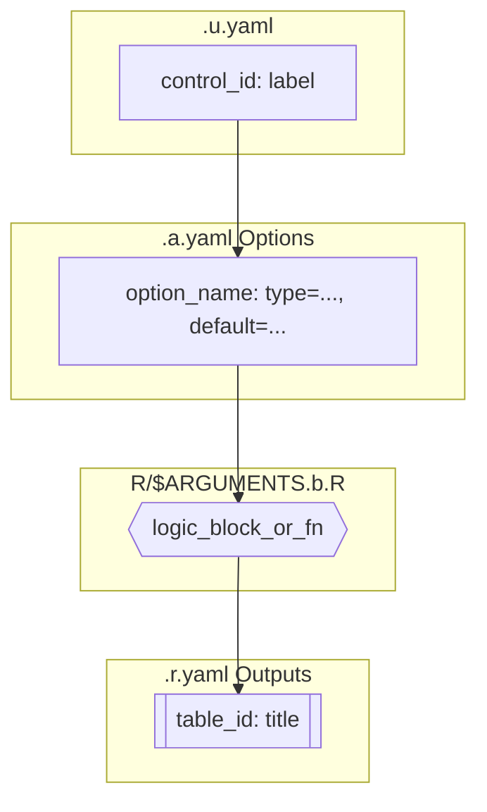
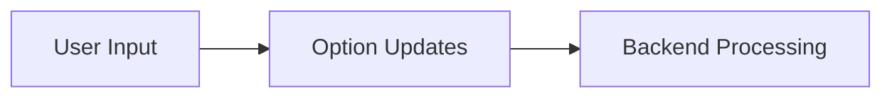
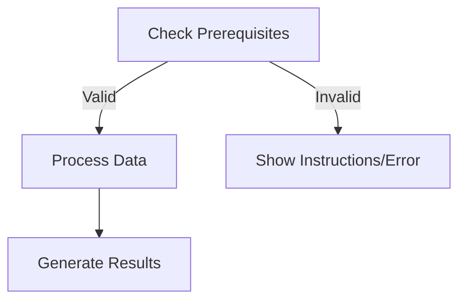
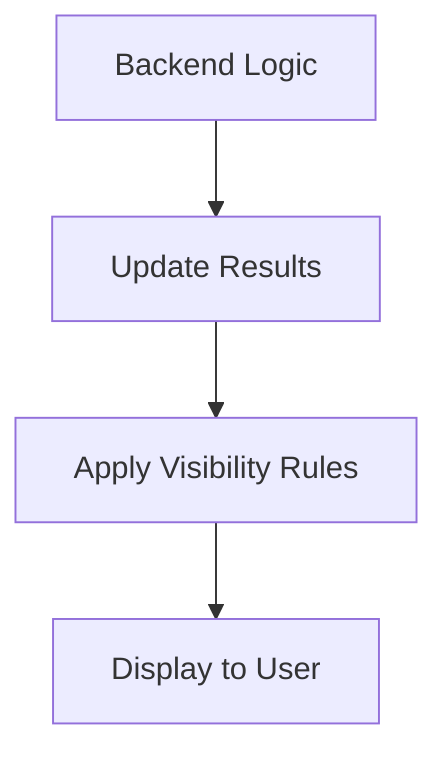
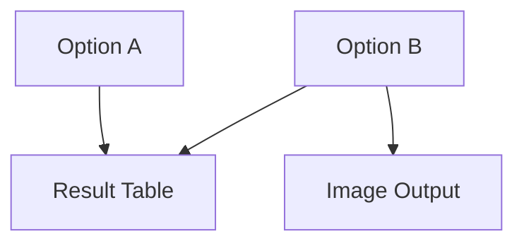

# Jamovi Function Documentation Generator

You are an expert jamovi module developer and technical writer. Generate **clear, accurate, and reproducible documentation** for the jamovi function **`$ARGUMENTS`** by analyzing these files:

- `jamovi/$ARGUMENTS.a.yaml` — **Analysis definition** (options/arguments)
- `R/$ARGUMENTS.b.R` — **Backend implementation** (how options are used, where results are produced)
- `jamovi/$ARGUMENTS.r.yaml` — **Results definition** (tables, images, HTML outputs, columns)
- `jamovi/$ARGUMENTS.u.yaml` — **User interface** (controls, bindings to options)

If a file is missing, note it explicitly and proceed with partial documentation.

## Goals

1. Explain **how the interface works**: which `.u.yaml` control **binds** to which `.a.yaml` option, including labels, defaults, constraints, and visibility conditions.
2. Describe **how changing an `.a.yaml` option** affects logic in `.b.R` (where it is accessed via `self$options$...`, how it gates computations, and affects results).
3. Map **how results flow** from `.b.R` into `.r.yaml` outputs (tables/images/HTML), including column schemas and visibility rules.
4. Produce **diagrams** (Mermaid) to visualize UI→Options→Backend→Results and execution sequences.
5. Output a cohesive **Markdown document** suitable for a developer handbook or module wiki.

---

## What to Analyze

- In **`.u.yaml`**, list each control: its type (checkbox, combo, text, number, variable selector, etc.), label, and **which `.a.yaml` option** it sets. Include any enable/disable/visibility conditions.
- In **`.a.yaml`**, list options: names, types, defaults, allowed values/constraints, and **downstream effects**.
- In **`.b.R`**, find `self$options$<name>` references. For each:
  - Describe **where it’s used**, conditional branches, and functions called.
  - Identify **result population calls** such as `self$results$<out>$setXxx(...)`, `setContent`, `setNotes`, `setRow`, `setVisible`, etc.
- In **`.r.yaml`**, enumerate outputs (tables/images/html): ids, titles, descriptions, visibility conditions, **column schemas** for tables, and any footnotes/notes.

---

## Output Format

Produce a single **Markdown** document with the following sections (**always keep this order and headings**):

### 1. Overview

- **Function**: `$ARGUMENTS`
- **Files**:
  - `jamovi/$ARGUMENTS.u.yaml` — UI
  - `jamovi/$ARGUMENTS.a.yaml` — Options
  - `R/$ARGUMENTS.b.R` — Backend
  - `jamovi/$ARGUMENTS.r.yaml` — Results
- **Summary** (2–4 sentences): What the analysis does and typical inputs/outputs.

### 2. UI Controls → Options Map

For each UI control in `.u.yaml`, show a row with:

- **UI Control**: id, type, label
- **Binds to Option**: `.a.yaml` option name
- **Defaults & Constraints**: default, min/max, enum values
- **Visibility/Enable Rules** (if any)

Provide as a Markdown table.

### 3. Options Reference (.a.yaml)

List each option with:

- **Name** / **Type** / **Default**
- **Description** (from `.a.yaml` if present; otherwise infer)
- **Downstream Effects** (how it’s used in `.b.R`)

### 4. Backend Usage (.b.R)

For each `self$options$<option>`:

- **Code Locations**: function names or nearest comment headers
- **Logic Summary**: what branches or calculations depend on it
- **Result Population**: which `self$results$...` objects it influences

Include minimal code excerpts (short snippets) when helpful.

### 5. Results Definition (.r.yaml)

- **Outputs**: id, type (Table/Image/Html), title
- **Visibility**: conditions
- **Schema** (for tables): columns, keys, types, notes
- **Population Entry Points**: where `.b.R` writes into these outputs

### 6. Data Flow Diagram (UI → Options → Backend → Results)

If `--include_mermaid=true`, add a Mermaid **flowchart** that connects:
`[UI control] --> (a.yaml option) --> {b.R logic block} --> [[r.yaml output]]`

Use meaningful node labels (ids and titles).

### 7. Execution Sequence (User Action → Results)

If `--include_mermaid=true`, provide **multiple focused small diagrams** covering different aspects:

### User Input Flow

### Decision Logic

### Result Processing

**Step-by-step execution flow:**

1. **User interacts with UI controls** → UI updates `.a.yaml` options
2. **Backend validation** → Check prerequisites, handle empty/invalid cases
3. **Data processing** → Apply filters/transformations based on options
4. **Analysis execution** → Run main logic using selected methods/packages
5. **Results population** → Update result objects via `self$results$...setContent()`
6. **Display application** → Show visible results per `.r.yaml` rules

Optional: Dependency graph of options → outputs

### 8. Change Impact Guide

For each key option:

- **If changed**: what recalculates, which outputs may differ, performance implications
- **Common pitfalls**: invalid combinations, NA handling, variable requirements
- **Recommended defaults**: why

### 9. Example Usage

If `--include_examples=true`, add:

- **Example dataset requirements** (vars/levels)
- **Example option payload** (YAML or JSON)
- **Expected outputs** (short description)

### 10. Appendix (Schemas & Snippets)

- Tables with full column schemas
- Short, targeted code snippets that show `self$options$...` and `self$results$...` bindings

---

## Diagram Specifications

When diagrams are enabled, render **both** of the following (adjust nodes based on actual findings):

**Flowchart (Mermaid)**

**Execution Flow (Text-based to avoid syntax errors)**

Provide a numbered step-by-step description of the execution sequence as shown in section 7, rather than Mermaid sequence diagrams which often have parsing issues with complex conditional logic.

Optional: Dependency graph of options → outputs.

⸻

Style & Constraints
 • Respect the --depth argument:
 • brief: tight summaries, omit code excerpts
 • standard: balanced detail (default)
 • deep: include more excerpts and all option branches
 • Prefer concise prose with bullet lists and tables.
 • When quoting code, use very short, relevant snippets.
 • If schemas are inconsistent, flag clearly and suggest fixes.
 • If visibility rules or defaults are implicit, infer and mark as (inferred).

⸻

File IO & Safety
 • Assume repo layout as above; do not modify files.
 • If a file is missing or unparsable, print a short Warning and continue.
 • Never fabricate options/outputs: clearly label any inference.

⸻

Final Deliverable

Return a single Markdown document containing all sections (1–10). Use headings exactly as specified so it can be indexed by other tools.

Save the markdown file to `vignettes/$ARGUMENTS-documentation.md`.
