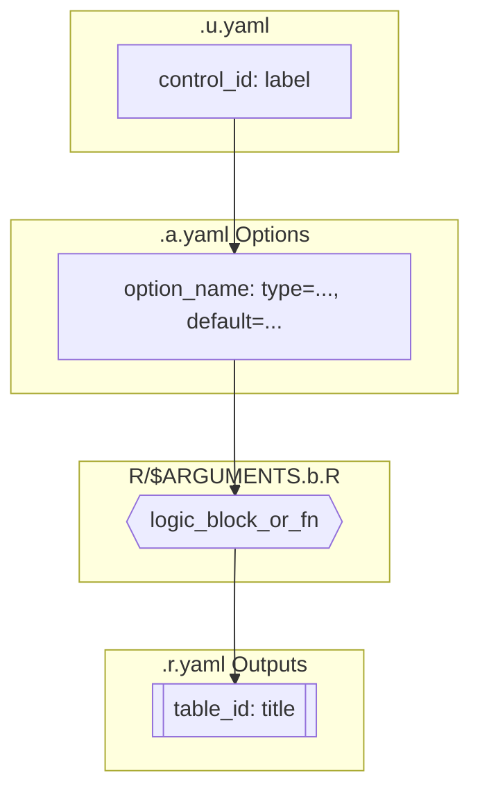
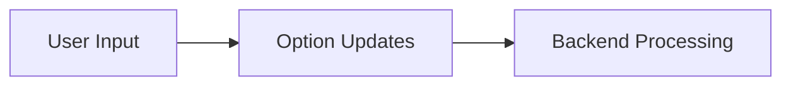
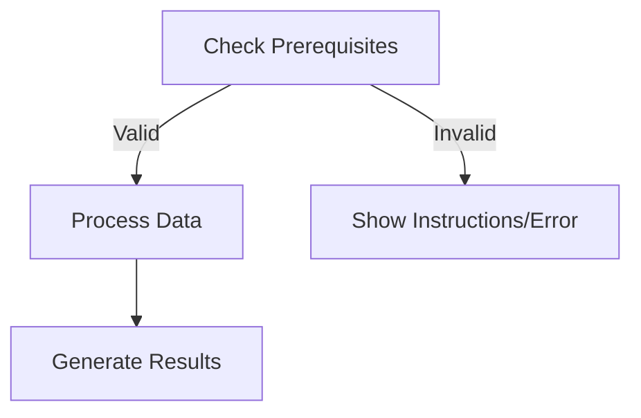
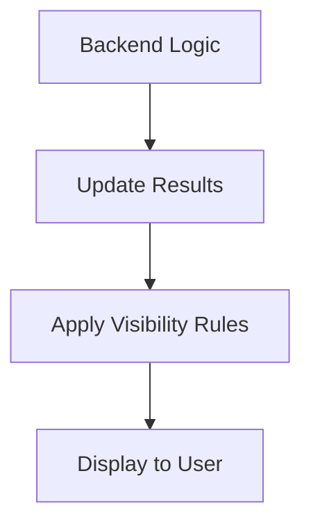
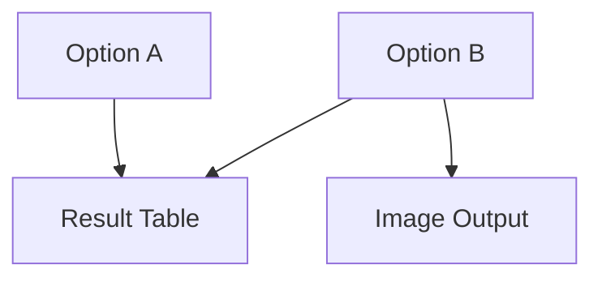

# Jamovi Function Documentation Suite Generator

You are an expert jamovi module developer, biostatistician, and technical writer. Generate a **comprehensive documentation suite** for the jamovi function **`$ARGUMENTS`** by analyzing these files:

- `jamovi/$ARGUMENTS.a.yaml` — **Analysis definition** (options/arguments)
- `R/$ARGUMENTS.b.R` — **Backend implementation** (how options are used, where results are produced)
- `jamovi/$ARGUMENTS.r.yaml` — **Results definition** (tables, images, HTML outputs, columns)
- `jamovi/$ARGUMENTS.u.yaml` — **User interface** (controls, bindings to options)

If a file is missing, note it explicitly and proceed with partial documentation.

---

## Documentation Suite Overview

This command generates **four** complementary documents (controlled by `--docs`):

| Document | File Pattern | Purpose | Audience |
|----------|-------------|---------|----------|
| **Developer Documentation** | `vignettes/$ARGUMENTS-documentation.md` | UI → Options → Backend → Results mapping with Mermaid diagrams | Developers |
| **Feature Mapping** | `vignettes/${ARGUMENTS}_documentation.md` | Concise feature-to-code table (YAML → UI → Results → R function) | Developers & QA |
| **Testing Checklist** | `vignettes/testing_$ARGUMENTS.md` | Test scenarios with datasets, variables, options, and coverage matrix | QA & Testers |
| **Comprehensive Vignette** | `vignettes/{module}-$ARGUMENTS-comprehensive.Rmd` | Executable R Markdown with all feature demonstrations | Users & Developers |

**Module prefix mapping** (based on `menuGroup` in `.a.yaml`):
- `SurvivalT` → `jsurvival`
- `Descriptives` / `ClinicoPath` → `clinicopath-descriptives`
- `DecisionTools` / `meddecide` → `meddecide`
- `JJStatsPlot` → `jjstatsplot`
- Otherwise → derive from `menuGroup` in lowercase

When `--docs=all` (default), generate all four. Otherwise, generate only the specified documents (comma-separated, e.g., `--docs=testing,vignette`).

---

## Goals

1. Explain **how the interface works**: which `.u.yaml` control **binds** to which `.a.yaml` option, including labels, defaults, constraints, and visibility conditions.
2. Describe **how changing an `.a.yaml` option** affects logic in `.b.R` (where it is accessed via `self$options$...`, how it gates computations, and affects results).
3. Map **how results flow** from `.b.R` into `.r.yaml` outputs (tables/images/HTML), including column schemas and visibility rules.
4. Produce **diagrams** (Mermaid) to visualize UI→Options→Backend→Results and execution sequences.
5. Create a **testing checklist** with concrete test scenarios, datasets, and complete option coverage.
6. Create an **executable vignette** demonstrating every feature with real function calls.
7. Output cohesive **Markdown/Rmd documents** suitable for a developer handbook, QA process, and user guide.

---

## What to Analyze

- In **`.u.yaml`**, list each control: its type (checkbox, combo, text, number, variable selector, etc.), label, and **which `.a.yaml` option** it sets. Include any enable/disable/visibility conditions.
- In **`.a.yaml`**, list options: names, types, defaults, allowed values/constraints, and **downstream effects**.
- In **`.b.R`**, find `self$options$<name>` references. For each:
  - Describe **where it's used**, conditional branches, and functions called.
  - Identify **result population calls** such as `self$results$<out>$setXxx(...)`, `setContent`, `setNotes`, `setRow`, `setVisible`, etc.
- In **`.r.yaml`**, enumerate outputs (tables/images/html): ids, titles, descriptions, visibility conditions, **column schemas** for tables, and any footnotes/notes.
- In **`data/`** and **`data-raw/`**, identify available test datasets for this function.

---

## Update Mode (Existing Doc Awareness)

**Non-Destructive Update Policy:** When updating an existing doc, do **not remove** correct, author-written content. Prefer **repairing** broken pieces and **appending** missing mappings/diagrams. Only replace text that is demonstrably outdated or incorrect.

**How to use a prior doc (if provided in the message or as an attachment):**

1. Treat existing files as the baseline.
2. Preserve narrative sections and headings; re-sync only the affected subsections.
3. Fix broken Mermaid blocks (validate minimal syntax) and keep node ids/titles stable.
4. Append a **Changelog** (see section 1a) summarizing edits.
5. If the prior doc is not provided, proceed with a fresh doc and note that the baseline was unavailable.

---

# DOCUMENT 1: Developer Documentation

**File:** `vignettes/$ARGUMENTS-documentation.md`

Produce a single **Markdown** document with the following sections (**always keep this order and headings**):

### 1. Overview

- **Function**: `$ARGUMENTS`
- **Files**:
  - `jamovi/$ARGUMENTS.u.yaml` — UI
  - `jamovi/$ARGUMENTS.a.yaml` — Options
  - `R/$ARGUMENTS.b.R` — Backend
  - `jamovi/$ARGUMENTS.r.yaml` — Results
- **Summary** (2–4 sentences): What the analysis does and typical inputs/outputs.

### 1a. Changelog (if updating an existing doc)

- Date: <YYYY-MM-DD>
- Summary: 1–3 bullets on what changed
- Changes:
  - Options: added/removed/renamed; defaults updated
  - Backend: logic changes, new result population calls
  - Results schema: table/column id changes, visibility tweaks
  - Diagrams: fixes/updates

### 2. UI Controls → Options Map

For each UI control in `.u.yaml`, show a row with:

- **UI Control**: id, type, label
- **Binds to Option**: `.a.yaml` option name
- **Defaults & Constraints**: default, min/max, enum values
- **Visibility/Enable Rules** (if any)

Provide as a Markdown table.

### 3. Options Reference (.a.yaml)

List each option with:

- **Name** / **Type** / **Default**
- **Description** (from `.a.yaml` if present; otherwise infer)
- **Downstream Effects** (how it's used in `.b.R`)

### 4. Backend Usage (.b.R)

For each `self$options$<option>`:

- **Code Locations**: function names or nearest comment headers
- **Logic Summary**: what branches or calculations depend on it
- **Result Population**: which `self$results$...` objects it influences

Include minimal code excerpts (short snippets) when helpful.

### 5. Results Definition (.r.yaml)

- **Outputs**: id, type (Table/Image/Html), title
- **Visibility**: conditions
- **Schema** (for tables): columns, keys, types, notes
- **Population Entry Points**: where `.b.R` writes into these outputs

### 6. Data Flow Diagram (UI → Options → Backend → Results)

*When updating, reuse node ids/titles where possible to minimize diff churn across versions.*

If `--include_mermaid=true`, add a Mermaid **flowchart** that connects:
`[UI control] --> (a.yaml option) --> {b.R logic block} --> [[r.yaml output]]`

Use meaningful node labels (ids and titles).


```mermaid
flowchart TD
  subgraph UI[.u.yaml]
    U1[control_id: label]
    %% Add more controls...
  end

  subgraph A[.a.yaml Options]
    A1[option_name: type=..., default=...]
    %% Add more options...
  end

  subgraph B[R/$ARGUMENTS.b.R]
    B1{{logic_block_or_fn}}
    %% Add more logic nodes...
  end

  subgraph RY[.r.yaml Outputs]
    R1[[table_id: title]]
    %% Add more outputs...
  end

  U1 --> A1
  A1 --> B1
  B1 --> R1
```

### 7. Execution Sequence (User Action → Results)

If `--include_mermaid=true`, provide **multiple focused small diagrams** covering different aspects:

#### User Input Flow


```mermaid
flowchart LR
  A[User Input] --> B[Option Updates] --> C[Backend Processing]
```

#### Decision Logic


```mermaid
flowchart TD
  A[Check Prerequisites] -->|Valid| B[Process Data]
  A -->|Invalid| C[Show Instructions/Error]
  B --> D[Generate Results]
```

#### Result Processing


```mermaid
flowchart TD
  A[Backend Logic] --> B[Update Results]
  B --> C[Apply Visibility Rules]
  C --> D[Display to User]
```

**Step-by-step execution flow:**

1. **User interacts with UI controls** → UI updates `.a.yaml` options
2. **Backend validation** → Check prerequisites, handle empty/invalid cases
3. **Data processing** → Apply filters/transformations based on options
4. **Analysis execution** → Run main logic using selected methods/packages
5. **Results population** → Update result objects via `self$results$...setContent()`
6. **Display application** → Show visible results per `.r.yaml` rules


```mermaid
graph TD
  Opt1[Option A] --> R1[Result Table]
  Opt2[Option B] --> R1
  Opt2 --> R2[Image Output]
```

Optional: Dependency graph of options → outputs

### 8. Change Impact Guide

For each key option:

- **If changed**: what recalculates, which outputs may differ, performance implications
- **Common pitfalls**: invalid combinations, NA handling, variable requirements
- **Recommended defaults**: why

### 9. Example Usage

If `--include_examples=true`, add:

- **Example dataset requirements** (vars/levels)
- **Example option payload** (YAML or JSON)
- **Expected outputs** (short description)

### 10. Appendix (Schemas & Snippets)

- Tables with full column schemas
- Short, targeted code snippets that show `self$options$...` and `self$results$...` bindings

---

# DOCUMENT 2: Feature Mapping Table

**File:** `vignettes/${ARGUMENTS}_documentation.md`

Generate a concise feature-to-code mapping document. Follow the pattern from existing examples like `agreement_documentation.md` and `nogoldstandard_documentation.md`.

### Structure

```markdown
# {Function Title} Documentation

This document provides a comprehensive overview of the {Function Title} module,
detailing its features, user interface elements, and the underlying R functions.

## Feature Summary

{2-3 paragraph overview of the module's purpose, target users, and main capabilities.
Group features into logical categories.}

## Feature Details

The following table provides a detailed mapping of the module's features,
from the user interface to the underlying R functions.

| Feature | YAML Argument (`.a.yaml`) | UI Label | Results Section (`.r.yaml`) | R Function (`.b.R`) |
|---------|---------------------------|----------|----------------------------|---------------------|
| **Category Name** | | | | |
| Feature name | `option_name` | UI label text | `result_id` | `.methodName` |
```

### Requirements

- Group features into logical categories (Input Variables, Model Options, Core Results, Plots, Output Variables, Explanatory Output, etc.)
- Map **every** `.a.yaml` option to its UI label, result section, and R method
- Use **bold** for category headers in the Feature column
- Use backtick formatting for option names, result IDs, and R methods
- Include a row for each feature even if the R function is "Not implemented in `.b.R`"
- Note computed/derived features that don't have a direct option (use `—` for missing fields)

---

# DOCUMENT 3: Testing Checklist

**File:** `vignettes/testing_$ARGUMENTS.md`

Generate a comprehensive testing plan. Follow the pattern from existing examples like `testing_agreement.md`, `testing_enhancedROC.md`, and `testing_psychopdaROC.md`.

### Structure

```markdown
# Testing {Function Title}

All test datasets are in `data-raw/` (CSV) or `data/` (RDA).
{Add any generation script info if applicable.}

---

## 1. {SCENARIO CATEGORY NAME}

| # | File | Variables | Options to Test |
|---|------|-----------|-----------------|
| 1 | `dataset_name` | var1: `col1`, var2: `col2`, ... | Option list with specific values to test |
| 2 | `dataset_name` | ... | ... |

**Options covered:** `opt1`, `opt2`, `opt3`, ...

---

## 2. {NEXT SCENARIO CATEGORY}
...

## N. EDGE CASES
...

## NEW DATA FILES GENERATED (if applicable)

| File | Description | Columns |
|------|-------------|---------|
| `dataset.csv` | Description | col1, col2, ... |

---

## COMPLETE OPTION COVERAGE CHECKLIST

- [x] `option_name` — test #N
- [ ] `option_name` — not yet tested
```

### Requirements

- **Group test scenarios** by functional area (e.g., "Standard Clinical", "High-Dimensional", "Small Sample", "Edge Cases", "Display Options")
- **Reference real datasets** from `data/` and `data-raw/` directories; list exact variable names
- **Specify exact option values** to test (not just "test this option" but "set `lambda` to `lambda.min`")
- **Cover every `.a.yaml` option** at least once in the test matrix
- **Include edge cases**: empty data, all censored, perfect separation, single predictor, all categorical, etc.
- **End with a complete option coverage checklist** showing which test number covers each option
- **Include dataset table** if new test data files are needed
- Test scenarios should be **numbered sequentially** across all sections

---

# DOCUMENT 4: Comprehensive Vignette (R Markdown)

**File:** `vignettes/{module}-$ARGUMENTS-comprehensive.Rmd`

Generate an executable R Markdown vignette demonstrating every feature. Follow the pattern from existing examples like `meddecide-enhancedroc-comprehensive.Rmd` and `meddecide-psychopdaroc-comprehensive.Rmd`.

### Structure

````markdown
---
title: "{Function Title} - Comprehensive Guide"
output: rmarkdown::html_vignette
vignette: >
  %\VignetteIndexEntry{{Function Title} - Comprehensive Guide}
  %\VignetteEngine{knitr::rmarkdown}
  %\VignetteEncoding{UTF-8}
---

```{r setup, include=FALSE}
knitr::opts_chunk$set(
  eval = TRUE,
  echo = TRUE,
  collapse = TRUE,
  comment = "#>",
  error = TRUE,
  warning = FALSE,
  message = FALSE,
  fig.width = 7,
  fig.height = 5
)
devtools::load_all(".")
data_path <- "data-raw/non-rda/"
data_path2 <- "data/"
```

> **Note:** The `$ARGUMENTS()` function is designed for use within **jamovi's GUI**.
> The code examples below show the R syntax for reference.

# {Function Title}

## Overview

{2-3 paragraph description of the analysis, its purpose, and key features.}

---

## Datasets Used in This Guide

| Dataset | N | Key Features | Primary Use |
|---------|---|--------------|-------------|
| `dataset1` | 250 | Description | Scenario |

---

## 1. {First Feature Category}

### Basic usage

```{r basic-example}
data1 <- read.csv(paste0(data_path, "dataset1.csv"))

$ARGUMENTS(
  data = data1,
  option1 = "value1",
  option2 = "value2"
)
```

### With additional options

```{r advanced-example}
$ARGUMENTS(
  data = data1,
  option1 = "value1",
  option3 = TRUE
)
```

## 2. {Next Feature Category}
...

## N. Edge Cases
...

## References
...
````

### Requirements

- **YAML front matter** with proper VignetteIndexEntry, VignetteEngine, VignetteEncoding
- **Setup chunk** with `devtools::load_all(".")` (not `library()`) and `error = TRUE`
- **Note about jamovi GUI** — the function is designed for jamovi, R syntax is for reference
- **Datasets table** listing all datasets used with N, key features, and primary use
- **One section per feature category** with subsections for basic/advanced usage
- **Every `.a.yaml` option** demonstrated in at least one code chunk
- **Realistic function calls** using actual parameter names from `.a.yaml`
- **Edge case section** demonstrating small samples, missing data, boundary conditions
- **Named code chunks** (e.g., `{r basic-example}`) for easy navigation
- Use `paste0(data_path, "filename.csv")` for data loading
- Include brief prose explaining what each example demonstrates and what to look for in output

---

## Diagram Specifications

When diagrams are enabled, render **both** of the following (adjust nodes based on actual findings):

**Flowchart (Mermaid)**


```mermaid
flowchart TD
  subgraph UI[.u.yaml]
    U1[control_id: label]
    %% Add more controls...
  end

  subgraph A[.a.yaml Options]
    A1[option_name: type=..., default=...]
    %% Add more options...
  end

  subgraph B[R/$ARGUMENTS.b.R]
    B1{{logic_block_or_fn}}
    %% Add more logic nodes...
  end

  subgraph RY[.r.yaml Outputs]
    R1[[table_id: title]]
    %% Add more outputs...
  end

  U1 --> A1
  A1 --> B1
  B1 --> R1
```

**Execution Flow (Text-based to avoid syntax errors)**

Provide a numbered step-by-step description of the execution sequence as shown in section 7, rather than Mermaid sequence diagrams which often have parsing issues with complex conditional logic.


```mermaid
graph TD
  Opt1[Option A] --> R1[Result Table]
  Opt2[Option B] --> R1
  Opt2 --> R2[Image Output]
```

Optional: Dependency graph of options → outputs.

---

## Style & Constraints

- Respect the `--depth` argument:
  - `brief`: tight summaries, omit code excerpts, fewer test scenarios
  - `standard`: balanced detail (default)
  - `deep`: include more excerpts, all option branches, exhaustive test matrix
- Prefer concise prose with bullet lists and tables.
- When quoting code, use very short, relevant snippets.
- If schemas are inconsistent, flag clearly and suggest fixes.
- If visibility rules or defaults are implicit, infer and mark as `(inferred)`.

---

## File IO & Safety

- Read all 4 jamovi files (`.a.yaml`, `.b.R`, `.r.yaml`, `.u.yaml`) to extract accurate information.
- Also scan `data/` and `data-raw/` for available test datasets matching the function name.
- If a file is missing or unparsable, print a short Warning and continue.
- Never fabricate options/outputs: clearly label any inference.

---

## Final Deliverable

Generate the requested documents (based on `--docs` flag):

1. **Developer Documentation** → `vignettes/$ARGUMENTS-documentation.md`
2. **Feature Mapping** → `vignettes/${ARGUMENTS}_documentation.md`
3. **Testing Checklist** → `vignettes/testing_$ARGUMENTS.md`
4. **Comprehensive Vignette** → `vignettes/{module}-$ARGUMENTS-comprehensive.Rmd`

If previous versions exist and were provided, include a **Changelog** section in each document summarizing differences.

When `--docs=all` (default), generate all four documents. Report which files were created/updated at the end.
