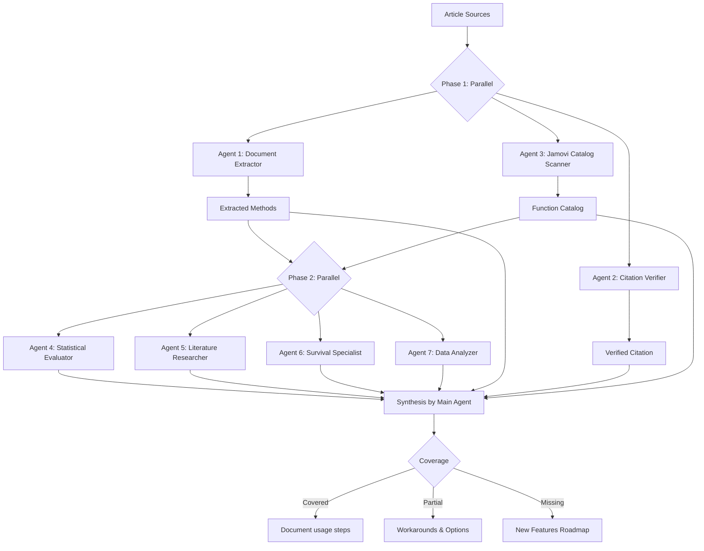
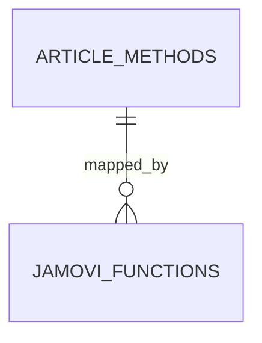

# Jamovi Coverage Review for Research Articles

You are an **expert jamovi module developer for ClinicoPathJamoviModule** and **an expert statistician in evaluating the correct use of statistical methods**. The user will attach or reference one or more article sources (PDF/HTML/Markdown/webpages/Word/PowerPoint/spreadsheets). Your task:

---

## SKILL ORCHESTRATION

This review workflow has access to a rich ecosystem of specialized skills. **Do not invoke all skills upfront** — call each one only when the workflow step genuinely needs it. Think of them as specialist consultants you bring in at the right moment, not a checklist to exhaust.

### When and How to Invoke Each Skill

#### Phase 1: Document Ingestion (Step 1 — Read & Parse)

These skills handle the raw input. Pick the one that matches the file type:

| Input Type | Skill to Invoke | When to Use |
|---|---|---|
| `.pdf` files | `pdf` | Always invoke for PDF articles. Extracts text, tables, and structured content. If extraction is poor (<150 tokens or garbled), fall back to `markitdown`. |
| `.docx` files | `docx` | Always invoke for Word documents. Extracts text with formatting, tracked changes, comments. |
| `.pptx` files | `pptx` | Invoke for conference posters or presentation slides. Extract slide text, speaker notes, embedded tables. |
| `.xlsx` / `.csv` files | `xlsx` | Invoke for supplementary data files, raw datasets, or statistical output tables. |
| Other formats (`.html`, images, mixed) | `markitdown` | Fallback converter for any format the dedicated skills cannot handle. Also use when a PDF has poor text extraction — convert first, then re-read. |

**Decision logic:**
1. Identify file extensions from the user's attachments/paths
2. Invoke the matching document skill to extract content
3. If extraction quality is poor (garbled text, <150 usable tokens), try `markitdown` as a fallback
4. For scanned PDFs or image-heavy documents, note that OCR limitations may apply — flag to user

#### Phase 2: Citation Verification (Step 1 continued — after extracting metadata)

Once you have the article's citation metadata (title, DOI, PMID, authors), verify and enrich it:

| Need | Skill to Invoke | When to Use |
|---|---|---|
| Verify DOI/PMID, get full metadata | `citation-management` | Invoke when you've extracted a DOI or PMID and want to confirm it's correct, generate a BibTeX entry, or fill in missing citation fields (journal, volume, pages). |
| Look up article in PubMed | `pubmed-database` | Invoke when: (a) you have a PMID to verify, (b) you want to check retraction/correction status, (c) you need MeSH terms for context, or (d) the extracted title doesn't match the DOI and you need to cross-check. |
| Broader scholarly search | `openalex-database` | Invoke when: (a) the article isn't in PubMed (e.g., engineering, non-biomedical), (b) you want citation counts or impact metrics, or (c) you want to find the article's citation network. |
| Check for preprint versions | `biorxiv-database` | Invoke when the article mentions a preprint, or when you want to check if an earlier version with different methods/results exists. Useful for detecting method changes between preprint and published version. |

**Decision logic:**
1. If DOI is present → `citation-management` to verify and generate BibTeX
2. If PMID is present → `pubmed-database` to pull full record and check retraction status
3. If citation fields are incomplete → try `pubmed-database` or `openalex-database` to fill gaps
4. Only invoke `biorxiv-database` if there's a specific reason (preprint mentioned, or the article is very recent and may have a preprint with different methods)

#### Phase 3: Statistical Evaluation (Step 5 — Critical Evaluation)

These skills deepen your statistical critique. Use them when your own analysis needs reinforcement or when the methods are complex:

| Need | Skill to Invoke | When to Use |
|---|---|---|
| Verify test selection & assumptions | `statistical-analysis` | Invoke when the article uses a non-standard test, when you're unsure if the test matches the data structure, or when you want to verify power calculations. Especially useful for complex designs (repeated measures, nested, crossover). |
| Structured methodology review | `peer-review` | Invoke to generate a formal peer-review-style assessment with CONSORT/STROBE compliance checking. Use when the article is a clinical trial or observational study where reporting standards matter. |
| Evidence quality assessment | `scientific-critical-thinking` | Invoke when you need to evaluate the overall evidence quality using frameworks like GRADE, or assess risk of bias (Cochrane RoB). Particularly valuable for systematic reviews, meta-analyses, or when the conclusions seem to overreach the evidence. |
| Validate survival analysis | `scikit-survival` | Invoke when the article uses survival methods (Cox, KM, competing risks, time-dependent covariates) and you want to verify the approach or suggest improvements. Cross-reference with ClinicoPath's jsurvival module. |
| Analyze supplementary data | `exploratory-data-analysis` | Invoke when the user provides supplementary datasets (.csv, .xlsx) alongside the article and wants you to verify the reported results or explore the data independently. |
| Suggest alternative approaches | `hypothesis-generation` | Invoke when you identify methodological gaps and want to suggest alternative analytical frameworks the authors could have used. Useful for the Gap Analysis section. |

**Decision logic:**
1. Always consider `statistical-analysis` for the critical evaluation — it strengthens your assessment
2. Use `peer-review` for clinical studies where reporting standards (CONSORT, STROBE, PRISMA) apply
3. Use `scientific-critical-thinking` when the article makes strong causal claims or when you detect potential bias
4. Use `scikit-survival` only when survival analysis is a major component of the article
5. Use `exploratory-data-analysis` only when the user explicitly provides raw data
6. Use `hypothesis-generation` sparingly — only when obvious methodological alternatives exist

#### Phase 4: Literature Context (Steps 3–4 — Gap Analysis & Roadmap)

When you need to understand how a method fits into the broader literature, or verify whether an approach is current best practice:

| Need | Skill to Invoke | When to Use |
|---|---|---|
| Quick factual lookup | `research-lookup` | Invoke for quick checks: "Is method X still recommended?", "What's the current standard for Y?", "When was this approach superseded?" Fast and lightweight — use this first. |
| Systematic literature search | `literature-review` | Invoke when you need a thorough search — e.g., "What methods are recommended for competing risks in pathology?" or when evaluating whether the article's approach is state-of-the-art. More thorough than research-lookup but slower. |

**Decision logic:**
1. For quick method validation → `research-lookup` first (fast)
2. For comprehensive method landscape → `literature-review` (when gaps suggest the article may be using outdated methods, or when the roadmap needs evidence for which alternative to recommend)
3. Don't invoke either for well-established methods (t-test, chi-square, standard Cox) — your own knowledge suffices

#### Phase 5: Visualization & Output (Final Deliverables)

These skills enhance the review output. Invoke based on what would add genuine value:

| Need | Skill to Invoke | When to Use |
|---|---|---|
| Analysis flow diagrams | `scientific-schematics` | Invoke to create a publication-quality diagram showing the article's analytical pipeline or the coverage mapping. Use when the article has a complex multi-step analysis that benefits from visual summary. |
| Histopathology image analysis | `histolab` | Invoke when the article contains H&E or IHC images and the statistical methods relate to image-derived measurements. Helps verify whether image analysis methods are appropriate. |
| Computational pathology | `pathml` | Invoke when the article involves digital pathology, whole-slide imaging, or ML-based pathology classification. Assess whether their computational pathology pipeline is sound. |
| Summary visualization | `scientific-visualization` | Invoke to recreate or critique figures from the article, or to generate improved versions showing what the analysis should look like. |
| Generate diagrams | `generate-image` | Invoke for creating custom diagrams, workflow illustrations, or visual summaries that go beyond what Mermaid can express. |
| Scientific prose writing | `scientific-writing` | Invoke when the user requests the final review in formal scientific prose rather than the default structured markdown. Also useful for writing the executive summary. |
| Presentation output | `scientific-slides` | Invoke only if the user explicitly asks for a slide deck summary of the review. |
| Poster output | `latex-posters` | Invoke only if the user explicitly asks for a poster-format summary. |

**Decision logic:**
1. `scientific-schematics` — invoke for articles with 3+ analytical steps or complex pipelines
2. `histolab` / `pathml` — invoke only when the article is about digital/computational pathology
3. `scientific-visualization` — invoke when article figures are critiqued or improvements suggested
4. `scientific-writing` / `scientific-slides` / `latex-posters` — invoke only on explicit user request
5. `generate-image` — invoke when a custom visual would genuinely clarify the review

### Orchestration Principles

1. **Contextual, not exhaustive**: A typical review might invoke 3–5 skills. A simple methods review of a well-structured PDF might only need `pdf` + `citation-management`. A complex computational pathology paper with supplementary data might need 8+.

2. **Fail gracefully**: If a skill is unavailable or fails, note it and continue. The review should always produce useful output even with zero skill invocations.

3. **Compound when possible**: If you need both `pubmed-database` and `citation-management`, invoke them in the same turn (they're independent). Don't serialize unnecessarily.

4. **Report what you used**: In the final deliverable, include a brief "Skills Invoked" note listing which skills were called and why, so the user understands the depth of the review.

---

## AGENT TEAM ORCHESTRATION

For complex articles (multiple sources, supplementary data, survival/computational pathology methods), use the **Agent tool** to spawn specialized subagents that work in parallel. This dramatically reduces review time by running independent phases concurrently instead of sequentially.

### When to Use Agent Teams

**Use agent teams when:**
- The article has 2+ source files (main PDF + supplements, data files, presentations)
- The article involves multiple distinct analytical domains (e.g., survival + imaging + genomics)
- The user requests a deep review with literature context and data verification
- You need both citation verification AND statistical evaluation (independent tasks)

**Don't use agent teams when:**
- Single short article with straightforward methods (t-test, chi-square, basic Cox)
- The user wants a quick skim, not a deep review
- Only one source file with no supplementary materials

### Agent Team Architecture

Spawn agents using the `Agent` tool. Each agent gets a focused objective and returns a structured result that you synthesize into the final report.

#### Parallel Launch Pattern — Phase 1 (Ingestion + Citation)

After identifying all input files, launch these agents **simultaneously in one message**:

**Agent 1: Document Extractor** (`subagent_type: "general-purpose"`)
```
Prompt: "Read and extract all content from [file path(s)]. Extract:
- Full text with section structure
- All tables (preserve formatting)
- Figure captions and descriptions
- Citation metadata (title, DOI, PMID, authors, journal, year)
- All statistical methods mentioned (test names, models, software)
Save extracted content to a structured summary.
Use the `pdf`/`docx`/`pptx`/`xlsx`/`markitdown` skill as appropriate for each file type."
```

**Agent 2: Citation Verifier** (`subagent_type: "general-purpose"`)
```
Prompt: "Verify citation metadata for this article: [title/DOI/PMID].
- Use `citation-management` skill to generate BibTeX from DOI
- Use `pubmed-database` skill to check retraction/correction status and pull MeSH terms
- Use `openalex-database` skill to get citation count and impact metrics
- If title suggests a preprint may exist, use `biorxiv-database` to check
Return: complete citation table, BibTeX entry, retraction status, MeSH terms."
```

**Agent 3: Jamovi Catalog Scanner** (`subagent_type: "Explore"`)
```
Prompt: "Scan the ClinicoPath jamovi module repository to build a function catalog.
Read jamovi/*.a.yaml, jamovi/*.r.yaml, jamovi/*.u.yaml, and R/*.b.R files.
For each function, extract: name, purpose, inputs, outputs, key options.
Return a structured catalog organized by domain (descriptives, survival, decision, plots)."
```

#### Parallel Launch Pattern — Phase 2 (Analysis + Literature)

After Phase 1 agents return and you have the extracted methods list, launch:

**Agent 4: Statistical Methods Evaluator** (`subagent_type: "general-purpose"`)
```
Prompt: "Critically evaluate these statistical methods from a research article:
[paste extracted methods list]
Study design: [design summary]
Sample size: [N]

Use `statistical-analysis` skill to verify test selection and assumptions.
Use `peer-review` skill to check CONSORT/STROBE compliance (if applicable).
Use `scientific-critical-thinking` skill to assess evidence quality and bias.

Return: scoring rubric (0-2 per aspect), red flags, and recommendations
following the 9-aspect checklist (design-method alignment, assumptions,
sample size, multiplicity, model specification, missing data, effect sizes,
validation, reproducibility)."
```

**Agent 5: Literature Context Researcher** (`subagent_type: "general-purpose"`)
```
Prompt: "Research the current best practices for these statistical methods
used in pathology/clinical research:
[list methods that are non-standard or potentially outdated]

Use `research-lookup` skill for quick method validation.
Use `literature-review` skill if deeper search is needed.

For each method, report:
- Is this still recommended? Any newer alternatives?
- Key references supporting or criticizing this approach
- Frequency of use in recent pathology literature"
```

**Agent 6: Survival Analysis Specialist** (only if survival methods present, `subagent_type: "general-purpose"`)
```
Prompt: "Validate the survival analysis approach in this article:
[paste survival-specific methods and results]

Use `scikit-survival` skill to verify:
- Cox model specification and PH assumption handling
- KM estimation appropriateness
- Competing risks methodology (if applicable)
- Calibration and discrimination metrics

Cross-reference with ClinicoPath jsurvival module capabilities.
Return: validation assessment, coverage gaps, improvement suggestions."
```

**Agent 7: Supplementary Data Analyzer** (only if raw data provided, `subagent_type: "general-purpose"`)
```
Prompt: "Analyze this supplementary dataset:
[file path]

Use `xlsx` or `exploratory-data-analysis` skill to:
- Verify reported sample sizes and group distributions
- Check for data quality issues (missing values, outliers, duplicates)
- Attempt to reproduce key reported statistics
Return: data quality report, reproducibility check results."
```

#### Sequential Phase — Synthesis

After all parallel agents return, **you** (the main agent) synthesize their outputs:
1. Merge Document Extractor output with Citation Verifier results → Article Summary + Citation table
2. Cross-reference extracted methods against Jamovi Catalog → Coverage Matrix
3. Integrate Statistical Evaluator assessment → Critical Evaluation section
4. Incorporate Literature Context → Gap Analysis with evidence-based recommendations
5. Combine survival/data analysis results where applicable
6. Produce the unified final report

#### Optional Phase 3 — Visualization (if needed)

**Agent 8: Diagram Creator** (only for complex pipelines, `subagent_type: "general-purpose"`)
```
Prompt: "Create a publication-quality analysis flow diagram for this article's
analytical pipeline:
[paste pipeline summary]

Use `scientific-schematics` skill to generate the diagram.
Show: study design → data processing → each analytical step → outputs."
```

### Agent Configuration Guidelines

| Agent | `subagent_type` | `run_in_background` | Typical Duration |
|---|---|---|---|
| Document Extractor | `general-purpose` | `false` (need results to proceed) | 30-60s |
| Citation Verifier | `general-purpose` | `true` (independent) | 20-40s |
| Jamovi Catalog Scanner | `Explore` | `true` (independent) | 15-30s |
| Statistical Evaluator | `general-purpose` | `false` (need for synthesis) | 45-90s |
| Literature Researcher | `general-purpose` | `true` (can merge later) | 60-120s |
| Survival Specialist | `general-purpose` | `true` (conditional) | 30-60s |
| Data Analyzer | `general-purpose` | `true` (conditional) | 30-60s |
| Diagram Creator | `general-purpose` | `true` (optional) | 20-40s |

### Agent Team Principles

1. **Maximize parallelism**: Launch all independent agents in the same message. Phase 1 agents (Document Extractor, Citation Verifier, Catalog Scanner) are always independent. Phase 2 agents depend on Phase 1 results but are independent of each other.

2. **Background when possible**: Use `run_in_background: true` for agents whose results you don't need immediately. You'll be notified when they complete. Only block on agents whose output you need to proceed (typically Document Extractor in Phase 1, Statistical Evaluator in Phase 2).

3. **Conditional spawning**: Don't spawn the Survival Specialist if the article doesn't use survival methods. Don't spawn the Data Analyzer if no raw data is provided. Don't spawn the Diagram Creator for simple articles.

4. **Give complete context**: Each agent works independently — include all necessary context in the prompt. Don't assume agents can see each other's results. Pass extracted methods lists, file paths, and design summaries explicitly.

5. **Synthesize, don't concatenate**: When merging agent outputs into the final report, resolve conflicts (e.g., if the Statistical Evaluator and Literature Researcher disagree on method appropriateness), remove redundancy, and present a coherent narrative.

6. **Track what ran**: Log each spawned agent in the "Skills & Agents Invoked" output table so the user knows what happened behind the scenes.

---

## WORKFLOW STEPS

1) **READ & PARSE THE ARTICLE(S)**
   - Accept **attached files** (`.pdf`, `.docx`, `.pptx`, `.html`, `.md`, `.xlsx`) and/or **URLs** in the user message. Do not treat command-line arguments as file paths; they are used only as an optional label.
   - **Invoke the appropriate document skill** based on file type (see Phase 1 above). For PDFs use `pdf`, for Word docs use `docx`, for presentations use `pptx`, for spreadsheets use `xlsx`. Fall back to `markitdown` for unusual formats or when primary extraction fails.
   - If multiple items are provided, treat them as parts of the same article (supplements, appendices), unless obviously unrelated.
   - Extract:
     - Study type & design (e.g., retrospective cohort, case-control, RCT)
     - Sample size, groups, endpoints, repeated measures
     - **All statistical methods** used (tests, models, corrections, metrics)
     - Multiple-testing & post-hoc procedures
     - Effect size metrics, CIs, calibration, discrimination, validation
     - Assumption checks & diagnostics (normality, variance homogeneity, multicollinearity, PH assumption, etc.)
     - Citation metadata (from inline content only):
       - Title, Journal, Year, Volume, Issue, Pages
       - DOI (patterns like 10.x/xxxxx), PMID (patterns like PMID: or numeric in PubMed links)
       - If not present in inline text, leave blank and add a TODO in the citation table
   - **After extracting citation metadata**, invoke `citation-management` to verify DOI/PMID and generate BibTeX. Invoke `pubmed-database` to check retraction status and pull MeSH terms. See Phase 2 above.

2) **BUILD A LOCAL CATALOG OF CURRENT JAMOVI FUNCTIONS**
   - **Auto-scan the repo** (relative to this command file):
     - `jamovi/*.a.yaml` → option schemas (arguments)
     - `jamovi/*.r.yaml` → outputs
     - `jamovi/*.u.yaml` → UI definitions
     - `R/*.b.R`       → backend implementations
   - Derive a **function catalog**:
     - Function name (basename of files)
     - Purpose (infer from names, labels, help strings if present)
     - Inputs (vars/args), noteworthy options (e.g., paired, exact, corrections)
     - Outputs (tables/figures) and key statistics produced
   - If scanning fails (e.g., paths differ), fall back to **known functions** previously referenced by the user, but **prefer scanning**.

3) **MAP ARTICLE METHODS ↔ JAMOVI FUNCTIONS**
   - For each extracted method, find best matching jamovi function(s).
   - Determine **coverage**:
     - ✅ **Covered** (equivalent analysis possible as is)
     - 🟡 **Partially covered** (workarounds/manual steps needed)
     - ❌ **Not covered** (missing function/option)
   - For partial coverage, specify **exact missing bits** (e.g., "Welch-corrected ANOVA with Games-Howell post-hoc", "Benjamini–Yekutieli FDR", "robust Huber-M estimator", "GEE with exchangeable correlation", "time-dependent ROC").
   - Where multiple jamovi functions together reproduce the pipeline, enumerate the **sequence**.

4) **PRODUCE A CONCRETE ROADMAP**
   - For each ❌/🟡 gap, propose:
     - **Implementation target**: new function or extension of existing one
     - **Exact changes** to `.a.yaml`, `.b.R`, `.r.yaml`, `.u.yaml`
     - **Dependencies** (R packages), performance risks, UI implications
     - **Validation plan** (unit tests, reproducible examples)
   - Prioritize by:
     - Frequency of use in pathology literature
     - Effort vs. impact
     - Reusability across module functions
   - **For methods you're unsure about**, invoke `research-lookup` or `literature-review` to verify whether the article's approach is current best practice before recommending alternatives.

5) **CRITICALLY EVALUATE THE USE OF STATISTICAL METHODS**
   - **Invoke `statistical-analysis`** to strengthen your assessment of test selection and assumptions.
   - **Invoke `peer-review`** for clinical studies to check CONSORT/STROBE/PRISMA compliance.
   - **Invoke `scientific-critical-thinking`** when evaluating evidence quality or assessing bias.
   - Assess **design–method alignment**: does each method match study design, endpoints, and measurement scales?
   - Check **assumptions & diagnostics** actually reported (normality, variance homogeneity, independence, proportional hazards, linearity of logit, multicollinearity, influential points).
   - Review **sample size & power** rationale (a priori/retrospective), and whether precision (CIs) is adequate.
   - Examine **multiplicity control** (post‑hoc tests, familywise/FDR corrections) and whether it fits the analysis plan.
   - Evaluate **model specification**: confounder adjustment, variable selection risks (overfitting, data‑driven selection), interaction terms, non‑linearity handling (splines, transformations).
   - Inspect **missing data handling**: complete‑case vs. imputation (method, assumptions), sensitivity analyses.
   - Prefer **effect sizes with confidence intervals** over p‑values alone; note any over‑reliance on thresholds.
   - Verify **validation & calibration** for predictive models (internal/external, cross‑validation/bootstrapping, calibration slope/intercept, C‑index/AUC).
   - **If survival analysis is a major component**, invoke `scikit-survival` to validate the approach.
   - Check **reproducibility & transparency**: reporting of software/packages, versions, seeds, code/data availability.
   - Summarize **strengths, weaknesses, and risks of bias** with actionable recommendations for improvement.

---

## INPUTS

- **Article label** (optional): `$ARGUMENTS`
- **Sources**: All **attached** files and **URLs** explicitly mentioned in the invoking message.
  - Supported formats: `.pdf`, `.docx`, `.pptx`, `.xlsx`, `.csv`, `.html`, `.md`, `.txt`
  - For `.html` files, the accompanying resource folder (e.g., `p53.html` and `p53_files/`) is also accessible if present.
  - Ignore unrelated files in the same folder unless they are explicitly listed by the user.

If some sources are images or scanned PDFs, attempt OCR (if available) or rely on surrounding text/HTML. For histopathology images, consider invoking `histolab` or `pathml` if the images relate to the statistical methods under review. Always cite page/section when possible.

## FAILURE HANDLING & PARTIAL PROCESSING

- Treat each provided source independently; **never abort** the run due to a single failing file.
- If a source cannot be read or parsed:
  - First, **try the `markitdown` skill** as a fallback converter before giving up.
  - If still unreadable, emit a short entry under **Skipped Sources** with: (a) the path/URL, (b) a one‑line reason, and (c) a suggested conversion command (MarkItDown or pandoc) inside a fenced code block.
  - Do **not** attempt to execute conversion commands; print only.
- Continue analyzing all other readable sources.
- Common reasons to surface: unsupported extension, corrupted file, HTML requires resources folder, PDF extraction yielded < 150 tokens or mostly non‑alphanumeric, permission denied, file not found.
- If *no* readable sources remain, produce a minimal report with just **Skipped Sources** and a short note asking for converted `.md` or a better copy.

---

## OUTPUT FORMAT

### 📚 ARTICLE SUMMARY

- **Title/Label**: `$ARGUMENTS` (or inferred)
- **Design & Cohort**: [type, N, groups, endpoints]
- **Key Analyses**: bullet list

### 📑 ARTICLE CITATION

| Field   | Value |
|---------|-------|
| Title   |       |
| Journal |       |
| Year    |       |
| Volume  |       |
| Issue   |       |
| Pages   |       |
| DOI     |       |
| PMID    |       |
| Publisher |       |
| ISSN      |       |
| BibTeX  | (generated via `citation-management` if DOI/PMID available) |
| Retraction Status | (checked via `pubmed-database` if PMID available) |

Always attempt to capture these fields if visible; otherwise leave blank with TODO.

If unavailable in provided text, leave blank and add TODO.

### 🚫 Skipped Sources (if any)

Provide a tidy table of skipped items and reasons. For each row, also print a ready‑to‑run conversion snippet.

| Source | Reason | Suggested command |
|---|---|---|
| /path/to/file.pdf | PDF text extraction too low (<150 tokens) | `markitdown "/path/to/file.pdf" > "/path/to/file.md" \|\| python -m markitdown "/path/to/file.pdf" > "/path/to/file.md"` |

*Print commands only; do not execute.*

### 🧪 EXTRACTED STATISTICAL METHODS

Provide a tidy table:

| Method / Model | Role (primary/secondary) | Variants & Options | Assumptions/Diagnostics | References (sec/page) |
|---|---|---|---|---|

### 🧰 CLINICOPATH JAMOVI COVERAGE MATRIX

Scan functions from the repo and map methods:

| Article Method | Jamovi Function(s) | Coverage | Notes / Workarounds |
|---|---|:---:|---|

Legend: ✅ covered · 🟡 partial · ❌ not covered

### 🧠 CRITICAL EVALUATION OF STATISTICAL METHODS

Provide a succinct critique with an overall rating (✅ appropriate / 🟡 minor issues / ❌ major concerns), a checklist table, and targeted recommendations.

**Overall Rating**: [✅ / 🟡 / ❌]
**Summary (2–4 sentences)**: [key appropriateness points]

**Checklist**

| Aspect | Assessment | Evidence (section/page) | Recommendation |
|---|:--:|---|---|
| Design–method alignment |  |  |  |
| Assumptions & diagnostics |  |  |  |
| Sample size & power |  |  |  |
| Multiplicity control |  |  |  |
| Model specification & confounding |  |  |  |
| Missing data handling |  |  |  |
| Effect sizes & CIs |  |  |  |
| Validation & calibration |  |  |  |
| Reproducibility/transparency |  |  |  |

**Scoring Rubric (0–2 per aspect, total 0–18)**

| Aspect | Score (0–2) | Badge |
|---|:---:|:---:|
| Design–method alignment |  | 🟢/🟡/🔴 |
| Assumptions & diagnostics |  | 🟢/🟡/🔴 |
| Sample size & power |  | 🟢/🟡/🔴 |
| Multiplicity control |  | 🟢/🟡/🔴 |
| Model specification & confounding |  | 🟢/🟡/🔴 |
| Missing data handling |  | 🟢/🟡/🔴 |
| Effect sizes & CIs |  | 🟢/🟡/🔴 |
| Validation & calibration |  | 🟢/🟡/🔴 |
| Reproducibility/transparency |  | 🟢/🟡/🔴 |

**Legend**: 🟢 = 2 (good), 🟡 = 1 (minor issues), 🔴 = 0 (major concerns)

**Total Score**: [sum/18] → Overall Badge: 🟢 Robust / 🟡 Moderate / 🔴 Weak

**Red flags to note (if present):** chi‑square with expected counts < 5; unadjusted multiple pairwise tests; stepwise regression without validation; PH violations; separation in logistic models; overfitting (events‑per‑variable too low); reporting only p‑values without effect sizes.

### 🔎 GAP ANALYSIS (WHAT'S MISSING)

- **Method**: [e.g., Mixed-effects Cox (frailty); GEE; Time-dependent ROC; Net reclassification index; Decision curve analysis; DeLong test; Bootstrap BCa; BY FDR; Propensity weighting/IPTW; Competing risks (Fine–Gray); Bland–Altman with repeated measures; ICC (two-way random, absolute agreement); Calibration curve with bootstrapping; Net benefit]
- **Impact**: [where it appears in article; clinical relevance in pathology]
- **Closest existing function**: [name]
- **Exact missing options**: [list]

### 🧭 ROADMAP (IMPLEMENTATION PLAN)

For each gap, give **precise, actionable** edits.

**Example block (template – instantiate per gap):**

**Target**: Extend `jjbetweenstats` to support **Games–Howell** post-hoc
**.a.yaml** (add option):

```yaml
options:
  posthoc:
    type: List
    options: [tukey, scheffe, dunn, games_howell]
    default: tukey
```

.b.R (sketch):

```r
if (self$options$posthoc == "games_howell") {
  # use userfriendlyscience or PMCMRplus where appropriate
  res <- do_games_howell(y, group)
  self$results$posthoc_table$setContent(res$table)
}
```

.r.yaml (ensure columns):

```yaml
items:
  - name: posthoc_table
    type: Table
    columns:
      - name: comparison
      - name: diff
      - name: ci
      - name: p
      - name: p_adj
```

.u.yaml (UI toggle):

```yaml
sections:
  - label: Post-hoc
    items:
      - name: posthoc
        type: ComboBox
        label: "Post-hoc method"
```

#### Validation

- Simulate heteroscedastic groups; confirm Type I error control vs. Tukey; compare to R reference.

Repeat the above for each identified gap, with concrete code/ YAML diffs and package calls.

### 🧪 TEST PLAN

- Unit tests: deterministic seeds; golden tables for small datasets
- Assumptions: auto-report checks (e.g., Shapiro–Wilk, Levene, PH test)
- Edge cases: missingness, singleton groups, quasi-separation, small-n
- Performance: time & memory on 50k rows, 50 variables
- Reproducibility: example scripts and saved options JSON

### 📦 DEPENDENCIES

List/justify new R packages (e.g., survival, coxphw, rms, timeROC, cmprsk, DescTools, PMCMRplus, userfriendlyscience, gee, geepack, lme4, glmmTMB, pROC, epiR, caret).

### 🧭 PRIORITIZATION

A ranked backlog:

1. [High-impact, low effort]
2. [High-impact, medium effort]
3. [Medium-impact, low effort]
4. …

### 🧩 OPTIONAL DIAGRAMS

If helpful, render Mermaid diagrams. For complex analytical pipelines, consider invoking `scientific-schematics` to create publication-quality flow diagrams instead of Mermaid.

**Pipeline overview**


```mermaid

flowchart TD
A[Article Sources] --> P1{Phase 1: Parallel}
P1 --> B1[Agent 1: Document Extractor]
P1 --> B2[Agent 2: Citation Verifier]
P1 --> B3[Agent 3: Jamovi Catalog Scanner]
B1 --> S1[Extracted Methods]
B2 --> S2[Verified Citation]
B3 --> S3[Function Catalog]
S1 --> P2{Phase 2: Parallel}
S3 --> P2
P2 --> C1[Agent 4: Statistical Evaluator]
P2 --> C2[Agent 5: Literature Researcher]
P2 --> C3[Agent 6: Survival Specialist]
P2 --> C4[Agent 7: Data Analyzer]
C1 --> SYN[Synthesis by Main Agent]
C2 --> SYN
C3 --> SYN
C4 --> SYN
S1 --> SYN
S2 --> SYN
S3 --> SYN
SYN --> D{Coverage}
D -->|Covered| E[Document usage steps]
D -->|Partial| F[Workarounds & Options]
D -->|Missing| G[New Features Roadmap]

```

**Coverage matrix (conceptual)**


```mermaid
erDiagram
ARTICLE_METHODS ||--o{ JAMOVI_FUNCTIONS : mapped_by
```

### 🔧 SKILLS & AGENTS INVOKED

List the skills and agents that were called during this review:

**Skills Invoked:**

| Skill | Phase | Reason |
|---|---|---|
| `pdf` | Document Ingestion | Extracted text from article PDF |
| `citation-management` | Citation Verification | Generated BibTeX from DOI |
| `statistical-analysis` | Critical Evaluation | Verified test selection for mixed model |
| ... | ... | ... |

**Agents Spawned** (if agent team was used):

| Agent | Type | Background? | Duration | Key Output |
|---|---|---|---|---|
| Document Extractor | general-purpose | No | 45s | Full text + methods list |
| Citation Verifier | general-purpose | Yes | 30s | BibTeX + retraction check |
| Jamovi Catalog Scanner | Explore | Yes | 20s | 47 functions cataloged |
| Statistical Evaluator | general-purpose | No | 60s | Score 14/18, 2 red flags |
| ... | ... | ... | ... | ... |

---

## METHOD EXTRACTION HINTS

- Normalize synonyms (e.g., "Student's t-test" ≈ "two-sample t-test"; "Wilcoxon rank-sum" ≈ "Mann–Whitney U").
- Detect model families: GLM (binomial/poisson), survival (Cox, Fine–Gray), mixed effects, GEE, Bayesian, bootstrap/perm tests.
- Capture effect sizes: OR, RR, HR, Cohen's d, Hedges' g, Cliff's delta, C-index, AUC, NRI, calibration slope/intercept.
- Note corrections: Bonferroni, Holm, BH, BY; continuity corrections; small-sample corrections (Haldane–Anscombe).
- Note post-hoc libraries and assumption checks explicitly referenced.

---

## SAFETY & ROBUSTNESS

- If PDF text extraction is poor, invoke `markitdown` as fallback, then cross-check with HTML/MD if available.
- If method identification is uncertain, invoke `research-lookup` for a quick check, then flag it and ask for clarification if still unsure. Ask the user to provide .md or .txt summaries if needed.
- When ambiguous, provide two mappings: conservative vs. generous.
- Always include a Caveats subsection noting any uncertainty about method identification.

---

## FINAL DELIVERABLES

1. Article Summary & Methods Table
2. Coverage Matrix (✅/🟡/❌)
3. Critical Evaluation of Statistical Methods
4. Gap Analysis
5. Roadmap with concrete YAML/R edits
6. Test Plan & Dependencies
7. Prioritized Backlog
8. Skills & Agents Invoked log

---

## Save Final Deliverable

Return a single Markdown document containing all output.

Save the markdown file to `literature/$ARG_article_label-citation-review.md`.

---

## Alternative Output Formats

If the user requests a different output format, invoke the appropriate skill:

- **"Give me a slide deck summary"** → Invoke `scientific-slides` to create a presentation
- **"Make a poster"** → Invoke `latex-posters` to create a research poster
- **"Write this as a formal review"** → Invoke `scientific-writing` to produce scientific prose

The default output is always the structured Markdown report above.

---

## Related Commands

- `/create-function` -- Scaffold new functions to fill identified coverage gaps
- `/review-function` -- Review existing functions mapped by the analysis
