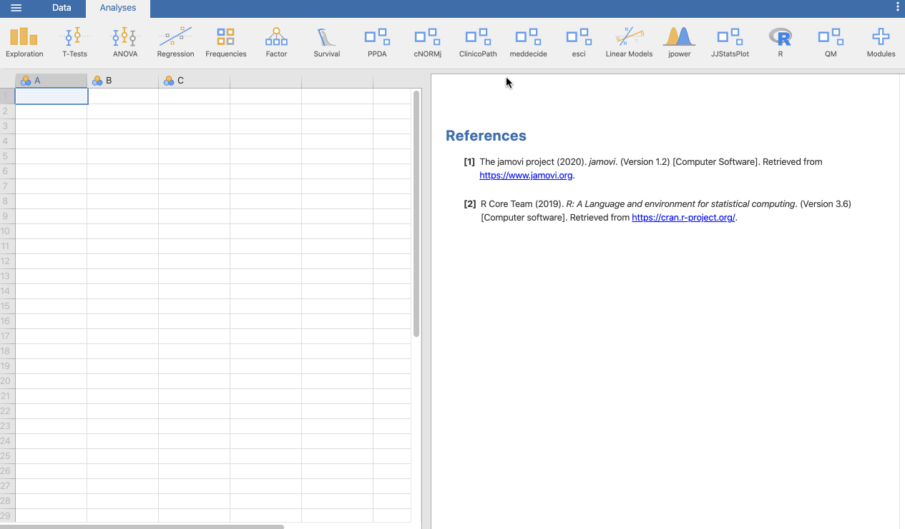

<!-- README.md is generated from README.Rmd. Please edit that file -->

```{r global options, include = FALSE}
knitr::opts_chunk$set(
  collapse = TRUE,
  comment = "#>",
  fig.path = "man/figures/README-",
  out.width = "100%"
)
```

# ClinicoPath

---


## ClinicoPath [jamovi](https://www.jamovi.org) Module 🔬

A [jamovi](https://www.jamovi.org) Module that contains main analysis used in **ClinicoPathological** research. ClinicoPath help researchers to generate natural language summaries of their dataset, generate cross tables with statistical tests, and survival analysis with survival tables, survival curves, and natural language summaries.


🔬👀📑🗃📊🏨🗄📇📖⚗📝🎶📈📉📃🖍
🔬🔬🏋🚴🚙👨💻
📸📺🎛🔭🔬💊🔐🍫🌸


<!-- 🔬🔬🔬🔬 UNDER CONSTRUCTION 🛠⛔️⚠️🔩 -->


---

[](https://sourceforge.net/projects/clinicopathjamovimodule/files/latest/download)
<a href="https://www.buymeacoffee.com/bS0teIs" target="_blank">

https://zenodo.org/account/settings/github/repository/sbalci/ClinicoPathJamoviModule

DOI 10.17605/OSF.IO/9SZUD

https://osf.io/9szud/


---

## Installation in [jamovi](https://www.jamovi.org)


You can install this module after installing jamovi version >= 1.2.19 from here: https://www.jamovi.org/download.html  

Then you can install the submodules directly inside the jamovi, using library.  

Submodules are:

- ClinicoPathDescriptives  
- jsurvival  
- meddecide  
- jjstatsplot  


  

  


## Installation via sideload [jamovi](https://www.jamovi.org)


### Step 1:

**Download and install [jamovi](https://www.jamovi.org).**  


### Step 2:

**Download the relevant `jmo` file for your operating system from**  

#### a: For development version


- [releases](https://github.com/sbalci/ClinicoPathJamoviModule/releases/)
- [sourceforge](https://sourceforge.net/projects/clinicopathjamovimodule/files/latest/download).


#### b: For smaller modules


##### ClinicoPathDescriptives

ClinicoPathDescriptives functions are separately added to jamovi library under Exploration menu


ClinicoPathDescriptives module can be downloaded inside jamovi (click Modules and jamovi library)


https://github.com/sbalci/ClinicoPathDescriptives/

https://github.com/sbalci/ClinicoPathDescriptives/releases/

https://library.jamovi.org/win64/R4.0.5/ClinicoPathDescriptives-0.0.2.0084.jmo

https://library.jamovi.org/macos/R4.0.5/ClinicoPathDescriptives-0.0.2.0084.jmo  


```r
remotes::install_github("sbalci/ClinicoPathDescriptives")
```

    - name: ClinicoPathDescriptives
      url: https://github.com/sbalci/ClinicoPathDescriptives.git
      commit: b10110547d6ca1637982094031a9e592c092a9c0
      platforms:
        - win64
        - macos


##### ClinicoPathLinuxDescriptives

ClinicoPath Descriptives functions for Linux  


https://github.com/sbalci/ClinicoPathLinuxDescriptives/

https://github.com/sbalci/ClinicoPathLinuxDescriptives/releases/


https://library.jamovi.org/linux/R4.0.5/ClinicoPathLinuxDescriptives-0.0.2.0084.jmo

```r
remotes::install_github("sbalci/ClinicoPathLinuxDescriptives")
```


    - name: ClinicoPathDescriptives
      url: https://github.com/sbalci/ClinicoPathLinuxDescriptives.git
      commit: 0bac188199fda2e8397f09a1416e162c18f6c85d
      platforms:
        - linux
        


##### JJStatsPlot  

GGStatsPlot functions are separately added to jamovi library under jjstatsplot menu  

JJStastPlot module can be downloaded inside jamovi (click Modules and jamovi library)  

https://library.jamovi.org/win64/R4.0.5/jjstatsplot-0.0.2.0095.jmo

<!-- https://library.jamovi.org/linux/R3.6.3/jjstatsplot-0.0.2.0038.jmo   -->

https://library.jamovi.org/macos/R4.0.5/jjstatsplot-0.0.2.0095.jmo

https://github.com/sbalci/jjstatsplot  

https://github.com/sbalci/jjstatsplot/releases/  


```r
remotes::install_github("sbalci/jjstatsplot")
```


    - name: jjstatsplot
      url: https://github.com/sbalci/jjstatsplot.git
      commit: a9588a5f23ccc466c2034a8f209dbbc9c6db28bf
      platforms:
        - win64
        - macos


##### jsurvival

https://github.com/sbalci/jsurvival

https://github.com/sbalci/jsurvival/releases/

https://library.jamovi.org/macos/R4.0.5/jsurvival-0.0.2.0084.jmo  

https://library.jamovi.org/win64/R4.0.5/jsurvival-0.0.2.0084.jmo

https://library.jamovi.org/linux/R4.0.5/jsurvival-0.0.2.0084.jmo


```r
remotes::install_github("sbalci/jsurvival")
```


    - name: jsurvival
      url: https://github.com/sbalci/jsurvival.git
      commit: 83b75ef784a623a8d92999ed269ba0b859ba64ab
      platforms:
        - win64
        - macos
        - linux


##### meddecide  

https://github.com/sbalci/meddecide/  

https://github.com/sbalci/meddecide/releases/  

https://library.jamovi.org/win64/R4.0.5/meddecide-0.0.1.0005.jmo

https://library.jamovi.org/linux/R4.0.5/meddecide-0.0.1.0005.jmo  

https://library.jamovi.org/macos/R4.0.5/meddecide-0.0.1.0005.jmo  


```r
remotes::install_github("sbalci/meddecide")
```


    - name: meddecide
      url: https://github.com/sbalci/meddecide.git
      commit: 38aaf74a807241def57c23b99cc89a31a1ed5123


##### jbbplot  

https://github.com/sbalci/jbbplot/  

https://github.com/sbalci/jbbplot/releases/  


```r
remotes::install_github("sbalci/jbbplot")
```


<!-- #### c: For stable version    -->


<!-- - windows: https://library.jamovi.org/win64/R3.6.3/ClinicoPath-0.0.2.jmo -->

<!-- - macOS: https://library.jamovi.org/macos/R3.6.3/ClinicoPath-0.0.2.jmo -->

<!-- - linux: https://library.jamovi.org/linux/R3.6.3/ClinicoPath-0.0.2.jmo -->


**Step 3: And install using side-load as shown below:**


---


## Screenshots of Module

---

### Example Datasets

**Using Example Datasets**


---


https://cloud.jamovi.org/?open=https://raw.githubusercontent.com/sbalci/ClinicoPathJamoviModule/master/data/histopathology.csv


---


https://cloud.jamovi.org/?open=https://raw.githubusercontent.com/sbalci/ClinicoPathJamoviModule/master/data/histopathology.omv


https://cloud.jamovi.org/?open=https://docs.google.com/spreadsheets/d/e/2PACX-1vST3kwze9bNUSEr0eijs_81F6hXBrDZ-2Zt97ez-fbpXMELKGFHJNuQHSP2Oxars2C6F3n50KzT1-zD/pub?output=csv


### Exploration

#### ClinicoPath Descriptives

##### TableOne


##### Summary of Continuous Variables


##### Summary of Categorical Variables


##### Benford Analysis


#### ClinicoPath Descriptive Plots


##### Variable Tree


  


  


##### Alluvial Diagrams


##### Age Pyramid


---

#### ClinicoPath Comparisons

##### Cross Tables


##### Pairwise Chi-Square Tests

🔬🔬🔬🔬 UNDER CONSTRUCTION 🛠⛔️⚠️🔩


### JJStatsPlot


#### Graphs and Plots


---

### Survival

#### jsurvival

##### Univariate Survival Analysis


##### Multivariate Survival Analysis


##### Univariate Survival Analysis for Continuous Explanatory Variable


##### Odds Ratio Table and Plot 


##### Competing Survival

🔬🔬🔬🔬 UNDER CONSTRUCTION 🛠⛔️⚠️🔩


---

### meddecide

#### Agreement


##### Interrater Reliability


##### ICC coefficients

🔬🔬🔬🔬 UNDER CONSTRUCTION 🛠⛔️⚠️🔩


---

#### Decision

##### Medical Decision


##### Decision Calculator





##### Decision Tree

###### explore


🔬🔬🔬🔬 UNDER CONSTRUCTION 🛠⛔️⚠️🔩


###### FFTrees 

🔬🔬🔬🔬 UNDER CONSTRUCTION 🛠⛔️⚠️🔩


###### rpart

🔬🔬🔬🔬 UNDER CONSTRUCTION 🛠⛔️⚠️🔩


##### ROC

🔬🔬🔬🔬 UNDER CONSTRUCTION 🛠⛔️⚠️🔩


---

### Correlation

#### Correlation

🔬🔬🔬🔬 UNDER CONSTRUCTION 🛠⛔️⚠️🔩


---


## Installation in R

<!-- You can install the released version of ClinicoPath from [CRAN](https://CRAN.R-project.org) with: -->

<!-- ``` r -->
<!-- install.packages("ClinicoPath") -->
<!-- ``` -->

You can install the development version from [GitHub](https://github.com/) with:

``` r
# install.packages("devtools")
devtools::install_github("sbalci/ClinicoPathJamoviModule")
```


## Current Package Versions:

**R:** 4.0.5

**MRAN:** https://cran.microsoft.com/snapshot/2020-08-24


## Acknowledgement {#acknowledgement}

Made possible via the codes, help, and guidence of

- [jamovi](https://www.jamovi.org/) developer [Jonathon Love](https://github.com/jonathon-love),
- [finalfit](https://finalfit.org/) developer [Ewen Harrison](https://github.com/ewenharrison), 
- [ggstatsplot](https://indrajeetpatil.github.io/ggstatsplot/) developer [Indrajeet Patil](https://github.com/IndrajeetPatil), 
- [tangram](https://github.com/spgarbet/tangram) developer [Shawn Garbett](https://github.com/spgarbet), 
- [easystats](https://easystats.github.io/blog/) developers , 
- [report](https://easystats.github.io/report/) , 
- [tableone](https://github.com/kaz-yos/tableone), 
- [survival](https://github.com/therneau/survival), 
- [survminer](https://github.com/kassambara/survminer),
- [vtree](https://github.com/nbarrowman/vtree) developer [Nick Barrowman](https://github.com/nbarrowman),
- [easyalluvial](https://github.com/erblast/easyalluvial), developer [Björn Oettinghaus](https://github.com/erblast), and
- [rstats community](https://twitter.com/search?q=%23rstats&src=savs).


See https://github.com/ClinicoPath for forked packages.


---

<a class="twitter-follow-button" data-show-count="false" href="https://twitter.com/serdarbalci">Follow @serdarbalci</a><script async src="https://platform.twitter.com/widgets.js" charset="utf-8"></script>  

<a class="bmc-button" target="_blank" href="https://www.buymeacoffee.com/bS0teIs"><span style="margin-left:15px;font-size:28px !important;">Buy me a coffee</span></a>  

https://paypal.me/serdarbalci


---

</a>  


[](https://saythanks.io/to/sbalci) 


## Development Status  

<!-- badges: start -->
[](https://mybinder.org/v2/gh/sbalci/ClinicoPathJamoviModule/master?urlpath=rstudio) 
[](https://gitpod.io/#https://github.com/sbalci/ClinicoPathJamoviModule) 
[](https://sourceforge.net/projects/clinicopathjamovimodule/files/latest/download) 
[](https://www.repostatus.org/#active)  
[](https://www.tidyverse.org/lifecycle/) 
[](https://github.com/joethorley/stability-badges#unstable) 
[](https://github.com/sbalci/clinicopathjamovimodule/issues) 


 
[](https://www.codacy.com/manual/drserdarbalci/ClinicoPathJamoviModule?utm_source=github.com&amp;utm_medium=referral&amp;utm_content=sbalci/ClinicoPathJamoviModule&amp;utm_campaign=Badge_Grade)
[](https://www.codefactor.io/repository/github/sbalci/clinicopathjamovimodule)  
[](https://coveralls.io/github/sbalci/ClinicoPathJamoviModule?branch=master)
[](https://travis-ci.com/sbalci/ClinicoPathJamoviModule)
[](https://ci.appveyor.com/project/sbalci/clinicopathjamovimodule)
[](https://codecov.io/gh/sbalci/ClinicoPathJamoviModule)
[](https://circleci.com/gh/sbalci/ClinicoPathJamoviModule)
[](https://dashboard.guardrails.io/gh/sbalci/33943)
[](https://codeclimate.com/github/sbalci/ClinicoPathJamoviModule/maintainability)
[](https://codeclimate.com/github/sbalci/ClinicoPathJamoviModule/test_coverage)

[](https://github.com/sbalci/clinicopathjamovimodule/commits/master)
[)`-yellowgreen.svg)](https://github.com/sbalci/clinicopathjamovimodule/commits/master)


[](https://sbalci.github.io/ClinicoPathJamoviModule/)
[](https://github.com/sbalci/ClinicoPathJamoviModule)
[](https://cran.r-project.org/)
[](https://libraries.io/github/sbalci/clinicopathjamovimodule)
[](https://requires.io/github/sbalci/ClinicoPathJamoviModule/requirements/?branch=gh-pages)
[](https://github.com/sbalci/clinicopathjamovimodule/network)

[](https://github.com/sbalci/clinicopathjamovimodule/stargazers)
[](https://github.com/sbalci/clinicopathjamovimodule)

[](https://github.com/sbalci/clinicopathjamovimodule/issues)

[](https://codecov.io/gh/sbalci/ClinicoPathJamoviModule?branch=master)
<!-- badges: end -->


**Code**  
[](https://mybinder.org/v2/gh/sbalci/ClinicoPathJamoviModule/master?urlpath=rstudio) 
[](https://gitpod.io/#https://github.com/sbalci/ClinicoPathJamoviModule) 
[](https://sourceforge.net/projects/clinicopathjamovimodule/files/latest/download) 


**Status**  
[](https://www.repostatus.org/#active)  
[](https://www.tidyverse.org/lifecycle/) 
[](https://github.com/joethorley/stability-badges#unstable) 
[](https://github.com/sbalci/clinicopathjamovimodule/issues)


**Check, CI**  


[](https://www.codacy.com/manual/drserdarbalci/ClinicoPathJamoviModule?utm_source=github.com&amp;utm_medium=referral&amp;utm_content=sbalci/ClinicoPathJamoviModule&amp;utm_campaign=Badge_Grade)
[](https://www.codefactor.io/repository/github/sbalci/clinicopathjamovimodule)
[](https://coveralls.io/github/sbalci/ClinicoPathJamoviModule?branch=master)
[](https://travis-ci.com/sbalci/ClinicoPathJamoviModule)
[](https://ci.appveyor.com/project/sbalci/clinicopathjamovimodule)
[](https://codecov.io/gh/sbalci/ClinicoPathJamoviModule)
[](https://circleci.com/gh/sbalci/ClinicoPathJamoviModule)
[](https://dashboard.guardrails.io/gh/sbalci/33943)
[](https://codeclimate.com/github/sbalci/ClinicoPathJamoviModule/maintainability)
[](https://codeclimate.com/github/sbalci/ClinicoPathJamoviModule/test_coverage)
<!-- [](https://depshield.github.io) -->


**Recency, Updates**  

<!-- [](https://github.com/sbalci/clinicopathjamovimodule/) -->
[](https://github.com/sbalci/clinicopathjamovimodule/commits/master)
[)`-yellowgreen.svg)](https://github.com/sbalci/clinicopathjamovimodule/commits/master)


**Webpage, Links, Size, Download**  
[](https://sbalci.github.io/ClinicoPathJamoviModule/)
[](https://github.com/sbalci/ClinicoPathJamoviModule)


**Dependencies**  
[](https://cran.r-project.org/)
[](https://libraries.io/github/sbalci/clinicopathjamovimodule)
[](https://requires.io/github/sbalci/ClinicoPathJamoviModule/requirements/?branch=gh-pages)
<!-- [](https://depshield.github.io) -->


**Interaction, Shares**  
[](https://github.com/sbalci/clinicopathjamovimodule/network)

[](https://github.com/sbalci/clinicopathjamovimodule/stargazers)
[](https://github.com/sbalci/clinicopathjamovimodule)

[](https://twitter.com/intent/tweet?text=A%20@jamovistats%20module%20for%20%23histopathology%20%23clinicopathology%20%23pathology%20%23research%20using%20various%20%23rstats%20packages%20📦.%20@serdarbalci&url=https%3A%2F%2Fsbalci.github.io%2ClinicoPathJamoviModule%2)
[](https://github.com/sbalci/clinicopathjamovimodule/issues)


## Videos

<iframe width="560" height="315" src="https://www.youtube.com/embed/videoseries?list=PLxRBOaoEoP4JfAMi7aIbkRXPXGUEwzTNv" frameborder="0" allow="accelerometer; autoplay; encrypted-media; gyroscope; picture-in-picture" allowfullscreen></iframe>


