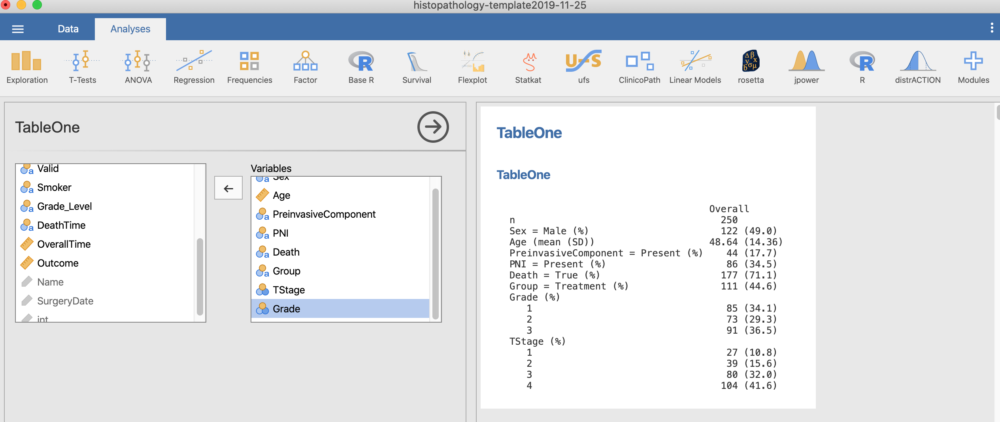
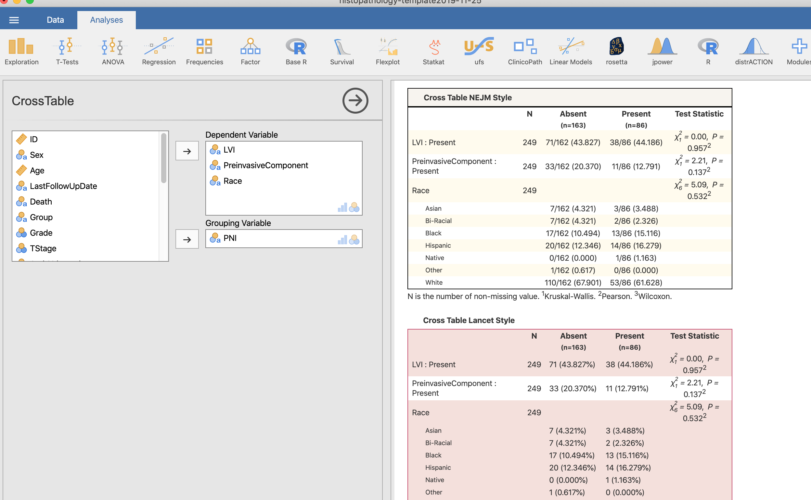
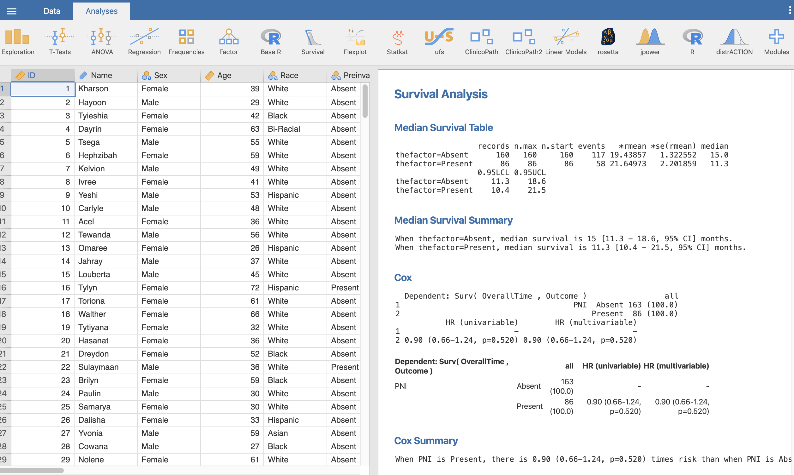
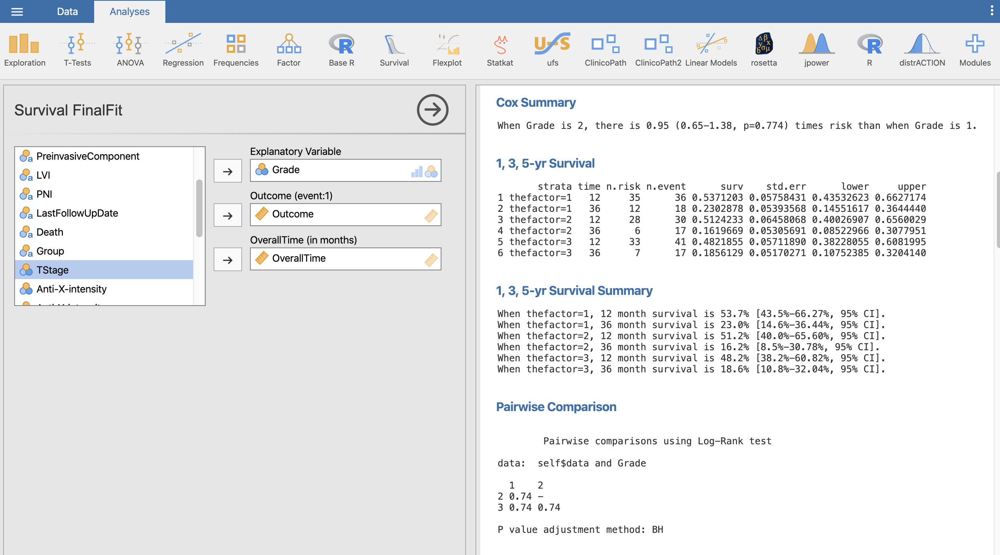
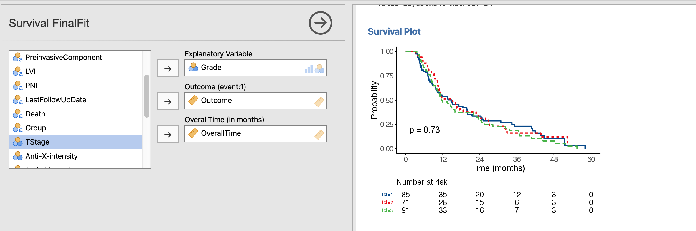
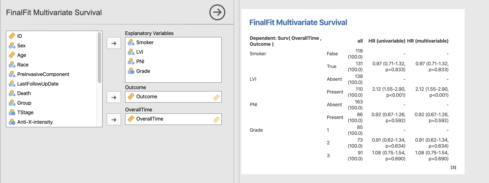

<!-- README.md is generated from README.Rmd. Please edit that file -->

```{r global options, include = FALSE}
knitr::opts_chunk$set(
  collapse = TRUE,
  comment = "#>",
  fig.path = "man/figures/",
  out.width = "90%"
)
```


# ClinicoPath [Jamovi](https://www.jamovi.org) Module 🔬   

<!-- badges: start -->
[](https://www.repostatus.org/#wip)
[](https://www.tidyverse.org/lifecycle/)
[](https://github.com/sbalci/clinicopathjamovimodule/commits/master)

[](https://sourceforge.net/projects/clinicopathjamovimodule/files/latest/download)
[](https://libraries.io/github/sbalci/clinicopathjamovimodule)
[](https://github.com/sbalci/clinicopathjamovimodule/commits/master)
[](https://CRAN.R-project.org/package=clinicopathjamovimodule)
[](https://github.com/sbalci/clinicopathjamovimodule/)
[](https://github.com/sbalci/clinicopathjamovimodule/issues)
[](https://github.com/sbalci/clinicopathjamovimodule)
[](https://github.com/sbalci/clinicopathjamovimodule/network)
[](https://github.com/sbalci/clinicopathjamovimodule/stargazers)
[](https://sbalci.github.io/clinicopathjamovimodule/)
[](http://hits.dwyl.io/sbalci/clinicopathjamovimodule)
[](https://twitter.com/intent/tweet?text=A%20@jamovistats%20module%20for%20%23histopathology%20%23clinicopathology%20%23pathology%20research%20using%20various%20%23rstats%20packages%20📦.%20@serdarbalci&url=https%3A%2F%2Fgithub.com%2Fsbalci%2Fclinicopathjamovimodule)

[](https://github.com/sbalci/clinicopathjamovimodule/issues)
[](https://saythanks.io/to/sbalci)
<!-- badges: end --> 


<!-- [](https://sourceforge.net/p/clinicopathjamovimodule/) -->
<!-- [](https://coveralls.io/github/sbalci/clinicopathjamovimodule?branch=master) -->
<!-- [](https://requires.io/github/sbalci/clinicopathjamovimodule/requirements/?branch=master) -->
<!-- [](https://www.codefactor.io/repository/github/sbalci/clinicopathjamovimodule) -->
<!-- [](https://depshield.github.io) -->
<!-- [](https://dashboard.guardrails.io/default/gh/sbalci/clinicopathjamovimodule) -->


---


[](https://sourceforge.net/projects/clinicopathjamovimodule/files/latest/download)

<a class="bmc-button" target="_blank" href="https://www.buymeacoffee.com/bS0teIs"><span style="margin-left:15px;font-size:28px !important;">Buy me a coffee</span></a>


---


---

A Jamovi Module that contains main analysis used in **ClinicoPathological** research.


🔬👀📑🗃📊🏨🗄📇📖⚗📝🎶📈📉📃🖍
🔬🔬🏋🚴🚙👨💻
📸📺🎛🔭🔬💊🔐🍫🌸


---


## Installation in jamovi

Download the relevant `jmo` file for your operating system from [releases](https://github.com/sbalci/ClinicoPathJamoviModule/releases/) or [sourceforge](https://sourceforge.net/projects/clinicopathjamovimodule/files/latest/download).

And install using side-load.


{width=50% .center}

---


## Installation in R

```r
library("devtools")
install_github("sbalci/ClinicoPath")
```

---


## Screenshots of Module

### Descriptives

#### TableOne





{50% .center}


#### WriteSummary


#### Report General Features


#### Frequencies


### Comparisons

#### CrossTable

{50% .center}


#### GGStatsPlot2

{50% .center}

### Survival

#### FinalFit








#### FinalFit Multivariate Survival




### Decision

#### Medical Decision


{50% .center}


#### Decision Calculator

{50% .center}


### Correlation

#### Correlation


### Agreement


#### Interrater Intrarater Reliability


---


https://github.com/sbalci/ClinicoPathJamoviModule


This repository is a template for the codes I use in [my and my friends' histopathology research](https://sbalci.github.io/cv/SerdarBalciMDPathologist.html).


---


**See examples**

- See some of the codes here: https://sbalci.github.io/histopathology-template/Report.html


- You may also install [histopathR](https://sbalci.github.io/histopathR/) package to get all the codes as R Markdown Template.


---


``` r
devtools::install_github("sbalci/histopathR")
rmarkdown::draft(file = "myfile",
                 template = "clinicopathological",
                 package = "histopathR",
                 create_dir = TRUE,
                 edit = TRUE)
```


- I have tried to collect common codes in [My R Codes For Data Analysis](https://sbalci.github.io/MyRCodesForDataAnalysis/). I plan to collect them under the package [histopathR](https://sbalci.github.io/histopathR/) gradually.


---


**How to use**

- *In RStudio:*

   - Fork this repository. Then use this repository as template as described [here](https://help.github.com/en/articles/creating-a-repository-from-a-template).

   - Use RStudio project as described [here](https://happygitwithr.com/existing-github-first.html#new-rstudio-project-via-git-clone-1).

   - Do not forget to change chunk functions to `eval = TRUE`.

   - This template contains packages using [renv](https://rstudio.github.io/renv/articles/renv.html).

- *Via Docker:*

https://hub.docker.com/r/serdarbalci/clinicopathological

```bash
docker pull serdarbalci/clinicopathological
```


https://twitter.com/serdarbalci/status/1197849208302252032


- *As a standalone app (for mac only):*


https://sourceforge.net/projects/histopathr/

https://twitter.com/serdarbalci/status/1198348640294711296


https://serdarbalci.gitbook.io/parapathology/computers/computers#deploying-a-shiny-app-as-a-desktop-application-with-electron

- *As a Shiny app:*

Launch here:
https://serdarbalci.shinyapps.io/histopathR/

Run in your own computer R session:

```r
library(shiny)
runUrl("https://github.com/sbalci/histopathRshiny/raw/master/histopathRshiny.tar.gz")
```


Code here:
https://github.com/sbalci/histopathRshiny


- *As a jamovi module:*

Download module here:

https://github.com/sbalci/ClinicoPathJamoviModule/raw/master/ClinicoPath.jmo

https://github.com/sbalci/ClinicoPathJamoviModule

https://sourceforge.net/projects/clinicopathjamovimodule/


---

**Recommended Links for Reproducible and ClinicoPathological Research**

- [Reproducible Templates for Analysis and Dissemination](https://www.coursera.org/learn/reproducible-templates-analysis/home/info)

- [Happy Git and GitHub for the useR](https://happygitwithr.com/)

- [R-Giris Dersi Sunum](https://sbalci.github.io/MyRCodesForDataAnalysis/R-Giris.html)

- [R-Giris Dersi](https://sbalci.github.io/MyRCodesForDataAnalysis/R-Giris.nb.html)

- [R-Markdown Dersi Sunum](https://sbalci.github.io/MyRCodesForDataAnalysis/R-Markdown.nb.html)

- [R-Markdown Dersi](https://sbalci.github.io/MyRCodesForDataAnalysis/R-Markdown.html)

- [How to Prepare Data for Histopathology Research pdf](https://sbalci.github.io/MyRCodesForDataAnalysis/How-to-Prepare-Data-for-Histopathology-Research.pdf)

- [How to Prepare Data for Histopathology Research](https://sbalci.github.io/MyRCodesForDataAnalysis/How-to-Prepare-Data-for-Histopathology-Research.nb.html)

- [How to Prepare Data for Histopathology Research Presentation](https://sbalci.github.io/MyRCodesForDataAnalysis/How-to-Prepare-Data-for-Histopathology-Research.html)


- ["The Quartz guide to bad data"nın Türkçe çevirisi: Kötü Veri Kılavuzu ](https://sbalci.github.io/Kotu-Veri-Kilavuzu/)


- [Create A MS Word Template for R Markdown](https://vimeo.com/110804387)


---


**Please Give Me FeedBack**

https://goo.gl/forms/YjGZ5DHgtPlR1RnB3


---


🔬🔬🔬🔬🔬


UNDER CONSTRUCTION 🛠⛔️⚠️🔩


<a class="twitter-follow-button" data-show-count="false" href="https://twitter.com/serdarbalci">Follow @serdarbalci</a>
<script async src="https://platform.twitter.com/widgets.js" charset="utf-8"></script>

[](https://github.com/sbalci/clinicopathjamovimodule/issue)
[](https://saythanks.io/to/sbalci)
[](http://hits.dwyl.io/sbalci/clinicopathjamovimodule)


<!-- Package | Status | Usage | GitHub | References -->
<!-- ----------------- | ----------------- | ----------------- | ----------------- | ----------------- -->
<!-- xxx | [](https://travis-ci.org/IndrajeetPatil/ggstatsplot) | xxx | GitHub version | xxx -->
<!-- xxx | [](https://ci.appveyor.com/project/IndrajeetPatil/ggstatsplot) | xxx | [$forks[[1]]`-blue.svg)](https://github.com/IndrajeetPatil/ggstatsplot/) | xxx -->
<!-- [](https://cran.r-project.org/) | [](https://www.tidyverse.org/lifecycle/) | xxx | [$open_issues[[1]]`-red.svg)](https://github.com/IndrajeetPatil/ggstatsplot/issues) | [](https://CRAN.R-project.org/package=ggstatsplot/vignettes/) -->
<!-- [](https://github.com/IndrajeetPatil/ggstatsplot) | [](https://coveralls.io/github/IndrajeetPatil/ggstatsplot?branch=master) | xxx | [](https://github.com/IndrajeetPatil/ggstatsplot) | [](https://doi.org/10.5281/zenodo.2074621) -->
<!-- [](https://www.gnu.org/licenses/gpl-3.0.en.html) | [](https://codecov.io/gh/IndrajeetPatil/ggstatsplot?branch=master) | [](http://hits.dwyl.io/IndrajeetPatil/ggstatsplot) | [)`-yellowgreen.svg)](https://github.com/IndrajeetPatil/ggstatsplot/commits/master) | [](https://github.com/IndrajeetPatil/ggstatsplot/commits/master) -->
<!-- [](https://CRAN.R-project.org/package=ggstatsplot) | [](https://github.com/IndrajeetPatil/ggstatsplot) | [](https://gitter.im/ggstatsplot/community) | [](http://www.repostatus.org/#active) | [](https://github.com/IndrajeetPatil/ggstatsplot/issues) -->
