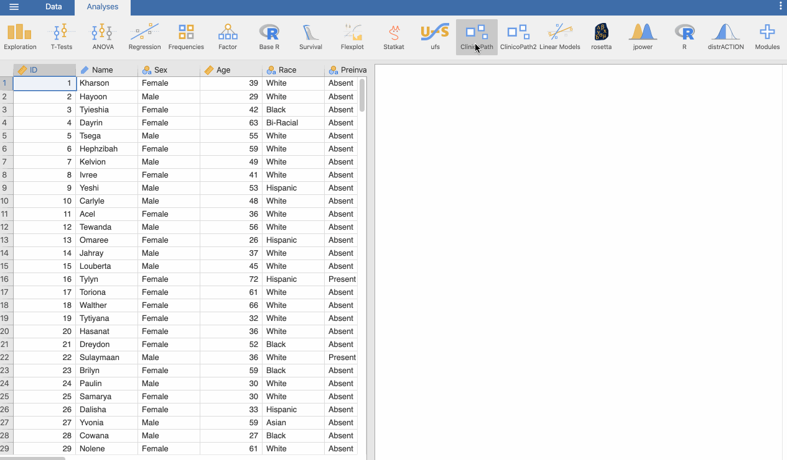
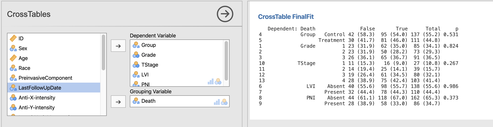
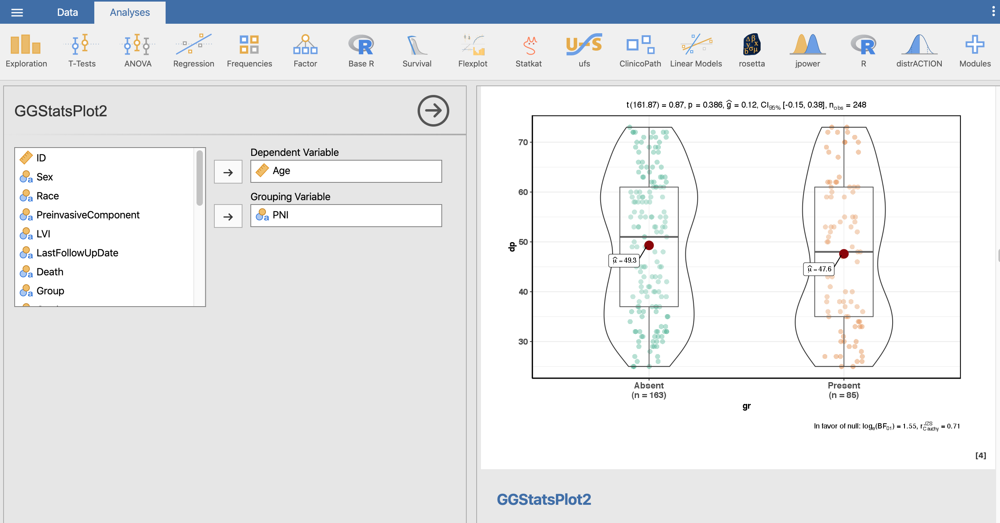
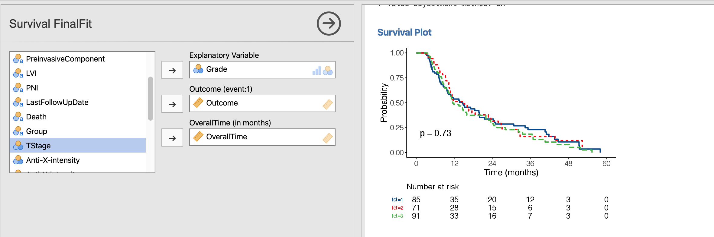
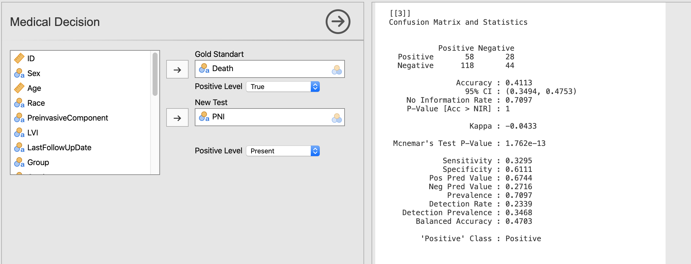
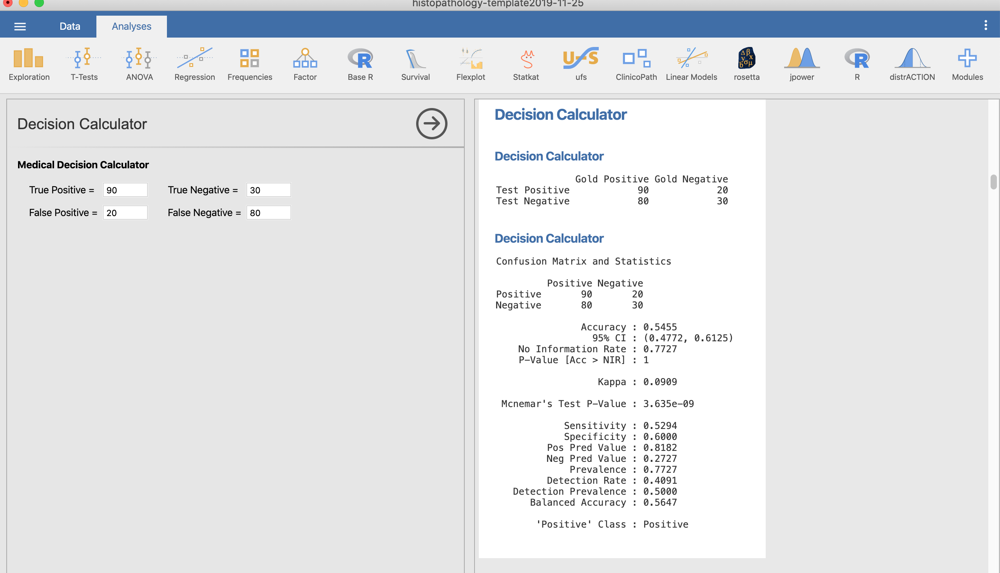

<!-- README.md is generated from README.Rmd. Please edit that file -->

# ClinicoPath

-----

## ClinicoPath [jamovi](https://www.jamovi.org) Module 🔬

A [jamovi](https://www.jamovi.org) Module that contains main analysis
used in **ClinicoPathological** research. ClinicoPath help researchers
to generate natural language summaries of their dataset, generate cross
tables with statistical tests, and survival analysis with survival
tables, survival curves, and natural language summaries.

🔬👀📑🗃📊🏨🗄📇📖⚗📝🎶📈📉📃🖍 🔬🔬🏋🚴🚙👨💻 📸📺🎛🔭🔬💊🔐🍫🌸

<!-- 🔬🔬🔬🔬 UNDER CONSTRUCTION 🛠⛔️⚠️🔩 -->

-----

[](https://sourceforge.net/projects/clinicopathjamovimodule/files/latest/download)
<a href="https://www.buymeacoffee.com/bS0teIs" target="_blank">

<https://zenodo.org/account/settings/github/repository/sbalci/ClinicoPathJamoviModule>

DOI 10.17605/OSF.IO/9SZUD

<https://osf.io/9szud/>

-----

## Installation in [jamovi](https://www.jamovi.org)

You can install this module after installing jamovi version \>= 1.2.19
from here: <https://www.jamovi.org/download.html>

Then you can install this module directly inside the jamovi, using
library.


## Installation via sideload [jamovi](https://www.jamovi.org)

  - Step 1: Download and install [jamovi](https://www.jamovi.org).

  - Step 2: Download the relevant `jmo` file for your operating system
    from
    
      - a: For development version

  - [releases](https://github.com/sbalci/ClinicoPathJamoviModule/releases/)

  - [sourceforge](https://sourceforge.net/projects/clinicopathjamovimodule/files/latest/download).
    
      - b: For stable version

  - windows:
    <https://library.jamovi.org/win64/R3.6.3/ClinicoPath-0.0.2.jmo>

  - macOS:
    <https://library.jamovi.org/macos/R3.6.3/ClinicoPath-0.0.2.jmo>

<!-- - linux: https://library.jamovi.org/linux/R3.6.3/ClinicoPath-0.0.2.jmo -->

  - Step 3: And install using side-load as shown below:


-----

## Screenshots of Module

-----

### Example Datasets


### Descriptives

#### TableOne


#### Summary of Continuous Variables



#### Summary of Categorical Variables


#### Variable Tree

🔬🔬🔬🔬 UNDER CONSTRUCTION 🛠⛔️⚠️🔩

#### Alluvial Diagrams

🔬🔬🔬🔬 UNDER CONSTRUCTION 🛠⛔️⚠️🔩


-----

### Comparisons

#### Cross Tables




##### Tables via arsenal, finalfit, gtsummary

🔬🔬🔬🔬 UNDER CONSTRUCTION 🛠⛔️⚠️🔩

#### Pairwise Chi-Square Tests

🔬🔬🔬🔬 UNDER CONSTRUCTION 🛠⛔️⚠️🔩

#### Graphs and Plots





-----

### Survival

#### Survival Analysis




#### Multivariate Survival Analysis


#### Odds Ratio Table and Plot


#### Competing Survival

🔬🔬🔬🔬 UNDER CONSTRUCTION 🛠⛔️⚠️🔩

-----

### Agreement

#### Interrater Reliability


#### ICC coefficients

🔬🔬🔬🔬 UNDER CONSTRUCTION 🛠⛔️⚠️🔩

-----

### Decision

#### Medical Decision



#### Decision Calculator



#### Decision Tree

##### explore

🔬🔬🔬🔬 UNDER CONSTRUCTION 🛠⛔️⚠️🔩


##### FFTrees

🔬🔬🔬🔬 UNDER CONSTRUCTION 🛠⛔️⚠️🔩


##### rpart

🔬🔬🔬🔬 UNDER CONSTRUCTION 🛠⛔️⚠️🔩


#### ROC

🔬🔬🔬🔬 UNDER CONSTRUCTION 🛠⛔️⚠️🔩

-----

### Correlation

#### Correlation

🔬🔬🔬🔬 UNDER CONSTRUCTION 🛠⛔️⚠️🔩

-----

## Installation in R

<!-- You can install the released version of ClinicoPath from [CRAN](https://CRAN.R-project.org) with: -->

<!-- ``` r -->

<!-- install.packages("ClinicoPath") -->

<!-- ``` -->

You can install the development version from
[GitHub](https://github.com/) with:

``` r
# install.packages("devtools")
devtools::install_github("sbalci/ClinicoPathJamoviModule")
```

## Acknowledgement

Made possible via the codes, help, and guidence of

  - [jamovi](https://www.jamovi.org/) developer [Jonathon
    Love](https://github.com/jonathon-love),
  - [finalfit](https://finalfit.org/) developer [Ewen
    Harrison](https://github.com/ewenharrison),
  - [ggstatsplot](https://indrajeetpatil.github.io/ggstatsplot/)
    developer [Indrajeet Patil](https://github.com/IndrajeetPatil),
  - [tangram](https://github.com/spgarbet/tangram) developer [Shawn
    Garbett](https://github.com/spgarbet),
  - [easystats](https://easystats.github.io/blog/) developers ,
  - [report](https://easystats.github.io/report/) ,
  - [tableone](https://github.com/kaz-yos/tableone),
  - [survival](https://github.com/therneau/survival),
  - [survminer](https://github.com/kassambara/survminer),
  - [easyalluvial](https://github.com/erblast/easyalluvial), developer
    [Björn Oettinghaus](https://github.com/erblast), and
  - [rstats community](https://twitter.com/search?q=%23rstats&src=savs).

See <https://github.com/ClinicoPath> for forked packages.

-----

<a class="twitter-follow-button" data-show-count="false" href="https://twitter.com/serdarbalci">Follow
@serdarbalci</a>

<script async src="https://platform.twitter.com/widgets.js" charset="utf-8"></script>

<a class="bmc-button" target="_blank" href="https://www.buymeacoffee.com/bS0teIs"><span style="margin-left:15px;font-size:28px !important;">Buy
me a coffee</span></a>

<https://paypal.me/serdarbalci>

-----

</a>  


[](https://saythanks.io/to/sbalci)

## Development Status

<!-- badges: start -->

[](https://mybinder.org/v2/gh/sbalci/ClinicoPathJamoviModule/master?urlpath=rstudio)
[](https://gitpod.io/#https://github.com/sbalci/ClinicoPathJamoviModule)
[](https://sourceforge.net/projects/clinicopathjamovimodule/files/latest/download)
[](https://www.repostatus.org/#wip)
[](https://app.codacy.com/manual/drserdarbalci/ClinicoPathJamoviModule?utm_source=github.com&utm_medium=referral&utm_content=sbalci/ClinicoPathJamoviModule&utm_campaign=Badge_Grade_Dashboard)
[](https://www.tidyverse.org/lifecycle/)
[](https://github.com/joethorley/stability-badges#experimental)
[](https://github.com/sbalci/clinicopathjamovimodule/issues)


[](https://www.codacy.com/manual/drserdarbalci/JournalWatchPBPath?utm_source=github.com&utm_medium=referral&utm_content=sbalci/JournalWatchPBPath&utm_campaign=Badge_Grade)
[](https://www.codefactor.io/repository/github/sbalci/clinicopathjamovimodule)
[](https://coveralls.io/github/sbalci/clinicopathjamovimodule?branch=master)
[](https://travis-ci.com/sbalci/ClinicoPathJamoviModule)
[](https://ci.appveyor.com/project/sbalci/clinicopathjamovimodule)
[](https://codecov.io/gh/sbalci/ClinicoPathJamoviModule)
[](https://circleci.com/gh/sbalci/ClinicoPathJamoviModule)
[](https://dashboard.guardrails.io/default/gh/sbalci/ClinicoPathJamoviModule)
[](https://codeclimate.com/github/sbalci/ClinicoPathJamoviModule/maintainability)
[](https://codeclimate.com/github/sbalci/ClinicoPathJamoviModule/test_coverage)
[](https://depshield.github.io)

[](https://github.com/sbalci/clinicopathjamovimodule/)
[](https://github.com/sbalci/clinicopathjamovimodule/commits/master)
[](https://github.com/sbalci/clinicopathjamovimodule/commits/master)


[](https://sbalci.github.io/clinicopathjamovimodule/)
[](https://github.com/sbalci/clinicopathjamovimodule)
[](https://cran.r-project.org/)
[](https://libraries.io/github/sbalci/clinicopathjamovimodule)
[](https://requires.io/github/sbalci/ClinicoPathJamoviModule/requirements/?branch=gh-pages)
[](https://depshield.github.io)
[](https://github.com/sbalci/clinicopathjamovimodule/network)

[](https://github.com/sbalci/clinicopathjamovimodule/stargazers)
[](https://github.com/sbalci/clinicopathjamovimodule)

[](https://twitter.com/intent/tweet?text=A%20@jamovistats%20module%20for%20%23histopathology%20%23clinicopathology%20%23pathology%20%23research%20using%20various%20%23rstats%20packages%20📦.%20@serdarbalci&url=https%3A%2F%2Fsbalci.github.io%2ClinicoPathJamoviModule%2)

[](https://github.com/sbalci/clinicopathjamovimodule/issues)

<!-- badges: end -->

**Code**  
[](https://mybinder.org/v2/gh/sbalci/ClinicoPathJamoviModule/master?urlpath=rstudio)
[](https://gitpod.io/#https://github.com/sbalci/ClinicoPathJamoviModule)
[](https://sourceforge.net/projects/clinicopathjamovimodule/files/latest/download)

**Status**  
[](https://www.repostatus.org/#wip)
[](https://www.tidyverse.org/lifecycle/)
[](https://github.com/joethorley/stability-badges#experimental)
[](https://github.com/sbalci/clinicopathjamovimodule/issues)


**Check, CI**  

[](https://www.codefactor.io/repository/github/sbalci/clinicopathjamovimodule)
[](https://www.codacy.com/manual/drserdarbalci/JournalWatchPBPath?utm_source=github.com&utm_medium=referral&utm_content=sbalci/JournalWatchPBPath&utm_campaign=Badge_Grade)
[](https://coveralls.io/github/sbalci/clinicopathjamovimodule?branch=master)
[](https://travis-ci.com/sbalci/ClinicoPathJamoviModule)
[](https://ci.appveyor.com/project/sbalci/clinicopathjamovimodule)
[](https://codecov.io/gh/sbalci/ClinicoPathJamoviModule)
[](https://circleci.com/gh/sbalci/ClinicoPathJamoviModule)
[](https://dashboard.guardrails.io/default/gh/sbalci/ClinicoPathJamoviModule)
[](https://codeclimate.com/github/sbalci/ClinicoPathJamoviModule/maintainability)
[](https://codeclimate.com/github/sbalci/ClinicoPathJamoviModule/test_coverage)
[](https://depshield.github.io)

**Recency, Updates**  

[](https://github.com/sbalci/clinicopathjamovimodule/)
[](https://github.com/sbalci/clinicopathjamovimodule/commits/master)
[](https://github.com/sbalci/clinicopathjamovimodule/commits/master)


**Webpage, Links, Size, Download**  
[](https://sbalci.github.io/clinicopathjamovimodule/)
[](https://github.com/sbalci/clinicopathjamovimodule)

**Dependencies**  
[](https://cran.r-project.org/)
[](https://libraries.io/github/sbalci/clinicopathjamovimodule)
[](https://requires.io/github/sbalci/ClinicoPathJamoviModule/requirements/?branch=gh-pages)
[](https://depshield.github.io)

**Interaction, Shares**  
[](https://github.com/sbalci/clinicopathjamovimodule/network)

[](https://github.com/sbalci/clinicopathjamovimodule/stargazers)
[](https://github.com/sbalci/clinicopathjamovimodule)

[](https://twitter.com/intent/tweet?text=A%20@jamovistats%20module%20for%20%23histopathology%20%23clinicopathology%20%23pathology%20%23research%20using%20various%20%23rstats%20packages%20📦.%20@serdarbalci&url=https%3A%2F%2Fsbalci.github.io%2ClinicoPathJamoviModule%2)

[](https://github.com/sbalci/clinicopathjamovimodule/issues)


## Videos

<iframe width="560" height="315" src="https://www.youtube.com/embed/videoseries?list=PLxRBOaoEoP4JfAMi7aIbkRXPXGUEwzTNv" frameborder="0" allow="accelerometer; autoplay; encrypted-media; gyroscope; picture-in-picture" allowfullscreen>

</iframe>
