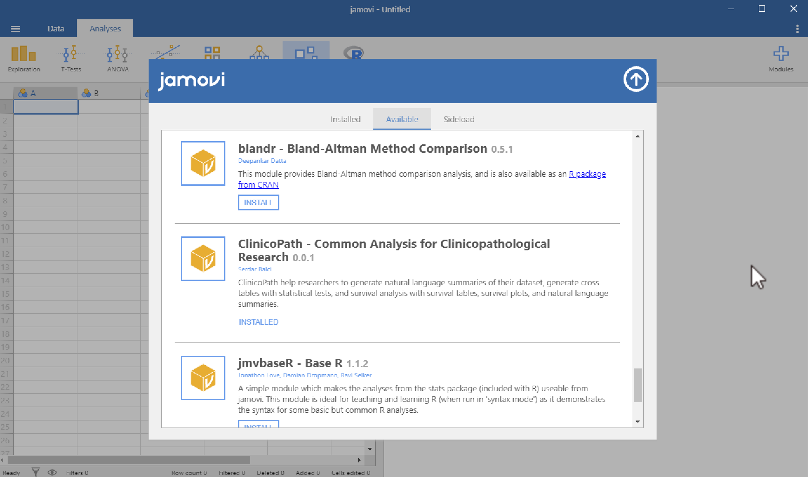

<!-- README.md is generated from README.Rmd. Please edit that file -->

# ClinicoPath

------------------------------------------------------------------------

## Abstract

### **The ClinicoPath Ecosystem: A Comprehensive Open-Source Toolkit for Clinicopathological Research**

**Background:** Clinicopathological research is fundamental to advancing
evidence-based medicine, biomarker validation, and precision oncology.
However, it requires complex and specialized statistical methods ranging
from survival modeling and decision analysis to inter-rater reliability
and rich statistical visualization. The technical barrier of
programming-based statistical software can limit clinicians and
pathology researchers from performing these analyses reproducibly. To
address this gap, we developed **ClinicoPath**, an open-source umbrella
toolkit built for the [jamovi](https://www.jamovi.org) statistical
platform and R.

**Architecture:** ClinicoPath coordinates **62 production analyses**
distributed across **5 focused, specialized submodules** available
directly in the jamovi library, alongside an active development and
staging infrastructure:

1.  **[ClinicoPathDescriptives](https://www.serdarbalci.com/ClinicoPathDescriptives/)
    (14 analyses):** Baseline characteristics (`Table 1`),
    cross-tabulation with significance tests, descriptive summaries,
    demographic age pyramids, treatment pathway alluvial flows, Venn
    diagrams, variable hierarchy trees, and robust data quality/outlier
    screening.
2.  **[jsurvival](https://www.serdarbalci.com/jsurvival/) (9
    analyses):** Comprehensive time-to-event analysis, Kaplan-Meier
    curves with risk tables, Cox proportional hazards regression,
    continuous biomarker threshold detection, odds ratios,
    high-dimensional LASSO-Cox regularized regression, and clinical
    date/time interval tools.
3.  **[meddecide](https://www.serdarbalci.com/meddecide/) (15
    analyses):** Diagnostic test accuracy evaluation, Fagan nomogram
    decision calculators, test combination/co-testing/sequential
    algorithms, Decision Curve Analysis (DCA), ROC curve modeling,
    inter-rater reliability (Cohen’s/Fleiss’ Kappa), regularized
    prediction (LASSO logistic), and precision/power sample size
    planning.
4.  **[jjstatsplot](https://www.serdarbalci.com/jjstatsplot/) (19
    analyses):** Publication-ready statistical visualizations
    integrating `ggstatsplot` and modern plotting tools into jamovi
    (between-group and within-subject box-violin plots, scatter plots
    with marginals, correlation matrices, raincloud and ridgeline
    distributions, waffle charts, arc networks, and automated
    intelligent plot selection).
5.  **[OncoPath](https://www.serdarbalci.com/OncoPath/) (5 analyses):**
    Specialized oncology and pathology research tools including swimmer
    plots for patient timelines, waterfall and spider plots for tumor
    burden response (adapted RECIST v1.1 thresholds), diagnostic test
    meta-analysis for pathology & AI validation, quantitative IHC marker
    heterogeneity, and multi-rater pathology diagnostic agreement.

**Conclusion:** ClinicoPath provides a powerful, accessible, and
free-to-use toolkit that empowers medical researchers to conduct
sophisticated statistical analyses without requiring programming
expertise. By integrating these essential functions into the intuitive
jamovi graphical interface while generating reproducible R code, the
module lowers barriers to rigorous biomedical data analysis, enhances
transparency, and accelerates translation of clinical findings.

------------------------------------------------------------------------

## 📚 Documentation & Submodule Websites

All submodule documentation is hosted on dedicated pkgdown websites:

-   🌐 **ClinicoPath Umbrella**:
    <https://www.serdarbalci.com/ClinicoPathJamoviModule/>
-   📊 **ClinicoPathDescriptives**:
    <https://www.serdarbalci.com/ClinicoPathDescriptives/>
-   ⏱️ **jsurvival**: <https://www.serdarbalci.com/jsurvival/>
-   🏥 **meddecide**: <https://www.serdarbalci.com/meddecide/>
-   📈 **jjstatsplot**: <https://www.serdarbalci.com/jjstatsplot/>
-   🔬 **OncoPath**: <https://www.serdarbalci.com/OncoPath/>

------------------------------------------------------------------------

## 📊 Test Data & Learning Resources

Comprehensive test datasets and downloadable `.omv` example analysis
files:

-   **[Test Data Catalog](vignettes/test-data-catalog.Rmd)** - Curated
    overview with download links and sample analysis files.
    -   Featured: Kappa sample size planning (`kappasizeci`,
        `kappasizefixedn`, `kappasizepower`), Decision Curve Analysis
        (`decisioncurve`), and Waterfall plots (`waterfall`).
    -   Access in R:
        `vignette("test-data-catalog", package = "ClinicoPath")`
-   **[Complete Test Data
    Catalog](vignettes/test-data-complete-catalog.Rmd)** - Complete
    inventory of example data files.
-   **[Function Reference Guide](vignettes/function-reference.Rmd)** -
    Complete reference across all module functions.

------------------------------------------------------------------------

## 🎓 Tutorial Series

Comprehensive step-by-step tutorials for clinical and translational
researchers:

-   **[Tutorial Series Home](tutorials/README.md)** - Learning paths for
    clinical trials, diagnostic pathology, and advanced modeling.
-   **Quick Start:** [Getting Started with
    ClinicoPath](tutorials/01-getting-started.qmd)
-   **Clinical Trials:** [Table One for Baseline
    Characteristics](tutorials/02-table-one-clinical-trial.qmd)
-   **Survival Analysis:** [Kaplan-Meier & Cox
    Regression](tutorials/03-survival-analysis-cancer.qmd)
-   **Diagnostic Testing:** [ROC Analysis & Optimal
    Cutpoints](tutorials/04-roc-diagnostic-test.qmd)
-   **Advanced Modeling:** [Decision Curve
    Analysis](tutorials/05-decision-curve-analysis.qmd)
-   **Reproducibility:** [Automated Reports & Version
    Control](tutorials/06-reproducible-reports.qmd)

------------------------------------------------------------------------

## 💻 Installation in [jamovi](https://www.jamovi.org)

### Method 1: Install Submodules from the jamovi Library (Recommended)

Each specialized submodule can be installed directly inside jamovi:

1.  Open **jamovi** (version >= 2.6).
2.  Click the **Modules** button (**+**) in the top right corner.
3.  Select **jamovi library**.
4.  Search for the module name or browse categories:
    -   **ClinicoPathDescriptives** (under *Exploration*)
    -   **jsurvival** (under *Survival*)
    -   **meddecide** (under *meddecide*)
    -   **jjstatsplot** (under *jjstatsplot*)
    -   **OncoPath** (under *OncoPath*)
5.  Click **Install**.



### Method 2: Sideload `.jmo` Package Files

Pre-compiled `.jmo` files are available on GitHub Releases:

1.  Download the `.jmo` file for your platform from [ClinicoPath
    Releases](https://github.com/sbalci/ClinicoPathJamoviModule/releases/).
2.  In jamovi, click **Modules** (**+**) → **Sideload** (folder icon).
3.  Select the downloaded `.jmo` file.

------------------------------------------------------------------------

## 💻 Installation in R

You can install the development version of the umbrella package or
individual submodules from GitHub:

``` r
# Install remotes if needed
if (!requireNamespace("remotes", quietly = TRUE)) install.packages("remotes")

# Umbrella package (contains all functions)
remotes::install_github("sbalci/ClinicoPathJamoviModule")

# Or individual submodules
remotes::install_github("sbalci/ClinicoPathDescriptives")
remotes::install_github("sbalci/jsurvival")
remotes::install_github("sbalci/meddecide")
remotes::install_github("sbalci/jjstatsplot")
remotes::install_github("sbalci/OncoPath")
```

------------------------------------------------------------------------

## 🔬 Feature Overview by Submodule

### 1. ClinicoPathDescriptives (14 Analyses)

*Menu: **Exploration***

-   **[Table One](https://www.serdarbalci.com/ClinicoPathDescriptives/)
    (`tableone`)**: Publication-ready baseline patient summary tables
    with automatic variable type detection, significance tests,
    standardized mean differences (SMD), and missing value reporting.
-   **[Cross
    Tables](https://www.serdarbalci.com/ClinicoPathDescriptives/)
    (`crosstable`)**: Multi-way contingency tables with Pearson
    Chi-Square, Fisher’s exact test, and multiple comparison
    corrections.
-   **[Continuous
    Summaries](https://www.serdarbalci.com/ClinicoPathDescriptives/)
    (`summarydata`)**: Automated descriptive statistics for continuous
    variables with natural language interpretations.
-   **[Categorical
    Summaries](https://www.serdarbalci.com/ClinicoPathDescriptives/)
    (`reportcat`)**: Frequency distributions and percentages for
    categorical variables.
-   **[Age
    Pyramid](https://www.serdarbalci.com/ClinicoPathDescriptives/)
    (`agepyramid`)**: Demographic population pyramid plots split by
    gender or disease subgroups.
-   **[Alluvial
    Diagrams](https://www.serdarbalci.com/ClinicoPathDescriptives/)
    (`alluvial`)**: Categorical flow diagrams visualizing patient
    therapy transitions and clinical trajectories.
-   **[Venn
    Diagrams](https://www.serdarbalci.com/ClinicoPathDescriptives/)
    (`venn`)**: Set relationship diagrams supporting 2 to 7 sets with
    statistical overlap counts.
-   **[Variable
    Tree](https://www.serdarbalci.com/ClinicoPathDescriptives/)
    (`vartree`)**: Hierarchical tree visualizations for cohort
    stratification and inclusion/exclusion pathways.
-   **[Data Quality
    Assessment](https://www.serdarbalci.com/ClinicoPathDescriptives/)
    (`dataquality`)**: Multi-variable data health dashboard summarizing
    missingness patterns, variable types, and distributions.
-   **[Single Variable
    Check](https://www.serdarbalci.com/ClinicoPathDescriptives/)
    (`checkdata`)**: Interactive data validation tool for screening
    individual variables.
-   **[Outlier
    Detection](https://www.serdarbalci.com/ClinicoPathDescriptives/)
    (`outlierdetection`)**: Multi-method outlier detection leveraging
    IQR, Z-scores, robust covariance, and DBSCAN.
-   **[Benford
    Analysis](https://www.serdarbalci.com/ClinicoPathDescriptives/)
    (`benford`)**: Digital data integrity screening using first-digit
    Benford distribution conformity.
-   **[Chi-Square
    Post-Hoc](https://www.serdarbalci.com/ClinicoPathDescriptives/)
    (`chisqposttest`)**: Pairwise post-hoc proportion comparisons
    following significant chi-square tests.
-   **[Categorize
    Variables](https://www.serdarbalci.com/ClinicoPathDescriptives/)
    (`categorize`)**: Binning and recoding of continuous variables into
    clinically meaningful ordinal categories.

------------------------------------------------------------------------

### 2. jsurvival (9 Analyses)

*Menu: **Survival***

-   **[Survival Analysis](https://www.serdarbalci.com/jsurvival/)
    (`survival`)**: Kaplan-Meier curves, log-rank tests, Cox
    proportional hazards regression, median survival with CIs, 1-, 3-,
    and 5-year survival rates, and risk tables.
-   **[Single Arm Survival](https://www.serdarbalci.com/jsurvival/)
    (`singlearm`)**: Cohort survival analysis for single-arm clinical
    trials or registry cohorts without an explanatory group.
-   **[Multivariable Survival](https://www.serdarbalci.com/jsurvival/)
    (`multisurvival`)**: Multivariable Cox proportional hazards modeling
    with covariate adjustment, hazard ratio forest plots, and adjusted
    survival curves.
-   **[Continuous Survival](https://www.serdarbalci.com/jsurvival/)
    (`survivalcont`)**: Survival analysis for continuous variables with
    optimal cut-point detection (maxstat) and quantile splits.
-   **[Odds Ratio Analysis](https://www.serdarbalci.com/jsurvival/)
    (`oddsratio`)**: Binary outcome evaluation with 2x2 contingency
    tables, odds ratio calculations, and forest plots.
-   **[LASSO-Cox Regression](https://www.serdarbalci.com/jsurvival/)
    (`lassocox`)**: L1-penalized Cox regression via glmnet for
    high-dimensional feature selection, cross-validation tuning, and
    coefficient path plots.
-   **[Time Interval Calculator](https://www.serdarbalci.com/jsurvival/)
    (`timeinterval`)**: Follow-up and survival duration calculation from
    clinical dates with date order validation.
-   **[DateTime Converter](https://www.serdarbalci.com/jsurvival/)
    (`datetimeconverter`)**: Parsing, standardization, and conversion of
    clinical timestamps into analysis-ready formats.
-   **[Outcome Organizer](https://www.serdarbalci.com/jsurvival/)
    (`outcomeorganizer`)**: Clinical endpoint mapping and
    standardization for time-to-event indicators (OS, DFS, PFS).

------------------------------------------------------------------------

### 3. meddecide (15 Analyses)

*Menu: **meddecide***

-   **[Medical Decision](https://www.serdarbalci.com/meddecide/)
    (`decision`)**: Diagnostic test accuracy metrics: Sensitivity,
    Specificity, PPV, NPV, Positive/Negative Likelihood Ratios, DOR, and
    accuracy with 95% CIs.
-   **[Decision Calculator](https://www.serdarbalci.com/meddecide/)
    (`decisioncalculator`)**: Interactive clinical calculator for pre-
    and post-test probabilities with Fagan nomograms.
-   **[Compare Tests](https://www.serdarbalci.com/meddecide/)
    (`decisioncompare`)**: Direct statistical comparison of two or more
    diagnostic tests against a reference standard.
-   **[Combine Tests](https://www.serdarbalci.com/meddecide/)
    (`decisioncombine`)**: Combinatorial evaluation of 2 to 3 diagnostic
    tests to find optimal panel algorithms; includes decision heatmaps.
-   **[Co-Testing Analysis](https://www.serdarbalci.com/meddecide/)
    (`cotest`)**: Simultaneous (parallel) testing strategies to quantify
    sensitivity gains and specificity trade-offs.
-   **[Sequential Testing](https://www.serdarbalci.com/meddecide/)
    (`sequentialtests`)**: Two-stage serial testing algorithms
    (screening followed by confirmatory testing).
-   **[No Gold Standard](https://www.serdarbalci.com/meddecide/)
    (`nogoldstandard`)**: Diagnostic accuracy estimation when reference
    standards are imperfect, using latent class analysis and Bayesian
    Hui-Walter estimation.
-   **[Decision Curve Analysis
    (DCA)](https://www.serdarbalci.com/meddecide/) (`decisioncurve`)**:
    Clinical net benefit evaluation across threshold probabilities,
    comparing “treat all”, “treat none”, and model-guided strategies;
    calculates interventions avoided.
-   **[Clinical ROC Analysis](https://www.serdarbalci.com/meddecide/)
    (`enhancedROC`)**: Publication-ready ROC curves, empirical and
    smooth AUC with DeLong/bootstrap CIs, and optimal cutoff detection.
-   **[Advanced ROC Analysis](https://www.serdarbalci.com/meddecide/)
    (`psychopdaROC`)**: In-depth ROC coordinate evaluation with
    threshold tables and cost-weighted cutoff optimization.
-   **[Interrater Reliability](https://www.serdarbalci.com/meddecide/)
    (`agreement`)**: Cohen’s Kappa, Fleiss’ Kappa, weighted kappa for
    ordinal scales, Gwet’s AC1, and percentage agreement.
-   **[LASSO Logistic
    Regression](https://www.serdarbalci.com/meddecide/)
    (`lassologistic`)**: L1-penalized logistic regression for
    regularized binary outcome prediction and sparse biomarker
    selection.
-   **[Kappa Sample Size (CI)](https://www.serdarbalci.com/meddecide/)
    (`kappaSizeCI`)**: Precision-based sample size calculator
    determining required subjects for a target confidence interval
    half-width.
-   **[Kappa Fixed N Analysis](https://www.serdarbalci.com/meddecide/)
    (`kappaSizeFixedN`)**: Calculates lowest expected Kappa and lower
    confidence bound for a fixed sample size.
-   **[Kappa Power Analysis](https://www.serdarbalci.com/meddecide/)
    (`kappaSizePower`)**: Hypothesis testing power-based sample size
    calculator for inter-observer agreement.

------------------------------------------------------------------------

### 4. jjstatsplot (19 Analyses)

*Menu: **jjstatsplot***

-   **Histograms (`jjhistostats`)**: Distribution visualization with
    Shapiro-Wilk normality testing and central tendency overlays.
-   **Scatter Plot (`jjscatterstats`)**: Pairwise continuous association
    with correlation coefficients, regression fits, and marginal plots.
-   **Correlation Matrix (`jjcorrmat`)**: Multi-variable correlation
    matrices with significance markers and clustering.
-   **Hull Plot (`hullplot`)**: Bivariate scatter with convex polygonal
    hull boundaries for distinct clinical clusters.
-   **Between-Groups Box-Violin (`jjbetweenstats`)**: Group comparison
    with violin plots, boxplots, raw jittered points, ANOVA /
    Kruskal-Wallis, and effect sizes.
-   **Within-Subjects Box-Violin (`jjwithinstats`)**: Repeated measures
    comparison with repeated measures ANOVA or Friedman tests.
-   **Horizontal Dot Plot (`jjdotplotstats`)**: Horizontal box-violin
    comparison across categorical factors with detailed effect sizes.
-   **Dot Chart (`jjdotchart`)**: Cleveland-style dot charts comparing
    observed group summaries against reference values.
-   **Bar Charts (`jjbarstats`)**: Categorical frequency comparisons
    with Chi-square, Fisher’s exact test, and Cramer’s V.
-   **Pie Charts (`jjpiestats`)**: Proportion visualization with
    chi-square goodness-of-fit testing.
-   **Segmented Total Bar (`jjsegmentedtotalbar`)**: Stacked proportion
    bars reporting both segment-level and aggregate statistics.
-   **Waffle Charts (`jwaffle`)**: Square icon waffle charts for
    intuitive patient proportion visualization.
-   **Raincloud Plot (`raincloud`)**: Combined raw jittered points,
    boxplot summary, and half-density distribution cloud.
-   **Advanced Raincloud (`advancedraincloud`)**: Enhanced raincloud
    plot supporting longitudinal tracking and multi-group
    stratification.
-   **Ridgeline Plot (`jjridges`)**: Multi-group density ridges
    (joyplots) for comparing biomarker distribution shifts across
    stages.
-   **Arc Diagram (`jjarcdiagram`)**: Network arc diagrams displaying
    connections between pathological entities.
-   **Line Chart (`linechart`)**: Longitudinal trends and trajectories
    with error bars and confidence intervals.
-   **Lollipop Chart (`lollipop`)**: High-data-to-ink ratio lollipop
    plots for comparing ranked numerical values across categories.
-   **Automatic Plot Selection (`statsplot2`)**: Intelligent plotting
    engine that automatically inspects input variable types and renders
    the optimal statistical plot.

------------------------------------------------------------------------

### 5. OncoPath (5 Analyses)

*Menu: **OncoPath***

-   **[Swimmer Plot](https://www.serdarbalci.com/OncoPath/)
    (`swimmerplot`)**: Patient timeline visualization using enhanced
    `ggswim`; displays disease duration, clinical milestones, discrete
    events, adverse event flags, and response durations for oncology
    trial reporting.
-   **[Treatment Response: Waterfall &
    Spider](https://www.serdarbalci.com/OncoPath/) (`waterfall`)**:
    Patient-level tumor burden analysis; generates publication-ready
    waterfall and spider plots; measures progression against nadir;
    categorizes response (CR, PR, SD, PD) using adapted RECIST v1.1
    thresholds; reports ORR, DCR, and person-time metrics.
-   **[Diagnostic Test
    Meta-Analysis](https://www.serdarbalci.com/OncoPath/)
    (`diagnosticmeta`)**: Meta-analysis of diagnostic accuracy studies
    in pathology and AI/ML algorithm validation; implements bivariate
    random-effects modeling (Reitsma method), proportional-hazards SROC
    (Holling model), meta-regression, and publication-ready forest/SROC
    plots.
-   **[IHC Heterogeneity
    Analysis](https://www.serdarbalci.com/OncoPath/)
    (`ihcheterogeneity`)**: Statistical analysis of immunohistochemical
    biomarker heterogeneity; evaluates intratumoral expression variance,
    multi-marker profiles, spatial distribution indices, and
    clinical-pathological correlates.
-   **[Pathology Agreement](https://www.serdarbalci.com/OncoPath/)
    (`pathagreement`)**: Multi-rater agreement analysis tailored to
    histopathology; computes Cohen’s Kappa, Fleiss’ Kappa,
    Krippendorff’s alpha, diagnostic consensus determinations (majority,
    super-majority), and rater concordance matrices.

------------------------------------------------------------------------

## 🛠️ System Requirements

-   **jamovi**: Version >= 2.6 (or higher)
-   **R**: Version >= 4.1.0
-   **Operating Systems**: macOS (Apple Silicon & Intel), Windows
    (64-bit), Linux

------------------------------------------------------------------------

## Acknowledgements

ClinicoPath is made possible thanks to the outstanding open-source
contributions of the R and jamovi communities, including:

-   [jamovi](https://www.jamovi.org/) developers: Jonathon Love, Ravi
    Selker, Damian Dropmann
-   [finalfit](https://finalfit.org/) developer: Ewen Harrison
-   [ggstatsplot](https://www.indrapatil.com/ggstatsplot/) developer:
    Indrajeet Patil
-   [ggswim](https://github.com/CHOP-CGTInformatics/ggswim) developers
-   [tangram](https://github.com/spgarbet/tangram) developer: Shawn
    Garbett
-   [easystats](https://easystats.github.io/blog/) and
    [report](https://easystats.github.io/report/) developers
-   [tableone](https://github.com/kaz-yos/tableone) developer: Kazuki
    Yoshida
-   [survival](https://github.com/therneau/survival) developer: Terry
    Therneau
-   [survminer](https://github.com/kassambara/survminer) developer:
    Alboukadel Kassambara
-   [vtree](https://github.com/nbarrowman/vtree) developer: Nick
    Barrowman
-   [easyalluvial](https://github.com/erblast/easyalluvial) developer:
    Björn Oettinghaus
-   [mada](https://cran.r-project.org/package=mada) and
    [metafor](https://www.metafor-project.org/) developers
-   The entire [R and biostatistics
    community](https://www.r-project.org/)

------------------------------------------------------------------------

## Citation

If you use ClinicoPath or any of its submodules in your research or
publications, please cite:

``` bibtex
@manual{balci2026clinicopath,
  title  = {ClinicoPath: jamovi Module for Clinicopathological Research},
  author = {Serdar Balci},
  year   = {2026},
  url    = {https://www.serdarbalci.com/ClinicoPathJamoviModule/},
  doi    = {10.5281/zenodo.3997188}
}
```

## License

GPL (>= 2) — see the [LICENSE](LICENSE) file for details.
