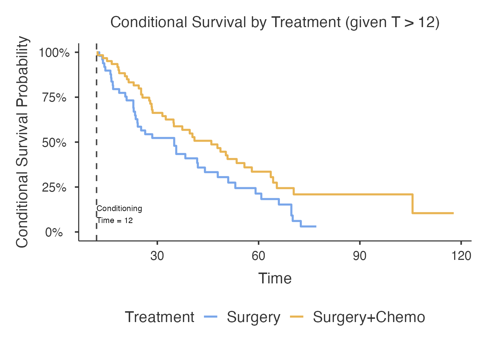
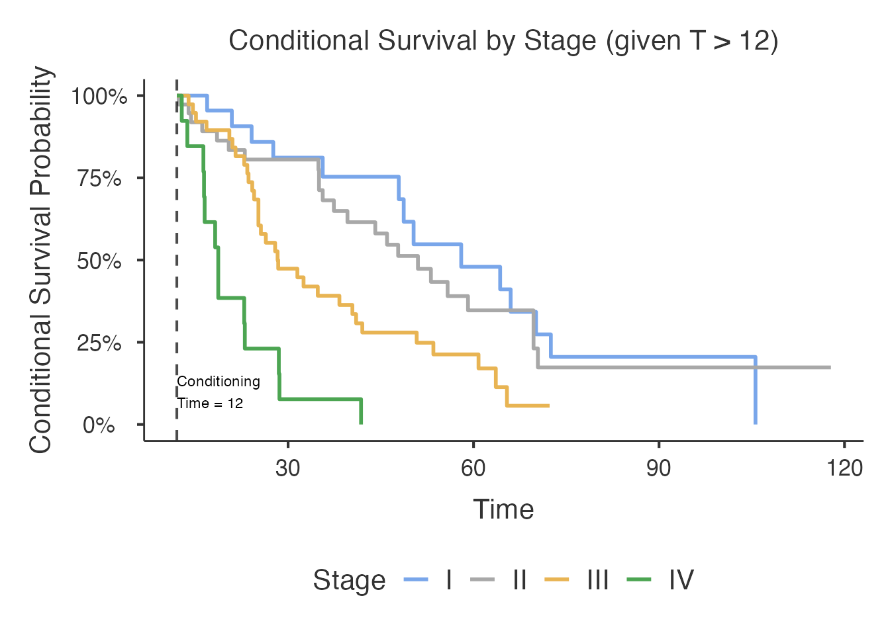

# Conditional Survival Estimation - Comprehensive Guide

> **Not yet released.** The `conditionalsurvival` analysis is on a
> development menu route, so it does not appear in the jamovi menus of
> ClinicoPath or of any of its submodules. It is documented here ahead
> of a future release, and its options, defaults and output may still
> change. The R function is exported, so the examples below run from an
> R console; what is not yet available is the jamovi analysis itself.

> **Note:**
> [`conditionalsurvival()`](https://www.serdarbalci.com/ClinicoPathJamoviModule/reference/conditionalsurvival.md)
> is designed primarily for the jamovi GUI. The R syntax shown here is
> for reference and advanced scripting.

## Conditional Survival Estimation

### Overview

In clinical oncology, a patient’s prognosis improves with each
additional year of disease-free survival. Standard Kaplan-Meier
estimates describe the probability of surviving beyond time *t* from the
moment of diagnosis or treatment. **Conditional survival** answers a
different and often more useful question: given that a patient has
already survived to time *s*, what is their probability of surviving to
time *t*?

Formally: CS(t \| s) = P(T \> t \| T \> s) = S(t) / S(s)

This is implemented via the
[`conditionalsurvival()`](https://www.serdarbalci.com/ClinicoPathJamoviModule/reference/conditionalsurvival.md)
function in the jsurvival module (menu: SurvivalD \> ClinicoPath
Survival). Four estimation methods are available:

| Method | Key | Description |
|----|----|----|
| Kaplan-Meier Weights | `km` | Weighted KM estimation via [`condSURV::KMW()`](https://rdrr.io/pkg/condSURV/man/KMW.html) (falls back to S(t)/S(s) ratio when condSURV is not available) |
| Landmark Approach | `landmark` | Subsets cohort to patients surviving past the conditioning time, then refits KM |
| Inverse Probability Weighting | `ipw` | IPCW-based estimation (stub; currently falls back to manual KM ratio) |
| Presmoothed Kaplan-Meier | `pkm` | Kernel-smoothed KM (stub; currently falls back to manual KM ratio) |

### Datasets

This vignette uses the bundled `conditionalsurvival_test` dataset:

| Dataset | N | Scenario | Key Variables |
|----|----|----|----|
| `conditionalsurvival_test` | 150 | Colorectal cancer, Weibull survival, stage-dependent hazard | `OverallTime` (months), `Event` (0/1), `EventFactor` (Alive/Dead), `Treatment`, `Stage`, `Grade`, `Age`, `Sex`, `CEA` |
| `histopathology` | varies | Built-in ClinicoPath dataset | General clinicopathological variables |

``` r

data("conditionalsurvival_test")
str(conditionalsurvival_test)
#> 'data.frame':    150 obs. of  10 variables:
#>  $ PatientID  : chr  "CS-001" "CS-002" "CS-003" "CS-004" ...
#>  $ OverallTime: num  10.6 70.4 31.6 18.7 28.4 10.7 5 16.1 20.5 35 ...
#>  $ Event      : int  1 1 0 1 1 1 1 1 1 0 ...
#>  $ EventFactor: Factor w/ 2 levels "Alive","Dead": 2 2 1 2 2 2 2 2 2 1 ...
#>  $ Age        : num  69 50 65 62 55 33 54 51 64 57 ...
#>  $ Sex        : Factor w/ 2 levels "Female","Male": 2 2 1 2 1 2 1 2 1 1 ...
#>  $ Treatment  : Factor w/ 2 levels "Surgery","Surgery+Chemo": 1 2 2 1 2 2 1 1 1 1 ...
#>  $ Stage      : Factor w/ 4 levels "I","II","III",..: 2 2 2 4 3 3 4 2 3 1 ...
#>  $ Grade      : Factor w/ 3 levels "Well","Moderate",..: 1 2 1 3 2 3 3 2 3 1 ...
#>  $ CEA        : num  13.1 15.5 12.2 17.2 20.3 16.9 19.5 15.3 15.4 20.6 ...
summary(conditionalsurvival_test[, c("OverallTime", "Event", "Treatment", "Stage")])
#>   OverallTime         Event             Treatment  Stage   
#>  Min.   :  0.70   Min.   :0.0   Surgery      :67   I  :26  
#>  1st Qu.: 10.80   1st Qu.:1.0   Surgery+Chemo:83   II :43  
#>  Median : 24.85   Median :1.0                      III:49  
#>  Mean   : 30.36   Mean   :0.8                      IV :32  
#>  3rd Qu.: 44.70   3rd Qu.:1.0                              
#>  Max.   :117.80   Max.   :1.0
```

------------------------------------------------------------------------

## Basic Usage

### Unstratified Analysis (Overall Cohort)

The simplest use case: estimate conditional survival for the entire
cohort with default settings. When `conditionTime = 0`, the function
automatically uses the median follow-up time.

``` r

conditionalsurvival(
  data         = conditionalsurvival_test,
  timeVar      = OverallTime,
  outcomeVar   = Event,
  conditionTime = 0,
  method       = "km",
  showTable    = TRUE,
  showPlot     = TRUE,
  showExplanations = TRUE
)
#> Error in `conditionalsurvival()`:
#> ! argument "conditionVar" is missing, with no default
```

### Unstratified with Fixed Conditioning Time

Set `conditionTime = 12` to ask: “Given a patient survived 12 months,
what is their probability of surviving to each subsequent time point?”

``` r

conditionalsurvival(
  data         = conditionalsurvival_test,
  timeVar      = OverallTime,
  outcomeVar   = Event,
  conditionTime = 12,
  method       = "km",
  showTable    = TRUE,
  showPlot     = TRUE,
  showExplanations = FALSE
)
#> Error in `conditionalsurvival()`:
#> ! argument "conditionVar" is missing, with no default
```

------------------------------------------------------------------------

## Stratified Analysis

### By Treatment

Compare conditional survival between Surgery and Surgery+Chemo groups.
The `conditionVar` option activates stratified analysis, producing
separate conditional survival estimates and curves per group.

``` r

conditionalsurvival(
  data         = conditionalsurvival_test,
  timeVar      = OverallTime,
  outcomeVar   = Event,
  conditionVar = Treatment,
  conditionTime = 12,
  method       = "km",
  showTable    = TRUE,
  showPlot     = TRUE,
  showExplanations = TRUE
)
#> 
#>  CONDITIONAL SURVIVAL ESTIMATION
#> 
#>  Conditional Survival Estimation Analysis
#> 
#>  This analysis calculates conditional survival probabilities, which
#>  represent the probability of surviving beyond a specific time point,
#>  given survival to a conditioning time point.
#> 
#>  How to use this analysis:
#> 
#>  Time Variable: Select the survival time variable (numeric)Event/Status
#>  Variable: Select the event indicator (0=censored, 1=event)Conditioning
#>  Variable (optional): Variable for subgroup analysisSet Analysis
#>  Options:Conditioning Time Point: Time at which to condition survival
#>  (default: median follow-up)Estimation Method: Choose from Kaplan-Meier
#>  weights, Landmark approach, IPW, or Presmoothed KMTime Points: Specify
#>  comma-separated time points for analysis (e.g., 12,24,60)
#> 
#>  Interpretation:
#> 
#>  Conditional survival P(T > t | T > s) represents the probability of
#>  surviving beyond time t, given survival to time s (conditioning time).
#>  This is clinically relevant for patients who have already survived a
#>  certain period and want to know their updated prognosis.
#> 
#>  Methods Available:
#> 
#>  Kaplan-Meier Weights: Uses weighted estimation with KM weightsLandmark
#>  Approach: Subsets data to survivors at conditioning timeInverse
#>  Probability Weighting: Accounts for censoring through
#>  weightingPresmoothed KM: Smoothed version of Kaplan-Meier estimation
#> 
#>  Conditional Survival Probabilities                                                                              
#>  ─────────────────────────────────────────────────────────────────────────────────────────────────────────────── 
#>    Group    Time Point     Conditioning Time    Conditional Survival    Standard Error    Lower CI    Upper CI   
#>  ─────────────────────────────────────────────────────────────────────────────────────────────────────────────── 
#>    .        .         ᵃ    .                    .                       .                 .           .          
#>  ─────────────────────────────────────────────────────────────────────────────────────────────────────────────── 
#>    ᵃ Error in conditional survival calculation: unused arguments (delta = status, x = condTime)
#> 
#> 
#>  Method explanation will be updated after analysis.
#> 
#> character(0)
#> 
#> character(0)
```



### By Stage

Stage has 4 levels (I, II, III, IV). Groups with fewer than 3 events are
silently skipped. Early-stage patients with few events at late
conditioning times may be excluded automatically.

``` r

conditionalsurvival(
  data         = conditionalsurvival_test,
  timeVar      = OverallTime,
  outcomeVar   = Event,
  conditionVar = Stage,
  conditionTime = 12,
  method       = "km",
  showTable    = TRUE,
  showPlot     = TRUE,
  showExplanations = FALSE
)
#> 
#>  CONDITIONAL SURVIVAL ESTIMATION
#> 
#>  Conditional Survival Estimation Analysis
#> 
#>  This analysis calculates conditional survival probabilities, which
#>  represent the probability of surviving beyond a specific time point,
#>  given survival to a conditioning time point.
#> 
#>  How to use this analysis:
#> 
#>  Time Variable: Select the survival time variable (numeric)Event/Status
#>  Variable: Select the event indicator (0=censored, 1=event)Conditioning
#>  Variable (optional): Variable for subgroup analysisSet Analysis
#>  Options:Conditioning Time Point: Time at which to condition survival
#>  (default: median follow-up)Estimation Method: Choose from Kaplan-Meier
#>  weights, Landmark approach, IPW, or Presmoothed KMTime Points: Specify
#>  comma-separated time points for analysis (e.g., 12,24,60)
#> 
#>  Interpretation:
#> 
#>  Conditional survival P(T > t | T > s) represents the probability of
#>  surviving beyond time t, given survival to time s (conditioning time).
#>  This is clinically relevant for patients who have already survived a
#>  certain period and want to know their updated prognosis.
#> 
#>  Methods Available:
#> 
#>  Kaplan-Meier Weights: Uses weighted estimation with KM weightsLandmark
#>  Approach: Subsets data to survivors at conditioning timeInverse
#>  Probability Weighting: Accounts for censoring through
#>  weightingPresmoothed KM: Smoothed version of Kaplan-Meier estimation
#> 
#>  Conditional Survival Probabilities                                                                              
#>  ─────────────────────────────────────────────────────────────────────────────────────────────────────────────── 
#>    Group    Time Point     Conditioning Time    Conditional Survival    Standard Error    Lower CI    Upper CI   
#>  ─────────────────────────────────────────────────────────────────────────────────────────────────────────────── 
#>    .        .         ᵃ    .                    .                       .                 .           .          
#>  ─────────────────────────────────────────────────────────────────────────────────────────────────────────────── 
#>    ᵃ Error in conditional survival calculation: unused arguments (delta = status, x = condTime)
#> 
#> 
#> character(0)
#> 
#> character(0)
```



### By Grade

Three tumor differentiation levels: Well, Moderate, Poor.

``` r

conditionalsurvival(
  data         = conditionalsurvival_test,
  timeVar      = OverallTime,
  outcomeVar   = Event,
  conditionVar = Grade,
  conditionTime = 12,
  method       = "km",
  showTable    = TRUE,
  showPlot     = FALSE,
  showExplanations = FALSE
)
#> 
#>  CONDITIONAL SURVIVAL ESTIMATION
#> 
#>  Conditional Survival Estimation Analysis
#> 
#>  This analysis calculates conditional survival probabilities, which
#>  represent the probability of surviving beyond a specific time point,
#>  given survival to a conditioning time point.
#> 
#>  How to use this analysis:
#> 
#>  Time Variable: Select the survival time variable (numeric)Event/Status
#>  Variable: Select the event indicator (0=censored, 1=event)Conditioning
#>  Variable (optional): Variable for subgroup analysisSet Analysis
#>  Options:Conditioning Time Point: Time at which to condition survival
#>  (default: median follow-up)Estimation Method: Choose from Kaplan-Meier
#>  weights, Landmark approach, IPW, or Presmoothed KMTime Points: Specify
#>  comma-separated time points for analysis (e.g., 12,24,60)
#> 
#>  Interpretation:
#> 
#>  Conditional survival P(T > t | T > s) represents the probability of
#>  surviving beyond time t, given survival to time s (conditioning time).
#>  This is clinically relevant for patients who have already survived a
#>  certain period and want to know their updated prognosis.
#> 
#>  Methods Available:
#> 
#>  Kaplan-Meier Weights: Uses weighted estimation with KM weightsLandmark
#>  Approach: Subsets data to survivors at conditioning timeInverse
#>  Probability Weighting: Accounts for censoring through
#>  weightingPresmoothed KM: Smoothed version of Kaplan-Meier estimation
#> 
#>  Conditional Survival Probabilities                                                                              
#>  ─────────────────────────────────────────────────────────────────────────────────────────────────────────────── 
#>    Group    Time Point     Conditioning Time    Conditional Survival    Standard Error    Lower CI    Upper CI   
#>  ─────────────────────────────────────────────────────────────────────────────────────────────────────────────── 
#>    .        .         ᵃ    .                    .                       .                 .           .          
#>  ─────────────────────────────────────────────────────────────────────────────────────────────────────────────── 
#>    ᵃ Error in conditional survival calculation: unused arguments (delta = status, x = condTime)
#> 
#> 
#> character(0)
#> 
#> character(0)
```

------------------------------------------------------------------------

## Estimation Methods

### Kaplan-Meier Weights (Default)

The default method. When the `condSURV` package is installed, uses KMW
weights for estimation. Otherwise falls back to the manual S(t)/S(s)
ratio.

``` r

conditionalsurvival(
  data         = conditionalsurvival_test,
  timeVar      = OverallTime,
  outcomeVar   = Event,
  conditionVar = Treatment,
  conditionTime = 12,
  method       = "km",
  showTable    = TRUE,
  showPlot     = FALSE,
  showExplanations = TRUE
)
#> 
#>  CONDITIONAL SURVIVAL ESTIMATION
#> 
#>  Conditional Survival Estimation Analysis
#> 
#>  This analysis calculates conditional survival probabilities, which
#>  represent the probability of surviving beyond a specific time point,
#>  given survival to a conditioning time point.
#> 
#>  How to use this analysis:
#> 
#>  Time Variable: Select the survival time variable (numeric)Event/Status
#>  Variable: Select the event indicator (0=censored, 1=event)Conditioning
#>  Variable (optional): Variable for subgroup analysisSet Analysis
#>  Options:Conditioning Time Point: Time at which to condition survival
#>  (default: median follow-up)Estimation Method: Choose from Kaplan-Meier
#>  weights, Landmark approach, IPW, or Presmoothed KMTime Points: Specify
#>  comma-separated time points for analysis (e.g., 12,24,60)
#> 
#>  Interpretation:
#> 
#>  Conditional survival P(T > t | T > s) represents the probability of
#>  surviving beyond time t, given survival to time s (conditioning time).
#>  This is clinically relevant for patients who have already survived a
#>  certain period and want to know their updated prognosis.
#> 
#>  Methods Available:
#> 
#>  Kaplan-Meier Weights: Uses weighted estimation with KM weightsLandmark
#>  Approach: Subsets data to survivors at conditioning timeInverse
#>  Probability Weighting: Accounts for censoring through
#>  weightingPresmoothed KM: Smoothed version of Kaplan-Meier estimation
#> 
#>  Conditional Survival Probabilities                                                                              
#>  ─────────────────────────────────────────────────────────────────────────────────────────────────────────────── 
#>    Group    Time Point     Conditioning Time    Conditional Survival    Standard Error    Lower CI    Upper CI   
#>  ─────────────────────────────────────────────────────────────────────────────────────────────────────────────── 
#>    .        .         ᵃ    .                    .                       .                 .           .          
#>  ─────────────────────────────────────────────────────────────────────────────────────────────────────────────── 
#>    ᵃ Error in conditional survival calculation: unused arguments (delta = status, x = condTime)
#> 
#> 
#>  Method explanation will be updated after analysis.
#> 
#> character(0)
#> 
#> character(0)
```

### Landmark Approach

The landmark method subsets the data to only patients who survived past
the conditioning time, then estimates survival from that point forward.
This is the simplest and most transparent approach but discards
information from patients censored before the landmark.

``` r

conditionalsurvival(
  data         = conditionalsurvival_test,
  timeVar      = OverallTime,
  outcomeVar   = Event,
  conditionVar = Treatment,
  conditionTime = 12,
  method       = "landmark",
  showTable    = TRUE,
  showPlot     = TRUE,
  showExplanations = TRUE
)
#> 
#>  CONDITIONAL SURVIVAL ESTIMATION
#> 
#>  Conditional Survival Estimation Analysis
#> 
#>  This analysis calculates conditional survival probabilities, which
#>  represent the probability of surviving beyond a specific time point,
#>  given survival to a conditioning time point.
#> 
#>  How to use this analysis:
#> 
#>  Time Variable: Select the survival time variable (numeric)Event/Status
#>  Variable: Select the event indicator (0=censored, 1=event)Conditioning
#>  Variable (optional): Variable for subgroup analysisSet Analysis
#>  Options:Conditioning Time Point: Time at which to condition survival
#>  (default: median follow-up)Estimation Method: Choose from Kaplan-Meier
#>  weights, Landmark approach, IPW, or Presmoothed KMTime Points: Specify
#>  comma-separated time points for analysis (e.g., 12,24,60)
#> 
#>  Interpretation:
#> 
#>  Conditional survival P(T > t | T > s) represents the probability of
#>  surviving beyond time t, given survival to time s (conditioning time).
#>  This is clinically relevant for patients who have already survived a
#>  certain period and want to know their updated prognosis.
#> 
#>  Methods Available:
#> 
#>  Kaplan-Meier Weights: Uses weighted estimation with KM weightsLandmark
#>  Approach: Subsets data to survivors at conditioning timeInverse
#>  Probability Weighting: Accounts for censoring through
#>  weightingPresmoothed KM: Smoothed version of Kaplan-Meier estimation
#> 
#>  Conditional Survival Probabilities                                                                                          
#>  ─────────────────────────────────────────────────────────────────────────────────────────────────────────────────────────── 
#>    Group            Time Point     Conditioning Time    Conditional Survival    Standard Error    Lower CI      Upper CI     
#>  ─────────────────────────────────────────────────────────────────────────────────────────────────────────────────────────── 
#>    Surgery           33.2000000           12.0000000            0.52295918 ᵃ        0.07205095    0.38174192    0.66417645   
#>    Surgery           54.3000000           12.0000000            0.24407020          0.06818663    0.11042685    0.37771354   
#>    Surgery           75.5000000           12.0000000            0.03050877          0.02978396    0.00000000    0.08888426   
#>    Surgery           96.6000000           12.0000000            0.03050877          0.02978396    0.00000000    0.08888426   
#>    Surgery          117.8000000           12.0000000            0.03050877          0.02978396    0.00000000    0.08888426   
#>    Surgery+Chemo     33.2000000           12.0000000            0.62572389          0.06335479    0.50155079    0.74989699   
#>    Surgery+Chemo     54.3000000           12.0000000            0.38331482          0.06739127    0.25123036    0.51539928   
#>    Surgery+Chemo     75.5000000           12.0000000            0.20908081          0.06536536    0.08096706    0.33719457   
#>    Surgery+Chemo     96.6000000           12.0000000            0.20908081          0.06536536    0.08096706    0.33719457   
#>    Surgery+Chemo    117.8000000           12.0000000            0.10454041          0.08082392    0.00000000    0.26295238   
#>  ─────────────────────────────────────────────────────────────────────────────────────────────────────────────────────────── 
#>    ᵃ Conditional survival probabilities given survival to time 12
#> 
#> 
#>  Method: Landmark Approach
#> 
#>  Analysis Summary:
#> 
#>  Conditioning Time: 12Number of Time Points: 10Average Conditional
#>  Survival: 0.239Range: 0.031 - 0.626
#> 
#>  Clinical Interpretation:
#> 
#>  These conditional survival probabilities represent updated survival
#>  estimates for patients who have survived to time 12. For example, a
#>  conditional survival probability of 0.80 at time point 117.8 means
#>  that patients who have survived to time 12 have an 80% probability of
#>  surviving to time 117.8.
#> 
#>  Method Description:
#> 
#>  Landmark Approach: This method subsets the data to include only
#>  patients who survived to the conditioning time point, then estimates
#>  survival from that point forward. This approach is simple but may lose
#>  information from patients censored before the landmark time.
#> 
#>  Statistical Notes:
#> 
#>  Confidence intervals are calculated using the specified confidence
#>  level (95%)Standard errors are computed using appropriate methods for
#>  each estimation approachTime points at or before the conditioning time
#>  have conditional survival probability = 1.0
#> 
#>  Report Sentence (copy-ready)
#> 
#>  <div style='background-color:#f8f9fa; padding:10px; border-left:3px
#>  solid #007bff; margin:8px 0; font-style:italic;'>Conditional survival
#>  analysis was performed using the landmark method. Given survival to
#>  12.0 in the Surgery group (n at risk = 110), the estimated conditional
#>  117.8-unit survival probability was 3.1% (95% CI: 0.0%--8.9%).
#> 
#>  Conditional survival analysis was performed using the landmark method.
#>  Given survival to 12.0 in the Surgery+Chemo group (n at risk = 110),
#>  the estimated conditional 117.8-unit survival probability was 10.5%
#>  (95% CI: 0.0%--26.3%).<p style='font-size:0.85em; color:#666;'>Tip:
#>  Copy the text above directly into your manuscript methods/results
#>  section.
#> 
#>  Assumptions & Caveats
#> 
#>  Non-informative censoring: Censored patients must have the same future
#>  survival probability as those who remain under
#>  observation.Conditioning time: Must be within the observed follow-up
#>  range. Estimates beyond maximum follow-up are unreliable.Sample size
#>  at conditioning time: The number of patients still at risk at the
#>  conditioning time must be adequate. Small risk sets produce unstable
#>  estimates.Interpretation: CS(t|t0) = P(T > t | T > t0). This is NOT
#>  the same as the unconditional survival probability.Clinical use:
#>  Conditional survival is most useful for patient counseling after a
#>  period of disease-free survival (e.g., '5-year survival given you
#>  already survived 2 years').
```


### Inverse Probability Weighting

The IPW method is intended to use inverse probability of censoring
weights for unbiased estimation. Currently implemented as a stub that
falls back to the manual KM ratio method.

``` r

conditionalsurvival(
  data         = conditionalsurvival_test,
  timeVar      = OverallTime,
  outcomeVar   = Event,
  conditionVar = Treatment,
  conditionTime = 12,
  method       = "ipw",
  showTable    = TRUE,
  showPlot     = FALSE,
  showExplanations = TRUE
)
#> 
#>  CONDITIONAL SURVIVAL ESTIMATION
#> 
#>  Conditional Survival Estimation Analysis
#> 
#>  This analysis calculates conditional survival probabilities, which
#>  represent the probability of surviving beyond a specific time point,
#>  given survival to a conditioning time point.
#> 
#>  How to use this analysis:
#> 
#>  Time Variable: Select the survival time variable (numeric)Event/Status
#>  Variable: Select the event indicator (0=censored, 1=event)Conditioning
#>  Variable (optional): Variable for subgroup analysisSet Analysis
#>  Options:Conditioning Time Point: Time at which to condition survival
#>  (default: median follow-up)Estimation Method: Choose from Kaplan-Meier
#>  weights, Landmark approach, IPW, or Presmoothed KMTime Points: Specify
#>  comma-separated time points for analysis (e.g., 12,24,60)
#> 
#>  Interpretation:
#> 
#>  Conditional survival P(T > t | T > s) represents the probability of
#>  surviving beyond time t, given survival to time s (conditioning time).
#>  This is clinically relevant for patients who have already survived a
#>  certain period and want to know their updated prognosis.
#> 
#>  Methods Available:
#> 
#>  Kaplan-Meier Weights: Uses weighted estimation with KM weightsLandmark
#>  Approach: Subsets data to survivors at conditioning timeInverse
#>  Probability Weighting: Accounts for censoring through
#>  weightingPresmoothed KM: Smoothed version of Kaplan-Meier estimation
#> 
#>  Conditional Survival Probabilities                                                                                          
#>  ─────────────────────────────────────────────────────────────────────────────────────────────────────────────────────────── 
#>    Group            Time Point     Conditioning Time    Conditional Survival    Standard Error    Lower CI      Upper CI     
#>  ─────────────────────────────────────────────────────────────────────────────────────────────────────────────────────────── 
#>    Surgery           33.2000000           12.0000000            0.52295918 ᵃ        0.08954841    0.34744752    0.69847084   
#>    Surgery           54.3000000           12.0000000            0.24407020          0.07256249    0.10185033    0.38629006   
#>    Surgery           75.5000000           12.0000000            0.03050877          0.02994508    0.00000000    0.08920005   
#>    Surgery           96.6000000           12.0000000            0.03050877          0.02994508    0.00000000    0.08920005   
#>    Surgery          117.8000000           12.0000000            0.03050877          0.02994508    0.00000000    0.08920005   
#>    Surgery+Chemo     33.2000000           12.0000000            0.62572389          0.08524928    0.45863838    0.79280941   
#>    Surgery+Chemo     54.3000000           12.0000000            0.38331482          0.07591160    0.23453082    0.53209882   
#>    Surgery+Chemo     75.5000000           12.0000000            0.20908081          0.06808744    0.07563188    0.34252974   
#>    Surgery+Chemo     96.6000000           12.0000000            0.20908081          0.06808744    0.07563188    0.34252974   
#>    Surgery+Chemo    117.8000000           12.0000000            0.10454041          0.08138380    0.00000000    0.26404973   
#>  ─────────────────────────────────────────────────────────────────────────────────────────────────────────────────────────── 
#>    ᵃ Conditional survival probabilities given survival to time 12
#> 
#> 
#>  Method: Inverse Probability Weighting
#> 
#>  Analysis Summary:
#> 
#>  Conditioning Time: 12Number of Time Points: 10Average Conditional
#>  Survival: 0.239Range: 0.031 - 0.626
#> 
#>  Clinical Interpretation:
#> 
#>  These conditional survival probabilities represent updated survival
#>  estimates for patients who have survived to time 12. For example, a
#>  conditional survival probability of 0.80 at time point 117.8 means
#>  that patients who have survived to time 12 have an 80% probability of
#>  surviving to time 117.8.
#> 
#>  Method Description:
#> 
#>  Inverse Probability Weighting: This approach uses inverse probability
#>  weights to account for censoring, providing unbiased estimates of
#>  conditional survival probabilities even when censoring is informative.
#> 
#>  Statistical Notes:
#> 
#>  Confidence intervals are calculated using the specified confidence
#>  level (95%)Standard errors are computed using appropriate methods for
#>  each estimation approachTime points at or before the conditioning time
#>  have conditional survival probability = 1.0
#> 
#>  Report Sentence (copy-ready)
#> 
#>  <div style='background-color:#f8f9fa; padding:10px; border-left:3px
#>  solid #007bff; margin:8px 0; font-style:italic;'>Conditional survival
#>  analysis was performed using the inverse probability weighting method.
#>  Given survival to 12.0 in the Surgery group (n at risk = 110), the
#>  estimated conditional 117.8-unit survival probability was 3.1% (95%
#>  CI: 0.0%--8.9%).
#> 
#>  Conditional survival analysis was performed using the inverse
#>  probability weighting method. Given survival to 12.0 in the
#>  Surgery+Chemo group (n at risk = 110), the estimated conditional
#>  117.8-unit survival probability was 10.5% (95% CI: 0.0%--26.4%).<p
#>  style='font-size:0.85em; color:#666;'>Tip: Copy the text above
#>  directly into your manuscript methods/results section.
#> 
#>  Assumptions & Caveats
#> 
#>  Non-informative censoring: Censored patients must have the same future
#>  survival probability as those who remain under
#>  observation.Conditioning time: Must be within the observed follow-up
#>  range. Estimates beyond maximum follow-up are unreliable.Sample size
#>  at conditioning time: The number of patients still at risk at the
#>  conditioning time must be adequate. Small risk sets produce unstable
#>  estimates.Interpretation: CS(t|t0) = P(T > t | T > t0). This is NOT
#>  the same as the unconditional survival probability.Clinical use:
#>  Conditional survival is most useful for patient counseling after a
#>  period of disease-free survival (e.g., '5-year survival given you
#>  already survived 2 years').
```

### Presmoothed Kaplan-Meier

The PKM method applies kernel smoothing to the KM estimator. Currently a
stub that falls back to the manual KM ratio. The `bandwidth` option is
reserved for controlling the smoothing bandwidth when this method is
fully implemented.

``` r

conditionalsurvival(
  data         = conditionalsurvival_test,
  timeVar      = OverallTime,
  outcomeVar   = Event,
  conditionVar = Treatment,
  conditionTime = 12,
  method       = "pkm",
  bandwidth    = 0,
  showTable    = TRUE,
  showPlot     = FALSE,
  showExplanations = TRUE
)
#> 
#>  CONDITIONAL SURVIVAL ESTIMATION
#> 
#>  Conditional Survival Estimation Analysis
#> 
#>  This analysis calculates conditional survival probabilities, which
#>  represent the probability of surviving beyond a specific time point,
#>  given survival to a conditioning time point.
#> 
#>  How to use this analysis:
#> 
#>  Time Variable: Select the survival time variable (numeric)Event/Status
#>  Variable: Select the event indicator (0=censored, 1=event)Conditioning
#>  Variable (optional): Variable for subgroup analysisSet Analysis
#>  Options:Conditioning Time Point: Time at which to condition survival
#>  (default: median follow-up)Estimation Method: Choose from Kaplan-Meier
#>  weights, Landmark approach, IPW, or Presmoothed KMTime Points: Specify
#>  comma-separated time points for analysis (e.g., 12,24,60)
#> 
#>  Interpretation:
#> 
#>  Conditional survival P(T > t | T > s) represents the probability of
#>  surviving beyond time t, given survival to time s (conditioning time).
#>  This is clinically relevant for patients who have already survived a
#>  certain period and want to know their updated prognosis.
#> 
#>  Methods Available:
#> 
#>  Kaplan-Meier Weights: Uses weighted estimation with KM weightsLandmark
#>  Approach: Subsets data to survivors at conditioning timeInverse
#>  Probability Weighting: Accounts for censoring through
#>  weightingPresmoothed KM: Smoothed version of Kaplan-Meier estimation
#> 
#>  Conditional Survival Probabilities                                                                                          
#>  ─────────────────────────────────────────────────────────────────────────────────────────────────────────────────────────── 
#>    Group            Time Point     Conditioning Time    Conditional Survival    Standard Error    Lower CI      Upper CI     
#>  ─────────────────────────────────────────────────────────────────────────────────────────────────────────────────────────── 
#>    Surgery           33.2000000           12.0000000            0.52295918 ᵃ        0.08954841    0.34744752    0.69847084   
#>    Surgery           54.3000000           12.0000000            0.24407020          0.07256249    0.10185033    0.38629006   
#>    Surgery           75.5000000           12.0000000            0.03050877          0.02994508    0.00000000    0.08920005   
#>    Surgery           96.6000000           12.0000000            0.03050877          0.02994508    0.00000000    0.08920005   
#>    Surgery          117.8000000           12.0000000            0.03050877          0.02994508    0.00000000    0.08920005   
#>    Surgery+Chemo     33.2000000           12.0000000            0.62572389          0.08524928    0.45863838    0.79280941   
#>    Surgery+Chemo     54.3000000           12.0000000            0.38331482          0.07591160    0.23453082    0.53209882   
#>    Surgery+Chemo     75.5000000           12.0000000            0.20908081          0.06808744    0.07563188    0.34252974   
#>    Surgery+Chemo     96.6000000           12.0000000            0.20908081          0.06808744    0.07563188    0.34252974   
#>    Surgery+Chemo    117.8000000           12.0000000            0.10454041          0.08138380    0.00000000    0.26404973   
#>  ─────────────────────────────────────────────────────────────────────────────────────────────────────────────────────────── 
#>    ᵃ Conditional survival probabilities given survival to time 12
#> 
#> 
#>  Method: Presmoothed Kaplan-Meier
#> 
#>  Analysis Summary:
#> 
#>  Conditioning Time: 12Number of Time Points: 10Average Conditional
#>  Survival: 0.239Range: 0.031 - 0.626
#> 
#>  Clinical Interpretation:
#> 
#>  These conditional survival probabilities represent updated survival
#>  estimates for patients who have survived to time 12. For example, a
#>  conditional survival probability of 0.80 at time point 117.8 means
#>  that patients who have survived to time 12 have an 80% probability of
#>  surviving to time 117.8.
#> 
#>  Method Description:
#> 
#>  Presmoothed Kaplan-Meier: This method applies smoothing techniques to
#>  the Kaplan-Meier estimator to reduce variability and provide more
#>  stable conditional survival estimates.
#> 
#>  Statistical Notes:
#> 
#>  Confidence intervals are calculated using the specified confidence
#>  level (95%)Standard errors are computed using appropriate methods for
#>  each estimation approachTime points at or before the conditioning time
#>  have conditional survival probability = 1.0
#> 
#>  Report Sentence (copy-ready)
#> 
#>  <div style='background-color:#f8f9fa; padding:10px; border-left:3px
#>  solid #007bff; margin:8px 0; font-style:italic;'>Conditional survival
#>  analysis was performed using the presmoothed Kaplan-Meier method.
#>  Given survival to 12.0 in the Surgery group (n at risk = 110), the
#>  estimated conditional 117.8-unit survival probability was 3.1% (95%
#>  CI: 0.0%--8.9%).
#> 
#>  Conditional survival analysis was performed using the presmoothed
#>  Kaplan-Meier method. Given survival to 12.0 in the Surgery+Chemo group
#>  (n at risk = 110), the estimated conditional 117.8-unit survival
#>  probability was 10.5% (95% CI: 0.0%--26.4%).<p
#>  style='font-size:0.85em; color:#666;'>Tip: Copy the text above
#>  directly into your manuscript methods/results section.
#> 
#>  Assumptions & Caveats
#> 
#>  Non-informative censoring: Censored patients must have the same future
#>  survival probability as those who remain under
#>  observation.Conditioning time: Must be within the observed follow-up
#>  range. Estimates beyond maximum follow-up are unreliable.Sample size
#>  at conditioning time: The number of patients still at risk at the
#>  conditioning time must be adequate. Small risk sets produce unstable
#>  estimates.Interpretation: CS(t|t0) = P(T > t | T > t0). This is NOT
#>  the same as the unconditional survival probability.Clinical use:
#>  Conditional survival is most useful for patient counseling after a
#>  period of disease-free survival (e.g., '5-year survival given you
#>  already survived 2 years').
```

------------------------------------------------------------------------

## Custom Time Points

By default, the function generates ~5 evenly spaced time points from the
conditioning time to the maximum follow-up. Use the `timePoints` option
to specify exact time points of clinical interest (comma-separated
string).

### Clinically Meaningful Time Points

For example, 1-year, 2-year, 3-year, and 5-year conditional survival
given survival to 12 months:

``` r

conditionalsurvival(
  data         = conditionalsurvival_test,
  timeVar      = OverallTime,
  outcomeVar   = Event,
  conditionTime = 12,
  timePoints   = "24,36,48,60",
  method       = "km",
  showTable    = TRUE,
  showPlot     = FALSE,
  showExplanations = FALSE
)
#> Error in `conditionalsurvival()`:
#> ! argument "conditionVar" is missing, with no default
```

### Time Points Including Values Before Conditioning Time

When a requested time point is at or before the conditioning time, the
conditional survival is exactly 1.0 (the patient has already survived
past that point).

``` r

conditionalsurvival(
  data         = conditionalsurvival_test,
  timeVar      = OverallTime,
  outcomeVar   = Event,
  conditionTime = 24,
  timePoints   = "12,18,24,36,48,60",
  method       = "km",
  showTable    = TRUE,
  showPlot     = FALSE,
  showExplanations = FALSE
)
#> Error in `conditionalsurvival()`:
#> ! argument "conditionVar" is missing, with no default
```

### Sparse Time Points

Only two time points of interest:

``` r

conditionalsurvival(
  data         = conditionalsurvival_test,
  timeVar      = OverallTime,
  outcomeVar   = Event,
  conditionVar = Treatment,
  conditionTime = 6,
  timePoints   = "24,60",
  method       = "km",
  showTable    = TRUE,
  showPlot     = FALSE,
  showExplanations = FALSE
)
#> 
#>  CONDITIONAL SURVIVAL ESTIMATION
#> 
#>  Conditional Survival Estimation Analysis
#> 
#>  This analysis calculates conditional survival probabilities, which
#>  represent the probability of surviving beyond a specific time point,
#>  given survival to a conditioning time point.
#> 
#>  How to use this analysis:
#> 
#>  Time Variable: Select the survival time variable (numeric)Event/Status
#>  Variable: Select the event indicator (0=censored, 1=event)Conditioning
#>  Variable (optional): Variable for subgroup analysisSet Analysis
#>  Options:Conditioning Time Point: Time at which to condition survival
#>  (default: median follow-up)Estimation Method: Choose from Kaplan-Meier
#>  weights, Landmark approach, IPW, or Presmoothed KMTime Points: Specify
#>  comma-separated time points for analysis (e.g., 12,24,60)
#> 
#>  Interpretation:
#> 
#>  Conditional survival P(T > t | T > s) represents the probability of
#>  surviving beyond time t, given survival to time s (conditioning time).
#>  This is clinically relevant for patients who have already survived a
#>  certain period and want to know their updated prognosis.
#> 
#>  Methods Available:
#> 
#>  Kaplan-Meier Weights: Uses weighted estimation with KM weightsLandmark
#>  Approach: Subsets data to survivors at conditioning timeInverse
#>  Probability Weighting: Accounts for censoring through
#>  weightingPresmoothed KM: Smoothed version of Kaplan-Meier estimation
#> 
#>  Conditional Survival Probabilities                                                                              
#>  ─────────────────────────────────────────────────────────────────────────────────────────────────────────────── 
#>    Group    Time Point     Conditioning Time    Conditional Survival    Standard Error    Lower CI    Upper CI   
#>  ─────────────────────────────────────────────────────────────────────────────────────────────────────────────── 
#>    .        .         ᵃ    .                    .                       .                 .           .          
#>  ─────────────────────────────────────────────────────────────────────────────────────────────────────────────── 
#>    ᵃ Error in conditional survival calculation: unused arguments (delta = status, x = condTime)
#> 
#> 
#> character(0)
#> 
#> character(0)
```

------------------------------------------------------------------------

## Factor Outcome Variable

The `outcomeVar` accepts both numeric (0/1) and factor (2-level)
variables. Factor variables are converted internally: the first level
becomes 0 (censored), the second level becomes 1 (event).

### Using EventFactor (Alive/Dead)

``` r

conditionalsurvival(
  data         = conditionalsurvival_test,
  timeVar      = OverallTime,
  outcomeVar   = EventFactor,
  conditionVar = Treatment,
  conditionTime = 12,
  method       = "km",
  showTable    = TRUE,
  showPlot     = TRUE,
  showExplanations = FALSE
)
#> 
#>  CONDITIONAL SURVIVAL ESTIMATION
#> 
#>  Conditional Survival Estimation Analysis
#> 
#>  This analysis calculates conditional survival probabilities, which
#>  represent the probability of surviving beyond a specific time point,
#>  given survival to a conditioning time point.
#> 
#>  How to use this analysis:
#> 
#>  Time Variable: Select the survival time variable (numeric)Event/Status
#>  Variable: Select the event indicator (0=censored, 1=event)Conditioning
#>  Variable (optional): Variable for subgroup analysisSet Analysis
#>  Options:Conditioning Time Point: Time at which to condition survival
#>  (default: median follow-up)Estimation Method: Choose from Kaplan-Meier
#>  weights, Landmark approach, IPW, or Presmoothed KMTime Points: Specify
#>  comma-separated time points for analysis (e.g., 12,24,60)
#> 
#>  Interpretation:
#> 
#>  Conditional survival P(T > t | T > s) represents the probability of
#>  surviving beyond time t, given survival to time s (conditioning time).
#>  This is clinically relevant for patients who have already survived a
#>  certain period and want to know their updated prognosis.
#> 
#>  Methods Available:
#> 
#>  Kaplan-Meier Weights: Uses weighted estimation with KM weightsLandmark
#>  Approach: Subsets data to survivors at conditioning timeInverse
#>  Probability Weighting: Accounts for censoring through
#>  weightingPresmoothed KM: Smoothed version of Kaplan-Meier estimation
#> 
#>  Conditional Survival Probabilities                                                                              
#>  ─────────────────────────────────────────────────────────────────────────────────────────────────────────────── 
#>    Group    Time Point     Conditioning Time    Conditional Survival    Standard Error    Lower CI    Upper CI   
#>  ─────────────────────────────────────────────────────────────────────────────────────────────────────────────── 
#>    .        .         ᵃ    .                    .                       .                 .           .          
#>  ─────────────────────────────────────────────────────────────────────────────────────────────────────────────── 
#>    ᵃ Error in conditional survival calculation: unused arguments (delta = status, x = condTime)
#> 
#> 
#> character(0)
#> 
#> character(0)
```


------------------------------------------------------------------------

## Confidence Level Variations

The `confInt` option controls the width of confidence intervals around
conditional survival estimates. The default is 0.95 (95% CI).

### 90% Confidence Intervals

``` r

conditionalsurvival(
  data         = conditionalsurvival_test,
  timeVar      = OverallTime,
  outcomeVar   = Event,
  conditionTime = 12,
  confInt      = 0.90,
  method       = "km",
  showTable    = TRUE,
  showPlot     = FALSE,
  showExplanations = FALSE
)
#> Error in `conditionalsurvival()`:
#> ! argument "conditionVar" is missing, with no default
```

### 99% Confidence Intervals

``` r

conditionalsurvival(
  data         = conditionalsurvival_test,
  timeVar      = OverallTime,
  outcomeVar   = Event,
  conditionTime = 12,
  confInt      = 0.99,
  method       = "km",
  showTable    = TRUE,
  showPlot     = FALSE,
  showExplanations = FALSE
)
#> Error in `conditionalsurvival()`:
#> ! argument "conditionVar" is missing, with no default
```

### 80% Confidence Intervals

``` r

conditionalsurvival(
  data         = conditionalsurvival_test,
  timeVar      = OverallTime,
  outcomeVar   = Event,
  conditionVar = Treatment,
  conditionTime = 12,
  confInt      = 0.80,
  method       = "landmark",
  showTable    = TRUE,
  showPlot     = FALSE,
  showExplanations = FALSE
)
#> 
#>  CONDITIONAL SURVIVAL ESTIMATION
#> 
#>  Conditional Survival Estimation Analysis
#> 
#>  This analysis calculates conditional survival probabilities, which
#>  represent the probability of surviving beyond a specific time point,
#>  given survival to a conditioning time point.
#> 
#>  How to use this analysis:
#> 
#>  Time Variable: Select the survival time variable (numeric)Event/Status
#>  Variable: Select the event indicator (0=censored, 1=event)Conditioning
#>  Variable (optional): Variable for subgroup analysisSet Analysis
#>  Options:Conditioning Time Point: Time at which to condition survival
#>  (default: median follow-up)Estimation Method: Choose from Kaplan-Meier
#>  weights, Landmark approach, IPW, or Presmoothed KMTime Points: Specify
#>  comma-separated time points for analysis (e.g., 12,24,60)
#> 
#>  Interpretation:
#> 
#>  Conditional survival P(T > t | T > s) represents the probability of
#>  surviving beyond time t, given survival to time s (conditioning time).
#>  This is clinically relevant for patients who have already survived a
#>  certain period and want to know their updated prognosis.
#> 
#>  Methods Available:
#> 
#>  Kaplan-Meier Weights: Uses weighted estimation with KM weightsLandmark
#>  Approach: Subsets data to survivors at conditioning timeInverse
#>  Probability Weighting: Accounts for censoring through
#>  weightingPresmoothed KM: Smoothed version of Kaplan-Meier estimation
#> 
#>  Conditional Survival Probabilities                                                                                           
#>  ──────────────────────────────────────────────────────────────────────────────────────────────────────────────────────────── 
#>    Group            Time Point     Conditioning Time    Conditional Survival    Standard Error    Lower CI       Upper CI     
#>  ──────────────────────────────────────────────────────────────────────────────────────────────────────────────────────────── 
#>    Surgery           33.2000000           12.0000000            0.52295918 ᵃ        0.07205095      0.4306222    0.61529619   
#>    Surgery           54.3000000           12.0000000            0.24407020          0.06818663      0.1566855    0.33145488   
#>    Surgery           75.5000000           12.0000000            0.03050877          0.02978396      0.0000000    0.06867846   
#>    Surgery           96.6000000           12.0000000            0.03050877          0.02978396      0.0000000    0.06867846   
#>    Surgery          117.8000000           12.0000000            0.03050877          0.02978396      0.0000000    0.06867846   
#>    Surgery+Chemo     33.2000000           12.0000000            0.62572389          0.06335479      0.5445315    0.70691632   
#>    Surgery+Chemo     54.3000000           12.0000000            0.38331482          0.06739127      0.2969494    0.46968021   
#>    Surgery+Chemo     75.5000000           12.0000000            0.20908081          0.06536536      0.1253117    0.29284989   
#>    Surgery+Chemo     96.6000000           12.0000000            0.20908081          0.06536536      0.1253117    0.29284989   
#>    Surgery+Chemo    117.8000000           12.0000000            0.10454041          0.08082392    9.603864e-4    0.20812043   
#>  ──────────────────────────────────────────────────────────────────────────────────────────────────────────────────────────── 
#>    ᵃ Conditional survival probabilities given survival to time 12
#> 
#> 
#>  Report Sentence (copy-ready)
#> 
#>  <div style='background-color:#f8f9fa; padding:10px; border-left:3px
#>  solid #007bff; margin:8px 0; font-style:italic;'>Conditional survival
#>  analysis was performed using the landmark method. Given survival to
#>  12.0 in the Surgery group (n at risk = 110), the estimated conditional
#>  117.8-unit survival probability was 3.1% (80% CI: 0.0%--6.9%).
#> 
#>  Conditional survival analysis was performed using the landmark method.
#>  Given survival to 12.0 in the Surgery+Chemo group (n at risk = 110),
#>  the estimated conditional 117.8-unit survival probability was 10.5%
#>  (80% CI: 0.1%--20.8%).<p style='font-size:0.85em; color:#666;'>Tip:
#>  Copy the text above directly into your manuscript methods/results
#>  section.
#> 
#>  Assumptions & Caveats
#> 
#>  Non-informative censoring: Censored patients must have the same future
#>  survival probability as those who remain under
#>  observation.Conditioning time: Must be within the observed follow-up
#>  range. Estimates beyond maximum follow-up are unreliable.Sample size
#>  at conditioning time: The number of patients still at risk at the
#>  conditioning time must be adequate. Small risk sets produce unstable
#>  estimates.Interpretation: CS(t|t0) = P(T > t | T > t0). This is NOT
#>  the same as the unconditional survival probability.Clinical use:
#>  Conditional survival is most useful for patient counseling after a
#>  period of disease-free survival (e.g., '5-year survival given you
#>  already survived 2 years').
```

------------------------------------------------------------------------

## Edge Cases

### Conditioning Time at Median (Auto-Selection)

When `conditionTime` is 0, NULL, or NA, the function uses the median
follow-up time. This is the safest default for exploratory analyses.

``` r

conditionalsurvival(
  data         = conditionalsurvival_test,
  timeVar      = OverallTime,
  outcomeVar   = Event,
  conditionTime = 0,
  method       = "km",
  showTable    = TRUE,
  showPlot     = FALSE,
  showExplanations = FALSE
)
#> Error in `conditionalsurvival()`:
#> ! argument "conditionVar" is missing, with no default
```

### Late Conditioning Time

A late conditioning time reduces the risk set. Estimates become less
stable with wider confidence intervals.

``` r

conditionalsurvival(
  data         = conditionalsurvival_test,
  timeVar      = OverallTime,
  outcomeVar   = Event,
  conditionTime = 60,
  method       = "km",
  showTable    = TRUE,
  showPlot     = TRUE,
  showExplanations = FALSE
)
#> Error in `conditionalsurvival()`:
#> ! argument "conditionVar" is missing, with no default
```

### Conditioning Time Beyond Maximum Follow-Up (Expect Error)

When the conditioning time is at or beyond the maximum observed
follow-up, the function rejects the analysis with an informative error.

``` r

conditionalsurvival(
  data         = conditionalsurvival_test,
  timeVar      = OverallTime,
  outcomeVar   = Event,
  conditionTime = 200,
  method       = "km",
  showTable    = TRUE,
  showPlot     = FALSE,
  showExplanations = FALSE
)
#> Error in `conditionalsurvival()`:
#> ! argument "conditionVar" is missing, with no default
```

### Too Few Events (Expect Error)

A dataset with fewer than 5 events is rejected.

``` r

few_events_data <- data.frame(
  time  = c(5, 10, 15, 20, 25, 30, 35, 40, 45, 50,
            55, 60, 65, 70, 75, 80, 85, 90, 95, 100),
  event = c(1, 1, 0, 0, 0, 0, 0, 0, 0, 0,
            0, 0, 0, 0, 0, 0, 0, 0, 0, 0),
  group = rep(c("A", "B"), 10)
)

conditionalsurvival(
  data         = few_events_data,
  timeVar      = time,
  outcomeVar   = event,
  conditionTime = 10,
  method       = "km",
  showTable    = TRUE,
  showPlot     = FALSE,
  showExplanations = FALSE
)
#> Error in `conditionalsurvival()`:
#> ! argument "conditionVar" is missing, with no default
```

### Three-Level Factor Outcome (Expect Error)

The outcome variable must have exactly 2 levels. A 3-level factor is
rejected.

``` r

bad_data <- conditionalsurvival_test
bad_data$BadOutcome <- factor(
  sample(c("Alive", "Dead", "Unknown"), nrow(bad_data), replace = TRUE)
)

conditionalsurvival(
  data         = bad_data,
  timeVar      = OverallTime,
  outcomeVar   = BadOutcome,
  conditionTime = 12,
  method       = "km",
  showTable    = TRUE,
  showPlot     = FALSE,
  showExplanations = FALSE
)
#> Error in `conditionalsurvival()`:
#> ! argument "conditionVar" is missing, with no default
```

### Single-Level Conditioning Variable (Expect Error)

A grouping variable with only one level cannot be used for stratified
analysis.

``` r

single_data <- conditionalsurvival_test
single_data$SingleGroup <- "Everyone"

conditionalsurvival(
  data         = single_data,
  timeVar      = OverallTime,
  outcomeVar   = Event,
  conditionVar = SingleGroup,
  conditionTime = 12,
  method       = "km",
  showTable    = TRUE,
  showPlot     = FALSE,
  showExplanations = FALSE
)
#> Error:
#> ! The conditioning variable has fewer than 2 levels. Stratified analysis requires at least 2 groups.
```

### Display Options: All Off

The `showTable`, `showPlot`, and `showExplanations` toggles control
visibility of their respective panels. The `todo`, `reportSentence`, and
`assumptions` panels are always visible.

``` r

conditionalsurvival(
  data         = conditionalsurvival_test,
  timeVar      = OverallTime,
  outcomeVar   = Event,
  conditionVar = Treatment,
  conditionTime = 12,
  method       = "km",
  showTable    = FALSE,
  showPlot     = FALSE,
  showExplanations = FALSE
)
#> 
#>  CONDITIONAL SURVIVAL ESTIMATION
#> 
#>  Conditional Survival Estimation Analysis
#> 
#>  This analysis calculates conditional survival probabilities, which
#>  represent the probability of surviving beyond a specific time point,
#>  given survival to a conditioning time point.
#> 
#>  How to use this analysis:
#> 
#>  Time Variable: Select the survival time variable (numeric)Event/Status
#>  Variable: Select the event indicator (0=censored, 1=event)Conditioning
#>  Variable (optional): Variable for subgroup analysisSet Analysis
#>  Options:Conditioning Time Point: Time at which to condition survival
#>  (default: median follow-up)Estimation Method: Choose from Kaplan-Meier
#>  weights, Landmark approach, IPW, or Presmoothed KMTime Points: Specify
#>  comma-separated time points for analysis (e.g., 12,24,60)
#> 
#>  Interpretation:
#> 
#>  Conditional survival P(T > t | T > s) represents the probability of
#>  surviving beyond time t, given survival to time s (conditioning time).
#>  This is clinically relevant for patients who have already survived a
#>  certain period and want to know their updated prognosis.
#> 
#>  Methods Available:
#> 
#>  Kaplan-Meier Weights: Uses weighted estimation with KM weightsLandmark
#>  Approach: Subsets data to survivors at conditioning timeInverse
#>  Probability Weighting: Accounts for censoring through
#>  weightingPresmoothed KM: Smoothed version of Kaplan-Meier estimation
#> 
#> character(0)
#> 
#> character(0)
```

### Plot Type Option (Currently Curves Only)

The `plotType` option accepts `"curves"`, `"probability"`, or `"both"`,
but the plot rendering currently always draws the curves style
regardless of the selected value.

``` r

conditionalsurvival(
  data         = conditionalsurvival_test,
  timeVar      = OverallTime,
  outcomeVar   = Event,
  conditionTime = 12,
  plotType     = "probability",
  method       = "km",
  showTable    = FALSE,
  showPlot     = TRUE,
  showExplanations = FALSE
)
#> Error in `conditionalsurvival()`:
#> ! argument "conditionVar" is missing, with no default
```

------------------------------------------------------------------------

## Clinical Interpretation

Conditional survival is most valuable in clinical settings where
patients return for follow-up visits and want updated prognostic
information.

**Key interpretation points:**

1.  **CS(t \| s) is always \>= S(t)**: A patient who has survived to
    time *s* always has a survival probability at least as high as the
    original unconditional estimate at time *t*.

2.  **The conditioning effect is strongest early**: The biggest
    prognostic “improvement” from conditional survival typically occurs
    in the first 1–3 years after treatment, when the hazard is highest.

3.  **Plateau behavior**: If the hazard decreases over time (as in many
    cancers after successful treatment), conditional survival
    probabilities approach 1.0 as the conditioning time increases.

4.  **Group comparisons**: Stratified conditional survival can reveal
    whether prognostic differences between treatment arms or stage
    groups narrow over time (a common pattern in oncology).

5.  **Clinical communication**: The report sentence generated by this
    function is designed to be copied directly into manuscript results
    sections.

### Example: Prognostic Update at Different Conditioning Times

``` r

conditionalsurvival(
  data         = conditionalsurvival_test,
  timeVar      = OverallTime,
  outcomeVar   = Event,
  conditionTime = 6,
  timePoints   = "12,24,36,60",
  method       = "km",
  showTable    = TRUE,
  showPlot     = FALSE,
  showExplanations = FALSE
)
#> Error in `conditionalsurvival()`:
#> ! argument "conditionVar" is missing, with no default
```

``` r

conditionalsurvival(
  data         = conditionalsurvival_test,
  timeVar      = OverallTime,
  outcomeVar   = Event,
  conditionTime = 24,
  timePoints   = "36,48,60,72",
  method       = "km",
  showTable    = TRUE,
  showPlot     = FALSE,
  showExplanations = FALSE
)
#> Error in `conditionalsurvival()`:
#> ! argument "conditionVar" is missing, with no default
```

------------------------------------------------------------------------

## References

1.  Hieke S, Kleber M, Konig C, Engelhardt M, Schumacher M. Conditional
    survival: a useful concept to provide information on how prognosis
    evolves over time. *Clin Cancer Res*. 2015;21(7):1530-1536.

2.  Zamboni BA, Yothers G, Choi M, et al. Conditional survival and the
    choice of conditioning set for patients with colon cancer: an
    analysis of NSABP trials C-03 through C-07. *J Clin Oncol*.
    2010;28(15):2544-2548.

3.  Skuladottir H, Olsen JH. Conditional survival of patients with the
    four main types of lung cancer in Denmark, 1978-2001. *Cancer*.
    2003;97(8): 2014-2019.

4.  Beran R. Nonparametric regression with randomly censored survival
    data. Technical Report, University of California, Berkeley. 1981.

5.  Meira-Machado L, de Una-Alvarez J, Cadarso-Suarez C. Nonparametric
    estimation of transition probabilities in a non-Markov illness-death
    model. *Lifetime Data Anal*. 2006;12(3):325-344.
