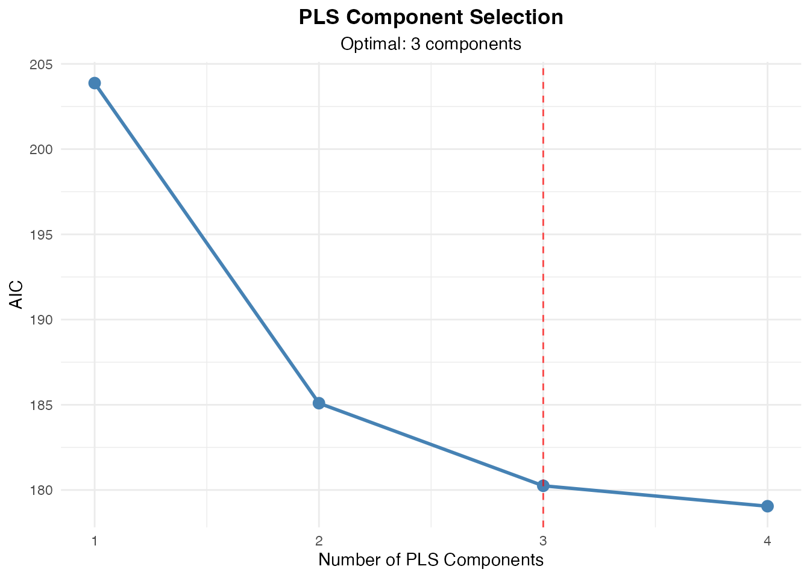
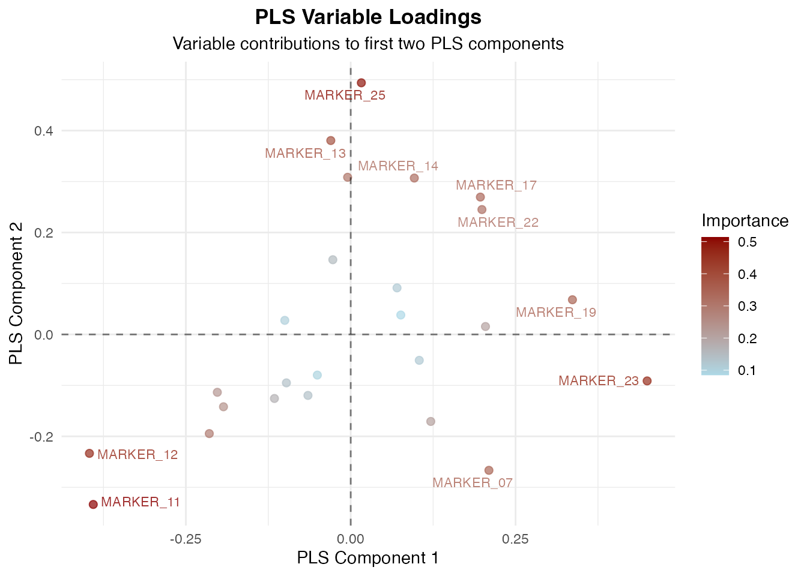
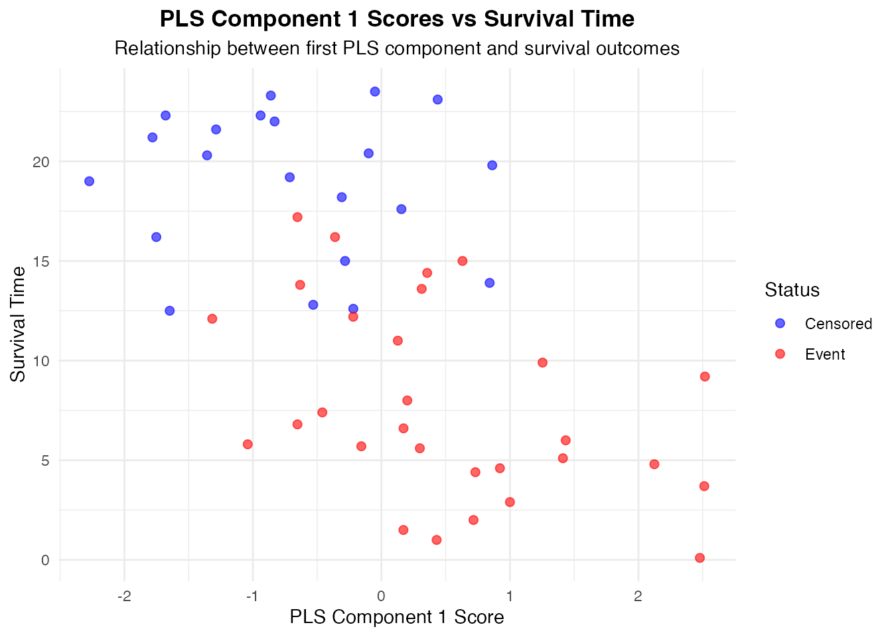
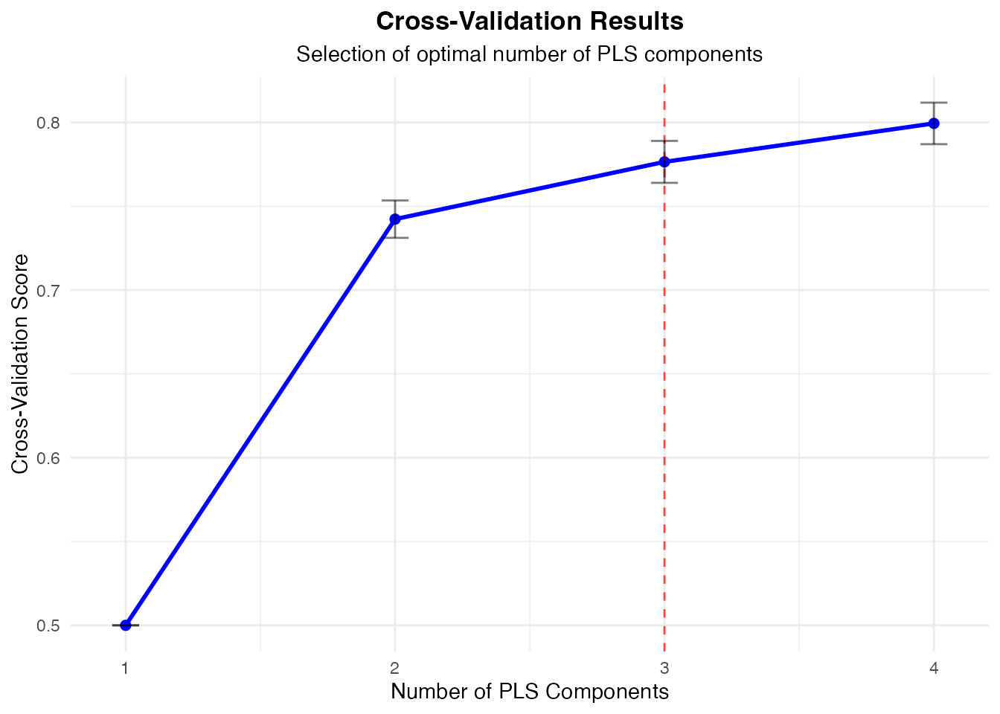
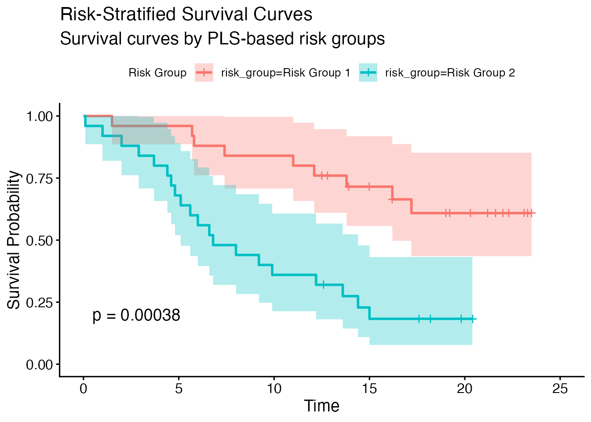
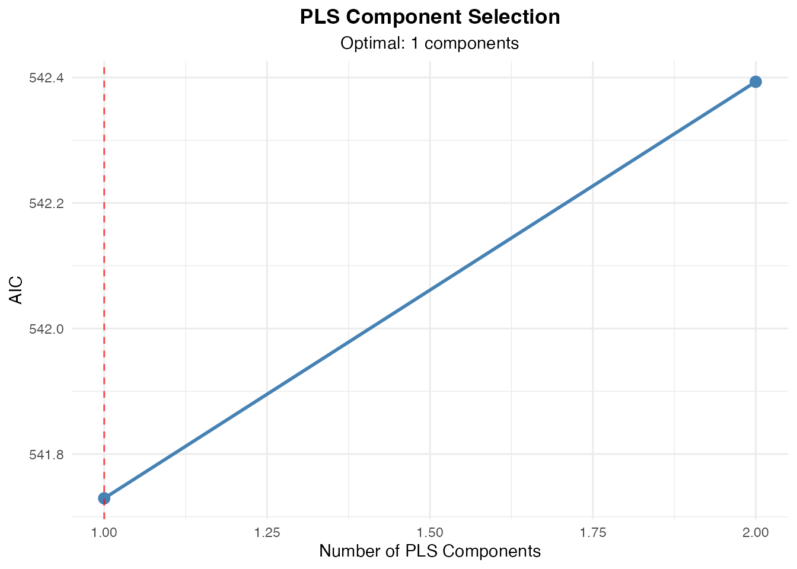
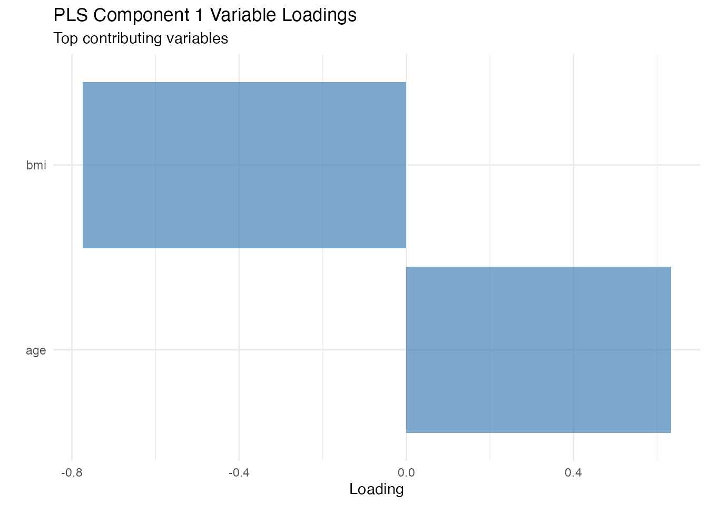
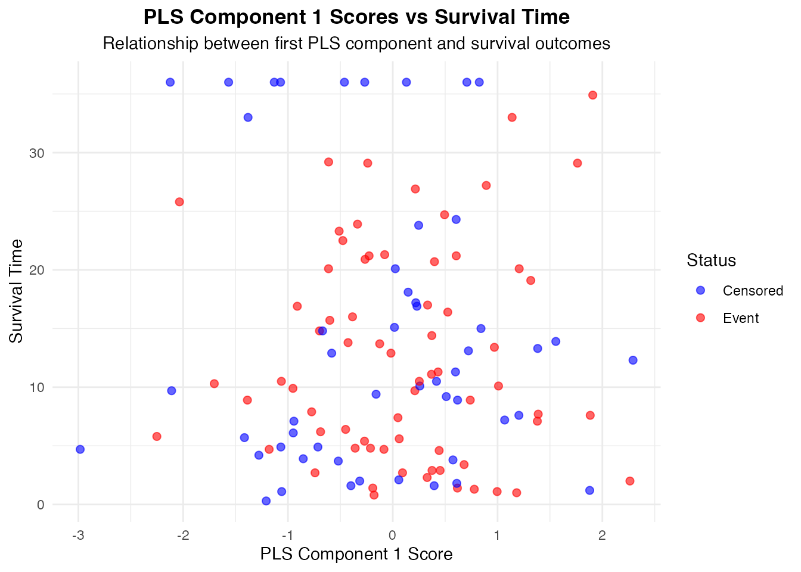
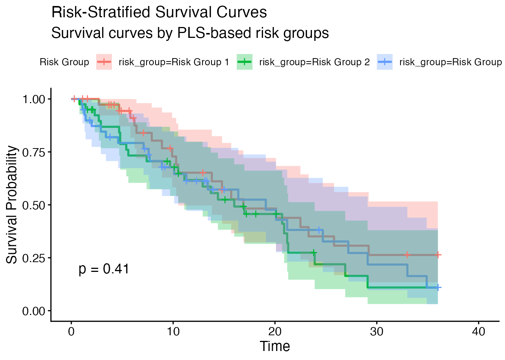

# PLS Cox Regression for High-Dimensional Survival Analysis

> **Not yet released.** The `plscox` analysis is on a development menu
> route, so it does not appear in the jamovi menus of ClinicoPath or of
> any of its submodules. It is documented here ahead of a future
> release, and its options, defaults and output may still change. The R
> function is exported, so the examples below run from an R console;
> what is not yet available is the jamovi analysis itself.

> **Note:** The
> [`plscox()`](https://www.serdarbalci.com/ClinicoPathJamoviModule/reference/plscox.md)
> function is designed for use within **jamovi’s GUI**. The code
> examples below show the R syntax for reference. To run interactively,
> use
> [`devtools::load_all()`](https://devtools.r-lib.org/reference/load_all.html)
> and call the R6 class directly:
> `plscoxClass$new(options = plscoxOptions$new(...), data = mydata)`.

## PLS Cox Regression

### Overview

The **PLS Cox Regression** module (`plscox`) combines Partial Least
Squares (PLS) dimensionality reduction with Cox proportional hazards
modeling for high-dimensional survival data. Instead of selecting
individual variables like LASSO, PLS creates **latent components** -
weighted combinations of all predictors that maximally explain
covariance with the survival outcome.

Key features:

- **Component selection** via cross-validation (log-likelihood,
  C-index), information criteria (BIC, AIC), or manual
- **Multiple scaling methods** (standardization, unit variance, min-max,
  none)
- **Advanced PLS settings** (sparse PLS, Q-squared stopping, p-value
  variable selection)
- **Bootstrap validation** (Harrell optimism-corrected C-index)
- **Permutation testing** for overall model significance
- **Risk group stratification** with Kaplan-Meier survival curves
- **Variable importance** (Cox-weighted PLS loadings)
- **Data suitability assessment** (traffic-light system with 6 checks)

------------------------------------------------------------------------

### PLS vs LASSO: Different Philosophies

| Approach | How It Works | Output |
|----|----|----|
| **LASSO** | Selects individual variables, drops others | Sparse coefficient vector |
| **PLS** | Creates weighted combinations of ALL variables | Component scores + loadings |

**Use PLS when:** - Variables are highly correlated (metabolomics, gene
expression) - You want to retain information from all variables - The
underlying signal comes from latent biological processes - p \>\> n and
LASSO produces unstable selections

**Use LASSO when:** - You want to identify individual important
predictors - A sparse, interpretable model is needed - Variables are
relatively independent

------------------------------------------------------------------------

### How PLS Cox Works

1.  **Extract PLS components**: Find linear combinations of X that
    maximize covariance with the survival response
2.  **Select components**: Choose the optimal number via CV or
    information criteria
3.  **Fit Cox model**: Use selected components as predictors in Cox
    regression
4.  **Interpret**: Back-project component loadings to understand
    original variable contributions

------------------------------------------------------------------------

### Datasets Used in This Guide

| Dataset | N | Events | Predictors | Time Var | Status Var | Description |
|----|----|----|----|----|----|----|
| `plscox_metabolomics` | 120 | ~50% | 80 metabolites + 3 clinical | `survival_months` | `death` | Metabolomic survival study with 3 latent pathways |
| `plscox_small` | 50 | ~60% | 25 biomarkers | `time_months` | `status` | Small sample edge case |
| `plscox_genomic` | 60 | ~55% | 200 genes | `os_time` | `os_event` (numeric 0/1) | True p\>\>n with missing data |

``` r

data_path2 <- "data/"

# Load metabolomics dataset (n=120, p=80)
load(paste0(data_path2, "plscox_metabolomics.rda"))
#> Error in `readChar()`:
#> ! cannot open the connection
cat("Metabolomics: N =", nrow(plscox_metabolomics),
    "| Events =", sum(plscox_metabolomics$death == "Dead"),
    "| Predictors =", sum(grepl("^METAB_", names(plscox_metabolomics))), "+ 3 clinical\n")
#> Metabolomics: N = 120 | Events = 69 | Predictors = 80 + 3 clinical

# Load small dataset (n=50, p=25)
load(paste0(data_path2, "plscox_small.rda"))
#> Error in `readChar()`:
#> ! cannot open the connection
cat("Small: N =", nrow(plscox_small),
    "| Events =", sum(plscox_small$status == "Dead"),
    "| Predictors =", sum(grepl("^MARKER_", names(plscox_small))), "\n")
#> Small: N = 50 | Events = 29 | Predictors = 25

# Load genomic dataset (n=60, p=200)
load(paste0(data_path2, "plscox_genomic.rda"))
#> Error in `readChar()`:
#> ! cannot open the connection
cat("Genomic: N =", nrow(plscox_genomic),
    "| Events =", sum(plscox_genomic$os_event == 1),
    "| Predictors =", sum(grepl("^GENE_", names(plscox_genomic))),
    "| Missing values =", sum(is.na(plscox_genomic)), "\n")
#> Genomic: N = 60 | Events = 39 | Predictors = 200 | Missing values = 358
```

------------------------------------------------------------------------

### 1. Basic PLS Cox Analysis (Default Settings)

This demonstrates all default settings: 5 components, 10-fold CV, CV
log-likelihood selection, standardization scaling, and all outputs/plots
enabled.

``` r

metab_predictors <- c("age", "gender", "bmi",
                       paste0("METAB_", sprintf("%03d", 1:80)))

plscox(
  data = plscox_metabolomics,
  time = "survival_months",
  status = "death",
  outcomeLevel = "Dead",
  censorLevel = "Alive",
  predictors = metab_predictors,
  pls_components = 5,
  cross_validation = "k10",
  component_selection = "cv_loglik",
  scaling_method = "standardize",
  suitabilityCheck = TRUE,
  plot_components = TRUE,
  plot_loadings = TRUE,
  plot_scores = TRUE,
  plot_validation = TRUE,
  plot_survival = TRUE,
  risk_groups = 3,
  confidence_intervals = TRUE,
  feature_importance = TRUE,
  prediction_accuracy = TRUE
)
#> Error:
#> ! Argument 'predictors' contains 'metab_predictors' which is not present in the dataset
```

Expected: PLS should identify 2-3 important components reflecting the
underlying pathway structure. Metabolites in blocks 1-15, 25-40, and
55-70 should have high loadings on the first few components.

------------------------------------------------------------------------

### 2. Component Selection Methods

#### Cross-Validated Log-Likelihood (default)

``` r

plscox(
  data = plscox_metabolomics,
  time = "survival_months",
  status = "death",
  outcomeLevel = "Dead",
  censorLevel = "Alive",
  predictors = metab_predictors,
  pls_components = 10,
  component_selection = "cv_loglik",
  cross_validation = "k10",
  plot_validation = TRUE,
  feature_importance = TRUE,
  prediction_accuracy = TRUE
)
#> Error:
#> ! Argument 'predictors' contains 'metab_predictors' which is not present in the dataset
```

#### Cross-Validated C-Index

``` r

plscox(
  data = plscox_metabolomics,
  time = "survival_months",
  status = "death",
  outcomeLevel = "Dead",
  censorLevel = "Alive",
  predictors = metab_predictors,
  pls_components = 10,
  component_selection = "cv_cindex",
  cross_validation = "k10",
  plot_validation = TRUE,
  prediction_accuracy = TRUE
)
#> Error:
#> ! Argument 'predictors' contains 'metab_predictors' which is not present in the dataset
```

#### BIC (no cross-validation needed)

``` r

plscox(
  data = plscox_metabolomics,
  time = "survival_months",
  status = "death",
  outcomeLevel = "Dead",
  censorLevel = "Alive",
  predictors = metab_predictors,
  pls_components = 10,
  component_selection = "bic",
  cross_validation = "none",
  plot_validation = TRUE,
  prediction_accuracy = TRUE
)
#> Error:
#> ! Argument 'predictors' contains 'metab_predictors' which is not present in the dataset
```

#### AIC

``` r

plscox(
  data = plscox_metabolomics,
  time = "survival_months",
  status = "death",
  outcomeLevel = "Dead",
  censorLevel = "Alive",
  predictors = metab_predictors,
  pls_components = 10,
  component_selection = "aic",
  cross_validation = "none",
  plot_validation = TRUE,
  prediction_accuracy = TRUE
)
#> Error:
#> ! Argument 'predictors' contains 'metab_predictors' which is not present in the dataset
```

#### Manual (fixed number of components)

``` r

# Use exactly 3 components (based on domain knowledge)
plscox(
  data = plscox_metabolomics,
  time = "survival_months",
  status = "death",
  outcomeLevel = "Dead",
  censorLevel = "Alive",
  predictors = metab_predictors,
  pls_components = 3,
  component_selection = "manual",
  cross_validation = "none",
  plot_components = TRUE,
  plot_loadings = TRUE,
  feature_importance = TRUE
)
#> Error:
#> ! Argument 'predictors' contains 'metab_predictors' which is not present in the dataset
```

------------------------------------------------------------------------

### 3. Cross-Validation Methods

#### 10-Fold CV (default)

``` r

plscox(
  data = plscox_metabolomics,
  time = "survival_months",
  status = "death",
  outcomeLevel = "Dead",
  censorLevel = "Alive",
  predictors = metab_predictors,
  pls_components = 5,
  cross_validation = "k10",
  component_selection = "cv_loglik",
  plot_validation = TRUE,
  prediction_accuracy = TRUE
)
#> Error:
#> ! Argument 'predictors' contains 'metab_predictors' which is not present in the dataset
```

#### 5-Fold CV (faster, slightly more bias)

``` r

plscox(
  data = plscox_metabolomics,
  time = "survival_months",
  status = "death",
  outcomeLevel = "Dead",
  censorLevel = "Alive",
  predictors = metab_predictors,
  pls_components = 5,
  cross_validation = "k5",
  component_selection = "cv_loglik",
  plot_validation = TRUE,
  prediction_accuracy = TRUE
)
#> Error:
#> ! Argument 'predictors' contains 'metab_predictors' which is not present in the dataset
```

#### Leave-One-Out CV (small samples only)

``` r

small_predictors <- paste0("MARKER_", sprintf("%02d", 1:25))

plscox(
  data = plscox_small,
  time = "time_months",
  status = "status",
  outcomeLevel = "Dead",
  censorLevel = "Alive",
  predictors = small_predictors,
  pls_components = 5,
  cross_validation = "loo",
  component_selection = "cv_loglik",
  plot_validation = TRUE,
  prediction_accuracy = TRUE
)
#> Error:
#> ! Argument 'predictors' contains 'small_predictors' which is not present in the dataset
```

------------------------------------------------------------------------

### 4. Scaling Methods

Variable scaling is critical for PLS since it operates on covariances.

#### Standardization (Z-scores, default)

``` r

plscox(
  data = plscox_metabolomics,
  time = "survival_months",
  status = "death",
  outcomeLevel = "Dead",
  censorLevel = "Alive",
  predictors = metab_predictors,
  pls_components = 5,
  scaling_method = "standardize",
  component_selection = "cv_loglik",
  cross_validation = "k10",
  prediction_accuracy = TRUE
)
#> Error:
#> ! Argument 'predictors' contains 'metab_predictors' which is not present in the dataset
```

#### Unit Variance Scaling (no centering)

``` r

plscox(
  data = plscox_metabolomics,
  time = "survival_months",
  status = "death",
  outcomeLevel = "Dead",
  censorLevel = "Alive",
  predictors = metab_predictors,
  pls_components = 5,
  scaling_method = "unit_variance",
  component_selection = "cv_loglik",
  cross_validation = "k10",
  prediction_accuracy = TRUE
)
#> Error:
#> ! Argument 'predictors' contains 'metab_predictors' which is not present in the dataset
```

#### Min-Max Scaling (range \[0,1\])

``` r

plscox(
  data = plscox_metabolomics,
  time = "survival_months",
  status = "death",
  outcomeLevel = "Dead",
  censorLevel = "Alive",
  predictors = metab_predictors,
  pls_components = 5,
  scaling_method = "minmax",
  component_selection = "cv_loglik",
  cross_validation = "k10",
  prediction_accuracy = TRUE
)
#> Error:
#> ! Argument 'predictors' contains 'metab_predictors' which is not present in the dataset
```

#### No Scaling

``` r

plscox(
  data = plscox_metabolomics,
  time = "survival_months",
  status = "death",
  outcomeLevel = "Dead",
  censorLevel = "Alive",
  predictors = metab_predictors,
  pls_components = 5,
  scaling_method = "none",
  component_selection = "cv_loglik",
  cross_validation = "k10",
  prediction_accuracy = TRUE
)
#> Error:
#> ! Argument 'predictors' contains 'metab_predictors' which is not present in the dataset
```

------------------------------------------------------------------------

### 5. Advanced PLS Settings

#### Sparse PLS (automatic variable selection within components)

``` r

plscox(
  data = plscox_metabolomics,
  time = "survival_months",
  status = "death",
  outcomeLevel = "Dead",
  censorLevel = "Alive",
  predictors = metab_predictors,
  pls_components = 5,
  sparse_pls = TRUE,
  component_selection = "cv_loglik",
  cross_validation = "k10",
  feature_importance = TRUE,
  prediction_accuracy = TRUE
)
#> Error:
#> ! Argument 'predictors' contains 'metab_predictors' which is not present in the dataset
```

#### Convergence Tolerance

``` r

# Strict tolerance for higher precision
plscox(
  data = plscox_metabolomics,
  time = "survival_months",
  status = "death",
  outcomeLevel = "Dead",
  censorLevel = "Alive",
  predictors = metab_predictors,
  pls_components = 5,
  tolerance = 1e-10,
  component_selection = "manual",
  feature_importance = TRUE
)
#> Error:
#> ! Argument 'predictors' contains 'metab_predictors' which is not present in the dataset
```

#### Q-Squared Limit (PLS stopping criterion)

``` r

plscox(
  data = plscox_metabolomics,
  time = "survival_months",
  status = "death",
  outcomeLevel = "Dead",
  censorLevel = "Alive",
  predictors = metab_predictors,
  pls_components = 10,
  limQ2set = 0.5,
  component_selection = "manual",
  feature_importance = TRUE
)
#> Error:
#> ! Argument 'predictors' contains 'metab_predictors' which is not present in the dataset
```

#### P-Value Based Variable Selection

``` r

plscox(
  data = plscox_metabolomics,
  time = "survival_months",
  status = "death",
  outcomeLevel = "Dead",
  censorLevel = "Alive",
  predictors = metab_predictors,
  pls_components = 5,
  pvals_expli = TRUE,
  alpha_pvals_expli = 0.05,
  component_selection = "manual",
  feature_importance = TRUE
)
#> Error:
#> ! Argument 'predictors' contains 'metab_predictors' which is not present in the dataset
```

#### Tie Handling Method

``` r

plscox(
  data = plscox_metabolomics,
  time = "survival_months",
  status = "death",
  outcomeLevel = "Dead",
  censorLevel = "Alive",
  predictors = metab_predictors,
  pls_components = 5,
  tie_method = "breslow",
  component_selection = "cv_loglik",
  cross_validation = "k10",
  prediction_accuracy = TRUE
)
#> Error:
#> ! Argument 'predictors' contains 'metab_predictors' which is not present in the dataset
```

------------------------------------------------------------------------

### 6. Bootstrap Validation

Bootstrap validation assesses model overfitting using Harrell’s
optimism-corrected C-index. Each bootstrap iteration: (1) fit model on
bootstrap sample, (2) assess on bootstrap and original data, (3) compute
optimism.

``` r

plscox(
  data = plscox_metabolomics,
  time = "survival_months",
  status = "death",
  outcomeLevel = "Dead",
  censorLevel = "Alive",
  predictors = metab_predictors,
  pls_components = 5,
  component_selection = "cv_loglik",
  cross_validation = "k10",
  bootstrap_validation = TRUE,
  n_bootstrap = 50,
  prediction_accuracy = TRUE
)
#> Error:
#> ! Argument 'predictors' contains 'metab_predictors' which is not present in the dataset
```

------------------------------------------------------------------------

### 7. Permutation Testing

Test whether the PLS components capture real survival signal or random
patterns. The p-value is the proportion of permuted C-indices that
exceed the original.

``` r

plscox(
  data = plscox_metabolomics,
  time = "survival_months",
  status = "death",
  outcomeLevel = "Dead",
  censorLevel = "Alive",
  predictors = metab_predictors,
  pls_components = 5,
  component_selection = "cv_loglik",
  cross_validation = "k10",
  permutation_test = TRUE,
  n_permutations = 50,  # Use 100+ for publication
  prediction_accuracy = TRUE
)
#> Error:
#> ! Argument 'predictors' contains 'metab_predictors' which is not present in the dataset
```

------------------------------------------------------------------------

### 8. Risk Stratification

Patients are stratified into risk groups based on quantiles of the
PLS-derived linear predictor from the Cox model.

#### Binary Risk Groups

``` r

plscox(
  data = plscox_metabolomics,
  time = "survival_months",
  status = "death",
  outcomeLevel = "Dead",
  censorLevel = "Alive",
  predictors = metab_predictors,
  pls_components = 3,
  component_selection = "manual",
  risk_groups = 2,
  plot_survival = TRUE,
  confidence_intervals = TRUE
)
#> Error:
#> ! Argument 'predictors' contains 'metab_predictors' which is not present in the dataset
```

#### Quartile Risk Groups

``` r

plscox(
  data = plscox_metabolomics,
  time = "survival_months",
  status = "death",
  outcomeLevel = "Dead",
  censorLevel = "Alive",
  predictors = metab_predictors,
  pls_components = 3,
  component_selection = "manual",
  risk_groups = 4,
  plot_survival = TRUE,
  confidence_intervals = TRUE,
  prediction_accuracy = TRUE
)
#> Error:
#> ! Argument 'predictors' contains 'metab_predictors' which is not present in the dataset
```

------------------------------------------------------------------------

### 9. Data Suitability Assessment

The traffic-light assessment checks 6 criteria: events-per-variable,
reduction need, sample size, event rate, multicollinearity, and data
quality.

``` r

# Metabolomics data: expected mostly green
plscox(
  data = plscox_metabolomics,
  time = "survival_months",
  status = "death",
  outcomeLevel = "Dead",
  censorLevel = "Alive",
  predictors = metab_predictors,
  pls_components = 3,
  component_selection = "manual",
  suitabilityCheck = TRUE,
  plot_components = FALSE,
  plot_loadings = FALSE,
  plot_scores = FALSE,
  plot_validation = FALSE,
  plot_survival = FALSE
)
#> Error:
#> ! Argument 'predictors' contains 'metab_predictors' which is not present in the dataset
```

``` r

# Genomic p>>n data: expected yellow/red for EPV and data quality
gene_predictors <- paste0("GENE_", sprintf("%03d", 1:200))

plscox(
  data = plscox_genomic,
  time = "os_time",
  status = "os_event",
  outcomeLevel = "1",
  censorLevel = "0",
  predictors = gene_predictors,
  pls_components = 5,
  component_selection = "manual",
  suitabilityCheck = TRUE,
  plot_components = FALSE,
  plot_loadings = FALSE,
  plot_scores = FALSE,
  plot_validation = FALSE,
  plot_survival = FALSE
)
#> Error:
#> ! Argument 'predictors' contains 'gene_predictors' which is not present in the dataset
```

------------------------------------------------------------------------

### 10. Small Sample Analysis

``` r

plscox(
  data = plscox_small,
  time = "time_months",
  status = "status",
  outcomeLevel = "Dead",
  censorLevel = "Alive",
  predictors = paste0("MARKER_", sprintf("%02d", 1:25)),
  pls_components = 3,
  cross_validation = "k5",
  component_selection = "cv_loglik",
  scaling_method = "standardize",
  risk_groups = 2,
  plot_components = TRUE,
  plot_loadings = TRUE,
  plot_survival = TRUE,
  feature_importance = TRUE,
  prediction_accuracy = TRUE,
  suitabilityCheck = TRUE
)
#> 
#>  PARTIAL LEAST SQUARES COX MODELS
#> 
#>  <div style='background-color: #fff3cd; color: #856404; border: 1px
#>  solid #ffeeba; padding: 12px; border-radius: 6px; margin-bottom:
#>  12px;'>Overall: Data is usable but review the flagged items.<table
#>  style='width: 100%; border-collapse: collapse; font-size: 13px;'><tr
#>  style='border-bottom: 2px solid #dee2e6;'><th style='padding: 6px;
#>  text-align: left;'>Status<th style='padding: 6px; text-align:
#>  left;'>Check<th style='padding: 6px; text-align: left;'>Value<th
#>  style='padding: 6px; text-align: left;'>Detail<tr
#>  style='border-bottom: 1px solid #dee2e6;'><td style='padding:
#>  6px;'><span style='color: #ffc107; font-size: 18px;'>&#9679;<td
#>  style='padding: 6px;'>Events-Per-Variable (Overall)<td style='padding:
#>  6px;'>1.2 (n_events=29, p=25)<td style='padding: 6px;'>Low EPV for
#>  standard modeling, but PLS handles this well through dimensionality
#>  reduction.<tr style='border-bottom: 1px solid #dee2e6;'><td
#>  style='padding: 6px;'><span style='color: #28a745; font-size:
#>  18px;'>&#9679;<td style='padding: 6px;'>Reduction Need<td
#>  style='padding: 6px;'>p=25, n=50 (ratio=0.50)<td style='padding:
#>  6px;'>High-dimensional setting. Dimensionality reduction via PLS is
#>  strongly indicated.<tr style='border-bottom: 1px solid #dee2e6;'><td
#>  style='padding: 6px;'><span style='color: #ffc107; font-size:
#>  18px;'>&#9679;<td style='padding: 6px;'>Sample Size<td style='padding:
#>  6px;'>n=50<td style='padding: 6px;'>Small sample. Consider LOO
#>  (Leave-One-Out) cross-validation instead of k-fold.<tr
#>  style='border-bottom: 1px solid #dee2e6;'><td style='padding:
#>  6px;'><span style='color: #28a745; font-size: 18px;'>&#9679;<td
#>  style='padding: 6px;'>Event Rate<td style='padding: 6px;'>58.0%
#>  (29/50)<td style='padding: 6px;'>Balanced event rate. Good for model
#>  estimation.<tr style='border-bottom: 1px solid #dee2e6;'><td
#>  style='padding: 6px;'><span style='color: #28a745; font-size:
#>  18px;'>&#9679;<td style='padding: 6px;'>Multicollinearity<td
#>  style='padding: 6px;'>Max |r| = 0.71<td style='padding: 6px;'>Moderate
#>  collinearity. PLS effectively orthogonalizes these correlated
#>  predictors.<tr style='border-bottom: 1px solid #dee2e6;'><td
#>  style='padding: 6px;'><span style='color: #28a745; font-size:
#>  18px;'>&#9679;<td style='padding: 6px;'>Data Quality<td
#>  style='padding: 6px;'>No missing data<td style='padding:
#>  6px;'>Complete dataset.
#> 
#>  PLS Cox Model Results
#> 
#>  Analysis Summary:
#> 
#>  Sample size: 50 subjects
#>  Number of events: 29
#>  Number of predictors: 25
#>  PLS components used: 3
#>  PLS algorithm: NIPALS (plsRcox default)
#>  Component selection: Cross-Validated Log-Likelihood
#>  Scaling method: standardize
#>  Cross-validation: k5 (5 folds)
#>  Tie handling: efron
#>  Convergence tolerance: 1e-06
#>  Q-squared limit: 0.0975
#> 
#>  Model Performance:
#> 
#>  Training Concordance Index: 0.783 (SE: 0.042)
#>  Likelihood ratio test: 30.83 (p = 9.252e-07)
#>  Wald test: 23.26 (p = 3.559e-05)
#> 
#>  Note: The Training Concordance Index overestimates true out-of-sample
#>  performance, especially for high-dimensional data. Use Bootstrap or
#>  Permutation tests for rigorous validation.
#> 
#>  Component Selection Results                                        
#>  ────────────────────────────────────────────────────────────────── 
#>    Components    CV Score     SE              C-Index    Selected   
#>  ────────────────────────────────────────────────────────────────── 
#>             1    0.5000000    1.570092e-17               No         
#>             2    0.7423016      0.01114436               No         
#>             3    0.7764710      0.01251187               Yes        
#>             4    0.7994186      0.01239049               No         
#>  ────────────────────────────────────────────────────────────────── 
#> 
#> 
#>  PLS Cox Model Coefficients                                                                                                  
#>  ─────────────────────────────────────────────────────────────────────────────────────────────────────────────────────────── 
#>    PLS Component      Coefficient    Hazard Ratio    HR Lower CI    HR Upper CI    Standard Error    Z-value     p-value     
#>  ─────────────────────────────────────────────────────────────────────────────────────────────────────────────────────────── 
#>    PLS Component 1      1.1897420        3.286233      2.0157554       5.357460         0.2493658    4.771071    0.0000018   
#>    PLS Component 2      0.4950034        1.640504      1.1480875       2.344118         0.1820982    2.718332    0.0065612   
#>    PLS Component 3      0.2705114        1.310635      0.9670626       1.776269         0.1551067    1.744035    0.0811530   
#>  ─────────────────────────────────────────────────────────────────────────────────────────────────────────────────────────── 
#> 
#> 
#>  Variable Loadings on PLS Components                                                     
#>  ─────────────────────────────────────────────────────────────────────────────────────── 
#>    Variable     Component 1     Component 2    Component 3     Cox-Weighted Importance   
#>  ─────────────────────────────────────────────────────────────────────────────────────── 
#>    MARKER_23     0.449576752    -0.09121106    -0.365550228                  0.6789156   
#>    MARKER_11    -0.390481147    -0.33365274     0.084881497                  0.6526925   
#>    MARKER_12    -0.396282580    -0.23338378    -0.189486585                  0.6382581   
#>    MARKER_19     0.336257540     0.06808261     0.162194848                  0.4776364   
#>    MARKER_25     0.016111147     0.49379534     0.568336928                  0.4173401   
#>    MARKER_07     0.209590451    -0.26665806    -0.115383327                  0.4125677   
#>    MARKER_22     0.198997934     0.24505796    -0.165699557                  0.4028843   
#>    MARKER_04    -0.214505528    -0.19456538    -0.078487980                  0.3727487   
#>    MARKER_17     0.196649676     0.26954662     0.001737450                  0.3678589   
#>    MARKER_14     0.096454668     0.30688689     0.343713734                  0.3596447   
#>    MARKER_13    -0.030224409     0.38049243     0.430188221                  0.3406751   
#>    MARKER_03     0.204375503     0.01555463     0.240185475                  0.3158266   
#>    MARKER_15    -0.192965850    -0.14193953    -0.019314614                  0.3050649   
#>    MARKER_18    -0.202310655    -0.11354504     0.005294904                  0.2983350   
#>    MARKER_05     0.121415349    -0.17075152     0.239214527                  0.2936858   
#>    MARKER_20    -0.097537150    -0.09504999    -0.413333938                  0.2749056   
#>    MARKER_16    -0.115681010    -0.12567312    -0.277435819                  0.2748887   
#>    MARKER_06     0.103966624    -0.05080671     0.186811961                  0.1993777   
#>    MARKER_08     0.075949296     0.03812589     0.312833805                  0.1938576   
#>    MARKER_10    -0.099993927     0.02758448     0.197968634                  0.1861742   
#>    MARKER_21    -0.004697051     0.30841166     0.067719883                  0.1765721   
#>    MARKER_02    -0.064839172    -0.11967818     0.082363952                  0.1586634   
#>    MARKER_24     0.070225439     0.09135463     0.028021233                  0.1363511   
#>    MARKER_09    -0.027147818     0.14660176     0.068839979                  0.1234893   
#>    MARKER_01    -0.050641691    -0.07973672     0.017243703                  0.1043851   
#>  ─────────────────────────────────────────────────────────────────────────────────────── 
#> 
#> 
#>  Model Performance Metrics                                                                 
#>  ───────────────────────────────────────────────────────────────────────────────────────── 
#>    Metric                        Value          Standard Error    Lower CI     Upper CI    
#>  ───────────────────────────────────────────────────────────────────────────────────────── 
#>    Training Concordance Index      0.7828283        0.04202365    0.7004619    0.8651946   
#>    R-squared (Nagelkerke)          0.4601716                                               
#>    AIC                           179.0487826                                               
#>    BIC                           184.7848516                                               
#>  ───────────────────────────────────────────────────────────────────────────────────────── 
#> 
#> 
#>  Risk Group Stratification                                                                                
#>  ──────────────────────────────────────────────────────────────────────────────────────────────────────── 
#>    Risk Group      N Subjects    N Events    Median Survival    SE          HR vs Low Risk    p-value     
#>  ──────────────────────────────────────────────────────────────────────────────────────────────────────── 
#>    Risk Group 1            25           9                                         1.000000                
#>    Risk Group 2            25          20           6.800000    2.372449          3.860085    0.0009021   
#>  ──────────────────────────────────────────────────────────────────────────────────────────────────────── 
#> 
#> 
#>  Clinical Interpretation Guide
#> 
#> 
#> 
#>  PLS Components
#> 
#>  PLS components represent linear combinations of your original
#>  predictors that are optimally related to survival outcomes. Each
#>  component captures a different aspect of the biological variation in
#>  your data.
#> 
#> 
#> 
#>  Variable Loadings
#> 
#>  Loadings indicate how much each original variable contributes to each
#>  PLS component. Variables with higher absolute loadings have stronger
#>  influence on that component.
#> 
#> 
#> 
#>  Hazard Ratios
#> 
#>  Note: The Hazard Ratios and p-values correspond to the abstract PLS
#>  components, not your original variables. Each PLS component's hazard
#>  ratio indicates the relative risk associated with a one-unit increase
#>  in that component score. HR > 1 indicates increased risk, HR < 1
#>  indicates decreased risk.
#> 
#> 
#> 
#>  Risk Stratification
#> 
#>  Patients are grouped based on their overall PLS risk score. Higher
#>  risk groups should show shorter survival times and more events.
#> 
#> 
#> 
#>  Model Validation
#> 
#>  Cross-validation helps select the optimal number of components.
#>  Bootstrap validation can assess model stability and provide confidence
#>  intervals for performance metrics.
#> 
#> 
#> 
#>  Clinical Application
#> 
#>  This model can be used for:
#> 
#> 
#>  Risk stratification of patients
#>  Identification of prognostic biomarker signatures
#>  Treatment decision support
#>  Clinical trial stratification
#> 
#> 
#> 
#>  Technical Notes and Assumptions
#> 
#> 
#> 
#>  PLS Cox Methodology
#> 
#>  This analysis combines Partial Least Squares (PLS) dimensionality
#>  reduction with Cox proportional hazards regression. PLS finds
#>  components that maximize covariance between predictors and the
#>  survival outcome.
#> 
#> 
#> 
#>  Model Assumptions
#> 
#> 
#>  Proportional Hazards: The hazard ratio for each component is constant
#>  over time
#>  Linear Relationships: Log-hazard is linear in the PLS components
#>  Independence: Observations are independent
#>  Non-informative Censoring: Censoring is independent of the event
#>  process
#> 
#> 
#> 
#> 
#>  Component Selection
#> 
#>  Cross-validation is used to select the optimal number of PLS
#>  components to avoid overfitting while maintaining predictive
#>  performance.
#> 
#> 
#> 
#>  Variable Scaling
#> 
#>  Predictor variables should be scaled when they have different units or
#>  vastly different ranges to ensure fair contribution to PLS components.
#> 
#> 
#> 
#>  Sample Size Considerations
#> 
#>  For reliable results, aim for at least 10-15 events per PLS component
#>  included in the model. With high-dimensional data, cross-validation
#>  becomes crucial.
#> 
#> 
#> 
#>  Interpretation Cautions
#> 
#> 
#>  PLS components are linear combinations - biological interpretation may
#>  be complex
#>  Variable importance should be interpreted in context of component
#>  loadings
#>  External validation is recommended before clinical application
```



------------------------------------------------------------------------

### 11. High-Dimensional Genomic Analysis (p \>\> n)

This is the core PLS use case: more genes than patients.

``` r

plscox(
  data = plscox_genomic,
  time = "os_time",
  status = "os_event",
  outcomeLevel = "1",
  censorLevel = "0",
  predictors = gene_predictors,
  pls_components = 5,
  component_selection = "bic",
  cross_validation = "none",
  scaling_method = "standardize",
  risk_groups = 3,
  plot_components = TRUE,
  plot_loadings = TRUE,
  plot_scores = TRUE,
  plot_survival = TRUE,
  feature_importance = TRUE,
  prediction_accuracy = TRUE,
  suitabilityCheck = TRUE
)
#> Error:
#> ! Argument 'predictors' contains 'gene_predictors' which is not present in the dataset
```

------------------------------------------------------------------------

### 12. All Plots Demonstration

``` r

plscox(
  data = plscox_metabolomics,
  time = "survival_months",
  status = "death",
  outcomeLevel = "Dead",
  censorLevel = "Alive",
  predictors = metab_predictors,
  pls_components = 5,
  component_selection = "cv_loglik",
  cross_validation = "k10",
  risk_groups = 3,
  plot_components = TRUE,
  plot_loadings = TRUE,
  plot_scores = TRUE,
  plot_validation = TRUE,
  plot_survival = TRUE,
  feature_importance = TRUE,
  confidence_intervals = TRUE,
  prediction_accuracy = TRUE
)
#> Error:
#> ! Argument 'predictors' contains 'metab_predictors' which is not present in the dataset
```

------------------------------------------------------------------------

### 13. Full Validation Pipeline

Combine bootstrap validation and permutation testing for
publication-quality results.

``` r

plscox(
  data = plscox_metabolomics,
  time = "survival_months",
  status = "death",
  outcomeLevel = "Dead",
  censorLevel = "Alive",
  predictors = metab_predictors,
  pls_components = 10,
  component_selection = "cv_cindex",
  cross_validation = "k5",
  scaling_method = "standardize",
  bootstrap_validation = TRUE,
  n_bootstrap = 50,
  permutation_test = TRUE,
  n_permutations = 50,
  risk_groups = 4,
  plot_components = TRUE,
  plot_loadings = TRUE,
  plot_scores = TRUE,
  plot_validation = TRUE,
  plot_survival = TRUE,
  confidence_intervals = TRUE,
  feature_importance = TRUE,
  prediction_accuracy = TRUE,
  suitabilityCheck = TRUE
)
#> Error:
#> ! Argument 'predictors' contains 'metab_predictors' which is not present in the dataset
```

------------------------------------------------------------------------

### 14. Edge Cases

#### Single Component Model

``` r

plscox(
  data = plscox_metabolomics,
  time = "survival_months",
  status = "death",
  outcomeLevel = "Dead",
  censorLevel = "Alive",
  predictors = metab_predictors,
  pls_components = 1,
  component_selection = "manual",
  plot_loadings = TRUE,
  feature_importance = TRUE
)
#> Error:
#> ! Argument 'predictors' contains 'metab_predictors' which is not present in the dataset
```

#### Few Predictors

``` r

plscox(
  data = plscox_metabolomics,
  time = "survival_months",
  status = "death",
  outcomeLevel = "Dead",
  censorLevel = "Alive",
  predictors = c("age", "bmi"),
  pls_components = 1,
  component_selection = "manual",
  feature_importance = TRUE,
  prediction_accuracy = TRUE
)
#> 
#>  PARTIAL LEAST SQUARES COX MODELS
#> 
#>  <div style='background-color: #fff3cd; color: #856404; border: 1px
#>  solid #ffeeba; padding: 12px; border-radius: 6px; margin-bottom:
#>  12px;'>Overall: Data is usable but review the flagged items.<table
#>  style='width: 100%; border-collapse: collapse; font-size: 13px;'><tr
#>  style='border-bottom: 2px solid #dee2e6;'><th style='padding: 6px;
#>  text-align: left;'>Status<th style='padding: 6px; text-align:
#>  left;'>Check<th style='padding: 6px; text-align: left;'>Value<th
#>  style='padding: 6px; text-align: left;'>Detail<tr
#>  style='border-bottom: 1px solid #dee2e6;'><td style='padding:
#>  6px;'><span style='color: #28a745; font-size: 18px;'>&#9679;<td
#>  style='padding: 6px;'>Events-Per-Variable (Overall)<td style='padding:
#>  6px;'>34.5 (n_events=69, p=2)<td style='padding: 6px;'>High EPV. Model
#>  estimation will be robust.<tr style='border-bottom: 1px solid
#>  #dee2e6;'><td style='padding: 6px;'><span style='color: #ffc107;
#>  font-size: 18px;'>&#9679;<td style='padding: 6px;'>Reduction Need<td
#>  style='padding: 6px;'>p=2, EPV=34<td style='padding:
#>  6px;'>Moderate/low dimensionality. Standard Cox might suffice, but PLS
#>  is still valid.<tr style='border-bottom: 1px solid #dee2e6;'><td
#>  style='padding: 6px;'><span style='color: #28a745; font-size:
#>  18px;'>&#9679;<td style='padding: 6px;'>Sample Size<td style='padding:
#>  6px;'>n=120<td style='padding: 6px;'>Adequate sample size for PLS
#>  regression cross-validation.<tr style='border-bottom: 1px solid
#>  #dee2e6;'><td style='padding: 6px;'><span style='color: #28a745;
#>  font-size: 18px;'>&#9679;<td style='padding: 6px;'>Event Rate<td
#>  style='padding: 6px;'>57.5% (69/120)<td style='padding: 6px;'>Balanced
#>  event rate. Good for model estimation.<tr style='border-bottom: 1px
#>  solid #dee2e6;'><td style='padding: 6px;'><span style='color: #28a745;
#>  font-size: 18px;'>&#9679;<td style='padding:
#>  6px;'>Multicollinearity<td style='padding: 6px;'>Max |r| = 0.04<td
#>  style='padding: 6px;'>No concerning collinearity detected.<tr
#>  style='border-bottom: 1px solid #dee2e6;'><td style='padding:
#>  6px;'><span style='color: #28a745; font-size: 18px;'>&#9679;<td
#>  style='padding: 6px;'>Data Quality<td style='padding: 6px;'>No missing
#>  data<td style='padding: 6px;'>Complete dataset.
#> 
#>  PLS Cox Model Results
#> 
#>  Analysis Summary:
#> 
#>  Sample size: 120 subjects
#>  Number of events: 69
#>  Number of predictors: 2
#>  PLS components used: 1
#>  PLS algorithm: NIPALS (plsRcox default)
#>  Component selection: Manual
#>  Scaling method: standardize
#>  Cross-validation: k10 (10 folds)
#>  Tie handling: efron
#>  Convergence tolerance: 1e-06
#>  Q-squared limit: 0.0975
#> 
#>  Model Performance:
#> 
#>  Training Concordance Index: 0.539 (SE: 0.04)
#>  Likelihood ratio test: 1.34 (p = 0.2477)
#>  Wald test: 1.33 (p = 0.2491)
#> 
#>  Note: The Training Concordance Index overestimates true out-of-sample
#>  performance, especially for high-dimensional data. Use Bootstrap or
#>  Permutation tests for rigorous validation.
#> 
#>  Component Selection Results                             
#>  ─────────────────────────────────────────────────────── 
#>    Components    CV Score    SE    C-Index    Selected   
#>  ─────────────────────────────────────────────────────── 
#>  ─────────────────────────────────────────────────────── 
#>    Note. Component selection: Manual. Using 1
#>    component(s).
#> 
#> 
#>  PLS Cox Model Coefficients                                                                                                  
#>  ─────────────────────────────────────────────────────────────────────────────────────────────────────────────────────────── 
#>    PLS Component      Coefficient    Hazard Ratio    HR Lower CI    HR Upper CI    Standard Error    Z-value     p-value     
#>  ─────────────────────────────────────────────────────────────────────────────────────────────────────────────────────────── 
#>    PLS Component 1      0.1417969        1.152343      0.9054498       1.466557         0.1230228    1.152606    0.2490721   
#>  ─────────────────────────────────────────────────────────────────────────────────────────────────────────────────────────── 
#> 
#> 
#>  Variable Loadings on PLS Components                                                  
#>  ──────────────────────────────────────────────────────────────────────────────────── 
#>    Variable    Component 1    Component 2    Component 3    Cox-Weighted Importance   
#>  ──────────────────────────────────────────────────────────────────────────────────── 
#>    bmi          -0.7742216                                               0.10978220   
#>    age           0.6329146                                               0.08974532   
#>  ──────────────────────────────────────────────────────────────────────────────────── 
#> 
#> 
#>  Model Performance Metrics                                                                  
#>  ────────────────────────────────────────────────────────────────────────────────────────── 
#>    Metric                        Value           Standard Error    Lower CI     Upper CI    
#>  ────────────────────────────────────────────────────────────────────────────────────────── 
#>    Training Concordance Index      0.53922040        0.04034305    0.4601480    0.6182928   
#>    R-squared (Nagelkerke)          0.01107350                                               
#>    AIC                           542.39315135                                               
#>    BIC                           545.18064309                                               
#>  ────────────────────────────────────────────────────────────────────────────────────────── 
#> 
#> 
#>  Risk Group Stratification                                                                                
#>  ──────────────────────────────────────────────────────────────────────────────────────────────────────── 
#>    Risk Group      N Subjects    N Events    Median Survival    SE          HR vs Low Risk    p-value     
#>  ──────────────────────────────────────────────────────────────────────────────────────────────────────── 
#>    Risk Group 1            40          19           16.90000                      1.000000                
#>    Risk Group 2            40          26           16.00000    3.265306          1.445136    0.2281569   
#>    Risk Group 3            40          24           19.10000    4.540816          1.350071    0.3299992   
#>  ──────────────────────────────────────────────────────────────────────────────────────────────────────── 
#> 
#> 
#>  Clinical Interpretation Guide
#> 
#> 
#> 
#>  PLS Components
#> 
#>  PLS components represent linear combinations of your original
#>  predictors that are optimally related to survival outcomes. Each
#>  component captures a different aspect of the biological variation in
#>  your data.
#> 
#> 
#> 
#>  Variable Loadings
#> 
#>  Loadings indicate how much each original variable contributes to each
#>  PLS component. Variables with higher absolute loadings have stronger
#>  influence on that component.
#> 
#> 
#> 
#>  Hazard Ratios
#> 
#>  Note: The Hazard Ratios and p-values correspond to the abstract PLS
#>  components, not your original variables. Each PLS component's hazard
#>  ratio indicates the relative risk associated with a one-unit increase
#>  in that component score. HR > 1 indicates increased risk, HR < 1
#>  indicates decreased risk.
#> 
#> 
#> 
#>  Risk Stratification
#> 
#>  Patients are grouped based on their overall PLS risk score. Higher
#>  risk groups should show shorter survival times and more events.
#> 
#> 
#> 
#>  Model Validation
#> 
#>  Cross-validation helps select the optimal number of components.
#>  Bootstrap validation can assess model stability and provide confidence
#>  intervals for performance metrics.
#> 
#> 
#> 
#>  Clinical Application
#> 
#>  This model can be used for:
#> 
#> 
#>  Risk stratification of patients
#>  Identification of prognostic biomarker signatures
#>  Treatment decision support
#>  Clinical trial stratification
#> 
#> 
#> 
#>  Technical Notes and Assumptions
#> 
#> 
#> 
#>  PLS Cox Methodology
#> 
#>  This analysis combines Partial Least Squares (PLS) dimensionality
#>  reduction with Cox proportional hazards regression. PLS finds
#>  components that maximize covariance between predictors and the
#>  survival outcome.
#> 
#> 
#> 
#>  Model Assumptions
#> 
#> 
#>  Proportional Hazards: The hazard ratio for each component is constant
#>  over time
#>  Linear Relationships: Log-hazard is linear in the PLS components
#>  Independence: Observations are independent
#>  Non-informative Censoring: Censoring is independent of the event
#>  process
#> 
#> 
#> 
#> 
#>  Component Selection
#> 
#>  Cross-validation is used to select the optimal number of PLS
#>  components to avoid overfitting while maintaining predictive
#>  performance.
#> 
#> 
#> 
#>  Variable Scaling
#> 
#>  Predictor variables should be scaled when they have different units or
#>  vastly different ranges to ensure fair contribution to PLS components.
#> 
#> 
#> 
#>  Sample Size Considerations
#> 
#>  For reliable results, aim for at least 10-15 events per PLS component
#>  included in the model. With high-dimensional data, cross-validation
#>  becomes crucial.
#> 
#> 
#> 
#>  Interpretation Cautions
#> 
#> 
#>  PLS components are linear combinations - biological interpretation may
#>  be complex
#>  Variable importance should be interpreted in context of component
#>  loadings
#>  External validation is recommended before clinical application
```



#### Minimal Output (no plots, no optional tables)

``` r

plscox(
  data = plscox_metabolomics,
  time = "survival_months",
  status = "death",
  outcomeLevel = "Dead",
  censorLevel = "Alive",
  predictors = metab_predictors,
  pls_components = 3,
  component_selection = "manual",
  suitabilityCheck = FALSE,
  plot_components = FALSE,
  plot_loadings = FALSE,
  plot_scores = FALSE,
  plot_validation = FALSE,
  plot_survival = FALSE,
  confidence_intervals = FALSE,
  feature_importance = FALSE,
  prediction_accuracy = FALSE,
  bootstrap_validation = FALSE,
  permutation_test = FALSE
)
#> Error:
#> ! Argument 'predictors' contains 'metab_predictors' which is not present in the dataset
```

------------------------------------------------------------------------

### Interpreting Results

#### Model Summary

The Model Summary HTML shows: sample size, events, predictors, number of
PLS components used, selection method, scaling, CV method, tie handling,
tolerance, and training C-index with likelihood ratio and Wald tests.

#### Component Selection Table

| Column     | Meaning                                                        |
|------------|----------------------------------------------------------------|
| Components | Number of PLS components considered                            |
| CV Score   | Cross-validation score (log-likelihood, C-index, AIC, or BIC)  |
| SE         | Standard error of CV score (when available)                    |
| C-Index    | Concordance index for that number of components (AIC/BIC only) |
| Selected   | “Yes” marks the optimal number of components                   |

#### Model Coefficients Table

| Column                    | Meaning                                |
|---------------------------|----------------------------------------|
| PLS Component             | Component identifier (PLS_1, PLS_2, …) |
| Coefficient               | Cox regression coefficient             |
| Hazard Ratio              | exp(coefficient)                       |
| HR Lower CI / HR Upper CI | 95% confidence interval for HR         |
| Standard Error            | SE of the coefficient                  |
| Z-value                   | Wald test statistic                    |
| p-value                   | Significance of component in Cox model |

#### Variable Loadings Table

Variables are sorted by Cox-weighted importance:
`|loadings| * |cox_coefficients|`. This accounts for both how much a
variable contributes to each component AND how much each component
matters for survival.

#### Risk Stratification Table

Patients are divided into quantile-based risk groups. Risk Group 1 is
always the reference (HR = 1.0). Higher-numbered groups should have
progressively higher HRs.

------------------------------------------------------------------------

### PLS vs PCA for Survival Analysis

| Method  | Supervision  | Components Maximize                   |
|---------|--------------|---------------------------------------|
| **PCA** | Unsupervised | Variance in X only                    |
| **PLS** | Supervised   | Covariance between X and Y (survival) |

PLS components are specifically constructed to predict survival, while
PCA components may capture variance unrelated to the outcome.

------------------------------------------------------------------------

### Common Pitfalls

1.  **Too many components**: More components can mean overfitting.
    Always use cross-validation to select the optimal number.

2.  **Ignoring variable scaling**: Metabolites on different scales
    dominate PLS if not standardized. Always use
    `scaling_method = "standardize"` (the default).

3.  **Not validating**: Use bootstrap validation and/or permutation
    testing to assess reliability. The training C-index overestimates
    true performance.

4.  **Interpreting loadings as independent effects**: A high loading
    means the variable contributes to a component, not that it has an
    independent causal effect. Groups of correlated variables share
    loading magnitude.

5.  **Using LOO CV for large datasets**: Leave-one-out is
    computationally expensive and can be unstable. Use 5- or 10-fold CV
    for n \> 50.

6.  **Sparse PLS with too few components**: Sparse PLS may return NULL
    component scores for some configurations. If this happens, try
    increasing components or disabling sparse mode.

------------------------------------------------------------------------

### Related ClinicoPath Functions

| Function | Use When |
|----|----|
| **LASSO Cox** (`lassocox`) | Want sparse individual variable selection |
| **Adaptive LASSO** (`adaptivelasso`) | Oracle property variable selection |
| **NCV Reg Cox** (`ncvregcox`) | SCAD/MCP non-convex penalties |
| **High-Dimensional Cox** (`highdimcox`) | Multiple regularization methods |
| **PCA Cox** (`pcacox`) | Unsupervised dimensionality reduction |
| **Multivariable Survival** | Standard Cox with few predictors |

------------------------------------------------------------------------

### References

- Bastien P, Esposito Vinzi V, Tenenhaus M. PLS generalised linear
  regression. *Comput Stat Data Anal*. 2005;48(1):17-46.
- Boulesteix AL, Strimmer K. Partial least squares: a versatile tool for
  the analysis of high-dimensional genomic data. *Brief Bioinform*.
  2007;8(1):32-44.
- Li H, Gui J. Partial Cox regression analysis for high-dimensional
  microarray gene expression data. *Bioinformatics*. 2004;20(Suppl
  1):i208-i215.
- Mevik BH, Wehrens R. The pls package: principal component and partial
  least squares regression in R. *J Stat Softw*. 2007;18(2):1-23.
