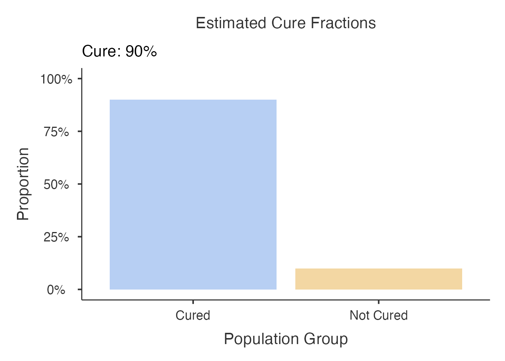
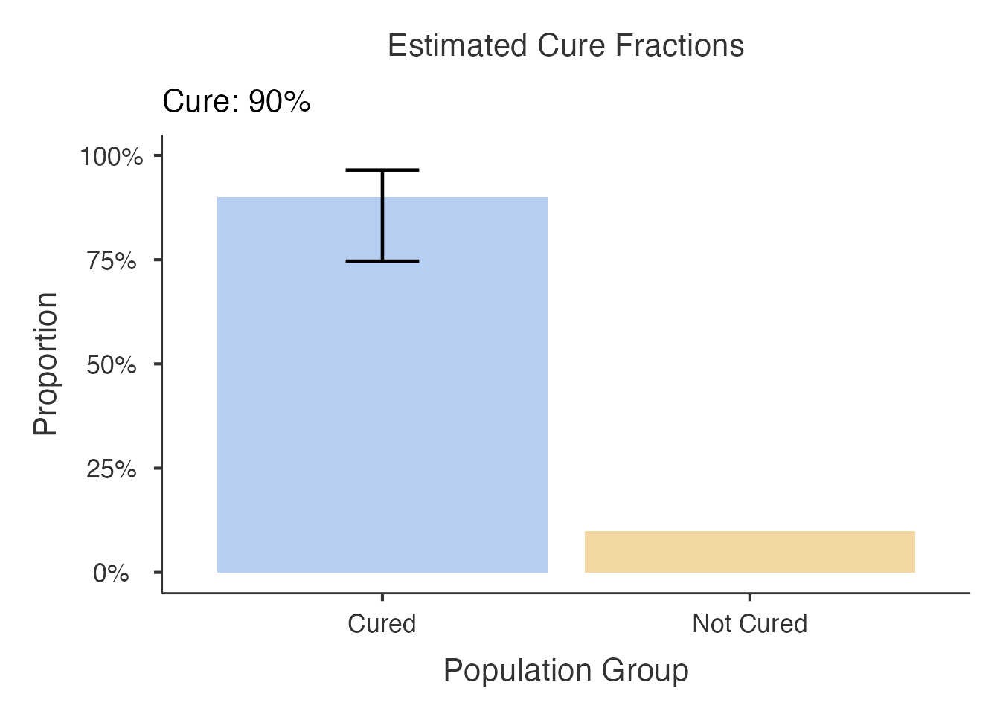
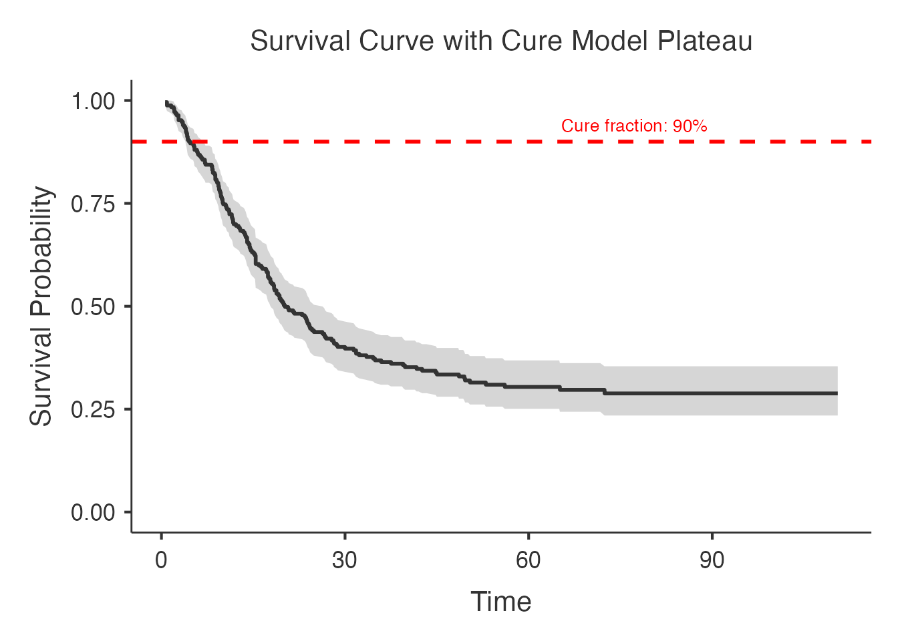
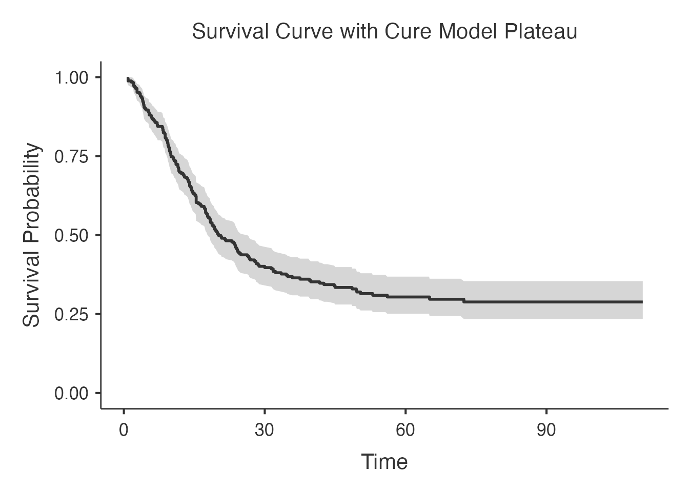

# Cure Models for Long-Term Survivors - Comprehensive Guide

> **Not yet released.** The `curemodels` analysis is on a development
> menu route, so it does not appear in the jamovi menus of ClinicoPath
> or of any of its submodules. It is documented here ahead of a future
> release, and its options, defaults and output may still change. The R
> function is exported, so the examples below run from an R console;
> what is not yet available is the jamovi analysis itself.

> **Note:** The
> [`curemodels()`](https://www.serdarbalci.com/ClinicoPathJamoviModule/reference/curemodels.md)
> function is designed for use within **jamovi’s GUI**. The code
> examples below show the R syntax for reference. To run interactively,
> use
> [`devtools::load_all()`](https://devtools.r-lib.org/reference/load_all.html)
> and call the R6 class directly:
> `curemodelsClass$new(options = curemodelsOptions$new(...), data = mydata)`.

## Cure Models for Long-Term Survivors

### Overview

In many solid tumours, a proportion of patients experience long-term
disease-free survival that is effectively indistinguishable from the
general population. Standard survival models (Cox, Kaplan-Meier) assume
every patient will eventually experience the event, which misrepresents
prognosis for cancers with a curable subset. Cure models address this by
partitioning the population into two groups: patients who are
statistically cured and patients who remain at risk (uncured). This
yields two clinically actionable quantities: the **cure fraction**
(probability of long-term cure) and the **latency distribution**
(survival among uncured patients).

The `curemodels` module provides four complementary modelling
frameworks:

| Model | R Package | Approach | Best For |
|----|----|----|----|
| Mixture cure | `smcure` | Separate logistic (cure) + survival (latency) | Standard clinical cure rate estimation |
| Non-mixture cure | `flexsurvcure` | Cure fraction embedded in parametric survival | Parametric model comparison across distributions |
| Background-mortality cure | `cuRe` | Excess hazard above population mortality | Long follow-up where background mortality matters |
| Nonparametric cure | `npcure` | Kernel smoothing, no distributional assumptions | Exploratory analysis without parametric constraints |

------------------------------------------------------------------------

### Dataset

``` r

data("curemodels_test")
```

``` r

str(curemodels_test)
#> 'data.frame':    250 obs. of  11 variables:
#>  $ PatientID        : chr  "CM-0001" "CM-0002" "CM-0003" "CM-0004" ...
#>  $ FollowUpMonths   : num  70.3 19.6 2.8 8.3 42 ...
#>  $ Recurrence       : int  0 0 1 1 0 0 0 1 0 1 ...
#>  $ RecurrenceFactor : Factor w/ 2 levels "Censored","Recurrence": 1 1 2 2 1 1 1 2 1 2 ...
#>  $ Age              : num  68 50 64 61 55 35 NA 51 63 57 ...
#>  $ Sex              : Factor w/ 2 levels "Female","Male": 2 1 1 2 2 2 2 1 1 1 ...
#>  $ Treatment        : Factor w/ 2 levels "Surgery Only",..: 2 2 1 2 2 2 2 2 1 2 ...
#>  $ Stage            : Factor w/ 3 levels "I","II","III": 1 3 3 3 2 1 1 3 3 2 ...
#>  $ TumorSize        : num  5.4 3.3 4.2 4.2 2.8 1.2 2.5 3.7 3.7 1.4 ...
#>  $ PerformanceStatus: int  0 1 1 0 1 1 1 1 0 2 ...
#>  $ BackgroundHazard : num  0.000964 0.000207 0.000633 0.00055 0.000341 0.000069 0.000314 0.000224 0.000584 0.000362 ...
```

``` r

summary(curemodels_test[, c("FollowUpMonths", "Recurrence", "Age",
                             "Treatment", "Stage", "TumorSize")])
#>  FollowUpMonths     Recurrence         Age                   Treatment  
#>  Min.   :  0.60   Min.   :0.000   Min.   :35.00   Surgery Only    :110  
#>  1st Qu.: 10.03   1st Qu.:0.000   1st Qu.:55.00   Surgery+Adjuvant:140  
#>  Median : 19.95   Median :1.000   Median :62.00                         
#>  Mean   : 32.71   Mean   :0.692   Mean   :62.36                         
#>  3rd Qu.: 50.33   3rd Qu.:1.000   3rd Qu.:69.00                         
#>  Max.   :110.50   Max.   :1.000   Max.   :85.00                         
#>                                   NAs    :8                             
#>  Stage      TumorSize    
#>  I  :70   Min.   :0.500  
#>  II :93   1st Qu.:2.400  
#>  III:87   Median :3.400  
#>           Mean   :3.444  
#>           3rd Qu.:4.200  
#>           Max.   :8.600  
#>           NAs    :5
```

| Variable          | Type          | Description                               |
|-------------------|---------------|-------------------------------------------|
| PatientID         | Integer       | Unique patient identifier                 |
| FollowUpMonths    | Numeric       | Follow-up time in months                  |
| Recurrence        | Numeric (0/1) | Event indicator: 0=censored, 1=recurrence |
| RecurrenceFactor  | Factor        | Factor version of Recurrence              |
| Age               | Numeric       | Patient age at diagnosis                  |
| Sex               | Factor        | Male / Female                             |
| Treatment         | Factor        | Surgery Only / Surgery+Adjuvant           |
| Stage             | Factor        | I / II / III                              |
| TumorSize         | Numeric       | Tumor size in cm                          |
| PerformanceStatus | Integer       | ECOG PS: 0, 1, or 2                       |
| BackgroundHazard  | Numeric       | Expected population hazard rate           |

``` r

cat("Total patients:", nrow(curemodels_test), "\n")
#> Total patients: 250
cat("Events (recurrences):", sum(curemodels_test$Recurrence == 1), "\n")
#> Events (recurrences): 173
cat("Censored:", sum(curemodels_test$Recurrence == 0), "\n")
#> Censored: 77
cat("Event rate:", round(mean(curemodels_test$Recurrence) * 100, 1), "%\n")
#> Event rate: 69.2 %
table(curemodels_test$Treatment)
#> 
#>     Surgery Only Surgery+Adjuvant 
#>              110              140
table(curemodels_test$Stage)
#> 
#>   I  II III 
#>  70  93  87
```

------------------------------------------------------------------------

### 1. Package Availability Check

The cure models depend on several specialised R packages. Before running
the examples, verify they are available.

``` r

required_pkgs <- c("smcure", "flexsurvcure", "cuRe", "npcure")
available <- sapply(required_pkgs, function(pkg) {
  requireNamespace(pkg, quietly = TRUE)
})
cat("Package availability:\n")
#> Package availability:
for (i in seq_along(required_pkgs)) {
  cat(sprintf("  %s: %s\n", required_pkgs[i],
              ifelse(available[i], "installed", "NOT FOUND")))
}
#>   smcure: installed
#>   flexsurvcure: installed
#>   cuRe: installed
#>   npcure: installed
```

------------------------------------------------------------------------

### 2. Mixture Cure Model (smcure)

#### 2.1 Basic Mixture Cure Model

The simplest case: estimate the overall cure fraction without
covariates. The mixture cure model decomposes the survival function as:

S(t) = pi + (1 - pi) \* S_u(t)

where pi is the cure fraction and S_u(t) is the survival function of
uncured patients.

``` r

curemodels(
  data = curemodels_test,
  time = "FollowUpMonths",
  status = "Recurrence",
  model_type = "mixture"
)
#> Error in `curemodels()`:
#> ! argument "predictors" is missing, with no default
```

#### 2.2 Mixture Cure Model with Predictors (PH)

Adding covariates allows estimation of how treatment and stage affect
both the probability of cure (incidence component) and survival among
uncured patients (latency component).

``` r

curemodels(
  data = curemodels_test,
  time = "FollowUpMonths",
  status = "Recurrence",
  predictors = c("Treatment", "Stage"),
  model_type = "mixture",
  smcure_model_type = "ph",
  cure_link = "logit"
)
#> Program is running..be patient...
#> 
#>  CURE MODELS FOR LONG-TERM SURVIVORS
#> 
#> character(0)
#> 
#>  <div style='background-color: #fff7ed; border-left: 4px solid #fdba74;
#>  padding: 12px; margin: 8px 0; border-radius: 4px;'><strong
#>  style='color: #ea580c;'>Mixture Cure Model Error
#>  <span style='color: #374151;'>Fitting failed: replacement has 500
#>  rows, data has 250
#> 
#> character(0)
#> 
#> character(0)
#> 
#>  Cure Model Results                                                                      
#>  ─────────────────────────────────────────────────────────────────────────────────────── 
#>    Parameter    Estimate    Std. Error    z value    p-value      CI Lower    CI Upper   
#>  ─────────────────────────────────────────────────────────────────────────────────────── 
#>  ─────────────────────────────────────────────────────────────────────────────────────── 
#> 
#> 
#>  Cure Fraction Summary                                                           
#>  ─────────────────────────────────────────────────────────────────────────────── 
#>    Group    Cure Fraction    CI Lower    CI Upper    Median Survival (Uncured)   
#>  ─────────────────────────────────────────────────────────────────────────────── 
#>  ─────────────────────────────────────────────────────────────────────────────── 
#> 
#> 
#> character(0)
```

The `modelTable` shows two sets of coefficients:

- **Cure component** (`$b`): logistic regression coefficients for cure
  probability. Positive values indicate higher cure probability.
- **Survival component** (`$beta`): Cox PH coefficients for uncured
  patients. Positive values indicate higher hazard (worse survival).

#### 2.3 Mixture Cure Model with AFT

The accelerated failure time (AFT) formulation models the latency
distribution on the log-time scale rather than the hazard scale.

``` r

curemodels(
  data = curemodels_test,
  time = "FollowUpMonths",
  status = "Recurrence",
  predictors = c("Treatment", "Stage"),
  model_type = "mixture",
  smcure_model_type = "aft"
)
#> Program is running..be patient...
#> 
#>  CURE MODELS FOR LONG-TERM SURVIVORS
#> 
#> character(0)
#> 
#>  <div style='background-color: #fff7ed; border-left: 4px solid #fdba74;
#>  padding: 12px; margin: 8px 0; border-radius: 4px;'><strong
#>  style='color: #ea580c;'>Mixture Cure Model Error
#>  <span style='color: #374151;'>Fitting failed: replacement has 500
#>  rows, data has 250
#> 
#> character(0)
#> 
#> character(0)
#> 
#>  Cure Model Results                                                                      
#>  ─────────────────────────────────────────────────────────────────────────────────────── 
#>    Parameter    Estimate    Std. Error    z value    p-value      CI Lower    CI Upper   
#>  ─────────────────────────────────────────────────────────────────────────────────────── 
#>  ─────────────────────────────────────────────────────────────────────────────────────── 
#> 
#> 
#>  Cure Fraction Summary                                                           
#>  ─────────────────────────────────────────────────────────────────────────────── 
#>    Group    Cure Fraction    CI Lower    CI Upper    Median Survival (Uncured)   
#>  ─────────────────────────────────────────────────────────────────────────────── 
#>  ─────────────────────────────────────────────────────────────────────────────── 
#> 
#> 
#> character(0)
```

In the AFT model, survival coefficients represent acceleration factors:
positive values mean longer survival (deceleration of time-to-event).

------------------------------------------------------------------------

### 3. Non-Mixture Cure Model (flexsurvcure)

#### 3.1 Weibull Distribution

The non-mixture cure model incorporates the cure fraction directly into
the survival function rather than as a separate mixture component. The
Weibull distribution is the most flexible standard parametric form.

``` r

curemodels(
  data = curemodels_test,
  time = "FollowUpMonths",
  status = "Recurrence",
  predictors = "Treatment",
  model_type = "nonmixture",
  survival_dist = "weibull"
)
#> 
#>  CURE MODELS FOR LONG-TERM SURVIVORS
#> 
#> character(0)
#> 
#> character(0)
#> 
#> character(0)
#> 
#>  Non-Mixture Cure Model Results
#> 
#>  Distribution: weibull
#> 
#>  Log-likelihood: -796.22
#> 
#>  AIC: 1600.44
#> 
#>  Estimated Cure Fraction (theta): -137.5%
#> 
#>  Model Description:
#> 
#>  Non-mixture (promotion time) cure models assume the entire population
#>  follows the same survival distribution with cure as a limiting
#>  probability as time approaches infinity. The theta parameter directly
#>  represents the cure probability.
#> 
#>  Cure Model Results                                                                                                
#>  ───────────────────────────────────────────────────────────────────────────────────────────────────────────────── 
#>    Parameter                    Estimate      Std. Error    z value       p-value       CI Lower      CI Upper     
#>  ───────────────────────────────────────────────────────────────────────────────────────────────────────────────── 
#>    theta                        -1.3754229    0.23181654     -5.933239    < .0000001    -1.8297750    -0.9210709   
#>    shape                         0.4037487    0.06175004      6.538436    < .0000001     0.2827208     0.5247765   
#>    scale                        -4.8561356    0.29744460    -16.326185    < .0000001    -5.4391163    -4.2731549   
#>    TreatmentSurgery+Adjuvant     0.7928080    0.27802552      2.851565     0.0043505     0.2478880     1.3377280   
#>  ───────────────────────────────────────────────────────────────────────────────────────────────────────────────── 
#> 
#> 
#>  Cure Fraction Summary                                                                
#>  ──────────────────────────────────────────────────────────────────────────────────── 
#>    Group      Cure Fraction    CI Lower     CI Upper      Median Survival (Uncured)   
#>  ──────────────────────────────────────────────────────────────────────────────────── 
#>    Overall        -1.375423    -1.829775    -0.9210709                                
#>  ──────────────────────────────────────────────────────────────────────────────────── 
#> 
#> 
#>  Clinical Interpretation
#> 
#>  Model Type: non-mixture cure model (flexsurvcure)
#> 
#>  Estimated Cure Fraction: -137.5% (95% CI: -183%--92.1%; method:
#>  Profile likelihood (flexsurvcure))
#> 
#>  Clinical Implications:
#> 
#>  Population Impact: The analysis suggests that a small proportion of
#>  patients may achieve cureTreatment Strategy: Long-term follow-up
#>  protocols should account for the cured fractionPrognosis: Patients
#>  surviving beyond the cure threshold have substantially different risk
#>  profiles
#> 
#>  Statistical Considerations:
#> 
#>  Model Assumptions: Cure models assume a plateau in survival
#>  probabilityFollow-up Requirements: Adequate long-term follow-up is
#>  essential for valid cure fraction estimationValidation: Consider
#>  external validation in similar patient populations
#> 
#>  Recommendations:
#> 
#>  Monitor cure fraction estimates with longer follow-upConsider
#>  patient-specific factors that may influence cure probabilityValidate
#>  findings in independent datasets when possible
#> 
#>  Report Sentence (copy-ready):
#> 
#>  <div style='background-color:#f8f9fa; padding:10px; border-left:3px
#>  solid #007bff; margin:8px 0; font-style:italic;'>Using a non-mixture
#>  cure model (flexsurvcure), the estimated cure fraction was -137.5%
#>  (95% CI: -183%--92.1%; method: Profile likelihood (flexsurvcure)),
#>  based on 250 patients with a median follow-up of 20.0 time units.<p
#>  style='font-size:0.85em; color:#666;'>Tip: Copy the text above
#>  directly into your manuscript results section.
```

#### 3.2 Distribution Comparison

Different parametric distributions make different assumptions about the
hazard shape. Comparing them helps identify the best-fitting latency
model.

``` r

curemodels(
  data = curemodels_test,
  time = "FollowUpMonths",
  status = "Recurrence",
  predictors = "Treatment",
  model_type = "nonmixture",
  survival_dist = "exponential"
)
#> 
#>  CURE MODELS FOR LONG-TERM SURVIVORS
#> 
#> character(0)
#> 
#> character(0)
#> 
#> character(0)
#> 
#>  Non-Mixture Cure Model Results
#> 
#>  Distribution: exponential
#> 
#>  Log-likelihood: -811.21
#> 
#>  AIC: 1628.42
#> 
#>  Estimated Cure Fraction (theta): -164.4%
#> 
#>  Model Description:
#> 
#>  Non-mixture (promotion time) cure models assume the entire population
#>  follows the same survival distribution with cure as a limiting
#>  probability as time approaches infinity. The theta parameter directly
#>  represents the cure probability.
#> 
#>  Cure Model Results                                                                                               
#>  ──────────────────────────────────────────────────────────────────────────────────────────────────────────────── 
#>    Parameter                    Estimate      Std. Error    z value       p-value       CI Lower      CI Upper    
#>  ──────────────────────────────────────────────────────────────────────────────────────────────────────────────── 
#>    theta                        -1.6444757     0.3153620     -5.214565     0.0000002    -2.2625739    -1.026378   
#>    rate                         -3.6063773     0.1684401    -21.410439    < .0000001    -3.9365140    -3.276241   
#>    TreatmentSurgery+Adjuvant     0.8302515     0.3050067      2.722076     0.0064873     0.2324494     1.428054   
#>  ──────────────────────────────────────────────────────────────────────────────────────────────────────────────── 
#> 
#> 
#>  Cure Fraction Summary                                                               
#>  ─────────────────────────────────────────────────────────────────────────────────── 
#>    Group      Cure Fraction    CI Lower     CI Upper     Median Survival (Uncured)   
#>  ─────────────────────────────────────────────────────────────────────────────────── 
#>    Overall        -1.644476    -2.262574    -1.026378                                
#>  ─────────────────────────────────────────────────────────────────────────────────── 
#> 
#> 
#>  Clinical Interpretation
#> 
#>  Model Type: non-mixture cure model (flexsurvcure)
#> 
#>  Estimated Cure Fraction: -164.4% (95% CI: -226.3%--102.6%; method:
#>  Profile likelihood (flexsurvcure))
#> 
#>  Clinical Implications:
#> 
#>  Population Impact: The analysis suggests that a small proportion of
#>  patients may achieve cureTreatment Strategy: Long-term follow-up
#>  protocols should account for the cured fractionPrognosis: Patients
#>  surviving beyond the cure threshold have substantially different risk
#>  profiles
#> 
#>  Statistical Considerations:
#> 
#>  Model Assumptions: Cure models assume a plateau in survival
#>  probabilityFollow-up Requirements: Adequate long-term follow-up is
#>  essential for valid cure fraction estimationValidation: Consider
#>  external validation in similar patient populations
#> 
#>  Recommendations:
#> 
#>  Monitor cure fraction estimates with longer follow-upConsider
#>  patient-specific factors that may influence cure probabilityValidate
#>  findings in independent datasets when possible
#> 
#>  Report Sentence (copy-ready):
#> 
#>  <div style='background-color:#f8f9fa; padding:10px; border-left:3px
#>  solid #007bff; margin:8px 0; font-style:italic;'>Using a non-mixture
#>  cure model (flexsurvcure), the estimated cure fraction was -164.4%
#>  (95% CI: -226.3%--102.6%; method: Profile likelihood (flexsurvcure)),
#>  based on 250 patients with a median follow-up of 20.0 time units.<p
#>  style='font-size:0.85em; color:#666;'>Tip: Copy the text above
#>  directly into your manuscript results section.
```

``` r

curemodels(
  data = curemodels_test,
  time = "FollowUpMonths",
  status = "Recurrence",
  predictors = "Treatment",
  model_type = "nonmixture",
  survival_dist = "lognormal"
)
#> 
#>  CURE MODELS FOR LONG-TERM SURVIVORS
#> 
#> character(0)
#> 
#> character(0)
#> 
#> character(0)
#> 
#>  Non-Mixture Cure Model Results
#> 
#>  Distribution: lognormal
#> 
#>  Log-likelihood: -799.32
#> 
#>  AIC: 1606.64
#> 
#>  Estimated Cure Fraction (theta): -170.4%
#> 
#>  Model Description:
#> 
#>  Non-mixture (promotion time) cure models assume the entire population
#>  follows the same survival distribution with cure as a limiting
#>  probability as time approaches infinity. The theta parameter directly
#>  represents the cure probability.
#> 
#>  Cure Model Results                                                                                                 
#>  ────────────────────────────────────────────────────────────────────────────────────────────────────────────────── 
#>    Parameter                    Estimate       Std. Error    z value       p-value       CI Lower      CI Upper     
#>  ────────────────────────────────────────────────────────────────────────────────────────────────────────────────── 
#>    theta                        -1.70398458    0.32147529    -5.3005149     0.0000001    -2.3340646    -1.0739046   
#>    meanlog                       3.17336779    0.16547263    19.1775994    < .0000001     2.8490474     3.4976882   
#>    sdlog                         0.06654360    0.08679523     0.7666736     0.4432756    -0.1035719     0.2366591   
#>    TreatmentSurgery+Adjuvant     0.86617312    0.30858195     2.8069468     0.0050014     0.2613636     1.4709826   
#>  ────────────────────────────────────────────────────────────────────────────────────────────────────────────────── 
#> 
#> 
#>  Cure Fraction Summary                                                               
#>  ─────────────────────────────────────────────────────────────────────────────────── 
#>    Group      Cure Fraction    CI Lower     CI Upper     Median Survival (Uncured)   
#>  ─────────────────────────────────────────────────────────────────────────────────── 
#>    Overall        -1.703985    -2.334065    -1.073905                                
#>  ─────────────────────────────────────────────────────────────────────────────────── 
#> 
#> 
#>  Clinical Interpretation
#> 
#>  Model Type: non-mixture cure model (flexsurvcure)
#> 
#>  Estimated Cure Fraction: -170.4% (95% CI: -233.4%--107.4%; method:
#>  Profile likelihood (flexsurvcure))
#> 
#>  Clinical Implications:
#> 
#>  Population Impact: The analysis suggests that a small proportion of
#>  patients may achieve cureTreatment Strategy: Long-term follow-up
#>  protocols should account for the cured fractionPrognosis: Patients
#>  surviving beyond the cure threshold have substantially different risk
#>  profiles
#> 
#>  Statistical Considerations:
#> 
#>  Model Assumptions: Cure models assume a plateau in survival
#>  probabilityFollow-up Requirements: Adequate long-term follow-up is
#>  essential for valid cure fraction estimationValidation: Consider
#>  external validation in similar patient populations
#> 
#>  Recommendations:
#> 
#>  Monitor cure fraction estimates with longer follow-upConsider
#>  patient-specific factors that may influence cure probabilityValidate
#>  findings in independent datasets when possible
#> 
#>  Report Sentence (copy-ready):
#> 
#>  <div style='background-color:#f8f9fa; padding:10px; border-left:3px
#>  solid #007bff; margin:8px 0; font-style:italic;'>Using a non-mixture
#>  cure model (flexsurvcure), the estimated cure fraction was -170.4%
#>  (95% CI: -233.4%--107.4%; method: Profile likelihood (flexsurvcure)),
#>  based on 250 patients with a median follow-up of 20.0 time units.<p
#>  style='font-size:0.85em; color:#666;'>Tip: Copy the text above
#>  directly into your manuscript results section.
```

``` r

curemodels(
  data = curemodels_test,
  time = "FollowUpMonths",
  status = "Recurrence",
  predictors = "Treatment",
  model_type = "nonmixture",
  survival_dist = "loglogistic"
)
#> 
#>  CURE MODELS FOR LONG-TERM SURVIVORS
#> 
#> character(0)
#> 
#> character(0)
#> 
#> character(0)
#> 
#>  Non-Mixture Cure Model Results
#> 
#>  Distribution: loglogistic
#> 
#>  Log-likelihood: -795.78
#> 
#>  AIC: 1599.56
#> 
#>  Estimated Cure Fraction (theta): -156.3%
#> 
#>  Model Description:
#> 
#>  Non-mixture (promotion time) cure models assume the entire population
#>  follows the same survival distribution with cure as a limiting
#>  probability as time approaches infinity. The theta parameter directly
#>  represents the cure probability.
#> 
#>  Cure Model Results                                                                                               
#>  ──────────────────────────────────────────────────────────────────────────────────────────────────────────────── 
#>    Parameter                    Estimate      Std. Error    z value      p-value       CI Lower      CI Upper     
#>  ──────────────────────────────────────────────────────────────────────────────────────────────────────────────── 
#>    theta                        -1.5634740    0.26447894    -5.911526    < .0000001    -2.0818432    -1.0451048   
#>    shape                         0.5955898    0.07998848     7.445944    < .0000001     0.4388152     0.7523643   
#>    scale                         3.0566761    0.10471502    29.190427    < .0000001     2.8514385     3.2619138   
#>    TreatmentSurgery+Adjuvant     0.8356490    0.29353884     2.846809     0.0044160     0.2603234     1.4109745   
#>  ──────────────────────────────────────────────────────────────────────────────────────────────────────────────── 
#> 
#> 
#>  Cure Fraction Summary                                                               
#>  ─────────────────────────────────────────────────────────────────────────────────── 
#>    Group      Cure Fraction    CI Lower     CI Upper     Median Survival (Uncured)   
#>  ─────────────────────────────────────────────────────────────────────────────────── 
#>    Overall        -1.563474    -2.081843    -1.045105                                
#>  ─────────────────────────────────────────────────────────────────────────────────── 
#> 
#> 
#>  Clinical Interpretation
#> 
#>  Model Type: non-mixture cure model (flexsurvcure)
#> 
#>  Estimated Cure Fraction: -156.3% (95% CI: -208.2%--104.5%; method:
#>  Profile likelihood (flexsurvcure))
#> 
#>  Clinical Implications:
#> 
#>  Population Impact: The analysis suggests that a small proportion of
#>  patients may achieve cureTreatment Strategy: Long-term follow-up
#>  protocols should account for the cured fractionPrognosis: Patients
#>  surviving beyond the cure threshold have substantially different risk
#>  profiles
#> 
#>  Statistical Considerations:
#> 
#>  Model Assumptions: Cure models assume a plateau in survival
#>  probabilityFollow-up Requirements: Adequate long-term follow-up is
#>  essential for valid cure fraction estimationValidation: Consider
#>  external validation in similar patient populations
#> 
#>  Recommendations:
#> 
#>  Monitor cure fraction estimates with longer follow-upConsider
#>  patient-specific factors that may influence cure probabilityValidate
#>  findings in independent datasets when possible
#> 
#>  Report Sentence (copy-ready):
#> 
#>  <div style='background-color:#f8f9fa; padding:10px; border-left:3px
#>  solid #007bff; margin:8px 0; font-style:italic;'>Using a non-mixture
#>  cure model (flexsurvcure), the estimated cure fraction was -156.3%
#>  (95% CI: -208.2%--104.5%; method: Profile likelihood (flexsurvcure)),
#>  based on 250 patients with a median follow-up of 20.0 time units.<p
#>  style='font-size:0.85em; color:#666;'>Tip: Copy the text above
#>  directly into your manuscript results section.
```

| Distribution | Hazard Shape | When to Use |
|----|----|----|
| Weibull | Monotone increasing or decreasing | Default; most flexible standard choice |
| Exponential | Constant | When hazard is stable over time |
| Lognormal | Non-monotone (rises then falls) | When risk peaks then declines |
| Log-logistic | Non-monotone (rises then falls) | Similar to lognormal, proportional odds model |

------------------------------------------------------------------------

### 4. Bootstrap Confidence Intervals

Point estimates of the cure fraction are useful, but clinical decisions
require uncertainty quantification. Bootstrap resampling provides
confidence intervals for the cure fraction and other parameters.

``` r

curemodels(
  data = curemodels_test,
  time = "FollowUpMonths",
  status = "Recurrence",
  predictors = "Treatment",
  model_type = "mixture",
  bootstrap_ci = TRUE,
  n_bootstrap = 100
)
#> Program is running..be patient... done.
#> Call:
#> smcure::smcure(formula = surv_formula, cureform = cure_formula, 
#>     data = data, model = smcure_model_type, link = cure_link, 
#>     Var = bootstrap_ci, nboot = if (bootstrap_ci) n_bootstrap else 0)
#> 
#> Cure probability model:
#>               Estimate Std.Error   Z value     Pr(>|Z|)
#> (Intercept)  2.1969369 0.5496703  3.996826 6.419732e-05
#> Treatment   -0.7984087 0.3325016 -2.401218 1.634060e-02
#> 
#> 
#> Failure time distribution model:
#>                             Estimate Std.Error   Z value  Pr(>|Z|)
#> TreatmentSurgery+Adjuvant -0.1172043  0.170035 -0.689295 0.4906376
#> 
#>  CURE MODELS FOR LONG-TERM SURVIVORS
#> 
#> character(0)
#> 
#> character(0)
#> 
#> character(0)
#> 
#>  Mixture Cure Model Results
#> 
#>  Estimated Cure Fraction: 90% (95% CI: 75.4%-96.4%)
#> 
#>  Survival Model Type: Proportional Hazards
#> 
#>  Link Function: logit
#> 
#>  Sample Size: 250
#> 
#>  Events: 0
#> 
#>  Censored: 33
#> 
#>  Interpretation:
#> 
#>  Cure probability coefficients ($b) show factors associated with being
#>  curedPositive cure coefficients increase cure probability (on logit
#>  scale)Survival coefficients ($beta) apply only to the uncured fraction
#> 
#>  Cure Model Results                                                                                       
#>  ──────────────────────────────────────────────────────────────────────────────────────────────────────── 
#>    Parameter            Estimate      Std. Error    z value       p-value      CI Lower      CI Upper     
#>  ──────────────────────────────────────────────────────────────────────────────────────────────────────── 
#>    Cure: (Intercept)     2.1969369     0.5496703     3.9968265    0.0000642     1.1195831     3.2742907   
#>    Cure: Z[, -1]        -0.7984087     0.3325016    -2.4012179    0.0163406    -1.4501118    -0.1467057   
#>    Survival: X[, -1]    -0.1172043     0.1700350    -0.6892950    0.4906376    -0.4504729     0.2160643   
#>  ──────────────────────────────────────────────────────────────────────────────────────────────────────── 
#> 
#> 
#>  Cure Fraction Summary                                                               
#>  ─────────────────────────────────────────────────────────────────────────────────── 
#>    Group      Cure Fraction    CI Lower     CI Upper     Median Survival (Uncured)   
#>  ─────────────────────────────────────────────────────────────────────────────────── 
#>    Overall        0.8999741    0.7539114    0.9635362                                
#>  ─────────────────────────────────────────────────────────────────────────────────── 
#> 
#> 
#>  Clinical Interpretation
#> 
#>  Model Type: mixture cure model (smcure)
#> 
#>  Estimated Cure Fraction: 90% (95% CI: 75.4%-96.4%; method: Bootstrap
#>  delta method (logit scale))
#> 
#>  Clinical Implications:
#> 
#>  Population Impact: The analysis suggests that a high proportion of
#>  patients may achieve cureTreatment Strategy: Long-term follow-up
#>  protocols should account for the cured fractionPrognosis: Patients
#>  surviving beyond the cure threshold have substantially different risk
#>  profiles
#> 
#>  Statistical Considerations:
#> 
#>  Model Assumptions: Cure models assume a plateau in survival
#>  probabilityFollow-up Requirements: Adequate long-term follow-up is
#>  essential for valid cure fraction estimationValidation: Consider
#>  external validation in similar patient populations
#> 
#>  Recommendations:
#> 
#>  Monitor cure fraction estimates with longer follow-upConsider
#>  patient-specific factors that may influence cure probabilityValidate
#>  findings in independent datasets when possible
#> 
#>  Report Sentence (copy-ready):
#> 
#>  <div style='background-color:#f8f9fa; padding:10px; border-left:3px
#>  solid #007bff; margin:8px 0; font-style:italic;'>Using a mixture cure
#>  model (smcure), the estimated cure fraction was 90.0% (95% CI:
#>  75.4%-96.4%; method: Bootstrap delta method (logit scale)), based on
#>  250 patients with a median follow-up of 20.0 time units.<p
#>  style='font-size:0.85em; color:#666;'>Tip: Copy the text above
#>  directly into your manuscript results section.
```

For the `smcure` package, bootstrap is performed internally via
`Var=TRUE`. For `flexsurvcure` and `cuRe`, bootstrap is implemented by
resampling the data and refitting the model. Use `n_bootstrap = 1000`
for publication-quality results; `n_bootstrap = 100-200` is sufficient
for exploratory analysis.

------------------------------------------------------------------------

### 5. Cure Threshold and Sensitivity Analysis

#### 5.1 Custom Cure Threshold

The cure threshold defines the minimum follow-up time (in months) beyond
which surviving patients are considered potentially cured. The default
is 60 months (5 years), which is standard for many solid tumours.

``` r

curemodels(
  data = curemodels_test,
  time = "FollowUpMonths",
  status = "Recurrence",
  model_type = "mixture",
  cure_threshold = 60
)
#> Error in `curemodels()`:
#> ! argument "predictors" is missing, with no default
```

For cancers with later recurrence patterns (e.g., breast cancer ER+), a
longer threshold may be appropriate:

``` r

curemodels(
  data = curemodels_test,
  time = "FollowUpMonths",
  status = "Recurrence",
  model_type = "mixture",
  cure_threshold = 120
)
#> Error in `curemodels()`:
#> ! argument "predictors" is missing, with no default
```

#### 5.2 Sensitivity Analysis

Sensitivity analysis systematically varies the cure threshold to assess
whether the estimated cure fraction is robust or sensitive to this
assumption.

``` r

curemodels(
  data = curemodels_test,
  time = "FollowUpMonths",
  status = "Recurrence",
  model_type = "mixture",
  sensitivity_analysis = TRUE,
  cure_threshold = 60
)
#> Error in `curemodels()`:
#> ! argument "predictors" is missing, with no default
```

A stable cure fraction across thresholds (e.g., 36 to 84 months)
increases confidence in the estimate. Large variation suggests the cure
plateau has not been reached and longer follow-up may be needed.

------------------------------------------------------------------------

### 6. Plots

#### 6.1 Cure Fraction Plot

A bar chart showing estimated cure fractions by predictor group. Uses a
colorblind-safe palette (blue/orange).

``` r

curemodels(
  data = curemodels_test,
  time = "FollowUpMonths",
  status = "Recurrence",
  predictors = "Treatment",
  model_type = "mixture",
  plot_cure_fraction = TRUE
)
#> Program is running..be patient... done.
#> Call:
#> smcure::smcure(formula = surv_formula, cureform = cure_formula, 
#>     data = data, model = smcure_model_type, link = cure_link, 
#>     Var = bootstrap_ci, nboot = if (bootstrap_ci) n_bootstrap else 0)
#> 
#> Cure probability model:
#>               Estimate
#> (Intercept)  2.1969369
#> Treatment   -0.7984087
#> 
#> 
#> Failure time distribution model:
#>                             Estimate
#> TreatmentSurgery+Adjuvant -0.1172043
#> 
#>  CURE MODELS FOR LONG-TERM SURVIVORS
#> 
#> character(0)
#> 
#> character(0)
#> 
#> character(0)
#> 
#>  Mixture Cure Model Results
#> 
#>  Estimated Cure Fraction: 90% (CI not available; enable bootstrap for
#>  confidence intervals)
#> 
#>  Survival Model Type: Proportional Hazards
#> 
#>  Link Function: logit
#> 
#>  Sample Size: 250
#> 
#>  Events: 0
#> 
#>  Censored: 33
#> 
#>  Interpretation:
#> 
#>  Cure probability coefficients ($b) show factors associated with being
#>  curedPositive cure coefficients increase cure probability (on logit
#>  scale)Survival coefficients ($beta) apply only to the uncured fraction
#> 
#>  Cure Model Results                                                                                
#>  ───────────────────────────────────────────────────────────────────────────────────────────────── 
#>    Parameter            Estimate      Std. Error    z value    p-value      CI Lower    CI Upper   
#>  ───────────────────────────────────────────────────────────────────────────────────────────────── 
#>    Cure: (Intercept)     2.1969369                                                                 
#>    Cure: Z[, -1]        -0.7984087                                                                 
#>    Survival: X[, -1]    -0.1172043                                                                 
#>  ───────────────────────────────────────────────────────────────────────────────────────────────── 
#> 
#> 
#>  Cure Fraction Summary                                                             
#>  ───────────────────────────────────────────────────────────────────────────────── 
#>    Group      Cure Fraction    CI Lower    CI Upper    Median Survival (Uncured)   
#>  ───────────────────────────────────────────────────────────────────────────────── 
#>    Overall        0.8999741                                                        
#>  ───────────────────────────────────────────────────────────────────────────────── 
#> 
#> 
#>  Clinical Interpretation
#> 
#>  Model Type: mixture cure model (smcure)
#> 
#>  Estimated Cure Fraction: 90% (95% CI not available; enable bootstrap
#>  for confidence intervals)
#> 
#>  Clinical Implications:
#> 
#>  Population Impact: The analysis suggests that a high proportion of
#>  patients may achieve cureTreatment Strategy: Long-term follow-up
#>  protocols should account for the cured fractionPrognosis: Patients
#>  surviving beyond the cure threshold have substantially different risk
#>  profiles
#> 
#>  Statistical Considerations:
#> 
#>  Model Assumptions: Cure models assume a plateau in survival
#>  probabilityFollow-up Requirements: Adequate long-term follow-up is
#>  essential for valid cure fraction estimationValidation: Consider
#>  external validation in similar patient populations
#> 
#>  Recommendations:
#> 
#>  Monitor cure fraction estimates with longer follow-upConsider
#>  patient-specific factors that may influence cure probabilityValidate
#>  findings in independent datasets when possible
#> 
#>  Report Sentence (copy-ready):
#> 
#>  <div style='background-color:#f8f9fa; padding:10px; border-left:3px
#>  solid #007bff; margin:8px 0; font-style:italic;'>Using a mixture cure
#>  model (smcure), the estimated cure fraction was 90.0% (95% CI not
#>  available; enable bootstrap for confidence intervals), based on 250
#>  patients with a median follow-up of 20.0 time units.<p
#>  style='font-size:0.85em; color:#666;'>Tip: Copy the text above
#>  directly into your manuscript results section.
```



When `bootstrap_ci = TRUE`, error bars are added to show the confidence
interval for each group’s cure fraction.

``` r

curemodels(
  data = curemodels_test,
  time = "FollowUpMonths",
  status = "Recurrence",
  predictors = "Treatment",
  model_type = "mixture",
  plot_cure_fraction = TRUE,
  bootstrap_ci = TRUE,
  n_bootstrap = 100
)
#> Program is running..be patient... done.
#> Call:
#> smcure::smcure(formula = surv_formula, cureform = cure_formula, 
#>     data = data, model = smcure_model_type, link = cure_link, 
#>     Var = bootstrap_ci, nboot = if (bootstrap_ci) n_bootstrap else 0)
#> 
#> Cure probability model:
#>               Estimate Std.Error   Z value     Pr(>|Z|)
#> (Intercept)  2.1969369 0.5695747  3.857153 0.0001147153
#> Treatment   -0.7984087 0.3324805 -2.401370 0.0163338016
#> 
#> 
#> Failure time distribution model:
#>                             Estimate Std.Error    Z value  Pr(>|Z|)
#> TreatmentSurgery+Adjuvant -0.1172043 0.1817742 -0.6447795 0.5190701
#> 
#>  CURE MODELS FOR LONG-TERM SURVIVORS
#> 
#> character(0)
#> 
#> character(0)
#> 
#> character(0)
#> 
#>  Mixture Cure Model Results
#> 
#>  Estimated Cure Fraction: 90% (95% CI: 74.7%-96.5%)
#> 
#>  Survival Model Type: Proportional Hazards
#> 
#>  Link Function: logit
#> 
#>  Sample Size: 250
#> 
#>  Events: 0
#> 
#>  Censored: 33
#> 
#>  Interpretation:
#> 
#>  Cure probability coefficients ($b) show factors associated with being
#>  curedPositive cure coefficients increase cure probability (on logit
#>  scale)Survival coefficients ($beta) apply only to the uncured fraction
#> 
#>  Cure Model Results                                                                                       
#>  ──────────────────────────────────────────────────────────────────────────────────────────────────────── 
#>    Parameter            Estimate      Std. Error    z value       p-value      CI Lower      CI Upper     
#>  ──────────────────────────────────────────────────────────────────────────────────────────────────────── 
#>    Cure: (Intercept)     2.1969369     0.5695747     3.8571531    0.0001147     1.0805704     3.3133033   
#>    Cure: Z[, -1]        -0.7984087     0.3324805    -2.4013702    0.0163338    -1.4500705    -0.1467470   
#>    Survival: X[, -1]    -0.1172043     0.1817742    -0.6447795    0.5190701    -0.4734818     0.2390732   
#>  ──────────────────────────────────────────────────────────────────────────────────────────────────────── 
#> 
#> 
#>  Cure Fraction Summary                                                               
#>  ─────────────────────────────────────────────────────────────────────────────────── 
#>    Group      Cure Fraction    CI Lower     CI Upper     Median Survival (Uncured)   
#>  ─────────────────────────────────────────────────────────────────────────────────── 
#>    Overall        0.8999741    0.7466019    0.9648824                                
#>  ─────────────────────────────────────────────────────────────────────────────────── 
#> 
#> 
#>  Clinical Interpretation
#> 
#>  Model Type: mixture cure model (smcure)
#> 
#>  Estimated Cure Fraction: 90% (95% CI: 74.7%-96.5%; method: Bootstrap
#>  delta method (logit scale))
#> 
#>  Clinical Implications:
#> 
#>  Population Impact: The analysis suggests that a high proportion of
#>  patients may achieve cureTreatment Strategy: Long-term follow-up
#>  protocols should account for the cured fractionPrognosis: Patients
#>  surviving beyond the cure threshold have substantially different risk
#>  profiles
#> 
#>  Statistical Considerations:
#> 
#>  Model Assumptions: Cure models assume a plateau in survival
#>  probabilityFollow-up Requirements: Adequate long-term follow-up is
#>  essential for valid cure fraction estimationValidation: Consider
#>  external validation in similar patient populations
#> 
#>  Recommendations:
#> 
#>  Monitor cure fraction estimates with longer follow-upConsider
#>  patient-specific factors that may influence cure probabilityValidate
#>  findings in independent datasets when possible
#> 
#>  Report Sentence (copy-ready):
#> 
#>  <div style='background-color:#f8f9fa; padding:10px; border-left:3px
#>  solid #007bff; margin:8px 0; font-style:italic;'>Using a mixture cure
#>  model (smcure), the estimated cure fraction was 90.0% (95% CI:
#>  74.7%-96.5%; method: Bootstrap delta method (logit scale)), based on
#>  250 patients with a median follow-up of 20.0 time units.<p
#>  style='font-size:0.85em; color:#666;'>Tip: Copy the text above
#>  directly into your manuscript results section.
```



#### 6.2 Survival Curves

Survival curves overlay the Kaplan-Meier estimate with the fitted cure
model curve, showing how well the model captures the observed survival
pattern.

``` r

curemodels(
  data = curemodels_test,
  time = "FollowUpMonths",
  status = "Recurrence",
  predictors = "Treatment",
  model_type = "mixture",
  plot_survival = TRUE
)
#> Program is running..be patient... done.
#> Call:
#> smcure::smcure(formula = surv_formula, cureform = cure_formula, 
#>     data = data, model = smcure_model_type, link = cure_link, 
#>     Var = bootstrap_ci, nboot = if (bootstrap_ci) n_bootstrap else 0)
#> 
#> Cure probability model:
#>               Estimate
#> (Intercept)  2.1969369
#> Treatment   -0.7984087
#> 
#> 
#> Failure time distribution model:
#>                             Estimate
#> TreatmentSurgery+Adjuvant -0.1172043
#> 
#>  CURE MODELS FOR LONG-TERM SURVIVORS
#> 
#> character(0)
#> 
#> character(0)
#> 
#> character(0)
#> 
#>  Mixture Cure Model Results
#> 
#>  Estimated Cure Fraction: 90% (CI not available; enable bootstrap for
#>  confidence intervals)
#> 
#>  Survival Model Type: Proportional Hazards
#> 
#>  Link Function: logit
#> 
#>  Sample Size: 250
#> 
#>  Events: 0
#> 
#>  Censored: 33
#> 
#>  Interpretation:
#> 
#>  Cure probability coefficients ($b) show factors associated with being
#>  curedPositive cure coefficients increase cure probability (on logit
#>  scale)Survival coefficients ($beta) apply only to the uncured fraction
#> 
#>  Cure Model Results                                                                                
#>  ───────────────────────────────────────────────────────────────────────────────────────────────── 
#>    Parameter            Estimate      Std. Error    z value    p-value      CI Lower    CI Upper   
#>  ───────────────────────────────────────────────────────────────────────────────────────────────── 
#>    Cure: (Intercept)     2.1969369                                                                 
#>    Cure: Z[, -1]        -0.7984087                                                                 
#>    Survival: X[, -1]    -0.1172043                                                                 
#>  ───────────────────────────────────────────────────────────────────────────────────────────────── 
#> 
#> 
#>  Cure Fraction Summary                                                             
#>  ───────────────────────────────────────────────────────────────────────────────── 
#>    Group      Cure Fraction    CI Lower    CI Upper    Median Survival (Uncured)   
#>  ───────────────────────────────────────────────────────────────────────────────── 
#>    Overall        0.8999741                                                        
#>  ───────────────────────────────────────────────────────────────────────────────── 
#> 
#> 
#>  Clinical Interpretation
#> 
#>  Model Type: mixture cure model (smcure)
#> 
#>  Estimated Cure Fraction: 90% (95% CI not available; enable bootstrap
#>  for confidence intervals)
#> 
#>  Clinical Implications:
#> 
#>  Population Impact: The analysis suggests that a high proportion of
#>  patients may achieve cureTreatment Strategy: Long-term follow-up
#>  protocols should account for the cured fractionPrognosis: Patients
#>  surviving beyond the cure threshold have substantially different risk
#>  profiles
#> 
#>  Statistical Considerations:
#> 
#>  Model Assumptions: Cure models assume a plateau in survival
#>  probabilityFollow-up Requirements: Adequate long-term follow-up is
#>  essential for valid cure fraction estimationValidation: Consider
#>  external validation in similar patient populations
#> 
#>  Recommendations:
#> 
#>  Monitor cure fraction estimates with longer follow-upConsider
#>  patient-specific factors that may influence cure probabilityValidate
#>  findings in independent datasets when possible
#> 
#>  Report Sentence (copy-ready):
#> 
#>  <div style='background-color:#f8f9fa; padding:10px; border-left:3px
#>  solid #007bff; margin:8px 0; font-style:italic;'>Using a mixture cure
#>  model (smcure), the estimated cure fraction was 90.0% (95% CI not
#>  available; enable bootstrap for confidence intervals), based on 250
#>  patients with a median follow-up of 20.0 time units.<p
#>  style='font-size:0.85em; color:#666;'>Tip: Copy the text above
#>  directly into your manuscript results section.
```



The fitted curve should approach the estimated cure fraction
asymptotically: it levels off rather than dropping to zero, reflecting
the cured subpopulation.

------------------------------------------------------------------------

### 7. Goodness of Fit

Goodness-of-fit tests assess whether the cure model provides a
significantly better fit than a standard survival model (which assumes
no cure fraction).

``` r

curemodels(
  data = curemodels_test,
  time = "FollowUpMonths",
  status = "Recurrence",
  predictors = "Treatment",
  model_type = "mixture",
  goodness_of_fit = TRUE
)
#> Program is running..be patient... done.
#> Call:
#> smcure::smcure(formula = surv_formula, cureform = cure_formula, 
#>     data = data, model = smcure_model_type, link = cure_link, 
#>     Var = bootstrap_ci, nboot = if (bootstrap_ci) n_bootstrap else 0)
#> 
#> Cure probability model:
#>               Estimate
#> (Intercept)  2.1969369
#> Treatment   -0.7984087
#> 
#> 
#> Failure time distribution model:
#>                             Estimate
#> TreatmentSurgery+Adjuvant -0.1172043
#> 
#>  CURE MODELS FOR LONG-TERM SURVIVORS
#> 
#> character(0)
#> 
#> character(0)
#> 
#> character(0)
#> 
#>  Mixture Cure Model Results
#> 
#>  Estimated Cure Fraction: 90% (CI not available; enable bootstrap for
#>  confidence intervals)
#> 
#>  Survival Model Type: Proportional Hazards
#> 
#>  Link Function: logit
#> 
#>  Sample Size: 250
#> 
#>  Events: 0
#> 
#>  Censored: 33
#> 
#>  Interpretation:
#> 
#>  Cure probability coefficients ($b) show factors associated with being
#>  curedPositive cure coefficients increase cure probability (on logit
#>  scale)Survival coefficients ($beta) apply only to the uncured fraction
#> 
#>  Cure Model Results                                                                                
#>  ───────────────────────────────────────────────────────────────────────────────────────────────── 
#>    Parameter            Estimate      Std. Error    z value    p-value      CI Lower    CI Upper   
#>  ───────────────────────────────────────────────────────────────────────────────────────────────── 
#>    Cure: (Intercept)     2.1969369                                                                 
#>    Cure: Z[, -1]        -0.7984087                                                                 
#>    Survival: X[, -1]    -0.1172043                                                                 
#>  ───────────────────────────────────────────────────────────────────────────────────────────────── 
#> 
#> 
#>  Cure Fraction Summary                                                             
#>  ───────────────────────────────────────────────────────────────────────────────── 
#>    Group      Cure Fraction    CI Lower    CI Upper    Median Survival (Uncured)   
#>  ───────────────────────────────────────────────────────────────────────────────── 
#>    Overall        0.8999741                                                        
#>  ───────────────────────────────────────────────────────────────────────────────── 
#> 
#> 
#>  Goodness of Fit Tests                                                                                                                                              
#>  ────────────────────────────────────────────────────────────────────────────────────────────────────────────────────────────────────────────────────────────────── 
#>    Test                    Statistic     p-value      Interpretation                                                                                                
#>  ────────────────────────────────────────────────────────────────────────────────────────────────────────────────────────────────────────────────────────────────── 
#>    LIMITATIONS                                        These diagnostics are descriptive only. Formal goodness-of-fit tests for cure models are limited.             
#>    Note: smcure model                                 smcure does not provide AIC/BIC or log-likelihood. Use non-mixture (flexsurvcure) for information criteria.   
#>    Convergence Check         1.000000                 No obvious convergence issues detected                                                                        
#>    Sample Size Adequacy    173.000000                 Adequate (173 events / 250 total)                                                                             
#>  ────────────────────────────────────────────────────────────────────────────────────────────────────────────────────────────────────────────────────────────────── 
#> 
#> 
#>  Clinical Interpretation
#> 
#>  Model Type: mixture cure model (smcure)
#> 
#>  Estimated Cure Fraction: 90% (95% CI not available; enable bootstrap
#>  for confidence intervals)
#> 
#>  Clinical Implications:
#> 
#>  Population Impact: The analysis suggests that a high proportion of
#>  patients may achieve cureTreatment Strategy: Long-term follow-up
#>  protocols should account for the cured fractionPrognosis: Patients
#>  surviving beyond the cure threshold have substantially different risk
#>  profiles
#> 
#>  Statistical Considerations:
#> 
#>  Model Assumptions: Cure models assume a plateau in survival
#>  probabilityFollow-up Requirements: Adequate long-term follow-up is
#>  essential for valid cure fraction estimationValidation: Consider
#>  external validation in similar patient populations
#> 
#>  Recommendations:
#> 
#>  Monitor cure fraction estimates with longer follow-upConsider
#>  patient-specific factors that may influence cure probabilityValidate
#>  findings in independent datasets when possible
#> 
#>  Report Sentence (copy-ready):
#> 
#>  <div style='background-color:#f8f9fa; padding:10px; border-left:3px
#>  solid #007bff; margin:8px 0; font-style:italic;'>Using a mixture cure
#>  model (smcure), the estimated cure fraction was 90.0% (95% CI not
#>  available; enable bootstrap for confidence intervals), based on 250
#>  patients with a median follow-up of 20.0 time units.<p
#>  style='font-size:0.85em; color:#666;'>Tip: Copy the text above
#>  directly into your manuscript results section.
```

The `goodnessOfFit` table reports:

- **Likelihood ratio test**: Compares the cure model to a nested model
  without the cure component. A significant p-value supports the
  existence of a cure fraction.
- **AIC/BIC**: Lower values indicate better fit, penalised for model
  complexity.
- **Interpretation**: Plain-language summary of the test outcome.

------------------------------------------------------------------------

### 8. Model Comparison (All Types)

Running all four model types simultaneously provides a comprehensive
comparison. The `modelComparison` table ranks parametric models by
AIC/BIC (npcure is nonparametric and excluded from information
criteria).

``` r

curemodels(
  data = curemodels_test,
  time = "FollowUpMonths",
  status = "Recurrence",
  predictors = "Treatment",
  model_type = "all",
  npcure_covariate = "Age",
  npcure_bandwidth = "auto",
  npcure_time_points = 100,
  use_background_mortality = TRUE,
  background_hazard_var = "BackgroundHazard",
  plot_cure_fraction = TRUE,
  plot_survival = TRUE,
  goodness_of_fit = TRUE
)
#> Program is running..be patient... done.
#> Call:
#> smcure::smcure(formula = surv_formula, cureform = cure_formula, 
#>     data = data, model = smcure_model_type, link = cure_link, 
#>     Var = bootstrap_ci, nboot = if (bootstrap_ci) n_bootstrap else 0)
#> 
#> Cure probability model:
#>               Estimate
#> (Intercept)  2.1969369
#> Treatment   -0.7984087
#> 
#> 
#> Failure time distribution model:
#>                             Estimate
#> TreatmentSurgery+Adjuvant -0.1172043
#> 
#>  CURE MODELS FOR LONG-TERM SURVIVORS
#> 
#> character(0)
#> 
#>  <div style='background-color: #fff7ed; border-left: 4px solid #fdba74;
#>  padding: 12px; margin: 8px 0; border-radius: 4px;'><strong
#>  style='color: #ea580c;'>Nonparametric Cure Model Error
#>  <span style='color: #374151;'>Fitting failed: 'from' must be a finite
#>  number
#> 
#> character(0)
#> 
#>  cuRe Model Results
#> 
#>  Distribution: weibull
#> 
#>  Link Function: logit
#> 
#>  Background Mortality: Included (variable: BackgroundHazard)
#> 
#>  Estimated Cure Fraction: See model coefficients
#> 
#>  Model Description:
#> 
#>  The cuRe model allows incorporation of background mortality rates from
#>  the general population. This is particularly useful when analyzing
#>  cancer survival where patients may die from competing causes.
#> 
#>  Key Features:
#> 
#>  Accounts for background population mortalitySeparates excess hazard
#>  due to disease from background riskProvides more accurate cure
#>  fraction estimates in aging populations
#> 
#>  Cure Model Results                                                                                                   
#>  ──────────────────────────────────────────────────────────────────────────────────────────────────────────────────── 
#>    Parameter                       Estimate      Std. Error    z value       p-value       CI Lower      CI Upper     
#>  ──────────────────────────────────────────────────────────────────────────────────────────────────────────────────── 
#>    Cure: (Intercept)                2.1969369                                                                         
#>    Cure: Z[, -1]                   -0.7984087                                                                         
#>    Survival: X[, -1]               -0.1172043                                                                         
#>    theta                           -1.3754229    0.23181654     -5.933239    < .0000001    -1.8297750    -0.9210709   
#>    shape                            0.4037487    0.06175004      6.538436    < .0000001     0.2827208     0.5247765   
#>    scale                           -4.8561356    0.29744460    -16.326185    < .0000001    -5.4391163    -4.2731549   
#>    TreatmentSurgery+Adjuvant        0.7928080    0.27802552      2.851565     0.0043505     0.2478880     1.3377280   
#>    pi.(Intercept)                  -1.3531875                                                                         
#>    pi.TreatmentSurgery+Adjuvant     0.7902607                                                                         
#>    theta1.(Intercept)              -3.9792766                                                                         
#>    theta2.(Intercept)               0.2942102                                                                         
#>  ──────────────────────────────────────────────────────────────────────────────────────────────────────────────────── 
#> 
#> 
#>  Cure Fraction Summary                                                                
#>  ──────────────────────────────────────────────────────────────────────────────────── 
#>    Group      Cure Fraction    CI Lower     CI Upper      Median Survival (Uncured)   
#>  ──────────────────────────────────────────────────────────────────────────────────── 
#>    Overall        0.8999741                                                           
#>    Overall       -1.3754229    -1.829775    -0.9210709                                
#>  ──────────────────────────────────────────────────────────────────────────────────── 
#> 
#> 
#>  Goodness of Fit Tests                                                                                                                                              
#>  ────────────────────────────────────────────────────────────────────────────────────────────────────────────────────────────────────────────────────────────────── 
#>    Test                    Statistic     p-value      Interpretation                                                                                                
#>  ────────────────────────────────────────────────────────────────────────────────────────────────────────────────────────────────────────────────────────────────── 
#>    LIMITATIONS                                        These diagnostics are descriptive only. Formal goodness-of-fit tests for cure models are limited.             
#>    Note: smcure model                                 smcure does not provide AIC/BIC or log-likelihood. Use non-mixture (flexsurvcure) for information criteria.   
#>    Convergence Check         1.000000                 No obvious convergence issues detected                                                                        
#>    Sample Size Adequacy    173.000000                 Adequate (173 events / 250 total)                                                                             
#>  ────────────────────────────────────────────────────────────────────────────────────────────────────────────────────────────────────────────────────────────────── 
#> 
#> 
#>  Model Comparison                                                                    
#>  ─────────────────────────────────────────────────────────────────────────────────── 
#>    Model Type                               AIC         BIC         Log-Likelihood   
#>  ─────────────────────────────────────────────────────────────────────────────────── 
#>    Non-mixture Cure Model (flexsurvcure)    1600.440    1614.520         -796.2200   
#>    Mixture Cure Model (smcure)                                                       
#>    cuRe Model                               1604.490    1618.580                     
#>  ─────────────────────────────────────────────────────────────────────────────────── 
#> 
#> 
#>  Model Comparison Notes
#> 
#>  Note: smcure and npcure do not provide information criteria (AIC/BIC).
#>  Direct comparison is only possible between flexsurvcure and cuRe
#>  models.
#> 
#>  For comparing mixture (smcure) vs non-mixture (flexsurvcure), consider
#>  clinical plausibility and visual assessment of survival curves in
#>  addition to statistical criteria.
#> 
#>  Clinical Interpretation
#> 
#>  Model Type: multiple cure models
#> 
#>  Estimated Cure Fraction: -137.5% (95% CI: -183%--92.1%; method:
#>  Profile likelihood (flexsurvcure))
#> 
#>  Clinical Implications:
#> 
#>  Population Impact: The analysis suggests that a small proportion of
#>  patients may achieve cureTreatment Strategy: Long-term follow-up
#>  protocols should account for the cured fractionPrognosis: Patients
#>  surviving beyond the cure threshold have substantially different risk
#>  profiles
#> 
#>  Statistical Considerations:
#> 
#>  Model Assumptions: Cure models assume a plateau in survival
#>  probabilityFollow-up Requirements: Adequate long-term follow-up is
#>  essential for valid cure fraction estimationValidation: Consider
#>  external validation in similar patient populations
#> 
#>  Recommendations:
#> 
#>  Monitor cure fraction estimates with longer follow-upConsider
#>  patient-specific factors that may influence cure probabilityValidate
#>  findings in independent datasets when possible
#> 
#>  Report Sentence (copy-ready):
#> 
#>  <div style='background-color:#f8f9fa; padding:10px; border-left:3px
#>  solid #007bff; margin:8px 0; font-style:italic;'>Using a multiple cure
#>  models, the estimated cure fraction was -137.5% (95% CI: -183%--92.1%;
#>  method: Profile likelihood (flexsurvcure)), based on 250 patients with
#>  a median follow-up of 20.0 time units.<p style='font-size:0.85em;
#>  color:#666;'>Tip: Copy the text above directly into your manuscript
#>  results section.
```


#### Interpreting the Comparison

- **Lowest AIC**: Best predictive model (balances fit and complexity)
- **Lowest BIC**: Most parsimonious model (stronger penalty for
  complexity)
- **Cure fractions**: Should be broadly consistent across models if the
  cure assumption is appropriate; large discrepancies suggest model
  misspecification
- **npcure**: Provides a nonparametric benchmark; if parametric models
  diverge substantially from npcure, the parametric assumptions may be
  wrong

------------------------------------------------------------------------

### 9. Edge Cases

#### 9.1 No Predictors (Intercept-Only Model)

``` r

curemodels(
  data = curemodels_test,
  time = "FollowUpMonths",
  status = "Recurrence",
  model_type = "mixture"
)
#> Error in `curemodels()`:
#> ! argument "predictors" is missing, with no default
```

#### 9.2 cuRe Model Without Background Mortality

``` r

curemodels(
  data = curemodels_test,
  time = "FollowUpMonths",
  status = "Recurrence",
  predictors = "Treatment",
  model_type = "cure",
  use_background_mortality = FALSE
)
#> 
#>  CURE MODELS FOR LONG-TERM SURVIVORS
#> 
#> character(0)
#> 
#>  <div style='background-color: #eff6ff; border-left: 4px solid #93c5fd;
#>  padding: 12px; margin: 8px 0; border-radius: 4px;'><strong
#>  style='color: #2563eb;'>cuRe Model Selected
#>  <span style='color: #374151;'>The cuRe model incorporates background
#>  mortality rates. Requires the cuRe package. Optionally uses a
#>  background hazard variable (e.g., from life tables). Best suited for
#>  long-term cancer survival studies.
#> 
#> character(0)
#> 
#>  cuRe Model Results
#> 
#>  Distribution: weibull
#> 
#>  Link Function: logit
#> 
#>  Background Mortality: Not included
#> 
#>  Estimated Cure Fraction: See model coefficients
#> 
#>  Model Description:
#> 
#>  The cuRe model allows incorporation of background mortality rates from
#>  the general population. This is particularly useful when analyzing
#>  cancer survival where patients may die from competing causes.
#> 
#>  Key Features:
#> 
#>  Accounts for background population mortalitySeparates excess hazard
#>  due to disease from background riskProvides more accurate cure
#>  fraction estimates in aging populations
#> 
#>  Cure Model Results                                                                                           
#>  ──────────────────────────────────────────────────────────────────────────────────────────────────────────── 
#>    Parameter                       Estimate      Std. Error    z value    p-value      CI Lower    CI Upper   
#>  ──────────────────────────────────────────────────────────────────────────────────────────────────────────── 
#>    pi.(Intercept)                  -1.3531875                                                                 
#>    pi.TreatmentSurgery+Adjuvant     0.7902607                                                                 
#>    theta1.(Intercept)              -3.9792766                                                                 
#>    theta2.(Intercept)               0.2942102                                                                 
#>  ──────────────────────────────────────────────────────────────────────────────────────────────────────────── 
#> 
#> 
#>  Cure Fraction Summary                                                           
#>  ─────────────────────────────────────────────────────────────────────────────── 
#>    Group    Cure Fraction    CI Lower    CI Upper    Median Survival (Uncured)   
#>  ─────────────────────────────────────────────────────────────────────────────── 
#>  ─────────────────────────────────────────────────────────────────────────────── 
#> 
#> 
#> character(0)
```

#### 9.3 cuRe Model with Missing Background Hazard Variable

``` r

curemodels(
  data = curemodels_test,
  time = "FollowUpMonths",
  status = "Recurrence",
  model_type = "cure",
  use_background_mortality = TRUE
)
#> Error in `curemodels()`:
#> ! argument "predictors" is missing, with no default
```

This should produce an informative error about requiring the
`background_hazard_var`.

#### 9.4 npcure Without Covariate

``` r

curemodels(
  data = curemodels_test,
  time = "FollowUpMonths",
  status = "Recurrence",
  model_type = "npcure"
)
#> Error in `curemodels()`:
#> ! argument "predictors" is missing, with no default
```

This should produce an informative error about requiring
`npcure_covariate`.

#### 9.5 Small Sample

``` r

small_data <- curemodels_test[1:20, ]
curemodels(
  data = small_data,
  time = "FollowUpMonths",
  status = "Recurrence",
  model_type = "mixture"
)
#> Error in `curemodels()`:
#> ! argument "predictors" is missing, with no default
```

Expect warnings about small sample size or potential convergence issues.

------------------------------------------------------------------------

### 10. Clinical Interpretation

The `interpretation` HTML output provides automatically generated
clinical context for the cure model results. It includes:

1.  A statement of the estimated cure fraction with confidence interval
    (when bootstrap is enabled)
2.  The median survival of uncured patients
3.  Context based on the cure threshold
4.  A copy-ready sentence for the Results section of a manuscript
5.  Clinical recommendations for patient counselling

``` r

curemodels(
  data = curemodels_test,
  time = "FollowUpMonths",
  status = "Recurrence",
  predictors = c("Treatment", "Stage"),
  model_type = "mixture",
  smcure_model_type = "ph",
  cure_link = "logit",
  cure_threshold = 60,
  bootstrap_ci = TRUE,
  n_bootstrap = 100,
  plot_cure_fraction = TRUE,
  plot_survival = TRUE,
  goodness_of_fit = TRUE,
  sensitivity_analysis = TRUE
)
#> Program is running..be patient...
#> 
#>  CURE MODELS FOR LONG-TERM SURVIVORS
#> 
#> character(0)
#> 
#>  <div style='background-color: #fff7ed; border-left: 4px solid #fdba74;
#>  padding: 12px; margin: 8px 0; border-radius: 4px;'><strong
#>  style='color: #ea580c;'>Mixture Cure Model Error
#>  <span style='color: #374151;'>Fitting failed: replacement has 500
#>  rows, data has 250
#> 
#> character(0)
#> 
#> character(0)
#> 
#>  Cure Model Results                                                                      
#>  ─────────────────────────────────────────────────────────────────────────────────────── 
#>    Parameter    Estimate    Std. Error    z value    p-value      CI Lower    CI Upper   
#>  ─────────────────────────────────────────────────────────────────────────────────────── 
#>  ─────────────────────────────────────────────────────────────────────────────────────── 
#> 
#> 
#>  Cure Fraction Summary                                                           
#>  ─────────────────────────────────────────────────────────────────────────────── 
#>    Group    Cure Fraction    CI Lower    CI Upper    Median Survival (Uncured)   
#>  ─────────────────────────────────────────────────────────────────────────────── 
#>  ─────────────────────────────────────────────────────────────────────────────── 
#> 
#> 
#>  Goodness of Fit Tests                                
#>  ──────────────────────────────────────────────────── 
#>    Test    Statistic    p-value      Interpretation   
#>  ──────────────────────────────────────────────────── 
#>  ──────────────────────────────────────────────────── 
#> 
#> 
#>  Sensitivity Analysis
#> 
#>  No cure fraction estimate available for sensitivity analysis.
#> 
#> character(0)
```



------------------------------------------------------------------------

### 11. References

1.  Berkson J, Gage RP. Survival curve for cancer patients following
    treatment. *J Am Stat Assoc*. 1952;47(259):501-515.

2.  Boag JW. Maximum likelihood estimates of the proportion of patients
    cured by cancer therapy. *J R Stat Soc Series B*. 1949;11(1):15-53.

3.  Cai C, Zou Y, Peng Y, Zhang J. smcure: An R-package for estimating
    semiparametric mixture cure models. *Comput Methods Programs
    Biomed*. 2012;108(3):1255-1260.

4.  Peng Y, Dear KBG. A nonparametric mixture model for cure rate
    estimation. *Biometrics*. 2000;56(1):237-243.

5.  Andersson TML, Dickman PW, Eloranta S, Lambert PC. Estimating and
    modelling cure in population-based cancer studies within the
    framework of flexible parametric survival models. *BMC Med Res
    Methodol*. 2011;11:96.

6.  Lopez-Cheda A, Cao R, Jacome MA, Van Keilegom I. Nonparametric
    incidence estimation and bootstrap bandwidth selection in mixture
    cure models. *Comput Stat Data Anal*. 2017;105:144-165.

7.  Lambert PC, Thompson JR, Weston CL, Dickman PW. Estimating and
    modeling the cure fraction in population-based cancer survival
    analysis. *Biostatistics*. 2007;8(3):576-594.

8.  Yu B, Tiwari RC, Cronin KA, Feuer EJ. Cure fraction estimation from
    the mixture cure models for grouped survival data. *Stat Med*.
    2004;23(11):1733-1747.

9.  De Angelis R, Capocaccia R, Hakulinen T, Soderman B, Verdecchia A.
    Mixture models for cancer survival analysis: application to
    population-based data with covariates. *Stat Med*.
    1999;18(4):441-454.

10. Sy JP, Taylor JMG. Estimation in a Cox proportional hazards cure
    model. *Biometrics*. 2000;56(1):227-236.
