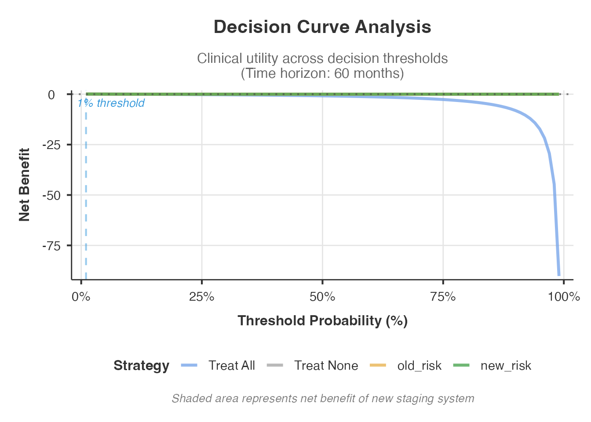
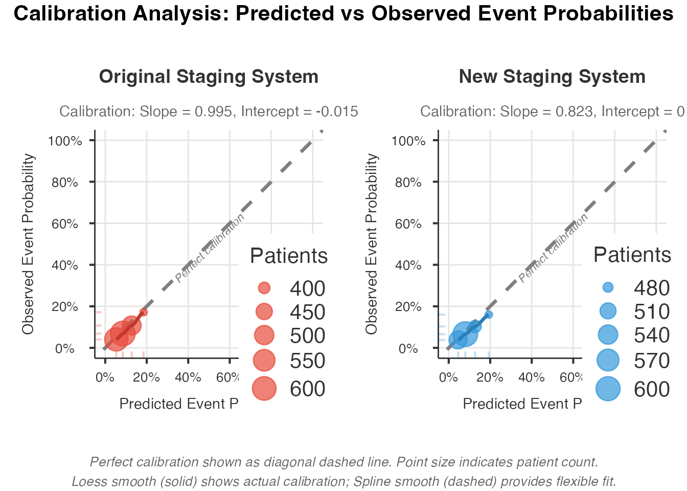
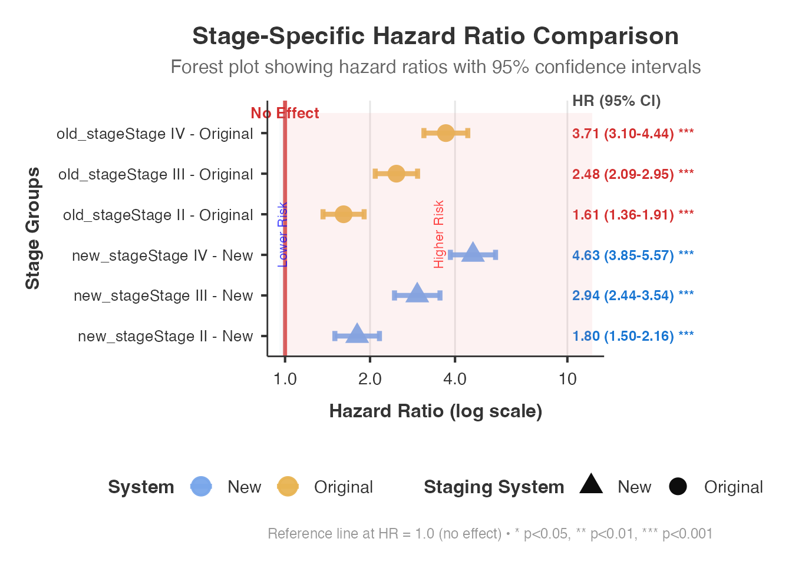
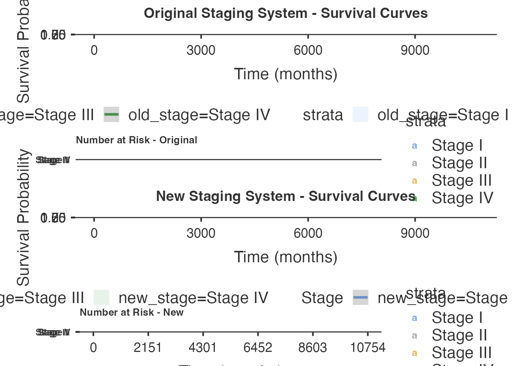
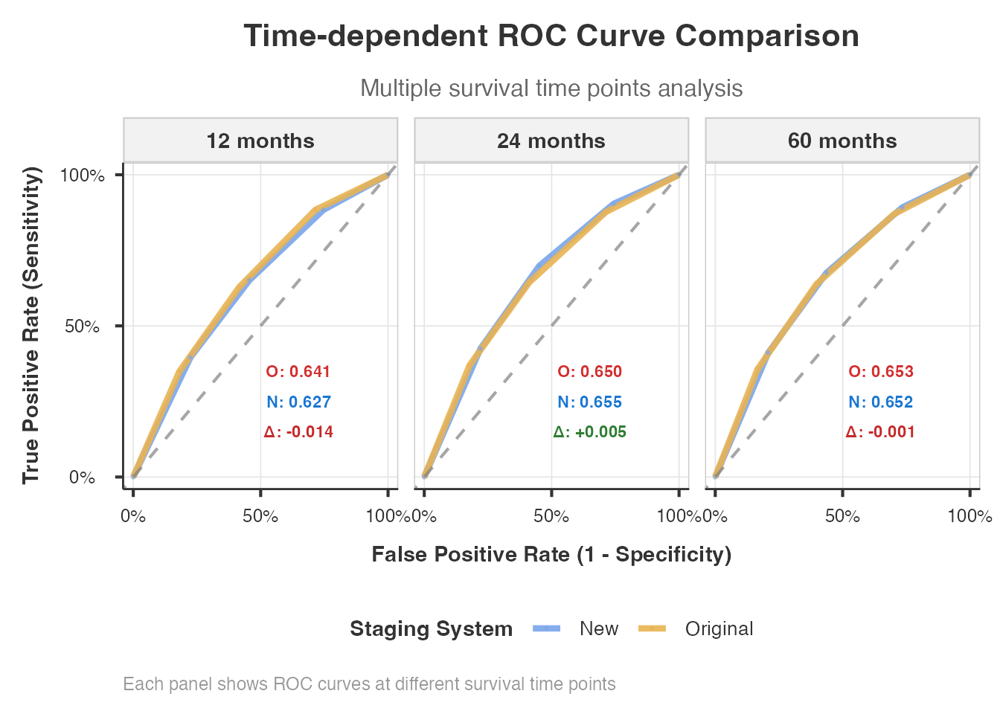

# Advanced TNM Stage Migration Analysis - Comprehensive Guide

> **Not yet released.** The `stagemigration` analysis is on a
> development menu route, so it does not appear in the jamovi menus of
> ClinicoPath or of any of its submodules. It is documented here ahead
> of a future release, and its options, defaults and output may still
> change. The R function is exported, so the examples below run from an
> R console; what is not yet available is the jamovi analysis itself.

> **Note:** The
> [`stagemigration()`](https://www.serdarbalci.com/ClinicoPathJamoviModule/reference/stagemigration.md)
> function is designed for use within **jamovi’s GUI**. The code
> examples below show the R syntax for reference. To run interactively,
> use
> [`devtools::load_all()`](https://devtools.r-lib.org/reference/load_all.html)
> and call the R6 class directly:
> `stagemigrationClass$new(options = stagemigrationOptions$new(...), data = mydata)`.

## Advanced TNM Stage Migration Analysis

### Overview

When a new edition of the AJCC/TNM staging manual is released,
pathologists and oncologists face a critical question: *Does the revised
staging system actually provide better prognostic discrimination than
the one it replaces?* This is not a trivial question. Patients who were
Stage II under the old criteria may become Stage III under the new
criteria - or vice versa. If the reclassification genuinely separates
patients with different prognoses, the new system is an improvement. If
it simply reshuffles patients without prognostic benefit, or worse,
introduces the **Will Rogers phenomenon** (where survival appears to
improve in every stage simply because of patient reclassification), then
the new system may be misleading.

The `stagemigration` module provides a state-of-the-art statistical
toolkit for answering this question. It goes far beyond a simple
cross-tabulation of old vs. new stages. The analysis includes formal
discrimination metrics (Harrell’s C-index), reclassification indices
(NRI, IDI), decision curve analysis for clinical utility, bootstrap
validation for internal validity, and multiple visualization tools for
presentations and publications. Cancer-type-specific thresholds and
interpretation guidelines are built in for lung, breast, colorectal,
prostate, head and neck, and melanoma.

Whether you are preparing a manuscript evaluating AJCC 8th vs. 7th
edition staging, validating an institutional modification to the
standard staging system, or assessing a biomarker-enhanced staging
proposal, this module provides the full analytical framework recommended
by current staging validation literature.

------------------------------------------------------------------------

### Datasets

The examples in this vignette use synthetic datasets that mimic
realistic TNM staging migration patterns. Because the bundled `.rda`
files may require regeneration, we create the data inline to guarantee
reproducibility.

``` r

set.seed(12345)

# --- Helper functions ---
generate_survival_times <- function(stage, hazard_base = 0.02,
                                    stage_multipliers = c(1, 1.5, 2.5, 4)) {
  stage_numeric <- as.numeric(stage)
  hazard <- hazard_base * stage_multipliers[stage_numeric]
  times <- rexp(length(stage), rate = hazard) * 12 + rnorm(length(stage), 0, 2)
  pmax(times, 0.1)
}

generate_censoring <- function(survival_times, censoring_rate = 0.3) {
  prob <- pmin(censoring_rate + (survival_times - median(survival_times)) / 100, 0.8)
  prob <- pmax(prob, 0.1)
  rbinom(length(survival_times), 1, 1 - prob)
}

create_stage_migration <- function(old_stage, migration_prob = 0.25) {
  new_stage <- as.numeric(old_stage)
  n <- length(old_stage)
  migrate <- sample(seq_len(n), size = round(n * migration_prob))
  for (i in migrate) {
    cs <- new_stage[i]
    if (cs == 1) new_stage[i] <- sample(c(1, 2, 3), 1, prob = c(0.4, 0.4, 0.2))
    else if (cs == 2) new_stage[i] <- sample(1:4, 1, prob = c(0.2, 0.3, 0.3, 0.2))
    else if (cs == 3) new_stage[i] <- sample(2:4, 1, prob = c(0.2, 0.4, 0.4))
    else new_stage[i] <- sample(3:4, 1, prob = c(0.1, 0.9))
  }
  factor(new_stage, levels = 1:4,
         labels = c("Stage I", "Stage II", "Stage III", "Stage IV"))
}

# --- Combined dataset (breast + lung + colorectal, N = 2100) ---
make_cohort <- function(n, cancer, hazard_base, mig_prob) {
  age <- pmin(pmax(round(rnorm(n, 64, 12)), 30), 90)
  sex <- factor(sample(c("Male", "Female"), n, replace = TRUE))
  old_num <- sample(1:4, n, replace = TRUE, prob = c(0.28, 0.30, 0.24, 0.18))
  old_stage <- factor(old_num, 1:4,
                      labels = c("Stage I", "Stage II", "Stage III", "Stage IV"))
  new_stage <- create_stage_migration(old_stage, migration_prob = mig_prob)
  st <- generate_survival_times(new_stage, hazard_base = hazard_base,
                                stage_multipliers = c(0.7, 1.2, 2.0, 3.5))
  ev <- generate_censoring(st, censoring_rate = 0.35)
  data.frame(age = age, sex = sex, old_stage = old_stage, new_stage = new_stage,
             survival_time = round(st, 1), event = ev, cancer_type = cancer,
             stringsAsFactors = FALSE)
}

lung_df    <- make_cohort(700, "Lung",       0.015, 0.30)
breast_df  <- make_cohort(700, "Breast",     0.008, 0.25)
crc_df     <- make_cohort(700, "Colorectal", 0.012, 0.28)

combined_data <- rbind(lung_df, breast_df, crc_df)
combined_data$patient_id <- seq_len(nrow(combined_data))

# --- Small sample dataset (N = 50, edge-case testing) ---
small_data <- make_cohort(50, "Mixed", 0.015, 0.20)

cat("Combined data:", nrow(combined_data), "patients,",
    sum(combined_data$event), "events\n")
#> Combined data: 2100 patients, 1155 events
cat("Small data:", nrow(small_data), "patients,",
    sum(small_data$event), "events\n")
#> Small data: 50 patients, 26 events
```

| Dataset         | N    | Key Features                                    |
|-----------------|------|-------------------------------------------------|
| `combined_data` | 2100 | Combined breast/lung/colorectal, 4-stage system |
| `lung_df`       | 700  | Lung cancer specific, higher hazard             |
| `breast_df`     | 700  | Breast cancer specific, lower hazard            |
| `small_data`    | 50   | Small sample for edge-case testing              |

------------------------------------------------------------------------

### 1. Basic Migration Analysis

The simplest use case: compare two staging systems and display the
migration matrix plus an overview table. This is the starting point for
any staging validation.

``` r

stagemigration(
  data = combined_data,
  oldStage = "old_stage",
  newStage = "new_stage",
  survivalTime = "survival_time",
  event = "event",
  eventLevel = "1",
  analysisType = "basic",
  showMigrationOverview = TRUE,
  showMigrationMatrix = TRUE
)
#> 
#>  ADVANCED TNM STAGE MIGRATION ANALYSIS
#> 
#>  Migration Overview                              
#>  ─────────────────────────────────────────────── 
#>    Statistic          Value         Percentage   
#>  ─────────────────────────────────────────────── 
#>    Total Patients     2100.00000    100%         
#>    Unchanged Stage    1787.00000    85.1%        
#>    Migrated Stage      313.00000    14.9%        
#>    Upstaged            245.00000    11.7%        
#>    Downstaged           68.00000    3.2%         
#>  ─────────────────────────────────────────────── 
#>    Note. Clinical preset 'routine_clinical'
#>    selected. Presets are advisory; please
#>    confirm displayed tables/plots and
#>    advanced options match your scenario.
#>    Note. Stage migration analysis completed
#>    successfully for 2100 patients with 1155
#>    events. Review statistical comparisons
#>    and clinical interpretation below.
#> 
#> 
#>  Stage Migration Matrix                                                      
#>  ─────────────────────────────────────────────────────────────────────────── 
#>    Original Stage    Stage I    Stage II    Stage III    Stage IV    Total   
#>  ─────────────────────────────────────────────────────────────────────────── 
#>    Stage I               496          66           29           0      591   
#>    Stage II               30         512           52          35      629   
#>    Stage III               0          31          400          63      494   
#>    Stage IV                0           0            7         379      386   
#>  ───────────────────────────────────────────────────────────────────────────
```

The **migration overview** tells you how many patients changed stage
(and in which direction), while the **migration matrix** shows the exact
cross-tabulation. Diagonal cells are patients who stayed in the same
stage; off-diagonal cells are patients who migrated. Above the diagonal
= upstaged, below = downstaged.

------------------------------------------------------------------------

### 2. Analysis Types

The `analysisType` option controls the scope of the analysis. There are
four levels:

- **basic** - Migration matrices and distribution tables only
- **standard** - Adds C-index comparison and NRI
- **comprehensive** - All statistical methods (default)
- **publication** - Optimized output formatting for manuscripts

``` r

stagemigration(
  data = combined_data,
  oldStage = "old_stage",
  newStage = "new_stage",
  survivalTime = "survival_time",
  event = "event",
  eventLevel = "1",
  analysisType = "standard",
  showMigrationOverview = TRUE,
  showMigrationMatrix = TRUE,
  showStageDistribution = TRUE,
  showStatisticalComparison = TRUE,
  showMigrationSummary = TRUE
)
#> 
#>  ADVANCED TNM STAGE MIGRATION ANALYSIS
#> 
#>  Migration Overview                              
#>  ─────────────────────────────────────────────── 
#>    Statistic          Value         Percentage   
#>  ─────────────────────────────────────────────── 
#>    Total Patients     2100.00000    100%         
#>    Unchanged Stage    1787.00000    85.1%        
#>    Migrated Stage      313.00000    14.9%        
#>    Upstaged            245.00000    11.7%        
#>    Downstaged           68.00000    3.2%         
#>  ─────────────────────────────────────────────── 
#>    Note. Clinical preset 'routine_clinical'
#>    selected. Presets are advisory; please
#>    confirm displayed tables/plots and
#>    advanced options match your scenario.
#>    Note. Stage migration analysis completed
#>    successfully for 2100 patients with 1155
#>    events. Review statistical comparisons
#>    and clinical interpretation below.
#> 
#> 
#>  Stage Migration Matrix                                                      
#>  ─────────────────────────────────────────────────────────────────────────── 
#>    Original Stage    Stage I    Stage II    Stage III    Stage IV    Total   
#>  ─────────────────────────────────────────────────────────────────────────── 
#>    Stage I               496          66           29           0      591   
#>    Stage II               30         512           52          35      629   
#>    Stage III               0          31          400          63      494   
#>    Stage IV                0           0            7         379      386   
#>  ─────────────────────────────────────────────────────────────────────────── 
#> 
#> 
#>  Stage Distribution Comparison                                                 
#>  ───────────────────────────────────────────────────────────────────────────── 
#>    Stage        Original Count    Original %    New Count    New %    Change   
#>  ───────────────────────────────────────────────────────────────────────────── 
#>    Stage I                 591    28.1%               526    25.0%    -3.1%    
#>    Stage II                629    30.0%               609    29.0%    -1.0%    
#>    Stage III               494    23.5%               488    23.2%    -0.3%    
#>    Stage IV                386    18.4%               477    22.7%    +4.3%    
#>  ───────────────────────────────────────────────────────────────────────────── 
#> 
#> 
#>  Migration Summary                                              
#>  ────────────────────────────────────────────────────────────── 
#>    Statistic                   Value                            
#>  ────────────────────────────────────────────────────────────── 
#>    Overall Migration Rate      14.9% (313/2100)                 
#>    Upstaging Rate              11.7% (245/2100)                 
#>    Downstaging Rate            3.2% (68/2100)                   
#>    Net Migration Effect        +177 patients (upward)           
#>    Chi-square Test             χ² = 4138.05, df = 9             
#>    Chi-square p-value          < 2.22e-16                       
#>    Fisher's Exact Test         Not calculated                   
#>    Fisher's Exact p-value      NA                               
#>    Statistical Significance    Highly significant (p < 0.001)   
#>  ────────────────────────────────────────────────────────────── 
#> 
#> 
#>  Statistical Comparison                                                                                  
#>  ─────────────────────────────────────────────────────────────────────────────────────────────────────── 
#>    Metric                      Value               95% CI                Interpretation                  
#>  ─────────────────────────────────────────────────────────────────────────────────────────────────────── 
#>    Original Staging C-index    0.6258              [0.6096, 0.6420]      Fair discrimination             
#>    New Staging C-index         0.6452              [0.6295, 0.6610]      Fair discrimination             
#>    C-index Improvement         +0.0194             [-0.0032, +0.0420]    Small improvement               
#>    Relative Improvement        +3.1%               N/A                   Moderate                        
#>    AIC Difference (Δ)          82.75               N/A                   Strong evidence for new model   
#>    BIC Difference (Δ)          82.75               N/A                   Very strong evidence            
#>    Clinical Significance       No                  Threshold: 0.020      Below clinical threshold        
#>    Overall Recommendation      3/4 criteria met    N/A                   Recommended for adoption        
#>  ─────────────────────────────────────────────────────────────────────────────────────────────────────── 
#> 
#> 
#>  LR Chi-Square Comparison (Key Staging Validation Metric)                                                                 
#>  ──────────────────────────────────────────────────────────────────────────────────────────────────────────────────────── 
#>    Staging System               LR Chi-Square    df    p-value       Goodness of Fit            Model Quality             
#>  ──────────────────────────────────────────────────────────────────────────────────────────────────────────────────────── 
#>    Original Staging System        233.4388474     3    < .0000001    Excellent fit              Strong prognostic model   
#>    New Staging System             316.1839399     3    < .0000001    Excellent fit              Strong prognostic model   
#>    LR Chi-Square Improvement       82.7450925     0                  Substantial improvement    New system better         
#>    Original Staging System        233.4388474     3    < .0000001    Excellent fit              Strong prognostic model   
#>    New Staging System             316.1839399     3    < .0000001    Excellent fit              Strong prognostic model   
#>    LR Chi-Square Improvement       82.7450925     0                  Substantial improvement    New system better         
#>  ──────────────────────────────────────────────────────────────────────────────────────────────────────────────────────── 
#>    Note. LR Chi-Square measures model goodness-of-fit vs null model. Higher values indicate better prognostic
#>    discrimination. This is a key metric for staging validation.
```

The **stage distribution comparison** shows how patient counts shift
between systems. The **statistical comparison** provides C-index values
for each staging system so you can see which one discriminates better.

------------------------------------------------------------------------

### 3. Net Reclassification Improvement (NRI) and Integrated Discrimination Improvement (IDI)

NRI quantifies whether the new staging system correctly reclassifies
patients – moving event patients to higher-risk stages and non-event
patients to lower-risk stages. IDI measures the integrated improvement
in predicted probabilities.

These are the gold-standard metrics for staging validation, recommended
by Pencina et al. (2008) and widely used in AJCC staging literature.

``` r

stagemigration(
  data = combined_data,
  oldStage = "old_stage",
  newStage = "new_stage",
  survivalTime = "survival_time",
  event = "event",
  eventLevel = "1",
  analysisType = "comprehensive",
  calculateNRI = TRUE,
  nriTimePoints = "12, 24, 60",
  calculateIDI = TRUE,
  showMigrationOverview = TRUE,
  showMigrationMatrix = TRUE
)
#> 
#>  ADVANCED TNM STAGE MIGRATION ANALYSIS
#> 
#>  Migration Overview                              
#>  ─────────────────────────────────────────────── 
#>    Statistic          Value         Percentage   
#>  ─────────────────────────────────────────────── 
#>    Total Patients     2100.00000    100%         
#>    Unchanged Stage    1787.00000    85.1%        
#>    Migrated Stage      313.00000    14.9%        
#>    Upstaged            245.00000    11.7%        
#>    Downstaged           68.00000    3.2%         
#>  ─────────────────────────────────────────────── 
#>    Note. Clinical preset 'routine_clinical'
#>    selected. Presets are advisory; please
#>    confirm displayed tables/plots and
#>    advanced options match your scenario.
#>    Note. Stage migration analysis completed
#>    successfully for 2100 patients with 1155
#>    events. Review statistical comparisons
#>    and clinical interpretation below.
#> 
#> 
#>  Stage Migration Matrix                                                      
#>  ─────────────────────────────────────────────────────────────────────────── 
#>    Original Stage    Stage I    Stage II    Stage III    Stage IV    Total   
#>  ─────────────────────────────────────────────────────────────────────────── 
#>    Stage I               496          66           29           0      591   
#>    Stage II               30         512           52          35      629   
#>    Stage III               0          31          400          63      494   
#>    Stage IV                0           0            7         379      386   
#>  ─────────────────────────────────────────────────────────────────────────── 
#> 
#> 
#>  Net Reclassification Improvement (NRI)                                                                                  
#>  ─────────────────────────────────────────────────────────────────────────────────────────────────────────────────────── 
#>    Time Point (months)    NRI          95% CI Lower    95% CI Upper    NRI+ (Events)    NRI- (Non-events)    p-value     
#>  ─────────────────────────────────────────────────────────────────────────────────────────────────────────────────────── 
#>               12.00000       -0.021          -0.112           0.070            0.047               -0.067        0.656   
#>               24.00000        0.002          -0.069           0.073            0.068               -0.066        0.954   
#>               60.00000       -0.001          -0.050           0.047            0.065               -0.066        0.967   
#>  ─────────────────────────────────────────────────────────────────────────────────────────────────────────────────────── 
#> 
#> 
#>  Integrated Discrimination Improvement (IDI)                                                        
#>  ────────────────────────────────────────────────────────────────────────────────────────────────── 
#>    IDI          95% CI Lower    95% CI Upper    p-value      Interpretation                         
#>  ────────────────────────────────────────────────────────────────────────────────────────────────── 
#>    0.0055614                                                 Modest improvement in discrimination   
#>  ──────────────────────────────────────────────────────────────────────────────────────────────────
```

**Interpreting NRI:**

- NRI \> 0: Net improvement in classification with the new system
- NRI \> 0.20 (the default `nriClinicalThreshold`): Clinically
  meaningful improvement
- The event NRI and non-event NRI components tell you whether the
  improvement comes from better classification of patients who had
  events, those who did not, or both

**Interpreting IDI:**

- IDI \> 0: Improved discrimination
- IDI represents the increase in the difference between mean predicted
  probabilities for events and non-events

------------------------------------------------------------------------

### 4. C-index Comparison

Harrell’s concordance index (C-index) measures the staging system’s
ability to rank patients by their survival prognosis. A C-index of 0.5
means random discrimination; 1.0 means perfect discrimination. In
staging validation, a clinically meaningful improvement is typically
0.02 or greater (configurable via `clinicalSignificanceThreshold`).

``` r

stagemigration(
  data = combined_data,
  oldStage = "old_stage",
  newStage = "new_stage",
  survivalTime = "survival_time",
  event = "event",
  eventLevel = "1",
  analysisType = "standard",
  showConcordanceComparison = TRUE,
  showStatisticalComparison = TRUE,
  includeEffectSizes = TRUE,
  clinicalSignificanceThreshold = 0.02
)
#> 
#>  ADVANCED TNM STAGE MIGRATION ANALYSIS
#> 
#>  Migration Overview                              
#>  ─────────────────────────────────────────────── 
#>    Statistic          Value         Percentage   
#>  ─────────────────────────────────────────────── 
#>    Total Patients     2100.00000    100%         
#>    Unchanged Stage    1787.00000    85.1%        
#>    Migrated Stage      313.00000    14.9%        
#>    Upstaged            245.00000    11.7%        
#>    Downstaged           68.00000    3.2%         
#>  ─────────────────────────────────────────────── 
#>    Note. Clinical preset 'routine_clinical'
#>    selected. Presets are advisory; please
#>    confirm displayed tables/plots and
#>    advanced options match your scenario.
#>    Note. Stage migration analysis completed
#>    successfully for 2100 patients with 1155
#>    events. Review statistical comparisons
#>    and clinical interpretation below.
#> 
#> 
#>  Stage Migration Matrix                                                      
#>  ─────────────────────────────────────────────────────────────────────────── 
#>    Original Stage    Stage I    Stage II    Stage III    Stage IV    Total   
#>  ─────────────────────────────────────────────────────────────────────────── 
#>    Stage I               496          66           29           0      591   
#>    Stage II               30         512           52          35      629   
#>    Stage III               0          31          400          63      494   
#>    Stage IV                0           0            7         379      386   
#>  ─────────────────────────────────────────────────────────────────────────── 
#> 
#> 
#>  Statistical Comparison                                                                                  
#>  ─────────────────────────────────────────────────────────────────────────────────────────────────────── 
#>    Metric                      Value               95% CI                Interpretation                  
#>  ─────────────────────────────────────────────────────────────────────────────────────────────────────── 
#>    Original Staging C-index    0.6258              [0.6096, 0.6420]      Fair discrimination             
#>    New Staging C-index         0.6452              [0.6295, 0.6610]      Fair discrimination             
#>    C-index Improvement         +0.0194             [-0.0032, +0.0420]    Small improvement               
#>    Relative Improvement        +3.1%               N/A                   Moderate                        
#>    AIC Difference (Δ)          82.75               N/A                   Strong evidence for new model   
#>    BIC Difference (Δ)          82.75               N/A                   Very strong evidence            
#>    Clinical Significance       No                  Threshold: 0.020      Below clinical threshold        
#>    Overall Recommendation      3/4 criteria met    N/A                   Recommended for adoption        
#>  ─────────────────────────────────────────────────────────────────────────────────────────────────────── 
#> 
#> 
#>  Discrimination Comparison (C-Index)                                                                       
#>  ───────────────────────────────────────────────────────────────────────────────────────────────────────── 
#>    Model               C-Index      SE           95% CI Lower    95% CI Upper    Difference    p-value     
#>  ───────────────────────────────────────────────────────────────────────────────────────────────────────── 
#>    Original Staging    0.6257989    0.0082663       0.6095969       0.6420008    .             .           
#>    New Staging         0.6452173    0.0080314       0.6294758       0.6609589         0.019       <0.001   
#>  ───────────────────────────────────────────────────────────────────────────────────────────────────────── 
#>    Note. P-values for C-index difference are corrected for model correlation using Spearman
#>    correlation of risk scores (heuristic approximation). Enable Bootstrap for exact testing.
#> 
#> 
#>  Effect Sizes                                                                                                                                     
#>  ──────────────────────────────────────────────────────────────────────────────────────────────────────────────────────────────────────────────── 
#>    Measure                            Effect Size    Magnitude     Interpretation                               Practical Significance            
#>  ──────────────────────────────────────────────────────────────────────────────────────────────────────────────────────────────────────────────── 
#>    Cohen's d (C-index difference)       0.9473684    Small         Standardized C-index difference: 0.947       Limited practical impact          
#>    R² equivalent (Original System)      0.0109520    Small         Variance explained: 1.1% (C-index: 0.574)    Moderate discriminative ability   
#>    R² equivalent (New System)           0.0169280    Small         Variance explained: 1.7% (C-index: 0.592)    Moderate discriminative ability   
#>    Improvement in Discrimination        0.0059760    Negligible    0.6% improvement in variance explained       Limited clinical improvement      
#>    C-index Difference                   0.0180000    Small         Raw C-index improvement: 0.018               Minimal improvement               
#>  ──────────────────────────────────────────────────────────────────────────────────────────────────────────────────────────────────────────────── 
#> 
#> 
#>  LR Chi-Square Comparison (Key Staging Validation Metric)                                                                 
#>  ──────────────────────────────────────────────────────────────────────────────────────────────────────────────────────── 
#>    Staging System               LR Chi-Square    df    p-value       Goodness of Fit            Model Quality             
#>  ──────────────────────────────────────────────────────────────────────────────────────────────────────────────────────── 
#>    Original Staging System        233.4388474     3    < .0000001    Excellent fit              Strong prognostic model   
#>    New Staging System             316.1839399     3    < .0000001    Excellent fit              Strong prognostic model   
#>    LR Chi-Square Improvement       82.7450925     0                  Substantial improvement    New system better         
#>    Original Staging System        233.4388474     3    < .0000001    Excellent fit              Strong prognostic model   
#>    New Staging System             316.1839399     3    < .0000001    Excellent fit              Strong prognostic model   
#>    LR Chi-Square Improvement       82.7450925     0                  Substantial improvement    New system better         
#>  ──────────────────────────────────────────────────────────────────────────────────────────────────────────────────────── 
#>    Note. LR Chi-Square measures model goodness-of-fit vs null model. Higher values indicate better prognostic
#>    discrimination. This is a key metric for staging validation.
```

The concordance comparison table shows:

- C-index for the old staging system
- C-index for the new staging system
- The difference (Delta C) and its confidence interval
- Whether the improvement crosses the clinical significance threshold

------------------------------------------------------------------------

### 5. Will Rogers Effect Detection

The Will Rogers phenomenon occurs when patient reclassification creates
the illusion of improvement. Named after Will Rogers’ quip about
Oklahomans moving to California and raising the average intelligence of
both states, it can make a new staging system appear superior when it is
not.

The module detects this by comparing survival within each stage between
patients who migrated and those who did not. If migrated patients have
systematically different survival than the non-migrated patients in
their new stage, the Will Rogers effect is operating.

``` r

stagemigration(
  data = combined_data,
  oldStage = "old_stage",
  newStage = "new_stage",
  survivalTime = "survival_time",
  event = "event",
  eventLevel = "1",
  analysisType = "comprehensive",
  showWillRogersAnalysis = TRUE,
  showWillRogersVisualization = TRUE,
  advancedMigrationAnalysis = TRUE,
  showMigrationHeatmap = TRUE
)
#> 
#>  ADVANCED TNM STAGE MIGRATION ANALYSIS
#> 
#>  Migration Overview                              
#>  ─────────────────────────────────────────────── 
#>    Statistic          Value         Percentage   
#>  ─────────────────────────────────────────────── 
#>    Total Patients     2100.00000    100%         
#>    Unchanged Stage    1787.00000    85.1%        
#>    Migrated Stage      313.00000    14.9%        
#>    Upstaged            245.00000    11.7%        
#>    Downstaged           68.00000    3.2%         
#>  ─────────────────────────────────────────────── 
#>    Note. Clinical preset 'routine_clinical'
#>    selected. Presets are advisory; please
#>    confirm displayed tables/plots and
#>    advanced options match your scenario.
#>    Note. Stage migration analysis completed
#>    successfully for 2100 patients with 1155
#>    events. Review statistical comparisons
#>    and clinical interpretation below.
#> 
#> 
#>  Stage Migration Matrix                                                      
#>  ─────────────────────────────────────────────────────────────────────────── 
#>    Original Stage    Stage I    Stage II    Stage III    Stage IV    Total   
#>  ─────────────────────────────────────────────────────────────────────────── 
#>    Stage I               496          66           29           0      591   
#>    Stage II               30         512           52          35      629   
#>    Stage III               0          31          400          63      494   
#>    Stage IV                0           0            7         379      386   
#>  ─────────────────────────────────────────────────────────────────────────── 
#> 
#> 
#>  Integrated AUC Analysis                                                                                                                                                                    
#>  ────────────────────────────────────────────────────────────────────────────────────────────────────────────────────────────────────────────────────────────────────────────────────────── 
#>    Metric                          Original System    New System    Difference    95% CI Lower    95% CI Upper    p-value      Interpretation                                               
#>  ────────────────────────────────────────────────────────────────────────────────────────────────────────────────────────────────────────────────────────────────────────────────────────── 
#>    Integrated AUC (Trapezoidal)          0.6499000     0.6501000     0.0002000      -0.0251000       0.0276000    0.2500000    Minimal improvement in Integrated AUC (clinically minimal)   
#>    Mean Time-dependent AUC               0.6479000     0.6446000    -0.0034000      -0.0908000       0.0841000    0.2500000    Minimal deterioration in Mean AUC (clinically minimal)       
#>    AUC Comparison Test (12m)             0.6411000     0.6274000    -0.0136000                                    0.4994000    Not significant decline in discrimination                    
#>    AUC Temporal Trend (slope)            0.0002130     0.0003670     0.0001550                                    0.8043000    No significant temporal trend differences                    
#>    Brier Score (60m)                     0.0783000     0.0784000    -0.0001000                                                 Minimal change in combined discrimination/calibration        
#>  ────────────────────────────────────────────────────────────────────────────────────────────────────────────────────────────────────────────────────────────────────────────────────────── 
#> 
#> 
#>  <div style="margin-bottom: 20px; padding: 15px; background-color:
#>  #fdf2e9; border-left: 4px solid #f39c12;">
#>  <h4 style="margin-top: 0; color: #2c3e50;">Understanding Will Rogers
#>  Phenomenon Analysis
#> 
#>  <p style="margin-bottom: 10px;">The Will Rogers phenomenon occurs when
#>  patients migrate between stages, potentially creating artificial
#>  improvements:
#> 
#>  <ul style="margin-left: 20px;">
#>  Stage: Original staging category being analyzed
#>  Unchanged N: Number of patients who remained in the same stage
#>  Unchanged Median: Median survival for patients who did not migrate
#>  Migrated N: Number of patients who moved to different stages
#>  Migrated Median: Median survival for patients who migrated
#>  p-value: Statistical significance of survival difference
#> 
#>  <p style="margin-bottom: 5px;">Clinical interpretation:
#> 
#>  <ul style="margin-left: 20px;">
#>  p <0.05 = significant Will Rogers phenomenon detected
#>  Migrated patients often have different prognosis than unchanged
#>  This can create artificial improvements in apparent survival
#>  Must be considered when evaluating new staging systems
#> 
#> 
#> 
#> 
#>  Will Rogers Phenomenon Analysis                                                                 
#>  ─────────────────────────────────────────────────────────────────────────────────────────────── 
#>    Stage        Unchanged N    Unchanged Median    Migrated N    Migrated Median    p-value      
#>  ─────────────────────────────────────────────────────────────────────────────────────────────── 
#>    Stage I              496        3736.5000000            95        577.9000000    < .0000001   
#>    Stage II             512        1319.8000000           117        378.0000000     0.0027539   
#>    Stage III            400         487.8000000            94        324.1000000     0.1732342   
#>    Stage IV             379         248.9000000             7        460.6000000     0.2633548   
#>  ─────────────────────────────────────────────────────────────────────────────────────────────── 
#> 
#> 
#>  <div style="margin-bottom: 20px; padding: 15px; background-color:
#>  #fff8e1; border-left: 4px solid #ffc107;">
#>  <h4 style="margin-top: 0; color: #2c3e50;">Interpreting the Migration
#>  Heatmap
#> 
#>  <p style="margin-bottom: 10px;">This heatmap visualizes patient
#>  movement between staging systems:
#> 
#>  <ul style="margin-left: 20px;">
#>  Y-axis (rows): Original staging system categories
#>  X-axis (columns): New staging system categories
#>  Color intensity: Darker blue = more patients
#>  Numbers: Actual patient counts in each cell
#>  Diagonal: Patients who remained in the same stage (no migration)
#> 
#>  <p style="margin-bottom: 5px;">Reading the heatmap:
#> 
#>  <ul style="margin-left: 20px;">
#>  Cells above the diagonal = downstaging (patients moved to lower
#>  stages)
#>  Cells below the diagonal = upstaging (patients moved to higher stages)
#>  Perfect agreement would show all patients on the diagonal
#>  The pattern reveals systematic differences between staging systems
#> 
#> 
#> 
#> 
#>  Calibration Analysis                                                                                                                                                                                                                    
#>  ─────────────────────────────────────────────────────────────────────────────────────────────────────────────────────────────────────────────────────────────────────────────────────────────────────────────────────────────────────── 
#>    Model               H-L Chi²      H-L df    H-L p-value    Calibration Slope    Calibration Intercept    Slope 95% CI Lower    Slope 95% CI Upper    Interpretation                                                                   
#>  ─────────────────────────────────────────────────────────────────────────────────────────────────────────────────────────────────────────────────────────────────────────────────────────────────────────────────────────────────────── 
#>    Original Staging    11.2454620         2      0.0036148            2.8553312               -1.4654809             2.3030060             3.4143152    H-L test: poor fit; Under-prediction (slope > 1.2); Good overall calibration     
#>    New Staging         22.0461578         2      0.0000163            2.8840685               -1.5722649             2.4042375             3.3701696    H-L test: poor fit; Under-prediction (slope > 1.2); Systematic over-prediction   
#>  ─────────────────────────────────────────────────────────────────────────────────────────────────────────────────────────────────────────────────────────────────────────────────────────────────────────────────────────────────────── 
#> 
#> 
#>  Monotonicity Assessment                                                                            
#>  ────────────────────────────────────────────────────────────────────────────────────────────────── 
#>    Staging System     Monotonic    Violations    Details                       Monotonicity Score   
#>  ────────────────────────────────────────────────────────────────────────────────────────────────── 
#>    Original System    Yes                   0    Perfect monotonic ordering             1.0000000   
#>    New System         Yes                   0    Perfect monotonic ordering             1.0000000   
#>  ────────────────────────────────────────────────────────────────────────────────────────────────── 
#> 
#> 
#>  Will Rogers Phenomenon Analysis                                                                                                                                               
#>  ───────────────────────────────────────────────────────────────────────────────────────────────────────────────────────────────────────────────────────────────────────────── 
#>    Migration Pattern       Count    Old Stage Δ Survival    New Stage Δ Survival    Will Rogers Evidence                       Clinical Impact                                 
#>  ───────────────────────────────────────────────────────────────────────────────────────────────────────────────────────────────────────────────────────────────────────────── 
#>    Stage I → Stage II         66            3414.1000000            1295.8000000    Possible - Partial pattern                 Limited bias potential                          
#>    Stage I → Stage III        29            3414.1000000             448.4000000    Possible - Partial pattern                 Limited bias potential                          
#>    Stage II → Stage I         30            1107.4000000            3758.0000000    Possible - Partial pattern                 Limited bias potential                          
#>    Stage II → Stage III       52            1107.4000000             448.4000000    Possible - Partial pattern                 Limited bias potential                          
#>    Stage II → Stage IV        35            1107.4000000             254.8000000    Possible - Partial pattern                 Limited bias potential                          
#>    Stage III → Stage II       31             448.4000000            1295.8000000    None                                       No significant bias detected                    
#>    Stage III → Stage IV       63             448.4000000             254.8000000    Strong - Classic Will Rogers pattern       May artificially improve both stage survivals   
#>    Stage IV → Stage III        7             253.1000000             448.4000000    Possible - Partial pattern                 Limited bias potential                          
#>    Overall Assessment        313               0.1490476                            Moderate migration - some bias possible    Generally acceptable with caveats               
#>  ───────────────────────────────────────────────────────────────────────────────────────────────────────────────────────────────────────────────────────────────────────────── 
#> 
#> 
#>  Enhanced Will Rogers Statistical Analysis                                                                                                                                                                                                                
#>  ──────────────────────────────────────────────────────────────────────────────────────────────────────────────────────────────────────────────────────────────────────────────────────────────────────────────────────────────────────────────────────── 
#>    Stage                   Period                                    N             Median Survival     95% CI Lower        95% CI Upper        Δ Survival     P-value      Test                                                                           
#>  ──────────────────────────────────────────────────────────────────────────────────────────────────────────────────────────────────────────────────────────────────────────────────────────────────────────────────────────────────────────────────────── 
#>    Stage II (original)     With vs without 30 migrated patients      629 vs 512    1107.4 vs 1319.8      686.7 vs 932.3    1684.6 vs 2150.4    212.4000000    0.3726057    Log-rank test (Stage II→Stage I migration)                                     
#>    Stage I (new)           With vs without 30 migrated patients      526 vs 496      3758 vs 3736.5    3356.9 vs 3356.9        6167.9 vs NA    -21.5000000    0.8878140    Log-rank test (Stage II→Stage I migration)                                     
#>    Stage I (original)      With vs without 66 migrated patients      591 vs 496    3414.1 vs 3736.5    2675.3 vs 3356.9        4367.4 vs NA    322.4000000    0.1610650    Log-rank test (Stage I→Stage II migration)                                     
#>    Stage II (new)          With vs without 66 migrated patients      609 vs 512    1295.8 vs 1319.8      909.4 vs 932.3    2062.5 vs 2150.4     24.0000000    0.8569978    Log-rank test (Stage I→Stage II migration)                                     
#>    Stage III (original)    With vs without 31 migrated patients      494 vs 400      448.4 vs 487.8      367.7 vs 390.4      528.4 vs 606.1     39.4000000    0.6674910    Log-rank test (Stage III→Stage II migration)                                   
#>    Stage II (new)          With vs without 31 migrated patients      609 vs 512    1295.8 vs 1319.8      909.4 vs 932.3    2062.5 vs 2150.4     24.0000000    0.8569978    Log-rank test (Stage III→Stage II migration)                                   
#>    Stage I (original)      With vs without 29 migrated patients      591 vs 496    3414.1 vs 3736.5    2675.3 vs 3356.9        4367.4 vs NA    322.4000000    0.1610650    Log-rank test (Stage I→Stage III migration)                                    
#>    Stage III (new)         With vs without 29 migrated patients      488 vs 400      448.4 vs 487.8      379.1 vs 390.4      528.4 vs 606.1     39.4000000    0.7403011    Log-rank test (Stage I→Stage III migration)                                    
#>    Stage II (original)     With vs without 52 migrated patients      629 vs 512    1107.4 vs 1319.8      686.7 vs 932.3    1684.6 vs 2150.4    212.4000000    0.3726057    Log-rank test (Stage II→Stage III migration)                                   
#>    Stage III (new)         With vs without 52 migrated patients      488 vs 400      448.4 vs 487.8      379.1 vs 390.4      528.4 vs 606.1     39.4000000    0.7403011    Log-rank test (Stage II→Stage III migration)                                   
#>    Stage IV (original)     With vs without 7 migrated patients       386 vs 379      253.1 vs 248.9        215.4 vs 213      290.5 vs 280.9     -4.2000000    0.8939330    Log-rank test (Stage IV→Stage III migration)                                   
#>    Stage III (new)         With vs without 7 migrated patients       488 vs 400      448.4 vs 487.8      379.1 vs 390.4      528.4 vs 606.1     39.4000000    0.7403011    Log-rank test (Stage IV→Stage III migration)                                   
#>    Stage II (original)     With vs without 35 migrated patients      629 vs 512    1107.4 vs 1319.8      686.7 vs 932.3    1684.6 vs 2150.4    212.4000000    0.3726057    Log-rank test (Stage II→Stage IV migration)                                    
#>    Stage IV (new)          With vs without 35 migrated patients      477 vs 379      254.8 vs 248.9        221.8 vs 213      283.8 vs 280.9     -5.9000000    0.7864914    Log-rank test (Stage II→Stage IV migration)                                    
#>    Stage III (original)    With vs without 63 migrated patients      494 vs 400      448.4 vs 487.8      367.7 vs 390.4      528.4 vs 606.1     39.4000000    0.6674910    Log-rank test (Stage III→Stage IV migration)                                   
#>    Stage IV (new)          With vs without 63 migrated patients      477 vs 379      254.8 vs 248.9        221.8 vs 213      283.8 vs 280.9     -5.9000000    0.7864914    Log-rank test (Stage III→Stage IV migration)                                   
#>    Overall Assessment      8 migration pattern(s), 14.9% migrated          2100                                                                               0.1490476    Moderate migration pattern - check individual tests for Will Rogers evidence   
#>  ──────────────────────────────────────────────────────────────────────────────────────────────────────────────────────────────────────────────────────────────────────────────────────────────────────────────────────────────────────────────────────── 
#> 
#> 
#>  Detailed Stage-Specific Will Rogers Breakdown                                                                                                                                                                                                                                       
#>  ─────────────────────────────────────────────────────────────────────────────────────────────────────────────────────────────────────────────────────────────────────────────────────────────────────────────────────────────────────────────────────────────────────────────────── 
#>    Stage                 Migration Type    N Migrated    % Migrated    Original Median Survival    New Median Survival    Absolute Improvement    Relative Improvement %    Improvement Type    Clinical Impact                                                                      
#>  ─────────────────────────────────────────────────────────────────────────────────────────────────────────────────────────────────────────────────────────────────────────────────────────────────────────────────────────────────────────────────────────────────────────────────── 
#>    Stage I               Net Loss                  65      10.99831                3414.1000000           3758.0000000             343.9000000                  10.07293    Beneficial          Will Rogers Effect: Survival improved by losing worst patients                       
#>    Stage II              Net Loss                  20       3.17965                1107.4000000           1295.8000000             188.4000000                  17.01282    Beneficial          Will Rogers Effect: Survival improved by losing worst patients                       
#>    Stage III             Net Loss                   6       1.21457                 448.4000000            448.4000000               0.0000000                   0.00000    Minimal             Minimal survival change from patient loss                                            
#>    Stage IV              Net Gain                  91      23.57513                 253.1000000            254.8000000               1.7000000                   0.67167    Minimal             Minimal survival change from patient gain                                            
#>    Overall Assessment    Mixed Pattern            313      14.90476                                                                                                         Strong              Multiple stages show artificial survival improvement from patient reclassification   
#>  ─────────────────────────────────────────────────────────────────────────────────────────────────────────────────────────────────────────────────────────────────────────────────────────────────────────────────────────────────────────────────────────────────────────────────── 
#> 
#> 
#>  Stage-Specific C-Index Analysis                                                                                                       
#>  ───────────────────────────────────────────────────────────────────────────────────────────────────────────────────────────────────── 
#>    Original Stage    N      New System C-Index    SE           95% CI Lower    95% CI Upper    Prognostic Value                        
#>  ───────────────────────────────────────────────────────────────────────────────────────────────────────────────────────────────────── 
#>    Stage I           591             0.5688790    0.0144281       0.5405999       0.5971581    Poor discrimination (significant)       
#>    Stage II          629             0.5660672    0.0120072       0.5425330       0.5896013    Poor discrimination (significant)       
#>    Stage III         494             0.5280793    0.0115158       0.5055083       0.5506504    Poor discrimination (significant)       
#>    Stage IV          386             0.5090141    0.0038844       0.5014006       0.5166275    Poor discrimination (non-significant)   
#>  ───────────────────────────────────────────────────────────────────────────────────────────────────────────────────────────────────── 
#> 
#> 
#>  Enhanced Pseudo R-squared Measures                                                                                                
#>  ───────────────────────────────────────────────────────────────────────────────────────────────────────────────────────────────── 
#>    Measure                   Original System    New System    Improvement    Relative Improvement (%)    Interpretation            
#>  ───────────────────────────────────────────────────────────────────────────────────────────────────────────────────────────────── 
#>    Nagelkerke R²                   0.1052491     0.1398348      0.0345858                  32.8608746    Substantial improvement   
#>    Cox & Snell R²                  0.1052056     0.1397771      0.0345715                  32.8608746    Substantial improvement   
#>    McFadden R²                     0.0142637     0.0193197      0.0050559                  35.4461537    Small improvement         
#>    Royston & Sauerbrei R²          0.0326846     0.0437630      0.0110784                  33.8949220    Moderate improvement      
#>  ───────────────────────────────────────────────────────────────────────────────────────────────────────────────────────────────── 
#> 
#> 
#>  Enhanced Reclassification Metrics                                                                                                                        
#>  ──────────────────────────────────────────────────────────────────────────────────────────────────────────────────────────────────────────────────────── 
#>    Metric                                  Value         95% CI Lower    95% CI Upper    p-value       Clinical Interpretation                            
#>  ──────────────────────────────────────────────────────────────────────────────────────────────────────────────────────────────────────────────────────── 
#>    Category-free NRI                        0.1173079      -0.0322051       0.2668209     0.1240937    Small improvement (category-free approach)         
#>    Clinical NRI (high-risk threshold)       0.0032447      -0.0604112       0.0669006     0.9204181    Minimal improvement (clinical thresholds)          
#>    Upstaging NRI                            0.3333333                                                  Substantial improvement (upstaged patients only)   
#>    Downstaging NRI                          0.0000000                                                  Minimal deterioration (downstaged patients only)   
#>    Weighted NRI (high-risk emphasis)       -0.0180399                                                  Minimal deterioration (risk-weighted approach)     
#>    Relative IDI (%)                        32.1924689       3.9933987      60.3915390    < .0000001    Substantial improvement - not significant          
#>    Continuous NRI                           0.0142099      -0.0616039       0.0900237     0.7133460    Minimal improvement (continuous risk scores)       
#>    Event Discrimination Improvement         0.0406682       0.0375952       0.0437412    < .0000001    Small improvement in event discrimination          
#>    Non-event Discrimination Improvement    -0.0255993      -0.0286898      -0.0225088    < .0000001    Small deterioration in non-event discrimination    
#>    Kaplan-Meier based NRI                   0.0000000       0.0000000       0.0000000           NaN    Minimal deterioration (Kaplan-Meier based)         
#>  ──────────────────────────────────────────────────────────────────────────────────────────────────────────────────────────────────────────────────────── 
#> 
#> 
#>  Proportional Hazards Assumption Test                                                                                                                         
#>  ──────────────────────────────────────────────────────────────────────────────────────────────────────────────────────────────────────────────────────────── 
#>    Staging System             Chi-Square    df    p-value      Assumption Status    Interpretation                                                            
#>  ──────────────────────────────────────────────────────────────────────────────────────────────────────────────────────────────────────────────────────────── 
#>    Original Staging System     0.2714032     3    0.9653139    Assumption Met       Proportional hazards assumption is satisfied. Cox model is appropriate.   
#>    New Staging System          0.1487464     3    0.9854054    Assumption Met       Proportional hazards assumption is satisfied. Cox model is appropriate.   
#>  ──────────────────────────────────────────────────────────────────────────────────────────────────────────────────────────────────────────────────────────── 
#> 
#> 
#>  Decision Curve Analysis                                                                                                                                                    
#>  ────────────────────────────────────────────────────────────────────────────────────────────────────────────────────────────────────────────────────────────────────────── 
#>    Time Point (months)    Threshold (%)    Net Benefit Original    Net Benefit New    Difference    Clinical Impact    Interpretation                                       
#>  ────────────────────────────────────────────────────────────────────────────────────────────────────────────────────────────────────────────────────────────────────────── 
#>             12.0000000        5.0000000               0.0000000          0.0000000     0.0000000    Minimal            No clinically meaningful difference in net benefit   
#>             12.0000000       10.0000000               0.0000000          0.0000000     0.0000000    Minimal            No clinically meaningful difference in net benefit   
#>             12.0000000       15.0000000               0.0000000          0.0000000     0.0000000    Minimal            No clinically meaningful difference in net benefit   
#>             12.0000000       20.0000000               0.0000000          0.0000000     0.0000000    Minimal            No clinically meaningful difference in net benefit   
#>             12.0000000       25.0000000               0.0000000          0.0000000     0.0000000    Minimal            No clinically meaningful difference in net benefit   
#>             12.0000000       30.0000000               0.0000000          0.0000000     0.0000000    Minimal            No clinically meaningful difference in net benefit   
#>             12.0000000       40.0000000               0.0000000          0.0000000     0.0000000    Minimal            No clinically meaningful difference in net benefit   
#>             12.0000000       50.0000000               0.0000000          0.0000000     0.0000000    Minimal            No clinically meaningful difference in net benefit   
#>             24.0000000        5.0000000               0.0038596          0.0035840    -0.0002757    Minimal            No clinically meaningful difference in net benefit   
#>             24.0000000       10.0000000               0.0000000          0.0000000     0.0000000    Minimal            No clinically meaningful difference in net benefit   
#>             24.0000000       15.0000000               0.0000000          0.0000000     0.0000000    Minimal            No clinically meaningful difference in net benefit   
#>             24.0000000       20.0000000               0.0000000          0.0000000     0.0000000    Minimal            No clinically meaningful difference in net benefit   
#>             24.0000000       25.0000000               0.0000000          0.0000000     0.0000000    Minimal            No clinically meaningful difference in net benefit   
#>             24.0000000       30.0000000               0.0000000          0.0000000     0.0000000    Minimal            No clinically meaningful difference in net benefit   
#>             24.0000000       40.0000000               0.0000000          0.0000000     0.0000000    Minimal            No clinically meaningful difference in net benefit   
#>             24.0000000       50.0000000               0.0000000          0.0000000     0.0000000    Minimal            No clinically meaningful difference in net benefit   
#>             60.0000000        5.0000000               0.0428822          0.0432581     0.0003759    Minimal            No clinically meaningful difference in net benefit   
#>             60.0000000       10.0000000               0.0158730          0.0150794    -0.0007937    Minimal            No clinically meaningful difference in net benefit   
#>             60.0000000       15.0000000               0.0045378          0.0024930    -0.0020448    Minimal            No clinically meaningful difference in net benefit   
#>             60.0000000       20.0000000               0.0000000          0.0000000     0.0000000    Minimal            No clinically meaningful difference in net benefit   
#>             60.0000000       25.0000000               0.0000000          0.0000000     0.0000000    Minimal            No clinically meaningful difference in net benefit   
#>             60.0000000       30.0000000               0.0000000          0.0000000     0.0000000    Minimal            No clinically meaningful difference in net benefit   
#>             60.0000000       40.0000000               0.0000000          0.0000000     0.0000000    Minimal            No clinically meaningful difference in net benefit   
#>             60.0000000       50.0000000               0.0000000          0.0000000     0.0000000    Minimal            No clinically meaningful difference in net benefit   
#>  ────────────────────────────────────────────────────────────────────────────────────────────────────────────────────────────────────────────────────────────────────────── 
#> 
#> 
#>  <div style="margin-bottom: 20px; padding: 15px; background-color:
#>  #f0f8ff; border-left: 4px solid #1976d2;">
#>  <h4 style="margin-top: 0; color: #2c3e50;">Understanding the
#>  Comparative Analysis Dashboard
#> 
#>  <p style="margin-bottom: 10px;">This dashboard provides an executive
#>  summary of all stage migration analyses. It synthesizes complex
#>  statistical results into actionable insights for clinical
#>  decision-making.
#> 
#>  <h5 style="color: #34495e; margin-top: 15px;">Abbreviations and Terms
#>  Explained:
#> 
#>  <ul style="margin-left: 20px;">
#>  N/A (Not Applicable): This value is not relevant for the specific
#>  metric. For example, "Total Patients" has no improvement value because
#>  it's the same for both staging systems.
#>  TBD (To Be Determined): The analysis is pending or requires you to
#>  check the detailed analysis table mentioned in the recommendation
#>  column. This appears when:
#> 
#>  Advanced analysis options need to be enabled
#>  The specific analysis has not been run yet
#>  The dashboard cannot automatically extract the value from detailed
#>  results
#> 
#> 
#>  C-Index: Concordance Index - measures discrimination ability (0.5 = no
#>  discrimination, 1.0 = perfect discrimination)
#>  CI: Confidence Interval - typically 95% CI unless otherwise specified
#>  HR: Hazard Ratio - relative risk between stages
#>  NRI: Net Reclassification Improvement - measures improvement in risk
#>  classification
#> 
#>  *Category-Free NRI:* Uses continuous risk scores (most sensitive)
#>  *Clinical NRI:* Uses clinically relevant risk thresholds
#>  *Upstaging/Downstaging NRI:* Separate analysis by migration direction
#>  *Weighted NRI:* Emphasizes high-risk patient classification (2x
#>  weight)
#> 
#> 
#>  IDI: Integrated Discrimination Improvement - measures improvement in
#>  risk prediction
#>  AUC: Area Under the Curve - discrimination measure for ROC analysis
#>  PH: Proportional Hazards - assumption for Cox regression models
#>  LR: Likelihood Ratio - model comparison statistic
#> 
#> 
#>  <h5 style="color: #34495e; margin-top: 15px;">Column Definitions:
#> 
#>  <ul style="margin-left: 20px;">
#>  Analysis Category: The type of analysis performed
#> 
#>  *Migration Overview:* Basic statistics about patient reclassification
#>  *Discrimination:* Measures of model ability to distinguish risk levels
#>  (C-index, AUC)
#>  *Calibration:* Assessment of predicted vs observed survival
#>  probabilities
#>  *Reclassification:* Advanced NRI and IDI metrics including
#>  category-specific and weighted approaches
#>  *Model Fit:* Information criteria and likelihood-based model
#>  comparison (AIC, BIC)
#>  *Validation:* Checks for proper stage ordering and consistency
#>  *Bias Assessment:* Detection of statistical artifacts or biases
#>  *Model Assumptions:* Verification that statistical model requirements
#>  are met
#>  *Overall Assessment:* Synthesis of all analyses into final
#>  recommendation
#> 
#> 
#>  Metric: The specific measurement or test being reported
#>  Original/New System: Values for the current and proposed staging
#>  systems
#>  Improvement: The change between systems (positive = improvement)
#>  Statistical Significance: Whether the difference is statistically
#>  meaningful
#>  Clinical Relevance: Whether the difference matters in clinical
#>  practice
#>  Recommendation: Action-oriented guidance based on the results
#> 
#> 
#>  <h5 style="color: #34495e; margin-top: 15px;">Key Metrics Explained:
#> 
#>  <ul style="margin-left: 20px;">
#>  Migration Rate: Percentage of patients whose stage changed in the new
#>  system. Higher rates indicate more substantial reclassification.
#>  Monotonicity Score: Measures whether higher stages consistently have
#>  worse survival (0-1 scale, 1 = perfect ordering)
#>  Will Rogers Evidence: Detects if apparent improvements are due to
#>  stage migration bias rather than true prognostic enhancement
#>  Proportional Hazards: Checks if the staging system's predictive
#>  ability remains constant over time
#> 
#> 
#>  <h5 style="color: #34495e; margin-top: 15px;">Interpreting the Overall
#>  Recommendation:
#> 
#>  <p style="margin-bottom: 5px;">The dashboard evaluates multiple
#>  criteria and provides an evidence-based recommendation:
#> 
#>  <ul style="margin-left: 20px;">
#>  "0/0 favorable": No positive indicators found among evaluated criteria
#>  "Multiple Analyses": Several different statistical tests were
#>  performed
#>  "Critical Decision": The staging system choice has important clinical
#>  implications
#>  "Insufficient data": Not enough analyses completed for a definitive
#>  recommendation
#> 
#> 
#>  <h5 style="color: #34495e; margin-top: 15px;">How to Address TBD
#>  Values:
#> 
#>  <p style="margin-bottom: 5px;">When you see "TBD" in the dashboard,
#>  follow these steps:
#> 
#>  <ol style="margin-left: 20px;">
#>  For Monotonicity Score: Enable "Stage Homogeneity Tests" or "Stage
#>  Trend Analysis" options and rerun the analysis
#>  For Will Rogers Evidence: The analysis should be available if
#>  "Advanced Migration Analysis" is enabled - check the "Enhanced Will
#>  Rogers Statistical Analysis" table
#>  For Proportional Hazards: This is automatically tested - check the
#>  "Proportional Hazards Assumption Testing" table
#>  For other metrics: Enable the corresponding analysis option (e.g.,
#>  "Calculate NRI", "Calculate IDI", "Perform ROC Analysis")
#> 
#> 
#>  <p style="margin-top: 10px; font-style: italic; color: #7f8c8d;">
#>  Note: For detailed results, refer to the specific analysis tables
#>  mentioned in the recommendations.
#>  The dashboard provides a high-level overview suitable for
#>  presentations and decision-making, while the detailed
#>  tables contain comprehensive statistical results for thorough
#>  evaluation.
#> 
#> 
#> 
#> 
#> 
#>  Comparative Analysis Dashboard                                                                                                                                                                                   
#>  ──────────────────────────────────────────────────────────────────────────────────────────────────────────────────────────────────────────────────────────────────────────────────────────────────────────────── 
#>    Analysis Category    Metric                         Original System    New System    Improvement    Statistical Significance    Clinical Relevance    Recommendation                                           
#>  ──────────────────────────────────────────────────────────────────────────────────────────────────────────────────────────────────────────────────────────────────────────────────────────────────────────────── 
#>    Error                Dashboard Generation Failed    N/A                N/A           N/A            N/A                         N/A                   Dashboard error: missing value where TRUE/FALSE needed   
#>  ──────────────────────────────────────────────────────────────────────────────────────────────────────────────────────────────────────────────────────────────────────────────────────────────────────────────── 
#> 
#> 
#> character(0)
#> 
#>  Will Rogers Phenomenon Evidence Summary                                            
#>  ────────────────────────────────────────────────────────────────────────────────── 
#>    Assessment Criterion    Result    Evidence Strength    Clinical Interpretation   
#>  ────────────────────────────────────────────────────────────────────────────────── 
#>  ────────────────────────────────────────────────────────────────────────────────── 
#> 
#> 
#>  Will Rogers Analysis Clinical Recommendation                           
#>  ────────────────────────────────────────────────────────────────────── 
#>    Category    Finding    Confidence Level    Implementation Guidance   
#>  ────────────────────────────────────────────────────────────────────── 
#>  ────────────────────────────────────────────────────────────────────── 
#> 
#> 
#>  Enhanced Migration Pattern Analysis                                                                           
#>  ───────────────────────────────────────────────────────────────────────────────────────────────────────────── 
#>    Pattern Type         Count    Percentage    Flow Direction           Clinical Impact                        
#>  ───────────────────────────────────────────────────────────────────────────────────────────────────────────── 
#>    Overall Migration      313      14.90000    Multi-directional        Low impact: Stable staging criteria    
#>    Major Migration         66      11.20000    Stage I → Stage II       Significant reclassification pattern   
#>    Major Migration         63      12.80000    Stage III → Stage IV     Significant reclassification pattern   
#>    Stage Retention        496      83.90000    Remained in Stage I      Stable stage definition                
#>    Stage Retention        512      81.40000    Remained in Stage II     Stable stage definition                
#>    Stage Retention        400      81.00000    Remained in Stage III    Stable stage definition                
#>    Stage Retention        379      98.20000    Remained in Stage IV     Stable stage definition                
#>  ───────────────────────────────────────────────────────────────────────────────────────────────────────────── 
#> 
#> 
#>  Landmark Analysis Results                                                                                                                 
#>  ───────────────────────────────────────────────────────────────────────────────────────────────────────────────────────────────────────── 
#>    Landmark Time (months)    N Patients    N Events    Original C-Index    New C-Index    C-Index Improvement    Clinical Interpretation   
#>  ───────────────────────────────────────────────────────────────────────────────────────────────────────────────────────────────────────── 
#>  ───────────────────────────────────────────────────────────────────────────────────────────────────────────────────────────────────────── 
#> 
#> 
#>  Advanced Migration Heatmap Statistics                                                                               
#>  ─────────────────────────────────────────────────────────────────────────────────────────────────────────────────── 
#>    Stage        Retention Rate (%)    Patients Gained    Patients Lost    Net Change    Major Migration Flows        
#>  ─────────────────────────────────────────────────────────────────────────────────────────────────────────────────── 
#>    Stage I                83.92555                 30               95           -65    Stage I→Stage II (11.2%)     
#>    Stage II               81.39905                 97              117           -20    Stage I→Stage II (11.2%)     
#>    Stage III              80.97166                 88               94            -6    Stage III→Stage IV (12.8%)   
#>    Stage IV               98.18653                 98                7            91    Stage III→Stage IV (12.8%)   
#>  ───────────────────────────────────────────────────────────────────────────────────────────────────────────────────
#> Error in `ggPalette()`:
#> ! Continuous value supplied to a discrete scale.
#> ℹ Example values: 496, 30, 0, 66, and 512.
```

The **Will Rogers analysis table** provides a multi-criteria evidence
assessment with a traffic-light grading system (PASS / BORDERLINE /
CONCERN / FAIL). The **visualization** shows how survival curves shift
within stages when patients are reclassified.

------------------------------------------------------------------------

### 6. Bootstrap Validation

Internal validation using the bootstrap is essential for ensuring your
findings are not over-optimistic. The module performs optimism-corrected
estimates of the C-index difference, using Harrell’s recommended
bootstrap procedure.

``` r

stagemigration(
  data = combined_data,
  oldStage = "old_stage",
  newStage = "new_stage",
  survivalTime = "survival_time",
  event = "event",
  eventLevel = "1",
  analysisType = "comprehensive",
  performBootstrap = TRUE,
  bootstrapReps = 100,
  useOptimismCorrection = TRUE,
  showStatisticalComparison = TRUE
)
#> 
#>  ADVANCED TNM STAGE MIGRATION ANALYSIS
#> 
#>  Migration Overview                              
#>  ─────────────────────────────────────────────── 
#>    Statistic          Value         Percentage   
#>  ─────────────────────────────────────────────── 
#>    Total Patients     2100.00000    100%         
#>    Unchanged Stage    1787.00000    85.1%        
#>    Migrated Stage      313.00000    14.9%        
#>    Upstaged            245.00000    11.7%        
#>    Downstaged           68.00000    3.2%         
#>  ─────────────────────────────────────────────── 
#>    Note. Clinical preset 'routine_clinical'
#>    selected. Presets are advisory; please
#>    confirm displayed tables/plots and
#>    advanced options match your scenario.
#>    Note. Stage migration analysis completed
#>    successfully for 2100 patients with 1155
#>    events. Review statistical comparisons
#>    and clinical interpretation below.
#> 
#> 
#>  Stage Migration Matrix                                                      
#>  ─────────────────────────────────────────────────────────────────────────── 
#>    Original Stage    Stage I    Stage II    Stage III    Stage IV    Total   
#>  ─────────────────────────────────────────────────────────────────────────── 
#>    Stage I               496          66           29           0      591   
#>    Stage II               30         512           52          35      629   
#>    Stage III               0          31          400          63      494   
#>    Stage IV                0           0            7         379      386   
#>  ─────────────────────────────────────────────────────────────────────────── 
#> 
#> 
#>  Statistical Comparison                                                                                  
#>  ─────────────────────────────────────────────────────────────────────────────────────────────────────── 
#>    Metric                      Value               95% CI                Interpretation                  
#>  ─────────────────────────────────────────────────────────────────────────────────────────────────────── 
#>    Original Staging C-index    0.6258              [0.6096, 0.6420]      Fair discrimination             
#>    New Staging C-index         0.6452              [0.6295, 0.6610]      Fair discrimination             
#>    C-index Improvement         +0.0194             [-0.0032, +0.0420]    Small improvement               
#>    Relative Improvement        +3.1%               N/A                   Moderate                        
#>    AIC Difference (Δ)          82.75               N/A                   Strong evidence for new model   
#>    BIC Difference (Δ)          82.75               N/A                   Very strong evidence            
#>    Clinical Significance       No                  Threshold: 0.020      Below clinical threshold        
#>    Overall Recommendation      3/4 criteria met    N/A                   Recommended for adoption        
#>  ─────────────────────────────────────────────────────────────────────────────────────────────────────── 
#> 
#> 
#>  Bootstrap Validation Results                                                                                                                                                          
#>  ───────────────────────────────────────────────────────────────────────────────────────────────────────────────────────────────────────────────────────────────────────────────────── 
#>    Metric                 Apparent     Bootstrap Mean    Bootstrap SE    95% CI Lower    95% CI Upper    Optimism      Optimism Corrected    Success Rate    Clinical Interpretation   
#>  ───────────────────────────────────────────────────────────────────────────────────────────────────────────────────────────────────────────────────────────────────────────────────── 
#>    C-index Improvement    .            .                 .               .               .               -0.0002811    .                     .               .                         
#>  ───────────────────────────────────────────────────────────────────────────────────────────────────────────────────────────────────────────────────────────────────────────────────── 
#> 
#> 
#> character(0)
#> 
#>  LR Chi-Square Comparison (Key Staging Validation Metric)                                                                 
#>  ──────────────────────────────────────────────────────────────────────────────────────────────────────────────────────── 
#>    Staging System               LR Chi-Square    df    p-value       Goodness of Fit            Model Quality             
#>  ──────────────────────────────────────────────────────────────────────────────────────────────────────────────────────── 
#>    Original Staging System        233.4388474     3    < .0000001    Excellent fit              Strong prognostic model   
#>    New Staging System             316.1839399     3    < .0000001    Excellent fit              Strong prognostic model   
#>    LR Chi-Square Improvement       82.7450925     0                  Substantial improvement    New system better         
#>    Original Staging System        233.4388474     3    < .0000001    Excellent fit              Strong prognostic model   
#>    New Staging System             316.1839399     3    < .0000001    Excellent fit              Strong prognostic model   
#>    LR Chi-Square Improvement       82.7450925     0                  Substantial improvement    New system better         
#>  ──────────────────────────────────────────────────────────────────────────────────────────────────────────────────────── 
#>    Note. LR Chi-Square measures model goodness-of-fit vs null model. Higher values indicate better prognostic
#>    discrimination. This is a key metric for staging validation.
```

With 100 bootstrap repetitions (use 1000 for publications), the output
includes:

- Apparent C-index difference (what you see in the data)
- Optimism estimate (how much the apparent estimate is inflated)
- Optimism-corrected C-index difference (the honest estimate)
- Bootstrap confidence intervals

If the optimism-corrected estimate remains above your clinical
significance threshold, you have robust evidence that the new staging
system is genuinely better.

------------------------------------------------------------------------

### 7. Decision Curve Analysis (DCA)

Decision Curve Analysis moves beyond discrimination to clinical utility.
It asks: *At what range of decision thresholds does using the new
staging system lead to better clinical decisions than treating all
patients, treating no patients, or using the old staging system?*

``` r

stagemigration(
  data = combined_data,
  oldStage = "old_stage",
  newStage = "new_stage",
  survivalTime = "survival_time",
  event = "event",
  eventLevel = "1",
  analysisType = "comprehensive",
  performDCA = TRUE,
  showDecisionCurves = TRUE,
  showClinicalInterpretation = TRUE
)
#> 
#>  ADVANCED TNM STAGE MIGRATION ANALYSIS
#> 
#>  Migration Overview                              
#>  ─────────────────────────────────────────────── 
#>    Statistic          Value         Percentage   
#>  ─────────────────────────────────────────────── 
#>    Total Patients     2100.00000    100%         
#>    Unchanged Stage    1787.00000    85.1%        
#>    Migrated Stage      313.00000    14.9%        
#>    Upstaged            245.00000    11.7%        
#>    Downstaged           68.00000    3.2%         
#>  ─────────────────────────────────────────────── 
#>    Note. Clinical preset 'routine_clinical'
#>    selected. Presets are advisory; please
#>    confirm displayed tables/plots and
#>    advanced options match your scenario.
#>    Note. Stage migration analysis completed
#>    successfully for 2100 patients with 1155
#>    events. Review statistical comparisons
#>    and clinical interpretation below.
#> 
#> 
#>  Stage Migration Matrix                                                      
#>  ─────────────────────────────────────────────────────────────────────────── 
#>    Original Stage    Stage I    Stage II    Stage III    Stage IV    Total   
#>  ─────────────────────────────────────────────────────────────────────────── 
#>    Stage I               496          66           29           0      591   
#>    Stage II               30         512           52          35      629   
#>    Stage III               0          31          400          63      494   
#>    Stage IV                0           0            7         379      386   
#>  ─────────────────────────────────────────────────────────────────────────── 
#> 
#> 
#>  Decision Curve Analysis                                                     
#>  ─────────────────────────────────────────────────────────────────────────── 
#>    Threshold    Net Benefit (Original)    Net Benefit (New)    Improvement   
#>  ─────────────────────────────────────────────────────────────────────────── 
#>    0.1000000                 0.0158730            0.0150794     -0.0007937   
#>    0.2000000                 0.0000000            0.0000000      0.0000000   
#>    0.3000000                 0.0000000            0.0000000      0.0000000   
#>    0.4000000                 0.0000000            0.0000000      0.0000000   
#>    0.5000000                 0.0000000            0.0000000      0.0000000   
#>    0.6000000                 0.0000000            0.0000000      0.0000000   
#>    0.7000000                 0.0000000            0.0000000      0.0000000   
#>    0.8000000                 0.0000000            0.0000000      0.0000000   
#>    0.9000000                 0.0000000            0.0000000      0.0000000   
#>  ─────────────────────────────────────────────────────────────────────────── 
#>    Note. Analysis performed at 60 months
#>    Note. Models compared: 'old_risk' vs 'new_risk'
#>    Note. Successfully extracted 396 data points from DCA object
#> 
#> 
#>  <div style="margin-bottom: 20px; padding: 15px; background-color:
#>  #f3e5f5; border-left: 4px solid #9c27b0;">
#>  <h4 style="margin-top: 0; color: #2c3e50;">Understanding Decision
#>  Curve Analysis
#> 
#>  <p style="margin-bottom: 10px;">Decision curves help determine when
#>  using a staging system provides clinical benefit:
#> 
#>  <ul style="margin-left: 20px;">
#>  X-axis: Threshold probability (risk tolerance)
#>  Y-axis: Net benefit (clinical utility)
#>  Gray line: Treat all patients (assume everyone has high risk)
#>  Black line: Treat no patients (assume everyone has low risk)
#>  Colored lines: Staging system performance
#> 
#>  <p style="margin-bottom: 5px;">Clinical interpretation:
#> 
#>  <ul style="margin-left: 20px;">
#>  Higher curves indicate better clinical utility
#>  Curves above "treat all" and "treat none" lines show clinical benefit
#>  The range of thresholds where curves are highest indicates optimal use
#>  Compare staging systems across different risk thresholds
#>  Helps inform treatment decisions based on acceptable risk levels
#> 
#> 
#> 
#> 
#>  <div style="margin-bottom: 20px; padding: 15px; background-color:
#>  #e8f5e8; border-left: 4px solid #4caf50;">
#>  <h4 style="margin-top: 0; color: #2c3e50;">Understanding Clinical
#>  Interpretation Guide
#> 
#>  <p style="margin-bottom: 10px;">This table provides evidence-based
#>  recommendations for staging system adoption:
#> 
#>  <ul style="margin-left: 20px;">
#>  Metric: Statistical measure being evaluated
#>  Value: Actual numerical result with magnitude assessment
#>  Interpretation: Clinical significance classification
#>  Recommendation: Evidence-based guidance for implementation
#> 
#>  <p style="margin-bottom: 5px;">Recommendation categories:
#> 
#>  <ul style="margin-left: 20px;">
#>  RECOMMEND ADOPTION: Strong evidence for clinical benefit
#>  CONSIDER ADOPTION: Moderate evidence, further validation suggested
#>  INSUFFICIENT EVIDENCE: Statistical significance without clinical
#>  meaning
#>  DO NOT ADOPT: No meaningful improvement demonstrated
#> 
#> 
#> 
#> 
#>  Clinical Interpretation                                                                                                                          
#>  ──────────────────────────────────────────────────────────────────────────────────────────────────────────────────────────────────────────────── 
#>    Metric                 Value            Interpretation                                                                      Recommendation     
#>  ──────────────────────────────────────────────────────────────────────────────────────────────────────────────────────────────────────────────── 
#>    C-index Improvement    +0.019 (3.1%)    Magnitude: negligible                                                               .                  
#>    Significance           p = 0.31016      Neither statistically nor clinically significant                                    Strength: None     
#>    Recommendation         DO NOT ADOPT     New staging system does not provide meaningful improvement over existing system.    Confidence: High   
#>  ────────────────────────────────────────────────────────────────────────────────────────────────────────────────────────────────────────────────
```



The **decision curve plot** shows net benefit on the y-axis across
threshold probabilities on the x-axis. The new staging system is
clinically useful at thresholds where its curve lies above both the
“treat all” and “treat none” reference lines, and ideally above the old
staging system curve.

------------------------------------------------------------------------

### 8. Calibration Analysis

Calibration assesses whether the predicted survival probabilities from
the staging system match observed outcomes. A well-calibrated staging
system not only ranks patients correctly (discrimination) but also
assigns accurate absolute risk estimates.

``` r

stagemigration(
  data = combined_data,
  oldStage = "old_stage",
  newStage = "new_stage",
  survivalTime = "survival_time",
  event = "event",
  eventLevel = "1",
  analysisType = "comprehensive",
  performCalibration = TRUE,
  showCalibrationPlots = TRUE
)
#> 
#>  ADVANCED TNM STAGE MIGRATION ANALYSIS
#> 
#>  Migration Overview                              
#>  ─────────────────────────────────────────────── 
#>    Statistic          Value         Percentage   
#>  ─────────────────────────────────────────────── 
#>    Total Patients     2100.00000    100%         
#>    Unchanged Stage    1787.00000    85.1%        
#>    Migrated Stage      313.00000    14.9%        
#>    Upstaged            245.00000    11.7%        
#>    Downstaged           68.00000    3.2%         
#>  ─────────────────────────────────────────────── 
#>    Note. Clinical preset 'routine_clinical'
#>    selected. Presets are advisory; please
#>    confirm displayed tables/plots and
#>    advanced options match your scenario.
#>    Note. Stage migration analysis completed
#>    successfully for 2100 patients with 1155
#>    events. Review statistical comparisons
#>    and clinical interpretation below.
#> 
#> 
#>  Stage Migration Matrix                                                      
#>  ─────────────────────────────────────────────────────────────────────────── 
#>    Original Stage    Stage I    Stage II    Stage III    Stage IV    Total   
#>  ─────────────────────────────────────────────────────────────────────────── 
#>    Stage I               496          66           29           0      591   
#>    Stage II               30         512           52          35      629   
#>    Stage III               0          31          400          63      494   
#>    Stage IV                0           0            7         379      386   
#>  ─────────────────────────────────────────────────────────────────────────── 
#> 
#> 
#>  <div style="margin-bottom: 20px; padding: 15px; background-color:
#>  #fff3e0; border-left: 4px solid #ff9800;">
#>  <h4 style="margin-top: 0; color: #2c3e50;">Understanding Enhanced
#>  Calibration Analysis
#> 
#>  <p style="margin-bottom: 10px;">Comprehensive calibration analysis
#>  assesses how well predicted survival probabilities match observed
#>  outcomes using both traditional and advanced spline-based methods:
#> 
#>  <div style="margin-bottom: 15px;">
#>  <h5 style="color: #d84315; margin-bottom: 8px;">Traditional Linear
#>  Methods:
#> 
#>  <ul style="margin-left: 20px;">
#>  Hosmer-Lemeshow Test: Tests goodness-of-fit for survival models (p
#>  >0.05 = well-calibrated)
#>  Calibration Slope: Linear slope of predicted vs observed probabilities
#>  (ideal = 1.0)
#>  Calibration Intercept: Intercept of linear calibration line (ideal =
#>  0.0)
#>  95% CI: Confidence intervals for calibration slope
#> 
#> 
#>  <div style="margin-bottom: 15px;">
#>  <h5 style="color: #2e7d32; margin-bottom: 8px;">Advanced Spline
#>  Methods:
#> 
#>  <ul style="margin-left: 20px;">
#>  Spline Calibration: Uses Restricted Cubic Splines (RCS) for flexible
#>  non-linear calibration assessment
#>  Enhanced Detection: Identifies calibration patterns that linear
#>  methods cannot capture
#>  Robust Assessment: Provides calibration slope/intercept estimates
#>  accounting for non-linearity
#> 
#> 
#>  <p style="margin-bottom: 5px;">Clinical interpretation:
#> 
#>  <ul style="margin-left: 20px;">
#>  Traditional: Well-calibrated model has H-L p >0.05, slope ≈ 1.0,
#>  intercept ≈ 0.0
#>  Spline: H-L test not applicable; focus on spline slope and visual
#>  calibration plots
#>  Over-prediction: Slope <1.0 (predictions too high)
#>  Under-prediction: Slope >1.0 (predictions too low)
#>  Systematic bias: Intercept significantly different from 0
#>  Non-linear patterns: Spline methods detect complex calibration issues
#>  across probability ranges
#> 
#> 
#> 
#> 
#>  Calibration Analysis                                                                                                                                                                                                                    
#>  ─────────────────────────────────────────────────────────────────────────────────────────────────────────────────────────────────────────────────────────────────────────────────────────────────────────────────────────────────────── 
#>    Model               H-L Chi²      H-L df    H-L p-value    Calibration Slope    Calibration Intercept    Slope 95% CI Lower    Slope 95% CI Upper    Interpretation                                                                   
#>  ─────────────────────────────────────────────────────────────────────────────────────────────────────────────────────────────────────────────────────────────────────────────────────────────────────────────────────────────────────── 
#>    Original Staging    11.2454620         2      0.0036148            2.8553312               -1.4654809             2.3030060             3.4143152    H-L test: poor fit; Under-prediction (slope > 1.2); Good overall calibration     
#>    New Staging         22.0461578         2      0.0000163            2.8840685               -1.5722649             2.4042375             3.3701696    H-L test: poor fit; Under-prediction (slope > 1.2); Systematic over-prediction   
#>  ─────────────────────────────────────────────────────────────────────────────────────────────────────────────────────────────────────────────────────────────────────────────────────────────────────────────────────────────────────── 
#> 
#> 
#>  <div style="margin-bottom: 20px; padding: 15px; background-color:
#>  #fff3e0; border-left: 4px solid #ff9800;">
#>  <h4 style="margin-top: 0; color: #2c3e50;">Understanding Enhanced
#>  Calibration Plots
#> 
#>  <p style="margin-bottom: 10px;">Enhanced calibration plots provide
#>  comprehensive visual assessment of how well predicted survival
#>  probabilities match observed outcomes using dual-curve methodology:
#> 
#>  <div style="margin-bottom: 15px;">
#>  <h5 style="color: #d84315; margin-bottom: 8px;">Plot Components:
#> 
#>  <ul style="margin-left: 20px;">
#>  X-axis: Predicted survival probability from Cox model
#>  Y-axis: Observed survival probability from data
#>  Gray diagonal line: Perfect calibration reference (predicted =
#>  observed)
#>  Data points: Binned predicted vs observed probabilities
#>  Separate plots: Original vs New staging systems side-by-side
#> 
#> 
#>  <div style="margin-bottom: 15px;">
#>  <h5 style="color: #2e7d32; margin-bottom: 8px;">Dual Calibration
#>  Curves:
#> 
#>  <ul style="margin-left: 20px;">
#>  Loess curve (solid): Traditional smooth calibration curve with
#>  confidence bands
#>  Spline curve (dashed, green): Flexible GAM-based calibration using
#>  restricted cubic splines
#>  Enhanced detection: Spline curves reveal non-linear calibration
#>  patterns
#>  Confidence bands: Statistical uncertainty for both curve types
#> 
#> 
#>  <p style="margin-bottom: 5px;">Clinical interpretation:
#> 
#>  <ul style="margin-left: 20px;">
#>  Perfect calibration: Both curves closely follow the diagonal line
#>  Systematic patterns: Curves consistently above/below diagonal indicate
#>  bias
#>  Non-linear calibration: Spline curves reveal complex calibration
#>  issues
#>  Curve agreement: Similar Loess and spline curves suggest robust
#>  calibration
#>  Staging comparison: Compare calibration quality between original and
#>  new systems
#>  Clinical utility: Better calibrated models provide more accurate risk
#>  predictions
```



    #> TableGrob (3 x 2) "arrange": 4 grobs
    #>   z     cells    name                grob
    #> 1 1 (2-2,1-1) arrange      gtable[layout]
    #> 2 2 (2-2,2-2) arrange      gtable[layout]
    #> 3 3 (1-1,1-2) arrange text[GRID.text.258]
    #> 4 4 (3-3,1-2) arrange text[GRID.text.259]

The **calibration plots** compare predicted vs. observed survival.
Points lying on the 45-degree line indicate perfect calibration.
Systematic deviation above the line means the model overestimates
survival; below the line means it underestimates.

------------------------------------------------------------------------

### 9. Survival Curves

Kaplan-Meier curves stratified by stage are the most intuitive way to
visualize staging system performance. Well-separated curves with no
crossing indicate good prognostic discrimination.

``` r

stagemigration(
  data = combined_data,
  oldStage = "old_stage",
  newStage = "new_stage",
  survivalTime = "survival_time",
  event = "event",
  eventLevel = "1",
  analysisType = "standard",
  showSurvivalCurves = TRUE,
  survivalPlotType = "separate",
  showConfidenceIntervals = TRUE,
  showRiskTables = TRUE,
  showForestPlot = TRUE
)
#> 
#>  ADVANCED TNM STAGE MIGRATION ANALYSIS
#> 
#>  Migration Overview                              
#>  ─────────────────────────────────────────────── 
#>    Statistic          Value         Percentage   
#>  ─────────────────────────────────────────────── 
#>    Total Patients     2100.00000    100%         
#>    Unchanged Stage    1787.00000    85.1%        
#>    Migrated Stage      313.00000    14.9%        
#>    Upstaged            245.00000    11.7%        
#>    Downstaged           68.00000    3.2%         
#>  ─────────────────────────────────────────────── 
#>    Note. Clinical preset 'routine_clinical'
#>    selected. Presets are advisory; please
#>    confirm displayed tables/plots and
#>    advanced options match your scenario.
#>    Note. Stage migration analysis completed
#>    successfully for 2100 patients with 1155
#>    events. Review statistical comparisons
#>    and clinical interpretation below.
#> 
#> 
#>  Stage Migration Matrix                                                      
#>  ─────────────────────────────────────────────────────────────────────────── 
#>    Original Stage    Stage I    Stage II    Stage III    Stage IV    Total   
#>  ─────────────────────────────────────────────────────────────────────────── 
#>    Stage I               496          66           29           0      591   
#>    Stage II               30         512           52          35      629   
#>    Stage III               0          31          400          63      494   
#>    Stage IV                0           0            7         379      386   
#>  ─────────────────────────────────────────────────────────────────────────── 
#> 
#> 
#>  <div style="margin-bottom: 20px; padding: 15px; background-color:
#>  #f0f8ed; border-left: 4px solid #4caf50;">
#>  <h4 style="margin-top: 0; color: #2c3e50;">Understanding Hazard Ratio
#>  Forest Plots
#> 
#>  <p style="margin-bottom: 10px;">Forest plots display hazard ratios
#>  (HR) with confidence intervals for each stage:
#> 
#>  <ul style="margin-left: 20px;">
#>  X-axis: Hazard Ratio (log scale)
#>  Y-axis: Stage categories for each staging system
#>  Points: Hazard ratio estimates
#>  Horizontal lines: 95% confidence intervals
#>  Vertical red line: HR = 1.0 (no effect)
#> 
#>  <p style="margin-bottom: 5px;">Interpretation:
#> 
#>  <ul style="margin-left: 20px;">
#>  HR = 1.0: No increased risk
#>  HR > 1.0: Increased risk of event
#>  HR < 1.0: Decreased risk of event
#>  Confidence intervals not crossing 1.0 indicate statistical
#>  significance
#>  * p<0.05, ** p<0.01, *** p<0.001
#>  Compare HR patterns between staging systems
#> 
#> 
#> 
#> 
#>  <div style="margin-bottom: 20px; padding: 15px; background-color:
#>  #e8f5e8; border-left: 4px solid #4caf50;">
#>  <h4 style="margin-top: 0; color: #2c3e50;">Understanding Survival
#>  Curves Comparison
#> 
#>  <p style="margin-bottom: 10px;">Survival curves show the probability
#>  of event-free survival over time for each stage:
#> 
#>  <ul style="margin-left: 20px;">
#>  X-axis: Time (months or years)
#>  Y-axis: Survival probability (0 to 1)
#>  Different colors: Different stages within each system
#>  Left panel: Original staging system
#>  Right panel: New staging system
#>  Shaded areas: Confidence intervals (if enabled)
#> 
#>  <p style="margin-bottom: 5px;">Clinical interpretation:
#> 
#>  <ul style="margin-left: 20px;">
#>  Curves should be well-separated (good discrimination)
#>  Higher stages should have lower survival curves
#>  Non-crossing curves indicate consistent prognostic order
#>  Compare separation between systems - better separation = better
#>  staging
#>  Risk tables (if enabled) show number of patients at risk over time
```



Available `survivalPlotType` options:

- **separate**: Individual KM plots for old and new staging systems
- **sidebyside**: Old and new systems plotted side by side for visual
  comparison
- **overlay**: Both systems overlaid on the same axes

The **forest plot** shows stage-specific hazard ratios with confidence
intervals, making it easy to compare the magnitude of between-stage
separation in each system.

------------------------------------------------------------------------

### 10. Clinical Presets

For users who do not want to manually configure dozens of options, the
module provides clinical presets that activate sensible combinations:

``` r

stagemigration(
  data = combined_data,
  oldStage = "old_stage",
  newStage = "new_stage",
  survivalTime = "survival_time",
  event = "event",
  eventLevel = "1",
  clinicalPreset = "research_study"
)
#> 
#>  ADVANCED TNM STAGE MIGRATION ANALYSIS
#> 
#>  Migration Overview                              
#>  ─────────────────────────────────────────────── 
#>    Statistic          Value         Percentage   
#>  ─────────────────────────────────────────────── 
#>    Total Patients     2100.00000    100%         
#>    Unchanged Stage    1787.00000    85.1%        
#>    Migrated Stage      313.00000    14.9%        
#>    Upstaged            245.00000    11.7%        
#>    Downstaged           68.00000    3.2%         
#>  ─────────────────────────────────────────────── 
#>    Note. Clinical preset 'research_study'
#>    selected. Presets are advisory; please
#>    confirm displayed tables/plots and
#>    advanced options match your scenario.
#>    Note. Stage migration analysis completed
#>    successfully for 2100 patients with 1155
#>    events. Review statistical comparisons
#>    and clinical interpretation below.
#> 
#> 
#>  Stage Migration Matrix                                                      
#>  ─────────────────────────────────────────────────────────────────────────── 
#>    Original Stage    Stage I    Stage II    Stage III    Stage IV    Total   
#>  ─────────────────────────────────────────────────────────────────────────── 
#>    Stage I               496          66           29           0      591   
#>    Stage II               30         512           52          35      629   
#>    Stage III               0          31          400          63      494   
#>    Stage IV                0           0            7         379      386   
#>  ───────────────────────────────────────────────────────────────────────────
```

| Preset | What It Enables | Best For |
|----|----|----|
| `routine_clinical` | Migration matrix, C-index, basic recommendation | Daily clinical validation |
| `research_study` | \+ NRI, survival curves, Will Rogers, bootstrap | Academic research projects |
| `publication_ready` | All methods + all visualizations | Manuscript preparation |
| `custom` | Manual control of every option | Advanced users |

The `complexityMode` option works similarly but controls UI complexity
in the jamovi interface:

- **quick**: Essential outputs only (5-10 min analysis)
- **standard**: Common validation metrics (30-60 min)
- **comprehensive**: All methods enabled (1-2 hours for large datasets)
- **custom**: Full manual control

------------------------------------------------------------------------

### 11. Cancer-Type-Specific Analysis

Different cancer types have different expected migration patterns and
clinically meaningful thresholds. Specifying the cancer type adjusts
interpretation guidelines.

``` r

stagemigration(
  data = lung_df,
  oldStage = "old_stage",
  newStage = "new_stage",
  survivalTime = "survival_time",
  event = "event",
  eventLevel = "1",
  analysisType = "comprehensive",
  cancerType = "lung",
  showMigrationOverview = TRUE,
  showMigrationMatrix = TRUE,
  showClinicalInterpretation = TRUE,
  showExplanations = TRUE
)
#> 
#>  ADVANCED TNM STAGE MIGRATION ANALYSIS
#> 
#>  Migration Overview                             
#>  ────────────────────────────────────────────── 
#>    Statistic          Value        Percentage   
#>  ────────────────────────────────────────────── 
#>    Total Patients     700.00000    100%         
#>    Unchanged Stage    579.00000    82.7%        
#>    Migrated Stage     121.00000    17.3%        
#>    Upstaged            96.00000    13.7%        
#>    Downstaged          25.00000    3.6%         
#>  ────────────────────────────────────────────── 
#>    Note. Clinical preset 'routine_clinical'
#>    selected. Presets are advisory; please
#>    confirm displayed tables/plots and
#>    advanced options match your scenario.
#>    Note. Stage migration analysis completed
#>    successfully for 700 patients with 392
#>    events. Review statistical comparisons
#>    and clinical interpretation below.
#> 
#> 
#>  Stage Migration Matrix                                                      
#>  ─────────────────────────────────────────────────────────────────────────── 
#>    Original Stage    Stage I    Stage II    Stage III    Stage IV    Total   
#>  ─────────────────────────────────────────────────────────────────────────── 
#>    Stage I               163          25            9           0      197   
#>    Stage II               13         175           22          11      221   
#>    Stage III               0          11          127          29      167   
#>    Stage IV                0           0            1         114      115   
#>  ─────────────────────────────────────────────────────────────────────────── 
#> 
#> 
#>  <div style="margin-bottom: 20px; padding: 15px; background-color:
#>  #e8f5e8; border-left: 4px solid #4caf50;">
#>  <h4 style="margin-top: 0; color: #2c3e50;">Understanding Clinical
#>  Interpretation Guide
#> 
#>  <p style="margin-bottom: 10px;">This table provides evidence-based
#>  recommendations for staging system adoption:
#> 
#>  <ul style="margin-left: 20px;">
#>  Metric: Statistical measure being evaluated
#>  Value: Actual numerical result with magnitude assessment
#>  Interpretation: Clinical significance classification
#>  Recommendation: Evidence-based guidance for implementation
#> 
#>  <p style="margin-bottom: 5px;">Recommendation categories:
#> 
#>  <ul style="margin-left: 20px;">
#>  RECOMMEND ADOPTION: Strong evidence for clinical benefit
#>  CONSIDER ADOPTION: Moderate evidence, further validation suggested
#>  INSUFFICIENT EVIDENCE: Statistical significance without clinical
#>  meaning
#>  DO NOT ADOPT: No meaningful improvement demonstrated
#> 
#> 
#> 
#> 
#>  Clinical Interpretation                                                                                                                          
#>  ──────────────────────────────────────────────────────────────────────────────────────────────────────────────────────────────────────────────── 
#>    Metric                 Value            Interpretation                                                                      Recommendation     
#>  ──────────────────────────────────────────────────────────────────────────────────────────────────────────────────────────────────────────────── 
#>    C-index Improvement    +0.015 (2.4%)    Magnitude: negligible                                                               .                  
#>    Significance           p = 0.26067      Neither statistically nor clinically significant                                    Strength: None     
#>    Recommendation         DO NOT ADOPT     New staging system does not provide meaningful improvement over existing system.    Confidence: High   
#>  ────────────────────────────────────────────────────────────────────────────────────────────────────────────────────────────────────────────────
```

Supported cancer types: `general`, `lung`, `breast`, `colorectal`,
`prostate`, `headneck`, `melanoma`, `other`. Each adjusts thresholds and
interpretation text.

------------------------------------------------------------------------

### 12. Competing Risks Analysis

In many oncology settings, patients face multiple possible events -
cancer-specific death and death from other causes. Standard survival
analysis treats competing events as censored, which can bias estimates.
The competing risks framework uses Fine-Gray subdistribution hazard
models and Cumulative Incidence Functions (CIF) to properly handle this.

``` r

# Add a competing event variable for demonstration
cr_data <- combined_data
set.seed(42)
cr_data$event_type <- ifelse(
  cr_data$event == 1,
  sample(c("cancer_death", "other_death"), sum(cr_data$event == 1),
         replace = TRUE, prob = c(0.75, 0.25)),
  "censored"
)
cr_data$event_type <- factor(cr_data$event_type)

stagemigration(
  data = cr_data,
  oldStage = "old_stage",
  newStage = "new_stage",
  survivalTime = "survival_time",
  event = "event",
  eventLevel = "1",
  performCompetingRisks = TRUE,
  competingEventVar = "event_type",
  showMigrationOverview = TRUE,
  showMigrationMatrix = TRUE
)
#> 
#>  ADVANCED TNM STAGE MIGRATION ANALYSIS
#> 
#>  Migration Overview                              
#>  ─────────────────────────────────────────────── 
#>    Statistic          Value         Percentage   
#>  ─────────────────────────────────────────────── 
#>    Total Patients     2100.00000    100%         
#>    Unchanged Stage    1787.00000    85.1%        
#>    Migrated Stage      313.00000    14.9%        
#>    Upstaged            245.00000    11.7%        
#>    Downstaged           68.00000    3.2%         
#>  ─────────────────────────────────────────────── 
#>    Note. Clinical preset 'routine_clinical'
#>    selected. Presets are advisory; please
#>    confirm displayed tables/plots and
#>    advanced options match your scenario.
#>    Note. Stage migration analysis completed
#>    successfully for 2100 patients with 1155
#>    events. Review statistical comparisons
#>    and clinical interpretation below.
#> 
#> 
#>  Stage Migration Matrix                                                      
#>  ─────────────────────────────────────────────────────────────────────────── 
#>    Original Stage    Stage I    Stage II    Stage III    Stage IV    Total   
#>  ─────────────────────────────────────────────────────────────────────────── 
#>    Stage I               496          66           29           0      591   
#>    Stage II               30         512           52          35      629   
#>    Stage III               0          31          400          63      494   
#>    Stage IV                0           0            7         379      386   
#>  ─────────────────────────────────────────────────────────────────────────── 
#> 
#> 
#> character(0)
#> 
#>  Competing Risks Event Distribution by Stage                                                                        
#>  ────────────────────────────────────────────────────────────────────────────────────────────────────────────────── 
#>    Staging System    Stage    N Total    N Primary    N Competing    N Censored    Primary Rate    Competing Rate   
#>  ────────────────────────────────────────────────────────────────────────────────────────────────────────────────── 
#>  ────────────────────────────────────────────────────────────────────────────────────────────────────────────────── 
#> 
#> 
#>  Competing Risks Analysis Comparison                                      
#>  ──────────────────────────────────────────────────────────────────────── 
#>    System    Metric    Primary Events    Competing Events    Assessment   
#>  ──────────────────────────────────────────────────────────────────────── 
#>  ────────────────────────────────────────────────────────────────────────
```

The competing risks analysis provides:

- Cumulative incidence functions for each event type
- Fine-Gray subdistribution hazard ratios comparing staging systems
- Gray’s test for equality of CIF across stages

------------------------------------------------------------------------

### 13. Random Survival Forests \[Experimental\]

For a non-parametric comparison that makes no assumptions about
proportional hazards, the module can fit random survival forests (RSF)
to both staging systems and compare variable importance and prediction
accuracy.

``` r

stagemigration(
  data = combined_data,
  oldStage = "old_stage",
  newStage = "new_stage",
  survivalTime = "survival_time",
  event = "event",
  eventLevel = "1",
  performRandomForestAnalysis = TRUE,
  forestModelType = "rsf",
  forestNTrees = 200,
  calculateVariableImportance = TRUE,
  forestDiscriminationMetrics = TRUE,
  forestStagingComparison = TRUE,
  showMigrationOverview = TRUE
)
#> 
#>  ADVANCED TNM STAGE MIGRATION ANALYSIS
#> 
#>  Migration Overview                              
#>  ─────────────────────────────────────────────── 
#>    Statistic          Value         Percentage   
#>  ─────────────────────────────────────────────── 
#>    Total Patients     2100.00000    100%         
#>    Unchanged Stage    1787.00000    85.1%        
#>    Migrated Stage      313.00000    14.9%        
#>    Upstaged            245.00000    11.7%        
#>    Downstaged           68.00000    3.2%         
#>  ─────────────────────────────────────────────── 
#>    Note. Clinical preset 'routine_clinical'
#>    selected. Presets are advisory; please
#>    confirm displayed tables/plots and
#>    advanced options match your scenario.
#>    Note. Stage migration analysis completed
#>    successfully for 2100 patients with 1155
#>    events. Review statistical comparisons
#>    and clinical interpretation below.
#> 
#> 
#>  Stage Migration Matrix                                                      
#>  ─────────────────────────────────────────────────────────────────────────── 
#>    Original Stage    Stage I    Stage II    Stage III    Stage IV    Total   
#>  ─────────────────────────────────────────────────────────────────────────── 
#>    Stage I               496          66           29           0      591   
#>    Stage II               30         512           52          35      629   
#>    Stage III               0          31          400          63      494   
#>    Stage IV                0           0            7         379      386   
#>  ─────────────────────────────────────────────────────────────────────────── 
#> 
#> 
#>  Random Forest Variable Importance                                                                                                                 
#>  ───────────────────────────────────────────────────────────────────────────────────────────────────────────────────────────────────────────────── 
#>    Variable    Importance Score    Rank    Permutation p-value    Importance Type    Variable Type    Clinical Relevance    Staging Contribution   
#>  ───────────────────────────────────────────────────────────────────────────────────────────────────────────────────────────────────────────────── 
#>  ───────────────────────────────────────────────────────────────────────────────────────────────────────────────────────────────────────────────── 
#> 
#> 
#>  Random Forest Model Performance                                                                                                                                          
#>  ──────────────────────────────────────────────────────────────────────────────────────────────────────────────────────────────────────────────────────────────────────── 
#>    Model Type    Staging System    C-Index    C-Index Lower CI    C-Index Upper CI    OOB Error Rate    Integrated Brier Score    Model Complexity    Performance Grade   
#>  ──────────────────────────────────────────────────────────────────────────────────────────────────────────────────────────────────────────────────────────────────────── 
#>  ──────────────────────────────────────────────────────────────────────────────────────────────────────────────────────────────────────────────────────────────────────── 
#> 
#> 
#>  Random Forest vs Cox Model Comparison                                                                                                               
#>  ─────────────────────────────────────────────────────────────────────────────────────────────────────────────────────────────────────────────────── 
#>    Performance Metric    Cox Original    Cox New    Forest Original    Forest New    Best Method    Improvement    Significance    Clinical Impact   
#>  ─────────────────────────────────────────────────────────────────────────────────────────────────────────────────────────────────────────────────── 
#>  ─────────────────────────────────────────────────────────────────────────────────────────────────────────────────────────────────────────────────── 
#> 
#> 
#>  Forest-Based Staging System Comparison                                                                                                         
#>  ────────────────────────────────────────────────────────────────────────────────────────────────────────────────────────────────────────────── 
#>    Analysis Component    Original System    New System    Forest Assessment    Improvement    Statistical Evidence    Clinical Recommendation   
#>  ────────────────────────────────────────────────────────────────────────────────────────────────────────────────────────────────────────────── 
#>  ──────────────────────────────────────────────────────────────────────────────────────────────────────────────────────────────────────────────
```

RSF analysis is computationally expensive. For exploratory work, use
`forestNTrees = 200`; for publications, use 500-1000. The output
includes:

- Variable importance rankings for each staging system
- C-index from RSF models vs. Cox models
- Comparison of staging systems in the non-parametric framework

------------------------------------------------------------------------

### 14. Advanced Features

#### Homogeneity and Trend Tests

These tests verify that the staging system satisfies the fundamental
requirements: patients within the same stage should have similar
prognosis (homogeneity), and higher stages should consistently have
worse prognosis (monotonic trend).

``` r

stagemigration(
  data = combined_data,
  oldStage = "old_stage",
  newStage = "new_stage",
  survivalTime = "survival_time",
  event = "event",
  eventLevel = "1",
  analysisType = "comprehensive",
  performHomogeneityTests = TRUE,
  performTrendTests = TRUE,
  performLikelihoodTests = TRUE,
  calculatePseudoR2 = TRUE,
  showStatisticalSummary = TRUE,
  showMethodologyNotes = TRUE
)
#> 
#>  ADVANCED TNM STAGE MIGRATION ANALYSIS
#> 
#>  Migration Overview                              
#>  ─────────────────────────────────────────────── 
#>    Statistic          Value         Percentage   
#>  ─────────────────────────────────────────────── 
#>    Total Patients     2100.00000    100%         
#>    Unchanged Stage    1787.00000    85.1%        
#>    Migrated Stage      313.00000    14.9%        
#>    Upstaged            245.00000    11.7%        
#>    Downstaged           68.00000    3.2%         
#>  ─────────────────────────────────────────────── 
#>    Note. Clinical preset 'routine_clinical'
#>    selected. Presets are advisory; please
#>    confirm displayed tables/plots and
#>    advanced options match your scenario.
#>    Note. Stage migration analysis completed
#>    successfully for 2100 patients with 1155
#>    events. Review statistical comparisons
#>    and clinical interpretation below.
#> 
#> 
#>  Stage Migration Matrix                                                      
#>  ─────────────────────────────────────────────────────────────────────────── 
#>    Original Stage    Stage I    Stage II    Stage III    Stage IV    Total   
#>  ─────────────────────────────────────────────────────────────────────────── 
#>    Stage I               496          66           29           0      591   
#>    Stage II               30         512           52          35      629   
#>    Stage III               0          31          400          63      494   
#>    Stage IV                0           0            7         379      386   
#>  ─────────────────────────────────────────────────────────────────────────── 
#> 
#> 
#>  Pseudo R-squared Measures                                                                    
#>  ──────────────────────────────────────────────────────────────────────────────────────────── 
#>    Measure                   Original System    New System    Improvement    Interpretation   
#>  ──────────────────────────────────────────────────────────────────────────────────────────── 
#>    Nagelkerke R²                   0.1052491     0.1398348      0.0345858    Weak fit         
#>    McFadden R²                     0.0142637     0.0193197      0.0050559    Weak fit         
#>    Cox-Snell R²                    0.1052056     0.1397771      0.0345715    Weak fit         
#>    Adjusted McFadden R²            0.0138971     0.0189531      0.0050559    Weak fit         
#>    Royston & Sauerbrei R²                                                    Not available    
#>  ──────────────────────────────────────────────────────────────────────────────────────────── 
#>    Note. Interpretation: Higher values indicate better model fit. Positive improvement
#>    values favor the new staging system.
#> 
#> 
#>  <div style="margin-bottom: 20px; padding: 15px; background-color:
#>  #f0f8ff; border-left: 4px solid #2196f3;">
#>  <h4 style="margin-top: 0; color: #2c3e50;">Understanding Likelihood
#>  Ratio Tests
#> 
#>  <p style="margin-bottom: 10px;">Likelihood ratio tests compare the
#>  goodness-of-fit between nested Cox models to assess if the new staging
#>  system provides significantly better survival prediction:
#> 
#>  <ul style="margin-left: 20px;">
#>  Chi-Square Statistic: Measures the difference in log-likelihoods
#>  between models (higher = more difference)
#>  Degrees of Freedom (df): Difference in the number of parameters
#>  between models
#>  P-value: Statistical significance of the improvement (p < 0.05 =
#>  significant improvement)
#> 
#>  <p style="margin-bottom: 10px;">Interpretation:
#> 
#>  <ul style="margin-left: 20px;">
#>  df = 0: Models have same complexity; comparison limited (often occurs
#>  when staging systems have same number of categories)
#>  df > 0: New system is more complex; test evaluates if added complexity
#>  improves fit significantly
#>  p < 0.05: New staging system provides statistically significant
#>  improvement in survival prediction
#>  p >= 0.05: No significant improvement; simpler (original) model may be
#>  preferred
#> 
#>  <p style="margin-bottom: 0; font-style: italic; color: #666;">Note:
#>  When df=0, focus on other metrics like C-index difference and clinical
#>  significance rather than p-value.
#> 
#> 
#> 
#> 
#>  Likelihood Ratio Tests                                      
#>  ─────────────────────────────────────────────────────────── 
#>    Test                     Chi-Square     df    p-value     
#>  ─────────────────────────────────────────────────────────── 
#>    Likelihood Ratio Test    -82.7450925     3    0.3101605   
#>  ─────────────────────────────────────────────────────────── 
#> 
#> 
#>  <div style="margin-bottom: 20px; padding: 15px; background-color:
#>  #f0f8ff; border-left: 4px solid #2196f3;">
#>  <h4 style="margin-top: 0; color: #2c3e50;">Understanding Linear Trend
#>  Chi-square Tests
#> 
#>  <p style="margin-bottom: 10px;">Linear trend tests assess whether
#>  there is a systematic increase in hazard across ordered stages:
#> 
#>  <ul style="margin-left: 20px;">
#>  Wald Chi-Square: Tests linear trend in log-hazard across stages
#>  (higher = stronger trend)
#>  P-value: Statistical significance of the linear trend (p < 0.05 =
#>  significant trend)
#>  Coefficient: Direction and magnitude of trend (positive = increasing
#>  hazard with higher stages)
#> 
#>  <p style="margin-bottom: 5px;">Clinical interpretation:
#> 
#>  <ul style="margin-left: 20px;">
#>  Significant trends indicate proper stage ordering with prognostic
#>  value
#>  Non-significant trends may suggest stage grouping issues or
#>  insufficient sample size
#>  Compare trends between staging systems to assess improvement in
#>  ordinal ranking
#> 
#> 
#> 
#> 
#>  Linear Trend Chi-square Tests                                                                                 
#>  ───────────────────────────────────────────────────────────────────────────────────────────────────────────── 
#>    Staging System      Wald Chi-Square    df    p-value       Coefficient    # Stages    Interpretation        
#>  ───────────────────────────────────────────────────────────────────────────────────────────────────────────── 
#>    Original Staging        234.3900000     1    < .0000001                               Unable to interpret   
#>    New Staging             308.5600000     1    < .0000001                               Unable to interpret   
#>  ───────────────────────────────────────────────────────────────────────────────────────────────────────────── 
#>    Note. Linear trend tests assess ordinal progression in survival risk across stages. Significant trends
#>    indicate proper stage ordering.
#> 
#> 
#>  Stage Homogeneity Tests                                                          
#>  ──────────────────────────────────────────────────────────────────────────────── 
#>    Stage                 Test                        Statistic       p-value      
#>  ──────────────────────────────────────────────────────────────────────────────── 
#>    Original Staging      Overall (Log-rank)           249.6559745    < .0000001   
#>    Original Staging      Trend Test (Cox)              15.3097371    < .0000001   
#>    Original Stage I      Within-Stage Homogeneity     950.5094541    < .0000001   
#>    Original Stage II     Within-Stage Homogeneity    1110.7959523    < .0000001   
#>    Original Stage III    Within-Stage Homogeneity     982.9226025    < .0000001   
#>    Original Stage IV     Within-Stage Homogeneity     764.2242901    < .0000001   
#>    Original Staging      Jonckheere-Terpstra            1.7320508    < .0000001   
#>    Original Staging      Separation Test                0.7064323     0.4934014   
#>    New Staging           Overall (Log-rank)           333.7840725    < .0000001   
#>    New Staging           Trend Test (Cox)              17.5657474    < .0000001   
#>    New Stage I           Within-Stage Homogeneity     705.1574608    < .0000001   
#>    New Stage II          Within-Stage Homogeneity    1070.8118186    < .0000001   
#>    New Stage III         Within-Stage Homogeneity     968.0950059    < .0000001   
#>    New Stage IV          Within-Stage Homogeneity     947.4383968    < .0000001   
#>    New Staging           Jonckheere-Terpstra            1.7320508    < .0000001   
#>    New Staging           Separation Test                0.8656494     0.4207782   
#>  ──────────────────────────────────────────────────────────────────────────────── 
#> 
#> 
#>  Stage Trend Analysis                                                                                                                     
#>  ──────────────────────────────────────────────────────────────────────────────────────────────────────────────────────────────────────── 
#>    Staging System             Test              Statistic     p-value       Interpretation                                                
#>  ──────────────────────────────────────────────────────────────────────────────────────────────────────────────────────────────────────── 
#>    Original Staging System    Cox Trend Test    15.3097371    < .0000001    Significant positive trend (higher stages = worse survival)   
#>    New Staging System         Cox Trend Test    17.5657474    < .0000001    Significant positive trend (higher stages = worse survival)   
#>  ──────────────────────────────────────────────────────────────────────────────────────────────────────────────────────────────────────── 
#> 
#> 
#>  <div style="margin-bottom: 20px; padding: 15px; background-color:
#>  #e3f2fd; border-left: 4px solid #2196f3;">
#>  <h4 style="margin-top: 0; color: #2c3e50;">Understanding the
#>  Statistical Summary
#> 
#>  <p style="margin-bottom: 10px;">This table consolidates all
#>  statistical tests and measures in one comprehensive view:
#> 
#>  <ul style="margin-left: 20px;">
#>  Method: Statistical test or measure performed
#>  Result: Numerical value of the test statistic or measure
#>  95% CI: Confidence interval when available
#>  p-value: Statistical significance level
#>  Significance: Whether the result is statistically significant
#> 
#>  <p style="margin-bottom: 5px;">Use this table to:
#> 
#>  <ul style="margin-left: 20px;">
#>  Review all statistical results in one location
#>  Identify which measures show statistical significance
#>  Support comprehensive peer review and publication
#>  Cross-reference with clinical interpretation
#> 
#> 
#> 
#> 
#>  Statistical Summary                                                                                  
#>  ──────────────────────────────────────────────────────────────────────────────────────────────────── 
#>    Method                  Result              95% CI                p-value      Significance        
#>  ──────────────────────────────────────────────────────────────────────────────────────────────────── 
#>    C-index Improvement     0.0194              [-0.0341, +0.0698]    0.5010000    No                  
#>    AIC Difference (Δ)      8.05                N/A                                Moderate evidence   
#>    BIC Difference (Δ)      8.05                N/A                                Strong evidence     
#>    Relative Improvement    +3.1%               N/A                                Moderate            
#>    Overall Assessment      3/4 criteria met    N/A                                Recommended         
#>  ──────────────────────────────────────────────────────────────────────────────────────────────────── 
#> 
#> 
#>  <div style="margin-bottom: 20px; padding: 15px; background-color:
#>  #f5f5f5; border-left: 4px solid #333;">
#>  <h4 style="margin-top: 0; color: #2c3e50;">Statistical Methodology
#> 
#> 
#> 
#>  Concordance Index (C-Index)
#> 
#>  The concordance index measures the probability that, for any randomly
#>  selected pair of patients, the patient with the worse predicted
#>  outcome (higher stage) actually experienced the event sooner. Values
#>  range from 0.5 (no discrimination) to 1.0 (perfect discrimination).
#> 
#> 
#> 
#>  Net Reclassification Improvement (NRI)
#> 
#>  NRI quantifies the net proportion of patients correctly reclassified
#>  by the new staging system. It separately considers improvements in
#>  classification for patients who experienced events (NRI+) and those
#>  who did not (NRI-).
#> 
#> 
#> 
#>  Integrated Discrimination Improvement (IDI)
#> 
#>  IDI measures the improvement in average sensitivity minus the decrease
#>  in average specificity. It represents the improvement in model
#>  discrimination on a continuous scale.
#> 
#> 
#> 
#>  Time-dependent ROC Analysis
#> 
#>  ROC curves at specific time points assess the staging systems' ability
#>  to discriminate between patients who will experience events before
#>  that time versus those who will not.
#> 
#> 
#> 
#>  Bootstrap Validation
#> 
#>  Bootstrap resampling provides internal validation and
#>  optimism-corrected performance estimates. The optimism is calculated
#>  as the difference between apparent and bootstrap performance.
#> 
#> 
#> 
#>  Model Comparison
#> 
#>  AIC and BIC differences quantify the relative quality of models, with
#>  lower values indicating better fit. Differences >4 suggest moderate
#>  evidence, >10 strong evidence for the better model.
#> 
#> 
#> 
#>  Clinical Significance
#> 
#>  Statistical significance does not always imply clinical relevance. We
#>  use established thresholds: C-index improvement >0.02 and NRI >0.20 to
#>  determine clinically meaningful improvements.
#> 
#> 
#> 
#>  Enhanced Reclassification Metrics
#> 
#>  Multiple NRI approaches provide comprehensive reclassification
#>  assessment:
#> 
#> 
#>  Category-Free NRI: Uses continuous risk scores - most sensitive to
#>  subtle improvements
#>  Clinical NRI: Based on clinically relevant thresholds (e.g., top
#>  tertile = high-risk)
#>  Category-Specific NRI: Separate evaluation for upstaged vs downstaged
#>  patients
#>  Weighted NRI: Emphasizes correct classification of high-risk patients
#>  (2.0x weight vs 1.0x for low-risk)
#> 
#> 
#> 
#>  These complementary approaches capture different aspects of
#>  reclassification quality, providing a comprehensive evaluation of
#>  staging system improvements.
```

#### Multifactorial Analysis

When other prognostic variables (age, grade, biomarkers) are available,
the multifactorial analysis adjusts the staging comparison for these
confounders.

``` r

stagemigration(
  data = combined_data,
  oldStage = "old_stage",
  newStage = "new_stage",
  survivalTime = "survival_time",
  event = "event",
  eventLevel = "1",
  enableMultifactorialAnalysis = TRUE,
  continuousCovariates = "age",
  categoricalCovariates = "sex",
  multifactorialComparisonType = "comprehensive",
  showMultifactorialTables = TRUE,
  showAdjustedCIndexComparison = TRUE,
  showNestedModelTests = TRUE
)
#> 
#>  ADVANCED TNM STAGE MIGRATION ANALYSIS
#> 
#>  Migration Overview                              
#>  ─────────────────────────────────────────────── 
#>    Statistic          Value         Percentage   
#>  ─────────────────────────────────────────────── 
#>    Total Patients     2100.00000    100%         
#>    Unchanged Stage    1787.00000    85.1%        
#>    Migrated Stage      313.00000    14.9%        
#>    Upstaged            245.00000    11.7%        
#>    Downstaged           68.00000    3.2%         
#>  ─────────────────────────────────────────────── 
#>    Note. Clinical preset 'routine_clinical'
#>    selected. Presets are advisory; please
#>    confirm displayed tables/plots and
#>    advanced options match your scenario.
#>    Note. Stage migration analysis completed
#>    successfully for 2100 patients with 1155
#>    events. Review statistical comparisons
#>    and clinical interpretation below.
#> 
#> 
#>  Stage Migration Matrix                                                      
#>  ─────────────────────────────────────────────────────────────────────────── 
#>    Original Stage    Stage I    Stage II    Stage III    Stage IV    Total   
#>  ─────────────────────────────────────────────────────────────────────────── 
#>    Stage I               496          66           29           0      591   
#>    Stage II               30         512           52          35      629   
#>    Stage III               0          31          400          63      494   
#>    Stage IV                0           0            7         379      386   
#>  ─────────────────────────────────────────────────────────────────────────── 
#> 
#> 
#>  <div style="margin-bottom: 20px; padding: 15px; background-color:
#>  #f0f8ff; border-left: 4px solid #4169e1;">
#>  <h4 style="margin-top: 0; color: #2c3e50;">Advanced Multifactorial
#>  Stage Migration Analysis
#> 
#>  <p style="margin-bottom: 15px;">This comprehensive analysis evaluates
#>  staging system performance using state-of-the-art multivariable
#>  methods, accounting for other prognostic factors and providing
#>  clinically actionable insights.
#> 
#>  <div style="display: grid; grid-template-columns: 1fr 1fr; gap: 20px;
#>  margin-bottom: 15px;">
#> 
#>  <h5 style="color: #1976d2; margin-bottom: 8px;">Core Analyses
#> 
#>  <ul style="margin: 0; padding-left: 16px; font-size: 14px;">
#>  Adjusted C-index: Discriminative ability after covariate adjustment
#>  Nested Model Tests: Likelihood ratio tests comparing staging systems
#>  Bootstrap Model Selection: Stability assessment with 500 bootstrap
#>  samples
#>  Advanced Interaction Detection: Stage-covariate interaction testing
#>  Comprehensive Model Diagnostics: Validation and performance metrics
#> 
#> 
#> 
#>  <h5 style="color: #1976d2; margin-bottom: 8px;">Advanced Methods
#> 
#>  <ul style="margin: 0; padding-left: 16px; font-size: 14px;">
#>  Adjusted NRI: Net reclassification improvement with covariates
#>  Multivariable Decision Curves: Clinical utility across models
#>  Personalized Predictions: Individual patient risk assessments
#>  Risk Profiles: Representative patient archetypes
#>  Clinical Recommendations: Automated treatment intensity guidance
#> 
#> 
#> 
#> 
#>  <div style="background-color: #fff; padding: 12px; border-radius: 4px;
#>  margin-bottom: 15px;">
#>  <h5 style="color: #d32f2f; margin-bottom: 8px;">Clinical Significance
#>  Thresholds
#> 
#>  <ul style="margin: 0; padding-left: 16px; font-size: 14px;">
#>  C-index improvement >= 0.02 (clinically meaningful discrimination
#>  gain)
#>  NRI >= 20% (substantial reclassification improvement)
#>  Bootstrap selection frequency > 80% (high stability variables)
#>  Risk difference > 10% (significant individual impact)
#> 
#> 
#> 
#>  <div style="background-color: #e8f5e8; padding: 12px; border-radius:
#>  4px;">
#>  <h5 style="color: #2e7d32; margin-bottom: 8px;">Clinical Applications
#> 
#>  <ul style="margin: 0; padding-left: 16px; font-size: 14px;">
#>  Evidence-based adoption: Robust statistical evidence for staging
#>  system changes
#>  Real-world performance: Accounts for confounding by other prognostic
#>  factors
#>  Personalized medicine: Individual patient risk assessments and
#>  recommendations
#>  Subgroup analysis: Identifies patient populations with greatest
#>  benefit
#>  Decision support: Net benefit analysis for treatment threshold
#>  decisions
#> 
#> 
#> 
#>  <div style="background-color: #fff3e0; padding: 12px; border-radius:
#>  4px; margin-top: 15px;">
#>  <h5 style="color: #e65100; margin-bottom: 8px;">Configuration Guidance
#>  & Resource Estimation
#> 
#>  <div style="display: grid; grid-template-columns: 1fr 1fr; gap:
#>  15px;">
#> 
#>  <p style="margin: 0 0 8px 0; font-size: 13px; font-weight: bold;
#>  color: #d84315;">Comparison Types:
#> 
#>  <ul style="margin: 0; padding-left: 16px; font-size: 13px;">
#>  Comprehensive: High-impact research (15-30 min)
#>  Adjusted C-index: Limited resources (2-5 min)
#>  Nested models: Formal testing (5-10 min)
#>  Stepwise: Variable selection (3-8 min)
#> 
#> 
#> 
#>  <p style="margin: 0 0 8px 0; font-size: 13px; font-weight: bold;
#>  color: #d84315;">Sample Size Guidelines:
#> 
#>  <ul style="margin: 0; padding-left: 16px; font-size: 13px;">
#>  < 500 patients: All methods feasible
#>  500-2000: Monitor bootstrap operations
#>  > 2000: Consider reducing iterations
#>  > 10000: Use standard analysis
#> 
#> 
#> 
#> 
#> 
#>  <p style="margin-top: 15px; margin-bottom: 0; font-style: italic;
#>  color: #666; font-size: 13px;">
#>  Note: This analysis represents the current state-of-the-art in staging
#>  system validation,
#>  incorporating methods from recent oncology and biostatistics
#>  literature for comprehensive evaluation
#>  of prognostic model improvements in multivariable settings. See
#>  stagemigration_analysis_guide.md for
#>  detailed configuration selection guidance based on your research
#>  context.
#> 
#> 
#> 
#> 
#> 
#>  Multifactorial Model Results                                                                                                  
#>  ───────────────────────────────────────────────────────────────────────────────────────────────────────────────────────────── 
#>    Model                            C-Index      SE           95% CI Lower    95% CI Upper    AIC              BIC             
#>  ───────────────────────────────────────────────────────────────────────────────────────────────────────────────────────────── 
#>    Baseline (Covariates Only)       0.5047590    0.0092696       0.4865906       0.5229274    16369.4699270    16379.5736383   
#>    Original Staging + Covariates    0.6274275    0.0085568       0.6106562       0.6441989    16141.9683049    16167.2275830   
#>    New Staging + Covariates         0.6471058    0.0083008       0.6308362       0.6633755    16059.1927333    16084.4520114   
#>  ───────────────────────────────────────────────────────────────────────────────────────────────────────────────────────────── 
#>    Note. Multifactorial analysis included 2 covariates with 2100 patients after complete case analysis.
#> 
#> 
#>  <div style="margin-bottom: 20px; padding: 15px; background-color:
#>  #f0f8ff; border-left: 4px solid #4169e1;">
#>  <h4 style="margin-top: 0; color: #2c3e50;">Understanding
#>  Multifactorial Model Results
#> 
#>  <p style="margin-bottom: 10px;">This table compares the performance of
#>  different models that combine staging systems with covariates:
#> 
#>  <ul style="margin-left: 20px;">
#>  Model: The specific combination of staging system and covariates
#>  C-Index: Concordance index (discrimination ability) of the model
#>  SE: Standard error of the C-index estimate
#>  95% CI: Confidence interval for the C-index
#>  AIC: Akaike Information Criterion (lower is better)
#>  BIC: Bayesian Information Criterion (lower is better)
#> 
#>  <p style="margin-bottom: 5px;">Clinical interpretation:
#> 
#>  <ul style="margin-left: 20px;">
#>  Compare C-index values to assess discrimination improvement
#>  Lower AIC/BIC values indicate better model fit
#>  Models with overlapping confidence intervals may not be significantly
#>  different
#>  Choose the model that balances discrimination with simplicity
#> 
#> 
#> 
#> 
#>  Adjusted C-Index Comparison (Multifactorial)                                                                                   
#>  ────────────────────────────────────────────────────────────────────────────────────────────────────────────────────────────── 
#>    Comparison                                   C-Index Difference    SE           95% CI Lower    95% CI Upper    p-value      
#>  ────────────────────────────────────────────────────────────────────────────────────────────────────────────────────────────── 
#>    Baseline vs Original + Covariates                     0.1226685    0.0126152       0.0979427       0.1473944    < .0000001   
#>    Baseline vs New + Covariates                          0.1423468    0.0124431       0.1179584       0.1667352    < .0000001   
#>    Original + Covariates vs New + Covariates             0.0196783    0.0119215      -0.0036879       0.0430445     0.0988098   
#>  ────────────────────────────────────────────────────────────────────────────────────────────────────────────────────────────── 
#> 
#> 
#>  <div style="margin-bottom: 20px; padding: 15px; background-color:
#>  #f0f8ff; border-left: 4px solid #4169e1;">
#>  <h4 style="margin-top: 0; color: #2c3e50;">Understanding Adjusted
#>  C-Index Comparison
#> 
#>  <p style="margin-bottom: 10px;">This table compares the discriminative
#>  ability (C-index) of models adjusted for covariates:
#> 
#>  <ul style="margin-left: 20px;">
#>  Comparison: Specific model comparison being evaluated
#>  C-Index Difference: Difference in discrimination between models
#>  SE: Standard error of the difference estimate
#>  95% CI: Confidence interval for the difference
#>  p-value: Statistical significance of the improvement
#> 
#>  <p style="margin-bottom: 5px;">Clinical interpretation:
#> 
#>  <ul style="margin-left: 20px;">
#>  Positive differences indicate improvement in the new staging system
#>  Differences >0.05 are generally considered clinically meaningful
#>  p-values <0.05 indicate statistically significant improvements
#>  Consider both statistical significance and clinical relevance
#> 
#> 
#> 
#> 
#>  Nested Model Tests                                                                                           
#>  ──────────────────────────────────────────────────────────────────────────────────────────────────────────── 
#>    Model Comparison                       Chi-Square     df    p-value       Decision                         
#>  ──────────────────────────────────────────────────────────────────────────────────────────────────────────── 
#>    Original Staging vs Covariates Only    233.5016221     3    < .0000001    Highly significant improvement   
#>    New Staging vs Covariates Only         316.2771937     3    < .0000001    Highly significant improvement   
#>  ──────────────────────────────────────────────────────────────────────────────────────────────────────────── 
#> 
#> 
#>  <div style="margin-bottom: 20px; padding: 15px; background-color:
#>  #f0f8ff; border-left: 4px solid #4169e1;">
#>  <h4 style="margin-top: 0; color: #2c3e50;">Understanding Nested Model
#>  Tests
#> 
#>  <p style="margin-bottom: 10px;">These likelihood ratio tests compare
#>  nested models to assess if adding variables significantly improves
#>  model fit:
#> 
#>  <ul style="margin-left: 20px;">
#>  Model Comparison: Specific models being compared (simpler vs. more
#>  complex)
#>  Chi-Square: Test statistic measuring improvement in model fit
#>  df: Degrees of freedom (difference in parameters between models)
#>  p-value: Statistical significance of the improvement
#>  Decision: Interpretation of the statistical result
#> 
#>  <p style="margin-bottom: 5px;">Clinical interpretation:
#> 
#>  <ul style="margin-left: 20px;">
#>  Significant p-values indicate the more complex model fits
#>  significantly better
#>  Non-significant results suggest the simpler model is adequate
#>  Balance model complexity with clinical interpretability
#>  Consider effect sizes alongside statistical significance
```

#### Time-Dependent ROC Analysis

Compares the discriminative ability of staging systems at specific time
points. This is especially useful when staging performance changes over
time (e.g., a staging system may discriminate well at 1 year but poorly
at 5 years).

``` r

stagemigration(
  data = combined_data,
  oldStage = "old_stage",
  newStage = "new_stage",
  survivalTime = "survival_time",
  event = "event",
  eventLevel = "1",
  performROCAnalysis = TRUE,
  rocTimePoints = "12, 24, 60",
  showROCComparison = TRUE
)
#> 
#>  ADVANCED TNM STAGE MIGRATION ANALYSIS
#> 
#>  Migration Overview                              
#>  ─────────────────────────────────────────────── 
#>    Statistic          Value         Percentage   
#>  ─────────────────────────────────────────────── 
#>    Total Patients     2100.00000    100%         
#>    Unchanged Stage    1787.00000    85.1%        
#>    Migrated Stage      313.00000    14.9%        
#>    Upstaged            245.00000    11.7%        
#>    Downstaged           68.00000    3.2%         
#>  ─────────────────────────────────────────────── 
#>    Note. Clinical preset 'routine_clinical'
#>    selected. Presets are advisory; please
#>    confirm displayed tables/plots and
#>    advanced options match your scenario.
#>    Note. Stage migration analysis completed
#>    successfully for 2100 patients with 1155
#>    events. Review statistical comparisons
#>    and clinical interpretation below.
#> 
#> 
#>  Stage Migration Matrix                                                      
#>  ─────────────────────────────────────────────────────────────────────────── 
#>    Original Stage    Stage I    Stage II    Stage III    Stage IV    Total   
#>  ─────────────────────────────────────────────────────────────────────────── 
#>    Stage I               496          66           29           0      591   
#>    Stage II               30         512           52          35      629   
#>    Stage III               0          31          400          63      494   
#>    Stage IV                0           0            7         379      386   
#>  ─────────────────────────────────────────────────────────────────────────── 
#> 
#> 
#>  Time-dependent ROC Analysis                                                       
#>  ───────────────────────────────────────────────────────────────────────────────── 
#>    Time Point (months)    AUC (Original)    AUC (New)    Difference    p-value     
#>  ───────────────────────────────────────────────────────────────────────────────── 
#>               12.00000         0.6410641    0.6274255    -0.0136386    0.4993831   
#>               24.00000         0.6496866    0.6546512     0.0049646    0.7597600   
#>               60.00000         0.6530169    0.6515822    -0.0014347    0.8875026   
#>  ───────────────────────────────────────────────────────────────────────────────── 
#> 
#> 
#>  <div style="margin-bottom: 20px; padding: 15px; background-color:
#>  #e8f4fd; border-left: 4px solid #2196f3;">
#>  <h4 style="margin-top: 0; color: #2c3e50;">Understanding
#>  Time-dependent ROC Curves
#> 
#>  <p style="margin-bottom: 10px;">ROC curves show the discriminative
#>  ability of staging systems at specific time points:
#> 
#>  <ul style="margin-left: 20px;">
#>  X-axis (FPR): False Positive Rate (1 - Specificity)
#>  Y-axis (TPR): True Positive Rate (Sensitivity)
#>  Diagonal line: Random classification (AUC = 0.5)
#>  Curves closer to top-left: Better discrimination
#>  AUC values: Area under the curve (0.5 = random, 1.0 = perfect)
#> 
#>  <p style="margin-bottom: 5px;">Clinical interpretation:
#> 
#>  <ul style="margin-left: 20px;">
#>  AUC 0.5-0.6: Poor discrimination
#>  AUC 0.6-0.7: Fair discrimination
#>  AUC 0.7-0.8: Good discrimination
#>  AUC 0.8-0.9: Excellent discrimination
#>  AUC >0.9: Outstanding discrimination
#>  Higher AUC indicates better staging system performance
```



#### RMST and Stage Migration Effect

Restricted Mean Survival Time (RMST) provides a clinically interpretable
metric that does not depend on the proportional hazards assumption. The
Stage Migration Effect (SME) formula quantifies the cumulative survival
difference across stages.

``` r

stagemigration(
  data = combined_data,
  oldStage = "old_stage",
  newStage = "new_stage",
  survivalTime = "survival_time",
  event = "event",
  eventLevel = "1",
  calculateRMST = TRUE,
  calculateSME = TRUE,
  showStatisticalComparison = TRUE
)
#> 
#>  ADVANCED TNM STAGE MIGRATION ANALYSIS
#> 
#>  Migration Overview                              
#>  ─────────────────────────────────────────────── 
#>    Statistic          Value         Percentage   
#>  ─────────────────────────────────────────────── 
#>    Total Patients     2100.00000    100%         
#>    Unchanged Stage    1787.00000    85.1%        
#>    Migrated Stage      313.00000    14.9%        
#>    Upstaged            245.00000    11.7%        
#>    Downstaged           68.00000    3.2%         
#>  ─────────────────────────────────────────────── 
#>    Note. Clinical preset 'routine_clinical'
#>    selected. Presets are advisory; please
#>    confirm displayed tables/plots and
#>    advanced options match your scenario.
#>    Note. Stage migration analysis completed
#>    successfully for 2100 patients with 1155
#>    events. Review statistical comparisons
#>    and clinical interpretation below.
#> 
#> 
#>  Stage Migration Matrix                                                      
#>  ─────────────────────────────────────────────────────────────────────────── 
#>    Original Stage    Stage I    Stage II    Stage III    Stage IV    Total   
#>  ─────────────────────────────────────────────────────────────────────────── 
#>    Stage I               496          66           29           0      591   
#>    Stage II               30         512           52          35      629   
#>    Stage III               0          31          400          63      494   
#>    Stage IV                0           0            7         379      386   
#>  ─────────────────────────────────────────────────────────────────────────── 
#> 
#> 
#>  Statistical Comparison                                                                                  
#>  ─────────────────────────────────────────────────────────────────────────────────────────────────────── 
#>    Metric                      Value               95% CI                Interpretation                  
#>  ─────────────────────────────────────────────────────────────────────────────────────────────────────── 
#>    Original Staging C-index    0.6258              [0.6096, 0.6420]      Fair discrimination             
#>    New Staging C-index         0.6452              [0.6295, 0.6610]      Fair discrimination             
#>    C-index Improvement         +0.0194             [-0.0032, +0.0420]    Small improvement               
#>    Relative Improvement        +3.1%               N/A                   Moderate                        
#>    AIC Difference (Δ)          82.75               N/A                   Strong evidence for new model   
#>    BIC Difference (Δ)          82.75               N/A                   Very strong evidence            
#>    Clinical Significance       No                  Threshold: 0.020      Below clinical threshold        
#>    Overall Recommendation      3/4 criteria met    N/A                   Recommended for adoption        
#>  ─────────────────────────────────────────────────────────────────────────────────────────────────────── 
#> 
#> 
#>  LR Chi-Square Comparison (Key Staging Validation Metric)                                                                 
#>  ──────────────────────────────────────────────────────────────────────────────────────────────────────────────────────── 
#>    Staging System               LR Chi-Square    df    p-value       Goodness of Fit            Model Quality             
#>  ──────────────────────────────────────────────────────────────────────────────────────────────────────────────────────── 
#>    Original Staging System        233.4388474     3    < .0000001    Excellent fit              Strong prognostic model   
#>    New Staging System             316.1839399     3    < .0000001    Excellent fit              Strong prognostic model   
#>    LR Chi-Square Improvement       82.7450925     0                  Substantial improvement    New system better         
#>    Original Staging System        233.4388474     3    < .0000001    Excellent fit              Strong prognostic model   
#>    New Staging System             316.1839399     3    < .0000001    Excellent fit              Strong prognostic model   
#>    LR Chi-Square Improvement       82.7450925     0                  Substantial improvement    New system better         
#>  ──────────────────────────────────────────────────────────────────────────────────────────────────────────────────────── 
#>    Note. LR Chi-Square measures model goodness-of-fit vs null model. Higher values indicate better prognostic
#>    discrimination. This is a key metric for staging validation.
#> 
#> 
#> character(0)
#> 
#>  Stage Migration Effect Formula (SME) Results                      
#>  ───────────────────────────────────────────────────────────────── 
#>    Timepoint    SME Value    Valid Comparisons    Interpretation   
#>  ───────────────────────────────────────────────────────────────── 
#>  ───────────────────────────────────────────────────────────────── 
#> 
#> 
#>  Overall Stage Migration Effect Assessment 
#>  ───────────────────────────────────────── 
#>    Metric    Value   
#>  ───────────────────────────────────────── 
#>  ───────────────────────────────────────── 
#> 
#> 
#> character(0)
#> 
#>  RMST Analysis by Stage                                                         
#>  ────────────────────────────────────────────────────────────────────────────── 
#>    Staging System    Stage    N    Events    RMST (months)    Median Survival   
#>  ────────────────────────────────────────────────────────────────────────────── 
#>  ────────────────────────────────────────────────────────────────────────────── 
#> 
#> 
#>  RMST Discrimination Comparison             
#>  ────────────────────────────────────────── 
#>    System    RMST Range    Discrimination   
#>  ────────────────────────────────────────── 
#>  ──────────────────────────────────────────
```

------------------------------------------------------------------------

### 15. Visualizations

The module produces several publication-quality visualizations:

#### Migration Heatmap and Sankey Diagram

``` r

stagemigration(
  data = combined_data,
  oldStage = "old_stage",
  newStage = "new_stage",
  survivalTime = "survival_time",
  event = "event",
  eventLevel = "1",
  analysisType = "basic",
  showMigrationHeatmap = TRUE,
  showSankeyDiagram = TRUE,
  showMigrationSurvivalComparison = TRUE
)
#> 
#>  ADVANCED TNM STAGE MIGRATION ANALYSIS
#> 
#>  Migration Overview                              
#>  ─────────────────────────────────────────────── 
#>    Statistic          Value         Percentage   
#>  ─────────────────────────────────────────────── 
#>    Total Patients     2100.00000    100%         
#>    Unchanged Stage    1787.00000    85.1%        
#>    Migrated Stage      313.00000    14.9%        
#>    Upstaged            245.00000    11.7%        
#>    Downstaged           68.00000    3.2%         
#>  ─────────────────────────────────────────────── 
#>    Note. Clinical preset 'routine_clinical'
#>    selected. Presets are advisory; please
#>    confirm displayed tables/plots and
#>    advanced options match your scenario.
#>    Note. Stage migration analysis completed
#>    successfully for 2100 patients with 1155
#>    events. Review statistical comparisons
#>    and clinical interpretation below.
#> 
#> 
#>  Stage Migration Matrix                                                      
#>  ─────────────────────────────────────────────────────────────────────────── 
#>    Original Stage    Stage I    Stage II    Stage III    Stage IV    Total   
#>  ─────────────────────────────────────────────────────────────────────────── 
#>    Stage I               496          66           29           0      591   
#>    Stage II               30         512           52          35      629   
#>    Stage III               0          31          400          63      494   
#>    Stage IV                0           0            7         379      386   
#>  ─────────────────────────────────────────────────────────────────────────── 
#> 
#> 
#>  <div style="margin-bottom: 20px; padding: 15px; background-color:
#>  #fff8e1; border-left: 4px solid #ffc107;">
#>  <h4 style="margin-top: 0; color: #2c3e50;">Interpreting the Migration
#>  Heatmap
#> 
#>  <p style="margin-bottom: 10px;">This heatmap visualizes patient
#>  movement between staging systems:
#> 
#>  <ul style="margin-left: 20px;">
#>  Y-axis (rows): Original staging system categories
#>  X-axis (columns): New staging system categories
#>  Color intensity: Darker blue = more patients
#>  Numbers: Actual patient counts in each cell
#>  Diagonal: Patients who remained in the same stage (no migration)
#> 
#>  <p style="margin-bottom: 5px;">Reading the heatmap:
#> 
#>  <ul style="margin-left: 20px;">
#>  Cells above the diagonal = downstaging (patients moved to lower
#>  stages)
#>  Cells below the diagonal = upstaging (patients moved to higher stages)
#>  Perfect agreement would show all patients on the diagonal
#>  The pattern reveals systematic differences between staging systems
#> Error in `ggPalette()`:
#> ! Continuous value supplied to a discrete scale.
#> ℹ Example values: 496, 30, 0, 66, and 512.
```

- **Heatmap**: Color-coded migration matrix; darker = more patients. The
  diagonal shows retention; off-diagonal shows migration flows.
- **Sankey diagram**: Flow visualization where band thickness represents
  patient count. Excellent for presentations.
- **Migration survival comparison**: KM curves showing how survival in
  each stage changes before and after reclassification.

------------------------------------------------------------------------

### 16. Edge Cases and Small Samples

The module handles small samples gracefully, with appropriate warnings
when sample size is insufficient for certain analyses.

``` r

stagemigration(
  data = small_data,
  oldStage = "old_stage",
  newStage = "new_stage",
  survivalTime = "survival_time",
  event = "event",
  eventLevel = "1",
  analysisType = "basic",
  showMigrationOverview = TRUE,
  showMigrationMatrix = TRUE,
  showExplanations = TRUE
)
#> 
#>  ADVANCED TNM STAGE MIGRATION ANALYSIS
#> 
#>  Migration Overview                             
#>  ────────────────────────────────────────────── 
#>    Statistic          Value        Percentage   
#>  ────────────────────────────────────────────── 
#>    Total Patients     50.000000    100%         
#>    Unchanged Stage    47.000000    94.0%        
#>    Migrated Stage      3.000000    6.0%         
#>    Upstaged            2.000000    4.0%         
#>    Downstaged          1.000000    2.0%         
#>  ────────────────────────────────────────────── 
#>    Note. Clinical preset 'routine_clinical'
#>    selected. Presets are advisory; please
#>    confirm displayed tables/plots and
#>    advanced options match your scenario.
#>    Note. NOTICE: 26 events detected.
#>    Adequate for basic analysis but
#>    bootstrap validation may be unstable.
#>    For robust staging validation, 50+
#>    events recommended.
#>    Note. Stage migration analysis completed
#>    successfully for 50 patients with 26
#>    events. Review statistical comparisons
#>    and clinical interpretation below.
#> 
#> 
#>  Stage Migration Matrix                                                      
#>  ─────────────────────────────────────────────────────────────────────────── 
#>    Original Stage    Stage I    Stage II    Stage III    Stage IV    Total   
#>  ─────────────────────────────────────────────────────────────────────────── 
#>    Stage I                10           1            1           0       12   
#>    Stage II                1          13            0           0       14   
#>    Stage III               0           0           17           0       17   
#>    Stage IV                0           0            0           7        7   
#>  ───────────────────────────────────────────────────────────────────────────
```

**Data requirements:**

- Minimum 30 patients (100+ recommended for standard analysis)
- At least 2 stage levels in both systems
- Event rate between 5% and 95%
- For bootstrap: 100+ patients recommended
- For NRI/IDI: adequate events at each time point

------------------------------------------------------------------------

### 17. Reporting and Interpretation

#### Executive Summary and Copy-Ready Reports

``` r

stagemigration(
  data = combined_data,
  oldStage = "old_stage",
  newStage = "new_stage",
  survivalTime = "survival_time",
  event = "event",
  eventLevel = "1",
  analysisType = "comprehensive",
  calculateNRI = TRUE,
  calculateIDI = TRUE,
  performBootstrap = TRUE,
  bootstrapReps = 100,
  generateExecutiveSummary = TRUE,
  generateCopyReadyReport = TRUE,
  showClinicalInterpretation = TRUE,
  showAbbreviationGlossary = TRUE
)
#> Error in `!is.null(results$clinical_interpretation) && grepl("recommend.*implementation",
#>     results$clinical_interpretation$recommendation %||% "", ignore.case = TRUE)`:
#> ! 'length = 4' in coercion to 'logical(1)'
```

The **executive summary** condenses all findings into a structured
overview with key metrics and a staging system adoption recommendation.
The **copy-ready report** generates plain-language paragraphs suitable
for direct inclusion in manuscripts or clinical reports.

#### Guided Mode

For users new to staging validation, `enableGuidedMode = TRUE` provides
step-by-step guidance, assumption checking, and clinical interpretation
assistance throughout the analysis.

------------------------------------------------------------------------

### Complete Option Reference

#### Core Variables

| Option         | Type     | Default | Description                                |
|----------------|----------|---------|--------------------------------------------|
| `oldStage`     | Variable | \-      | Original TNM staging variable (factor)     |
| `newStage`     | Variable | \-      | Revised TNM staging variable (factor)      |
| `survivalTime` | Variable | \-      | Follow-up time in months (numeric)         |
| `event`        | Variable | \-      | Event status indicator (numeric or factor) |
| `eventLevel`   | Level    | \-      | Level indicating event occurrence          |

#### Analysis Control

| Option | Type | Default | Description |
|----|----|----|----|
| `analysisType` | List | `comprehensive` | Scope: basic / standard / comprehensive / publication |
| `clinicalPreset` | List | `routine_clinical` | Preset configuration: routine / research / publication / custom |
| `complexityMode` | List | `quick` | UI complexity: quick / standard / comprehensive / custom |
| `confidenceLevel` | Number | `0.95` | Confidence level for CIs and tests (0.80-0.99) |
| `cancerType` | List | `general` | Cancer type for tailored thresholds |

#### Statistical Methods

| Option | Type | Default | Description |
|----|----|----|----|
| `calculateNRI` | Bool | `FALSE` | Net Reclassification Improvement |
| `nriTimePoints` | String | `"12, 24, 60"` | Comma-separated NRI time points (months) |
| `calculateIDI` | Bool | `FALSE` | Integrated Discrimination Improvement |
| `performROCAnalysis` | Bool | `FALSE` | Time-dependent ROC analysis |
| `rocTimePoints` | String | `"12, 24, 36, 60"` | Comma-separated ROC time points |
| `performDCA` | Bool | `FALSE` | Decision Curve Analysis |
| `performCalibration` | Bool | `FALSE` | Calibration analysis |
| `performHomogeneityTests` | Bool | `FALSE` | Within-stage homogeneity tests |
| `performTrendTests` | Bool | `FALSE` | Monotonic trend across stages |
| `performLikelihoodTests` | Bool | `FALSE` | Likelihood ratio tests |
| `calculatePseudoR2` | Bool | `FALSE` | Pseudo R-squared measures |
| `calculateSME` | Bool | `FALSE` | Stage Migration Effect formula |
| `calculateRMST` | Bool | `FALSE` | Restricted Mean Survival Time |

#### Validation

| Option                   | Type   | Default | Description                      |
|--------------------------|--------|---------|----------------------------------|
| `performBootstrap`       | Bool   | `FALSE` | Bootstrap internal validation    |
| `bootstrapReps`          | Number | `1000`  | Bootstrap repetitions (100-2000) |
| `performCrossValidation` | Bool   | `FALSE` | k-fold cross-validation          |
| `cvFolds`                | Number | `5`     | Number of CV folds (3-10)        |
| `useOptimismCorrection`  | Bool   | `FALSE` | Apply optimism correction        |

#### Clinical Thresholds

| Option | Type | Default | Description |
|----|----|----|----|
| `clinicalSignificanceThreshold` | Number | `0.02` | Minimum C-index improvement considered clinically significant |
| `nriClinicalThreshold` | Number | `0.20` | Minimum NRI for clinical meaningfulness |

#### Table Display

| Option | Type | Default | Description |
|----|----|----|----|
| `showMigrationOverview` | Bool | `TRUE` | Overview table with key migration statistics |
| `showMigrationSummary` | Bool | `FALSE` | Statistical summary with Chi-square / Fisher tests |
| `showStageDistribution` | Bool | `FALSE` | Side-by-side stage distribution comparison |
| `showMigrationMatrix` | Bool | `TRUE` | Detailed cross-tabulation matrix |
| `showStatisticalComparison` | Bool | `FALSE` | C-index and other statistical metrics |
| `showConcordanceComparison` | Bool | `FALSE` | Detailed concordance comparison |
| `showWillRogersAnalysis` | Bool | `FALSE` | Will Rogers phenomenon analysis |
| `showClinicalInterpretation` | Bool | `FALSE` | Clinical interpretation guide |
| `showStatisticalSummary` | Bool | `FALSE` | Comprehensive statistical summary |
| `showMethodologyNotes` | Bool | `FALSE` | Detailed methodology documentation |
| `showExplanations` | Bool | `TRUE` | Explanatory text for results |
| `showAbbreviationGlossary` | Bool | `FALSE` | Glossary of abbreviations |
| `includeEffectSizes` | Bool | `FALSE` | Effect sizes for comparisons |
| `generateExecutiveSummary` | Bool | `FALSE` | Key findings and recommendations |

#### Visualization

| Option | Type | Default | Description |
|----|----|----|----|
| `showMigrationHeatmap` | Bool | `FALSE` | Color-coded migration heatmap |
| `showSankeyDiagram` | Bool | `FALSE` | Patient flow diagram |
| `showROCComparison` | Bool | `FALSE` | Time-dependent ROC curves |
| `showCalibrationPlots` | Bool | `FALSE` | Calibration plots |
| `showDecisionCurves` | Bool | `FALSE` | Decision curve plots |
| `showForestPlot` | Bool | `FALSE` | Hazard ratio forest plot |
| `showWillRogersVisualization` | Bool | `FALSE` | Will Rogers effect visualization |
| `showMigrationSurvivalComparison` | Bool | `FALSE` | Before/after survival curves |
| `showSurvivalCurves` | Bool | `FALSE` | Kaplan-Meier survival curves |
| `survivalPlotType` | List | `separate` | Plot layout: separate / sidebyside / overlay |
| `showConfidenceIntervals` | Bool | `FALSE` | CIs on survival curves |
| `showRiskTables` | Bool | `FALSE` | At-risk tables below curves |
| `plotTimeRange` | String | `"auto"` | Maximum time for plots (months or “auto”) |

#### Multifactorial Analysis

| Option | Type | Default | Description |
|----|----|----|----|
| `enableMultifactorialAnalysis` | Bool | `FALSE` | Enable adjusted comparisons |
| `continuousCovariates` | Variables | `NULL` | Continuous covariates (e.g., age) |
| `categoricalCovariates` | Variables | `NULL` | Categorical covariates (e.g., sex) |
| `multifactorialComparisonType` | List | `comprehensive` | adjusted_cindex / nested_models / stepwise / comprehensive |
| `baselineModel` | List | `covariates_only` | Reference model for comparison |
| `performInteractionTests` | Bool | `FALSE` | Test stage-covariate interactions |
| `stratifiedAnalysis` | Bool | `FALSE` | Stratified subgroup analysis |

#### Competing Risks

| Option | Type | Default | Description |
|----|----|----|----|
| `performCompetingRisks` | Bool | `FALSE` | Enable competing risks analysis |
| `competingEventVar` | Variable | `NULL` | Competing event indicator variable |
| `performCompetingRisksAdvanced` | Bool | `FALSE` | Advanced Fine-Gray analysis |
| `competingRisksMethod` | List | `comprehensive` | finegray / causespecific / comprehensive |

#### Random Survival Forest

| Option                        | Type   | Default | Description                  |
|-------------------------------|--------|---------|------------------------------|
| `performRandomForestAnalysis` | Bool   | `FALSE` | Enable RSF analysis          |
| `forestModelType`             | List   | `rsf`   | Forest model type            |
| `forestNTrees`                | Number | `500`   | Number of trees (100-5000)   |
| `calculateVariableImportance` | Bool   | `FALSE` | Variable importance rankings |
| `forestDiscriminationMetrics` | Bool   | `FALSE` | RSF-based C-index            |

#### User Experience

| Option | Type | Default | Description |
|----|----|----|----|
| `enableGuidedMode` | Bool | `FALSE` | Step-by-step analysis guidance |
| `generateCopyReadyReport` | Bool | `FALSE` | Manuscript-ready text output |
| `enableAccessibilityFeatures` | Bool | `FALSE` | Color-blind safe palettes |
| `preferredLanguage` | List | `en` | Output language: en / tr |
| `optimizeForLargeDatasets` | Bool | `FALSE` | Memory-efficient processing for N \> 10,000 |

------------------------------------------------------------------------

### Recommended Workflow

For a complete staging validation study, we recommend:

1.  **Start with the basics**: Run `analysisType = "basic"` to examine
    migration patterns, migration rates, and the cross-tabulation matrix
2.  **Assess discrimination**: Enable C-index comparison and NRI/IDI to
    quantify improvement
3.  **Check for Will Rogers**: Always check for the Will Rogers
    phenomenon before claiming the new system is superior
4.  **Validate internally**: Use bootstrap validation with optimism
    correction to confirm findings are not over-optimistic
5.  **Assess clinical utility**: Decision curve analysis determines
    whether improved discrimination translates to better clinical
    decisions
6.  **Generate the report**: Use `generateExecutiveSummary` and
    `generateCopyReadyReport` to produce manuscript-ready output

Or simply use `clinicalPreset = "publication_ready"` to enable all of
the above in one step.

------------------------------------------------------------------------

### References

1.  Pencina MJ, D’Agostino RB Sr, D’Agostino RB Jr, Vasan RS. Evaluating
    the added predictive ability of a new marker: from area under the
    ROC curve to reclassification and beyond. *Stat Med*.
    2008;27(2):157-172.

2.  Feinstein AR, Sosin DM, Wells CK. The Will Rogers phenomenon. Stage
    migration and new diagnostic techniques as a source of misleading
    statistics for survival in cancer. *N Engl J Med*.
    1985;312(25):1604-1608.

3.  Vickers AJ, Elkin EB. Decision curve analysis: a novel method for
    evaluating prediction models. *Med Decis Making*.
    2006;26(6):565-574.

4.  Harrell FE Jr, Lee KL, Mark DB. Multivariable prognostic models:
    issues in developing models, evaluating assumptions and adequacy,
    and measuring and reducing errors. *Stat Med*. 1996;15(4):361-387.

5.  Amin MB, Edge SB, Greene FL, et al., eds. *AJCC Cancer Staging
    Manual*. 8th ed. Springer; 2017.

6.  Fine JP, Gray RJ. A proportional hazards model for the
    subdistribution of a competing risk. *J Am Stat Assoc*.
    1999;94(446):496-509.

7.  Royston P, Altman DG. External validation of a Cox prognostic model:
    principles and methods. *BMC Med Res Methodol*. 2013;13:33.
