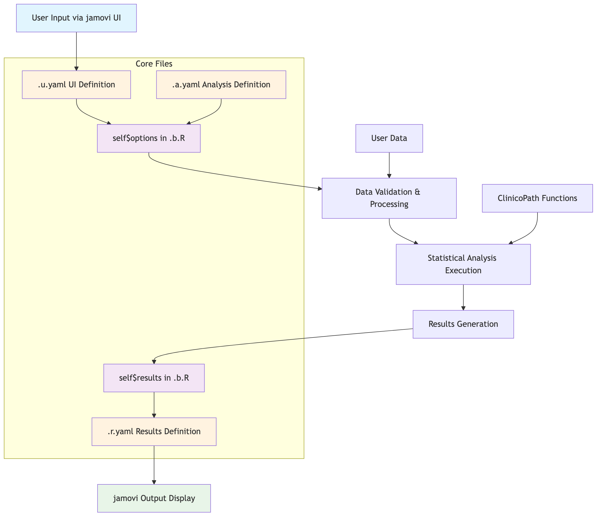

# ClinicoPath Module Development - Mermaid Diagrams

This directory contains mermaid diagram source files for the ClinicoPath module development guide. These can be rendered using any mermaid-compatible tool.

## Diagram Files and Purposes

### 1. **01-overall-data-flow.mmd**
- **Type**: Flowchart (graph TD)
- **Purpose**: Shows the complete data flow from user input through jamovi UI to final output
- **Key Components**: User input → .u.yaml → self$options → processing → self$results → .r.yaml → output
- **Usage**: High-level overview for new developers

### 2. **02-jamovi-4file-architecture.mmd**
- **Type**: Flowchart (graph LR)
- **Purpose**: Illustrates the relationship between the 4 jamovi file types and data flow
- **Key Components**: UI layer, Configuration layer, Processing layer, Output layer
- **Usage**: Understanding jamovi's architectural pattern

### 3. **03-component-interaction-sequence.mmd**
- **Type**: Sequence Diagram
- **Purpose**: Shows real-time interaction between jamovi components
- **Key Components**: User → .u.yaml → .a.yaml → .b.R → .r.yaml → Output
- **Usage**: Understanding execution flow and timing

### 4. **04-stagemigration-data-processing.mmd**
- **Type**: Complex Flowchart (flowchart TD)
- **Purpose**: Detailed data processing flow for stagemigration analysis
- **Key Components**: Input processing → Configuration → Analysis engine → Results generation
- **Usage**: Understanding complex ClinicoPath analysis workflows

### 5. **05-stagemigration-component-flow.mmd**
- **Type**: Complex Flowchart (graph TB)
- **Purpose**: Shows specific stagemigration component interactions
- **Key Components**: .a.yaml options → self$options → .b.R methods → self$results → .r.yaml
- **Usage**: Concrete example of jamovi component interaction

### 6. **06-stagemigration-detailed-interaction.mmd**
- **Type**: Sequence Diagram
- **Purpose**: Detailed sequence showing stagemigration execution with real code examples
- **Key Components**: User interactions → Options → Methods → Results → Display
- **Usage**: Understanding specific ClinicoPath implementation patterns

### 7. **07-a-yaml-options-flow.mmd**
- **Type**: Flowchart (graph LR)
- **Purpose**: Shows how .a.yaml definitions map to self$options access
- **Key Components**: YAML configuration → Compiled options → Implementation usage → UI elements
- **Usage**: Understanding option definition and access patterns

### 8. **08-option-type-decision-tree.mmd**
- **Type**: Decision Tree Flowchart
- **Purpose**: Decision guide for choosing appropriate .a.yaml option types
- **Key Components**: Input type decisions → Specific type choices → ClinicoPath examples
- **Usage**: Practical guide for developers adding new options

### 9. **09-results-yaml-mapping.mmd**
- **Type**: Complex Flowchart (graph TB)
- **Purpose**: Shows how self$results population maps to .r.yaml definitions
- **Key Components**: .r.yaml structure → .b.R population → jamovi display → Conditional logic
- **Usage**: Understanding results definition and population

### 10. **10-results-organization-pattern.mmd**
- **Type**: Flowchart (flowchart LR)
- **Purpose**: Illustrates results hierarchy and organization patterns
- **Key Components**: Results hierarchy → stagemigration examples → Population patterns
- **Usage**: Best practices for organizing analysis results

## How to Render These Diagrams

### Online Tools (Recommended)
1. **Mermaid Live Editor**: https://mermaid.live
   - Copy/paste the .mmd file content
   - Export as PNG, SVG, or PDF
   - Best quality and feature support

2. **GitHub/GitLab**: 
   - View .mmd files directly in repository
   - Native rendering support

### Local Tools
1. **Mermaid CLI**:
   ```bash
   npm install -g @mermaid-js/mermaid-cli
   mmdc -i diagram.mmd -o diagram.png
   ```

2. **VS Code Extension**: 
   - Install "Mermaid Preview" extension
   - Preview .mmd files directly

3. **RStudio/R**:
   ```r
   DiagrammeR::mermaid(readLines("diagram.mmd"))
   ```

## Suggested Screenshot Settings

For consistent documentation:
- **Format**: PNG with transparent background
- **Size**: 1200px wide (maintain aspect ratio)
- **Quality**: High resolution for readability
- **Theme**: Default mermaid theme or light theme for consistency

## Integration with Vignette

After taking screenshots, place them in `vignettes/images/` folder and reference in the R Markdown vignette like:

```markdown

```

Or for more control:
```markdown

```

## File Naming Convention

- **Prefix**: 2-digit number for logical ordering
- **Name**: Descriptive hyphenated name
- **Extension**: `.mmd` for mermaid source files
- **Screenshots**: Same name but `.png` extension in `images/` folder

## Notes for Developers

- All diagrams use ClinicoPath-specific examples (stagemigration, survival, etc.)
- Color coding is consistent across diagrams:
  - Blue (#e1f5fe, #e3f2fd): User interface elements
  - Orange (#fff3e0): Configuration/YAML files
  - Purple (#f3e5f5): Processing/R code
  - Green (#e8f5e8): Output/Results
  - Pink (#ffebee): Data flow objects
- Complex diagrams may need simplification for some rendering engines
- Sequence diagrams show temporal flow, flowcharts show logical relationships