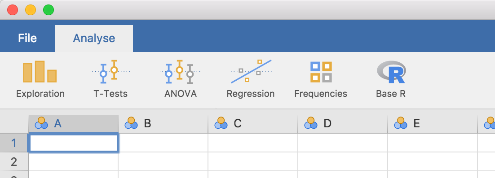

Before we begin, analyses in jamovi are written in the [R programming language](https://www.r-project.org/). This tutorial assumes you have some knowledge of  R, and ideally some experience in writing R packages.

That out of the way, let's begin!

Development of modules for jamovi requires the `jmvtools` package. In this tutorial we will:

1. install `jmvtools`
2. ensure that `jmvtools` can find jamovi
3. build and install a jamovi module from GitHub

## Install `jmvtools`

`jmvtools` is available from the jamovi repo, and can be installed in R with:

```{r eval=FALSE }
install.packages('jmvtools', repos=c('https://repo.jamovi.org', 'https://cran.r-project.org'))
```

## Check `jmvtools` can find jamovi

Now you have `jmvtools` installed, we can check whether it can locate your jamovi installation:

```{r eval=FALSE }
jmvtools::check()
```

`jmvtools` searches for jamovi in what might be considered 'usual places`, such as:

- `/Applications`
- `/usr/lib/jamovi`
- `C:\Program Files`

If `jmvtools` can't find it, you can specify the path in the call to `check()`:

```{r eval=FALSE }
jmvtools::check(home='C:\\Users\\jonathon\\Documents\\jamovi')
```

(you should substitute in your own path, unless your username *is* jonathon, and you've got jamovi in your documents folder).

If you have to specify this path, you can set this for the remainder of the session with `options()`:

```{r eval=FALSE }
options(jamovi_home='C:\\Users\\jonathon\\Documents\\jamovi')
```

## Install a Module

Now we have `jmvtools` installed and working, we can use it to build and install a module. If you haven't already, start up jamovi. Next we'll download a module from GitHub, build and install it. we'll use the [Base R](https://github.com/jamovi/jmvbaseR) module -- you can download it using the direct link [here](https://github.com/jamovi/jmvbaseR/archive/master.zip).

Unzip the source directory and open the project file `jmvbaseR.Rproj` in RStudio (or just set your working directory to the source's directory). Now we can call the `install()` function:

```{r eval=FALSE }
jmvtools::install()   # not to be mistaken for devtools::install()
```

This will build the module, and install it into jamovi.

If you turn now to your open jamovi window, you'll see a new 'Base R' menu has appeared on the ribbon, with a set of new analyses. The ability to install and update jamovi analyses from R turns out to be pretty nifty, because as we'll see in the next section, we can make changes to an analysis, run `jmvtools::install()` again, and immediately see those changes reflected in jamovi. This makes developing and testing jamovi analyses a breeze!

{ width=551px }


Next: [Creating a Module](tuts0102-creating-a-module.html)
