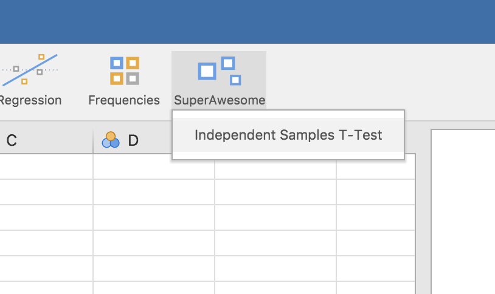
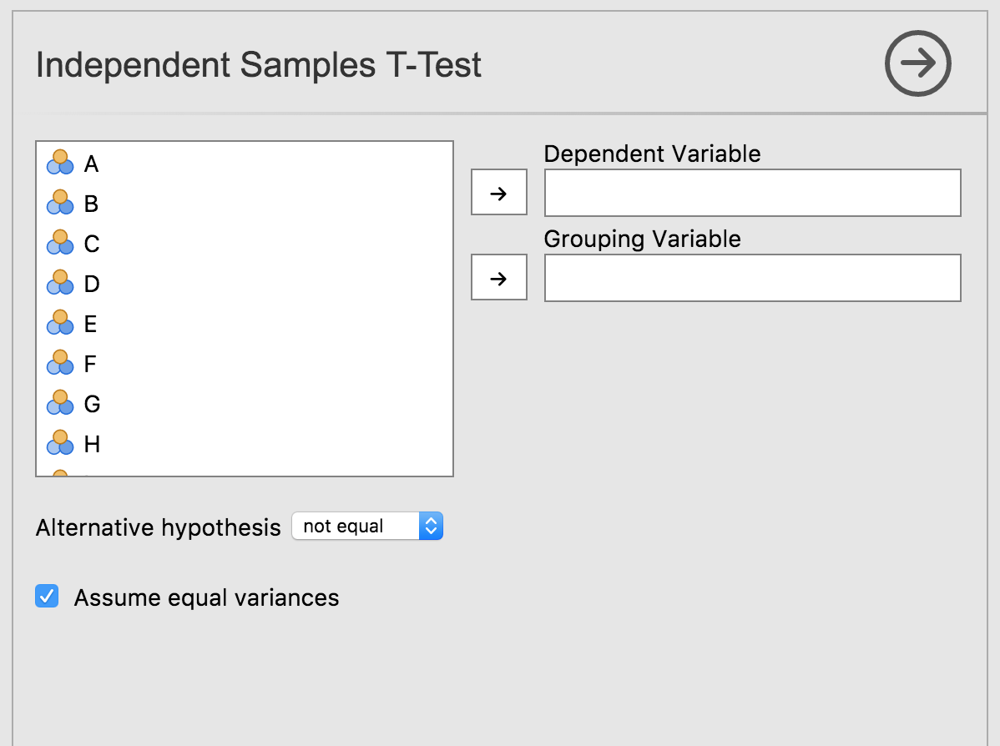

## T-Test

In this section, having previously [created a module](tuts0102-creating-a-module.html), we are going to add a t-test analysis to it.

An *independent samples t-test* is typically used to determine whether two groups differ on some variable. For example, you may be interested in whether children from one neighbourhood are a different height than children from another neighbourhood. In this case, a data set would have one row for each child - one column would contain their heights, the other column would contain which neighbourhood they are from.

For those familiar with the `t.test` function built into R, if the columns were `height` and `neighbourhood`, the test could be run:

```{r eval=FALSE }
t.test(height ~ neighbourhood, data=data)
```

In this next section, we are going to create a t-test jamovi analysis which makes use of this function.

## Creating an Analysis

The easiest way to begin an analysis for a jamovi module is to use the `addAnalysis()` function from the `jmvtools` package. First we'll set the working directory to the `SuperAwesome` directory (created by `jmvtools::create()` in the previous section), and then call `addAnalysis()`

```{r eval=FALSE }
setwd('SuperAwesome')
jmvtools::addAnalysis(name='ttest', title='Independent Samples T-Test')
```
## Anatomy of an Analysis

If we now look at the `SuperAwesome` module's source tree, we have:

```
SuperAwesome/
├── DESCRIPTION
├── NAMESPACE
├── jamovi/
|   ├── ttest.a.yaml
|   ├── ttest.r.yaml
|   ├── ttest.u.yaml
|   └── 0000.yaml
└── R/
    ├── ttest.h.R
    └── ttest.b.R
```

At this point I'm a little embarrassed to say that there are **5** files per analysis. This structure does make things a lot more manageable, so although it may seem excessive at first, there's a good rationale behind it. Just bear with me, it's not as overwhelming as it seems.

file          | contains                               | api |
------------- | ---------------------------------------| --- |
ttest.a.yaml  | The *analysis definition* contains all the meta information about the analysis, describes the arguments and ui options it receives, etc. We'll cover this in the tutorial next. | [API](api_analysis-definition.html)
ttest.r.yaml  | The *results definition* contains all the information about the way the results for the analysis are displayed. | [API](api_results-definition.html)
ttest.u.yaml  | The *ui definition* is automatically generated from the `.a.yaml` file. For many analyses this will produce a good result, and won't need further editing. | [API](api_ui-definition.html)
ttest.h.R     | The *header file* is automatically generated from the `.a.yaml` and `.r.yaml` files above, and makes writing your analysis a lot easier. You don't ever need to look at this file, and you certainly shouldn't edit it. |
ttest.b.R     | The *analysis implementation* is where you'll write your analysis, and where you'll spend most of your time when developing jamovi analyses. As we'll see, this is an empty template waiting for an implementation. |

## The Analysis Definition

First up, we'll look at the *analysis definition* in the `ttest.a.yaml` file. yaml is a simple, easy to read text format for structured data. If you're new to yaml, you can read more about the format [here](http://yaml.org/spec/1.2/spec.html), but that probably won't be necessary. It's intuitive and readable, and you'll probably have no trouble picking it up.

`jmvtools::addAnalysis()` creates a default `.a.yaml` file with a handful of basic options. Happily for this tutorial, these happen to correspond to the options that a t-test requires. Our generated `ttest.a.yaml` file is as follows:

```{yaml }
---
name:  ttest
title: Independent Samples T-Test
jas:     "1.1"
version: "1.0.0"

options:
    - name: data
      type: Data

    - name: dep
      title: Dependent Variable
      type: Variable

    - name: group
      title: Grouping Variable
      type: Variable

    - name: alt
      title: Alternative hypothesis
      type: List
      options:
        - name: notEqual
          title: Not equal
        - name: oneGreater
          title: One greater
        - name: twoGreater
          title: Two greater
      default: notEqual

    - name: varEq
      title: Assume equal variances
      type: Bool
      default: true
```

At the top of the file is information about the analysis:

```{yaml }
---
name:  ttest
title: Independent Samples T-Test
jas:     "1.1"
version: "1.0.0"
...
```

The name is a unique identifier for the analysis, but it also corresponds to the name of the R function which will be made available from the package. As such, the usual constraints on function names apply: it must begin with a letter, and can only be made up of letters and numbers (jamovi disallows analysis names with dots in them).

The title of the analysis is how the analysis appears in menus, help text, and in the results. Next is the `jas` or 'jamovi analysis spec'; you should just leave this at '1.1'. Next, we have the analysis version. Each analysis is versioned in jamovi, and you should make use of [semantic versioning](http://semver.org/) (but let's not worry about that for now).

The options come next; `data`, `dep`, `group`, `alt` and `varEq`. When used as an R package, these options correspond to the arguments passed to the analysis R function. In this case they will be:

```{r eval=FALSE }
ttestIS(data, dep, group, alt='not equal', varEq=FALSE)
```

(If you peek inside `ttest.h.R`, you'll find this exact function has been generated.)

When used in jamovi, these options correspond to the UI options for the analysis. Let's look at that now. Install the module we've just created and open up jamovi (or open up jamovi first, then install the module --- the order doesn't matter):

```{r eval=FALSE }
jmvtools::install()

```

(Note that if your module has additional dependencies, these will be installed by `jmvtools::install()` at this stage as well. You can read more about additional dependencies in [Additional Notes](tuts0108-additional-notes.html) at the end of this tutorial.)

The `SuperAwesome` menu will now be available, and will contain `Independent Samples T-Test`.

{ width=407px }

Selecting this analysis will bring up the UI:

{ width=400px }

We can see how the UI elements created, correspond to the analyses' options. Revisiting the `dep` and `group` options from `ttestis.a.yaml`:

```{yaml }
...
    - name: dep
      title: Dependent Variable
      type: Variable

    - name: group
      title: Grouping Variable
      type: Variable
...
```

We see they are of type `Variable`. This means they require the user to provide a column from the data set. As can be seen in the UI, they are represented as 'drop targets', where columns from the data set can be assigned through drag and drop.

Turning to the option `alt`:

```{yaml }
...
    - name: alt
      title: Alternative hypothesis
      type: List
      options:
        - name: notEqual
          title: Not equal
        - name: oneGreater
          title: One greater
        - name: twoGreater
          title: Two greater
      default: notEqual
...
```

`alt` is of type list, which has been turned into a drop down list, allowing the user to choose between the options.

Finally, looking at `varEq`:

```{yaml }
...
    - name: varEq
      title: Assume equal variances
      type: Bool
      default: true
```

We see that options of type `Bool` are represented as checkboxes.

There are a number of different option types. A more comprehensive description of each of them, and their properties is available in the [API](api_analysis-definition.html).

Of course, our analysis doesn't actually do anything yet -- we haven't written any R code.

[Implementing an Analysis](tuts0104-implementing-an-analysis.html)
