# Enhanced ROC Analysis for Clinical Biomarker Evaluation

> **Note:** The
> [`timeroc()`](https://www.serdarbalci.com/ClinicoPathJamoviModule/reference/timeroc.md)
> function is designed for use within **jamovi’s GUI**. The code
> examples below show the R syntax for reference. To run interactively,
> use
> [`devtools::load_all()`](https://devtools.r-lib.org/reference/load_all.html)
> and call the R6 class directly:
> `timerocClass$new(options = timerocOptions$new(...), data = mydata)`.

## Enhanced ROC Analysis

### 1. Overview

The **Enhanced ROC Analysis** module (`timeroc`) evaluates how well
continuous biomarkers predict clinical outcomes. It provides a dual-mode
architecture:

- **Time-Dependent ROC** (via `timeROC` package): Evaluates marker
  performance at specific timepoints using cumulative/dynamic ROC curves
  with Inverse Probability of Censoring Weights (IPCW).
- **General Binary ROC** (via `pROC` package): Standard diagnostic ROC
  for binary classification without a time component.

Key capabilities:

- IPCW weighting methods: Kaplan-Meier (marginal), Cox model, Aalen
  additive
- Asymptotic confidence intervals via influence functions
- Optimal cutoff calculation using Youden index
- Multi-marker comparison with DeLong, Bootstrap, or Venkatraman tests
- Clinical interpretation with severity-graded notices

#### Test Datasets

| Dataset | Description | N | Variables | Primary Use |
|----|----|----|----|----|
| `timeroc_test` | Breast cancer recurrence | 200 | PatientID, FollowUpMonths, Recurrence (0/1), RecurrenceFactor, Age, Stage, Ki67, GeneScore, NoiseMarker | Primary testing |
| `timeroc_cancer_biomarker` | General cancer biomarkers | varies | Multiple continuous markers | Extended testing |
| `timeroc_multi_biomarker` | Multi-marker scenarios | varies | Multiple markers for comparison | ROC comparison |
| `timeroc_edge_cases` | Edge case scenarios | varies | Designed extremes | Edge case testing |

------------------------------------------------------------------------

### 2. Basic Time-Dependent ROC

The default mode evaluates how a marker discriminates events from
non-events at specific follow-up timepoints. The timeROC package
computes cumulative/dynamic AUC with IPCW correction for censoring.

``` r

data("timeroc_test")

timeroc(
  data = timeroc_test,
  elapsedtime = "FollowUpMonths",
  outcome = "Recurrence",
  outcomeLevel = "1",
  marker = "Ki67",
  analysisType = "timedep",
  timepoints = "12, 36, 60",
  method = "marginal",
  bootstrapCI = FALSE,
  plotROC = TRUE,
  plotAUC = TRUE,
  showOptimalCutoff = TRUE,
  showMarkerStats = TRUE,
  timetypeoutput = "months"
)
#> 
#>  TIME-DEPENDENT ROC ANALYSIS
#> 
#>  <div style='margin: 10px 0;'><div style='background-color: #eff6ff;
#>  border-left: 4px solid #93c5fd; padding: 12px; margin: 8px 0;
#>  border-radius: 4px;'><strong style='color: #2563eb;'>Analysis Complete
#>  <span style='color: #374151;'>Time-dependent ROC analysis completed.
#>  190 observations, 127 events (66.8%), weighting: marginal.
#> 
#>  Time-Dependent ROC Analysis Results
#> 
#>  Marker Variable: Ki67
#> 
#>  Analysis Method: Cumulative/Dynamic (Kaplan-Meier weighting)
#> 
#>  Sample Size: 190 observations, 127 events (66.8%)
#> 
#>  AUC Interpretation by Timepoint:
#> 
#>  At 12 months:
#> 
#>  AUC = 0.767 (95% CI: NA - NA)
#> 
#>  Performance: fair (0.70-0.79) (CI not available: enable Confidence
#>  Intervals option)
#> 
#>  At 36 months:
#> 
#>  AUC = 0.765 (95% CI: NA - NA)
#> 
#>  Performance: fair (0.70-0.79) (CI not available: enable Confidence
#>  Intervals option)
#> 
#>  At 60 months:
#> 
#>  AUC = 0.740 (95% CI: NA - NA)
#> 
#>  Performance: fair (0.70-0.79) (CI not available: enable Confidence
#>  Intervals option)
#> 
#>  Area Under ROC Curve (AUC)                                        
#>  ───────────────────────────────────────────────────────────────── 
#>    Timepoint    AUC          SE     95% CI Lower    95% CI Upper   
#>  ───────────────────────────────────────────────────────────────── 
#>           12    0.7670000    NaN             NaN             NaN   
#>           36    0.7650000    NaN             NaN             NaN   
#>           60    0.7400000    NaN             NaN             NaN   
#>  ───────────────────────────────────────────────────────────────── 
#> 
#> 
#>  Marker Variable Statistics 
#>  ────────────────────────── 
#>    Statistic     Value    
#>  ────────────────────────── 
#>    N             190      
#>    Mean          31.242   
#>    Median        30.45    
#>    SD            14.986   
#>    IQR           23.475   
#>    Min           1        
#>    Max           68.5     
#>    Events        127      
#>    Event Rate    66.8%    
#>  ────────────────────────── 
#> 
#> 
#>  Optimal Cutoff Values                                                         
#>  ───────────────────────────────────────────────────────────────────────────── 
#>    Timepoint    Optimal Cutoff    Sensitivity    Specificity    Youden Index   
#>  ───────────────────────────────────────────────────────────────────────────── 
#>  ───────────────────────────────────────────────────────────────────────────── 
#> 
#> 
#>  Clinical Interpretation
#> 
#> 
#> 
#>  Overall Performance:
#> 
#>  The Ki67 shows fair to good discriminative ability (mean AUC = 0.757).
#> 
#> 
#> 
#>  Time Trend:
#> 
#>  Performance shows a declining trend over time.
#> 
#> 
#> 
#>  Clinical Utility:
#> 
#> 
#>  Best Performance: At 12 months (AUC = 0.767)
#>  Threshold: AUC >= 0.70 is generally considered clinically useful
#>  Assessment: The marker shows clinically relevant predictive ability
#> 
#> 
#> 
#>  Method: This analysis uses Kaplan-Meier (marginal) weighting for
#>  censoring adjustment, appropriate when censoring is independent of
#>  marker values.
```


**What this produces:**

- AUC table with values at months 12, 36, and 60
- ROC curves for each timepoint (one curve per timepoint)
- AUC-over-time plot showing marker performance trajectory
- Marker descriptive statistics (N, mean, median, SD, IQR, range,
  events, event rate)
- Optimal cutoff table with Youden index for each timepoint
- Clinical interpretation text

------------------------------------------------------------------------

### 3. IPCW Weighting Methods

The `method` option controls how censoring is handled via Inverse
Probability of Censoring Weights. Three approaches are available:

#### 3a. Kaplan-Meier (Marginal) Weighting

The default. Assumes censoring is independent of the marker. Uses the
Kaplan-Meier estimator for censoring distribution.

``` r

timeroc(
  data = timeroc_test,
  elapsedtime = "FollowUpMonths",
  outcome = "Recurrence",
  outcomeLevel = "1",
  marker = "Ki67",
  analysisType = "timedep",
  method = "marginal",
  timepoints = "12, 36, 60",
  timetypeoutput = "months"
)
#> 
#>  TIME-DEPENDENT ROC ANALYSIS
#> 
#>  <div style='margin: 10px 0;'><div style='background-color: #eff6ff;
#>  border-left: 4px solid #93c5fd; padding: 12px; margin: 8px 0;
#>  border-radius: 4px;'><strong style='color: #2563eb;'>Analysis Complete
#>  <span style='color: #374151;'>Time-dependent ROC analysis completed.
#>  190 observations, 127 events (66.8%), weighting: marginal.
#> 
#>  Time-Dependent ROC Analysis Results
#> 
#>  Marker Variable: Ki67
#> 
#>  Analysis Method: Cumulative/Dynamic (Kaplan-Meier weighting)
#> 
#>  Sample Size: 190 observations, 127 events (66.8%)
#> 
#>  AUC Interpretation by Timepoint:
#> 
#>  At 12 months:
#> 
#>  AUC = 0.767 (95% CI: NA - NA)
#> 
#>  Performance: fair (0.70-0.79) (CI not available: enable Confidence
#>  Intervals option)
#> 
#>  At 36 months:
#> 
#>  AUC = 0.765 (95% CI: NA - NA)
#> 
#>  Performance: fair (0.70-0.79) (CI not available: enable Confidence
#>  Intervals option)
#> 
#>  At 60 months:
#> 
#>  AUC = 0.740 (95% CI: NA - NA)
#> 
#>  Performance: fair (0.70-0.79) (CI not available: enable Confidence
#>  Intervals option)
#> 
#>  Area Under ROC Curve (AUC)                                        
#>  ───────────────────────────────────────────────────────────────── 
#>    Timepoint    AUC          SE     95% CI Lower    95% CI Upper   
#>  ───────────────────────────────────────────────────────────────── 
#>           12    0.7670000    NaN             NaN             NaN   
#>           36    0.7650000    NaN             NaN             NaN   
#>           60    0.7400000    NaN             NaN             NaN   
#>  ───────────────────────────────────────────────────────────────── 
#> 
#> 
#>  Marker Variable Statistics 
#>  ────────────────────────── 
#>    Statistic     Value    
#>  ────────────────────────── 
#>    N             190      
#>    Mean          31.242   
#>    Median        30.45    
#>    SD            14.986   
#>    IQR           23.475   
#>    Min           1        
#>    Max           68.5     
#>    Events        127      
#>    Event Rate    66.8%    
#>  ────────────────────────── 
#> 
#> 
#>  Optimal Cutoff Values                                                         
#>  ───────────────────────────────────────────────────────────────────────────── 
#>    Timepoint    Optimal Cutoff    Sensitivity    Specificity    Youden Index   
#>  ───────────────────────────────────────────────────────────────────────────── 
#>  ───────────────────────────────────────────────────────────────────────────── 
#> 
#> 
#>  Clinical Interpretation
#> 
#> 
#> 
#>  Overall Performance:
#> 
#>  The Ki67 shows fair to good discriminative ability (mean AUC = 0.757).
#> 
#> 
#> 
#>  Time Trend:
#> 
#>  Performance shows a declining trend over time.
#> 
#> 
#> 
#>  Clinical Utility:
#> 
#> 
#>  Best Performance: At 12 months (AUC = 0.767)
#>  Threshold: AUC >= 0.70 is generally considered clinically useful
#>  Assessment: The marker shows clinically relevant predictive ability
#> 
#> 
#> 
#>  Method: This analysis uses Kaplan-Meier (marginal) weighting for
#>  censoring adjustment, appropriate when censoring is independent of
#>  marker values.
```

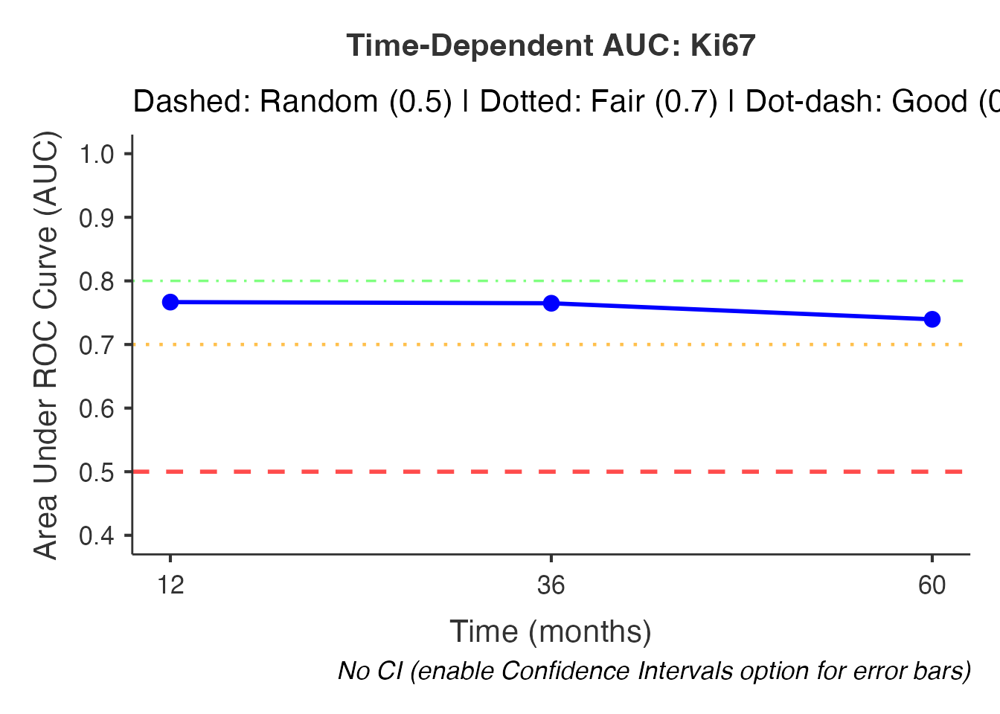

#### 3b. Cox Model Weighting

Uses a Cox proportional hazards model for censoring. Appropriate when
censoring may depend on covariates (informative censoring).

``` r

timeroc(
  data = timeroc_test,
  elapsedtime = "FollowUpMonths",
  outcome = "Recurrence",
  outcomeLevel = "1",
  marker = "Ki67",
  analysisType = "timedep",
  method = "cox",
  timepoints = "12, 36, 60",
  timetypeoutput = "months"
)
#> 
#>  TIME-DEPENDENT ROC ANALYSIS
#> 
#>  <div style='margin: 10px 0;'><div style='background-color: #eff6ff;
#>  border-left: 4px solid #93c5fd; padding: 12px; margin: 8px 0;
#>  border-radius: 4px;'><strong style='color: #2563eb;'>Analysis Complete
#>  <span style='color: #374151;'>Time-dependent ROC analysis completed.
#>  190 observations, 127 events (66.8%), weighting: cox.
#> 
#>  Time-Dependent ROC Analysis Results
#> 
#>  Marker Variable: Ki67
#> 
#>  Analysis Method: Cumulative/Dynamic (Cox model weighting)
#> 
#>  Sample Size: 190 observations, 127 events (66.8%)
#> 
#>  AUC Interpretation by Timepoint:
#> 
#>  At 12 months:
#> 
#>  AUC = 0.767 (95% CI: NA - NA)
#> 
#>  Performance: fair (0.70-0.79) (CI not available: enable Confidence
#>  Intervals option)
#> 
#>  At 36 months:
#> 
#>  AUC = 0.770 (95% CI: NA - NA)
#> 
#>  Performance: fair (0.70-0.79) (CI not available: enable Confidence
#>  Intervals option)
#> 
#>  At 60 months:
#> 
#>  AUC = 0.755 (95% CI: NA - NA)
#> 
#>  Performance: fair (0.70-0.79) (CI not available: enable Confidence
#>  Intervals option)
#> 
#>  Area Under ROC Curve (AUC)                                        
#>  ───────────────────────────────────────────────────────────────── 
#>    Timepoint    AUC          SE     95% CI Lower    95% CI Upper   
#>  ───────────────────────────────────────────────────────────────── 
#>           12    0.7670000    NaN             NaN             NaN   
#>           36    0.7700000    NaN             NaN             NaN   
#>           60    0.7550000    NaN             NaN             NaN   
#>  ───────────────────────────────────────────────────────────────── 
#> 
#> 
#>  Marker Variable Statistics 
#>  ────────────────────────── 
#>    Statistic     Value    
#>  ────────────────────────── 
#>    N             190      
#>    Mean          31.242   
#>    Median        30.45    
#>    SD            14.986   
#>    IQR           23.475   
#>    Min           1        
#>    Max           68.5     
#>    Events        127      
#>    Event Rate    66.8%    
#>  ────────────────────────── 
#> 
#> 
#>  Optimal Cutoff Values                                                         
#>  ───────────────────────────────────────────────────────────────────────────── 
#>    Timepoint    Optimal Cutoff    Sensitivity    Specificity    Youden Index   
#>  ───────────────────────────────────────────────────────────────────────────── 
#>  ───────────────────────────────────────────────────────────────────────────── 
#> 
#> 
#>  Clinical Interpretation
#> 
#> 
#> 
#>  Overall Performance:
#> 
#>  The Ki67 shows fair to good discriminative ability (mean AUC = 0.764).
#> 
#> 
#> 
#>  Time Trend:
#> 
#>  Performance shows a declining trend over time.
#> 
#> 
#> 
#>  Clinical Utility:
#> 
#> 
#>  Best Performance: At 36 months (AUC = 0.770)
#>  Threshold: AUC >= 0.70 is generally considered clinically useful
#>  Assessment: The marker shows clinically relevant predictive ability
#> 
#> 
#> 
#>  Method: This analysis uses Cox model-based IPCW weighting, which
#>  adjusts for covariates that may affect censoring.
```

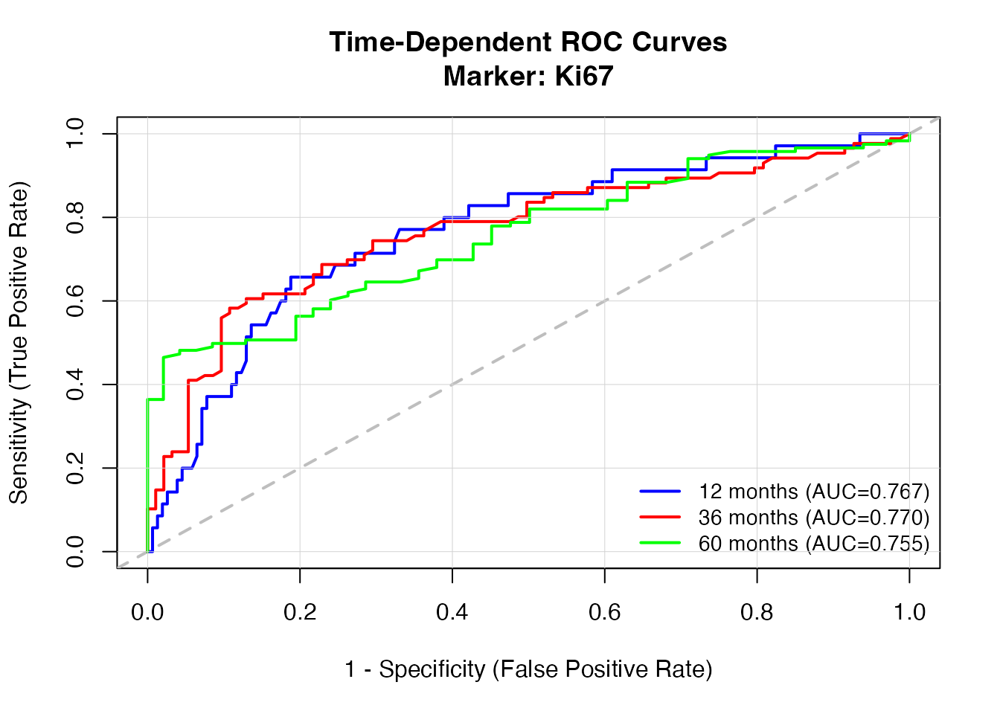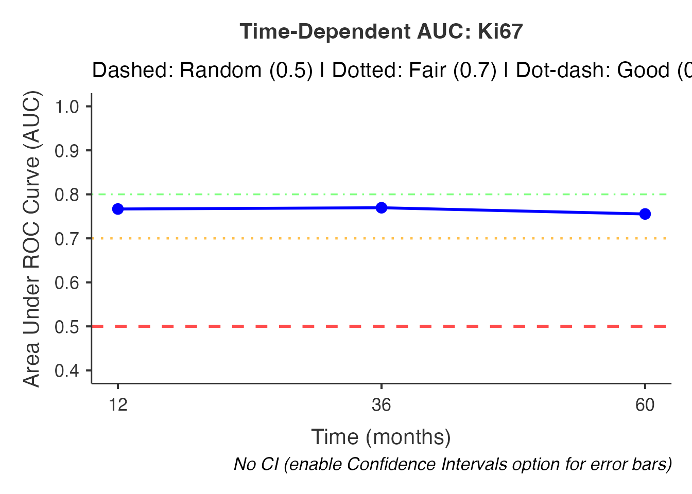

#### 3c. Aalen Additive Model Weighting

Uses the Aalen additive hazards model. Provides flexible
non-proportional adjustment for censoring.

``` r

timeroc(
  data = timeroc_test,
  elapsedtime = "FollowUpMonths",
  outcome = "Recurrence",
  outcomeLevel = "1",
  marker = "Ki67",
  analysisType = "timedep",
  method = "aalen",
  timepoints = "12, 36, 60",
  timetypeoutput = "months"
)
#> 
#>  TIME-DEPENDENT ROC ANALYSIS
#> 
#>  <div style='margin: 10px 0;'><div style='background-color: #eff6ff;
#>  border-left: 4px solid #93c5fd; padding: 12px; margin: 8px 0;
#>  border-radius: 4px;'><strong style='color: #2563eb;'>Analysis Complete
#>  <span style='color: #374151;'>Time-dependent ROC analysis completed.
#>  190 observations, 127 events (66.8%), weighting: aalen.
#> 
#>  Time-Dependent ROC Analysis Results
#> 
#>  Marker Variable: Ki67
#> 
#>  Analysis Method: Cumulative/Dynamic (Aalen model weighting)
#> 
#>  Sample Size: 190 observations, 127 events (66.8%)
#> 
#>  AUC Interpretation by Timepoint:
#> 
#>  At 12 months:
#> 
#>  AUC = 0.767 (95% CI: NA - NA)
#> 
#>  Performance: fair (0.70-0.79) (CI not available: enable Confidence
#>  Intervals option)
#> 
#>  At 36 months:
#> 
#>  AUC = 0.773 (95% CI: NA - NA)
#> 
#>  Performance: fair (0.70-0.79) (CI not available: enable Confidence
#>  Intervals option)
#> 
#>  At 60 months:
#> 
#>  AUC = 0.763 (95% CI: NA - NA)
#> 
#>  Performance: fair (0.70-0.79) (CI not available: enable Confidence
#>  Intervals option)
#> 
#>  Area Under ROC Curve (AUC)                                        
#>  ───────────────────────────────────────────────────────────────── 
#>    Timepoint    AUC          SE     95% CI Lower    95% CI Upper   
#>  ───────────────────────────────────────────────────────────────── 
#>           12    0.7670000    NaN             NaN             NaN   
#>           36    0.7730000    NaN             NaN             NaN   
#>           60    0.7630000    NaN             NaN             NaN   
#>  ───────────────────────────────────────────────────────────────── 
#> 
#> 
#>  Marker Variable Statistics 
#>  ────────────────────────── 
#>    Statistic     Value    
#>  ────────────────────────── 
#>    N             190      
#>    Mean          31.242   
#>    Median        30.45    
#>    SD            14.986   
#>    IQR           23.475   
#>    Min           1        
#>    Max           68.5     
#>    Events        127      
#>    Event Rate    66.8%    
#>  ────────────────────────── 
#> 
#> 
#>  Optimal Cutoff Values                                                         
#>  ───────────────────────────────────────────────────────────────────────────── 
#>    Timepoint    Optimal Cutoff    Sensitivity    Specificity    Youden Index   
#>  ───────────────────────────────────────────────────────────────────────────── 
#>  ───────────────────────────────────────────────────────────────────────────── 
#> 
#> 
#>  Clinical Interpretation
#> 
#> 
#> 
#>  Overall Performance:
#> 
#>  The Ki67 shows fair to good discriminative ability (mean AUC = 0.768).
#> 
#> 
#> 
#>  Time Trend:
#> 
#>  Performance shows a declining trend over time.
#> 
#> 
#> 
#>  Clinical Utility:
#> 
#> 
#>  Best Performance: At 36 months (AUC = 0.773)
#>  Threshold: AUC >= 0.70 is generally considered clinically useful
#>  Assessment: The marker shows clinically relevant predictive ability
#> 
#> 
#> 
#>  Method: This analysis uses Aalen additive model for IPCW weighting,
#>  providing flexible adjustment for censoring.
```

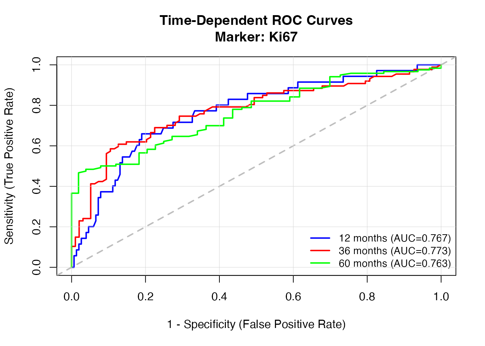

------------------------------------------------------------------------

### 4. Confidence Intervals

Enable asymptotic confidence intervals using influence function-based
variance estimation (not bootstrap, despite the option name). This
computes the variance of the AUC estimator analytically and provides 95%
CIs.

``` r

timeroc(
  data = timeroc_test,
  elapsedtime = "FollowUpMonths",
  outcome = "Recurrence",
  outcomeLevel = "1",
  marker = "Ki67",
  analysisType = "timedep",
  timepoints = "12, 36, 60",
  method = "marginal",
  bootstrapCI = TRUE,
  timetypeoutput = "months",
  plotAUC = TRUE
)
#> 
#>  TIME-DEPENDENT ROC ANALYSIS
#> 
#>  <div style='margin: 10px 0;'><div style='background-color: #eff6ff;
#>  border-left: 4px solid #93c5fd; padding: 12px; margin: 8px 0;
#>  border-radius: 4px;'><strong style='color: #2563eb;'>Analysis Complete
#>  <span style='color: #374151;'>Time-dependent ROC analysis completed.
#>  190 observations, 127 events (66.8%), weighting: marginal.
#> 
#>  Time-Dependent ROC Analysis Results
#> 
#>  Marker Variable: Ki67
#> 
#>  Analysis Method: Cumulative/Dynamic (Kaplan-Meier weighting)
#> 
#>  Sample Size: 190 observations, 127 events (66.8%)
#> 
#>  Confidence Intervals: Asymptotic (influence function-based)
#> 
#>  AUC Interpretation by Timepoint:
#> 
#>  At 12 months:
#> 
#>  AUC = 0.767 (95% CI: 0.678 - 0.855)
#> 
#>  Performance: fair (0.70-0.79) (p = 0.000, significantly better than
#>  chance)
#> 
#>  At 36 months:
#> 
#>  AUC = 0.765 (95% CI: 0.693 - 0.837)
#> 
#>  Performance: fair (0.70-0.79) (p = 0.000, significantly better than
#>  chance)
#> 
#>  At 60 months:
#> 
#>  AUC = 0.740 (95% CI: 0.660 - 0.819)
#> 
#>  Performance: fair (0.70-0.79) (p = 0.000, significantly better than
#>  chance)
#> 
#>  Area Under ROC Curve (AUC)                                               
#>  ──────────────────────────────────────────────────────────────────────── 
#>    Timepoint    AUC          SE            95% CI Lower    95% CI Upper   
#>  ──────────────────────────────────────────────────────────────────────── 
#>           12    0.7670000    0.04500000       0.6780000       0.8550000   
#>           36    0.7650000    0.03700000       0.6920000       0.8370000   
#>           60    0.7400000    0.04100000       0.6590000       0.8200000   
#>  ──────────────────────────────────────────────────────────────────────── 
#> 
#> 
#>  Marker Variable Statistics 
#>  ────────────────────────── 
#>    Statistic     Value    
#>  ────────────────────────── 
#>    N             190      
#>    Mean          31.242   
#>    Median        30.45    
#>    SD            14.986   
#>    IQR           23.475   
#>    Min           1        
#>    Max           68.5     
#>    Events        127      
#>    Event Rate    66.8%    
#>  ────────────────────────── 
#> 
#> 
#>  Optimal Cutoff Values                                                         
#>  ───────────────────────────────────────────────────────────────────────────── 
#>    Timepoint    Optimal Cutoff    Sensitivity    Specificity    Youden Index   
#>  ───────────────────────────────────────────────────────────────────────────── 
#>  ───────────────────────────────────────────────────────────────────────────── 
#> 
#> 
#>  Clinical Interpretation
#> 
#> 
#> 
#>  Overall Performance:
#> 
#>  The Ki67 shows fair to good discriminative ability (mean AUC = 0.757).
#> 
#> 
#> 
#>  Time Trend:
#> 
#>  Performance shows a declining trend over time.
#> 
#> 
#> 
#>  Clinical Utility:
#> 
#> 
#>  Best Performance: At 12 months (AUC = 0.767)
#>  Threshold: AUC >= 0.70 is generally considered clinically useful
#>  Assessment: The marker shows clinically relevant predictive ability
#> 
#> 
#> 
#>  Method: This analysis uses Kaplan-Meier (marginal) weighting for
#>  censoring adjustment, appropriate when censoring is independent of
#>  marker values.
```


**With CI enabled:**

- AUC table includes SE, 95% CI Lower, and 95% CI Upper columns
- AUC-over-time plot shows confidence ribbon
- Interpretation text includes p-values testing AUC against 0.5
- Model comparison (`compareBaseline`) becomes fully functional

------------------------------------------------------------------------

### 5. Binary ROC Analysis

Switch to general binary ROC (no time component needed) for standard
diagnostic evaluation. Uses the pROC package with `direction = "auto"`
to auto-detect whether higher or lower marker values indicate cases.

``` r

timeroc(
  data = timeroc_test,
  outcome = "Recurrence",
  outcomeLevel = "1",
  marker = "GeneScore",
  analysisType = "binary",
  plotROC = TRUE,
  youdenIndex = TRUE
)
#> 
#>  TIME-DEPENDENT ROC ANALYSIS
#> 
#>  <div style='margin: 10px 0;'><div style='background-color: #eff6ff;
#>  border-left: 4px solid #93c5fd; padding: 12px; margin: 8px 0;
#>  border-radius: 4px;'><strong style='color: #2563eb;'>Analysis Complete
#>  <span style='color: #374151;'>Binary ROC analysis completed. 194
#>  observations, 126 events (64.9% event rate).
#> 
#> character(0)
#> 
#>  Binary ROC Analysis Results                                                                                              
#>  ──────────────────────────────────────────────────────────────────────────────────────────────────────────────────────── 
#>    Marker       AUC          SE            95% CI Lower    95% CI Upper    Sensitivity    Specificity    Optimal Cutoff   
#>  ──────────────────────────────────────────────────────────────────────────────────────────────────────────────────────── 
#>    GeneScore    0.7570000    0.03400000       0.6900000       0.8240000      0.5160000      0.8820000          5.475000   
#>  ──────────────────────────────────────────────────────────────────────────────────────────────────────────────────────── 
#> 
#> 
#>  Diagnostic Performance Summary
#> 
#>  AUC: 0.757 (Fair discrimination)
#> 
#>  95% CI: [0.69, 0.824]
#> 
#> 
#> 
#>  Clinical Interpretation:
#> 
#> 
#>  An AUC of 0.757 indicates correct discrimination in 75.7% of randomly
#>  selected case-control pairs.
#>  The 95% CI suggests the true AUC lies between 0.69 and 0.824.
```

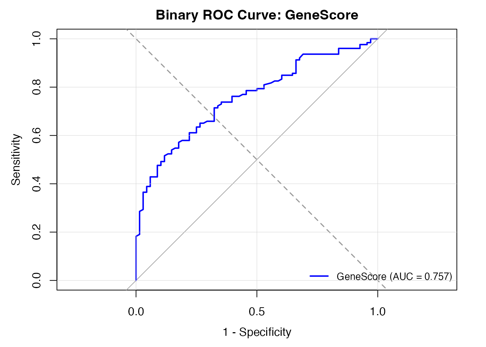

**What this produces:**

- Binary ROC table: AUC, SE, 95% CI, optimal cutoff, sensitivity,
  specificity
- Binary ROC curve plot with AUC in legend
- Diagnostic performance summary with clinical interpretation
- AUC classification: Excellent (\>=0.9), Good (0.8-0.9), Fair
  (0.7-0.8), Poor (0.6-0.7), No discrimination (\<0.6)

------------------------------------------------------------------------

### 6. Factor Outcome with Level Selection

When the outcome is a factor (e.g., “Recurrence” / “No Recurrence”),
select the event level using `outcomeLevel`. The function converts the
factor to binary 0/1 internally.

``` r

timeroc(
  data = timeroc_test,
  elapsedtime = "FollowUpMonths",
  outcome = "RecurrenceFactor",
  outcomeLevel = "Recurrence",
  marker = "Ki67",
  analysisType = "timedep",
  timepoints = "12, 36, 60",
  timetypeoutput = "months"
)
#> 
#>  TIME-DEPENDENT ROC ANALYSIS
#> 
#>  <div style='margin: 10px 0;'><div style='background-color: #eff6ff;
#>  border-left: 4px solid #93c5fd; padding: 12px; margin: 8px 0;
#>  border-radius: 4px;'><strong style='color: #2563eb;'>Analysis Complete
#>  <span style='color: #374151;'>Time-dependent ROC analysis completed.
#>  190 observations, 127 events (66.8%), weighting: marginal.
#> 
#>  Time-Dependent ROC Analysis Results
#> 
#>  Marker Variable: Ki67
#> 
#>  Analysis Method: Cumulative/Dynamic (Kaplan-Meier weighting)
#> 
#>  Sample Size: 190 observations, 127 events (66.8%)
#> 
#>  AUC Interpretation by Timepoint:
#> 
#>  At 12 months:
#> 
#>  AUC = 0.767 (95% CI: NA - NA)
#> 
#>  Performance: fair (0.70-0.79) (CI not available: enable Confidence
#>  Intervals option)
#> 
#>  At 36 months:
#> 
#>  AUC = 0.765 (95% CI: NA - NA)
#> 
#>  Performance: fair (0.70-0.79) (CI not available: enable Confidence
#>  Intervals option)
#> 
#>  At 60 months:
#> 
#>  AUC = 0.740 (95% CI: NA - NA)
#> 
#>  Performance: fair (0.70-0.79) (CI not available: enable Confidence
#>  Intervals option)
#> 
#>  Area Under ROC Curve (AUC)                                        
#>  ───────────────────────────────────────────────────────────────── 
#>    Timepoint    AUC          SE     95% CI Lower    95% CI Upper   
#>  ───────────────────────────────────────────────────────────────── 
#>           12    0.7670000    NaN             NaN             NaN   
#>           36    0.7650000    NaN             NaN             NaN   
#>           60    0.7400000    NaN             NaN             NaN   
#>  ───────────────────────────────────────────────────────────────── 
#> 
#> 
#>  Marker Variable Statistics 
#>  ────────────────────────── 
#>    Statistic     Value    
#>  ────────────────────────── 
#>    N             190      
#>    Mean          31.242   
#>    Median        30.45    
#>    SD            14.986   
#>    IQR           23.475   
#>    Min           1        
#>    Max           68.5     
#>    Events        127      
#>    Event Rate    66.8%    
#>  ────────────────────────── 
#> 
#> 
#>  Optimal Cutoff Values                                                         
#>  ───────────────────────────────────────────────────────────────────────────── 
#>    Timepoint    Optimal Cutoff    Sensitivity    Specificity    Youden Index   
#>  ───────────────────────────────────────────────────────────────────────────── 
#>  ───────────────────────────────────────────────────────────────────────────── 
#> 
#> 
#>  Clinical Interpretation
#> 
#> 
#> 
#>  Overall Performance:
#> 
#>  The Ki67 shows fair to good discriminative ability (mean AUC = 0.757).
#> 
#> 
#> 
#>  Time Trend:
#> 
#>  Performance shows a declining trend over time.
#> 
#> 
#> 
#>  Clinical Utility:
#> 
#> 
#>  Best Performance: At 12 months (AUC = 0.767)
#>  Threshold: AUC >= 0.70 is generally considered clinically useful
#>  Assessment: The marker shows clinically relevant predictive ability
#> 
#> 
#> 
#>  Method: This analysis uses Kaplan-Meier (marginal) weighting for
#>  censoring adjustment, appropriate when censoring is independent of
#>  marker values.
```

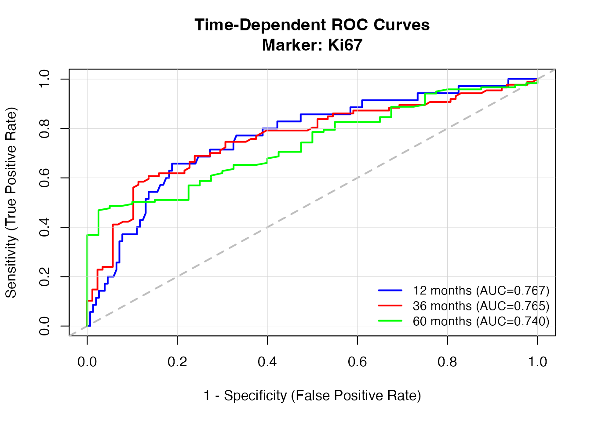

This also works in binary mode:

``` r

timeroc(
  data = timeroc_test,
  outcome = "RecurrenceFactor",
  outcomeLevel = "Recurrence",
  marker = "Ki67",
  analysisType = "binary",
  youdenIndex = TRUE
)
#> 
#>  TIME-DEPENDENT ROC ANALYSIS
#> 
#>  <div style='margin: 10px 0;'><div style='background-color: #eff6ff;
#>  border-left: 4px solid #93c5fd; padding: 12px; margin: 8px 0;
#>  border-radius: 4px;'><strong style='color: #2563eb;'>Analysis Complete
#>  <span style='color: #374151;'>Binary ROC analysis completed. 190
#>  observations, 127 events (66.8% event rate).
#> 
#> character(0)
#> 
#>  Binary ROC Analysis Results                                                                                           
#>  ───────────────────────────────────────────────────────────────────────────────────────────────────────────────────── 
#>    Marker    AUC          SE            95% CI Lower    95% CI Upper    Sensitivity    Specificity    Optimal Cutoff   
#>  ───────────────────────────────────────────────────────────────────────────────────────────────────────────────────── 
#>    Ki67      0.7600000    0.03500000       0.6910000       0.8300000      0.6540000      0.7940000          30.35000   
#>  ───────────────────────────────────────────────────────────────────────────────────────────────────────────────────── 
#> 
#> 
#>  Diagnostic Performance Summary
#> 
#>  AUC: 0.76 (Fair discrimination)
#> 
#>  95% CI: [0.691, 0.83]
#> 
#> 
#> 
#>  Clinical Interpretation:
#> 
#> 
#>  An AUC of 0.76 indicates correct discrimination in 76% of randomly
#>  selected case-control pairs.
#>  The 95% CI suggests the true AUC lies between 0.691 and 0.83.
```


------------------------------------------------------------------------

### 7. ROC Comparison (DeLong Test)

Compare multiple markers against the primary marker using the DeLong
test (default), bootstrap test, or Venkatraman test. This is available
in binary ROC mode only.

#### 7a. DeLong Test (Default)

``` r

timeroc(
  data = timeroc_test,
  outcome = "Recurrence",
  outcomeLevel = "1",
  marker = "Ki67",
  markers = c("GeneScore", "NoiseMarker"),
  analysisType = "binary",
  compareROCs = TRUE,
  rocComparison = "delong",
  plotROC = TRUE
)
#> Error:
#> ! Argument 'markers' requires a numeric variable ('GeneScore' is not valid)
```

**What this produces:**

- ROC comparison table: pairwise comparisons with test statistic,
  p-value, interpretation
- Multi-marker ROC plot: all curves overlaid with AUC in legend
- Individual entries in binary ROC table for the primary marker

#### 7b. Bootstrap Test

``` r

timeroc(
  data = timeroc_test,
  outcome = "Recurrence",
  outcomeLevel = "1",
  marker = "Ki67",
  markers = c("GeneScore"),
  analysisType = "binary",
  compareROCs = TRUE,
  rocComparison = "bootstrap"
)
#> Error:
#> ! Argument 'markers' requires a numeric variable ('GeneScore' is not valid)
```

#### 7c. Venkatraman Test

``` r

timeroc(
  data = timeroc_test,
  outcome = "Recurrence",
  outcomeLevel = "1",
  marker = "Ki67",
  markers = c("GeneScore"),
  analysisType = "binary",
  compareROCs = TRUE,
  rocComparison = "venkatraman"
)
#> Error:
#> ! Argument 'markers' requires a numeric variable ('GeneScore' is not valid)
```

------------------------------------------------------------------------

### 8. Optimal Cutoffs and Youden Index

#### Time-Dependent Mode

Optimal cutoffs are computed at each timepoint by maximizing the Youden
index (sensitivity + specificity - 1) from the time-dependent ROC curve.

``` r

timeroc(
  data = timeroc_test,
  elapsedtime = "FollowUpMonths",
  outcome = "Recurrence",
  outcomeLevel = "1",
  marker = "Ki67",
  analysisType = "timedep",
  timepoints = "12, 24, 36, 48, 60",
  showOptimalCutoff = TRUE,
  timetypeoutput = "months"
)
#> 
#>  TIME-DEPENDENT ROC ANALYSIS
#> 
#>  <div style='margin: 10px 0;'><div style='background-color: #eff6ff;
#>  border-left: 4px solid #93c5fd; padding: 12px; margin: 8px 0;
#>  border-radius: 4px;'><strong style='color: #2563eb;'>Analysis Complete
#>  <span style='color: #374151;'>Time-dependent ROC analysis completed.
#>  190 observations, 127 events (66.8%), weighting: marginal.
#> 
#>  Time-Dependent ROC Analysis Results
#> 
#>  Marker Variable: Ki67
#> 
#>  Analysis Method: Cumulative/Dynamic (Kaplan-Meier weighting)
#> 
#>  Sample Size: 190 observations, 127 events (66.8%)
#> 
#>  AUC Interpretation by Timepoint:
#> 
#>  At 12 months:
#> 
#>  AUC = 0.767 (95% CI: NA - NA)
#> 
#>  Performance: fair (0.70-0.79) (CI not available: enable Confidence
#>  Intervals option)
#> 
#>  At 24 months:
#> 
#>  AUC = 0.783 (95% CI: NA - NA)
#> 
#>  Performance: fair (0.70-0.79) (CI not available: enable Confidence
#>  Intervals option)
#> 
#>  At 36 months:
#> 
#>  AUC = 0.765 (95% CI: NA - NA)
#> 
#>  Performance: fair (0.70-0.79) (CI not available: enable Confidence
#>  Intervals option)
#> 
#>  At 48 months:
#> 
#>  AUC = 0.774 (95% CI: NA - NA)
#> 
#>  Performance: fair (0.70-0.79) (CI not available: enable Confidence
#>  Intervals option)
#> 
#>  At 60 months:
#> 
#>  AUC = 0.740 (95% CI: NA - NA)
#> 
#>  Performance: fair (0.70-0.79) (CI not available: enable Confidence
#>  Intervals option)
#> 
#>  Area Under ROC Curve (AUC)                                        
#>  ───────────────────────────────────────────────────────────────── 
#>    Timepoint    AUC          SE     95% CI Lower    95% CI Upper   
#>  ───────────────────────────────────────────────────────────────── 
#>           12    0.7670000    NaN             NaN             NaN   
#>           24    0.7830000    NaN             NaN             NaN   
#>           36    0.7650000    NaN             NaN             NaN   
#>           48    0.7740000    NaN             NaN             NaN   
#>           60    0.7400000    NaN             NaN             NaN   
#>  ───────────────────────────────────────────────────────────────── 
#> 
#> 
#>  Marker Variable Statistics 
#>  ────────────────────────── 
#>    Statistic     Value    
#>  ────────────────────────── 
#>    N             190      
#>    Mean          31.242   
#>    Median        30.45    
#>    SD            14.986   
#>    IQR           23.475   
#>    Min           1        
#>    Max           68.5     
#>    Events        127      
#>    Event Rate    66.8%    
#>  ────────────────────────── 
#> 
#> 
#>  Optimal Cutoff Values                                                         
#>  ───────────────────────────────────────────────────────────────────────────── 
#>    Timepoint    Optimal Cutoff    Sensitivity    Specificity    Youden Index   
#>  ───────────────────────────────────────────────────────────────────────────── 
#>  ───────────────────────────────────────────────────────────────────────────── 
#> 
#> 
#>  Clinical Interpretation
#> 
#> 
#> 
#>  Overall Performance:
#> 
#>  The Ki67 shows fair to good discriminative ability (mean AUC = 0.766).
#> 
#> 
#> 
#>  Time Trend:
#> 
#>  Performance shows a declining trend over time.
#> 
#> 
#> 
#>  Clinical Utility:
#> 
#> 
#>  Best Performance: At 24 months (AUC = 0.783)
#>  Threshold: AUC >= 0.70 is generally considered clinically useful
#>  Assessment: The marker shows clinically relevant predictive ability
#> 
#> 
#> 
#>  Method: This analysis uses Kaplan-Meier (marginal) weighting for
#>  censoring adjustment, appropriate when censoring is independent of
#>  marker values.
```

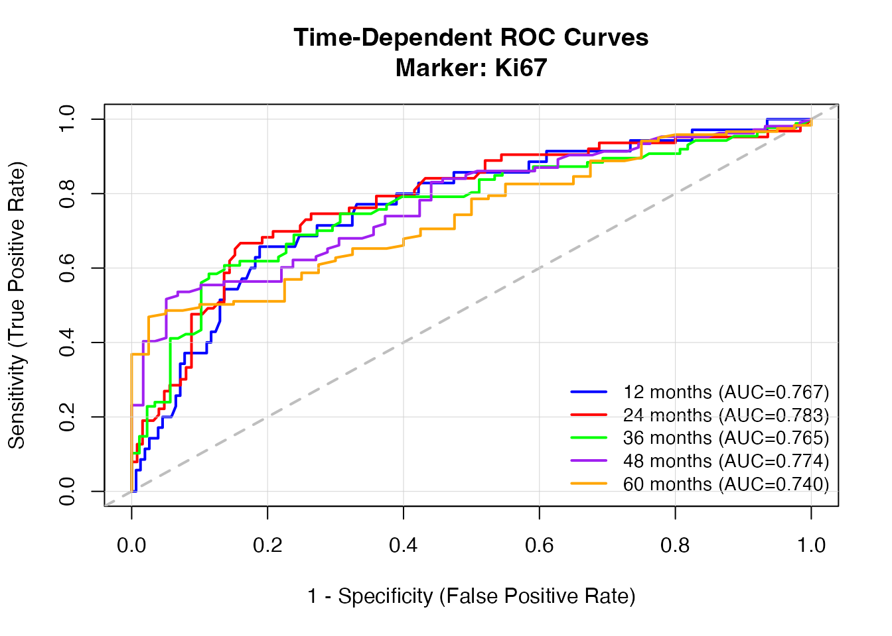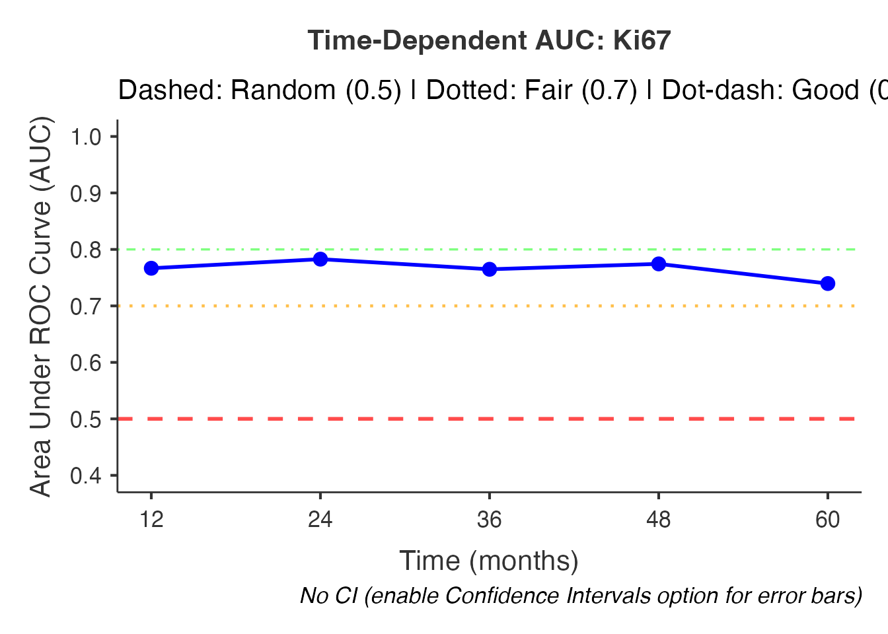

The cutoff table shows: timepoint, optimal cutoff value, sensitivity at
cutoff, specificity at cutoff, and Youden index.

#### Binary Mode

In binary mode, the Youden index is calculated from the standard ROC
curve. Disable with `youdenIndex = FALSE` to suppress the calculation.

``` r

timeroc(
  data = timeroc_test,
  outcome = "Recurrence",
  outcomeLevel = "1",
  marker = "Ki67",
  analysisType = "binary",
  youdenIndex = TRUE
)
#> 
#>  TIME-DEPENDENT ROC ANALYSIS
#> 
#>  <div style='margin: 10px 0;'><div style='background-color: #eff6ff;
#>  border-left: 4px solid #93c5fd; padding: 12px; margin: 8px 0;
#>  border-radius: 4px;'><strong style='color: #2563eb;'>Analysis Complete
#>  <span style='color: #374151;'>Binary ROC analysis completed. 190
#>  observations, 127 events (66.8% event rate).
#> 
#> character(0)
#> 
#>  Binary ROC Analysis Results                                                                                           
#>  ───────────────────────────────────────────────────────────────────────────────────────────────────────────────────── 
#>    Marker    AUC          SE            95% CI Lower    95% CI Upper    Sensitivity    Specificity    Optimal Cutoff   
#>  ───────────────────────────────────────────────────────────────────────────────────────────────────────────────────── 
#>    Ki67      0.7600000    0.03500000       0.6910000       0.8300000      0.6540000      0.7940000          30.35000   
#>  ───────────────────────────────────────────────────────────────────────────────────────────────────────────────────── 
#> 
#> 
#>  Diagnostic Performance Summary
#> 
#>  AUC: 0.76 (Fair discrimination)
#> 
#>  95% CI: [0.691, 0.83]
#> 
#> 
#> 
#>  Clinical Interpretation:
#> 
#> 
#>  An AUC of 0.76 indicates correct discrimination in 76% of randomly
#>  selected case-control pairs.
#>  The 95% CI suggests the true AUC lies between 0.691 and 0.83.
```


``` r

timeroc(
  data = timeroc_test,
  outcome = "Recurrence",
  outcomeLevel = "1",
  marker = "Ki67",
  analysisType = "binary",
  youdenIndex = FALSE
)
#> 
#>  TIME-DEPENDENT ROC ANALYSIS
#> 
#>  <div style='margin: 10px 0;'><div style='background-color: #eff6ff;
#>  border-left: 4px solid #93c5fd; padding: 12px; margin: 8px 0;
#>  border-radius: 4px;'><strong style='color: #2563eb;'>Analysis Complete
#>  <span style='color: #374151;'>Binary ROC analysis completed. 190
#>  observations, 127 events (66.8% event rate).
#> 
#> character(0)
#> 
#>  Binary ROC Analysis Results                                                                                           
#>  ───────────────────────────────────────────────────────────────────────────────────────────────────────────────────── 
#>    Marker    AUC          SE            95% CI Lower    95% CI Upper    Sensitivity    Specificity    Optimal Cutoff   
#>  ───────────────────────────────────────────────────────────────────────────────────────────────────────────────────── 
#>    Ki67      0.7600000    0.03500000       0.6910000       0.8300000                                                   
#>  ───────────────────────────────────────────────────────────────────────────────────────────────────────────────────── 
#> 
#> 
#>  Diagnostic Performance Summary
#> 
#>  AUC: 0.76 (Fair discrimination)
#> 
#>  95% CI: [0.691, 0.83]
#> 
#> 
#> 
#>  Clinical Interpretation:
#> 
#> 
#>  An AUC of 0.76 indicates correct discrimination in 76% of randomly
#>  selected case-control pairs.
#>  The 95% CI suggests the true AUC lies between 0.691 and 0.83.
```

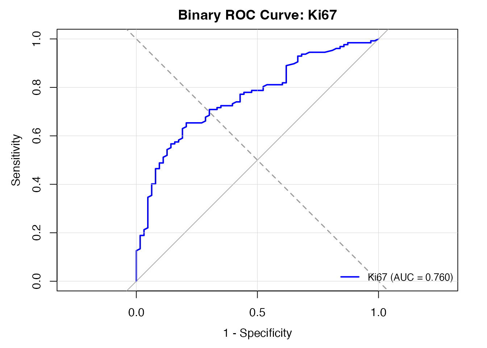

------------------------------------------------------------------------

### 9. Display Options

#### 9a. Marker Statistics

Toggle descriptive statistics for the marker variable (time-dependent
mode).

``` r

timeroc(
  data = timeroc_test,
  elapsedtime = "FollowUpMonths",
  outcome = "Recurrence",
  outcomeLevel = "1",
  marker = "Ki67",
  analysisType = "timedep",
  showMarkerStats = FALSE,
  timepoints = "12, 36, 60",
  timetypeoutput = "months"
)
#> 
#>  TIME-DEPENDENT ROC ANALYSIS
#> 
#>  <div style='margin: 10px 0;'><div style='background-color: #eff6ff;
#>  border-left: 4px solid #93c5fd; padding: 12px; margin: 8px 0;
#>  border-radius: 4px;'><strong style='color: #2563eb;'>Analysis Complete
#>  <span style='color: #374151;'>Time-dependent ROC analysis completed.
#>  190 observations, 127 events (66.8%), weighting: marginal.
#> 
#>  Time-Dependent ROC Analysis Results
#> 
#>  Marker Variable: Ki67
#> 
#>  Analysis Method: Cumulative/Dynamic (Kaplan-Meier weighting)
#> 
#>  Sample Size: 190 observations, 127 events (66.8%)
#> 
#>  AUC Interpretation by Timepoint:
#> 
#>  At 12 months:
#> 
#>  AUC = 0.767 (95% CI: NA - NA)
#> 
#>  Performance: fair (0.70-0.79) (CI not available: enable Confidence
#>  Intervals option)
#> 
#>  At 36 months:
#> 
#>  AUC = 0.765 (95% CI: NA - NA)
#> 
#>  Performance: fair (0.70-0.79) (CI not available: enable Confidence
#>  Intervals option)
#> 
#>  At 60 months:
#> 
#>  AUC = 0.740 (95% CI: NA - NA)
#> 
#>  Performance: fair (0.70-0.79) (CI not available: enable Confidence
#>  Intervals option)
#> 
#>  Area Under ROC Curve (AUC)                                        
#>  ───────────────────────────────────────────────────────────────── 
#>    Timepoint    AUC          SE     95% CI Lower    95% CI Upper   
#>  ───────────────────────────────────────────────────────────────── 
#>           12    0.7670000    NaN             NaN             NaN   
#>           36    0.7650000    NaN             NaN             NaN   
#>           60    0.7400000    NaN             NaN             NaN   
#>  ───────────────────────────────────────────────────────────────── 
#> 
#> 
#>  Optimal Cutoff Values                                                         
#>  ───────────────────────────────────────────────────────────────────────────── 
#>    Timepoint    Optimal Cutoff    Sensitivity    Specificity    Youden Index   
#>  ───────────────────────────────────────────────────────────────────────────── 
#>  ───────────────────────────────────────────────────────────────────────────── 
#> 
#> 
#>  Clinical Interpretation
#> 
#> 
#> 
#>  Overall Performance:
#> 
#>  The Ki67 shows fair to good discriminative ability (mean AUC = 0.757).
#> 
#> 
#> 
#>  Time Trend:
#> 
#>  Performance shows a declining trend over time.
#> 
#> 
#> 
#>  Clinical Utility:
#> 
#> 
#>  Best Performance: At 12 months (AUC = 0.767)
#>  Threshold: AUC >= 0.70 is generally considered clinically useful
#>  Assessment: The marker shows clinically relevant predictive ability
#> 
#> 
#> 
#>  Method: This analysis uses Kaplan-Meier (marginal) weighting for
#>  censoring adjustment, appropriate when censoring is independent of
#>  marker values.
```


#### 9b. Baseline Model Comparison

Compare marker performance against AUC = 0.5 (random). Requires
confidence intervals to be enabled for p-value computation.

``` r

timeroc(
  data = timeroc_test,
  elapsedtime = "FollowUpMonths",
  outcome = "Recurrence",
  outcomeLevel = "1",
  marker = "Ki67",
  analysisType = "timedep",
  timepoints = "12, 36, 60",
  method = "marginal",
  bootstrapCI = TRUE,
  compareBaseline = TRUE,
  timetypeoutput = "months"
)
#> 
#>  TIME-DEPENDENT ROC ANALYSIS
#> 
#>  <div style='margin: 10px 0;'><div style='background-color: #eff6ff;
#>  border-left: 4px solid #93c5fd; padding: 12px; margin: 8px 0;
#>  border-radius: 4px;'><strong style='color: #2563eb;'>Analysis Complete
#>  <span style='color: #374151;'>Time-dependent ROC analysis completed.
#>  190 observations, 127 events (66.8%), weighting: marginal.
#> 
#>  Time-Dependent ROC Analysis Results
#> 
#>  Marker Variable: Ki67
#> 
#>  Analysis Method: Cumulative/Dynamic (Kaplan-Meier weighting)
#> 
#>  Sample Size: 190 observations, 127 events (66.8%)
#> 
#>  Confidence Intervals: Asymptotic (influence function-based)
#> 
#>  AUC Interpretation by Timepoint:
#> 
#>  At 12 months:
#> 
#>  AUC = 0.767 (95% CI: 0.678 - 0.855)
#> 
#>  Performance: fair (0.70-0.79) (p = 0.000, significantly better than
#>  chance)
#> 
#>  At 36 months:
#> 
#>  AUC = 0.765 (95% CI: 0.693 - 0.837)
#> 
#>  Performance: fair (0.70-0.79) (p = 0.000, significantly better than
#>  chance)
#> 
#>  At 60 months:
#> 
#>  AUC = 0.740 (95% CI: 0.660 - 0.819)
#> 
#>  Performance: fair (0.70-0.79) (p = 0.000, significantly better than
#>  chance)
#> 
#>  Area Under ROC Curve (AUC)                                               
#>  ──────────────────────────────────────────────────────────────────────── 
#>    Timepoint    AUC          SE            95% CI Lower    95% CI Upper   
#>  ──────────────────────────────────────────────────────────────────────── 
#>           12    0.7670000    0.04500000       0.6780000       0.8550000   
#>           36    0.7650000    0.03700000       0.6920000       0.8370000   
#>           60    0.7400000    0.04100000       0.6590000       0.8200000   
#>  ──────────────────────────────────────────────────────────────────────── 
#> 
#> 
#>  Marker Variable Statistics 
#>  ────────────────────────── 
#>    Statistic     Value    
#>  ────────────────────────── 
#>    N             190      
#>    Mean          31.242   
#>    Median        30.45    
#>    SD            14.986   
#>    IQR           23.475   
#>    Min           1        
#>    Max           68.5     
#>    Events        127      
#>    Event Rate    66.8%    
#>  ────────────────────────── 
#> 
#> 
#>  Optimal Cutoff Values                                                         
#>  ───────────────────────────────────────────────────────────────────────────── 
#>    Timepoint    Optimal Cutoff    Sensitivity    Specificity    Youden Index   
#>  ───────────────────────────────────────────────────────────────────────────── 
#>  ───────────────────────────────────────────────────────────────────────────── 
#> 
#> 
#>  Model Performance Comparison
#> 
#>  Comparison to Baseline (AUC = 0.5):
#> 
#>  At 12 months:
#> 
#>  Improvement: +26.7% (AUC: 0.767 vs 0.50)
#> 
#>  p = 0.0000 (significant)
#> 
#>  At 36 months:
#> 
#>  Improvement: +26.5% (AUC: 0.765 vs 0.50)
#> 
#>  p = 0.0000 (significant)
#> 
#>  At 60 months:
#> 
#>  Improvement: +24.0% (AUC: 0.740 vs 0.50)
#> 
#>  p = 0.0000 (significant)
#> 
#>  Clinical Interpretation
#> 
#> 
#> 
#>  Overall Performance:
#> 
#>  The Ki67 shows fair to good discriminative ability (mean AUC = 0.757).
#> 
#> 
#> 
#>  Time Trend:
#> 
#>  Performance shows a declining trend over time.
#> 
#> 
#> 
#>  Clinical Utility:
#> 
#> 
#>  Best Performance: At 12 months (AUC = 0.767)
#>  Threshold: AUC >= 0.70 is generally considered clinically useful
#>  Assessment: The marker shows clinically relevant predictive ability
#> 
#> 
#> 
#>  Method: This analysis uses Kaplan-Meier (marginal) weighting for
#>  censoring adjustment, appropriate when censoring is independent of
#>  marker values.
```

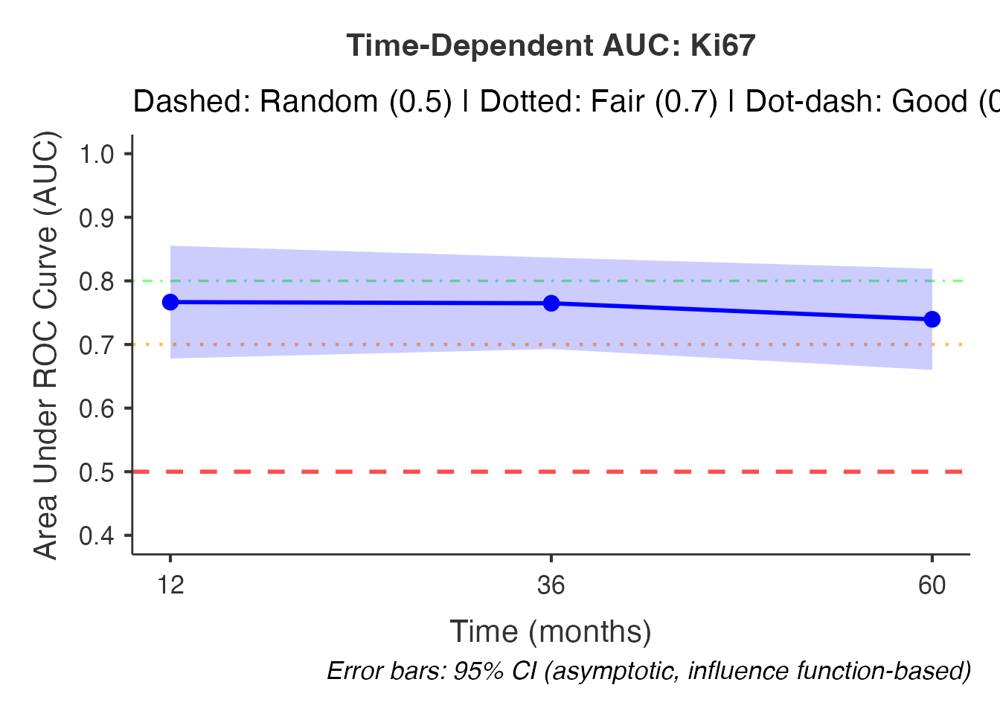

#### 9c. Smooth AUC Curve

Apply loess smoothing to the AUC-over-time plot. Requires more than 2
timepoints to function; otherwise falls back to a straight line.

``` r

timeroc(
  data = timeroc_test,
  elapsedtime = "FollowUpMonths",
  outcome = "Recurrence",
  outcomeLevel = "1",
  marker = "Ki67",
  analysisType = "timedep",
  timepoints = "6, 12, 18, 24, 36, 48, 60",
  plotAUC = TRUE,
  smoothAUC = TRUE,
  timetypeoutput = "months"
)
#> 
#>  TIME-DEPENDENT ROC ANALYSIS
#> 
#>  <div style='margin: 10px 0;'><div style='background-color: #eff6ff;
#>  border-left: 4px solid #93c5fd; padding: 12px; margin: 8px 0;
#>  border-radius: 4px;'><strong style='color: #2563eb;'>Analysis Complete
#>  <span style='color: #374151;'>Time-dependent ROC analysis completed.
#>  190 observations, 127 events (66.8%), weighting: marginal.
#> 
#>  Time-Dependent ROC Analysis Results
#> 
#>  Marker Variable: Ki67
#> 
#>  Analysis Method: Cumulative/Dynamic (Kaplan-Meier weighting)
#> 
#>  Sample Size: 190 observations, 127 events (66.8%)
#> 
#>  AUC Interpretation by Timepoint:
#> 
#>  At 6 months:
#> 
#>  AUC = 0.698 (95% CI: NA - NA)
#> 
#>  Performance: poor (0.60-0.69) (CI not available: enable Confidence
#>  Intervals option)
#> 
#>  At 12 months:
#> 
#>  AUC = 0.767 (95% CI: NA - NA)
#> 
#>  Performance: fair (0.70-0.79) (CI not available: enable Confidence
#>  Intervals option)
#> 
#>  At 18 months:
#> 
#>  AUC = 0.791 (95% CI: NA - NA)
#> 
#>  Performance: fair (0.70-0.79) (CI not available: enable Confidence
#>  Intervals option)
#> 
#>  At 24 months:
#> 
#>  AUC = 0.783 (95% CI: NA - NA)
#> 
#>  Performance: fair (0.70-0.79) (CI not available: enable Confidence
#>  Intervals option)
#> 
#>  At 36 months:
#> 
#>  AUC = 0.765 (95% CI: NA - NA)
#> 
#>  Performance: fair (0.70-0.79) (CI not available: enable Confidence
#>  Intervals option)
#> 
#>  At 48 months:
#> 
#>  AUC = 0.774 (95% CI: NA - NA)
#> 
#>  Performance: fair (0.70-0.79) (CI not available: enable Confidence
#>  Intervals option)
#> 
#>  At 60 months:
#> 
#>  AUC = 0.740 (95% CI: NA - NA)
#> 
#>  Performance: fair (0.70-0.79) (CI not available: enable Confidence
#>  Intervals option)
#> 
#>  Area Under ROC Curve (AUC)                                        
#>  ───────────────────────────────────────────────────────────────── 
#>    Timepoint    AUC          SE     95% CI Lower    95% CI Upper   
#>  ───────────────────────────────────────────────────────────────── 
#>            6    0.6980000    NaN             NaN             NaN   
#>           12    0.7670000    NaN             NaN             NaN   
#>           18    0.7910000    NaN             NaN             NaN   
#>           24    0.7830000    NaN             NaN             NaN   
#>           36    0.7650000    NaN             NaN             NaN   
#>           48    0.7740000    NaN             NaN             NaN   
#>           60    0.7400000    NaN             NaN             NaN   
#>  ───────────────────────────────────────────────────────────────── 
#> 
#> 
#>  Marker Variable Statistics 
#>  ────────────────────────── 
#>    Statistic     Value    
#>  ────────────────────────── 
#>    N             190      
#>    Mean          31.242   
#>    Median        30.45    
#>    SD            14.986   
#>    IQR           23.475   
#>    Min           1        
#>    Max           68.5     
#>    Events        127      
#>    Event Rate    66.8%    
#>  ────────────────────────── 
#> 
#> 
#>  Optimal Cutoff Values                                                         
#>  ───────────────────────────────────────────────────────────────────────────── 
#>    Timepoint    Optimal Cutoff    Sensitivity    Specificity    Youden Index   
#>  ───────────────────────────────────────────────────────────────────────────── 
#>  ───────────────────────────────────────────────────────────────────────────── 
#> 
#> 
#>  Clinical Interpretation
#> 
#> 
#> 
#>  Overall Performance:
#> 
#>  The Ki67 shows fair to good discriminative ability (mean AUC = 0.760).
#> 
#> 
#> 
#>  Time Trend:
#> 
#>  Performance shows a improving trend over time.
#> 
#> 
#> 
#>  Clinical Utility:
#> 
#> 
#>  Best Performance: At 18 months (AUC = 0.791)
#>  Threshold: AUC >= 0.70 is generally considered clinically useful
#>  Assessment: The marker shows clinically relevant predictive ability
#> 
#> 
#> 
#>  Method: This analysis uses Kaplan-Meier (marginal) weighting for
#>  censoring adjustment, appropriate when censoring is independent of
#>  marker values.
```

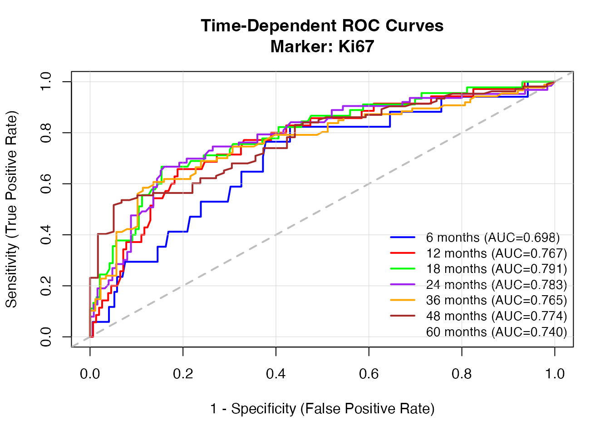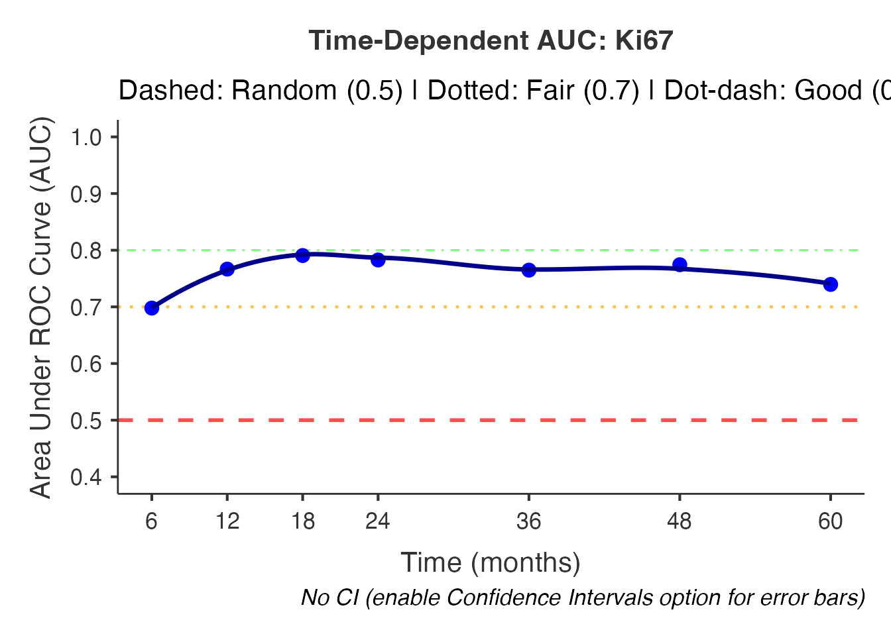

#### 9d. Time Unit Labels

Change the time unit for display in plots and interpretation text. Does
not transform the numeric values.

``` r

timeroc(
  data = timeroc_test,
  elapsedtime = "FollowUpMonths",
  outcome = "Recurrence",
  outcomeLevel = "1",
  marker = "Ki67",
  analysisType = "timedep",
  timepoints = "12, 36, 60",
  timetypeoutput = "years"
)
#> 
#>  TIME-DEPENDENT ROC ANALYSIS
#> 
#>  <div style='margin: 10px 0;'><div style='background-color: #eff6ff;
#>  border-left: 4px solid #93c5fd; padding: 12px; margin: 8px 0;
#>  border-radius: 4px;'><strong style='color: #2563eb;'>Analysis Complete
#>  <span style='color: #374151;'>Time-dependent ROC analysis completed.
#>  190 observations, 127 events (66.8%), weighting: marginal.
#> 
#>  Time-Dependent ROC Analysis Results
#> 
#>  Marker Variable: Ki67
#> 
#>  Analysis Method: Cumulative/Dynamic (Kaplan-Meier weighting)
#> 
#>  Sample Size: 190 observations, 127 events (66.8%)
#> 
#>  AUC Interpretation by Timepoint:
#> 
#>  At 12 years:
#> 
#>  AUC = 0.767 (95% CI: NA - NA)
#> 
#>  Performance: fair (0.70-0.79) (CI not available: enable Confidence
#>  Intervals option)
#> 
#>  At 36 years:
#> 
#>  AUC = 0.765 (95% CI: NA - NA)
#> 
#>  Performance: fair (0.70-0.79) (CI not available: enable Confidence
#>  Intervals option)
#> 
#>  At 60 years:
#> 
#>  AUC = 0.740 (95% CI: NA - NA)
#> 
#>  Performance: fair (0.70-0.79) (CI not available: enable Confidence
#>  Intervals option)
#> 
#>  Area Under ROC Curve (AUC)                                        
#>  ───────────────────────────────────────────────────────────────── 
#>    Timepoint    AUC          SE     95% CI Lower    95% CI Upper   
#>  ───────────────────────────────────────────────────────────────── 
#>           12    0.7670000    NaN             NaN             NaN   
#>           36    0.7650000    NaN             NaN             NaN   
#>           60    0.7400000    NaN             NaN             NaN   
#>  ───────────────────────────────────────────────────────────────── 
#> 
#> 
#>  Marker Variable Statistics 
#>  ────────────────────────── 
#>    Statistic     Value    
#>  ────────────────────────── 
#>    N             190      
#>    Mean          31.242   
#>    Median        30.45    
#>    SD            14.986   
#>    IQR           23.475   
#>    Min           1        
#>    Max           68.5     
#>    Events        127      
#>    Event Rate    66.8%    
#>  ────────────────────────── 
#> 
#> 
#>  Optimal Cutoff Values                                                         
#>  ───────────────────────────────────────────────────────────────────────────── 
#>    Timepoint    Optimal Cutoff    Sensitivity    Specificity    Youden Index   
#>  ───────────────────────────────────────────────────────────────────────────── 
#>  ───────────────────────────────────────────────────────────────────────────── 
#> 
#> 
#>  Clinical Interpretation
#> 
#> 
#> 
#>  Overall Performance:
#> 
#>  The Ki67 shows fair to good discriminative ability (mean AUC = 0.757).
#> 
#> 
#> 
#>  Time Trend:
#> 
#>  Performance shows a declining trend over time.
#> 
#> 
#> 
#>  Clinical Utility:
#> 
#> 
#>  Best Performance: At 12 years (AUC = 0.767)
#>  Threshold: AUC >= 0.70 is generally considered clinically useful
#>  Assessment: The marker shows clinically relevant predictive ability
#> 
#> 
#> 
#>  Method: This analysis uses Kaplan-Meier (marginal) weighting for
#>  censoring adjustment, appropriate when censoring is independent of
#>  marker values.
```

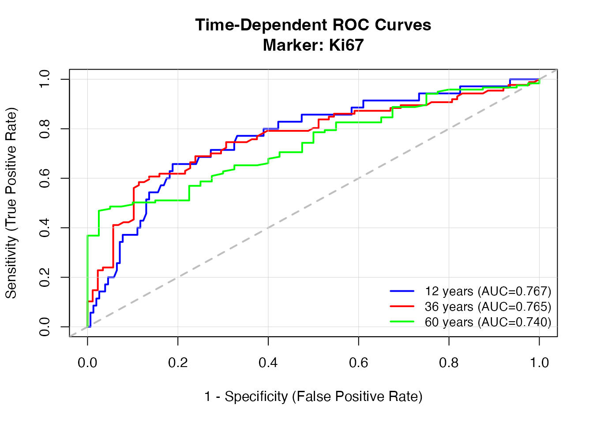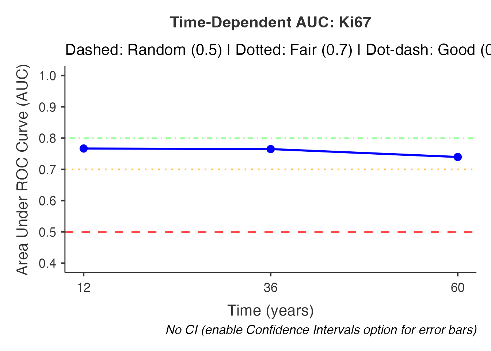

#### 9e. Suppress Plots

Turn off ROC curve plot and/or AUC-over-time plot for table-only output.

``` r

timeroc(
  data = timeroc_test,
  elapsedtime = "FollowUpMonths",
  outcome = "Recurrence",
  outcomeLevel = "1",
  marker = "Ki67",
  analysisType = "timedep",
  timepoints = "12, 36, 60",
  plotROC = FALSE,
  plotAUC = FALSE,
  timetypeoutput = "months"
)
#> 
#>  TIME-DEPENDENT ROC ANALYSIS
#> 
#>  <div style='margin: 10px 0;'><div style='background-color: #eff6ff;
#>  border-left: 4px solid #93c5fd; padding: 12px; margin: 8px 0;
#>  border-radius: 4px;'><strong style='color: #2563eb;'>Analysis Complete
#>  <span style='color: #374151;'>Time-dependent ROC analysis completed.
#>  190 observations, 127 events (66.8%), weighting: marginal.
#> 
#>  Time-Dependent ROC Analysis Results
#> 
#>  Marker Variable: Ki67
#> 
#>  Analysis Method: Cumulative/Dynamic (Kaplan-Meier weighting)
#> 
#>  Sample Size: 190 observations, 127 events (66.8%)
#> 
#>  AUC Interpretation by Timepoint:
#> 
#>  At 12 months:
#> 
#>  AUC = 0.767 (95% CI: NA - NA)
#> 
#>  Performance: fair (0.70-0.79) (CI not available: enable Confidence
#>  Intervals option)
#> 
#>  At 36 months:
#> 
#>  AUC = 0.765 (95% CI: NA - NA)
#> 
#>  Performance: fair (0.70-0.79) (CI not available: enable Confidence
#>  Intervals option)
#> 
#>  At 60 months:
#> 
#>  AUC = 0.740 (95% CI: NA - NA)
#> 
#>  Performance: fair (0.70-0.79) (CI not available: enable Confidence
#>  Intervals option)
#> 
#>  Area Under ROC Curve (AUC)                                        
#>  ───────────────────────────────────────────────────────────────── 
#>    Timepoint    AUC          SE     95% CI Lower    95% CI Upper   
#>  ───────────────────────────────────────────────────────────────── 
#>           12    0.7670000    NaN             NaN             NaN   
#>           36    0.7650000    NaN             NaN             NaN   
#>           60    0.7400000    NaN             NaN             NaN   
#>  ───────────────────────────────────────────────────────────────── 
#> 
#> 
#>  Marker Variable Statistics 
#>  ────────────────────────── 
#>    Statistic     Value    
#>  ────────────────────────── 
#>    N             190      
#>    Mean          31.242   
#>    Median        30.45    
#>    SD            14.986   
#>    IQR           23.475   
#>    Min           1        
#>    Max           68.5     
#>    Events        127      
#>    Event Rate    66.8%    
#>  ────────────────────────── 
#> 
#> 
#>  Optimal Cutoff Values                                                         
#>  ───────────────────────────────────────────────────────────────────────────── 
#>    Timepoint    Optimal Cutoff    Sensitivity    Specificity    Youden Index   
#>  ───────────────────────────────────────────────────────────────────────────── 
#>  ───────────────────────────────────────────────────────────────────────────── 
#> 
#> 
#>  Clinical Interpretation
#> 
#> 
#> 
#>  Overall Performance:
#> 
#>  The Ki67 shows fair to good discriminative ability (mean AUC = 0.757).
#> 
#> 
#> 
#>  Time Trend:
#> 
#>  Performance shows a declining trend over time.
#> 
#> 
#> 
#>  Clinical Utility:
#> 
#> 
#>  Best Performance: At 12 months (AUC = 0.767)
#>  Threshold: AUC >= 0.70 is generally considered clinically useful
#>  Assessment: The marker shows clinically relevant predictive ability
#> 
#> 
#> 
#>  Method: This analysis uses Kaplan-Meier (marginal) weighting for
#>  censoring adjustment, appropriate when censoring is independent of
#>  marker values.
```

------------------------------------------------------------------------

### 10. Edge Cases

#### 10a. Timepoints Beyond Follow-Up

When all specified timepoints exceed the maximum follow-up time, the
function automatically substitutes quartiles of observed follow-up.

``` r

timeroc(
  data = timeroc_test,
  elapsedtime = "FollowUpMonths",
  outcome = "Recurrence",
  outcomeLevel = "1",
  marker = "Ki67",
  analysisType = "timedep",
  timepoints = "120, 240, 360",
  timetypeoutput = "months"
)
#> 
#>  TIME-DEPENDENT ROC ANALYSIS
#> 
#>  <div style='margin: 10px 0;'><div style='background-color: #fefce8;
#>  border-left: 4px solid #fde047; padding: 12px; margin: 8px 0;
#>  border-radius: 4px;'><strong style='color: #ca8a04;'>Timepoints
#>  Adjusted
#>  <span style='color: #374151;'>All specified timepoints exceed maximum
#>  follow-up (112.5). Using quartiles of follow-up time instead.<div
#>  style='background-color: #fef2f2; border-left: 4px solid #fca5a5;
#>  padding: 12px; margin: 8px 0; border-radius: 4px;'><strong
#>  style='color: #dc2626;'>Analysis Failed
#>  <span style='color: #374151;'>invalid format '%d'; use format %f, %e,
#>  %g or %a for numeric objects
#> 
#>  Time-Dependent ROC Analysis Error
#> 
#>  Error: invalid format '%d'; use format %f, %e, %g or %a for numeric
#>  objects
#> 
#> 
#> 
#>  Common Issues:
#> 
#> 
#>  Time Variable: Must be positive numeric
#>  Outcome: Must be binary (0/1) or factor with event level
#>  Marker: Must be continuous with sufficient variation
#>  Events: Need at least 5-10 events for reliable analysis
#>  Timepoints: Should be within follow-up period
#> 
#> 
#> 
#>  Data Summary:
#> 
#> 
#>  N: 190, Events: 127 (66.8%)
#>  Follow-up: 0.5 to 112.5 months
#>  Timepoints: 18.9, 33.05, 55.3
#> 
#> 
#> 
#>  Area Under ROC Curve (AUC)                                        
#>  ───────────────────────────────────────────────────────────────── 
#>    Timepoint    AUC          SE     95% CI Lower    95% CI Upper   
#>  ───────────────────────────────────────────────────────────────── 
#>           19    0.7950000    NaN             NaN             NaN   
#>           33    0.7670000    NaN             NaN             NaN   
#>           55    0.7650000    NaN             NaN             NaN   
#>  ───────────────────────────────────────────────────────────────── 
#> 
#> 
#>  Marker Variable Statistics 
#>  ────────────────────────── 
#>    Statistic     Value    
#>  ────────────────────────── 
#>    N             190      
#>    Mean          31.242   
#>    Median        30.45    
#>    SD            14.986   
#>    IQR           23.475   
#>    Min           1        
#>    Max           68.5     
#>    Events        127      
#>    Event Rate    66.8%    
#>  ────────────────────────── 
#> 
#> 
#>  Optimal Cutoff Values                                                         
#>  ───────────────────────────────────────────────────────────────────────────── 
#>    Timepoint    Optimal Cutoff    Sensitivity    Specificity    Youden Index   
#>  ───────────────────────────────────────────────────────────────────────────── 
#>  ───────────────────────────────────────────────────────────────────────────── 
#> 
#> 
#> character(0)
```

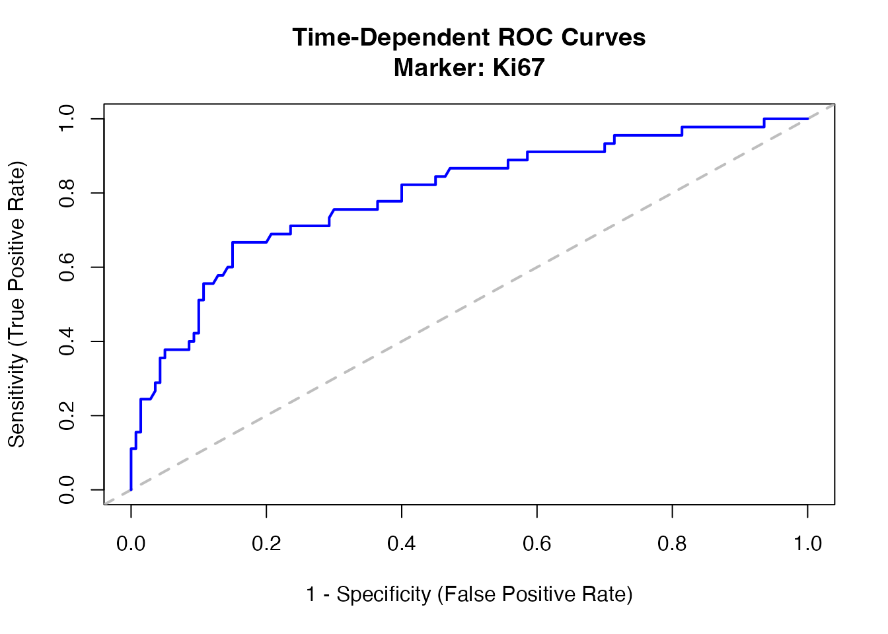

    #> Error in `sprintf()`:
    #> ! invalid format '%d'; use format %f, %e, %g or %a for numeric objects

#### 10b. Invalid Timepoints String

Non-parseable timepoint strings fall back to the defaults (12, 36, 60).

``` r

timeroc(
  data = timeroc_test,
  elapsedtime = "FollowUpMonths",
  outcome = "Recurrence",
  outcomeLevel = "1",
  marker = "Ki67",
  analysisType = "timedep",
  timepoints = "abc, xyz",
  timetypeoutput = "months"
)
#> 
#>  TIME-DEPENDENT ROC ANALYSIS
#> 
#>  <div style='margin: 10px 0;'><div style='background-color: #eff6ff;
#>  border-left: 4px solid #93c5fd; padding: 12px; margin: 8px 0;
#>  border-radius: 4px;'><strong style='color: #2563eb;'>Analysis Complete
#>  <span style='color: #374151;'>Time-dependent ROC analysis completed.
#>  190 observations, 127 events (66.8%), weighting: marginal.
#> 
#>  Time-Dependent ROC Analysis Results
#> 
#>  Marker Variable: Ki67
#> 
#>  Analysis Method: Cumulative/Dynamic (Kaplan-Meier weighting)
#> 
#>  Sample Size: 190 observations, 127 events (66.8%)
#> 
#>  AUC Interpretation by Timepoint:
#> 
#>  At 12 months:
#> 
#>  AUC = 0.767 (95% CI: NA - NA)
#> 
#>  Performance: fair (0.70-0.79) (CI not available: enable Confidence
#>  Intervals option)
#> 
#>  At 36 months:
#> 
#>  AUC = 0.765 (95% CI: NA - NA)
#> 
#>  Performance: fair (0.70-0.79) (CI not available: enable Confidence
#>  Intervals option)
#> 
#>  At 60 months:
#> 
#>  AUC = 0.740 (95% CI: NA - NA)
#> 
#>  Performance: fair (0.70-0.79) (CI not available: enable Confidence
#>  Intervals option)
#> 
#>  Area Under ROC Curve (AUC)                                        
#>  ───────────────────────────────────────────────────────────────── 
#>    Timepoint    AUC          SE     95% CI Lower    95% CI Upper   
#>  ───────────────────────────────────────────────────────────────── 
#>           12    0.7670000    NaN             NaN             NaN   
#>           36    0.7650000    NaN             NaN             NaN   
#>           60    0.7400000    NaN             NaN             NaN   
#>  ───────────────────────────────────────────────────────────────── 
#> 
#> 
#>  Marker Variable Statistics 
#>  ────────────────────────── 
#>    Statistic     Value    
#>  ────────────────────────── 
#>    N             190      
#>    Mean          31.242   
#>    Median        30.45    
#>    SD            14.986   
#>    IQR           23.475   
#>    Min           1        
#>    Max           68.5     
#>    Events        127      
#>    Event Rate    66.8%    
#>  ────────────────────────── 
#> 
#> 
#>  Optimal Cutoff Values                                                         
#>  ───────────────────────────────────────────────────────────────────────────── 
#>    Timepoint    Optimal Cutoff    Sensitivity    Specificity    Youden Index   
#>  ───────────────────────────────────────────────────────────────────────────── 
#>  ───────────────────────────────────────────────────────────────────────────── 
#> 
#> 
#>  Clinical Interpretation
#> 
#> 
#> 
#>  Overall Performance:
#> 
#>  The Ki67 shows fair to good discriminative ability (mean AUC = 0.757).
#> 
#> 
#> 
#>  Time Trend:
#> 
#>  Performance shows a declining trend over time.
#> 
#> 
#> 
#>  Clinical Utility:
#> 
#> 
#>  Best Performance: At 12 months (AUC = 0.767)
#>  Threshold: AUC >= 0.70 is generally considered clinically useful
#>  Assessment: The marker shows clinically relevant predictive ability
#> 
#> 
#> 
#>  Method: This analysis uses Kaplan-Meier (marginal) weighting for
#>  censoring adjustment, appropriate when censoring is independent of
#>  marker values.
```


#### 10c. Noise Marker (AUC Near 0.5)

A random noise marker should produce AUC close to 0.5, triggering a
“Limited Clinical Utility” warning.

``` r

timeroc(
  data = timeroc_test,
  outcome = "Recurrence",
  outcomeLevel = "1",
  marker = "NoiseMarker",
  analysisType = "binary",
  youdenIndex = TRUE
)
#> 
#>  TIME-DEPENDENT ROC ANALYSIS
#> 
#>  <div style='margin: 10px 0;'><div style='background-color: #fefce8;
#>  border-left: 4px solid #fde047; padding: 12px; margin: 8px 0;
#>  border-radius: 4px;'><strong style='color: #ca8a04;'>Limited Clinical
#>  Utility
#>  <span style='color: #374151;'>AUC = 0.546 is below 0.70. The marker
#>  shows limited discriminative ability for clinical decision-making.<div
#>  style='background-color: #eff6ff; border-left: 4px solid #93c5fd;
#>  padding: 12px; margin: 8px 0; border-radius: 4px;'><strong
#>  style='color: #2563eb;'>Analysis Complete
#>  <span style='color: #374151;'>Binary ROC analysis completed. 200
#>  observations, 132 events (66.0% event rate).
#> 
#> character(0)
#> 
#>  Binary ROC Analysis Results                                                                                                
#>  ────────────────────────────────────────────────────────────────────────────────────────────────────────────────────────── 
#>    Marker         AUC          SE            95% CI Lower    95% CI Upper    Sensitivity    Specificity    Optimal Cutoff   
#>  ────────────────────────────────────────────────────────────────────────────────────────────────────────────────────────── 
#>    NoiseMarker    0.5460000    0.04300000       0.4600000       0.6310000      0.9240000      0.1620000          67.50000   
#>  ────────────────────────────────────────────────────────────────────────────────────────────────────────────────────────── 
#> 
#> 
#>  Diagnostic Performance Summary
#> 
#>  AUC: 0.546 (No discrimination (equivalent to random chance))
#> 
#>  95% CI: [0.46, 0.631]
#> 
#> 
#> 
#>  Clinical Interpretation:
#> 
#> 
#>  An AUC of 0.546 indicates correct discrimination in 54.6% of randomly
#>  selected case-control pairs.
#>  The 95% CI suggests the true AUC lies between 0.46 and 0.631.
```

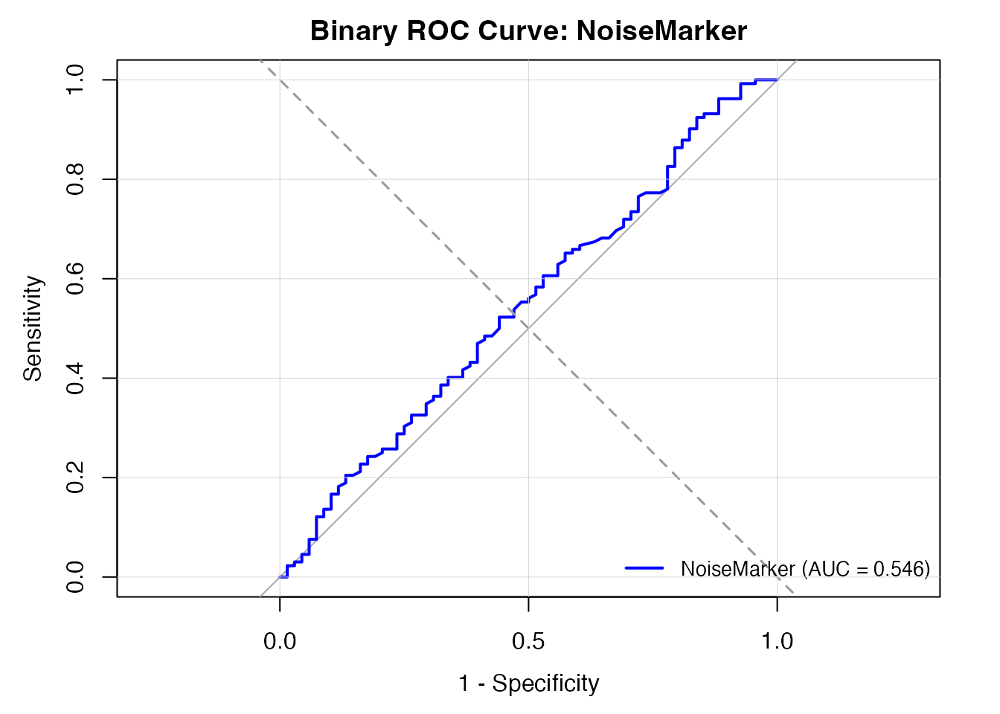

#### 10d. Single Timepoint

Analysis with only one evaluation timepoint.

``` r

timeroc(
  data = timeroc_test,
  elapsedtime = "FollowUpMonths",
  outcome = "Recurrence",
  outcomeLevel = "1",
  marker = "Ki67",
  analysisType = "timedep",
  timepoints = "24",
  timetypeoutput = "months"
)
#> 
#>  TIME-DEPENDENT ROC ANALYSIS
#> 
#>  <div style='margin: 10px 0;'><div style='background-color: #fef2f2;
#>  border-left: 4px solid #fca5a5; padding: 12px; margin: 8px 0;
#>  border-radius: 4px;'><strong style='color: #dc2626;'>Analysis Failed
#>  <span style='color: #374151;'>missing value where TRUE/FALSE needed
#> 
#>  Time-Dependent ROC Analysis Error
#> 
#>  Error: missing value where TRUE/FALSE needed
#> 
#> 
#> 
#>  Common Issues:
#> 
#> 
#>  Time Variable: Must be positive numeric
#>  Outcome: Must be binary (0/1) or factor with event level
#>  Marker: Must be continuous with sufficient variation
#>  Events: Need at least 5-10 events for reliable analysis
#>  Timepoints: Should be within follow-up period
#> 
#> 
#> 
#>  Data Summary:
#> 
#> 
#>  N: 190, Events: 127 (66.8%)
#>  Follow-up: 0.5 to 112.5 months
#>  Timepoints: 24
#> 
#> 
#> 
#>  Area Under ROC Curve (AUC)                                        
#>  ───────────────────────────────────────────────────────────────── 
#>    Timepoint    AUC          SE     95% CI Lower    95% CI Upper   
#>  ───────────────────────────────────────────────────────────────── 
#>           24    0.7830000    NaN             NaN             NaN   
#>  ───────────────────────────────────────────────────────────────── 
#> 
#> 
#>  Marker Variable Statistics 
#>  ────────────────────────── 
#>    Statistic     Value    
#>  ────────────────────────── 
#>    N             190      
#>    Mean          31.242   
#>    Median        30.45    
#>    SD            14.986   
#>    IQR           23.475   
#>    Min           1        
#>    Max           68.5     
#>    Events        127      
#>    Event Rate    66.8%    
#>  ────────────────────────── 
#> 
#> 
#>  Optimal Cutoff Values                                                         
#>  ───────────────────────────────────────────────────────────────────────────── 
#>    Timepoint    Optimal Cutoff    Sensitivity    Specificity    Youden Index   
#>  ───────────────────────────────────────────────────────────────────────────── 
#>  ───────────────────────────────────────────────────────────────────────────── 
#> 
#> 
#> character(0)
```

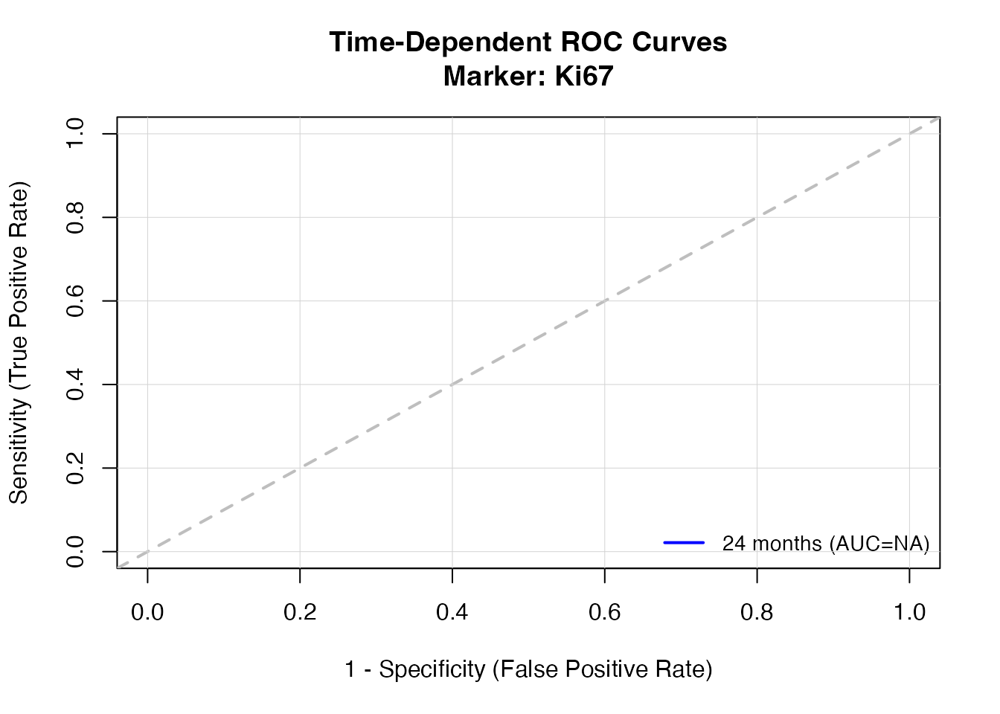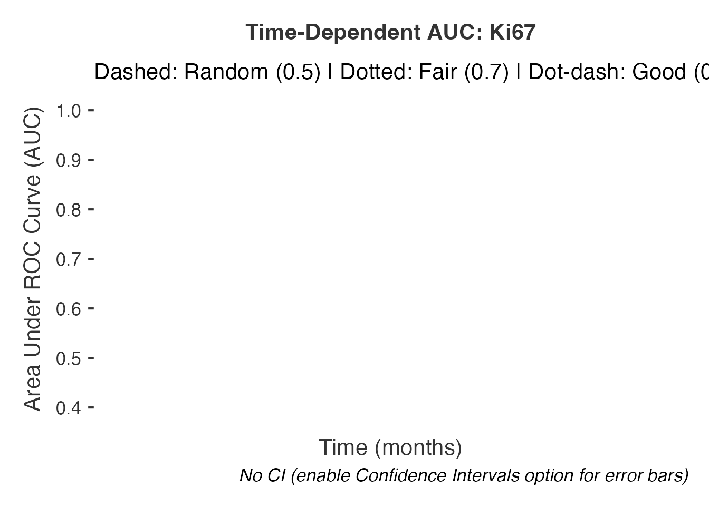

#### 10e. Many Timepoints with Smoothing

Dense timepoints with loess smoothing for a smooth AUC trajectory.

``` r

timeroc(
  data = timeroc_test,
  elapsedtime = "FollowUpMonths",
  outcome = "Recurrence",
  outcomeLevel = "1",
  marker = "GeneScore",
  analysisType = "timedep",
  timepoints = "3, 6, 9, 12, 18, 24, 30, 36, 42, 48, 54, 60",
  smoothAUC = TRUE,
  plotAUC = TRUE,
  timetypeoutput = "months"
)
#> 
#>  TIME-DEPENDENT ROC ANALYSIS
#> 
#>  <div style='margin: 10px 0;'><div style='background-color: #eff6ff;
#>  border-left: 4px solid #93c5fd; padding: 12px; margin: 8px 0;
#>  border-radius: 4px;'><strong style='color: #2563eb;'>Analysis Complete
#>  <span style='color: #374151;'>Time-dependent ROC analysis completed.
#>  194 observations, 126 events (64.9%), weighting: marginal.
#> 
#>  Time-Dependent ROC Analysis Results
#> 
#>  Marker Variable: GeneScore
#> 
#>  Analysis Method: Cumulative/Dynamic (Kaplan-Meier weighting)
#> 
#>  Sample Size: 194 observations, 126 events (64.9%)
#> 
#>  AUC Interpretation by Timepoint:
#> 
#>  At 3 months:
#> 
#>  AUC = 0.714 (95% CI: NA - NA)
#> 
#>  Performance: fair (0.70-0.79) (CI not available: enable Confidence
#>  Intervals option)
#> 
#>  At 6 months:
#> 
#>  AUC = 0.664 (95% CI: NA - NA)
#> 
#>  Performance: poor (0.60-0.69) (CI not available: enable Confidence
#>  Intervals option)
#> 
#>  At 9 months:
#> 
#>  AUC = 0.702 (95% CI: NA - NA)
#> 
#>  Performance: fair (0.70-0.79) (CI not available: enable Confidence
#>  Intervals option)
#> 
#>  At 12 months:
#> 
#>  AUC = 0.740 (95% CI: NA - NA)
#> 
#>  Performance: fair (0.70-0.79) (CI not available: enable Confidence
#>  Intervals option)
#> 
#>  At 18 months:
#> 
#>  AUC = 0.756 (95% CI: NA - NA)
#> 
#>  Performance: fair (0.70-0.79) (CI not available: enable Confidence
#>  Intervals option)
#> 
#>  At 24 months:
#> 
#>  AUC = 0.770 (95% CI: NA - NA)
#> 
#>  Performance: fair (0.70-0.79) (CI not available: enable Confidence
#>  Intervals option)
#> 
#>  At 30 months:
#> 
#>  AUC = 0.771 (95% CI: NA - NA)
#> 
#>  Performance: fair (0.70-0.79) (CI not available: enable Confidence
#>  Intervals option)
#> 
#>  At 36 months:
#> 
#>  AUC = 0.755 (95% CI: NA - NA)
#> 
#>  Performance: fair (0.70-0.79) (CI not available: enable Confidence
#>  Intervals option)
#> 
#>  At 42 months:
#> 
#>  AUC = 0.790 (95% CI: NA - NA)
#> 
#>  Performance: fair (0.70-0.79) (CI not available: enable Confidence
#>  Intervals option)
#> 
#>  At 48 months:
#> 
#>  AUC = 0.802 (95% CI: NA - NA)
#> 
#>  Performance: good (0.80-0.89) (CI not available: enable Confidence
#>  Intervals option)
#> 
#>  At 54 months:
#> 
#>  AUC = 0.781 (95% CI: NA - NA)
#> 
#>  Performance: fair (0.70-0.79) (CI not available: enable Confidence
#>  Intervals option)
#> 
#>  At 60 months:
#> 
#>  AUC = 0.763 (95% CI: NA - NA)
#> 
#>  Performance: fair (0.70-0.79) (CI not available: enable Confidence
#>  Intervals option)
#> 
#>  Area Under ROC Curve (AUC)                                        
#>  ───────────────────────────────────────────────────────────────── 
#>    Timepoint    AUC          SE     95% CI Lower    95% CI Upper   
#>  ───────────────────────────────────────────────────────────────── 
#>            3    0.7140000    NaN             NaN             NaN   
#>            6    0.6640000    NaN             NaN             NaN   
#>            9    0.7020000    NaN             NaN             NaN   
#>           12    0.7400000    NaN             NaN             NaN   
#>           18    0.7560000    NaN             NaN             NaN   
#>           24    0.7700000    NaN             NaN             NaN   
#>           30    0.7710000    NaN             NaN             NaN   
#>           36    0.7550000    NaN             NaN             NaN   
#>           42    0.7900000    NaN             NaN             NaN   
#>           48    0.8020000    NaN             NaN             NaN   
#>           54    0.7810000    NaN             NaN             NaN   
#>           60    0.7630000    NaN             NaN             NaN   
#>  ───────────────────────────────────────────────────────────────── 
#> 
#> 
#>  Marker Variable Statistics 
#>  ────────────────────────── 
#>    Statistic     Value   
#>  ────────────────────────── 
#>    N             194     
#>    Mean          4.833   
#>    Median        4.815   
#>    SD            1.947   
#>    IQR           2.367   
#>    Min           0       
#>    Max           9.57    
#>    Events        126     
#>    Event Rate    64.9%   
#>  ────────────────────────── 
#> 
#> 
#>  Optimal Cutoff Values                                                         
#>  ───────────────────────────────────────────────────────────────────────────── 
#>    Timepoint    Optimal Cutoff    Sensitivity    Specificity    Youden Index   
#>  ───────────────────────────────────────────────────────────────────────────── 
#>  ───────────────────────────────────────────────────────────────────────────── 
#> 
#> 
#>  Clinical Interpretation
#> 
#> 
#> 
#>  Overall Performance:
#> 
#>  The GeneScore shows fair to good discriminative ability (mean AUC =
#>  0.751).
#> 
#> 
#> 
#>  Time Trend:
#> 
#>  Performance shows a improving trend over time.
#> 
#> 
#> 
#>  Clinical Utility:
#> 
#> 
#>  Best Performance: At 48 months (AUC = 0.802)
#>  Threshold: AUC >= 0.70 is generally considered clinically useful
#>  Assessment: The marker shows clinically relevant predictive ability
#> 
#> 
#> 
#>  Method: This analysis uses Kaplan-Meier (marginal) weighting for
#>  censoring adjustment, appropriate when censoring is independent of
#>  marker values.
```

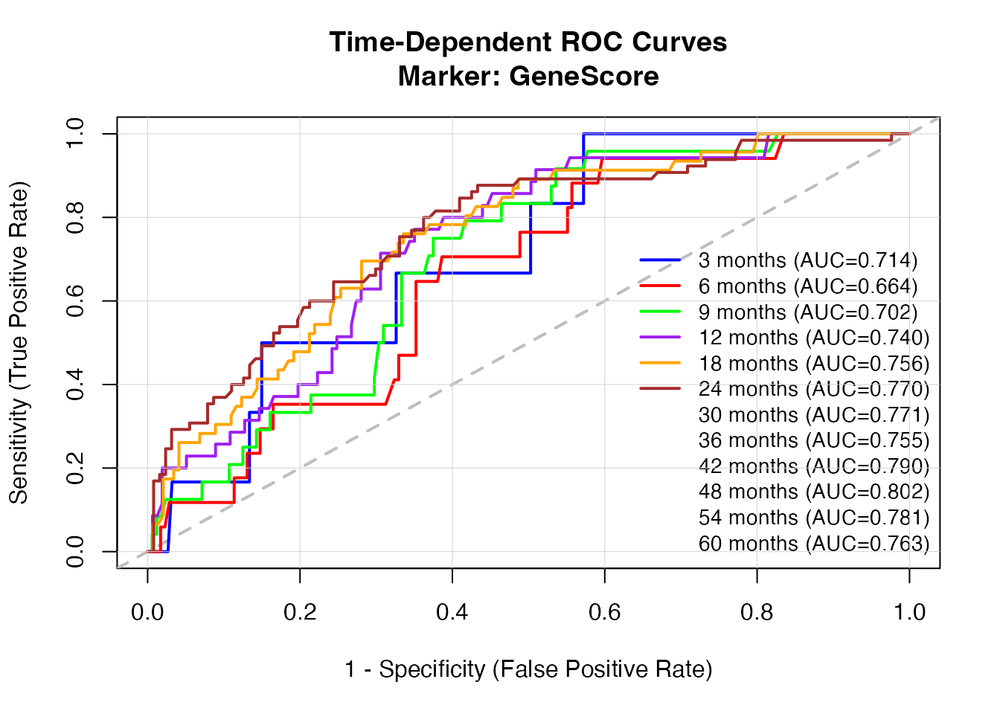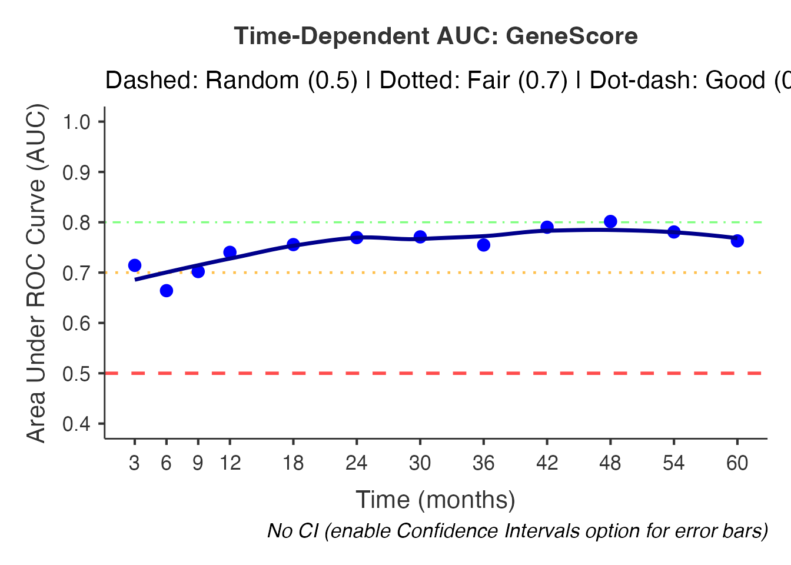

------------------------------------------------------------------------

### 11. Clinical Interpretation

The module provides automated clinical interpretation at multiple
levels:

#### Time-Dependent Mode

- **Per-timepoint interpretation:** AUC classification
  (excellent/good/fair/poor/failed) with significance testing against
  AUC = 0.5 (when CI enabled)
- **Overall assessment:** Mean AUC, performance trend
  (improving/declining/stable), best-performing timepoint
- **Method context:** Explanation of the IPCW weighting method used
- **Notices:** Severity-graded feedback (ERROR, STRONG_WARNING, WARNING,
  INFO) for data quality issues, reversed markers, and limited clinical
  utility

#### Binary Mode

- **AUC classification:** Excellent (\>=0.9), Good (0.8-0.9), Fair
  (0.7-0.8), Poor (0.6-0.7), No discrimination (\<0.6)
- **Diagnostic performance summary:** AUC with 95% CI, interpretation of
  discriminative ability
- **Optimal threshold:** Youden index-based cutoff with sensitivity and
  specificity

``` r

timeroc(
  data = timeroc_test,
  elapsedtime = "FollowUpMonths",
  outcome = "Recurrence",
  outcomeLevel = "1",
  marker = "GeneScore",
  analysisType = "timedep",
  timepoints = "12, 36, 60",
  method = "marginal",
  bootstrapCI = TRUE,
  showOptimalCutoff = TRUE,
  showMarkerStats = TRUE,
  compareBaseline = TRUE,
  timetypeoutput = "months"
)
#> 
#>  TIME-DEPENDENT ROC ANALYSIS
#> 
#>  <div style='margin: 10px 0;'><div style='background-color: #eff6ff;
#>  border-left: 4px solid #93c5fd; padding: 12px; margin: 8px 0;
#>  border-radius: 4px;'><strong style='color: #2563eb;'>Analysis Complete
#>  <span style='color: #374151;'>Time-dependent ROC analysis completed.
#>  194 observations, 126 events (64.9%), weighting: marginal.
#> 
#>  Time-Dependent ROC Analysis Results
#> 
#>  Marker Variable: GeneScore
#> 
#>  Analysis Method: Cumulative/Dynamic (Kaplan-Meier weighting)
#> 
#>  Sample Size: 194 observations, 126 events (64.9%)
#> 
#>  Confidence Intervals: Asymptotic (influence function-based)
#> 
#>  AUC Interpretation by Timepoint:
#> 
#>  At 12 months:
#> 
#>  AUC = 0.740 (95% CI: 0.659 - 0.822)
#> 
#>  Performance: fair (0.70-0.79) (p = 0.000, significantly better than
#>  chance)
#> 
#>  At 36 months:
#> 
#>  AUC = 0.755 (95% CI: 0.684 - 0.826)
#> 
#>  Performance: fair (0.70-0.79) (p = 0.000, significantly better than
#>  chance)
#> 
#>  At 60 months:
#> 
#>  AUC = 0.763 (95% CI: 0.686 - 0.840)
#> 
#>  Performance: fair (0.70-0.79) (p = 0.000, significantly better than
#>  chance)
#> 
#>  Area Under ROC Curve (AUC)                                               
#>  ──────────────────────────────────────────────────────────────────────── 
#>    Timepoint    AUC          SE            95% CI Lower    95% CI Upper   
#>  ──────────────────────────────────────────────────────────────────────── 
#>           12    0.7400000    0.04200000       0.6580000       0.8230000   
#>           36    0.7550000    0.03600000       0.6840000       0.8250000   
#>           60    0.7630000    0.03900000       0.6870000       0.8390000   
#>  ──────────────────────────────────────────────────────────────────────── 
#> 
#> 
#>  Marker Variable Statistics 
#>  ────────────────────────── 
#>    Statistic     Value   
#>  ────────────────────────── 
#>    N             194     
#>    Mean          4.833   
#>    Median        4.815   
#>    SD            1.947   
#>    IQR           2.367   
#>    Min           0       
#>    Max           9.57    
#>    Events        126     
#>    Event Rate    64.9%   
#>  ────────────────────────── 
#> 
#> 
#>  Optimal Cutoff Values                                                         
#>  ───────────────────────────────────────────────────────────────────────────── 
#>    Timepoint    Optimal Cutoff    Sensitivity    Specificity    Youden Index   
#>  ───────────────────────────────────────────────────────────────────────────── 
#>  ───────────────────────────────────────────────────────────────────────────── 
#> 
#> 
#>  Model Performance Comparison
#> 
#>  Comparison to Baseline (AUC = 0.5):
#> 
#>  At 12 months:
#> 
#>  Improvement: +24.0% (AUC: 0.740 vs 0.50)
#> 
#>  p = 0.0000 (significant)
#> 
#>  At 36 months:
#> 
#>  Improvement: +25.5% (AUC: 0.755 vs 0.50)
#> 
#>  p = 0.0000 (significant)
#> 
#>  At 60 months:
#> 
#>  Improvement: +26.3% (AUC: 0.763 vs 0.50)
#> 
#>  p = 0.0000 (significant)
#> 
#>  Clinical Interpretation
#> 
#> 
#> 
#>  Overall Performance:
#> 
#>  The GeneScore shows fair to good discriminative ability (mean AUC =
#>  0.753).
#> 
#> 
#> 
#>  Time Trend:
#> 
#>  Performance shows a improving trend over time.
#> 
#> 
#> 
#>  Clinical Utility:
#> 
#> 
#>  Best Performance: At 60 months (AUC = 0.763)
#>  Threshold: AUC >= 0.70 is generally considered clinically useful
#>  Assessment: The marker shows clinically relevant predictive ability
#> 
#> 
#> 
#>  Method: This analysis uses Kaplan-Meier (marginal) weighting for
#>  censoring adjustment, appropriate when censoring is independent of
#>  marker values.
```

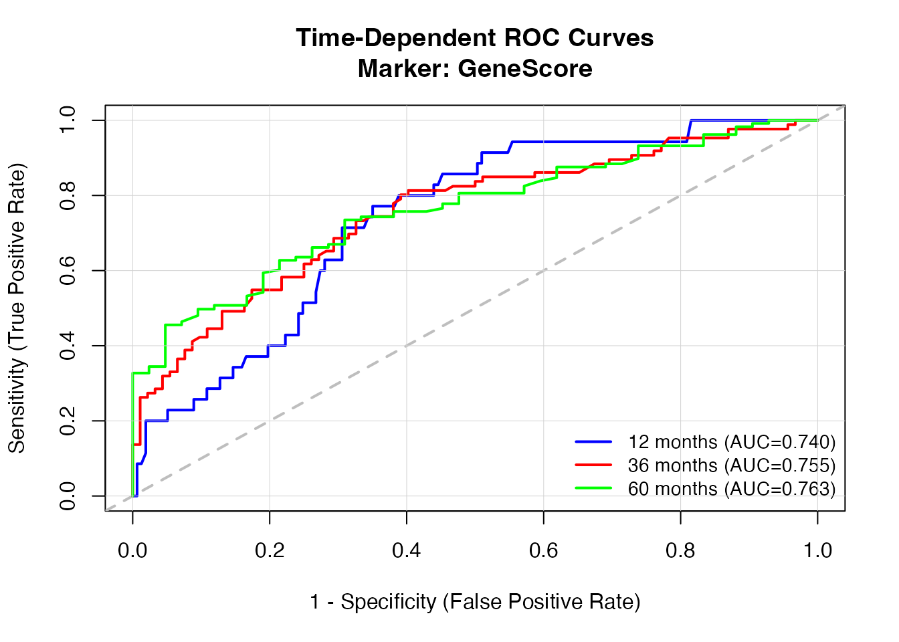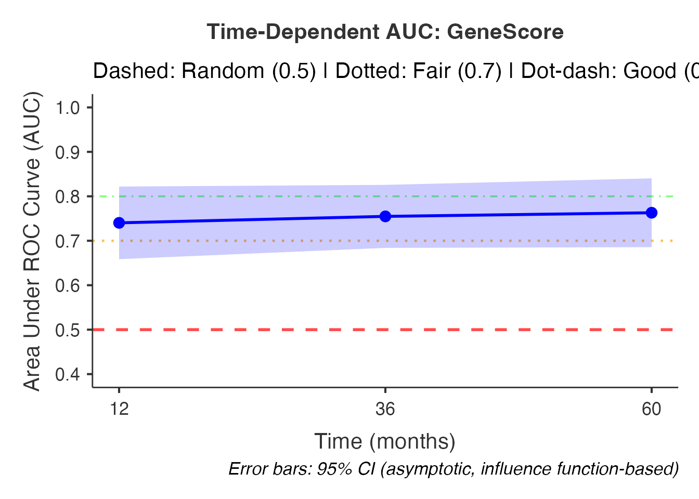

------------------------------------------------------------------------

### 12. References

#### Statistical Methods

- Blanche P, Dartigues JF, Jacqmin-Gadda H (2013). Estimating and
  comparing time-dependent areas under receiver operating characteristic
  curves for censored event times with competing risks. *Statistics in
  Medicine*, 32(30), 5381-5397.
- Hung H, Chiang CT (2010). Estimation methods for time-dependent AUC
  models with survival data. *Canadian Journal of Statistics*, 38(1),
  8-26.
- DeLong ER, DeLong DM, Clarke-Pearson DL (1988). Comparing the areas
  under two or more correlated receiver operating characteristic curves:
  a nonparametric approach. *Biometrics*, 44(3), 837-845.
- Robin X, Turck N, Hainard A, et al. (2011). pROC: an open-source
  package for R and S+ to analyze and compare ROC curves. *BMC
  Bioinformatics*, 12, 77.
- Youden WJ (1950). Index for rating diagnostic tests. *Cancer*, 3(1),
  32-35.

#### R Packages

- **timeROC**: Time-dependent ROC curve estimation
- **pROC**: Binary ROC curve analysis, DeLong test, bootstrap comparison
- **ggplot2**: AUC-over-time plot visualization
- **glue**: HTML template rendering
- **scales**: Axis label formatting

#### AUC Interpretation Guidelines

| AUC Range | Interpretation | Clinical Guidance |
|----|----|----|
| 0.90-1.00 | Excellent | Strong discriminative ability; suitable for clinical decision-making |
| 0.80-0.89 | Good | Useful for clinical purposes with appropriate validation |
| 0.70-0.79 | Fair | Limited but potentially useful in combination with other markers |
| 0.60-0.69 | Poor | Insufficient for standalone clinical use |
| 0.50-0.59 | Fail | No better than random chance |
| \< 0.50 | Reversed | Marker direction likely inverted; consider negating values |
