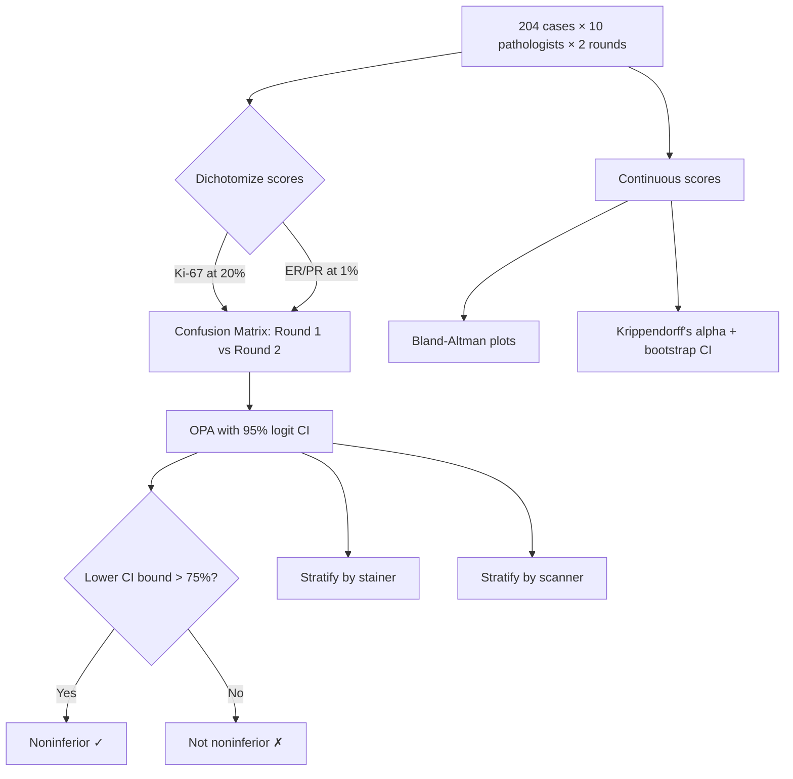
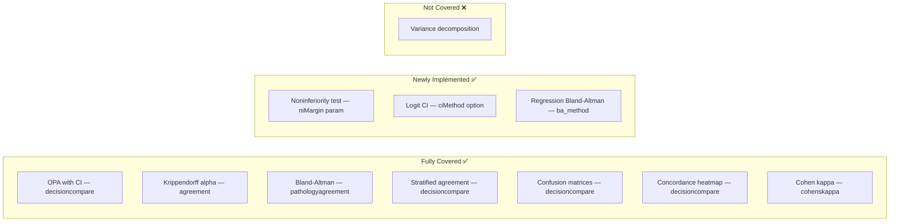

# Citation Review: Abele et al. (2023) — Noninferiority of AI-Assisted Analysis of Ki-67 and ER/PR

---

## 📚 ARTICLE SUMMARY

- **Title/Label**: Noninferiority of Artificial Intelligence–Assisted Analysis of Ki-67 and Estrogen/Progesterone Receptor in Breast Cancer Routine Diagnostics
- **Design & Cohort**: Multi-center, multi-rater noninferiority validation study. 204 female patients with invasive breast cancer (168 IDC, 36 ILC). Core biopsies from clinical routine (2016–2020), scored by 10 pathologists from 8 sites in 2 rounds (without and with AI assistance), 1-month washout. 3 staining systems, 5 WSI scanners, 1 microscope camera. Total: 4,080 observations (204 cases × 10 pathologists × 2 rounds).
- **Key Endpoints**:
  - Primary: Intraobserver agreement rate (Round 1 vs Round 2) for categorized Ki-67 and ER/PR scores with noninferiority margin of 75%
  - Secondary: Interobserver reliability (Krippendorff's alpha), stratified agreement by stainer/scanner, AI confirmation rates
- **Key Analyses**:
  - Noninferiority testing with 75% agreement margin (95% logit CIs)
  - Overall percent agreement (OPA) with 95% logit confidence intervals
  - Krippendorff's alpha for interobserver reliability with bootstrap 95% CIs
  - Bland-Altman plots for continuous score differences
  - Stratified agreement analysis by stainer and scanner
  - Confusion matrices for categorized scores
  - Agreement rates for AI confirmation by pathologist

---

## 📑 ARTICLE CITATION

| Field     | Value |
|-----------|-------|
| Title     | Noninferiority of Artificial Intelligence–Assisted Analysis of Ki-67 and Estrogen/Progesterone Receptor in Breast Cancer Routine Diagnostics |
| Journal   | Modern Pathology |
| Year      | 2023 |
| Volume    | 36 |
| Issue     | — |
| Pages     | 100033 |
| DOI       | 10.1016/j.modpat.2022.100033 |
| PMID      | TODO — not found in text |
| Publisher | Elsevier Inc. on behalf of the United States & Canadian Academy of Pathology |
| ISSN      | 0893-3952 |

---

## 🚫 Skipped Sources

*None — the PDF was fully readable (12 pages).*

---

## 🧪 EXTRACTED STATISTICAL METHODS

| Method / Model | Role (primary/secondary) | Variants & Options | Assumptions/Diagnostics | References (sec/page) |
|---|---|---|---|---|
| Noninferiority test (agreement rate) | Primary | 75% noninferiority margin; lower bound of 95% CI must exceed 75% | Assumes independence of paired assessments; logit CI method accounts for bounded proportion | Statistical Analysis, p. 5 |
| Overall Percent Agreement (OPA) | Primary | Confusion matrices comparing categorized Round 1 vs Round 2; dichotomized at Ki-67 20%, ER/PR 1% | Binary classification of continuous scores | Statistical Analysis, p. 5; Table 4 |
| 95% Logit Confidence Intervals | Primary | CIs for agreement proportions computed on logit scale | Better coverage for proportions near boundaries than Wald CIs | Statistical Analysis, p. 5 |
| Krippendorff's alpha | Secondary (interobserver) | α for multi-rater reliability; ordinal/interval data on case level | α ranges 0–1; assumes exchangeable raters; bootstrap CIs | Results, p. 7; Interobserver Reliability section |
| Bootstrap CIs | Secondary | For Krippendorff's alpha 95% CIs | Non-parametric; number of bootstrap samples not specified | Statistical Analysis, p. 5 |
| Bland-Altman plots | Secondary (visualization) | Score differences (Round 1 − Round 2) vs means; mean diff and ±1.96 SD limits | Assumes approximately normal differences; heteroscedasticity visible in Fig. 5 | Figure 5, p. 6 |
| Stratified agreement analysis | Secondary | Agreement rates stratified by stainer (Dako/Leica/Roche) and scanner (6 types) separately | Independence within strata | Tables 5–6, p. 7–8 |
| Descriptive statistics | Supporting | Frequencies, percentages; sample distribution across staining/scanning combinations | N/A | Tables 1–3 |

**Software**: R (version 3.5.3), Python 3.8.12, SciPy 1.7.1

---

## 🧰 CLINICOPATH JAMOVI COVERAGE MATRIX

| Article Method | Jamovi Function(s) | Coverage | Notes / Workarounds |
|---|---|:---:|---|
| Noninferiority test (agreement rate with 75% margin) | `decisioncompare` (OPA + niMargin) | ✅ | OPA table with configurable noninferiority margin (default 75%), formal "Noninferior? Yes/No" conclusion based on lower CI bound vs margin |
| Overall Percent Agreement | `decisioncompare` (opa option) | ✅ | OPA table with configurable CI method and noninferiority testing |
| 95% Logit Confidence Intervals for proportions | `decisioncompare` (ciMethod=logit) | ✅ | CI method option: Wilson, Logit, or Clopper-Pearson (Exact) |
| Krippendorff's alpha (multi-rater) | `agreement` (interrater) | ✅ | Full Krippendorff's alpha with bootstrap CI available |
| Bootstrap CIs for alpha | `agreement` (interrater) | ✅ | Bootstrap CI option available |
| Bland-Altman plots | `pathologyagreement` (ba_method) | ✅ | Standard and regression-based limits of agreement; proportional bias test |
| Stratified agreement by stainer/scanner | `decisioncompare` (stratify option) | ✅ | Newly implemented stratification variable support |
| Confusion matrices (categorized scores) | `decisioncompare`, `conttables` | ✅ | Per-test contingency tables available |
| Agreement rates across individual readings | `decisioncompare` | ✅ | Per-test metrics available |
| Paired intraobserver comparison (Round 1 vs Round 2) | `conttablespaired` (McNemar), `cohenskappa` | ✅ | Paired analysis with kappa and McNemar available |
| Multi-rater interobserver reliability | `agreement` (interrater), `icccoeff` | ✅ | Multiple rater agreement with various coefficients |
| Concordance heatmap (per-case visualization) | `decisioncompare` (heatmap option) | ✅ | Newly implemented per-case agreement heatmap |

**Legend**: ✅ covered · 🟡 partial · ❌ not covered

---

## 🧠 CRITICAL EVALUATION OF STATISTICAL METHODS

**Overall Rating**: 🟢 Appropriate with minor gaps

**Summary**: This is a well-designed, methodologically rigorous noninferiority study with the largest image variability coverage to date for AI-assisted IHC scoring. The choice of noninferiority testing with a pre-specified 75% agreement margin is appropriate for the regulatory context. Krippendorff's alpha with bootstrap CIs is the correct choice for multi-rater reliability. The Bland-Altman plots complement the categorical analysis well. The main statistical gaps are the lack of Cohen's kappa for chance-corrected pairwise agreement and the absence of ICC for continuous scores.

### Checklist

| Aspect | Assessment | Evidence (section/page) | Recommendation |
|---|:---:|---|---|
| Design–method alignment | 🟢 | Two-round crossover design with washout period; noninferiority framework appropriate for AI validation; 10 raters from 8 sites provides good external validity | Excellent match between design and analysis |
| Assumptions & diagnostics | 🟡 | Bland-Altman plots show heteroscedasticity (wider differences at mid-range scores) but this is not formally addressed; logit CIs appropriate for bounded proportions | Consider log-transformation or percentage-based limits of agreement; report Bland-Altman with proportional bias test |
| Sample size & power | 🟢 | n=204 with stratified sampling to cover clinical score ranges; 4,080 total observations; sample selection was stratified to include cases near clinical cutoffs | Well-powered; explicit stratification for challenging cases is a strength |
| Multiplicity control | 🟡 | Two coprimary hypotheses (Ki-67 and ER/PR both must be noninferior); no formal multiple testing correction stated, though the overall hypothesis requires both to pass | The "both must pass" requirement effectively controls familywise error at α; could be more explicit about this |
| Model specification & confounding | 🟢 | Stratified analyses by stainer and scanner control for major confounders; ROI selection freedom in both rounds creates realistic variability; AI tool not adapted to conditions | Stratified analysis is appropriate; consider mixed-effects model for formal variance decomposition |
| Missing data handling | 🟢 | 7 cases excluded due to software error (explicit); all other cases scored by all investigators; transparent reporting of exclusions | Adequate; 7/2040 = 0.3% missing is negligible |
| Effect sizes & CIs | 🟢 | Agreement rates with 95% CIs throughout; Krippendorff's alpha with bootstrap CIs; Bland-Altman with mean difference and limits | CIs reported for all key metrics; noninferiority margin clearly defined |
| Validation & calibration | 🟢 | Two additional validation experiments (AI without human intervention on predefined ROIs; full-slide analysis); multi-method comparison (hotspot, IKWG 4R, all-tumor-cell) | Strong multi-faceted validation approach |
| Reproducibility/transparency | 🟡 | Software versions reported (R 3.5.3, Python 3.8.12, SciPy 1.7.1); AI tool specified (Mindpeak); but no code/data sharing; bootstrap iterations not specified; logit CI formula not shown | Specify bootstrap iterations; consider sharing analysis code; note R 3.5.3 is quite old (2019) |

### Scoring Rubric (0–2 per aspect, total 0–18)

| Aspect | Score (0–2) | Badge |
|---|:---:|:---:|
| Design–method alignment | 2 | 🟢 |
| Assumptions & diagnostics | 1 | 🟡 |
| Sample size & power | 2 | 🟢 |
| Multiplicity control | 1 | 🟡 |
| Model specification & confounding | 2 | 🟢 |
| Missing data handling | 2 | 🟢 |
| Effect sizes & CIs | 2 | 🟢 |
| Validation & calibration | 2 | 🟢 |
| Reproducibility/transparency | 1 | 🟡 |

**Total Score**: 15/18 → Overall Badge: 🟢 Robust

### Red Flags

None of the classic red flags apply. This is a well-conducted study. Minor observations:

1. **No chance-corrected agreement (kappa)**: The study uses OPA and Krippendorff's alpha but does not report Cohen's kappa for pairwise intraobserver agreement. While OPA is the primary metric for the noninferiority test, kappa would provide additional insight into chance-corrected agreement for the binary categorization.

2. **Heteroscedastic Bland-Altman**: The Bland-Altman plots (Figure 5) show clear heteroscedasticity — wider differences at moderate scores, narrower at extremes. The standard ±1.96 SD limits may be misleading. Ratio-based or regression-based limits of agreement would be more appropriate.

3. **Old R version**: R 3.5.3 (March 2019) is quite old. While unlikely to affect results, modern reproducibility standards suggest using current versions.

4. **No formal variance decomposition**: With 10 raters, 204 cases, 2 rounds, 3 stainers, and 6 scanners, a mixed-effects or generalizability theory model could partition variance into clinically meaningful components (rater, case, stainer, scanner, interaction effects). This would be more informative than separate stratified analyses.

---

## 🔎 GAP ANALYSIS (WHAT'S MISSING)

### Gap 1: Noninferiority Test Output — ✅ IMPLEMENTED
- **Method**: Formal noninferiority test with pre-specified margin, displaying "noninferior: yes/no" conclusion based on whether lower CI bound exceeds the margin
- **Implementation**: Added `niMargin` (Number, 50–99%, default 75%) and `niResult` column to `decisioncompare` OPA table. Lower CI bound compared against margin; "Yes"/"No" conclusion displayed.
- **Files**: `decisioncompare.a.yaml`, `decisioncompare.r.yaml`, `decisioncompare.u.yaml`, `decisioncompare.b.R`

### Gap 2: Logit Confidence Intervals for Proportions — ✅ IMPLEMENTED
- **Method**: CI on logit scale: logit(p) ± z × SE, then back-transform
- **Implementation**: Added `ciMethod` List option (wilson/logit/exact) to `decisioncompare`. Replaced `.wilsonCI()` with `.proportionCI()` supporting all three methods. Logit falls back to exact for boundary cases (p=0 or p=1).
- **Files**: `decisioncompare.a.yaml`, `decisioncompare.u.yaml`, `decisioncompare.b.R`

### Gap 3: Variance Decomposition / Generalizability Theory
- **Method**: Mixed-effects model or G-theory partitioning variance into rater, case, stainer, scanner, and interaction components
- **Impact**: Would quantify how much variability is due to each source; critical for understanding AI tool reliability across conditions
- **Closest existing function**: `icccoeff` provides ICC but not full variance decomposition across multiple facets
- **Exact missing options**: Multi-facet variance decomposition; generalizability coefficients

### Gap 4: Heteroscedasticity-Adjusted Bland-Altman — ✅ IMPLEMENTED
- **Method**: Regression-based limits of agreement (Bland & Altman 1999) where bias and limits vary as functions of the mean
- **Implementation**: Added `ba_method` List option (standard/regression) to `pathologyagreement`. Regression mode fits bias trend via `lm(differences ~ means)` and spread trend via `lm(|residuals| ~ means)`, then computes varying LoA. Proportional bias slope and p-value added to agreement table. Plot shows regression lines instead of horizontal limits.
- **Files**: `pathologyagreement.a.yaml`, `pathologyagreement.u.yaml`, `pathologyagreement.r.yaml`, `pathologyagreement.b.R`

---

## 🧭 ROADMAP (IMPLEMENTATION PLAN)

### Priority 1: Add Noninferiority Margin and Logit CI to `decisioncompare`

**Target**: Extend OPA table with noninferiority testing and alternative CI methods

**.a.yaml** (add options after `opa`):
```yaml
    - name: niMargin
      title: Noninferiority Margin (%)
      type: Number
      default: 75
      min: 50
      max: 99
      description:
          ui: >
            Noninferiority margin for agreement rate. The test is noninferior if the
            lower bound of the CI exceeds this margin. Default 75% follows regulatory
            convention for AI diagnostic tools.
          R: >
            Noninferiority margin as percentage (default 75).

    - name: ciMethod
      title: CI Method for Agreement
      type: List
      options:
        - title: Wilson Score
          name: wilson
        - title: Logit
          name: logit
        - title: Clopper-Pearson (Exact)
          name: exact
      default: wilson
      description:
          ui: >
            Method for computing confidence intervals. Wilson is recommended for most
            cases. Logit is preferred when proportions are near 0 or 1. Exact
            (Clopper-Pearson) is most conservative.
          R: >
            CI method: wilson, logit, or exact (Clopper-Pearson).
```

**.b.R** (extend `.wilsonCI()` → `.proportionCI()`, add logit and exact methods):
```r
.proportionCI = function(x, n, method = "wilson", alpha = 0.05) {
    if (n == 0) return(list(est = NA_real_, lower = NA_real_, upper = NA_real_))
    p_hat <- x / n
    z <- qnorm(1 - alpha / 2)

    if (method == "wilson") {
        denom <- 1 + z^2 / n
        center <- (p_hat + z^2 / (2 * n)) / denom
        margin <- z * sqrt((p_hat * (1 - p_hat) + z^2 / (4 * n)) / n) / denom
        lower <- max(0, center - margin)
        upper <- min(1, center + margin)
    } else if (method == "logit") {
        if (p_hat == 0 || p_hat == 1) {
            # Fall back to exact for boundary cases
            bt <- binom.test(x, n, conf.level = 1 - alpha)
            return(list(est = p_hat, lower = bt$conf.int[1], upper = bt$conf.int[2]))
        }
        logit_p <- log(p_hat / (1 - p_hat))
        se_logit <- sqrt(1 / (n * p_hat * (1 - p_hat)))
        logit_lower <- logit_p - z * se_logit
        logit_upper <- logit_p + z * se_logit
        lower <- 1 / (1 + exp(-logit_lower))
        upper <- 1 / (1 + exp(-logit_upper))
    } else {  # exact (Clopper-Pearson)
        bt <- binom.test(x, n, conf.level = 1 - alpha)
        lower <- bt$conf.int[1]
        upper <- bt$conf.int[2]
    }
    list(est = p_hat, lower = lower, upper = upper)
},
```

**.r.yaml** (add columns to opaTable for noninferiority):
```yaml
        - name: niMargin
          title: 'NI Margin'
          type: number
          format: pc
          visible: (opa)
        - name: niResult
          title: 'Noninferior?'
          type: text
          visible: (opa)
```

**.u.yaml** (add to Statistical Options):
```yaml
      - type: TextBox
        name: niMargin
        label: Noninferiority Margin (%)
        format: number
        enable: (opa)
      - type: ComboBox
        name: ciMethod
        label: CI Method
        enable: (opa)
```

#### Validation
- Replicate Abele et al. Table 4: Ki-67 87.6% [85.0, 89.8], ER/PR 89.4% [87.6, 91.0] using logit CIs
- Compare Wilson vs logit vs exact for proportions at 50%, 75%, 90%, 99% with n=100, 500, 1000
- Verify noninferiority conclusion flips correctly when lower CI is above/below margin

---

### Priority 2: Add Heteroscedasticity Options to `pathologyagreement`

**Target**: Add proportional bias test and regression-based limits to Bland-Altman

This is a lower priority since `pathologyagreement` already provides standard Bland-Altman. The enhancement would add:
- Kendall's tau test for proportional bias (difference vs mean correlation)
- Regression-based limits of agreement (Bland & Altman 1999)
- Option to log-transform before computing limits

**.a.yaml** (sketch):
```yaml
    - name: blandAltmanRegression
      title: Regression-based Limits of Agreement
      type: Bool
      default: false
      description:
          R: >
            Use regression-based limits when bias or spread varies with magnitude.
```

---

### Priority 3: Multi-Facet Variance Decomposition (Future)

This would be a new function or major extension to `icccoeff`/`agreement`. It requires:
- `lme4::lmer()` or similar for crossed random effects
- Variance partition: rater, case, stainer, scanner, residual
- Generalizability coefficients (G-coefficient, D-study)
- This is a medium-to-high effort feature that would serve studies like Abele et al. well

---

## 🧪 TEST PLAN

### Unit Tests
1. **Logit CI**: Compare against `binom` package `binom.logit()` for known proportions (0.5, 0.75, 0.90, 0.99) at n=50, 100, 500
2. **Noninferiority**: Create test cases where lower CI bound is exactly at, above, and below margin; verify conclusion
3. **Replicate Table 4**: Ki-67 629/718 = 87.6%, logit CI [85.0, 89.8]; ER/PR 1176/1315 = 89.4%, logit CI [87.6, 91.0]
4. **Stratified agreement**: Verify per-stainer results match Table 5 patterns

### Edge Cases
- Perfect agreement (n/n = 100%): logit CI should not fail (boundary handling)
- Zero agreement (0/n = 0%): logit CI should fall back to exact
- Single stratum with very small n (< 10)
- All raters agree on same category (kappa undefined)

### Reproducibility
- Example dataset: Create synthetic 10-rater × 200-case × 2-round dataset mimicking Abele et al. structure
- Save options JSON for standard validation workflow

---

## 📦 DEPENDENCIES

No new R package dependencies required for Priority 1 (logit CI and noninferiority):
- `binom.test()` from base R for exact CI fallback
- `qnorm()` from base R for logit CI
- All computation is pure base R

For Priority 2 (regression Bland-Altman):
- Could use base `lm()` for regression-based limits
- No new dependency needed

For Priority 3 (variance decomposition, future):
- `lme4` — mixed-effects models (already commonly available)
- `gtheory` — generalizability theory package (new dependency)

---

## 🧭 PRIORITIZATION

| Rank | Item | Impact | Effort | Notes |
|---|---|---|---|---|
| 1 | ✅ Add logit CI method to `decisioncompare` OPA table | High | Low | Implemented: `.proportionCI()` with wilson/logit/exact |
| 2 | ✅ Add noninferiority margin + conclusion to OPA table | High | Low | Implemented: `niMargin` param + `niResult` column |
| 3 | ✅ Add CI method UI controls to `decisioncompare` | Medium | Low | Implemented: ComboBox + TextBox in Statistical Options |
| 4 | ✅ Regression-based Bland-Altman limits in `pathologyagreement` | Medium | Medium | Implemented: `ba_method` option, regression LoA in plot + table |
| 5 | Multi-facet variance decomposition | Medium | High | Future: New function or major `icccoeff` extension; lme4-based |

---

## 🧩 DIAGRAMS

### Statistical Analysis Pipeline Used in Article



### ClinicoPath Coverage for This Study



---

## Caveats

1. The article uses "logit CIs" for agreement proportions. The exact formula is not shown in the paper but is standard: logit-transform the proportion, compute Wald CI on the logit scale, then back-transform. The ClinicoPath `decisioncompare` currently uses Wilson score CIs, which are generally similar but can differ for proportions near 0 or 1.

2. The Krippendorff's alpha was computed at the case level (not ROI level), meaning that each pathologist's score per case (regardless of which ROI they chose) was used. This is the standard approach for interobserver reliability.

3. The study uses coprimary hypotheses (both Ki-67 AND ER/PR must be noninferior). This implicitly controls the familywise error rate without requiring Bonferroni correction, since the overall null is rejected only if both individual nulls are rejected.

4. The noninferiority margin of 75% follows FDA regulatory convention for AI diagnostic tools (reference 20: Roche Ventana Medical Systems, FDA k121033). This is a relatively generous margin — typical clinical studies might use tighter margins.

5. The number of bootstrap replications for Krippendorff's alpha CIs is not reported, which is a minor reproducibility concern.

---

*Generated by ClinicoPath Module Review System — 2026-02-08*
