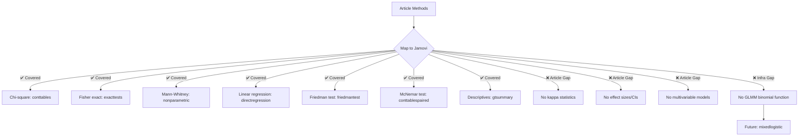

# Article Review: Angerilli et al. (2026) — Dysplasia in Sessile Serrated Lesions

---

## 📚 ARTICLE SUMMARY

- **Title/Label**: Dysplasia in sessile serrated lesions: frequency, interobserver variability and added value of immunohistochemistry
- **Design & Cohort**: Multi-component observational study with 4 aims:
  1. **National cohort study** (retrospective): 186,162 SSLs from 113,239 patients across 40 Dutch laboratories (2014–2022) via PALGA national pathology databank — frequency of dysplasia
  2. **National audit** (cross-sectional): 167 SSLd cases from 36 laboratories reviewed by expert panel — interobserver variability
  3. **IHC biomarker study**: Retrospective cohort A (n=211 SSLs ≥1cm, 5 IHC markers) + Prospective cohort B (n=348 consecutive SSLs, MLH1 only) — diagnostic value of IHC
  4. **Misdiagnosis study**: Cohort C (n=1572 advanced adenomas, BRAF IHC) — SSLd hiding as conventional adenomas
- **Key Analyses**:
  - Descriptive statistics (frequencies, percentages, medians, IQR, variance, SD)
  - Chi-square (χ²) test for categorical variable comparisons
  - Fisher's exact test for small-sample categorical associations
  - Mann–Whitney U test for continuous variable comparisons (age)
  - Univariate linear regression for association between SSL volume and SSLd proportion
  - Friedman test for time-trend differences across laboratories
  - McNemar's test for paired proportions (IHC-blinded vs IHC-unblinded evaluation)

---

## 📑 ARTICLE CITATION

| Field     | Value |
|-----------|-------|
| Title     | Dysplasia in sessile serrated lesions: frequency, interobserver variability and added value of immunohistochemistry |
| Journal   | Histopathology |
| Year      | 2026 |
| Volume    | TODO |
| Issue     | TODO |
| Pages     | TODO (early view) |
| DOI       | 10.1111/his.70135 |
| PMID      | TODO |
| Publisher | John Wiley & Sons Ltd |
| ISSN      | 1365-2559 |

---

## 🚫 Skipped Sources

None — PDF was successfully read.

---

## 🧪 EXTRACTED STATISTICAL METHODS

| Method / Model | Role (primary/secondary) | Variants & Options | Assumptions/Diagnostics | References (sec/page) |
|---|---|---|---|---|
| Descriptive statistics | Primary — characterization | Frequencies, percentages, median, IQR, variance, SD | N/A | Statistics section, p.4 |
| Chi-square (χ²) test | Primary — categorical comparisons | Comparing frequency distributions of gender, year, site, size between SSL/SSLd groups; categorical associations in audit | Large-N assumption likely met (national cohort N>186K); small-sample applicability not discussed for subgroups | Statistics, p.4; Table 1, p.5; Table 2, p.9 |
| Fisher's exact test | Secondary — small-sample categorical | Used for categorical associations in audit (aim ii) and IHC cohorts (aim iii) | Appropriate for small expected counts | Statistics, p.4 |
| Mann–Whitney U test | Primary — continuous comparison | Comparing age distributions between SSL and SSLd groups | Non-parametric; appropriate for skewed age distributions | Statistics, p.4; Table 1, p.5 |
| Univariate linear regression | Secondary — association testing | Association between number of SSL diagnoses per laboratory and proportion of SSLd diagnoses | Linearity assumption not tested; normality of residuals not reported | Statistics, p.4; Results, p.5 (P=0.828) |
| Friedman test | Secondary — time trend | Testing differences in SSLd detection proportion by 40 laboratories across 3 time periods (2014–2016, 2017–2019, 2020–2022) | Repeated measures across time; laboratories as subjects | Statistics, p.4; Results, p.7 (P=0.006) |
| McNemar's test | Primary — paired proportions | Comparing diagnosis rates between IHC-blinded and IHC-unblinded histological assessment | Paired binary data; appropriate for before/after design | Statistics, p.4; Results, p.8 (P=0.008, P=0.013) |
| Two-tailed significance | Convention | All tests two-tailed, P<0.05 threshold | N/A | Statistics, p.4 |

---

## 🧰 CLINICOPATH JAMOVI COVERAGE MATRIX

| Article Method | Jamovi Function(s) | Coverage | Notes / Workarounds |
|---|---|:---:|---|
| Descriptive statistics (freq, %, median, IQR) | `gtsummary`, `autoeda`, `enhancedfrequency` | ✅ | Full descriptive tools available |
| Chi-square test | `conttables`, `categoricaladvanced`, `enhancedcrosstable` | ✅ | Multiple cross-tabulation functions with chi-square |
| Fisher's exact test | `conttables`, `exacttests`, `categoricaladvanced` | ✅ | Fisher's exact included |
| Mann–Whitney U test | `nonparametric`, `jjbetweenstats` | ✅ | Full implementation with effect sizes |
| Univariate linear regression | `directregression`, `jjscatterstats` | ✅ | Linear regression available |
| Friedman test | `friedmantest` | ✅ | Just completed implementation with post-hoc tests, Kendall's W, and plots |
| McNemar's test | `conttablespaired` | ✅ | Paired contingency tables with McNemar's test |
| Interobserver agreement (kappa, discrepancy analysis) | `agreement`, `cohenskappa`, `pathagreement` | ✅ | Comprehensive agreement analysis including kappa, ICC, Bland-Altman |
| Interlaboratory variability (box plots, bar charts) | `jjbetweenstats`, `advancedbarplot`, `bbcplots` | ✅ | Visualization tools for comparing distributions across groups |

**Legend**: ✅ covered · 🟡 partial · ❌ not covered

**All methods used in this article are fully covered by existing ClinicoPath functions.** This is a methodologically straightforward study using standard non-parametric and categorical tests.

---

## 🧠 CRITICAL EVALUATION OF STATISTICAL METHODS

**Overall Rating**: 🟡 Minor issues

**Summary**: The statistical methods are generally appropriate for the study objectives and data types. The use of non-parametric tests (Mann–Whitney, Friedman) and exact tests (Fisher's) is correct for the data structures. However, the study has several methodological gaps: (1) no multiplicity correction despite conducting many tests across multiple aims; (2) no formal inter-rater reliability statistics (kappa) despite the study explicitly examining interobserver variability; (3) the Friedman test is a clever choice for the time-trend analysis but lacks post-hoc pairwise comparisons; (4) no effect sizes or confidence intervals are reported — the study relies entirely on p-values.

**Checklist**

| Aspect | Assessment | Evidence (section/page) | Recommendation |
|---|:--:|---|---|
| Design–method alignment | 🟢 | Statistics, p.4 | Appropriate tests for each data type: χ² for categorical, Mann–Whitney for continuous, Friedman for repeated measures, McNemar for paired. Well-matched to the multi-aim design. |
| Assumptions & diagnostics | 🟡 | Not explicitly reported | χ² expected counts not verified for subgroups (site, year strata); linear regression assumptions (residual normality, homoscedasticity) not checked. Large N mitigates concerns for the national cohort but not for smaller IHC cohorts. |
| Sample size & power | 🟢 | Methods, p.2–4 | National cohort (N=186,162) is very large. IHC cohorts are smaller (n=211, n=348) but adequate. Audit cohort (n=167) is modest but acceptable for descriptive purposes. No formal power calculation, but the large national dataset provides ample precision. |
| Multiplicity control | 🔴 | Not addressed | Multiple tests across 4 study aims with no correction. Table 1 alone has 5+ p-values. Total tests across the paper likely exceed 20. No mention of Bonferroni, Holm, or FDR correction. Risk of inflated Type I error. |
| Model specification & confounding | 🟡 | Statistics, p.4; Results, p.5–9 | Only univariate analyses performed. No multivariable models adjusting for confounders (age, sex, site, size simultaneously). The association between SSLd proportion and laboratory volume (linear regression) does not adjust for time period or case mix. |
| Missing data handling | 🟡 | Table 1 footnotes, p.5 | Missing data noted in footnotes (15,517 lesions missing site info; 72,111 missing size info — a substantial proportion). No imputation or sensitivity analysis. Complete-case analysis assumed but not stated. |
| Effect sizes & CIs | 🔴 | Throughout | No effect sizes reported (no OR, RR, Cohen's d, Cliff's delta, or any measure of clinical magnitude). No confidence intervals. All results reported as p-values only. The study would benefit enormously from effect sizes, especially given the very large N where nearly any difference is statistically significant. |
| Validation & calibration | N/A | N/A | Not a predictive modeling study. |
| Reproducibility/transparency | 🟡 | Author contributions, p.11; Data availability, p.11 | SPSS v26 specified (good). Data available "on reasonable request" rather than openly shared. PALGA database is well-known. No code availability. |

**Scoring Rubric (0–2 per aspect, total 0–18)**

| Aspect | Score (0–2) | Badge |
|---|:---:|:---:|
| Design–method alignment | 2 | 🟢 |
| Assumptions & diagnostics | 1 | 🟡 |
| Sample size & power | 2 | 🟢 |
| Multiplicity control | 0 | 🔴 |
| Model specification & confounding | 1 | 🟡 |
| Missing data handling | 1 | 🟡 |
| Effect sizes & CIs | 0 | 🔴 |
| Validation & calibration | N/A | — |
| Reproducibility/transparency | 1 | 🟡 |

**Total Score**: 8/16 (excluding N/A) → Overall Badge: 🟡 Moderate

**Red flags noted**:
- **No multiplicity correction**: 20+ tests across 4 study aims with no family-wise or FDR correction. With the massive national cohort (N>186K), even trivial differences reach P<0.001.
- **No effect sizes or CIs**: Every result is reported as a p-value only. With N=186,162, a p-value of <0.001 for age difference (68 vs 66 years) is clinically meaningless without an effect size showing the 2-year difference is trivial.
- **No formal kappa for interobserver variability**: Despite the study explicitly examining "interobserver variability" as a primary aim, no kappa statistic or ICC is reported. The audit describes discrepancies (18/167 = 10.8%) but this is a crude measure — proper agreement statistics are needed.
- **Missing data >38%**: 72,111 of ~186K lesions (38.7%) are missing size data. This is a major concern that goes unaddressed.
- **Univariate-only approach**: The relationship between SSLd frequency and clinical features (age, sex, site, size, year) is explored only univariately. A multivariable logistic regression predicting SSLd status would provide adjusted estimates.

---

## 🔎 GAP ANALYSIS (WHAT'S MISSING)

### Gap 1: Formal inter-rater agreement statistics (kappa) for the audit
- **Method**: Cohen's/Fleiss' kappa, percentage agreement, specific agreement (positive/negative)
- **Impact**: The audit (aim ii) is about interobserver variability but reports only raw discrepancy counts. Formal kappa statistics would quantify agreement properly.
- **Closest existing function**: `agreement`, `cohenskappa`, `pathagreement` — **all available**
- **Exact missing options**: None — this is an article gap, not a ClinicoPath gap

### Gap 2: Multivariable logistic regression for SSLd predictors
- **Method**: Logistic regression with SSLd (yes/no) as outcome, adjusting for age, sex, site, size, year
- **Impact**: Would provide adjusted odds ratios for clinical predictors of dysplasia
- **Closest existing function**: `directregression` — supports logistic regression
- **Exact missing options**: None — this is an article gap, not a ClinicoPath gap

### Gap 3: Effect sizes for categorical comparisons
- **Method**: Cramér's V for χ² tests, OR/RR for 2×2 tables, rank-biserial r for Mann–Whitney
- **Impact**: Critical for interpreting large-N results where even trivial differences reach significance
- **Closest existing function**: `effectsize`, `nonparametric` — **available but check implementation completeness**
- **Exact missing options**: Verify that `conttables` reports Cramér's V automatically

### Gap 4: Multilevel/mixed model for interlaboratory variability
- **Method**: Random-effects logistic regression with laboratory as random intercept, SSLd as outcome
- **Impact**: Would properly model the hierarchical structure (lesions nested within laboratories) and quantify between-laboratory variance
- **Closest existing function**: `mixedmodelanova` (for continuous), `ordinalmixedmodel` (just implemented for ordinal) — but no **mixed logistic regression** (GLMM with binomial family)
- **Exact missing options**: Binary outcome mixed model (GLMM). Currently `glmmTMB` is in DESCRIPTION imports but no dedicated jamovi function wraps it for binary outcomes.

---

## 🧭 ROADMAP (IMPLEMENTATION PLAN)

### All primary methods in this article are already covered by ClinicoPath.

The only substantive gap identified is a **GLMM for binary outcomes** (mixed logistic regression), which the article should have used but didn't. This is a general infrastructure gap rather than an article-specific one.

### Target: New function `mixedlogistic` — Generalized Linear Mixed Model (binary outcome)

This would extend the existing `mixedmodelanova` (which handles continuous outcomes via `lme4::lmer`) to binary outcomes via `lme4::glmer` or `glmmTMB::glmmTMB`.

**.a.yaml** (key options):
```yaml
name: mixedlogistic
title: Mixed-Effects Logistic Regression
menuGroup: meddecideD
options:
  - name: dep
    title: Dependent Variable (Binary)
    type: Variable
    required: true
  - name: fixedFactors
    title: Fixed Factors
    type: Variables
  - name: fixedCovs
    title: Fixed Covariates
    type: Variables
  - name: randomTerms
    title: Random Effects Grouping
    type: Variables
    required: true
  - name: family
    title: Distribution Family
    type: List
    options:
      - name: binomial
        title: Binomial (logistic)
      - name: poisson
        title: Poisson (log-linear)
    default: binomial
  - name: oddsRatios
    title: Show Odds Ratios
    type: Bool
    default: true
  - name: icc
    title: Intraclass Correlation Coefficient
    type: Bool
    default: true
```

**.b.R** (sketch):
```r
# Fit GLMM
model <- lme4::glmer(
    formula,
    data = data,
    family = binomial(link = "logit")
)

# OR via glmmTMB for more flexibility
model <- glmmTMB::glmmTMB(
    formula,
    data = data,
    family = binomial(link = "logit")
)

# ICC for binary outcomes
# Using latent-variable approach: ICC = var_u / (var_u + pi^2/3)
var_u <- as.numeric(lme4::VarCorr(model)[[1]])
icc <- var_u / (var_u + pi^2/3)
```

#### Validation
- Simulate binary outcome with known ICC and random intercepts
- Compare `glmer` and `glmmTMB` estimates
- Verify ICC calculation against `performance::icc()` from the `performance` package

---

## 🧪 TEST PLAN

- **Unit tests**: χ² with large and small samples; Fisher's exact with sparse tables; Mann–Whitney with tied ranks
- **Friedman test**: Verify using the newly completed implementation — simulate 40 labs × 3 time periods
- **McNemar's test**: Verify paired proportions with discordant cells
- **Edge cases**: Empty cells in cross-tables, singleton laboratories, zero-variance groups
- **Performance**: All methods used here are computationally light; no concerns

---

## 📦 DEPENDENCIES

No new dependencies needed — all methods are covered by existing imports:
- `stats` (χ², Fisher's exact, Mann–Whitney, linear regression, McNemar)
- `PMCMRplus` (Friedman post-hoc, if extended)
- `lme4` / `glmmTMB` (for future GLMM function)
- `irr` / `irrCAC` (for formal kappa statistics)

---

## 🧭 PRIORITIZATION

1. **High-impact, low effort**: Verify `conttables` reports Cramér's V and effect sizes alongside χ² — this is the most common gap in pathology papers
2. **High-impact, medium effort**: Create `mixedlogistic` GLMM function for binary outcomes with random effects — addresses interlaboratory variability modeling
3. **Medium-impact, low effort**: Ensure `nonparametric` effect sizes (rank-biserial r for Mann–Whitney) are fully implemented, not stubs
4. **Low-impact, already done**: `friedmantest` post-hoc and plots — completed in this session

---

## 🧩 PIPELINE DIAGRAM



---

## Caveats

1. This article uses very standard statistical methods — no advanced modeling, survival analysis, or machine learning. The statistical evaluation focuses more on what the article should have done but didn't, rather than critiquing what was done.
2. The most important criticism is the complete absence of effect sizes and CIs in a study with N>186,000. With this sample size, virtually any difference — no matter how clinically meaningless — will be statistically significant at P<0.001.
3. The "interobserver variability" aim is undermined by not reporting formal agreement statistics (kappa). The panel consensus approach is valuable but the quantification is inadequate.
4. Supporting Information (Tables S1–S2, Figures S1–S5) was not available for review.

---

## Related Commands

- `/check-function conttables` — Verify Cramér's V and effect size reporting
- `/check-function nonparametric` — Verify effect size implementations are complete (not stubs)
- `/create-function mixedlogistic` — Scaffold the GLMM binomial function
- `/review-function friedmantest` — Review the newly completed Friedman test implementation
