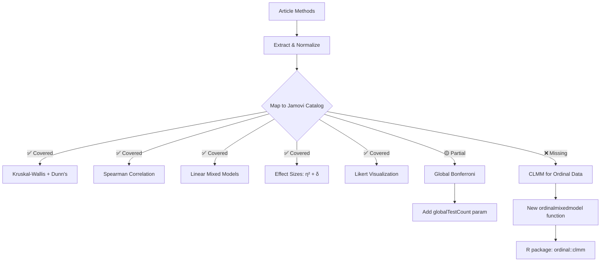
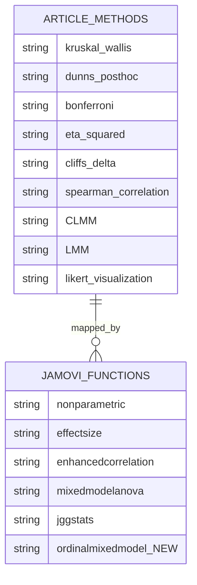

# Article Review: Backer et al. (2026) — WSI Scanner Image Quality and Diagnostic Sufficiency

---

## 📚 ARTICLE SUMMARY

- **Title/Label**: Perceived image quality and diagnostic sufficiency of whole slide imaging scanners: a pathologist-centred evaluation
- **Design & Cohort**: Cross-sectional, multi-scanner comparison study; 601 slides digitized on 4 WSI scanners, 96 selected for evaluation by 14 pathologists from a single academic institution (IPMD, University Hospital of Augsburg). Repeated-measures design: each slide scanned on all 4 scanners. 167 completed questionnaires.
- **Key Analyses**:
  - Kruskal–Wallis test for ordinal Likert-scale responses across 4 scanner groups
  - Dunn's post-hoc pairwise comparisons with Bonferroni correction
  - Eta-squared (η²) for Kruskal–Wallis effect sizes
  - Cliff's Delta (δ) for pairwise effect sizes
  - Spearman's rank correlation for inter- and intra-correlations between quality/sufficiency ratings
  - Cumulative link mixed models (CLMM) for ordinal subgroup analyses
  - Linear mixed models (LMM) for continuous viewing behaviour comparisons
  - Descriptive statistics (medians, proportions of insufficient ratings)

---

## 📑 ARTICLE CITATION

| Field     | Value |
|-----------|-------|
| Title     | Perceived image quality and diagnostic sufficiency of whole slide imaging scanners: a pathologist-centred evaluation |
| Journal   | Histopathology |
| Year      | 2026 |
| Volume    | TODO |
| Issue     | TODO |
| Pages     | TODO (early view) |
| DOI       | 10.1111/his.70136 |
| PMID      | TODO |
| Publisher | John Wiley & Sons Ltd |
| ISSN      | 1365-2559 |

---

## 🚫 Skipped Sources

None — both PDF and MD versions were successfully read.

---

## 🧪 EXTRACTED STATISTICAL METHODS

| Method / Model | Role (primary/secondary) | Variants & Options | Assumptions/Diagnostics | References (sec/page) |
|---|---|---|---|---|
| Kruskal–Wallis test | Primary — compare ordinal ratings across 4 scanners | Non-parametric one-way ANOVA for ordinal data; 64 tests conducted | No assumption checks reported; appropriate for ordinal Likert data | Statistical Analysis, p.3; Results, p.5–6 |
| Dunn's post-hoc test | Secondary — pairwise comparisons after significant K-W | Bonferroni correction for 6 pairwise comparisons per question (P < 8.33×10⁻³) | Appropriate for unequal group sizes | Statistical Analysis, p.4; Results, p.5–6 |
| Bonferroni correction (global) | Multiplicity control | 64 tests → adjusted threshold P < 7.81×10⁻⁴ | Conservative approach for global correction | Statistical Analysis, p.3 |
| Bonferroni correction (pairwise) | Post-hoc correction | Per-question correction for 6 pairwise comparisons → P < 8.33×10⁻³ | Appropriate for small number of comparisons | Statistical Analysis, p.4 |
| Eta-squared (η²) | Effect size for K-W | Reported for each K-W test | Standard effect size for non-parametric omnibus tests | Results, p.5–6 |
| Cliff's Delta (δ) | Effect size for Dunn's tests | Absolute values reported; range 0.20–0.75 | Appropriate for ordinal pairwise comparisons | Results, p.5–6; Figures 2–3 |
| Spearman's rank correlation | Secondary — intra/inter-correlations | Correlation between image quality aspects and between quality/sufficiency ratings | Appropriate for ordinal data | Statistical Analysis, p.4; Results, p.5 |
| Cumulative link mixed model (CLMM) | Secondary — subgroup analysis of ordinal outcomes | Fixed-effect coefficients for observer factors; ordinal response modeled | Proportional odds assumption not tested/reported | Statistical Analysis, p.4; Results, p.5, p.6 |
| Linear mixed model (LMM) | Secondary — viewing behaviour comparisons | Comparing viewing time/zoom level across subgroups | Normality/homoscedasticity of residuals not reported | Statistical Analysis, p.4; Results, p.6 |
| Descriptive statistics | Primary — characterization | Medians, cumulative medians, proportions (% insufficient) | N/A | Results, p.4–6 |

---

## 🧰 CLINICOPATH JAMOVI COVERAGE MATRIX

| Article Method | Jamovi Function(s) | Coverage | Notes / Workarounds |
|---|---|:---:|---|
| Kruskal–Wallis test | `nonparametric`, `jjbetweenstats` | ✅ | Full implementation with post-hoc and effect sizes |
| Dunn's post-hoc test | `nonparametric` | ✅ | Dunn's test included as post-hoc option |
| Bonferroni correction (global, 64 tests) | `nonparametric` (per-test), manual | 🟡 | Per-test Bonferroni available; global familywise correction across 64 independent tests requires manual threshold adjustment by user |
| Eta-squared (η²) for Kruskal–Wallis | `nonparametric`, `effectsize` | ✅ | Effect sizes included in non-parametric output |
| Cliff's Delta (δ) | `jjridges`, `effectsize` | ✅ | Available as non-parametric effect size |
| Spearman's rank correlation | `enhancedcorrelation`, `jjcorrmat`, `jjscatterstats` | ✅ | Full Spearman support across multiple functions |
| Cumulative link mixed model (CLMM) | — | ❌ | No dedicated CLMM function; `mixedmodelanova` supports LMM but not ordinal link functions |
| Linear mixed model (LMM) | `mixedmodelanova` | ✅ | Supports random intercepts/slopes, REML/ML estimation |
| Descriptive statistics (medians, proportions) | `gtsummary`, `autoeda`, `enhancedfrequency` | ✅ | Multiple descriptive tools available |
| Likert-scale visualization | `jggstats`, `advancedraincloud`, `patientreported` | ✅ | Likert plot modes available |

**Legend**: ✅ covered · 🟡 partial · ❌ not covered

---

## 🧠 CRITICAL EVALUATION OF STATISTICAL METHODS

**Overall Rating**: 🟡 Minor issues

**Summary**: The statistical approach is generally well-chosen for the study design: ordinal Likert-scale data analyzed with appropriate non-parametric methods (Kruskal–Wallis + Dunn's), with mixed models used for subgroup analyses accounting for the clustered structure (slides nested within pathologists). However, several aspects warrant attention: (1) the repeated-measures nature of the data (same slides rated across scanners) is not fully addressed by the K-W test, which assumes independent groups; (2) assumption diagnostics for the CLMM and LMM are unreported; (3) the small sample of 14 raters limits generalizability and power for subgroup analyses.

**Checklist**

| Aspect | Assessment | Evidence (section/page) | Recommendation |
|---|:--:|---|---|
| Design–method alignment | 🟡 | Statistical Analysis, p.3–4 | K-W assumes independent samples, but data are repeated-measures (same 96 slides × 4 scanners). Friedman test or CLMM for all comparisons would better account for the paired/clustered structure. The CLMM was used only for subgroup analyses, not for the primary scanner comparison. |
| Assumptions & diagnostics | 🔴 | Not reported | Proportional odds assumption for CLMM not tested. LMM residual diagnostics not shown. No normality checks for viewing time data. |
| Sample size & power | 🟡 | Methods, p.3 | 14 pathologists is a modest sample. 17/96 slides unevaluated. No a priori power calculation. Average of 11.9 evaluations per pathologist (range likely varies). Subgroup analyses (7 junior vs. 7 senior) have very low power. |
| Multiplicity control | 🟢 | Statistical Analysis, p.3–4 | Bonferroni correction applied at two levels: globally (64 tests → P < 7.81×10⁻⁴) and per-question for pairwise comparisons (P < 8.33×10⁻³). Conservative but appropriate. Could consider Holm correction for less conservatism. |
| Model specification & confounding | 🟡 | Statistical Analysis, p.4 | CLMM and LMM used for subgroup analysis appropriately include random effects. However, the primary K-W analysis does not account for potential confounders (rater, slide, tissue type). Fixed stratification factors (seniority, experience, staining type) are examined in separate subgroup models rather than a single comprehensive model. |
| Missing data handling | 🟡 | Results, p.4; Discussion, p.8 | 17/96 slides unevaluated, 49/96 assessed by multiple raters. Random allocation led to unbalanced design. No imputation or sensitivity analysis for missing slides. Authors acknowledge this limitation. |
| Effect sizes & CIs | 🟡 | Results, p.5–6 | η² and Cliff's δ reported — good. However, no confidence intervals provided for effect sizes. P-values dominate the narrative. |
| Validation & calibration | N/A | N/A | Not a predictive modeling study; N/A. |
| Reproducibility/transparency | 🟢 | Data Availability, p.10; AI Statement, p.10 | Python v. 3.10, SciPy v. 1.13.1 specified. Data and code publicly available. AI tools disclosed. Excellent transparency. |

**Scoring Rubric (0–2 per aspect, total 0–18)**

| Aspect | Score (0–2) | Badge |
|---|:---:|:---:|
| Design–method alignment | 1 | 🟡 |
| Assumptions & diagnostics | 0 | 🔴 |
| Sample size & power | 1 | 🟡 |
| Multiplicity control | 2 | 🟢 |
| Model specification & confounding | 1 | 🟡 |
| Missing data handling | 1 | 🟡 |
| Effect sizes & CIs | 1 | 🟡 |
| Validation & calibration | N/A | — |
| Reproducibility/transparency | 2 | 🟢 |

**Total Score**: 9/16 (excluding N/A) → Overall Badge: 🟡 Moderate

**Red flags noted**:
- **Repeated-measures treated as independent**: Kruskal–Wallis assumes independent groups, but the same slide was scanned on all 4 scanners. This means ratings from the same pathologist on the same slide across scanners are correlated. The Friedman test (non-parametric repeated-measures) or a CLMM with random effects for pathologist and slide would be more appropriate for the primary analysis.
- **Very small N for subgroup analyses**: 7 vs. 7 pathologists for seniority; 9 vs. 5 for scanner experience. These subgroup analyses have very low statistical power and risk of overfitting in mixed models.
- **No confidence intervals for effect sizes**: η² and Cliff's δ reported without CIs, limiting interpretability.
- **Proportional odds assumption untested**: CLMM requires proportional odds across ordinal categories; violation can lead to biased estimates.

---

## 🔎 GAP ANALYSIS (WHAT'S MISSING)

### Gap 1: Cumulative Link Mixed Model (CLMM) for ordinal data
- **Method**: Cumulative link mixed models (ordinal logistic mixed models) with random effects
- **Impact**: Used for subgroup analyses of Likert-scale ordinal responses (p.4). Essential for properly analyzing ordinal data with clustering (pathologists rating multiple slides). This is the only ❌ gap.
- **Closest existing function**: `mixedmodelanova` (supports linear mixed models, but not ordinal link functions)
- **Exact missing options**: Ordinal response family (cumulative logit/probit link), proportional odds assumption test, ordinal-specific diagnostics
- **R packages**: `ordinal` (clmm function), `brms` (Bayesian ordinal), `MASS` (polr for fixed-effects only)

### Gap 2: Global familywise error rate control across multiple independent tests
- **Method**: Bonferroni (or Holm/BH) correction across a user-specified number of total tests performed
- **Impact**: The study conducted 64 tests and manually adjusted the global threshold. ClinicoPath functions apply per-analysis corrections but don't offer a "total tests performed" input for global FWE control.
- **Closest existing function**: `nonparametric` (applies per-test correction)
- **Exact missing options**: A global "number of tests" input parameter that adjusts all reported p-values

### Gap 3: Friedman test for repeated-measures ordinal comparison
- **Method**: Friedman test with post-hoc Nemenyi or Conover tests
- **Impact**: Would be the more appropriate primary analysis for this study design (same slides × 4 scanners)
- **Closest existing function**: `friedmantest` — **exists but should be verified for completeness** (post-hoc options, effect sizes)
- **Exact missing options**: Verify: Kendall's W effect size, Nemenyi/Conover post-hoc tests, visualization

---

## 🧭 ROADMAP (IMPLEMENTATION PLAN)

### Target 1: New function `ordinalmixedmodel` — Cumulative Link Mixed Models

**.a.yaml** (key options):
```yaml
name: ordinalmixedmodel
title: Ordinal Mixed Models (Cumulative Link)
menuGroup: Stats
menuTitle: Ordinal Mixed Models
menuSubgroup: Mixed Models
options:
  - name: dep
    title: Dependent Variable (Ordinal)
    type: Variable
    required: true
  - name: fixedFactors
    title: Fixed Factors
    type: Variables
  - name: fixedCovs
    title: Fixed Covariates
    type: Variables
  - name: randomTerms
    title: Random Effects Grouping Variables
    type: Variables
    required: true
  - name: link
    title: Link Function
    type: List
    options:
      - logit
      - probit
      - cloglog
      - loglog
      - cauchit
    default: logit
  - name: threshold
    title: Threshold Type
    type: List
    options:
      - flexible
      - symmetric
      - equidistant
    default: flexible
  - name: propOddsTest
    title: Test Proportional Odds Assumption
    type: Bool
    default: true
  - name: fixedEffectsTable
    title: Fixed Effects Table
    type: Bool
    default: true
  - name: randomEffectsTable
    title: Random Effects Variance
    type: Bool
    default: true
  - name: oddsRatios
    title: Odds Ratios (exponentiated coefficients)
    type: Bool
    default: true
  - name: confInt
    title: Confidence Intervals
    type: Bool
    default: true
  - name: confLevel
    title: Confidence Level
    type: Number
    default: 0.95
    min: 0.50
    max: 0.99
```

**.b.R** (sketch):
```r
ordinalmixedmodelClass <- R6::R6Class(
    "ordinalmixedmodelClass",
    inherit = ordinalmixedmodelBase,
    private = list(
        .run = function() {
            # Require ordinal package
            if (!requireNamespace("ordinal", quietly = TRUE))
                stop("Package 'ordinal' is required")

            # Build formula
            depName <- jmvcore::composeTerm(self$options$dep)
            fixedTerms <- jmvcore::composeTerms(self$options$fixedFactors)
            randomTerms <- paste0("(1|", jmvcore::composeTerms(self$options$randomTerms), ")")

            formula <- as.formula(paste(depName, "~",
                paste(fixedTerms, collapse = " + "), "+",
                paste(randomTerms, collapse = " + ")))

            # Convert dependent to ordered factor
            data <- self$data
            data[[self$options$dep]] <- as.ordered(data[[self$options$dep]])

            # Fit CLMM
            model <- ordinal::clmm(formula, data = data,
                                    link = self$options$link,
                                    threshold = self$options$threshold)

            # Extract and populate results
            summ <- summary(model)

            # Fixed effects table
            coefs <- summ$coefficients
            # ... populate self$results$fixedEffects ...

            # Proportional odds test
            if (self$options$propOddsTest) {
                nominal_test <- ordinal::nominal_test(model)
                # ... populate self$results$propOddsTest ...
            }

            # Odds ratios
            if (self$options$oddsRatios) {
                or <- exp(coefs[, "Estimate"])
                # ... populate self$results$oddsRatios ...
            }
        }
    )
)
```

**.r.yaml** (key outputs):
```yaml
items:
  - name: modelSummary
    title: Model Summary
    type: Table
    columns:
      - name: stat
        title: Statistic
      - name: value
        title: Value

  - name: fixedEffects
    title: Fixed Effects
    type: Table
    columns:
      - name: term
        title: Term
      - name: estimate
        title: Estimate
      - name: se
        title: SE
      - name: z
        title: z
      - name: p
        title: p
      - name: or
        title: OR
      - name: ciLower
        title: CI Lower
      - name: ciUpper
        title: CI Upper

  - name: thresholds
    title: Threshold Coefficients
    type: Table
    columns:
      - name: threshold
        title: Threshold
      - name: estimate
        title: Estimate
      - name: se
        title: SE

  - name: randomEffects
    title: Random Effects
    type: Table
    columns:
      - name: group
        title: Group
      - name: variance
        title: Variance
      - name: sd
        title: SD
      - name: nLevels
        title: N Levels

  - name: propOddsTest
    title: Proportional Odds Assumption Test
    type: Table
    columns:
      - name: term
        title: Term
      - name: chisq
        title: Chi-Square
      - name: df
        title: df
      - name: p
        title: p
```

**.u.yaml** (UI):
```yaml
title: Ordinal Mixed Models (Cumulative Link)
name: ordinalmixedmodel
jus: '3.0'
stage: 0
compilerMode: tame
children:
  - type: VariableSupplier
    persistentItems: false
    stretchFactor: 1
    children:
      - type: TargetLayoutBox
        label: Dependent Variable (Ordinal)
        children:
          - type: VariablesListBox
            name: dep
            maxItemCount: 1
            isTarget: true
      - type: TargetLayoutBox
        label: Fixed Factors
        children:
          - type: VariablesListBox
            name: fixedFactors
            isTarget: true
      - type: TargetLayoutBox
        label: Random Grouping Variables
        children:
          - type: VariablesListBox
            name: randomTerms
            isTarget: true
  - type: CollapseBox
    label: Model Options
    collapsed: true
    children:
      - type: ComboBox
        name: link
        label: Link Function
      - type: ComboBox
        name: threshold
        label: Threshold Type
  - type: CollapseBox
    label: Output Options
    collapsed: true
    children:
      - type: CheckBox
        name: propOddsTest
        label: Test proportional odds assumption
      - type: CheckBox
        name: oddsRatios
        label: Show odds ratios
      - type: CheckBox
        name: confInt
        label: Confidence intervals
```

#### Validation
- Test with simulated 5-point Likert data with 4 groups and 15 raters
- Compare to `ordinal::clmm()` output in R console
- Verify proportional odds test against `ordinal::nominal_test()`
- Edge cases: single rater per group, empty ordinal categories, separation

---

### Target 2: Verify and enhance `friedmantest` for complete repeated-measures ordinal analysis

Verify existing function includes:
- Kendall's W (coefficient of concordance) as effect size
- Post-hoc Nemenyi test or Conover-Iman pairwise test
- Bonferroni/Holm correction for post-hoc
- Visualization (rank distributions)

If missing, add:
```yaml
# .a.yaml additions
options:
  - name: effectSize
    title: Effect Size (Kendall's W)
    type: Bool
    default: true
  - name: posthoc
    title: Post-Hoc Tests
    type: List
    options:
      - none
      - nemenyi
      - conover
    default: nemenyi
  - name: posthocCorrection
    title: Post-Hoc Correction
    type: List
    options:
      - bonferroni
      - holm
      - bh
    default: bonferroni
```

---

### Target 3: Add global multiple-testing correction parameter to `nonparametric`

```yaml
# .a.yaml addition
options:
  - name: globalTestCount
    title: Total Number of Tests Performed (for global Bonferroni)
    type: Integer
    default: 1
    min: 1
    max: 1000
```

```r
# .b.R adjustment
if (self$options$globalTestCount > 1) {
    adjusted_p <- min(raw_p * self$options$globalTestCount, 1)
    # Report adjusted p and adjusted threshold
}
```

---

## 🧪 TEST PLAN

- **Unit tests**: Simulate 5-point Likert data (4 groups × 20 subjects × 15 items), verify K-W, Dunn's, η², Cliff's δ against known values
- **CLMM validation**: Compare `ordinalmixedmodel` output to `ordinal::clmm()` reference for identical data
- **Assumptions**: Auto-check proportional odds assumption; warn if violated
- **Edge cases**: All responses identical (floor/ceiling), single-item scale, singleton rater groups, missing responses
- **Performance**: 50 raters × 100 items × 5 groups — timing benchmark
- **Reproducibility**: Fixed seeds for any resampling; saved options JSON

---

## 📦 DEPENDENCIES

| Package | Purpose | Already in ClinicoPath? | Justification |
|---|---|---|---|
| `ordinal` | Cumulative link mixed models (`clmm`, `clm`) | Likely no | Essential for ordinal mixed models; no alternative in base R |
| `PMCMRplus` | Nemenyi, Conover post-hoc tests for Friedman | Possibly (check) | Comprehensive post-hoc library |
| `rcompanion` | Kendall's W, Cliff's Delta | Possibly (check) | Effect sizes for non-parametric tests |
| `effsize` | Cliff's Delta computation | Possibly (check) | Dedicated effect size package |

No new heavy dependencies required. `ordinal` is lightweight and well-maintained (CRAN).

---

## 🧭 PRIORITIZATION

1. **High-impact, low effort**: Verify `friedmantest` completeness (Kendall's W, post-hoc) — the correct primary test for this study design is already partially implemented
2. **High-impact, medium effort**: New `ordinalmixedmodel` function for CLMM — fills a genuine gap for ordinal data with clustering (very common in pathology inter-rater studies)
3. **Medium-impact, low effort**: Add global multiple-testing correction parameter to `nonparametric` — simple integer input for Bonferroni adjustment across a study's total tests
4. **Low-impact, low effort**: Add Cliff's Delta CI computation to `effectsize` — enhances interpretability

---

## 🧩 PIPELINE DIAGRAM





---

## Caveats

1. The CLMM and LMM model specifications are described only briefly in the article; full model formulas (random effects structure, covariates included) are not explicitly stated. The review assumes standard random intercept models for pathologist and/or slide.
2. Supporting Information S6–S20 was not available for review; some detailed results (e.g., full pairwise comparison tables, correlation matrices) could not be verified.
3. The article uses Python (SciPy) rather than R for analysis. The jamovi coverage assessment maps to the equivalent R/jamovi implementations, which should produce identical or near-identical results.
4. The study design (same slides on all scanners, same pathologists rating all) is inherently repeated-measures. The use of K-W (independent groups test) for the primary analysis is a notable methodological concern that the authors partially addressed by using CLMM for subgroup analyses.

---

## Related Commands

- `/create-function` — Scaffold new `ordinalmixedmodel` function to fill the CLMM gap
- `/review-function friedmantest` — Review existing Friedman test for completeness
- `/check-function nonparametric` — Verify non-parametric function has all required features
