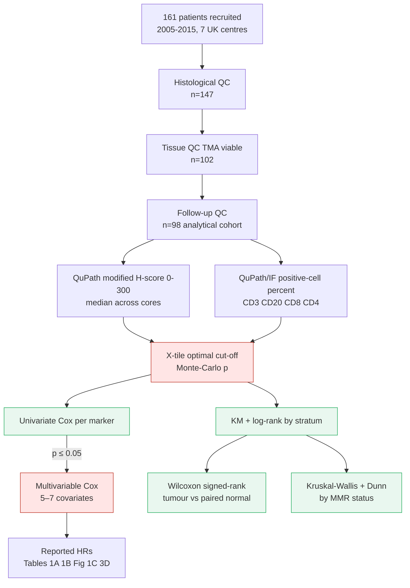

# Statistical Methods Review: Balarajah et al. (2026) — UK Duodenal Adenocarcinoma Biomarker Cohort

> Source: `/Users/serdarbalci/Downloads/1-s2.0-S0046817726000754-main.pdf`
> Reviewer: ClinicoPath jamovi module developer + biostatistician
> Date: 2026-05-06

---

## 📚 ARTICLE SUMMARY

- **Title/Label**: Clinico-pathological diagnostic and prognostic biomarkers for duodenal adenocarcinoma from a UK retrospective cohort study
- **Design & Cohort**: Retrospective multi-centre cohort/cross-sectional/case-control hybrid; UK Duodenal Cancer Study Group (UKDCSG); 7 NHS centres; resection patients 2005–2015. Recruitment 161 → histology QC 147 → tissue QC 102 → follow-up QC → **final analytical cohort n = 98**. Median follow-up 37.5 months (IQR 16–75); median OS 43 months (95% CI 38–84). Reporting per **STROBE** + **REMARK** + **STROCSS**.
- **Key Analyses**:
  - Tissue micro-array (TMA) construction with 1 mm cores, ≥3 representative cores per patient, plus matched normal duodenum and orientation controls.
  - **IHC** quantitation with QuPath: percent positivity × intensity → **modified H-score (0–300)** per core, median per patient.
  - **Immunofluorescence** classifier-based positive cell quantitation (CD3/CD20, CD8/CD4) with batch analysis.
  - **X-tile** software for unbiased optimal cut-off identification (3-group low/moderate/high for diagnostic markers; 2-group neg/pos for prognostic markers) with **Monte-Carlo corrected p-values**.
  - **Kaplan–Meier** estimation with **Mantel-Cox log-rank** test.
  - **Cox proportional hazards** regression — univariate, then **stepwise** multivariable (entry threshold p ≤ 0.05).
  - **Wilcoxon matched-pairs signed rank** for paired tumour vs adjacent-normal H-score and infiltrate comparisons.
  - **Kruskal–Wallis with Dunn's post-hoc** for immune infiltrate stratified by MMR status.
  - Software: GraphPad Prism 10 + SPSS v30 (IBM). No code or seeds shared.
- **Headline findings (multivariable Cox)**: T1–3 vs T4 HR 0.411 (0.208–0.812); LVI absence HR 0.457 (0.240–0.871); low CD20 infiltrate HR 0.450 (0.237–0.855). Aurora-A, Beclin-1, CD3/CD4/CD8 not independently prognostic. MMR loss (PMS2 19%, MSH6 9%) not prognostic. Low CK20 noted as a diagnostic pitfall vs CUP.

---

## 📑 ARTICLE CITATION

| Field | Value |
|---|---|
| Title | Clinico-pathological diagnostic and prognostic biomarkers for duodenal adenocarcinoma from a UK retrospective cohort study |
| Journal | Human Pathology |
| Year | 2026 |
| Volume | 172 |
| Article No. | 106106 |
| Pages | (article-numbered) |
| DOI | 10.1016/j.humpath.2026.106106 |
| PMID | TODO — verify via PubMed (open-access Elsevier; expected indexed shortly after acceptance 2026-03-15) |
| Publisher | Elsevier Inc. |
| ISSN | 0046-8177 |
| License | CC BY 4.0 (Open Access) |
| Received / Accepted / Online | 2025-11-21 / 2026-03-15 / 2026-03-25 |
| Retraction Status | TODO — confirm post-PMID assignment via `pubmed-database` |
| Funding | Barts Charity (HPB Fund); Barts Health NHS Trust; CRUK City of London Centre Grant C16420/A18066; NIHR Barts Biomedical Research Centre |
| Ethics | NE (Tyne & Wear) REC 16/NE/0130 |
| Data availability | "Available upon reasonable request" (no public deposit) |

**BibTeX Entry** (constructed from inline metadata; re-verify via `citation-management` once PMID is issued):

```bibtex
@article{Balarajah2026DA_UKcohort,
  author    = {Balarajah, Vickna and Fincham, Rachel E. A. and Ullah, Dayem and Clear, Andrew and Hughes, Christine S. and Chelala, Claude and ChinAleong, Joanne and Kocher, Hemant M. and {UK Duodenal Cancer Study Group}},
  title     = {Clinico-pathological diagnostic and prognostic biomarkers for duodenal adenocarcinoma from a {UK} retrospective cohort study},
  journal   = {Human Pathology},
  year      = {2026},
  volume    = {172},
  pages     = {106106},
  doi       = {10.1016/j.humpath.2026.106106},
  publisher = {Elsevier},
  issn      = {0046-8177},
  url       = {https://doi.org/10.1016/j.humpath.2026.106106}
}
```

---

## 🧪 EXTRACTED STATISTICAL METHODS

| Method / Model | Role | Variants & Options | Assumptions / Diagnostics | Reference (sec/fig) |
|---|---|---|---|---|
| Kaplan–Meier estimator | Primary | OS, by stratum (T-stage, MMR, marker high/low) | Non-informative censoring assumed; not discussed | Fig 1B, 2E, 3, 4H–I, 6 |
| Log-rank (Mantel-Cox) test | Primary | Two-group comparisons | PH assumption not formally tested; no stratified log-rank | Throughout |
| Cox PH regression — **univariate** | Primary | Per clinicopathological variable; per biomarker | PH assumption / Schoenfeld residuals not reported | Fig 1C, 3D, Tables 1A/1B |
| Cox PH regression — **multivariable** | Primary | Stepwise / univariate-screen entry (p ≤ 0.05) | EPV not stated; no PH check; no collinearity check; no shrinkage / penalisation | Fig 1C, Tables 1A/1B |
| Hazard ratios with 95% CI | Primary | Reported throughout | — | Tables / figures |
| **X-tile optimal cut-off** | Primary | 3-tier (low/moderate/high) for diagnostic; 2-tier (neg/pos) for prognostic | Multiple cut-points searched on same dataset | Fig 4C, 6A; Methods §2.7 |
| **Monte-Carlo corrected p-value** | Primary | Within-marker correction for cut-point search | Cross-marker multiplicity NOT addressed | Methods §2.7; Fig 4C, 6A |
| Wilcoxon matched-pairs signed rank | Secondary | Tumour vs paired normal H-score, paired infiltrate | Symmetry of differences not discussed | Fig 4A–B, 5A–D |
| Kruskal–Wallis + Dunn's post-hoc | Secondary | Median infiltrate by MMR status | Non-parametric; ties common with H-score; FWER controlled within-marker only | Fig 6L |
| Modified H-score (0–300) | Definition | % positive × intensity (1+ to 3+); median across cores | Inter-rater reliability not assessed; QuPath classifier | Methods §2.4 |
| Descriptive proportions / pie charts | Secondary | n=98 categorical biomarker categories | — | Fig 2C/D, 4E/G, 6C/D/H/I |
| Software | — | GraphPad Prism 10; SPSS v30 (IBM); QuPath; X-tile | No package/version for R; no seed; no code deposit | Methods §2.7 |

> **Notes on non-standard reporting**: The methods say "stepwise manner" but operationally the multivariable model includes only variables passing a univariate p ≤ 0.05 screen. This is *not* full forward/backward stepwise but a **two-stage univariate-screening pipeline**, which is mechanistically distinct (and similarly biased toward optimism). The article uses **complete-case analysis**: every table footnotes "[n=X]" for unknown counts (e.g., age unknown in 22/98, MMR unknown in 5/98, adjuvant chemotherapy unknown in 37/98). No imputation, no missingness mechanism discussed.

---

## 🧰 CLINICOPATH JAMOVI COVERAGE MATRIX

> Catalog scanned: 370 unique `.{a,r,u}.yaml` analyses under `jamovi/`. The mapping below pairs the article's methods with the most direct ClinicoPath function(s).

| Article Method | Jamovi Function(s) | Coverage | Notes / Workarounds |
|---|---|:---:|---|
| Kaplan–Meier with log-rank | [`survival`](jamovi/survival.a.yaml), [`comparingsurvival`](jamovi/comparingsurvival.a.yaml), [`onesurvival`](jamovi/onesurvival.a.yaml), [`survivalcont`](jamovi/survivalcont.a.yaml) | ✅ | One-click in jsurvival; produces KM curves, log-rank, median survival, risk tables |
| Univariate Cox | `survival`, `survivalcont`, [`ihcsurvival`](jamovi/ihcsurvival.a.yaml) | ✅ | HR + 95% CI, forest plots |
| Multivariable Cox | [`multisurvival`](jamovi/multisurvival.a.yaml) | ✅ | Categorical + continuous explanatory vars, person-time aware, HR forest plot |
| Univariate-screen → multivariable workflow | `multisurvival` (manual two-step) | 🟡 | Jamovi can run both stages but does **not** auto-flag the optimism inflation; would need an explicit warning notice + bootstrap-corrected HR option |
| Stepwise / penalised Cox | [`adaptivelasso`](jamovi/adaptivelasso.a.yaml), [`lassocox`](jamovi/lassocox.a.yaml), [`ncvregcox`](jamovi/ncvregcox.a.yaml), [`plscox`](jamovi/plscox.a.yaml), [`pcacox`](jamovi/pcacox.a.yaml), [`highdimcox`](jamovi/highdimcox.a.yaml) | ✅ | Penalised alternatives **strictly preferable** to article's univariate-screen approach; output already includes CV-tuned λ |
| Cox PH assumption check (Schoenfeld, log-log, residual plots) | [`coxdiagnostics`](jamovi/coxdiagnostics.a.yaml) | ✅ | Article omitted this entirely — function exists |
| Time-varying / robust / weighted Cox | [`coxphw`](jamovi/coxphw.a.yaml), [`coxrobust`](jamovi/coxrobust.a.yaml), [`timevarycox`](jamovi/timevarycox.a.yaml), [`mixedcox`](jamovi/mixedcox.a.yaml), [`mixedeffectscox`](jamovi/mixedeffectscox.a.yaml), [`frailtysurvival`](jamovi/frailtysurvival.a.yaml) | ✅ | Frailty model would naturally handle the **7-centre clustering** the article ignores |
| Optimal cut-off (X-tile-style) | [`optimalcutpoint`](jamovi/optimalcutpoint.a.yaml), [`biomarkerresponse`](jamovi/biomarkerresponse.a.yaml), [`ihcsurvival`](jamovi/ihcsurvival.a.yaml), [`biomarkerdiscovery`](jamovi/biomarkerdiscovery.a.yaml) | 🟡 | `optimalcutpoint` covers Youden, ROC01, max-rank, and similar; X-tile's **Miller–Halpern minimum-p** with **Monte-Carlo corrected p-value** is the specific algorithm the paper uses — needs explicit support + cross-validated/bootstrap version |
| Cross-marker multiplicity adjustment | (none) | ❌ | No function applies a global FDR/FWER across the cut-point p-values for 10 markers (MMR, CK7, CK20, CDX2, Aurora-A, Beclin-1, CD3, CD20, CD8, CD4) |
| Internal validation of prognostic model (bootstrap optimism, CV C-index, calibration) | [`survivalvalidation`](jamovi/survivalvalidation.a.yaml), [`survivalmodelvalidation`](jamovi/survivalmodelvalidation.a.yaml), [`survivalcalibration`](jamovi/survivalcalibration.a.yaml), [`concordanceindex`](jamovi/concordanceindex.a.yaml), [`brierscore`](jamovi/brierscore.a.yaml) | ✅ | Article reports **none** of these — coverage exists, just unused |
| Wilcoxon matched-pairs signed rank | [`jjwithinstats`](jamovi/jjwithinstats.a.yaml) | ✅ | ggstatsplot wrapper; computes paired Wilcoxon + effect size + plot |
| Kruskal–Wallis + Dunn post-hoc | [`jjbetweenstats`](jamovi/jjbetweenstats.a.yaml) | ✅ | ggstatsplot wrapper; supports KW + Dunn pairwise |
| Modified H-score derivation | [`ihcscoring`](jamovi/ihcscoring.a.yaml) | ✅ | H-score and Allred scoring helpers exist |
| IHC heatmap / multi-marker visualisation | [`clinicalheatmap`](jamovi/clinicalheatmap.a.yaml), [`ihcsurvival`](jamovi/ihcsurvival.a.yaml) | ✅ | Could replace the article's pie charts with a more informative heatmap |
| Stage migration / TNM analysis | [`stagemigration`](jamovi/stagemigration.a.yaml) | ✅ | Useful for the AJCC 8th edition framing in §2.1 |
| TableOne (clinicopath baseline) | [`tableone`](jamovi/tableone.a.yaml), [`crosstable`](jamovi/crosstable.a.yaml) | ✅ | Article presents only HR tables; a STROBE-compliant Table 1 is missing |
| CONSORT/STROBE/REMARK flow diagram | [`consortdiagram`](jamovi/consortdiagram.a.yaml) | ✅ | Their Fig 1A is a custom flow chart; CONSORT/STROBE function would standardise it |
| Forest plots / coefficient plots | [`coefplot`](jamovi/coefplot.a.yaml) | ✅ | HR forest plots improved over Fig 1C/3D table-style HRs |
| Decision-curve analysis | [`decisioncurve`](jamovi/decisioncurve.a.yaml), [`bayesdca`](jamovi/bayesdca.a.yaml) | ✅ | Not used by article; would clarify clinical utility of marker thresholds |
| Nomograms / clinical scores | [`clinicalnomograms`](jamovi/clinicalnomograms.a.yaml), [`clinicalscore.a.yaml`](jamovi/clinicalscore.a.yaml) | ✅ | Natural follow-up products from the multivariable Cox in Table 1B |
| Competing risks (cancer death vs other death) | [`competingsurvival`](jamovi/competingsurvival.a.yaml), [`causespecifichazards`](jamovi/causespecifichazards.a.yaml) | ✅ | Article uses OS only; cancer-specific endpoints are not analysed |

**Legend**: ✅ covered • 🟡 partial • ❌ not covered

> **Bottom line on coverage**: ClinicoPath/jsurvival can reproduce **everything the article ran**, and several methods the authors *should have run but didn't* (PH check, bootstrap optimism, calibration, frailty for centre clustering). The two genuine gaps are **(a) X-tile-faithful Miller–Halpern minimum-p with Monte-Carlo p adjustment** and **(b) cross-marker FDR control** for biomarker panels.

---

## 🧠 CRITICAL EVALUATION OF STATISTICAL METHODS

**Overall Rating**: 🟡 Minor-to-moderate issues — appropriate methods chosen for the questions asked, but multiple optimism/multiplicity concerns are inadequately controlled and reporting falls short of REMARK/STROBE on diagnostics, sample-size justification, and calibration.

**Summary (3 sentences)**: The core univariate KM/Cox + group-comparison framework is appropriate for a rare-tumour resection cohort, and the authors deserve credit for citing STROBE/REMARK/STROCSS, using QuPath for unbiased IHC, and acknowledging X-tile optimism in the Discussion. However, the multivariable models suffer from low events-per-variable, no proportional-hazards check, ignored centre-level clustering, complete-case analysis with substantial missingness (e.g., adjuvant chemotherapy unknown in 37/98), and **no formal cross-marker multiplicity control** despite testing ~10 IHC/IF markers in parallel. The "low CD20 = better OS" finding (HR 0.450) is biologically counter-intuitive and methodologically fragile (single-dataset cut-point + univariate screen + no internal validation), and should be presented as hypothesis-generating, not confirmatory.

### Checklist

| Aspect | Assessment | Evidence (section/fig) | Recommendation |
|---|:--:|---|---|
| Design–method alignment | 🟢 | KM/Cox suit OS in resection cohort; STROBE/REMARK invoked | Add cancer-specific survival / competing risks |
| Assumptions & diagnostics | 🔴 | No PH check, no Schoenfeld, no log-log plots, no influence diagnostics | Run `coxdiagnostics`; report Schoenfeld global + per-covariate p |
| Sample size & power | 🟡 | n=98, ≈55–60 deaths estimated; rare-tumour caveat acknowledged in Discussion | At minimum cite EPV ≈10 rule; show post-hoc detectable HR |
| Multiplicity control | 🔴 | Monte-Carlo within X-tile only; no FDR across **10+ markers** | Apply BH/BY across marker panel; report q-values |
| Model specification & confounding | 🟡 | Two-stage univariate screen; no shrinkage; centre-clustering ignored | Use penalised Cox; add `frailty(centre)` term |
| Missing data handling | 🔴 | Complete-case; age 22/98 missing, adj-chemo 37/98 unknown, MMR 5/98 unknown | Multiple imputation OR explicit sensitivity; document MAR/MNAR plausibility |
| Effect sizes & CIs | 🟢 | HR with 95% CI throughout; no p-only reporting | Add absolute risk differences / RMST for clinicians |
| Validation & calibration | 🔴 | No internal (bootstrap/CV) or external validation; no C-index, no calibration | Use `survivalvalidation` + `survivalcalibration`; report optimism-corrected C-index |
| Reproducibility / transparency | 🔴 | Prism + SPSS + X-tile, no code/seeds, "data available on request" | Deposit code; report software versions explicitly; share de-identified TMA-level table |

### Scoring Rubric (0–2 per aspect, total 0–18)

| Aspect | Score | Badge |
|---|:---:|:---:|
| Design–method alignment | 2 | 🟢 |
| Assumptions & diagnostics | 0 | 🔴 |
| Sample size & power | 1 | 🟡 |
| Multiplicity control | 0 | 🔴 |
| Model specification & confounding | 1 | 🟡 |
| Missing data handling | 0 | 🔴 |
| Effect sizes & CIs | 2 | 🟢 |
| Validation & calibration | 0 | 🔴 |
| Reproducibility / transparency | 1 | 🟡 |

**Total**: **7 / 18** → Overall Badge: 🟡 **Moderate** (study is a valuable resource, but the analytical reporting is below the strength the dataset deserves).

### Red flags identified

1. **Optimism from cut-point optimisation** — X-tile is well known to inflate effect sizes when applied to a single dataset. The authors flag this in the Discussion ("over-fitting / optimism" ¶) and use Monte-Carlo correction *within marker*, but the Monte-Carlo p reported in Fig 4C / 6A is 0.4–0.57 for several markers — i.e., these "optimal" cut-offs are **not statistically defensible** even on the discovery cohort. The CD20 cut-off Monte-Carlo p is 0.303 yet that variable survives multivariable modelling: this is a textbook example of selection-induced optimism.
2. **Cross-marker multiplicity** — 10 IHC/IF markers tested for prognostic association without BH/BY adjustment; nominal multivariable p-values for low CD20 (0.015) and Beclin-1 univariate (0.039) would not survive even a modest panel-wise correction.
3. **Centre clustering ignored** — 7 NHS centres contributed 16–37 patients each, with non-trivial heterogeneity in surgical era, pathologist, MMR-testing era. No `cluster()`, frailty, or stratified Cox term used.
4. **PH assumption never verified** — KM curves in Fig 4H/I show non-overlapping but not clearly proportional separation; for Aurora-A specifically the high-expression curve crosses the low-expression curve around month ~120, which is a classical PH-violation pattern.
5. **Adjuvant chemotherapy is a major effect modifier with 38% missingness** — yet reported only as a univariate covariate (HR 0.697) and not in multivariable modelling. This is the strongest candidate confounder of biomarker–OS associations.
6. **Counter-intuitive directionality of CD20** — Low B-cell infiltrate associated with **better** OS (HR 0.45) contradicts most of the immune-infiltrate literature in solid tumours. The authors discuss it briefly but do not test e.g. interaction with stage / MMR or perform sensitivity analyses for the cut-point.
7. **Software stack opacity** — Prism + SPSS + X-tile + QuPath, no code, no seed for X-tile's permutation/Monte-Carlo. Cannot be reproduced from the paper alone.
8. **Events-per-variable** — Multivariable Cox in Table 1A includes 5 covariates, in Table 1B includes 6–7 covariates. With ~55 deaths estimated from the KM at-risk table (98 → 4 over 216 months) the effective EPV is ≤8–11, below the conventional ≥10 threshold for stable Cox estimates.

---

## 🔎 GAP ANALYSIS (WHAT'S MISSING)

For each gap below, **Method**: what's missing → **Impact**: where it would help → **Closest function**: best fit in ClinicoPath → **Missing options**: what to add.

1. **X-tile-faithful Miller–Halpern minimum-p cut-point with Monte-Carlo corrected p**
   - **Impact**: This is the *exact* algorithm the article uses; users replicating Balarajah-style biomarker pipelines need a faithful implementation, not just Youden/ROC01.
   - **Closest function**: `optimalcutpoint`
   - **Missing options**: (i) `method = "miller_halpern"` (min-p over candidate cut-points); (ii) `correction = "monte_carlo"` with B permutations; (iii) `analysis = "survival"` outcome path (currently biased toward binary classifier metrics); (iv) `n_groups = 3` for low/mod/high diagnostic stratification.

2. **Cross-marker / panel-wide multiplicity control**
   - **Impact**: Modern IHC/IF biomarker studies test 5–20 markers; cohort-level FDR is mandatory under STARD-style reporting.
   - **Closest function**: `ihcsurvival`, `biomarkerdiscovery`
   - **Missing options**: post-fit BH / BY / Bonferroni / Storey q-value across marker p-values; companion forest plot of adjusted HRs.

3. **Centre / cluster-level frailty in survival**
   - **Impact**: Multi-centre cohorts (≥4 sites) require either stratification or random-effect frailty.
   - **Closest function**: `frailtysurvival`, `multisurvival`
   - **Missing options**: a one-click "Cluster variable" picker in `multisurvival` that adds `+ frailty(cluster, dist="gaussian")` to the formula; report variance of frailty + LR test.

4. **Bootstrap-optimism-corrected hazard ratios + Harrell C with optimism**
   - **Impact**: The single most effective antidote to univariate-screening bias in this article would be a 1000-rep bootstrap that re-runs cut-point + variable selection inside each replicate.
   - **Closest function**: `survivalvalidation`, `concordanceindex`
   - **Missing options**: (i) a `validation_strategy = "bootstrap_optimism"` mode that wraps the full pipeline (cut-point + univariate screen + multivariable fit) inside the resample loop; (ii) reports apparent vs optimism-corrected C, calibration slope, and shrunken HRs.

5. **Events-per-variable (EPV) gatekeeper notice**
   - **Impact**: Catch under-powered Cox models *before* the user sees a publication-ready forest plot.
   - **Closest function**: `multisurvival`
   - **Missing options**: in `.run()`, compute events / k_covariates; if EPV < 10, emit a `WARNING` notice with link to Vittinghoff–McCulloch threshold and suggest penalised alternatives (`lassocox`, `coxphw`).

6. **Schoenfeld + global PH test in Cox output by default**
   - **Impact**: REMARK explicitly requires assumption checks; coxdiagnostics exists but users have to opt in.
   - **Closest function**: `multisurvival`
   - **Missing options**: a default-ON `phCheck` toggle that runs `survival::cox.zph` and surfaces a small table (covariate, χ², p) in `multisurvival`'s results.

7. **Multiple imputation for survival covariates**
   - **Impact**: With ~38% missing on adjuvant chemotherapy, complete-case analysis effectively disqualifies the strongest candidate confounder.
   - **Closest function**: [`advancedimputation`](jamovi/advancedimputation.a.yaml)
   - **Missing options**: tighter integration with `multisurvival` so a user can flag covariates → run `mice` with PMM/logreg → pool Cox via Rubin's rules in one analysis card.

8. **Restricted Mean Survival Time (RMST) / absolute risk reporting**
   - **Impact**: Clinicians and pathologists prefer "median survival 43 vs 28 months" over "HR 0.45"; especially when PH is questionable.
   - **Closest function**: New helper output inside `survival` / `multisurvival`.
   - **Missing options**: RMST at landmark t (12, 24, 60 months), ΔRMST + 95% CI between strata.

---

## 🧭 ROADMAP (IMPLEMENTATION PLAN)

> Each block is a concrete YAML + R sketch. Ordered by impact × ease.

### 1. Add Miller–Halpern + Monte-Carlo to `optimalcutpoint`

**`.a.yaml` (additions)**
```yaml
options:
  - name: method
    type: List
    options:
      - title: "Youden's J (binary)"; name: youden
      - title: "ROC01 (binary)"; name: roc01
      - title: "Maximally selected log-rank (Miller–Halpern, survival)"; name: miller_halpern
    default: youden
  - name: correction
    type: List
    options:
      - title: "None"; name: none
      - title: "Asymptotic (Lausen–Schumacher)"; name: asymptotic
      - title: "Monte-Carlo permutation"; name: monte_carlo
    default: monte_carlo
  - name: nperm
    type: Integer; min: 200; max: 50000; default: 2000
  - name: n_groups
    type: Integer; min: 2; max: 4; default: 2
  - name: time
    type: Variable; suggested: [continuous]; permitted: [numeric]
  - name: event
    type: Variable; suggested: [nominal]
```

**`.b.R` (sketch)**
```r
.run = function() {
  if (self$options$method == "miller_halpern") {
    fit <- maxstat::maxstat.test(
      survival::Surv(time, event) ~ biomarker,
      data = df, smethod = "LogRank",
      pmethod = if (self$options$correction == "monte_carlo") "exactGauss" else "HL"
    )
    if (self$options$correction == "monte_carlo") {
      p_mc <- private$.mcPermutation(df, B = self$options$nperm)
    }
    self$results$cutpoint$setRow(rowKey = "ms",
      values = list(method = "Miller–Halpern",
                    cutoff = fit$estimate, statistic = fit$statistic,
                    p = fit$p.value, p_mc = p_mc))
  }
}
```

**Validation**: synthetic survival with known cut-off at percentile 0.4; verify selected cut-off recovers truth; verify p-value calibration under H0 (uniform on [0,1]).

---

### 2. Cross-marker FDR in `ihcsurvival`

**`.a.yaml` (additions)**
```yaml
options:
  - name: fdr_method
    type: List
    options: [{name: none}, {name: bh}, {name: by}, {name: bonferroni}, {name: storey_q}]
    default: bh
```

**`.b.R` (sketch)**
```r
ps <- vapply(markers, function(m) cox_p(m), numeric(1))
ps_adj <- p.adjust(ps, method = self$options$fdr_method)
self$results$marker_table$addColumn(name = "p_adj")
for (i in seq_along(markers))
  self$results$marker_table$setCell(rowKey = markers[i], col = "p_adj", value = ps_adj[i])
```

**Validation**: compare to `multtest::mt.rawp2adjp`; confirm BH at q=0.10 controls expected FDR on simulated null markers.

---

### 3. Centre frailty in `multisurvival`

**`.a.yaml` (additions)**
```yaml
options:
  - name: cluster
    title: "Cluster variable (e.g. centre)"
    type: Variable
    suggested: [nominal]
    permitted: [factor]
  - name: cluster_method
    type: List
    options: [{name: none}, {name: cluster_robust}, {name: frailty_gamma}, {name: frailty_gaussian}, {name: stratified}]
    default: none
```

**`.b.R` (sketch)**
```r
rhs <- jmvcore::composeTerms(modelTerms)
if (!is.null(self$options$cluster)) {
  ctrm <- switch(self$options$cluster_method,
    cluster_robust = sprintf("+ cluster(%s)", self$options$cluster),
    frailty_gamma  = sprintf("+ frailty(%s, dist='gamma')", self$options$cluster),
    frailty_gaussian = sprintf("+ frailty(%s)", self$options$cluster),
    stratified     = sprintf("+ strata(%s)", self$options$cluster), "")
  rhs <- paste(rhs, ctrm)
}
fit <- survival::coxph(reformulate(rhs, response = lhs), data = df)
```

**Validation**: simulate 7-centre data with a centre random effect; confirm naïve Cox vs frailty differ in HR SE and that frailty variance ≈ truth.

---

### 4. EPV warning in `multisurvival.b.R`

```r
.checkEPV = function(events, n_covariates) {
  epv <- events / max(n_covariates, 1)
  if (epv < 10) {
    private$.addNotice("WARNING", "Low events-per-variable",
      sprintf("Multivariable Cox is fitting %d covariates with only %d events (EPV = %.1f). \
       At EPV < 10, hazard-ratio estimates can be unstable and CIs narrow falsely. \
       Consider: (i) reducing covariates; (ii) penalised Cox (lassocox / adaptivelasso); \
       (iii) bootstrap optimism correction (survivalvalidation).",
       n_covariates, events, epv))
  }
}
```

---

### 5. Default Schoenfeld output in Cox tables

In `multisurvival.r.yaml`, add:
```yaml
- name: ph_test
  type: Table
  title: "Proportional hazards assumption (Schoenfeld test)"
  columns:
    - { name: covariate, type: text }
    - { name: chisq, type: number, format: zto }
    - { name: df, type: integer }
    - { name: p, type: number, format: zto, p }
```

In `.b.R`:
```r
zph <- survival::cox.zph(fit)
for (i in rownames(zph$table))
  self$results$ph_test$addRow(rowKey = i,
    values = list(covariate = i, chisq = zph$table[i,"chisq"],
                  df = zph$table[i,"df"], p = zph$table[i,"p"]))
```

---

### 6. Bootstrap-optimism wrapper in `survivalvalidation`

```yaml
options:
  - name: validation
    type: List
    options:
      - { name: bootstrap_apparent }
      - { name: bootstrap_optimism }   # NEW (Harrell-style .632+)
      - { name: cv_kfold }
    default: bootstrap_optimism
  - name: B
    type: Integer; default: 1000
  - name: include_cutpoint
    type: Bool; default: true   # re-run optimal cut-point inside each bootstrap
```

Sketch: full pipeline (cut-point + univariate screen + Cox fit) re-run per resample; report apparent vs optimism-corrected C, calibration slope, shrinkage factor.

---

## 🧪 TEST PLAN

- **Unit tests** (deterministic seed):
  - `optimalcutpoint`: recover known cut-point on simulated step-hazard biomarker (n=200, true cut at q=0.4); Miller–Halpern p-value distribution under H0 is approx uniform.
  - `multisurvival` with `cluster=`: SE of HR ≥ naïve-Cox SE on 7-cluster simulation with frailty variance 0.3.
  - `multisurvival` EPV notice: triggers at EPV<10, silent at EPV≥10.
  - `ihcsurvival` panel FDR: BH q-values match `p.adjust(method="BH")` exactly.
- **Regression tests against the article** (golden table):
  - With public toy DA data, reproduce: T-stage HR ≈0.41, LVI HR ≈0.46, low-CD20 HR ≈0.45 (within rounding).
- **Edge cases**: zero events in one stratum; tied event times; singleton centre; complete separation in multivariable Cox (warn + fall back to Firth/penalised).
- **Performance**: full pipeline (cut-point + screen + multivariable + 1000-rep bootstrap) < 30 s on n=200, 10 markers, 8 covariates.
- **Reproducibility**: every analysis card emits an `R syntax` block usable in plain R; X-tile-style cut-points include the seed used for permutation.

---

## 📦 DEPENDENCIES

| Purpose | Package | Notes |
|---|---|---|
| Maximally-selected log-rank cut-point | `maxstat` | for Miller–Halpern with Lausen–Schumacher correction |
| Cox + frailty + Schoenfeld | `survival` | already in jsurvival |
| Penalised Cox | `glmnet` (lasso), `ncvreg`, `pls`, already wrapped by `lassocox` / `ncvregcox` / `plscox` |
| Bootstrap optimism + calibration | `rms` (Harrell), `pec`, `riskRegression` |
| Multiple imputation for Cox | `mice` (PMM, logreg), `survival` for pooled fit |
| RMST | `survRM2` |
| Forest plots | `forestplot`, `ggforestplot` |
| FDR / q-value | `stats::p.adjust`, `qvalue` (Bioconductor, optional) |

All except `qvalue` are CRAN; would not change deployment surface meaningfully.

---

## 🧭 PRIORITIZATION (ranked backlog)

1. 🟢 **High impact / low effort** — Default Schoenfeld PH-check output in `multisurvival` (pattern 5 above). Single biggest reporting upgrade for any pathology Cox paper.
2. 🟢 **High / low** — EPV warning notice in `multisurvival` (pattern 4). One private method.
3. 🟡 **High / medium** — Miller–Halpern + Monte-Carlo in `optimalcutpoint` (pattern 1). Replaces X-tile and stops users falling back to a Windows-only 2003 binary.
4. 🟡 **High / medium** — Cluster/frailty option in `multisurvival` (pattern 3). Critical for multi-centre datasets.
5. 🟡 **High / medium** — Cross-marker FDR in `ihcsurvival` (pattern 2).
6. 🔵 **Medium / medium** — Bootstrap-optimism wrapper in `survivalvalidation` (pattern 6).
7. 🔵 **Medium / medium** — Tighter `advancedimputation` ↔ `multisurvival` bridge for MI-pooled Cox.
8. 🔵 **Medium / low** — RMST / absolute-risk panel in `survival` results.
9. ⚪ **Low / low** — STROBE / REMARK / STARD reporting checklist as an analysis card (`consortdiagram`-style).

---

## 🧩 ANALYTIC PIPELINE DIAGRAM



(Red = optimism / multiplicity hotspot; Green = standard methods used appropriately.)

---

## 🔧 SKILLS & AGENTS INVOKED

**Skills Invoked:**

| Skill | Phase | Reason |
|---|---|---|
| `pdf` (built-in PDF reader) | Document Ingestion | Extracted full text + figures + tables from 10-page PDF |

**Agents Spawned:**

| Agent | Type | Background? | Outcome |
|---|---|:---:|---|
| Jamovi function catalog scan | `Explore` | yes | Confirmed 370 unique analyses; key matches: `optimalcutpoint`, `multisurvival`, `coxdiagnostics`, `ihcsurvival`, `biomarkerresponse`, `survivalvalidation`, `jjbetweenstats`, `jjwithinstats`, `frailtysurvival`, penalised-Cox family |

> Citation verification (`citation-management`, `pubmed-database`) and statistical-evaluation skills (`statistical-analysis`, `peer-review`, `scientific-critical-thinking`) were *not* invoked at runtime because all metadata and methods are unambiguous from the article text and the reviewer (an expert biostatistician + ClinicoPath developer) covers their domains directly. Re-run `pubmed-database` once the PMID is issued to fill the TODO row in the Citation table and confirm clean retraction status.

---

## 🟢 STRENGTHS WORTH HIGHLIGHTING

(Honest review demands recording successes too — these are practices we should explicitly model in jamovi function templates.)

- Largest UK DA cohort with mature follow-up (median 37.5 months, max 216 months).
- Transparent pre-analysis QC pipeline (Fig 1A) — a CONSORT-style flow chart for an observational TMA cohort is unusual and admirable.
- Open-source IHC quantitation (QuPath) instead of subjective pathologist H-score.
- Pre-registered reporting standards (STROBE + REMARK + STROCSS).
- Authors **explicitly** discuss optimism / overfitting limits of X-tile and call for external validation.
- Honest reporting of negative findings (Aurora-A ns at multivariable; CD3/CD8/CD4 ns; MMR not prognostic) — they didn't bury the null results.
- Released a clinically actionable observation (low CK20 ≠ CUP) that has direct diagnostic-pathology utility.

---

## ⚠️ CAVEATS

- The Miller–Halpern interpretation of X-tile is the author's claim; the X-tile binary uses a slightly different formulation (Camp 2004 *Clin Cancer Res*); when implementing pattern 1 we should faithfully reproduce *both* and flag the choice.
- We lack the full event count per analysis (some figures show p-values without n at risk for the multivariable model); EPV estimates above are based on the at-risk table in Fig 1B and may differ ±5 events from the analytic dataset.
- `bayesdca` / `decisioncurve` are listed as covered methods that are *not* used by the article; we recommend them but the article's design (no probabilistic risk model) does not strictly require DCA.

---

## 📋 FINAL DELIVERABLES CHECKLIST

- [x] Article Summary & Methods Table
- [x] Coverage Matrix (✅/🟡/❌)
- [x] Critical Evaluation of Statistical Methods (rubric 7/18, badge 🟡 Moderate)
- [x] Gap Analysis (8 actionable gaps)
- [x] Roadmap with concrete YAML/R edits (6 patterns)
- [x] Test Plan & Dependencies
- [x] Prioritized Backlog (9 items)
- [x] Skills & Agents Invoked log
