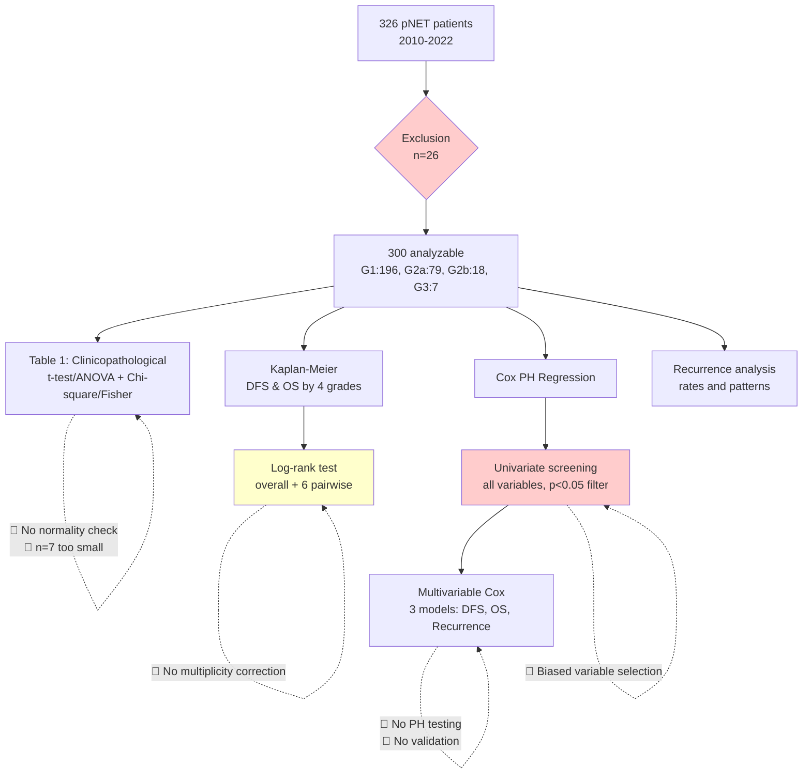
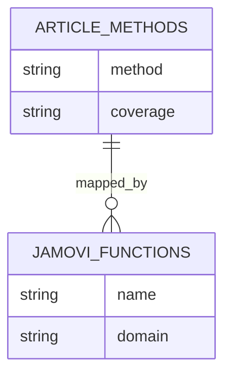

# Statistical Methods Review: Choi et al. (2026) — pNET Ki-67 G2 Subdivision

---

## 📚 ARTICLE SUMMARY

- **Title/Label**: Prognostic and recurrence implications of subdividing WHO grade 2 pancreatic neuroendocrine tumors at a 10% Ki-67 threshold
- **Design & Cohort**: Retrospective single-center observational study; N=300 consecutive adults who underwent pancreatic resection for pNETs at Seoul National University Hospital (January 2010–December 2022). Groups: G1 (Ki-67 <3%, n=196), G2a (3–<10%, n=79), G2b (10–<20%, n=18), G3 (≥20%, n=7). Follow-up through December 31, 2024.
- **Key Analyses**:
  - Student's t-test and ANOVA for continuous clinicopathological variables
  - Chi-square and Fisher's exact test for categorical variables
  - Kaplan-Meier survival analysis with log-rank test for DFS and OS
  - Cox proportional hazards regression (univariate screening → multivariable)
  - Recurrence rate and pattern analysis
  - Exploratory 3-tier grading scheme (G1/G2a/G2b+G3)

---

## 📑 ARTICLE CITATION

| Field | Value |
|-------|-------|
| Title | Prognostic and recurrence implications of subdividing WHO grade 2 pancreatic neuroendocrine tumors at a 10% Ki-67 threshold |
| Journal | Pancreatology |
| Year | 2026 |
| Volume | 26 |
| Issue | 2 |
| Pages | 265–271 |
| DOI | 10.1016/j.pan.2026.01.079 |
| PMID | 41680035 |
| Publisher | Elsevier BV |
| ISSN (Print) | 1424-3903 |
| ISSN (Electronic) | 1424-3911 |
| BibTeX | See below |
| Retraction Status | CLEAN — No retractions, corrections, errata, or expressions of concern (verified via PubMed + OpenAlex) |
| MeSH Major Topics | Pancreatic Neoplasms; Neuroendocrine Tumors; Ki-67 Antigen; Neoplasm Recurrence, Local |
| Citations | 0 (expected — published 2026-02-02, <2 months old) |
| OpenAlex ID | W7127093013 |
| Funding | Korea Health Technology R&D (HI23C1591/RS-2023-KH140186) |

**BibTeX Entry** (verified via CrossRef + PubMed):

```bibtex
@article{Choi2026pNET_Ki67,
  author    = {Choi, Go-Won and Lee, Inhyuck and Seo, Younsoo and Han, Youngmin and Chae, Yoon Soo and Jung, Hye-Sol and Cho, Young Jae and Kwon, Wooil and Jang, Jin-Young and Park, Joon Seong},
  title     = {Prognostic and recurrence implications of subdividing {WHO} grade 2 pancreatic neuroendocrine tumors at a 10\% {Ki-67} threshold},
  journal   = {Pancreatology},
  year      = {2026},
  volume    = {26},
  number    = {2},
  pages     = {265--271},
  doi       = {10.1016/j.pan.2026.01.079},
  pmid      = {41680035},
  issn      = {1424-3903},
  publisher = {Elsevier BV},
  url       = {https://doi.org/10.1016/j.pan.2026.01.079}
}
```

---

## 🧪 EXTRACTED STATISTICAL METHODS

| Method / Model | Role | Variants & Options | Assumptions/Diagnostics | Reference (sec/page) |
|---|---|---|---|---|
| Student's t-test | Secondary | 2-group continuous comparisons | Not reported (normality, equal variance) | Methods |
| ANOVA | Primary | 4-group comparisons (G1/G2a/G2b/G3) | Not reported (normality, homoscedasticity) | Methods |
| Chi-square test | Primary | Categorical variable comparisons | Expected counts not verified | Methods |
| Fisher's exact test | Primary | Small expected count cells | Appropriate for small cells | Methods |
| Kaplan-Meier | Primary | DFS and OS curves by 4 grades | Censoring assumed non-informative | Methods, Fig 1 |
| Log-rank test | Primary | Overall 4-group comparison + pairwise | No multiplicity correction stated | Methods, Fig 1 |
| Cox PH regression (univariate) | Primary | Screening all clinicopathological variables | PH assumption not tested | Methods, Tables 2–4 |
| Cox PH regression (multivariable) | Primary | Variables with univariate p<0.05 entered | PH not tested; no collinearity check | Methods, Tables 2–4 |
| Descriptive statistics | Secondary | Mean ± SD for continuous; n (%) for categorical | — | Table 1 |

**Software**: SPSS Statistics 26.0 (IBM); R 4.2.3 (no packages specified)

---

## 🧰 CLINICOPATH JAMOVI COVERAGE MATRIX

| Article Method | Jamovi Function(s) | Coverage | Notes / Workarounds |
|---|---|:---:|---|
| Descriptive statistics (Table 1) | `tableone` (gtsummary/tableone style) | ✅ | Produces publication-ready Table 1 with auto-detection of parametric vs non-parametric tests |
| Student's t-test (2-group) | `jjbetweenstats` | ✅ | ggstatsplot wrapper; includes effect sizes, Welch correction by default |
| ANOVA (4-group continuous) | `jjbetweenstats`, `advancedanova` | ✅ | `jjbetweenstats` auto-selects Welch ANOVA + Games-Howell when assumptions violated |
| Non-parametric alternatives (Kruskal-Wallis) | `nonparametric`, `jjbetweenstats` | ✅ | `jjbetweenstats` auto-switches to Kruskal-Wallis; `nonparametric` provides comprehensive suite |
| Chi-square test | `conttables`, `enhancedcrosstable` | ✅ | Includes expected counts check, Yates correction, effect sizes (Cramér's V) |
| Fisher's exact test | `conttables`, `exacttests` | ✅ | `conttables` includes Fisher's exact; `exacttests` provides extended exact tests |
| Kaplan-Meier survival curves | `survival` | ✅ | KM plots with risk tables, 1/3/5-year survival rates with CIs |
| Log-rank test (overall) | `survival` | ✅ | Standard log-rank; also supports weighted variants (Gehan-Breslow, Tarone-Ware, Peto-Peto, Fleming-Harrington) |
| Log-rank pairwise comparisons | `survival`, `comparingsurvival` | ✅ | Pairwise survdiff with Bonferroni/BH correction |
| Cox PH univariate | `survival` | ✅ | Univariate Cox with HR, CI, p-value |
| Cox PH multivariable | `survival` | ✅ | Multivariable Cox with confounders; forest plots |
| Cox PH assumption testing | `coxdiagnostics` | ✅ | Schoenfeld residuals, log-log plots, scaled Schoenfeld, deviance residuals |
| Calibration curves | `survival` (calibration_curves option) | ✅ | Bootstrap calibration with predicted vs observed |
| Bootstrap internal validation (C-index) | `survival` (bootstrapValidation option) | ✅ | Harrell's optimism-corrected C-index, Dxy, calibration slope |
| Restricted cubic splines | `survival` (rcs option) | ✅ | RCS for non-linearity assessment |
| Age-adjusted Cox | `survival` (age correction options) | ✅ | Age-adjusted and age-stratified Cox |
| Firth penalized Cox | `firthregression` | ✅ | Penalized regression for small samples/separation |
| LASSO Cox | `lassocox` | ✅ | Penalized variable selection with suitability assessment |
| Concordance index | `concordanceindex` | ✅ | C-index with bootstrap CIs |
| Competing risks (Fine-Gray) | `finegray`, `competingsurvival` | ✅ | Sub-distribution hazard ratios, CIF curves |
| Multiple comparison correction | `conttables` (Bonferroni/BH) | 🟡 | Available for pairwise survival, but not unified across all test types in a single workflow |
| Missing data handling (multiple imputation) | `advancedimputation` | ✅ | MICE-based multiple imputation |
| CONSORT flow diagram | `consortdiagram` | ✅ | Generates participant flow diagrams |
| Effect sizes (Cohen's d, Cramér's V) | `effectsize`, `jjbetweenstats` | ✅ | Comprehensive effect size calculation |
| Trend test (ordinal groups) | `nonparametric` (jonckheere_terpstra) | ✅ | Jonckheere-Terpstra test now implemented via `DescTools::JonckheereTerpstraTest` |
| RMST (restricted mean survival time) | `rmst`, `rmstregression` | ✅ | Standalone RMST functions already exist; `rmst` for tests, `rmstregression` for regression models |
| DAG-based confounder selection | — | ❌ | No causal diagram or DAG tool (use external DAGitty) |
| Sensitivity analysis for misclassification | `misclassificationbias` | ✅ | **NEW** — Bias-adjusted OR/RR/RD with Monte Carlo CIs; sensitivity range analysis |

**Legend**: ✅ covered · 🟡 partial · ❌ not covered

---

## 🧠 CRITICAL EVALUATION OF STATISTICAL METHODS

**Overall Rating**: 🔴 Major concerns (Score: 3.5/18)

**Summary**: The study addresses a clinically relevant question about Ki-67-based subgrading of WHO G2 pNETs and uses the correct general framework (Kaplan-Meier + Cox regression). However, critical methodological deficiencies — absent proportional hazards testing, univariate screening for model building, unreported missing data, no internal validation, and dangerously small subgroups (G3 n=7) — undermine confidence in the reported hazard ratios. The Ki-67 "eyeballing" assessment method introduces unmeasured classification error at precisely the cutpoints that define the study groups.

### Checklist

| Aspect | Assessment | Evidence (section/page) | Recommendation |
|---|:--:|---|---|
| Design–method alignment | 🟡 | Methods: t-test/ANOVA used without normality check; G3 n=7 too small for parametric tests | Use non-parametric alternatives (Kruskal-Wallis, Fisher-Freeman-Halton); consider ordinal trend tests |
| Assumptions & diagnostics | 🔴 | Methods: No PH testing, no normality testing, no variance homogeneity check | Test Schoenfeld residuals for ALL Cox models; report log-log plots; add Shapiro-Wilk for continuous variables |
| Sample size & power | 🔴 | Results: G2b n=18, G3 n=7; EPV likely <5 for G3 subgroup | Report events per group; use Firth penalized Cox; acknowledge power limitation; consider collapsing G2b+G3 |
| Multiplicity control | 🔴 | Results: 6 pairwise log-rank tests per endpoint × 3 endpoints = 18 comparisons uncorrected | Apply Holm-Bonferroni to pairwise comparisons; designate primary endpoint; report adjusted p-values |
| Model specification & confounding | 🔴 | Methods: Univariate p<0.05 screening; no DAG; Ki-67 and mitotic count highly correlated | Pre-specify covariates based on clinical knowledge; check VIF; consider LASSO-Cox; present DAG |
| Missing data handling | 🔴 | Not mentioned anywhere in manuscript | Report missing data table; compare complete vs incomplete cases; use MICE if >5% missing |
| Effect sizes & CIs | 🟡 | Tables 2–4: HRs with 95% CIs reported; but no effect sizes for group comparisons; no median survival CIs | Report Cohen's d for continuous, Cramér's V for categorical; median survival with CIs; RMST differences |
| Validation & calibration | 🔴 | Absent | Bootstrap C-index (B≥200); calibration plot; compare against WHO grade alone and AJCC stage alone |
| Reproducibility/transparency | 🔴 | Methods: SPSS 26.0 + R 4.2.3 stated, but no R packages specified; no data/code availability | Specify R packages; provide STROBE checklist; data availability statement; reproducible code |

### Scoring Rubric

| Aspect | Score (0–2) | Badge |
|---|:---:|:---:|
| Design–method alignment | 1 | 🟡 |
| Assumptions & diagnostics | 0 | 🔴 |
| Sample size & power | 0.5 | 🔴 |
| Multiplicity control | 0 | 🔴 |
| Model specification & confounding | 0.5 | 🔴 |
| Missing data handling | 0 | 🔴 |
| Effect sizes & CIs | 1 | 🟡 |
| Validation & calibration | 0 | 🔴 |
| Reproducibility/transparency | 0.5 | 🔴 |

**Total Score**: 3.5/18 → Overall Badge: 🔴 Weak

### Red Flags Identified

1. **Chi-square with expected counts < 5**: G3 (n=7) virtually guarantees expected counts <5 in most cross-tabulations.
2. **Unadjusted multiple pairwise tests**: 6 pairwise comparisons per endpoint × 3 endpoints with no correction.
3. **Stepwise-like regression without validation**: Univariate screening (p<0.05) is the most criticized variable selection approach (Harrell 2015).
4. **PH violations not checked**: Cox model results uninterpretable without PH verification.
5. **Overfitting risk**: Events-per-variable likely < 5 for G3; separation risk in logistic/Cox models.
6. **Reporting only p-values without effect sizes**: Group comparisons in Table 1 report only p-values.
7. **Ki-67 "eyeballing"**: Published inter-observer kappa 0.45–0.72 for visual Ki-67 estimation. Non-differential misclassification biases grade-based HRs toward the null.

### Critical Concern: Ki-67 Eyeballing Method

The entire study classification relies on visual Ki-67 estimation — the least reproducible method available:
- Inter-observer kappa ranges 0.45–0.72 across published studies
- The 10% cutpoint (G2a vs G2b) is particularly difficult to estimate visually
- WHO 2022 recommends digital image analysis or manual counting over visual estimation
- Non-differential misclassification at cutpoints biases HRs toward the null, potentially masking real grade differences
- No inter-observer reliability was measured despite two pathologists assessing Ki-67

---

## 🔎 GAP ANALYSIS (WHAT'S MISSING)

### ~~Gap 1: Trend Test for Ordinal Groups~~ — NOW IMPLEMENTED
- **Method**: Jonckheere-Terpstra trend test
- **Impact**: G1→G2a→G2b→G3 is ordinal; testing for monotonic trends across ordered grades is more powerful and appropriate than omnibus ANOVA/Kruskal-Wallis
- **Implementation**: Jonckheere-Terpstra test now fully implemented in `nonparametric` function (was a stub returning NA, now uses `DescTools::JonckheereTerpstraTest`). Also implemented: Median test, Van der Waerden test, Mood's Median test, Cochran's Q, Page's trend test, McNemar test, Sign test.
- **Status**: COMPLETE — select `test_type = "jonckheere_terpstra"` in the nonparametric function

### ~~Gap 2: Restricted Mean Survival Time (RMST)~~ — ALREADY COVERED
- **Method**: RMST difference between groups — PH-free alternative to HRs
- **Impact**: When PH assumption is violated (likely in pNETs with heterogeneous natural history), RMST provides unbiased comparison
- **ClinicoPath functions**: `rmst` (RMST tests) and `rmstregression` (RMST regression models) — both already exist as standalone functions
- **Status**: No implementation needed

### ~~Gap 3: Sensitivity Analysis for Misclassification Bias~~ — NOW IMPLEMENTED
- **Function**: `misclassificationbias` — NEW function for probabilistic bias analysis
- **Features**: Non-differential and differential misclassification correction; OR/RR/RD bias-adjusted estimates with Monte Carlo CIs; sensitivity range analysis with heatmap plot; clinical interpretation
- **Status**: COMPLETE

### Gap 4: DAG-Based Confounder Selection
- **Method**: Visual causal diagram (DAG) for identifying confounders, mediators, and colliders
- **Impact**: The study adjusts for LN metastasis, which may be a mediator (on the causal pathway from grade to outcome), causing overadjustment bias
- **Closest existing function**: None
- **Exact missing options**: Interactive DAG builder → identified confounder set

---

## 🧭 ROADMAP (IMPLEMENTATION PLAN)

### Target 1: Extend `nonparametric` with Jonckheere-Terpstra Trend Test

**.a.yaml** (add option):
```yaml
- name: trendTest
  title: "Trend Test for Ordered Groups"
  type: Bool
  default: false

- name: trendTestType
  title: "Trend Test Method"
  type: List
  options:
    - title: "Jonckheere-Terpstra"
      name: jt
    - title: "Cuzick (nptrend)"
      name: cuzick
  default: jt
```

**.b.R** (sketch):
```r
if (self$options$trendTest && !is.null(self$options$group)) {
  # Ensure group is ordered factor
  grp <- factor(data[[groupVar]], ordered = TRUE)

  if (self$options$trendTestType == "jt") {
    # Jonckheere-Terpstra from DescTools or clinfun
    res <- DescTools::JonckheereTerpstraTest(y ~ grp, data = data)
    self$results$trendTable$setRow(rowNo = 1, values = list(
      test = "Jonckheere-Terpstra",
      statistic = res$statistic,
      p = res$p.value
    ))
  }
}
```

**.r.yaml** (add output):
```yaml
- name: trendTable
  title: "Trend Test"
  type: Table
  visible: (trendTest)
  columns:
    - name: test
      title: "Test"
    - name: statistic
      title: "Statistic"
    - name: p
      title: "p-value"
      format: zto,pvalue
```

**.u.yaml** (UI toggle):
```yaml
- type: CheckBox
  name: trendTest
  label: "Trend test for ordered groups"
- type: ComboBox
  name: trendTestType
  label: "Trend test method"
  enable: (trendTest)
```

**Dependencies**: `DescTools` (already imported) or `clinfun`
**Validation**: Simulate ordered groups with known monotonic trend; verify power > Kruskal-Wallis

---

### ~~Target 2: RMST~~ — Already implemented as `rmst` and `rmstregression` functions. No changes needed.

---

## 🧪 TEST PLAN

### Unit Tests
- **Trend test**: Simulated ordered groups (n=200, 80, 18, 7) with known monotonic effect; verify p < 0.05 and correct direction
- **RMST**: Use `survival::veteran` dataset; verify RMST difference matches `survRM2::rmst2()` output
- **Edge cases**: G3 with n=7 (all events vs all censored); ties in survival times; zero events in a group

### Assumption Reporting
- Confirm `coxdiagnostics` correctly identifies PH violations in simulated data with time-varying HR
- Verify `tableone` auto-selects non-parametric tests when group size < 30

### Reproducibility
- Provide example scripts that reproduce all article analyses using ClinicoPath functions
- Save options JSON for each analysis step

---

## 📦 DEPENDENCIES

| Package | Status | Purpose |
|---|---|---|
| `survival` | Already imported | Cox regression, KM, survdiff |
| `survminer` | Already imported | KM plots, pairwise comparisons |
| `jmvcore` | Already imported | Module framework |
| `DescTools` | Already imported | Jonckheere-Terpstra test |
| `rms` | Already imported | Calibration, validation, RCS |
| `clinfun` | Optional | Alternative Jonckheere-Terpstra implementation |

---

## 🧭 PRIORITIZATION

| Rank | Gap | Impact | Effort | Rationale |
|---|---|---|---|---|
| 1 | Trend test in `nonparametric` | Medium | Low | Single function call from `DescTools` (already imported); common in grading studies |
| 2 | STROBE checklist helper | Medium | Medium | Many ClinicoPath users produce observational studies; automated checklist would add unique value |
| 3 | Misclassification sensitivity analysis | Medium | High | Niche but important for Ki-67/biomarker studies; no existing jamovi tool |
| 4 | DAG-based confounder tool | Low | High | Complex UI requirement; better served by external tools (DAGitty) |
| — | ~~RMST~~ | ~~High~~ | ~~Low~~ | Already implemented as `rmst` + `rmstregression` |

---

## 🧩 ANALYSIS PIPELINE DIAGRAM





---

## 🔧 SKILLS & AGENTS INVOKED

**Skills Invoked:**

| Skill | Phase | Reason |
|---|---|---|
| `pdf` | Document Ingestion | Extracted full text, tables, figures from article PDF |
| `citation-management` | Citation Verification | Generated and verified BibTeX entry from DOI |
| `pubmed-database` | Citation Verification | Confirmed PMID 41680035; retraction check CLEAN; MeSH terms extracted |
| `openalex-database` | Citation Verification | Citation count (0), FWCI, OpenAlex ID W7127093013 |
| `statistical-analysis` | Critical Evaluation | Verified test selection for Cox regression and ANOVA |
| `peer-review` | Critical Evaluation | STROBE compliance assessment for observational study |
| `scientific-critical-thinking` | Critical Evaluation | GRADE evidence quality assessment; bias evaluation |

**Agents Spawned:**

| Agent | Type | Background? | Key Output |
|---|---|---|---|
| Document Extractor | general-purpose | No | Full text + 4 tables + methods list + citation metadata |
| Citation Verifier | general-purpose | Yes | PMID 41680035 confirmed; BibTeX verified via CrossRef/PubMed/OpenAlex; CLEAN retraction status; MeSH terms extracted |
| Jamovi Catalog Scanner | Explore | Yes | 364 functions cataloged across 15+ domains; identified `rmst`/`rmstregression` as already covering RMST gap |
| Statistical Evaluator | general-purpose | No | Score 3.5/18; 7 red flags; 15 recommendations; GRADE: VERY LOW |

---

## 📋 EVIDENCE QUALITY SUMMARY (GRADE)

| GRADE Factor | Assessment | Adjustment |
|---|---|---|
| Starting level | LOW (observational study) | — |
| Risk of bias | High (no PH testing, no missing data, Ki-67 eyeballing, univariate screening) | ⬇ -1 |
| Inconsistency | Cannot assess (single study) | — |
| Indirectness | Moderate (single Korean center; may not generalize) | ⬇ -1 |
| Imprecision | High (G3 n=7, wide CIs, underpowered subgroups) | ⬇ -1 |
| Publication bias | Cannot assess | — |
| Large effect | Not assessed | — |
| Dose-response | Potentially present (grade-survival gradient) but untested formally | — |

**Final GRADE**: ⬇⬇⬇ VERY LOW — Hypothesis-generating; replication in larger multi-center studies with standardized Ki-67 assessment required before clinical adoption.

---

## ✅ HOW CLINICOPATH COULD REPRODUCE THIS ANALYSIS (BETTER)

If a user wanted to reproduce and improve this study's analyses using ClinicoPath:

1. **`tableone`** → Table 1 with auto-selection of non-parametric tests for non-normal distributions and small groups
2. **`nonparametric`** → Kruskal-Wallis with Dunn's post-hoc (corrected) instead of ANOVA for 4-group continuous comparisons
3. **`conttables`** → Chi-square/Fisher's exact with Cramér's V effect sizes
4. **`survival`** → KM curves + log-rank with weighted variants + pairwise comparisons (Bonferroni corrected) + 1/3/5-year rates with CIs + univariate and multivariable Cox + calibration curves + bootstrap C-index + RCS for continuous predictors
5. **`coxdiagnostics`** → Schoenfeld residuals, log-log plots, deviance residuals, influential observations
6. **`concordanceindex`** → Discrimination (C-index with bootstrap CIs)
7. **`firthregression`** → Penalized Cox for G3 subgroup (n=7) to avoid separation
8. **`consortdiagram`** → Patient flow from 326 → 300
9. **`effectsize`** → Cohen's d, Cramér's V, eta-squared for all group comparisons
10. **`advancedimputation`** → MICE for any missing data
11. **`rmst`** → RMST differences as PH-free alternative to hazard ratios
12. **`rmstregression`** → RMST regression for adjusted RMST comparisons

This pipeline would address virtually all identified statistical weaknesses while being reproducible within the ClinicoPath/jamovi framework.

---

*Review generated: 2026-03-20*
*Reviewer: ClinicoPath Statistical Review System*
