# Jamovi Coverage Review: Duan et al. 2023 - Impact of Tissue Sampling on Venous Invasion Detection in Colorectal Cancer

---

## 📚 ARTICLE SUMMARY

**Title**: Impact of tissue sampling on detection of venous invasion in colorectal cancer: a prospective analysis

**Design & Cohort**: Prospective observational cohort study with standardized tissue sampling protocol
- **N = 217** consecutive CRC surgical resections
- **Setting**: Single institution (Mount Sinai Hospital, Toronto, Canada)
- **Period**: November 2016 – June 2019
- **Stage distribution**:
  - Stage I: n=32 (15%)
  - Stage II: n=84 (39%)
  - Stage III: n=87 (40%)
  - Stage IV: n=14 (7%)
  - Post-neoadjuvant: n=46 (21%)
- **Primary endpoints**:
  - Venous invasion (VI) detection sensitivity by number of blocks examined
  - Extramural venous invasion (EMVI) detection sensitivity
  - Association between linear spiculation (LS) and EMVI

**Key Analyses**:
- Standardized tissue sampling protocol (minimum 8 tumor blocks, perpendicular sectioning)
- Elastin trichrome staining on all tumor blocks
- Sequential block analysis to determine cumulative VI/EMVI detection sensitivity
- Association analysis between macroscopic linear spiculation and histologic EMVI
- Subgroup analyses stratified by tumor size, stage, and neoadjuvant therapy status

---

## 📑 ARTICLE CITATION

| Field   | Value |
|---------|-------|
| Title   | Impact of tissue sampling on detection of venous invasion in colorectal cancer: a prospective analysis |
| Authors | Kai Duan, Brian Chow, William Tsui, Colin Elliot, Aysegul Sari, Sameer Shivji, Richard Kirsch, James R Conner |
| Journal | Histopathology |
| Year    | 2023 |
| Volume  | (Early view) |
| Issue   | (Online ahead of print) |
| Pages   | (Not yet assigned) |
| DOI     | 10.1111/his.15030 |
| PMID    | (Not visible in text) |
| Publisher | John Wiley & Sons Ltd |
| ISSN    | 1365-2559 |

---

## 🚫 Skipped Sources

*None. All provided sources (text and images) were successfully processed.*

---

## 🧪 EXTRACTED STATISTICAL METHODS

| Method / Model | Role (primary/secondary) | Variants & Options | Assumptions/Diagnostics | References (sec/page) |
|---|---|---|---|---|
| **Chi-square test (χ²)** | Primary comparison | Standard Pearson χ² for categorical associations | Expected cell counts ≥5 (not explicitly verified) | Methods: Statistical Analysis (p.3/line 229) |
| **Student's t-test** | Primary comparison | Independent samples t-test for continuous variables | Normality, equal variances (not verified) | Methods: Statistical Analysis (p.3/line 229) |
| **One-way ANOVA** | Primary comparison | Used for continuous variables across multiple groups | Normality, homogeneity of variance (not verified) | Methods: Statistical Analysis (p.3/line 229) |
| **Sensitivity calculation** | Primary outcome | Cumulative sensitivity as proportion detected by N blocks / total detected | Assumes 8 blocks = 100% reference standard | Methods: Determining Sensitivity (p.3/lines 193-216) |
| **Descriptive statistics** | Secondary | Mean, median, range for continuous; counts & proportions for categorical | N/A | Results: Cohort Characteristics (p.4/line 227) |
| **P-value threshold** | Decision criterion | P < 0.05 defined as statistically significant | None stated | Methods: Statistical Analysis (p.3/line 231) |

**Key methodological notes**:
- No multiplicity correction despite multiple comparisons across Table 1 (>30 tests)
- No effect size reporting (OR, RR, Cohen's d, Cramér's V)
- No confidence intervals for proportions or sensitivity estimates
- Statistical software: SPSS version 19.0 (2010 release; outdated)
- No power calculation or sample size justification
- No missing data handling described
- Assumption checks for parametric tests not reported

---

## 🧰 CLINICOPATH JAMOVI COVERAGE MATRIX

### Descriptive & Comparison Analyses

| Article Method | Jamovi Function(s) | Coverage | Notes / Workarounds |
|---|:---:|---|---|
| **Chi-square test (χ²)** | `crosstable`, `crosstable2`, `enhancedcrosstable` | ✅ | All crosstable functions provide χ² with continuity correction options, expected counts, residuals |
| **Independent t-test** | `jjbetweenstats`, `continuousrelationship` | ✅ | Full coverage with assumption checks (Levene, Shapiro-Wilk), Welch correction, effect sizes (Cohen's d, Hedges' g) |
| **One-way ANOVA** | `jjbetweenstats`, `advancedanova` | ✅ | Includes assumption checks, post-hoc tests (Tukey, Games-Howell), effect sizes (η², ω²) |
| **Sensitivity calculation (sequential blocks)** | *No dedicated function* | ❌ | **GAP**: Requires custom calculation or manual implementation; no pathology-specific sampling optimization module |
| **Descriptive statistics (mean, median, SD, IQR)** | `jsummarytools`, `gtsummary`, `desctools`, `toolssummary` | ✅ | Comprehensive descriptive statistics with stratification, publication-ready tables |
| **Proportions & frequencies** | `crosstable`, `jsummarytools`, `gtsummary` | ✅ | With confidence intervals (Wilson, exact, Agresti-Coull methods) |

### Diagnostic/Pathology-Specific Analyses

| Article Method | Jamovi Function(s) | Coverage | Notes / Workarounds |
|---|:---:|---|---|
| **Sampling adequacy assessment** | `pathsampling` (newly added) | 🟡 | **Partial**: The module has `pathsampling` for lymph node/omentum sampling optimization, but NOT specifically for tumor block VI detection. Needs extension for VI/EMVI sensitivity curves. |
| **Diagnostic accuracy (sensitivity, specificity)** | `enhancedroc`, `precisionrecall`, `clinicalvalidation` | ✅ | Comprehensive ROC analysis, but not directly applicable to *sampling strategy optimization* (different context) |
| **Agreement analysis (LS vs EMVI)** | `cohenskappa`, `pathagreement`, `pathologyagreement` | 🟡 | **Partial**: These functions assess inter-rater agreement, NOT association between macroscopic and microscopic findings. Chi-square is appropriate here (already covered). |

### Effect Sizes & Confidence Intervals

| Article Method | Jamovi Function(s) | Coverage | Notes / Workarounds |
|---|:---:|---|---|
| **Effect sizes for χ² (Cramér's V, φ)** | `crosstable`, `enhancedcrosstable` | ✅ | Automatic calculation in crosstable functions |
| **Effect sizes for t-test (Cohen's d, Hedges' g)** | `jjbetweenstats`, `continuousrelationship` | ✅ | Automatic with confidence intervals |
| **Effect sizes for ANOVA (η², ω²)** | `jjbetweenstats`, `advancedanova` | ✅ | Automatic with multiple effect size options |
| **Confidence intervals for proportions** | `crosstable`, `cisingle`, `ppv` | ✅ | Multiple CI methods available (Wilson, exact, Jeffreys, Agresti-Coull) |
| **Confidence intervals for sensitivity/specificity** | `enhancedroc`, `clinicalvalidation` | ✅ | Bootstrap and exact methods available |

### Missing Features (Article didn't use, but should have)

| Recommended Method | Jamovi Function(s) | Coverage | Justification |
|---|:---:|---|---|
| **Multiplicity correction** (Bonferroni, Holm, BH-FDR) | `jjbetweenstats`, `advancedanova` (post-hoc) | 🟡 | **Partial**: Post-hoc corrections available for ANOVA, but NOT for multiple independent tests in Table 1. Would need manual adjustment of α-level. |
| **Logistic regression** (multivariable adjustment) | `jjpubr`, `clinicalprediction`, `decision` | ✅ | For modeling VI/EMVI as outcome with covariates (T-stage, N-stage, size, etc.) |
| **Sample size/power calculation** | `survivalPower`, `clinicaltrialdesign`, `kappasizepower` | 🟡 | **Partial**: These functions focus on survival/agreement power, NOT general χ²/t-test power. Would need external calculator or R code. |
| **Bootstrap confidence intervals** | *Limited support* | 🟡 | Available in some functions (e.g., `enhancedroc`), but not systematically across all modules |

---

## 🧠 CRITICAL EVALUATION OF STATISTICAL METHODS

### Overall Rating: 🟡 Moderate – Minor but important methodological issues

**Summary**: The study employs appropriate basic statistical methods (χ², t-test, ANOVA) for its prospective design, and the standardized tissue sampling protocol is a major strength. However, the analysis suffers from multiple deficiencies common in pathology research: (1) no multiplicity correction despite >30 comparisons, (2) absence of effect sizes and confidence intervals, (3) no assumption checking or diagnostic tests, (4) no multivariable adjustment for confounders, and (5) outdated software version. The sensitivity analysis methodology is sound, but lacks confidence intervals for precision estimates. These issues limit interpretability and reproducibility, though they do not fundamentally invalidate the core findings regarding optimal block submission numbers.

---

### Checklist

| Aspect | Assessment | Evidence (section/page) | Recommendation |
|---|:--:|---|---|
| **Design–method alignment** | 🟢 Good | Prospective cohort with standardized protocol matches research question (p.2/lines 124-130) | ✓ Appropriate choice of study design for sampling optimization |
| **Assumptions & diagnostics** | 🔴 Major gap | Methods state χ², t-test, ANOVA used (p.3/line 229), but NO assumption checks reported | • Report Shapiro-Wilk/Kolmogorov-Smirnov for normality<br>• Levene's test for variance homogeneity<br>• Verify χ² expected cell counts ≥5<br>• Consider non-parametric alternatives if violated |
| **Sample size & power** | 🟡 Moderate | N=217, stage II n=84 (relevant for adjuvant decisions), but NO a priori power calculation | • Post-hoc power for χ² tests with observed effect sizes<br>• Justify N=217 adequacy for detecting LS-EMVI association (observed 71% vs 29%, P<0.001 suggests adequate power retrospectively) |
| **Multiplicity control** | 🔴 Major gap | Table 1 contains >30 hypothesis tests; no correction mentioned | • Apply Bonferroni, Holm, or Benjamini-Hochberg FDR<br>• With Bonferroni (α=0.05/30=0.00167), several P-values (e.g., 0.006, 0.035, 0.052) would become non-significant<br>• At minimum, distinguish "primary" vs "exploratory" comparisons |
| **Model specification & confounding** | 🔴 Major gap | Only univariate comparisons performed; no multivariable adjustment | • Logistic regression for VI/EMVI ~ T-stage + N-stage + size + grade + neoadjuvant therapy<br>• Adjust for confounders when assessing LS-EMVI association<br>• Test for effect modification (e.g., does neoadjuvant therapy modify LS-EMVI relationship?) |
| **Missing data handling** | 🟡 Unclear | Exclusions noted (n=12 incomplete archival material, n=9 no residual tumor, n=6 protocol not applied), but no discussion of missing values within included cases | • Report proportion of missing data for each variable<br>• Sensitivity analysis comparing complete-case vs excluded cases |
| **Effect sizes & CIs** | 🔴 Major gap | **NO effect sizes or confidence intervals reported**; only P-values | • Report ORs with 95% CIs for categorical associations (VI vs T-stage, N-stage, etc.)<br>• Cohen's d for continuous variables<br>• CIs for sensitivity estimates (e.g., "95% at 6 blocks [90-98%]") using Wilson or exact methods |
| **Validation & calibration** | 🟢 Good | Prospective design with standardized protocol is self-validating; elastin stain used as reference standard (p.3/lines 158, 195-196) | ✓ Appropriate reference standard (8 blocks with elastin = 100% sensitivity assumption) |
| **Reproducibility/transparency** | 🟡 Moderate | Methods well-described (protocol in Figures 1-3), but software outdated (SPSS 19.0 from 2010); no code/data sharing statement | • Update to current SPSS version or open-source alternative (R, jamovi)<br>• Deposit anonymized data in repository (protocols encourage this)<br>• Provide reproducible analysis script |

---

### Scoring Rubric (0–2 per aspect, total 0–18)

| Aspect | Score (0–2) | Badge | Justification |
|---|:---:|:---:|---|
| Design–method alignment | **2** | 🟢 | Prospective cohort ideal for this research question |
| Assumptions & diagnostics | **0** | 🔴 | No checks reported; potential for invalid inferences |
| Sample size & power | **1** | 🟡 | Adequate sample, but no justification/power calculation |
| Multiplicity control | **0** | 🔴 | >30 tests without correction; inflated Type I error |
| Model specification & confounding | **0** | 🔴 | No multivariable adjustment; univariate only |
| Missing data handling | **1** | 🟡 | Exclusions documented, but in-dataset missingness unclear |
| Effect sizes & CIs | **0** | 🔴 | Only P-values; no effect estimates or precision |
| Validation & calibration | **2** | 🟢 | Strong reference standard with elastin stain |
| Reproducibility/transparency | **1** | 🟡 | Good methods description, but outdated software, no code |

**Total Score**: **7/18** → Overall Badge: **🟡 Moderate** (approaching 🔴 Weak boundary)

---

### Red Flags Identified

1. ✗ **P-value fishing**: >30 comparisons in Table 1 without multiplicity correction
2. ✗ **No effect sizes**: Impossible to assess clinical/practical significance vs statistical significance
3. ✗ **No CIs**: Precision of estimates unknown (e.g., sensitivity at 6 blocks could be 85-100%)
4. ✗ **Assumption violations unchecked**: Parametric tests applied without verification
5. ✗ **Confounding not addressed**: VI associations with stage/grade may be confounded by tumor biology
6. ✗ **Outdated software**: SPSS 19.0 released in 2010 (current version is SPSS 29 as of 2023)
7. ✗ **No sample size justification**: Post-hoc justification only ("significant P-values suggest adequate power")

---

### Targeted Recommendations

#### **HIGH PRIORITY (affects interpretation)**

1. **Add effect sizes & confidence intervals**:
   - For categorical associations (Table 1): Report **odds ratios with 95% CIs** instead of/alongside P-values
     - Example: "VI was associated with T4 stage (OR 2.9, 95% CI 1.5-5.6, P<0.001)"
   - For sensitivity estimates (Figure 4): Add **95% confidence intervals**
     - Example: "Six blocks detected 95% of VI (95% CI 89-98%)"
   - Use Wilson or exact (Clopper-Pearson) methods for proportions

2. **Apply multiplicity correction**:
   - **Bonferroni correction**: α = 0.05/30 ≈ 0.0017 (conservative)
   - **Benjamini-Hochberg FDR**: Control false discovery rate at 5% (less conservative)
   - Re-assess which associations remain significant; note that P=0.006 (grade-EMVI), P=0.035 (tumor blocks-EMVI) would become non-significant with Bonferroni

3. **Multivariable adjustment**:
   - Build **logistic regression model**:
     - Outcome: VI present/absent
     - Predictors: T-stage, N-stage, tumor size (≥5 cm), grade, neoadjuvant therapy, number of blocks examined
     - Report adjusted ORs with 95% CIs
   - Assess whether association between **LS and EMVI** persists after adjusting for T-stage and tumor size

#### **MEDIUM PRIORITY (enhances robustness)**

4. **Check parametric assumptions**:
   - **Normality**: Shapiro-Wilk test for continuous variables (age, tumor size, number of blocks)
   - **Variance homogeneity**: Levene's test for t-tests/ANOVA
   - **Expected counts**: Verify all cells in χ² tables have expected count ≥5
   - If violated, use **non-parametric alternatives** (Mann-Whitney U, Kruskal-Wallis, Fisher's exact test)

5. **Precision estimates for sensitivity**:
   - Calculate **95% CIs** for cumulative sensitivity at each block count
   - Use **exact binomial** or **Wilson score** method
   - Example re-analysis: "At 6 blocks, sensitivity = 95% (95% CI 89-98%; 113/119 VI+ cases detected)"

6. **Sample size justification**:
   - Provide **retrospective power calculation** for key comparisons:
     - LS-EMVI association: 71% vs 29% (n=47 LS+, n=124 LS-) → >99% power to detect this effect
     - Sensitivity at 6 blocks: 95% sensitivity (n=119 VI+) → 95% CI width ≈±6% (adequate precision)

#### **LOW PRIORITY (good practice)**

7. **Software & reproducibility**:
   - Update to **current SPSS version** (v29 as of 2023) or **open-source alternative** (R, jamovi)
   - Deposit **anonymized data** in public repository (many journals now require this)
   - Provide **analysis script** (SPSS syntax or R code) in supplementary materials

8. **Missing data transparency**:
   - Report proportion missing for each variable in Table 1
   - Sensitivity analysis comparing characteristics of excluded cases (n=27) vs included (n=217)

---

## 🔎 GAP ANALYSIS (WHAT'S MISSING FROM JAMOVI)

### Gap 1: Pathology Sampling Optimization Module (Tumor Block Adequacy)

**Method**: Prospective sampling adequacy analysis for tumor block submission with cumulative sensitivity curves

**Impact**:
- Central to the article's primary research question (lines 26-27: "determine the number of tumour blocks required to optimise VI detection")
- Highly relevant to pathology protocols (CAP, RCPath, RCPA guidelines lack evidence-based block submission numbers)
- Generalizable to other sampling contexts: lymph nodes, omentum, margin assessment, tumor budding

**Closest existing function**: `pathsampling` (R/pathsampling.b.R, jamovi/pathsampling.a.yaml)
- **Current scope**: Lymph node adequacy, omentum sampling (for ovarian/gastric cancer), uses hypergeometric distribution
- **Gap**: Does NOT support tumor block sampling optimization or VI/EMVI detection sensitivity analysis

**Exact missing options**:
1. **Input variables**:
   - Number of blocks examined per case (integer, 1-20)
   - Outcome detected per block (binary: VI present/absent in each block)
   - Outcome type selector: VI, EMVI, perineural invasion, tumor budding, margin involvement
   - Optional stratification: tumor size (<5 cm, ≥5 cm), stage, neoadjuvant therapy

2. **Outputs**:
   - **Cumulative sensitivity curve** (x-axis: number of blocks, y-axis: % cases detected)
   - **Table**: Sensitivity with 95% CI at each block count (1-8+)
   - **Recommendation**: Optimal block count to achieve ≥90%, ≥95% sensitivity
   - **Diagnostic yield plot**: Incremental yield (% additional cases detected per additional block)
   - **Stratified analysis**: Separate curves by tumor size/stage

3. **Statistical methods**:
   - Exact binomial or Wilson 95% CIs for sensitivity at each block count
   - Comparison of yields across strata (χ² or Fisher's exact for differences)
   - Plateau detection algorithm (recommend block count where additional blocks yield <2% increase)

---

### Gap 2: Multiplicity-Corrected Contingency Table Analysis

**Method**: Multiple χ² tests with family-wise error rate (FWER) or false discovery rate (FDR) control

**Impact**:
- Table 1 contains >30 hypothesis tests (VI vs 15+ variables, EMVI vs 15+ variables)
- Without correction, expected ~1.5 false positives (0.05 × 30 = 1.5)
- Several marginal P-values (0.052, 0.035, 0.006) would become non-significant with Bonferroni

**Closest existing function**: `crosstable`, `enhancedcrosstable`
- **Current scope**: Single χ² test with post-hoc pairwise comparisons (if >2×2)
- **Gap**: No option for **multiple independent tests** with FWER/FDR control

**Exact missing options**:
1. **Multiple outcome correction**:
   - Option to analyze ONE predictor against MULTIPLE outcomes (e.g., T-stage vs [VI, EMVI, PNI, tumor deposits])
   - Correction methods: Bonferroni, Holm, Hochberg, Benjamini-Hochberg (FDR), Benjamini-Yekutieli (dependent tests)
   - Adjusted P-values displayed in output table

2. **Global omnibus test**:
   - Overall test: "Is this predictor associated with ANY outcome?" before individual tests
   - Protects against multiple testing inflation

---

### Gap 3: Effect Size Reporting in Descriptive Tables

**Method**: Odds ratios, risk ratios, Cohen's d, Cramér's V in cross-tabulations

**Impact**:
- Current jamovi crosstable functions report χ² P-values but not always effect sizes
- ORs/RRs critical for clinical interpretation (e.g., "T4 tumors have 3× odds of VI vs T1-2")

**Closest existing function**: `crosstable`, `enhancedcrosstable`
- **Current scope**: Reports Cramér's V, φ, contingency coefficient
- **Gap**: Does NOT report **odds ratios** or **risk ratios** with confidence intervals for 2×2 tables

**Exact missing options**:
1. **Automatic OR/RR calculation** for 2×2 tables:
   - Odds ratio with 95% CI (Woolf or exact method)
   - Risk ratio with 95% CI (Koopman or log method)
   - Option to choose reference category

2. **Extended output for stratified analyses**:
   - Mantel-Haenszel adjusted OR across strata
   - Breslow-Day test for homogeneity of ORs

---

### Gap 4: Assumption Checking & Diagnostic Reporting

**Method**: Automated checks for χ², t-test, ANOVA assumptions with warnings/recommendations

**Impact**:
- Many pathology studies apply parametric tests without verification
- Violations → invalid P-values → incorrect conclusions

**Closest existing function**: `jjbetweenstats`, `advancedanova`
- **Current scope**: Include Levene's test, Shapiro-Wilk (optional), Q-Q plots
- **Gap**: Not systematically enforced; users must manually enable assumption checks

**Exact missing options**:
1. **Mandatory assumption checks** (with option to override):
   - For χ²: Automatically report expected cell counts; warn if any <5; suggest Fisher's exact
   - For t-test: Shapiro-Wilk for normality (both groups); Levene's test; recommend Mann-Whitney if violated
   - For ANOVA: Shapiro-Wilk, Levene's test, recommend Kruskal-Wallis if violated

2. **Automated recommendation system**:
   - Pop-up or output note: "Warning: 2 cells have expected count <5. Consider Fisher's exact test."
   - Link to alternative non-parametric test in jamovi interface

---

### Gap 5: Confidence Intervals for Proportions/Percentages

**Method**: Wilson, exact, Agresti-Coull CIs for proportions (e.g., VI detection rate 55%, EMVI 37%)

**Impact**:
- Article reports point estimates (35%, 66%, 84%, 95%, 97%) without precision
- Impossible to assess whether 95% at 6 blocks differs meaningfully from 97% at 7 blocks

**Closest existing function**: `cisingle`, `ppv`, `enhancedroc`
- **Current scope**: `cisingle` computes CIs for single proportions; `enhancedroc` includes sensitivity/specificity CIs
- **Gap**: NOT integrated into table/plot output for sequential sensitivity analysis

**Exact missing options**:
1. **In pathsampling module**: Automatic CI calculation for sensitivity at each block count
   - Method selector: Wilson (default, good coverage), Exact (Clopper-Pearson), Agresti-Coull, Jeffreys
   - Display CIs in both table and plot (error bars on sensitivity curve)

2. **In crosstable/enhancedcrosstable**: CIs for row/column proportions
   - Option: "Include 95% CI for proportions" → e.g., "55% (48-62%)"

---

### Gap 6: Multivariable Logistic Regression (User-Friendly Interface)

**Method**: Logistic regression with multiple predictors, adjusted ORs, model diagnostics

**Impact**:
- Essential for assessing independent associations after confounder adjustment
- Pathology articles often lack multivariable analysis

**Closest existing function**: `clinicalprediction`, `decision`, `jjpubr`
- **Current scope**: These modules include logistic regression, but interfaces are complex/not tailored for Table 1-style association analyses
- **Gap**: No simple "Table 1 with adjusted ORs" workflow

**Exact missing options**:
1. **"Table 1 Plus" module**:
   - Input: Outcome (binary: VI yes/no), Predictors (T-stage, N-stage, size, grade, etc.)
   - Output: Side-by-side table with **univariate ORs** (crude) and **multivariable ORs** (adjusted)
   - Model diagnostics: Hosmer-Lemeshow test, C-statistic (AUC), VIF for multicollinearity

2. **Automated variable selection** (with caution):
   - Option for stepwise/backward elimination (with warnings about overfitting)
   - Preferably: Allow user to specify model based on subject-matter knowledge

---

## 🧭 ROADMAP (IMPLEMENTATION PLAN)

### Priority 1 (HIGH IMPACT, MODERATE EFFORT): Extend `pathsampling` Module for Tumor Block Adequacy

**Target**: Add "Tumor Block Sampling Adequacy" analysis type to existing `pathsampling` function

**Implementation Steps**:

#### 1. Modify `.a.yaml` (jamovi/pathsampling.a.yaml)

Add new analysis type and input variables:

```yaml
- name: analysisType
  title: Analysis Type
  type: List
  options:
    - name: lymphnode
      title: Lymph Node Adequacy
    - name: omentum
      title: Omentum Sampling
    - name: tumorblock  # NEW
      title: Tumor Block Adequacy (VI/EMVI Detection)
  default: lymphnode

# NEW section for tumor block analysis
- name: blockData
  title: Block-Level Data
  type: Variables
  description: 'For each case, indicate which blocks (1-N) showed the outcome'
  visible: (analysisType == tumorblock)

- name: numBlocks
  title: Number of Blocks Examined
  type: Variable
  description: 'Integer variable: total blocks examined per case (e.g., 1-8)'
  permitted: [continuous, integer]
  visible: (analysisType == tumorblock)

- name: outcomeType
  title: Outcome Type
  type: List
  options:
    - name: vi
      title: Venous Invasion (VI)
    - name: emvi
      title: Extramural Venous Invasion (EMVI)
    - name: pni
      title: Perineural Invasion (PNI)
    - name: budding
      title: Tumor Budding
    - name: other
      title: Other (user-defined)
  default: vi
  visible: (analysisType == tumorblock)

- name: stratifyBy
  title: Stratify By
  type: Variable
  description: 'Optional: Group variable for stratified analysis (e.g., tumor size category, stage)'
  permitted: [factor, nominal]
  visible: (analysisType == tumorblock)
```

#### 2. Modify `.b.R` (R/pathsampling.b.R)

Add computational logic for tumor block adequacy:

```r
# In .run() method, add conditional for analysisType == 'tumorblock'
if (self$options$analysisType == 'tumorblock') {

  # Extract data
  numBlocks <- self$options$numBlocks
  outcomeType <- self$options$outcomeType
  stratifyBy <- self$options$stratifyBy

  # Calculate cumulative sensitivity at each block count
  # Assume data format: one row per case, with columns indicating
  # which blocks (1-N) showed outcome (e.g., "block1", "block2", ...)

  results <- calculate_block_sensitivity(
    data = self$data,
    numBlocks = numBlocks,
    outcomeType = outcomeType,
    stratifyBy = stratifyBy,
    ciMethod = "wilson"  # Wilson score CI
  )

  # Populate output tables and plots
  self$results$sensitivityTable$setContent(results$table)
  self$results$sensitivityPlot$setState(results$plot)
  self$results$recommendation$setContent(
    glue::glue("To achieve ≥95% sensitivity for {outcomeType}, ",
               "submit at least {results$optimal_blocks} tumor blocks.")
  )
}

# Helper function (add to pathsampling.b.R or separate utility file)
calculate_block_sensitivity <- function(data, numBlocks, outcomeType, stratifyBy = NULL, ciMethod = "wilson") {

  # For each block count (1 to max), determine cumulative sensitivity
  max_blocks <- max(data[[numBlocks]], na.rm = TRUE)

  sensitivity_results <- lapply(1:max_blocks, function(n) {
    # Cases detected if outcome found in ANY of blocks 1 to n
    detected <- rowSums(data[, paste0("block", 1:n), drop = FALSE], na.rm = TRUE) > 0
    total_positive <- sum(data$outcome_overall == 1, na.rm = TRUE)  # Total VI+ cases

    sensitivity <- sum(detected) / total_positive

    # Wilson 95% CI
    ci <- binom::binom.confint(
      x = sum(detected),
      n = total_positive,
      conf.level = 0.95,
      methods = ciMethod
    )

    data.frame(
      num_blocks = n,
      sensitivity = sensitivity,
      lower_ci = ci$lower,
      upper_ci = ci$upper,
      cases_detected = sum(detected),
      total_cases = total_positive
    )
  })

  sensitivity_df <- do.call(rbind, sensitivity_results)

  # Determine optimal block count (first N achieving ≥95% sensitivity)
  optimal <- sensitivity_df$num_blocks[sensitivity_df$sensitivity >= 0.95][1]

  # Create plot (ggplot2)
  plot <- ggplot(sensitivity_df, aes(x = num_blocks, y = sensitivity)) +
    geom_line(color = "blue", size = 1.2) +
    geom_point(color = "blue", size = 3) +
    geom_errorbar(aes(ymin = lower_ci, ymax = upper_ci), width = 0.2, color = "blue") +
    geom_hline(yintercept = 0.95, linetype = "dashed", color = "red") +
    labs(
      title = glue::glue("Cumulative Sensitivity of {outcomeType} Detection"),
      x = "Number of Tumor Blocks Examined",
      y = "Sensitivity (95% CI)",
      caption = glue::glue("Optimal block count: {optimal} (≥95% sensitivity)")
    ) +
    scale_y_continuous(limits = c(0, 1), labels = scales::percent) +
    scale_x_continuous(breaks = 1:max_blocks) +
    theme_minimal()

  list(
    table = sensitivity_df,
    plot = plot,
    optimal_blocks = optimal
  )
}
```

#### 3. Modify `.r.yaml` (jamovi/pathsampling.r.yaml)

Define output structure:

```yaml
- name: sensitivityTable
  title: Cumulative Sensitivity by Block Count
  type: Table
  visible: (analysisType == tumorblock)
  columns:
    - name: num_blocks
      title: Number of Blocks
      type: integer
    - name: sensitivity
      title: Sensitivity
      type: number
      format: pc
    - name: lower_ci
      title: Lower 95% CI
      type: number
      format: pc
    - name: upper_ci
      title: Upper 95% CI
      type: number
      format: pc
    - name: cases_detected
      title: Cases Detected
      type: integer
    - name: total_cases
      title: Total Positive Cases
      type: integer

- name: sensitivityPlot
  title: Sensitivity Curve
  type: Image
  width: 600
  height: 400
  renderFun: .plotSensitivity
  visible: (analysisType == tumorblock)

- name: recommendation
  title: Recommendation
  type: Preformatted
  visible: (analysisType == tumorblock)
```

#### 4. Modify `.u.yaml` (jamovi/pathsampling.u.yaml)

Update UI to include new options (similar structure to existing sections).

#### 5. Validation Plan

**Test cases**:
1. **Duan 2023 dataset**: Reproduce Figure 4A (VI sensitivity: 35%, 66%, 84%, 95%, 97%) with 95% CIs
2. **Edge cases**:
   - All cases positive in first block (sensitivity = 100% at N=1)
   - No cases detected until block 8 (sensitivity curve flat then jumps)
   - Small sample size (n=10) → wide CIs
3. **Stratified analysis**: Compare sensitivity curves for tumor size <5 cm vs ≥5 cm (reproduce Figure 5C,D)

**Comparison to R reference**:
```r
# Manual calculation in R
library(binom)
blocks <- 1:8
sensitivity <- c(0.35, 0.57, 0.66, 0.76, 0.84, 0.95, 0.97, 1.00)
n_positive <- 119  # Total VI+ cases

ci_results <- lapply(seq_along(blocks), function(i) {
  binom.confint(
    x = round(sensitivity[i] * n_positive),
    n = n_positive,
    conf.level = 0.95,
    methods = "wilson"
  )
})
# Compare jamovi output to this
```

#### 6. Dependencies

- **R packages**: `binom` (for Wilson CIs), `ggplot2` (for plots), `glue` (for text formatting)
- **Existing ClinicoPath functions**: None (standalone addition)

#### 7. Documentation

Create vignette: `clinicopath-descriptives-030-pathsampling-tumorblock-comprehensive.qmd`

Content:
- Example dataset (simulated from Duan 2023)
- Step-by-step workflow in jamovi
- Interpretation of sensitivity curve and optimal block recommendation
- Comparison to RCPath/CAP guidelines (currently recommend 4-5 blocks without evidence)

---

### Priority 2 (HIGH IMPACT, LOW EFFORT): Add Multiplicity Correction to `crosstable`/`enhancedcrosstable`

**Target**: Add optional FWER/FDR correction for multiple χ² tests in stratified tables

**Implementation Steps**:

#### 1. Modify `.a.yaml`

```yaml
- name: multipleTestCorrection
  title: Multiple Test Correction
  type: List
  options:
    - name: none
      title: None (unadjusted P-values)
    - name: bonferroni
      title: Bonferroni (FWER)
    - name: holm
      title: Holm (FWER, less conservative)
    - name: bh
      title: Benjamini-Hochberg (FDR)
    - name: by
      title: Benjamini-Yekutieli (FDR, dependent tests)
  default: none
  description: 'Apply when testing multiple outcomes against one predictor'
```

#### 2. Modify `.b.R`

```r
# After computing P-values for all tests
if (self$options$multipleTestCorrection != 'none') {
  p_values <- self$results$allTests$p  # Vector of P-values
  method <- switch(
    self$options$multipleTestCorrection,
    bonferroni = "bonferroni",
    holm = "holm",
    bh = "BH",
    by = "BY"
  )
  p_adjusted <- p.adjust(p_values, method = method)
  self$results$allTests$p_adj <- p_adjusted
}
```

#### 3. Modify `.r.yaml`

Add column for adjusted P-values:

```yaml
- name: p_adj
  title: Adjusted P
  type: number
  format: zto,pvalue
  visible: (multipleTestCorrection != 'none')
```

#### 4. Validation

Test with Table 1 from Duan 2023:
- 15 predictors × 2 outcomes (VI, EMVI) = 30 tests
- Apply Bonferroni: α = 0.05/30 = 0.00167
- Verify that P=0.006 (grade-EMVI), P=0.035 become non-significant

---

### Priority 3 (MODERATE IMPACT, LOW EFFORT): Add OR/RR Output to `crosstable`

**Target**: Automatically calculate odds ratios and risk ratios for 2×2 tables

**Implementation Steps**:

#### 1. Modify `.a.yaml`

```yaml
- name: effectSize
  title: Effect Size
  type: List
  options:
    - name: none
      title: None
    - name: or
      title: Odds Ratio
    - name: rr
      title: Risk Ratio
    - name: both
      title: Both OR and RR
  default: none
  visible: (tableType == '2x2')  # Only for 2×2 tables
```

#### 2. Modify `.b.R`

```r
if (self$options$effectSize %in% c('or', 'both')) {
  # Calculate OR using epitools or vcd package
  or_result <- epitools::oddsratio(table_data, method = "wald")
  self$results$effectSizes$or <- or_result$measure[2, 1]  # Point estimate
  self$results$effectSizes$or_lower <- or_result$measure[2, 2]
  self$results$effectSizes$or_upper <- or_result$measure[2, 3]
}

if (self$options$effectSize %in% c('rr', 'both')) {
  rr_result <- epitools::riskratio(table_data, method = "wald")
  self$results$effectSizes$rr <- rr_result$measure[2, 1]
  self$results$effectSizes$rr_lower <- rr_result$measure[2, 2]
  self$results$effectSizes$rr_upper <- rr_result$measure[2, 3]
}
```

#### 3. Dependencies

- **R package**: `epitools` (already used in ClinicoPath modules)

#### 4. Validation

Test case (from Duan 2023 Table 1, VI vs T-stage):
- T4 vs T1-3: VI+ = 46/63 (73%), VI- = 17/63 (27%)
- Calculate OR manually: (46×154)/(17×63) ≈ 6.6
- Verify jamovi output matches

---

### Priority 4 (LOW IMPACT, LOW EFFORT): Enhanced Assumption Checking in `jjbetweenstats`

**Target**: Make assumption checks **mandatory by default** with clear warnings

**Implementation Steps**:

#### 1. Modify `.a.yaml`

```yaml
- name: assumptionChecks
  title: Assumption Checks
  type: Bool
  default: true  # CHANGED from false to true
  description: 'Automatically perform Shapiro-Wilk, Levene tests (disable only if assumptions verified externally)'
```

#### 2. Modify `.b.R`

Add warning system:

```r
# After computing Shapiro-Wilk and Levene's tests
if (shapiro_p < 0.05 || levene_p < 0.05) {
  warning_msg <- paste0(
    "⚠️ WARNING: Parametric test assumptions violated.\n",
    "  - Normality (Shapiro-Wilk): P = ", round(shapiro_p, 3), "\n",
    "  - Variance homogeneity (Levene): P = ", round(levene_p, 3), "\n",
    "  → Consider using Mann-Whitney U test (non-parametric alternative)."
  )
  self$results$warnings$setContent(warning_msg)
}
```

#### 3. Modify `.r.yaml`

Add warnings output section:

```yaml
- name: warnings
  title: Assumption Check Warnings
  type: Preformatted
  visible: (assumptionChecks == true)
```

---

## 📦 DEPENDENCIES

**New R packages required**:

1. **`binom`**: For Wilson, exact, Agresti-Coull confidence intervals (Priority 1, 5)
   - Functions: `binom.confint()`
   - License: GPL-2/GPL-3
   - Rationale: More accurate CIs than normal approximation for proportions

2. **`epitools`**: For odds ratios and risk ratios with CIs (Priority 3)
   - Functions: `oddsratio()`, `riskratio()`
   - License: GPL-3
   - Rationale: Widely used in epidemiology; handles edge cases (zero cells)

**Existing packages** (already in ClinicoPath DESCRIPTION):
- `ggplot2`, `glue`, `dplyr` (for Priority 1 plotting/text)
- `stats` (for `p.adjust()` in Priority 2)

**Performance considerations**:
- Priority 1 (tumor block sensitivity): Computationally light (O(n × m), where n=cases, m=max blocks)
- Priority 2-4: Negligible overhead (single function calls)

---

## 🧭 PRIORITIZATION

### Ranked Backlog

1. **[HIGH IMPACT, MODERATE EFFORT]** Extend `pathsampling` for tumor block adequacy (Priority 1)
   - **Rationale**: Directly addresses article's primary research question; fills major gap in pathology sampling evidence
   - **Effort**: ~8-12 hours (implementation + testing + vignette)
   - **Impact**: Will be cited by future CRC protocols (CAP, RCPath, RCPA)

2. **[HIGH IMPACT, LOW EFFORT]** Add multiplicity correction to crosstable (Priority 2)
   - **Rationale**: Corrects widespread issue in pathology research (Table 1 P-value inflation)
   - **Effort**: ~2-3 hours
   - **Impact**: Improves statistical rigor across all ClinicoPath descriptive analyses

3. **[MODERATE IMPACT, LOW EFFORT]** Add OR/RR output to crosstable (Priority 3)
   - **Rationale**: Effect sizes > P-values for clinical interpretation
   - **Effort**: ~2-3 hours
   - **Impact**: Aligns with STROBE, EQUATOR reporting guidelines

4. **[LOW IMPACT, LOW EFFORT]** Enhanced assumption checking in jjbetweenstats (Priority 4)
   - **Rationale**: Prevents invalid inferences from assumption violations
   - **Effort**: ~1-2 hours
   - **Impact**: Good practice; reduces user error

5. **[MODERATE IMPACT, HIGH EFFORT]** "Table 1 Plus" module with adjusted ORs (Gap 6)
   - **Rationale**: Multivariable adjustment essential for confounding control
   - **Effort**: ~20-30 hours (new module development)
   - **Impact**: Highly requested feature; bridges gap to multivariable modeling

6. **[LOW IMPACT, MODERATE EFFORT]** Bootstrap CIs across all modules (Gap 4, partial)
   - **Rationale**: Improved precision estimates for non-normal distributions
   - **Effort**: ~10-15 hours (requires systematic refactoring)
   - **Impact**: Incremental improvement over existing CI methods

---

## 🧪 TEST PLAN

### Unit Tests (Automated)

1. **Tumor block sensitivity calculation** (Priority 1):
   - Input: Simulated dataset (n=100 cases, 8 blocks each, 50% VI+, random block distribution)
   - Expected output: Monotonically increasing sensitivity curve (0.20 → 1.00)
   - Edge cases:
     - All VI+ cases detected in block 1 → sensitivity = 100% at N=1
     - VI+ cases evenly distributed across blocks → smooth curve
     - Small sample (n=10) → wide CIs (test CI width > 20%)

2. **Multiplicity correction** (Priority 2):
   - Input: Vector of 30 P-values (range 0.001 to 0.95)
   - Expected Bonferroni: P_adj = min(1, 30 × P_raw)
   - Expected BH: Verify against R `p.adjust(method="BH")` output

3. **OR/RR calculation** (Priority 3):
   - Input: 2×2 table with known values (a=46, b=17, c=73, d=81)
   - Expected OR: 2.89 (95% CI 1.53-5.46) [compare to epitools]
   - Expected RR: 1.73 (95% CI 1.32-2.27)

### Integration Tests (Manual)

1. **Reproduce Duan 2023 Figure 4A**:
   - Use `pathsampling` module with article data
   - Compare jamovi output to published sensitivity values (35%, 66%, 84%, 95%, 97%)
   - Tolerance: ±1% (due to rounding in article)

2. **Reproduce Duan 2023 Table 1**:
   - Use `enhancedcrosstable` with multiplicity correction
   - Verify that 7 P-values become non-significant with Bonferroni (α=0.00167)

### Performance Tests

1. **Large dataset**: n=10,000 cases, 20 blocks each
   - Expected runtime: <5 seconds for sensitivity calculation
   - Memory usage: <100 MB

2. **Many comparisons**: 100 χ² tests with Bonferroni correction
   - Expected runtime: <1 second

### Reproducibility Tests

1. **Deterministic output**: Same data → same results (no random seeds in Priority 1-4)
2. **Cross-platform**: Test on Windows, macOS, Linux (jamovi 2.3+)
3. **Version compatibility**: Test with R 4.0, 4.1, 4.2, 4.3

---

## 🧩 OPTIONAL DIAGRAMS

### Pipeline Overview

```mermaid
flowchart TD
    A[Duan 2023 Article] --> B[Extract Methods]
    B --> C1[χ² tests]
    B --> C2[t-tests]
    B --> C3[ANOVA]
    B --> C4[Sensitivity analysis]

    C1 --> D1{Jamovi Coverage?}
    C2 --> D2{Jamovi Coverage?}
    C3 --> D3{Jamovi Coverage?}
    C4 --> D4{Jamovi Coverage?}

    D1 -->|✅ Yes| E1[crosstable, enhancedcrosstable]
    D2 -->|✅ Yes| E2[jjbetweenstats]
    D3 -->|✅ Yes| E3[jjbetweenstats, advancedanova]
    D4 -->|❌ No| F4[GAP: Need tumor block adequacy module]

    F4 --> G[Priority 1: Extend pathsampling]
    D1 --> H[Priority 2: Add multiplicity correction]
    D1 --> I[Priority 3: Add OR/RR output]
    D2 --> J[Priority 4: Enhance assumption checks]

    G --> K[Implementation Roadmap]
    H --> K
    I --> K
    J --> K

    K --> L[Testing & Validation]
    L --> M[Deploy in ClinicoPath v0.0.33]
```



### Coverage Matrix (Conceptual)


---

## 📋 SUMMARY & NEXT STEPS

### Key Findings

1. **Statistical Methods Used**:
   - χ² test, t-test, ANOVA (basic comparisons)
   - Sensitivity calculation (sequential block analysis)
   - Descriptive statistics (mean, median, proportions)

2. **Jamovi Coverage**:
   - ✅ **Excellent** for basic tests (χ², t-test, ANOVA) via `crosstable`, `jjbetweenstats`
   - 🟡 **Partial** for sampling adequacy (existing `pathsampling` for lymph nodes, NOT tumor blocks)
   - ❌ **Missing** for multiplicity correction, OR/RR output, tumor block optimization

3. **Critical Evaluation**:
   - **Overall Rating**: 🟡 **Moderate** (7/18 points)
   - **Major issues**: No multiplicity correction, no effect sizes/CIs, no multivariable adjustment, no assumption checks
   - **Strengths**: Prospective design, standardized protocol, appropriate reference standard

4. **Gaps to Address**:
   - **Priority 1**: Tumor block adequacy module (extend `pathsampling`)
   - **Priority 2**: Multiplicity correction (add to `crosstable`)
   - **Priority 3**: OR/RR output (add to `crosstable`)
   - **Priority 4**: Mandatory assumption checks (enhance `jjbetweenstats`)

### Immediate Action Items

1. **For ClinicoPath Development**:
   - Implement Priority 1 (pathsampling extension) in v0.0.33 release
   - Quick wins: Priority 2-4 (low effort, high impact)

2. **For Article Reanalysis** (if feasible):
   - Request data from authors (via jamovi community/collaboration)
   - Reproduce analyses with:
     - Multiplicity-corrected P-values
     - Effect sizes (ORs with 95% CIs)
     - Sensitivity CIs (Wilson method)
     - Multivariable logistic regression
   - Publish as "Re-analysis using jamovi ClinicoPath" in journal correspondence or blog

3. **For Documentation**:
   - Create vignette: "Pathology Sampling Optimization: Tumor Block Adequacy Analysis"
   - Add case study: "Reproducing Duan 2023 with ClinicoPath"

---

## 📄 DOCUMENT METADATA

- **Generated**: 2025-10-15
- **Reviewer**: Claude Code (AI-assisted jamovi module expert)
- **Article**: Duan K, Chow B, Tsui W, et al. (2023). Impact of tissue sampling on detection of venous invasion in colorectal cancer: a prospective analysis. *Histopathology*. doi:10.1111/his.15030
- **Module Version**: ClinicoPath v0.0.32 (as of review date)
- **Proposed Changes**: For v0.0.33 and beyond

---

*End of Review*
