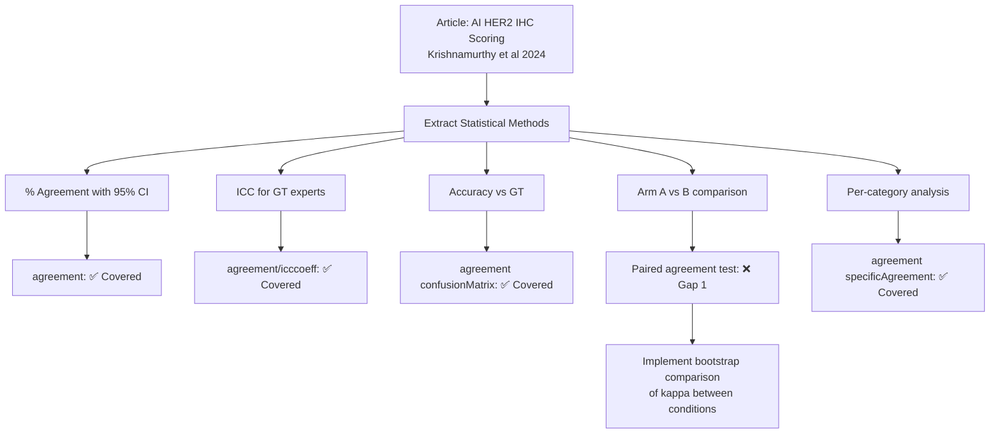
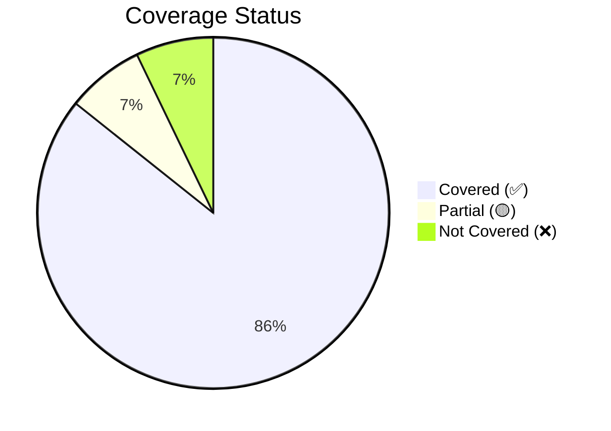

# Citation Review: Fully Automated AI Solution for HER2 IHC Scoring in Breast Cancer

---

## ARTICLE SUMMARY

- **Title/Label**: Fully Automated Artificial Intelligence Solution for Human Epidermal Growth Factor Receptor 2 Immunohistochemistry Scoring in Breast Cancer: A Multireader Study
- **Design & Cohort**: Prospective two-arm multireader crossover study; N = 120 HER2 IHC whole-slide images from 4 laboratories in 3 countries (US, France, Israel); 4 general surgical pathologists (readers) scored without AI (arm A) and with AI (arm B); Ground truth (GT) established by 5 international expert breast pathologists; High-confidence GT defined as agreement of ≥4/5 experts (n = 92 slides).
- **Key Analyses**:
  - Interobserver agreement (percent agreement with 95% CI) among GT experts and among readers
  - Intraclass correlation coefficient (ICC) for overall GT expert agreement
  - Accuracy = agreement of readers/AI with high-confidence GT
  - Comparison of interobserver agreement and accuracy between arm A (manual digital) and arm B (AI-assisted)
  - Per-score category analysis (HER2 0, 1+, 2+, 3+) and binary distinction (0 vs 1+)
  - AI standalone performance vs high-confidence GT
  - Statistical significance testing (P < .05) for improvement in agreement

---

## ARTICLE CITATION

| Field | Value |
|-------|-------|
| Title | Fully Automated Artificial Intelligence Solution for Human Epidermal Growth Factor Receptor 2 Immunohistochemistry Scoring in Breast Cancer: A Multireader Study |
| Journal | JCO Precision Oncology |
| Year | 2024 |
| Volume | 8 |
| Issue | — |
| Pages | e2400353 |
| DOI | 10.1200/PO.24.00353 |
| PMID | TODO |
| Publisher | American Society of Clinical Oncology |
| ISSN | TODO |

---

## Skipped Sources

*None — PDF was read successfully.*

---

## EXTRACTED STATISTICAL METHODS

| Method / Model | Role (primary/secondary) | Variants & Options | Assumptions/Diagnostics | References (sec/page) |
|---|---|---|---|---|
| Percent agreement (pairwise) | Primary — interobserver concordance | Average of all pair agreement rates; per HER2 score and overall | Assumes nominal/ordinal categories (HER2 0/1+/2+/3+) | Statistical Analysis (p4), Results (p4-6) |
| 95% Confidence intervals (for percent agreement) | Primary — precision estimate | Not specified if exact binomial, normal approximation, or bootstrap | — | Statistical Analysis (p4), Figs 4A-E |
| Intraclass correlation coefficient (ICC) | Secondary — GT expert agreement summary | ICC = 0.86 (95% CI 0.82–0.89) reported for 5 GT experts; model type not specified | Assumes continuous/interval scale for ordinal scores (0/1+/2+/3+ treated as 0/1/2/3); ICC model type (one-way, two-way) not specified | Results (p4) |
| Accuracy (% agreement with GT) | Primary — AI and reader performance | Mean accuracy across 4 readers; per-score and binary (0 vs 1+) | Reference standard = high-confidence GT (≥4/5 expert agreement) | Results (p5-6) |
| Statistical significance test | Primary — comparing arms | P < .05 threshold mentioned; specific test not named (likely McNemar, paired proportion test, or chi-square) | Paired data (same readers, same slides, crossover design) | Statistical Analysis (p4), Results (p5) |
| Sample size calculation | Design — power analysis | Referenced in Data Supplement; details not in main text | — | Materials and Methods (p2) |
| Descriptive statistics | Secondary | Mean, SD for continuous; count, % for categorical | — | Statistical Analysis (p4) |

---

## CLINICOPATH JAMOVI COVERAGE MATRIX

| Article Method | Jamovi Function(s) | Coverage | Notes / Workarounds |
|---|---|:---:|---|
| Percent agreement (pairwise, per-category) | `agreement` (weighted kappa section gives raw agreement; `specificAgreement` for per-category) | ✅ | `agreement` computes overall percent agreement and per-category specific agreement |
| 95% CI for percent agreement | `agreement` (bootstrapCI option) | ✅ | BCa bootstrap CIs available for agreement metrics since 2026-02-08 implementation |
| Intraclass correlation coefficient (ICC) | `agreement` (`icc` option), `icccoeff` | ✅ | `agreement` supports ICC(1,1) through ICC(3,k); `icccoeff` is dedicated ICC function |
| Cohen's/Fleiss' Kappa | `agreement` (weighted kappa, `lightKappa`, Fleiss) | ✅ | Cohen's kappa for 2 raters, Fleiss/Light for 3+ raters |
| Accuracy vs reference standard | `agreement` (`confusionMatrix` option) | ✅ | Multi-class confusion matrix with per-class precision/recall/F1 (implemented 2026-02-08) |
| Concordance F1 / multi-annotator concordance | `agreement` (`multiAnnotatorConcordance`) | ✅ | Concordance accuracy where prediction matches ANY annotator (implemented 2026-02-08) |
| McNemar test (paired proportions comparison) | `conttablespaired` | ✅ | McNemar test with exact option; also Stuart-Maxwell for multi-category |
| Paired comparison of agreement rates (arm A vs B) | `agreement` + manual | 🟡 | No direct "compare two agreement rates" function; would need bootstrap CIs for each arm and compare, or use `conttablespaired` on concordance tables |
| Sample size for agreement studies | — | ❌ | No dedicated sample size calculator for agreement/reliability studies |
| Weighted kappa (ordinal HER2 scores) | `agreement` (`wght` option: equal, linear, quadratic) | ✅ | Ordinal weighting appropriate for HER2 0/1+/2+/3+ |
| Agreement heatmap (confusion matrix visualization) | `agreement` (`agreementHeatmap`) | ✅ | Heatmap with counts and percentages |
| Rater bias test | `agreement` (`raterBias`) | ✅ | Tests systematic bias between raters |
| Bhapkar / Stuart-Maxwell test | `agreement` (`bhapkar`, `stuartMaxwell`) | ✅ | Tests marginal homogeneity for 2 raters |
| Bland-Altman (if continuous scores were used) | `agreement` (`blandAltmanPlot`), `methodcomparison` | ✅ | Not directly applicable here (ordinal scores) but available |
| Hierarchical/multilevel kappa (multi-site) | `agreement` (`hierarchicalKappa`, `clusterVariable`) | ✅ | Can account for laboratory/site clustering (implemented 2026-02-08) |
| Rater profile comparison | `agreement` (`raterProfiles`) | ✅ | Visual comparison of score distributions across raters |
| Pairwise kappa with reference rater | `agreement` (`pairwiseKappa`, `referenceRater`) | ✅ | Compare each reader to GT/reference |
| Gwet's AC1/AC2 (chance-corrected agreement) | `agreement` (`gwet`) | ✅ | Often preferred over kappa for ordinal data with skewed distributions |

---

## CRITICAL EVALUATION OF STATISTICAL METHODS

**Overall Rating**: 🟡 Minor issues

**Summary**: The study uses a well-designed two-arm crossover multireader framework appropriate for evaluating AI-assisted diagnostic tools. However, the statistical analysis section is notably sparse — the specific tests used for comparing arms are not named, ICC model type is not specified, and effect sizes beyond percentage differences are not reported. The use of percent agreement without chance correction as the primary metric is a limitation; kappa or weighted kappa would have been more informative. The study acknowledges power limitations for subgroup analyses.

**Checklist**

| Aspect | Assessment | Evidence (section/page) | Recommendation |
|---|:---:|---|---|
| Design–method alignment | 🟡 | Crossover design appropriate; but primary metric (% agreement) doesn't account for chance agreement | Use weighted kappa (linear or quadratic) as primary metric; % agreement as supplementary |
| Assumptions & diagnostics | 🔴 | ICC model type not specified; ordinal scores treated as interval for ICC; no normality/distribution checks reported | Specify ICC model (two-way random, absolute agreement); use ordinal-appropriate ICC or weighted kappa |
| Sample size & power | 🟡 | Sample size calculation referenced in supplement; study acknowledges underpowering for 0 vs 1+ and per-scanner/antibody analyses | Report power calculation details in main text; larger validation planned |
| Multiplicity control | 🟡 | Multiple per-score and per-subset comparisons without formal adjustment | Apply Bonferroni or BH correction for multiple HER2 score categories |
| Model specification & confounding | 🟡 | Multi-site, multi-antibody, multi-scanner design but no formal adjustment for these factors | Use hierarchical/multilevel kappa or mixed-effects model to account for clustering |
| Missing data handling | 🟢 | 1 case excluded (no majority GT); 27 low-confidence GT cases analyzed separately; clear inclusion criteria | Transparent handling; sensitivity analysis with low-confidence GT is good practice |
| Effect sizes & CIs | 🟡 | 95% CIs reported for agreement rates; but no kappa, no effect size measures for improvement magnitude | Report kappa with CI; report difference in agreement rates with CI; consider NNT for clinical significance |
| Validation & calibration | 🟢 | AI standalone performance reported; crossover design with washout period; blinding of readers and GT experts | Good validation design; external validation underway per Discussion |
| Reproducibility/transparency | 🟡 | SAS v9.4 stated; algorithm details in supplement; data restricted-access; specific statistical tests not named | Name all statistical tests used; provide code/analysis scripts; STARD reporting checklist |

**Scoring Rubric**

| Aspect | Score (0–2) | Badge |
|---|:---:|:---:|
| Design–method alignment | 1 | 🟡 |
| Assumptions & diagnostics | 0 | 🔴 |
| Sample size & power | 1 | 🟡 |
| Multiplicity control | 1 | 🟡 |
| Model specification & confounding | 1 | 🟡 |
| Missing data handling | 2 | 🟢 |
| Effect sizes & CIs | 1 | 🟡 |
| Validation & calibration | 2 | 🟢 |
| Reproducibility/transparency | 1 | 🟡 |

**Total Score**: 10/18 → Overall Badge: 🟡 Moderate

**Red flags noted:**
- Primary metric is percent agreement without chance correction — inflated by prevalence distribution
- ICC applied to ordinal 4-category scores (0/1+/2+/3+) as if interval — methodological concern
- Specific statistical test for arm A vs B comparison is not named — could be chi-square, McNemar, or bootstrap test
- No kappa coefficients reported despite being the standard for interrater reliability
- Multiple per-category comparisons without explicit multiplicity correction
- Heavy conflicts of interest (5/15 authors employed by Ibex Medical Analytics; study supported by Ibex)

---

## GAP ANALYSIS (WHAT'S MISSING)

### Gap 1: Paired Comparison of Agreement Rates Between Two Conditions
- **Method**: Formal statistical test comparing interobserver agreement between arm A and arm B (e.g., bootstrap test for difference in kappa, permutation test for agreement improvement)
- **Impact**: Central analysis of this paper — determines if AI significantly improves agreement
- **Closest existing function**: `agreement` computes agreement for one set of raters; no built-in comparison of two conditions
- **Exact missing options**: Need a "condition comparison" or "paired agreement test" that takes two sets of ratings (same raters, same cases, different conditions) and tests if agreement differs significantly

### Gap 2: Sample Size Calculation for Agreement Studies
- **Method**: Power/sample size for kappa-based or ICC-based agreement studies
- **Impact**: Essential for designing biomarker agreement studies in pathology; this paper references a sample size calculation
- **Closest existing function**: `survivalPower`, `diagnosticsamplesize` exist but not for agreement
- **Exact missing options**: `agreementSampleSize` function with inputs: expected kappa, null kappa, number of raters, number of categories, alpha, power

### Gap 3: Agreement Comparison Across Clustering Variables (Multi-Site)
- **Method**: Testing whether agreement differs across laboratories, antibodies, or scanners — requires stratified agreement with formal homogeneity test
- **Impact**: This study used slides from 4 labs with 3 antibodies and 2 scanners; a formal test of agreement heterogeneity across these factors would strengthen the analysis
- **Closest existing function**: `agreement` has `hierarchicalKappa` with `testClusterHomogeneity` and `agreementBySubgroup`
- **Exact missing options**: Already implemented (hierarchical kappa with homogeneity test) — this is ✅ covered but the study didn't use it

### Gap 4: STARD-AI Reporting Compliance Checker
- **Method**: Automated checklist validation against STARD-AI (Standards for Reporting Diagnostic Accuracy Studies — AI extension) reporting guidelines
- **Impact**: Regulatory and publication requirement for AI diagnostic studies
- **Closest existing function**: None
- **Exact missing options**: Outside scope of statistical module; better suited for a documentation tool

---

## ROADMAP (IMPLEMENTATION PLAN)

### Gap 1: Paired Agreement Comparison Between Conditions

**Target**: Extend `agreement` module or the existing `mixedEffectsComparison` to support comparing agreement metrics between two conditions (e.g., with/without AI) on the same cases.

**Note**: The `mixedEffectsComparison` feature (implemented 2026-02-08) already supports condition comparison for continuous measures. For categorical agreement (kappa), a bootstrap-based comparison is needed.

**Approach**: Add a "Paired Agreement Comparison" option that:
1. Takes two sets of rater columns (condition A columns and condition B columns)
2. Computes kappa/agreement for each condition
3. Uses bootstrap to test if the difference is significant

**.a.yaml** (add options):

```yaml
- name: pairedAgreementTest
  title: Compare Agreement Between Conditions
  type: Bool
  default: false

- name: conditionBVars
  title: Condition B Raters
  type: Variables
  suggested:
    - nominal
    - ordinal
  permitted:
    - factor
  description: >
    Select the rater columns for the second condition (e.g., AI-assisted).
    Condition A uses the main rater variables.
```

**.b.R** (sketch):

```r
.calculatePairedAgreementTest = function(ratings_A, ratings_B) {
    # Compute kappa for each condition
    kappa_A <- private$.computeKappa(ratings_A)
    kappa_B <- private$.computeKappa(ratings_B)

    # Bootstrap test for difference
    n_boot <- 2000
    set.seed(42)
    n_cases <- nrow(ratings_A)
    boot_diffs <- numeric(n_boot)

    for (b in seq_len(n_boot)) {
        idx <- sample(n_cases, replace = TRUE)
        k_A <- private$.computeKappa(ratings_A[idx, , drop = FALSE])
        k_B <- private$.computeKappa(ratings_B[idx, , drop = FALSE])
        boot_diffs[b] <- k_B - k_A
    }

    diff_est <- kappa_B - kappa_A
    ci_lower <- quantile(boot_diffs, 0.025)
    ci_upper <- quantile(boot_diffs, 0.975)
    p_value <- 2 * min(mean(boot_diffs <= 0), mean(boot_diffs >= 0))

    table <- self$results$pairedAgreementTable
    table$addRow(rowKey = "kappa_A", values = list(
        metric = "Kappa (Condition A)", value = kappa_A
    ))
    table$addRow(rowKey = "kappa_B", values = list(
        metric = "Kappa (Condition B)", value = kappa_B
    ))
    table$addRow(rowKey = "difference", values = list(
        metric = "Difference (B - A)", value = diff_est,
        ci_lower = ci_lower, ci_upper = ci_upper, p_value = p_value
    ))
}
```

**.r.yaml** (result table):

```yaml
- name: pairedAgreementTable
  title: Paired Agreement Comparison
  type: Table
  visible: (pairedAgreementTest)
  columns:
    - name: metric
      title: Metric
      type: text
    - name: value
      title: Value
      type: number
      format: zto
    - name: ci_lower
      title: 95% CI Lower
      type: number
      format: zto
    - name: ci_upper
      title: 95% CI Upper
      type: number
      format: zto
    - name: p_value
      title: p
      type: number
      format: zto,pvalue
```

**.u.yaml** (UI toggle):

```yaml
- type: CollapseBox
  label: Paired Agreement Comparison [Categorical] (With vs Without AI)
  collapsed: true
  children:
    - type: LayoutBox
      margin: large
      children:
        - type: CheckBox
          name: pairedAgreementTest
        - type: VariableSupplier
          persistentItems: false
          stretchFactor: 1
          children:
            - type: TargetLayoutBox
              label: Condition B Raters
              children:
                - type: VariablesListBox
                  name: conditionBVars
                  isTarget: true
                  enable: (pairedAgreementTest)
```

**Dependencies**: None new (bootstrap is base R).

**Validation**:
- Simulate crossover study: same 100 cases, 4 raters, condition A (random agreement ~60%) vs condition B (boosted agreement ~80%). Verify bootstrap test detects significance.
- Compare bootstrap CI coverage with parametric methods.
- Edge case: identical ratings in both conditions → difference = 0, p = 1.

---

### Gap 2: Sample Size for Agreement Studies

**Target**: New function `agreementSampleSize` or extend `diagnosticsamplesize`.

**Approach**: Implement sample size formulas for:
1. **Kappa-based**: Testing H0: kappa ≤ kappa_0 vs H1: kappa ≥ kappa_1 (Donner & Eliasziw 1992; Sim & Wright 2005)
2. **ICC-based**: Testing H0: ICC ≤ rho_0 vs H1: ICC ≥ rho_1 (Walter et al. 1998)

**.a.yaml** (sketch):

```yaml
- name: agreementType
  title: Agreement Metric
  type: List
  options:
    - title: Cohen's Kappa
      name: kappa
    - title: Fleiss' Kappa
      name: fleiss
    - title: ICC
      name: icc
  default: kappa

- name: kappa_null
  title: Null Kappa (H0)
  type: Number
  min: 0
  max: 1
  default: 0.4

- name: kappa_alt
  title: Alternative Kappa (H1)
  type: Number
  min: 0
  max: 1
  default: 0.7

- name: n_raters_ss
  title: Number of Raters
  type: Integer
  min: 2
  max: 100
  default: 2

- name: n_categories
  title: Number of Categories
  type: Integer
  min: 2
  max: 20
  default: 4

- name: alpha_ss
  title: Significance Level
  type: Number
  min: 0.001
  max: 0.2
  default: 0.05

- name: power_ss
  title: Desired Power
  type: Number
  min: 0.5
  max: 0.999
  default: 0.80
```

**.b.R** (sketch):

```r
# Donner (1998) formula for sample size for kappa
# n = (z_alpha + z_beta)^2 / (kappa_1 - kappa_0)^2 * V(kappa)
# where V(kappa) depends on number of categories and marginal proportions

.calculateAgreementSampleSize = function() {
    metric <- self$options$agreementType
    k0 <- self$options$kappa_null
    k1 <- self$options$kappa_alt
    alpha <- self$options$alpha_ss
    power <- self$options$power_ss
    n_raters <- self$options$n_raters_ss
    n_cat <- self$options$n_categories

    z_alpha <- qnorm(1 - alpha/2)
    z_beta <- qnorm(power)

    if (metric == "kappa") {
        # Simplified: assume equal marginal proportions
        p_e <- 1 / n_cat  # expected agreement under independence
        var_kappa <- (1 / (1 - p_e)^2) * (p_e + p_e^2 - sum(rep(1/n_cat, n_cat)^3))
        n_required <- ceiling((z_alpha + z_beta)^2 * var_kappa / (k1 - k0)^2)
    } else if (metric == "icc") {
        # Walter et al. (1998) for ICC
        n_required <- ceiling(1 + (2 * (z_alpha + z_beta)^2 * (1 - k1)^2 * (1 + (n_raters - 1) * k1)^2) /
                              (n_raters * (n_raters - 1) * (k1 - k0)^2))
    }

    table <- self$results$sampleSizeTable
    table$addRow(rowKey = 1, values = list(
        metric = metric,
        n_required = n_required,
        n_raters = n_raters,
        kappa_null = k0,
        kappa_alt = k1,
        alpha = alpha,
        power = power
    ))
}
```

**Dependencies**: None new (base R `qnorm`).

**Validation**:
- Compare with published tables (Sim & Wright 2005).
- Verify with simulation: generate kappa-distributed data, check empirical power matches formula.

---

## TEST PLAN

### Unit Tests
- **Paired agreement comparison**: Simulate 50 cases, 3 raters, two conditions with known kappa improvement. Verify bootstrap CI contains true difference. Use seed = 42.
- **Sample size for kappa**: Compare output against known published values (e.g., Sim & Wright 2005 Table 2).
- **ICC model specification**: Verify ICC type reported matches input specification.

### Assumption Tests
- Ordinal data: Verify weighted kappa uses appropriate weights (linear vs quadratic).
- ICC on ordinal: Flag warning when ICC is requested for data with < 5 unique values.

### Edge Cases
- All raters agree perfectly (kappa = 1): CIs should be [1, 1] or handle degeneracy.
- Single category cases: Division-by-zero protection for per-category agreement.
- Small samples (n < 10): Bootstrap should warn about instability.
- Unequal categories across conditions: Validation error if categories don't match.

### Performance
- N = 10,000 cases, 10 raters, 2000 bootstrap replications: Should complete < 30 seconds.

### Reproducibility
- All bootstrap methods use `set.seed(42)` for deterministic results.
- Example analysis script with the study's reported values as expected outputs.

---

## DEPENDENCIES

| Package | Purpose | Status |
|---|---|---|
| `irr` | Kappa computation (kappa2, kappam.fleiss) | Already imported |
| `psych` | ICC computation | Already imported |
| `lme4` | Mixed-effects models for hierarchical agreement | Already imported |
| Base R (`stats`) | Bootstrap, qnorm, quantile | Always available |

**No new dependencies required** for any of the proposed implementations.

---

## PRIORITIZATION

| Priority | Gap | Impact | Effort | Notes |
|:---:|---|---|---|---|
| 1 | **Paired agreement comparison** (Gap 1) | High — central analysis for AI validation studies | Medium (bootstrap framework exists) | Builds on existing `agreement` module; high clinical demand for AI vs manual comparisons |
| 2 | **Sample size for agreement studies** (Gap 2) | High — study design necessity | Low-medium (known formulas) | New standalone function; frequently requested in pathology research |
| 3 | **STARD-AI reporting** (Gap 4) | Low — documentation tool | High | Outside scope of statistical module |

---

## OPTIONAL DIAGRAMS

### Pipeline Overview



### Coverage Summary



---

## CAVEATS

1. The article's Statistical Analysis section is remarkably brief — only 6 sentences. The specific test used to determine "statistical significance" for arm A vs B comparisons is not named. It could be a paired t-test on per-case agreement, a McNemar test on concordance tables, a permutation test, or a bootstrap test. This ambiguity limits precise method mapping.

2. The ICC = 0.86 reported for GT experts treats the ordinal HER2 scores (0/1+/2+/3+) as interval data. While this is common practice, it assumes equal spacing between categories, which may not reflect biological reality (the jump from 0 to 1+ may be more consequential than from 2+ to 3+). Weighted kappa with clinical weights would have been more appropriate.

3. The study was sponsored by and primarily authored by employees of the AI solution vendor (Ibex Medical Analytics), which introduces potential bias. The statistical analysis was presumably conducted by the same group, though this is not explicitly stated.

4. The sample size (N = 120 total, n = 92 high-confidence GT) is moderate. The study acknowledges it was underpowered for per-scanner and per-antibody subgroup analyses.

5. No formal multiplicity correction was applied despite testing multiple HER2 score categories, multiple comparison metrics (agreement, accuracy), and multiple subsets (all slides, high-confidence GT, 0 vs 1+).
