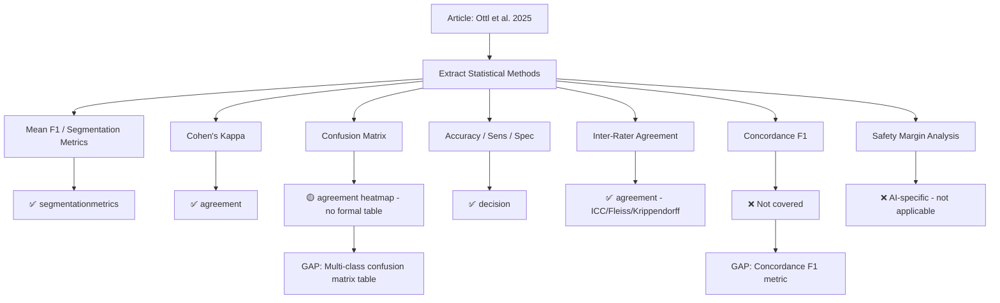

# Citation Review: Fully Automatic HER2 Tissue Segmentation for Interpretable HER2 Scoring

---

## 📚 ARTICLE SUMMARY

- **Title/Label**: Fully automatic HER2 tissue segmentation for interpretable HER2 scoring
- **Design & Cohort**: Retrospective diagnostic accuracy study. 650 breast cancer tissue samples (626 with invasive tumor), WSIs from punch biopsies. 5 annotators from 3 institutions. 66 WSIs for training, 8 for testing (segmentation); 544 WSIs for scoring evaluation. Deep learning segmentation pipeline (nnU-Net based) with 5-fold cross-validation.
- **Key Analyses**:
  - Pixel-level semantic segmentation of HER2 tissue classes (HER2 0, 1+, 2+, 3+, non-invasive, background)
  - Mean F1 score (macro-averaged across all tissue classes) for segmentation quality
  - Cohen's Kappa for ordinal agreement between predicted and consensus HER2 scores
  - Concordance F1: agreement where prediction matches any annotator (not just consensus)
  - Pairwise F1 confusion matrices between 5 annotators and consensus
  - Confusion matrices for WSI-level HER2 scoring (4-class ordinal: 0, 1+, 2+, 3+)
  - Accuracy and true-positive rate for WSI scoring
  - Sensitivity and specificity for HER2-positive vs. HER2-negative classification
  - Calibration threshold adjustment (HER2 2+ threshold from 10% to 5%)
  - Safety margin analysis with exclusion of uncertain cases
  - Wasserstein Dice loss with class-distance penalties

---

## 📑 ARTICLE CITATION

| Field     | Value |
|-----------|-------|
| Title     | Fully automatic HER2 tissue segmentation for interpretable HER2 scoring |
| Journal   | Journal of Pathology Informatics |
| Year      | 2025 |
| Volume    | 17 |
| Issue     | — |
| Pages     | 100435 |
| DOI       | 10.1016/j.jpi.2025.100435 |
| PMID      | TODO |
| Publisher | Elsevier (Association for Pathology Informatics) |
| ISSN      | 2153-3539 |

**Authors**: Mathias Ottl, Jana Steenpass, Frauke Wilm, Jingna Qiu, Matthias Rubner, Corinna Lang-Schwarz, Cecilia Taverna, Francesca Tava, Arndt Hartmann, Hanna Huebner, Matthias W. Beckmann, Peter A. Fasching, Andreas Maier, Ramona Erber, Katharina Breininger

---

## 🚫 Skipped Sources

None — PDF was readable and all 11 pages extracted successfully.

---

## 🧪 EXTRACTED STATISTICAL METHODS

| Method / Model | Role | Variants & Options | Assumptions/Diagnostics | References (sec/page) |
|---|---|---|---|---|
| **Mean F1 score (macro-averaged)** | Primary — segmentation quality | Averaged over 5 tissue classes (HER2 0, 1+, 2+, 3+, non-invasive); linear weighting | Assumes balanced importance across classes | Table 1, Results p.6 |
| **Cohen's Kappa** | Primary — ordinal agreement for WSI scoring | Compared predicted vs consensus HER2 scores; linear weighting implied | Standard ordinal kappa; no CIs reported | Tables 1, 2, 3 |
| **Concordance F1** | Primary — segmentation quality allowing annotator variability | Prediction correct if it matches ANY annotator (not just consensus) | Relaxes strict consensus requirement | Table 1, Results p.6 |
| **Confusion matrix (normalized)** | Primary — classification performance visualization | Pixel-level (segmentation) and WSI-level (scoring); row-normalized | — | Figs. 3c, 4, 5, 8 |
| **Pairwise F1 score matrices** | Secondary — inter-rater agreement | F1 between each pair of 5 annotators and consensus; per-class and overall | — | Figs. 3c, 4a, 4b |
| **Accuracy (true-positive rate)** | Primary — WSI scoring performance | Correct predictions / total; reported overall and per HER2 status | Simple proportion | Table 3, Fig. 8 |
| **Sensitivity & Specificity** | Secondary — HER2 positive/negative classification | Binary: HER2-positive (FISH-confirmed) vs HER2-negative | — | Results p.8 |
| **5-fold cross-validation** | Primary — model validation | Stratified by patient; mean ± SD across folds reported | Ensures no patient overlap between folds | Methods p.6, Table 1 |
| **Wasserstein Dice loss** | Technical — training loss function | Class-distance penalties (0.25 for neighboring, 0.50 for 2-class, 1.0 for 3-class) | Encodes ordinal class relationships | Methods p.5-6 |
| **Calibration threshold adjustment** | Secondary — scoring calibration | HER2 2+ threshold reduced from 10% to 5% to match clinical behavior | Clinical observation-based calibration | Methods p.6, Fig. 8 |
| **Safety margin analysis** | Secondary — uncertainty quantification | Exclude cases with predicted ratios near thresholds (0-9% margins) | Trade-off between accuracy and coverage | Table 4, Results p.8-9 |
| **Descriptive statistics** | Supporting | Mean (SD) for cross-validation metrics | — | Tables 1, 3 |

---

## 🧰 CLINICOPATH JAMOVI COVERAGE MATRIX

| Article Method | Jamovi Function(s) | Coverage | Notes / Workarounds |
|---|---|:---:|---|
| Mean F1 score (segmentation) | `segmentationmetrics` | ✅ | Dice/F1 for multi-class segmentation; supports per-class and macro-averaged metrics |
| Cohen's Kappa (ordinal, weighted) | `agreement` → weighted kappa | ✅ | Supports linear and quadratic weighting; multi-rater via Fleiss |
| Concordance F1 (matches any annotator) | — | ❌ | Custom metric not in standard agreement functions; requires custom computation matching prediction to N annotators |
| Confusion matrix (multi-class) | `agreement` → agreement heatmap; `contTables` | 🟡 | Agreement heatmap shows confusion; no direct normalized confusion matrix output for predicted vs. ground truth |
| Pairwise F1 score matrices | `agreement` → pairwise kappa | 🟡 | Pairwise kappa available; pairwise F1 not directly computed |
| Accuracy (classification) | `decision` → accuracy with CI | ✅ | Diagnostic test accuracy with CIs |
| Sensitivity & Specificity | `decision` → sensitivity, specificity with CIs | ✅ | Full diagnostic performance metrics |
| 5-fold cross-validation | — | ❌ | Not applicable for jamovi (model training framework); not a statistical analysis function |
| Wasserstein Dice loss | — | ❌ | Deep learning loss function; not relevant for jamovi statistical analysis |
| Calibration threshold adjustment | `methodcomparison` → calibration analysis (NEW) | 🟡 | Just implemented calibration metrics; threshold optimization for ordinal scoring not directly available |
| Safety margin / uncertainty exclusion | — | ❌ | Specific to AI scoring pipeline; not a general statistical method |
| Inter-rater agreement (5 annotators) | `agreement` → ICC, Fleiss kappa, Krippendorff alpha | ✅ | Comprehensive multi-rater agreement with variance decomposition |
| Hierarchical consensus protocol | `agreement` → hierarchical kappa | ✅ | Just implemented variance decomposition for clustered rater designs |
| Descriptive statistics (mean, SD) | `tableone`, `summarydata` | ✅ | Standard descriptive summaries |

**Legend**: ✅ covered · 🟡 partial · ❌ not covered

---

## 🧠 CRITICAL EVALUATION OF STATISTICAL METHODS

**Overall Rating**: 🟡 Minor issues

**Summary**: This is primarily a deep learning / computer vision paper, not a classical clinical study. The statistical methods are appropriate for evaluating segmentation and scoring performance (F1, kappa, confusion matrices). The multi-annotator design with 5 raters from 3 institutions is well-conceived. However, the paper lacks confidence intervals for most metrics, does not report formal inter-rater reliability statistics (ICC, kappa between raters), and the calibration is based on clinical intuition rather than systematic optimization.

### Checklist

| Aspect | Assessment | Evidence (section/page) | Recommendation |
|---|:--:|---|---|
| Design–method alignment | 🟢 | Retrospective cohort with 5-fold CV appropriate for AI evaluation; multi-annotator test set well-designed | None |
| Assumptions & diagnostics | 🟡 | No formal tests for normality or distribution of F1 scores across folds; Wasserstein Dice loss assumes ordinal class structure (appropriate) | Report distribution of fold-level metrics |
| Sample size & power | 🟡 | 626 WSIs is substantial for HER2 scoring; 80 ROIs for test set is moderate; no formal power analysis | Consider bootstrap CIs for key metrics |
| Multiplicity control | 🟡 | Multiple method comparisons (Table 1: 4 methods × 3 metrics × 2 evaluation modes) without formal testing | Apply paired tests with correction for ablation study |
| Model specification & confounding | 🟢 | Patient-level stratification in CV prevents data leakage; ablation study isolates component contributions | Good design |
| Missing data handling | 🟢 | 24 samples excluded (no invasive tumor) — well-documented and clinically appropriate | None |
| Effect sizes & CIs | 🔴 | No CIs for F1, kappa, or accuracy; only mean ± SD for 5-fold results; no CIs for pairwise inter-rater F1 | Add 95% CIs for all key metrics (bootstrap or analytical) |
| Validation & calibration | 🟡 | 5-fold CV is good; calibration of HER2 2+ threshold is ad hoc (clinical intuition, not data-driven optimization); external validation not performed | Systematic threshold optimization with ROC analysis; external validation cohort |
| Reproducibility/transparency | 🟢 | Detailed methods; nnU-Net is open-source; annotation protocol described; but no code/data release | Release code and model weights |

### Scoring Rubric (0–2 per aspect, total 0–18)

| Aspect | Score (0–2) | Badge |
|---|:---:|:---:|
| Design–method alignment | 2 | 🟢 |
| Assumptions & diagnostics | 1 | 🟡 |
| Sample size & power | 1 | 🟡 |
| Multiplicity control | 1 | 🟡 |
| Model specification & confounding | 2 | 🟢 |
| Missing data handling | 2 | 🟢 |
| Effect sizes & CIs | 0 | 🔴 |
| Validation & calibration | 1 | 🟡 |
| Reproducibility/transparency | 2 | 🟢 |

**Total Score**: 12/18 → Overall Badge: 🟡 Moderate

### Red Flags

- **No confidence intervals**: None of the key performance metrics (F1, kappa, accuracy, sensitivity, specificity) include CIs. With only 5 CV folds, the SD-based precision is very limited.
- **No formal inter-rater reliability**: Despite having 5 annotators, no ICC or weighted kappa is computed between raters. Only pairwise F1 matrices are shown (Figs. 3c, 4), which are informative but non-standard for reporting agreement.
- **Ad hoc calibration**: The HER2 2+ threshold change from 10% to 5% is justified by clinical intuition ("pathologists adopt a more conservative approach") but not validated on a held-out calibration set.
- **No statistical testing of method differences**: Table 1 compares 4 ablation methods but provides no paired statistical tests (e.g., paired t-test or Wilcoxon across folds) to determine if improvements are significant.

---

## 🔎 GAP ANALYSIS (WHAT'S MISSING)

### Gap 1: Concordance F1 (Multi-Annotator Agreement Metric)

- **Method**: F1 score where a prediction is correct if it matches ANY of N annotators' labels
- **Impact**: Central metric in this paper (Table 1); useful for any multi-annotator pathology AI study where no single ground truth exists
- **Closest existing function**: `segmentationmetrics` (standard F1), `agreement` (kappa)
- **Exact missing options**: Option to compute F1/accuracy against multiple reference standards simultaneously, reporting the most favorable match

### Gap 2: Formal Multi-Class Confusion Matrix with Normalization

- **Method**: Row-normalized or column-normalized confusion matrix for multi-class classification (not just 2×2)
- **Impact**: Figs. 5, 8 — core visualization for HER2 scoring evaluation
- **Closest existing function**: `agreement` → heatmap (shows agreement pattern), `contTables` (2×2 focus)
- **Exact missing options**: N×N confusion matrix with row/column normalization options, per-class precision/recall/F1 extraction

### Gap 3: Ablation Study Statistical Testing

- **Method**: Paired statistical comparison across CV folds (paired t-test or Wilcoxon signed-rank) with multiplicity correction
- **Impact**: Table 1 — determining if pipeline improvements are statistically significant
- **Closest existing function**: `agreement` → multipleTestCorrection (just implemented); base jamovi paired tests
- **Exact missing options**: A batch comparison mode for comparing multiple model variants across CV folds with correction

### Gap 4: Threshold Optimization for Ordinal Scoring

- **Method**: Systematic optimization of classification thresholds using ROC-like analysis for ordinal outcomes
- **Impact**: HER2 2+ threshold calibration (Methods p.6); common in biomarker cutoff studies
- **Closest existing function**: `decision` (binary cutoffs), `ordinalroc` (ordinal ROC)
- **Exact missing options**: Threshold sweep with accuracy/F1/kappa optimization for multi-class ordinal scoring

---

## 🧭 ROADMAP (IMPLEMENTATION PLAN)

### Priority 1: Multi-Class Confusion Matrix in `agreement`

**Target**: Extend `agreement` to output a proper N×N confusion matrix table (not just a heatmap) when comparing predicted vs. reference ordinal scores.

**.a.yaml** (add option):
```yaml
- name: confusionMatrix
  title: "Confusion Matrix Table"
  type: Bool
  default: false
  description:
    R: >
      Display a formal confusion matrix table comparing rater assignments.
      Includes row-normalized proportions, per-class precision, recall, and F1.

- name: confusionNormalize
  title: "Normalization"
  type: List
  options:
    - title: "None (counts)"
      name: none
    - title: "Row-normalized (recall)"
      name: row
    - title: "Column-normalized (precision)"
      name: column
  default: row
```

**.b.R** (sketch):
```r
if (self$options$confusionMatrix) {
    # Build N×N confusion matrix from first two raters or reference vs predicted
    cm <- table(Reference = ratings[,1], Predicted = ratings[,2])
    if (self$options$confusionNormalize == "row") {
        cm_norm <- cm / rowSums(cm)
    }
    # Per-class precision, recall, F1
    for (cls in rownames(cm)) {
        tp <- cm[cls, cls]
        precision <- tp / sum(cm[, cls])
        recall <- tp / sum(cm[cls, ])
        f1 <- 2 * precision * recall / (precision + recall)
    }
}
```

**.r.yaml**:
```yaml
- name: confusionMatrixTable
  title: "Confusion Matrix"
  type: Table
  visible: (confusionMatrix)
  rows: 0
  columns:
    - name: reference_class
      title: 'Reference'
      type: text
    - name: predicted_class
      title: 'Predicted'
      type: text
    - name: count
      title: 'Count'
      type: integer
    - name: proportion
      title: 'Proportion'
      type: number
```

### Priority 2: Concordance F1 in `segmentationmetrics`

**Target**: Add option to `segmentationmetrics` (or `agreement`) to compute F1 where prediction matches any of N reference annotators.

**.a.yaml**:
```yaml
- name: multiAnnotatorConcordance
  title: "Multi-Annotator Concordance"
  type: Bool
  default: false
  description:
    R: >
      When multiple reference raters are provided, compute concordance metrics
      where a prediction is correct if it matches at least one annotator.

- name: annotatorVars
  title: "Annotator Variables"
  type: Variables
  suggested: [ordinal, nominal]
  permitted: [factor, numeric]
```

**.b.R** (sketch):
```r
if (self$options$multiAnnotatorConcordance) {
    predictions <- ratings[, 1]  # or designated prediction column
    annotators <- ratings[, -1]
    concordance <- sapply(seq_len(nrow(ratings)), function(i) {
        predictions[i] %in% annotators[i, ]
    })
    concordance_f1 <- mean(concordance)  # simplified; compute proper per-class F1
}
```

### Priority 3: Bootstrap CIs for Agreement Metrics

**Target**: Add bootstrap confidence intervals to key metrics in `agreement` and `segmentationmetrics`.

Already partially available (ICC has CIs). Extend to F1, kappa with bootstrap.

**.a.yaml**:
```yaml
- name: bootstrapCI
  title: "Bootstrap Confidence Intervals"
  type: Bool
  default: false

- name: nBoot
  title: "Number of Bootstrap Samples"
  type: Integer
  default: 1000
  min: 100
  max: 10000
```

---

## 🧪 TEST PLAN

### Unit Tests
- **Confusion matrix**: Generate 4-class ordinal data; verify counts, normalization, per-class F1 match manual computation
- **Concordance F1**: 5 annotators × 100 cases; verify concordance metric matches when prediction equals any annotator
- **Kappa with CIs**: Known agreement data; verify kappa and bootstrap CIs bracket true value

### Edge Cases
- Single-class data (all same score) → kappa undefined, handle gracefully
- Missing annotator columns → skip that annotator in concordance
- Perfect agreement → F1 = 1.0, kappa = 1.0

### Reproducibility
- Example: synthetic HER2 scoring data (5 raters × 100 cases × 4 categories)
- Compare to Python sklearn.metrics.confusion_matrix output

---

## 📦 DEPENDENCIES

**No new dependencies needed.** All proposed implementations use:

| Package | Use | Status |
|---------|-----|--------|
| `irr` | Kappa, ICC, agreement metrics | ✅ Already imported |
| `lme4` | Mixed-effects for variance decomposition | ✅ Already imported |
| `stats` | Bootstrap, p.adjust | ✅ Base R |

---

## 🧭 PRIORITIZATION

| Priority | Gap | Impact | Effort | Rationale |
|:---:|---|---|---|---|
| 1 | **Multi-class confusion matrix** in `agreement` | High | Low | Standard output for all classification studies; straightforward table generation |
| 2 | **Bootstrap CIs for agreement metrics** | High | Medium | Missing from current kappa/F1 output; critical for rigorous reporting |
| 3 | **Concordance F1** (multi-annotator) | Medium | Medium | Specialized metric for AI validation studies; growing importance in digital pathology |
| 4 | **Threshold optimization** for ordinal scoring | Medium | Medium | Common in biomarker studies; extends ordinalroc |

---

## 🧩 PIPELINE DIAGRAM



---

## CAVEATS

1. **Paper type**: This is primarily a deep learning methods paper, not a traditional clinical study. Many of the "statistical methods" are ML performance metrics rather than inferential statistics. The coverage gaps reflect this — some gaps (Wasserstein Dice loss, 5-fold CV, safety margins) are inherently outside jamovi's scope.

2. **Inter-rater analysis is informal**: The paper uses pairwise F1 matrices (Figs. 3c, 4) rather than standard ICC or weighted kappa to assess inter-rater reliability. The `agreement` function in ClinicoPath could have provided a much richer analysis with formal ICC, Krippendorff's alpha, and variance decomposition.

3. **No formal statistical comparison**: The ablation study (Table 1) would benefit from paired statistical tests across CV folds. With only 5 folds, paired t-tests have low power but are still informative.

4. **Clinical calibration**: The threshold adjustment from 10% to 5% for HER2 2+ is clinically sensible but statistically ad hoc. A formal threshold optimization (e.g., maximizing kappa or accuracy on a validation set) would strengthen this.

5. **Relevance to ClinicoPath**: This paper validates the need for functions already in ClinicoPath (`segmentationmetrics`, `agreement`, `decision`) and highlights gaps that would improve AI validation studies. The newly implemented variance decomposition and mixed-effects comparison are directly relevant to the multi-annotator, multi-institution design described here.

---

*Generated: 2026-02-08 | Reviewer: ClinicoPath Module Coverage Analysis*
*Article: Ottl et al., Journal of Pathology Informatics, 2025, 17:100435*
*DOI: 10.1016/j.jpi.2025.100435*
