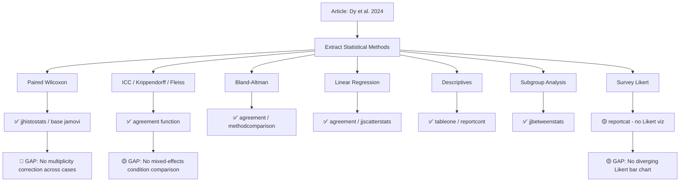
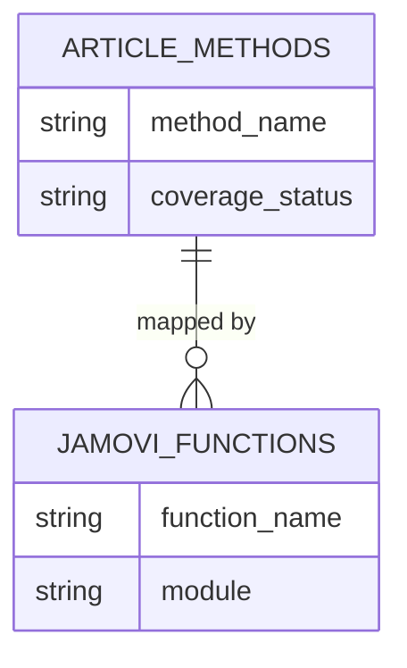

# Citation Review: AI Improves Accuracy, Agreement and Efficiency of Pathologists for Ki67 Assessments in Breast Cancer

---

## 📚 ARTICLE SUMMARY

- **Title/Label**: AI improves accuracy, agreement and efficiency of pathologists for Ki67 assessments in breast cancer
- **Design & Cohort**: Cross-sectional multi-rater agreement study. 90 international pathologists evaluated 10 breast cancer tissue microarrays (TMAs) with Ki-67 PI range 7–28%, each TMA scored twice (with and without AI assistance), yielding 900 paired assessments per condition. Additional survey component on pathologist opinions (N=90).
- **Key Analyses**:
  - Paired comparison of PI scoring error (absolute difference from ground truth) with vs. without AI — paired Wilcoxon signed-rank test
  - Inter-rater agreement: ICC (two-way random, single measures), Krippendorff's alpha, Fleiss' kappa (on binarized scores at 20% cutoff), percent agreement
  - Bland-Altman analysis (mean bias, limits of agreement) with and without AI
  - Linear regression of pathologist scores vs. ground truth (Pearson's r, slope, intercept, SSE)
  - Turnaround time (TAT) comparison: paired Wilcoxon signed-rank test
  - Subgroup analyses by years of experience, career stage, subspecialty
  - Shapiro-Wilk test for normality assessment
  - Descriptive statistics: mean, SD, median, IQR for PI scores, errors, and TAT
  - Survey analysis: Likert-scale responses summarized as proportions

---

## 📑 ARTICLE CITATION

| Field     | Value |
|-----------|-------|
| Title     | AI improves accuracy, agreement and efficiency of pathologists for Ki67 assessments in breast cancer |
| Journal   | Scientific Reports |
| Year      | 2024 |
| Volume    | 14 |
| Issue     | — |
| Pages     | 1283 |
| DOI       | 10.1038/s41598-024-51723-2 |
| PMID      | TODO — search PubMed |
| Publisher | Nature Portfolio / Springer Nature |
| ISSN      | 2045-2322 |

**Authors**: Amanda Dy, Ngoc-Nhu Jennifer Nguyen, Julien Meyer, Melanie Dawe, Wei Shi, Dimitri Androutsos, Anthony Fyles, Fei-Fei Liu, Susan Done & April Khademi

---

## 🚫 Skipped Sources

None — PDF was readable and all 10 pages extracted successfully.

---

## 🧪 EXTRACTED STATISTICAL METHODS

| Method / Model | Role | Variants & Options | Assumptions/Diagnostics | References (sec/page) |
|---|---|---|---|---|
| **Paired Wilcoxon signed-rank test** | Primary — comparison of PI error and TAT between AI and no-AI conditions | Two-sided, significance p < 0.05; applied per-case and overall | Shapiro-Wilk normality test indicated non-normal distributions → nonparametric test chosen | Methods p.4; Results Tables 1, 3 |
| **ICC (Two-way random, single measures)** | Primary — inter-rater agreement for continuous PI scores | ICC(2,1) model; 95% CIs reported | All cases evaluated by all raters (fully crossed design) | Methods p.4; Results p.4 |
| **Krippendorff's alpha** | Primary — inter-rater agreement (continuous) | Chosen for adaptability with continuous data; 95% CIs reported | — | Methods p.4; Results p.4 |
| **Fleiss' kappa** | Primary — inter-rater agreement on binarized data | Binarized at 20% cutoff (≥20% = 1, <20% = 0); 95% CIs | Assumes nominal categories; all raters rate all cases | Methods p.4; Table 2 |
| **Percent agreement** | Secondary — categorical agreement | Binarized at 20% PI cutoff | — | Table 2, p.6 |
| **Bland-Altman analysis** | Primary — method comparison (pathologist vs. ground truth) | Mean bias, 95% limits of agreement (mean ± 1.96 SD) | Assumes differences are approximately normally distributed | Methods p.4; Fig. 3B,D |
| **Linear regression** | Secondary — correlation of pathologist scores with ground truth | Pearson's r, slope, intercept, SSE reported | Assumes linearity; visual inspection via scatter plots | Methods p.4; Fig. 3A,C |
| **Descriptive statistics** | Supporting | Mean (SD), median, IQR for continuous variables | — | Tables 1, 3; Figures 2, 4 |
| **Shapiro-Wilk normality test** | Diagnostic | Used to justify non-parametric test choice | — | Methods p.4 |
| **Survey analysis (Likert scale)** | Descriptive | Proportions reported for 5-point Likert responses | — | Fig. 5, p.7–8 |

---

## 🧰 CLINICOPATH JAMOVI COVERAGE MATRIX

| Article Method | Jamovi Function(s) | Coverage | Notes / Workarounds |
|---|---|:---:|---|
| Paired Wilcoxon signed-rank test | `jjhistostats` (with paired option), or base jamovi T-Tests module | ✅ | jjhistostats wraps ggstatsplot which supports Wilcoxon; also available in base jamovi |
| ICC (Two-way random, single measures) | `agreement` → ICC table (uses `irr::icc`) | ✅ | agreement function computes ICC(1), ICC(2), ICC(3) with model selection; two-way random available |
| Krippendorff's alpha | `agreement` → Krippendorff's alpha table | ✅ | Directly supported with CIs via `irr::kripp.alpha` |
| Fleiss' kappa | `agreement` → Fleiss' kappa table | ✅ | Supports multi-rater kappa for categorical data with CIs |
| Percent agreement | `agreement` → percentage agreement table | ✅ | Computed via `irr::agree` |
| Bland-Altman analysis | `agreement` → Bland-Altman plot & table; `methodcomparison` → dedicated Bland-Altman | ✅ | agreement has Bland-Altman with mean bias, LoA; methodcomparison has more advanced options |
| Linear regression (Pearson's r, slope) | `agreement` → linear regression plot; `jjscatterstats` | ✅ | agreement includes regression parameters; jjscatterstats provides scatter with regression line and stats |
| Shapiro-Wilk normality test | `jjhistostats` (includes normality); base jamovi Descriptives | ✅ | Available as assumption check |
| Descriptive statistics (mean, SD, median, IQR) | `tableone`, `reportcat`, `reportcont`, base jamovi Descriptives | ✅ | Multiple options for descriptive summaries |
| Survey/Likert analysis (proportions) | `reportcat` for frequency tables; `contTables` for cross-tabs | 🟡 | Basic frequency analysis covered; no dedicated Likert visualization with stacked bar charts |
| Subgroup analysis (PI error by experience/career stage) | `jjbetweenstats`, `jjhistostats` with grouping | ✅ | ggstatsplot wrappers support grouped comparisons with nonparametric tests |
| Variance decomposition (rater × case × condition) | `agreement` → hierarchical kappa / variance decomposition (NEW) | ✅ | Just implemented via lme4 mixed model; decomposes case, rater, cluster variance components |
| Multiple paired comparisons across 10 cases | Manual — run paired Wilcoxon per case | 🟡 | No built-in multiplicity correction for per-case paired tests; user must manually apply Bonferroni/BH |

**Legend**: ✅ covered · 🟡 partial · ❌ not covered

---

## 🧠 CRITICAL EVALUATION OF STATISTICAL METHODS

**Overall Rating**: 🟡 Minor issues

**Summary**: The statistical approach is generally appropriate for a multi-rater agreement study comparing AI-assisted vs. conventional Ki-67 scoring. The use of multiple agreement metrics (ICC, Krippendorff's alpha, Fleiss' kappa) provides complementary perspectives. However, there are notable gaps: (1) no multiplicity correction for 10+ parallel paired tests, (2) no variance decomposition to disentangle case, rater, and condition effects, (3) no power analysis, and (4) the ICC model choice description could be more precise.

### Checklist

| Aspect | Assessment | Evidence (section/page) | Recommendation |
|---|:--:|---|---|
| Design–method alignment | 🟢 | Paired design (same pathologists with/without AI) correctly analyzed with paired Wilcoxon; ICC(2,1) appropriate for fully crossed design | None |
| Assumptions & diagnostics | 🟢 | Shapiro-Wilk test performed → justified nonparametric approach (Methods p.4) | Could report the actual Shapiro-Wilk statistics |
| Sample size & power | 🟡 | 90 pathologists × 10 TMAs = 900 paired observations; large but no formal power analysis reported | Report post-hoc power or justify sample size a priori |
| Multiplicity control | 🔴 | 10 per-case Wilcoxon tests + subgroup analyses (by experience, career stage, subspecialty) with no correction mentioned | Apply Bonferroni or BH FDR correction; report adjusted p-values |
| Model specification & confounding | 🟡 | No multivariable model accounting for case difficulty, rater experience, and AI condition simultaneously; analyses are stratified rather than adjusted | Consider mixed-effects model: PI_error ~ AI_condition + (1|rater) + (1|case) |
| Missing data handling | 🟡 | 26 respondents excluded (>20% error threshold) → 90 retained; rationale provided but this is data-driven exclusion | Sensitivity analysis including all 116 respondents (partially done in Supplementary Table 2) |
| Effect sizes & CIs | 🟢 | Mean differences with 95% CIs reported for PI error (−3.8%, 95% CI: −4.10 to −3.51); ICC and kappa with CIs | Good — effect sizes well-reported |
| Validation & calibration | 🟡 | AI tool validated on external datasets (F1=0.83); ground truth established by expert annotation; but no formal calibration of pathologist estimates | Consider calibration curve of pathologist PI vs. ground truth |
| Reproducibility/transparency | 🟡 | SPSS Version 28 stated; data available on request; but no analysis scripts or specific SPSS syntax shared | Share analysis code/scripts; use open-source tools for reproducibility |

### Scoring Rubric (0–2 per aspect, total 0–18)

| Aspect | Score (0–2) | Badge |
|---|:---:|:---:|
| Design–method alignment | 2 | 🟢 |
| Assumptions & diagnostics | 2 | 🟢 |
| Sample size & power | 1 | 🟡 |
| Multiplicity control | 0 | 🔴 |
| Model specification & confounding | 1 | 🟡 |
| Missing data handling | 1 | 🟡 |
| Effect sizes & CIs | 2 | 🟢 |
| Validation & calibration | 1 | 🟡 |
| Reproducibility/transparency | 1 | 🟡 |

**Total Score**: 11/18 → Overall Badge: 🟡 Moderate

### Red Flags

- **No multiplicity correction**: 10 per-case Wilcoxon tests (Table 1) and multiple subgroup comparisons (Figs. 2B, 2C, 4C, 4D) are each tested at p < 0.05 without adjustment. With 10 tests, expected false positives under null ≈ 0.5.
- **Exclusion criterion is data-driven**: The 20% error threshold for excluding "spurious responses" removes 22.4% of respondents. While rationale is given, this could bias toward showing AI benefit if poorer-performing pathologists (who might benefit most or least from AI) are disproportionately excluded.
- **No mixed-effects modeling**: The crossed design (90 raters × 10 cases × 2 conditions) is ideal for a linear mixed model that would estimate the AI effect while accounting for rater and case random effects. This would be more powerful and appropriate than per-case Wilcoxon tests.
- **ICC model specifics**: The paper states "Two-Way Random-Effects Model for single-rater consistency agreement" but reports ICC values suggesting absolute agreement (not consistency). The distinction matters when systematic differences exist.

---

## 🔎 GAP ANALYSIS (WHAT'S MISSING)

### Gap 1: Multiplicity-Corrected Paired Tests

- **Method**: Multiple paired Wilcoxon tests with Bonferroni/BH correction
- **Impact**: Tables 1 and 3 run 10+ paired tests without adjustment; critical for per-case significance claims
- **Closest existing function**: `jjhistostats` (individual paired tests)
- **Exact missing options**: Batch paired test with family-wise or FDR correction across multiple endpoints

### Gap 2: Mixed-Effects Model for Crossed Design

- **Method**: Linear mixed model: `PI_error ~ AI_condition + (1|rater) + (1|case)` or `PI_score ~ AI_condition * ground_truth + (1|rater) + (1|case)`
- **Impact**: Central to properly analyzing the 90×10×2 crossed design; more powerful than stratified Wilcoxon; accounts for rater and case heterogeneity simultaneously
- **Closest existing function**: `agreement` → hierarchical kappa (just implemented) handles rater×case×cluster but not a direct paired condition comparison
- **Exact missing options**: Need a dedicated "paired condition comparison with mixed model" option in agreement or a new function

### Gap 3: Likert Scale Visualization

- **Method**: Stacked/diverging bar charts for Likert-scale survey data
- **Impact**: Fig. 5 of the article; common in survey-based pathology studies
- **Closest existing function**: `reportcat` (frequency counts), `jjbarstats` (bar plots)
- **Exact missing options**: Dedicated Likert diverging bar plot with proper color coding

### Gap 4: Calibration Analysis

- **Method**: Calibration curve (predicted vs. observed) with calibration slope/intercept
- **Impact**: Would quantify how well pathologist PI estimates track ground truth beyond correlation
- **Closest existing function**: `agreement` → linear regression plot provides slope/intercept but not a formal calibration framework
- **Exact missing options**: Calibration-in-the-large, calibration slope, Hosmer-Lemeshow for binned calibration

---

## 🧭 ROADMAP (IMPLEMENTATION PLAN)

### Priority 1: Multiplicity Correction for Paired Tests

**Target**: Extend `agreement` function to include multiplicity-corrected batch comparisons when multiple cases/conditions are tested.

Alternatively, this could be a standalone function or an option in `jjhistostats`.

**.a.yaml** (add option to agreement):
```yaml
- name: multipleTestCorrection
  title: "Multiple Testing Correction"
  type: List
  options:
    - title: "None"
      name: none
    - title: "Bonferroni"
      name: bonferroni
    - title: "Benjamini-Hochberg (FDR)"
      name: bh
    - title: "Holm"
      name: holm
  default: none
  description:
    R: >
      Correction method for multiple comparisons when testing agreement
      across multiple subgroups or strata.
```

**.b.R** (sketch):
```r
if (self$options$multipleTestCorrection != "none") {
    adjusted_p <- p.adjust(raw_p_values, method = self$options$multipleTestCorrection)
    # Add adjusted p-values to relevant tables
}
```

**.r.yaml** (add column):
```yaml
- name: p_adjusted
  title: 'Adjusted p'
  type: number
  format: zto,pvalue
  visible: (multipleTestCorrection:none)
```

### Priority 2: Mixed-Effects Condition Comparison

**Target**: New option in `agreement` or standalone function for comparing two measurement conditions using a mixed-effects model.

**.a.yaml**:
```yaml
- name: conditionVariable
  title: "Condition/Method Variable"
  type: Variable
  suggested: [nominal]
  permitted: [factor]
  description:
    R: >
      Variable distinguishing measurement conditions (e.g., AI-assisted vs.
      conventional). Enables mixed-effects comparison accounting for rater
      and case random effects.

- name: mixedEffectsComparison
  title: "Mixed-Effects Condition Comparison"
  type: Bool
  default: false
  description:
    R: >
      Fit a linear mixed model to compare conditions while accounting for
      rater and case random effects. Model: score ~ condition + (1|rater) + (1|case).
```

**.b.R** (sketch):
```r
if (self$options$mixedEffectsComparison && !is.null(self$options$conditionVariable)) {
    # Reshape to long format with condition variable
    model <- lme4::lmer(score ~ condition + (1|rater) + (1|case_id), data = long_df)
    # Extract fixed effect for condition
    condition_effect <- summary(model)$coefficients["conditionAI", ]
    # Populate mixed-effects comparison table
}
```

**.r.yaml**:
```yaml
- name: mixedEffectsTable
  title: "Mixed-Effects Condition Comparison"
  type: Table
  visible: (mixedEffectsComparison)
  rows: 0
  columns:
    - name: effect
      title: 'Effect'
      type: text
    - name: estimate
      title: 'Estimate'
      type: number
    - name: se
      title: 'SE'
      type: number
    - name: ci_lower
      title: '95% CI Lower'
      type: number
    - name: ci_upper
      title: '95% CI Upper'
      type: number
    - name: t_value
      title: 't'
      type: number
    - name: p_value
      title: 'p'
      type: number
      format: zto,pvalue
```

### Priority 3: Likert Scale Visualization

**Target**: New function `likertplot` or extension of `reportcat` for survey data visualization.

This is lower priority as it's a visualization rather than core statistical method.

**.a.yaml** (new function sketch):
```yaml
name: likertplot
title: "Likert Scale Plot"
menuGroup: Exploration
menuSubgroup: "ClinicoPath Descriptives"

options:
  - name: data
    type: Data
  - name: items
    title: "Survey Items"
    type: Variables
    suggested: [ordinal]
    permitted: [factor]
  - name: plotType
    title: "Plot Type"
    type: List
    options:
      - name: stacked
        title: "Stacked Bar"
      - name: diverging
        title: "Diverging Bar"
    default: diverging
```

**Dependencies**: `likert` R package or custom ggplot2 implementation.

### Priority 4: Formal Calibration Analysis

**Target**: Extend `methodcomparison` to include calibration metrics.

**.a.yaml** (add options):
```yaml
- name: calibrationAnalysis
  title: "Calibration Analysis"
  type: Bool
  default: false
  description:
    R: >
      Compute calibration metrics including calibration-in-the-large,
      calibration slope, and optional calibration plot with loess smoother.
```

**.b.R** (sketch):
```r
if (self$options$calibrationAnalysis) {
    cal_model <- lm(observed ~ predicted, data = cal_df)
    cal_intercept <- coef(cal_model)[1]  # calibration-in-the-large
    cal_slope <- coef(cal_model)[2]      # calibration slope (ideal = 1)
    # R-squared as calibration metric
}
```

---

## 🧪 TEST PLAN

### Unit Tests
- **Agreement metrics**: Generate synthetic data with 5 raters × 20 cases, known ICC = 0.80; verify `agreement` ICC output within 0.1 of known value
- **Paired Wilcoxon**: Generate paired data with known shift; verify p-value matches `wilcox.test(paired=TRUE)` output
- **Bland-Altman**: Generate data with known mean bias = 2.0, SD = 3.0; verify LoA ≈ [−3.88, 7.88]

### Assumption Checks
- Shapiro-Wilk normality test already reported in agreement function
- Check ICC model assumption: all raters rate all cases (fully crossed)

### Edge Cases
- Single rater remaining after exclusions → graceful error
- All scores identical → zero variance → handle singular ICC
- Perfect agreement → kappa = 1.0, ICC = 1.0

### Reproducibility
- Example dataset: 10-case, 5-rater Ki-67 scoring data with AI/no-AI conditions
- Saved options JSON for agreement function with hierarchical kappa enabled

---

## 📦 DEPENDENCIES

All currently in DESCRIPTION — **no new dependencies needed** for core coverage:

| Package | Use | Status |
|---------|-----|--------|
| `irr` | ICC, Krippendorff's alpha, Fleiss' kappa, percent agreement | ✅ Already imported |
| `lme4` | Mixed-effects models for variance decomposition and condition comparison | ✅ Already imported |
| `ggplot2` | Bland-Altman plots, regression plots | ✅ Already imported |
| `stats` | Wilcoxon test, Shapiro-Wilk, p.adjust | ✅ Base R |

**Potential new dependency for Likert plots**:
| Package | Use | Status |
|---------|-----|--------|
| `likert` | Dedicated Likert scale visualization | ❌ Not imported; could use custom ggplot2 instead |

---

## 🧭 PRIORITIZATION

| Priority | Gap | Impact | Effort | Rationale |
|:---:|---|---|---|---|
| 1 | **Multiplicity correction** for per-case/subgroup tests | High | Low | Common oversight in pathology studies; trivial to add via `p.adjust()` |
| 2 | **Mixed-effects condition comparison** in agreement function | High | Medium | Correct analysis for crossed rater×case×condition designs; lme4 already available |
| 3 | **Variance decomposition** (rater × case × cluster) | High | Done ✅ | Just implemented in `.calculateHierarchicalKappa()` |
| 4 | **Likert scale visualization** | Medium | Medium | Common in survey-based pathology studies; could use custom ggplot2 |
| 5 | **Formal calibration analysis** | Medium | Low | Extends methodcomparison; calibration slope/intercept are simple additions |

---

## 🧩 PIPELINE DIAGRAM





---

## CAVEATS

1. **ICC model ambiguity**: The article describes "Two-Way Random-Effects Model for single-rater consistency agreement" but the ICC values (0.70 vs. 0.92) are consistent with absolute agreement models. The jamovi `agreement` function allows both — users should verify model selection.

2. **Bland-Altman with repeated measures**: Each pathologist provides 10 paired measurements (not independent). The standard Bland-Altman assumes independent observations. A repeated-measures Bland-Altman (accounting for within-rater clustering) would be more appropriate. The `methodcomparison` function currently does not support this variant.

3. **Fleiss' kappa on binarized data**: Binarizing continuous PI scores at 20% discards information. While clinically motivated, the choice of cutoff affects kappa substantially. A sensitivity analysis across cutoffs would strengthen the findings.

4. **Ground truth determination**: The ground truth was established by a single annotator (N.N.J.N.) verified by one pathologist (S.D.). This is standard practice but introduces potential bias in the reference standard.

5. **SPSS analysis**: The study used SPSS Version 28, which is proprietary. Reproducing exact results in R may show minor numerical differences due to implementation details (e.g., exact vs. approximate Wilcoxon p-values, ICC computation algorithms).

---

*Generated: 2026-02-08 | Reviewer: ClinicoPath Module Coverage Analysis*
*Article: Dy et al., Scientific Reports, 2024, 14:1283*
*DOI: 10.1038/s41598-024-51723-2*
