# Jamovi Coverage Review for Research Articles

## 📚 ARTICLE SUMMARY

**Title/Label**: Goess 2024 - Lymph Node Examination and Survival in PDAC

**Design & Cohort**: Retrospective cohort study, N=466 patients undergoing pancreatectomy for PDAC (309 pancreaticoduodenectomy, 84 distal pancreatectomy, 73 total pancreatectomy) at two European university hospitals (Munich, Lyon) between 2007-2018

**Key Analyses**:
- Multivariate Cox proportional hazards regression for overall survival
- Kaplan-Meier survival curves with log-rank tests
- Binomial probability law to calculate minimum examined lymph nodes (ELN) needed
- Spearman's correlation between examined and positive lymph nodes
- Chi-square/Fisher's exact tests for categorical comparisons
- Identification of 21 ELN threshold to prevent N-stage misclassification

---

## 📑 ARTICLE CITATION

| Field | Value |
|-------|-------|
| Title | Lymph node examination and survival in resected pancreatic ductal adenocarcinoma: retrospective study |
| Journal | BJS Open |
| Year | 2024 |
| Volume | 8 |
| Issue | 1 |
| Pages | zrad125 |
| DOI | 10.1093/bjsopen/zrad125 |
| PMID | TODO: Not visible in provided text |
| Publisher | Oxford University Press |
| ISSN | TODO: Not visible in provided text |

---

## 🚫 Skipped Sources

None - all provided sources were successfully read (.txt file and 2 PNG images).

---

## 🧪 EXTRACTED STATISTICAL METHODS

| Method / Model | Role (primary/secondary) | Variants & Options | Assumptions/Diagnostics | References (sec/page) |
|---|---|---|---|---|
| **Kaplan-Meier survival curves** | Primary | Log-rank test, median survival with IQR, numbers at risk tables | Censoring assumption, non-informative censoring | Page 2 (lines 121-122), Figures 3a-c |
| **Cox proportional hazards regression** | Primary | Multivariate adjusted model with HR and 95% CI, univariate and multivariate analyses | Proportional hazards assumption (not explicitly tested), linearity of continuous predictors | Page 2 (lines 122-125), Tables 4-5 |
| **Log-rank test** | Primary | Two-sided, comparing survival curves between <21 ELN vs ≥21 ELN groups | Independent censoring, proportional hazards | Page 2 (line 121), Figures 3a-c (P=0.083, 0.084, 0.42) |
| **Binomial probability law** | Secondary | Calculate minimum ELN to detect ≥1 LN metastasis with 95% probability: P = 1 - (1 - LNR)^ELN | Independence of LN examinations, constant detection probability | Page 2 (lines 126-130), Page 4 (lines 519-522) |
| **Spearman's correlation** | Secondary | Correlation between ELN and positive LN | Monotonic relationship, ordinal data | Page 2 (line 125), Figure 2e (P < 0.001) |
| **Chi-square test** | Secondary | Comparison of categorical variables across groups | Expected frequencies ≥5, independence | Page 2 (line 133), Tables 1-3 |
| **Fisher's exact test** | Secondary | For categorical comparisons when chi-square inappropriate | Exact distribution, small samples | Page 2 (line 133) |
| **Descriptive statistics** | Primary | Median with min-max or IQR, frequencies and percentages | Not applicable | Throughout (Tables 1-3) |
| **Stratified analysis** | Secondary | Separate analyses by resection type (PD, DP, TP) and N status (N0, N1, N2) | Subgroup homogeneity | Figures 2b-d, 3a-c, Table S1 |

---

## 🧰 CLINICOPATH JAMOVI COVERAGE MATRIX

| Article Method | Jamovi Function(s) | Coverage | Notes / Workarounds |
|---|:---:|---|---|
| **Kaplan-Meier survival curves** | `survival`, `multisurvival`, `jiwillsurvive` | ✅ **COVERED** | Full KM curve generation with log-rank test, median survival, numbers at risk tables |
| **Cox proportional hazards regression** | `survival` | ✅ **COVERED** | Multivariate Cox model with HR, 95% CI, p-values. Can add T-stage, grading, R-status, N-status, ELN cutoff |
| **Log-rank test** | `survival`, `multisurvival`, `comparingsurvival` | ✅ **COVERED** | Standard log-rank test for comparing survival curves between groups |
| **Binomial probability law for ELN** | **`pathsampling`** | ✅ **COVERED** | **Direct implementation**: P = 1-(1-p)^n formula for minimum samples. Bootstrap validation, sensitivity curves |
| **Spearman's correlation** | `jcorrelation`, `robustcorrelation` | ✅ **COVERED** | Spearman's rho with p-values and confidence intervals |
| **Chi-square test** | `conttables`, `crosstable`, `exacttests`, `enhancedcrosstable` | ✅ **COVERED** | Multiple implementations with Yates correction options |
| **Fisher's exact test** | `exacttests`, `conttables`, `crosstable` | ✅ **COVERED** | 2×2 and r×c Fisher's exact test |
| **Descriptive statistics** | `summarydata2`, `tableone2`, `gtsummary`, `toolssummary` | ✅ **COVERED** | Comprehensive summaries with median, IQR, min-max, frequencies, percentages |
| **Cox PH assumption testing** | `survival`, `pheval`, `coxdiagnostics` | ✅ **COVERED** | Schoenfeld residuals, scaled residuals, global test, diagnostic plots |
| **Stratified survival analysis** | `survival`, `multisurvival` | ✅ **COVERED** | Stratification by resection type or N status |
| **Multivariate model diagnostics** | `coxdiagnostics` | ✅ **COVERED** | Martingale residuals, deviance residuals, influential points (dfbeta) |

**Legend**: ✅ covered · 🟡 partial · ❌ not covered

---

## 🧠 CRITICAL EVALUATION OF STATISTICAL METHODS

**Overall Rating**: 🟡 **APPROPRIATE WITH MINOR ISSUES**

**Summary**: The study employs appropriate statistical methods for a retrospective survival analysis. The use of Cox regression, Kaplan-Meier curves, and binomial probability modeling is well-suited to the research question. However, several methodological concerns exist: (1) **proportional hazards assumption not tested**, (2) **no correction for multiple testing** despite numerous stratified analyses, (3) **binomial probability model assumes constant detection probability** across all lymph nodes (potentially violated in heterogeneous tumor distributions), and (4) **retrospective design with center differences** (Table 3 shows significant differences in positive LN count and LNR between Munich vs Lyon).

---

### Checklist

| Aspect | Assessment | Evidence (section/page) | Recommendation |
|---|:--:|---|---|
| **Design–method alignment** | 🟢 **GOOD** | Retrospective cohort with survival outcome; Cox regression and KM curves appropriate (Methods, page 2) | Well-matched methods for research question |
| **Assumptions & diagnostics** | 🔴 **MAJOR CONCERN** | **No PH assumption testing reported** for Cox models; binomial model assumes constant detection probability (not validated) (Methods, lines 122-130) | **Report Schoenfeld residuals test**; validate binomial assumption with bootstrap |
| **Sample size & power** | 🟢 **GOOD** | Large cohort (N=466) with 341 events (73% LN+), adequate power for main comparisons (Results, lines 140-156) | Sufficient events-per-variable (EPV) for multivariate Cox |
| **Multiplicity control** | 🔴 **MAJOR CONCERN** | **No correction for multiple testing** despite 3 N-status strata, 3 resection types, 2 centers, multiple ELN cutoffs tested (21 vs 22) (Tables 4-5, S1) | Apply Bonferroni or Holm correction; or report as exploratory |
| **Model specification & confounding** | 🟡 **MINOR ISSUE** | Adjusted for T-stage, grading, R-status, N-status, ELN cutoff; **center differences not adjusted** (Table 3: Lyon higher positive LN, P=0.023) | Add center as covariate or stratify by center |
| **Missing data handling** | 🟡 **MINOR ISSUE** | Excluded 128 neoadjuvant patients, 55 for other reasons; **no report on missing data within included cases** (Figure 1, lines 103-116) | Report missing data patterns for key variables |
| **Effect sizes & CIs** | 🟢 **GOOD** | Hazard ratios with 95% CI for all Cox models (Tables 4-5); median survival differences reported (Figures 3a-c) | Good effect size reporting |
| **Validation & calibration** | 🟡 **MINOR ISSUE** | Internal validation via two-center cohort; **no sensitivity analyses for ELN cutoff** (only 21 vs 22 tested) (Table 5) | Test range of cutoffs (19, 20, 21, 22, 23); bootstrap validation |
| **Reproducibility/transparency** | 🟢 **GOOD** | Software specified (SPSS 28.0, R 4.3.0); methods clearly described; data available on request (Methods, page 2, lines 98-136) | Excellent transparency |

---

### Scoring Rubric (0–2 per aspect, total 0–18)

| Aspect | Score (0–2) | Badge |
|---|:---:|:---:|
| Design–method alignment | 2 | 🟢 |
| Assumptions & diagnostics | 0 | 🔴 |
| Sample size & power | 2 | 🟢 |
| Multiplicity control | 0 | 🔴 |
| Model specification & confounding | 1 | 🟡 |
| Missing data handling | 1 | 🟡 |
| Effect sizes & CIs | 2 | 🟢 |
| Validation & calibration | 1 | 🟡 |
| Reproducibility/transparency | 2 | 🟢 |

**Legend**: 🟢 = 2 (good), 🟡 = 1 (minor issues), 🔴 = 0 (major concerns)

**Total Score**: 11/18 → Overall Badge: 🟡 **MODERATE**

---

### Red flags to note

1. **Proportional hazards assumption not tested**: Cox models assume constant HR over time. With 13-year follow-up (2007-2018), this assumption may be violated. **Solution**: Use `pheval` or `coxdiagnostics` module to test Schoenfeld residuals.

2. **Multiple testing without correction**: Study tests:
   - 3 N-status groups (N0, N1, N2) × 2 ELN cutoffs = 6 comparisons (Figures 3a-c)
   - 3 resection types × ELN groups = stratified analyses (Figures 2b-d)
   - Univariate + multivariate Cox models with multiple predictors (Tables 4-5)
   - Center comparisons (Table 3)

   With α = 0.05 and ~15 comparisons, family-wise error rate ≈ 54% (FWER = 1 - (1-0.05)^15).

3. **Binomial model assumption**: Formula P = 1 - (1 - LNR)^ELN assumes:
   - Constant detection probability across all LN
   - Independence of LN examinations
   - Homogeneous tumor distribution

   **Violation**: Tumor metastases cluster in regional LN stations (peripancreatic, celiac, hepatic). Detection probability likely higher in first 10-15 LN (regional) vs later LN (distant). **Solution**: Use `pathsampling` bootstrap validation to empirically test model fit.

4. **Center heterogeneity not adjusted**: Table 3 shows significant differences between Munich vs Lyon:
   - Positive LN: Munich median 2 (range 0-25) vs Lyon median 3 (range 0-22), P = 0.023
   - LNR: Munich median 0.077 vs Lyon median 0.135, P = 0.005

   **Confounding risk**: If Lyon has more aggressive tumor biology or different pathology protocols, unadjusted analysis may conflate center effects with ELN effects.

5. **P-value fishing for ELN cutoff**: Authors tested multiple cutoffs (21 vs 22) to find where P < 0.05 (Table 5):
   - <21 ELN: HR 1.27 (95% CI 1.02-1.58), **P = 0.034** ✅ significant
   - <22 ELN: HR 1.23 (95% CI 0.99-1.60), **P = 0.061** ❌ not significant

   This suggests **p-hacking** or data-driven threshold selection. Correct approach: pre-specify cutoff based on binomial calculation (21 ELN) or use spline/continuous ELN analysis.

---

## 🔎 GAP ANALYSIS (WHAT'S MISSING)

### Gap 1: Proportional Hazards Assumption Testing

**Method**: Schoenfeld residuals test for Cox PH assumption validation

**Impact**: Essential for validating Cox regression models. Study spans 13 years of follow-up; HR may change over time (early vs late failure).

**Closest existing function**: `pheval`, `coxdiagnostics`

**Exact missing options**:
- ✅ **Already implemented in ClinicoPath**:
  - Global Schoenfeld test (χ² statistic, df, p-value)
  - Individual covariate PH tests
  - Scaled Schoenfeld residual plots
  - Time-dependent coefficient plots
- No gaps identified for this method

---

### Gap 2: Multiple Testing Correction in Survival Analysis

**Method**: Family-wise error rate (FWER) correction for multiple log-rank tests

**Impact**: Study conducts ~6-9 log-rank tests (3 N-status × 2-3 ELN cutoffs). Without correction, false positive rate inflated.

**Closest existing function**: `survival`, `comparingsurvival`

**Exact missing options**:
- 🟡 **Partially covered**:
  - `comparingsurvival` performs multiple pairwise comparisons but **no explicit FWER/FDR correction** for survival curves
- **Gap**: No Bonferroni, Holm, or Benjamini-Hochberg adjustment for log-rank p-values
- **Workaround**: Manual calculation (multiply p-values by number of comparisons)

**Implementation need**: Add p-value adjustment option to `survival` and `comparingsurvival` modules

---

### Gap 3: Continuous ELN Analysis (Restricted Cubic Splines)

**Method**: Flexible modeling of ELN effect using restricted cubic splines or fractional polynomials

**Impact**: Study dichotomizes ELN (<21 vs ≥21), losing information and power. Splines reveal non-linear dose-response.

**Closest existing function**: `survival` (Cox regression)

**Exact missing options**:
- ❌ **Not covered**: No spline/non-linear transformation options in `survival` module
- **Gap**: Cannot model non-linear ELN effect (e.g., plateau after 25-30 LN)
- **R packages available**: `rms::rcs()`, `splines::ns()`

**Implementation need**: Add spline transformation option to `survival` module's covariate list

---

### Gap 4: Sensitivity Analysis for ELN Cutoffs

**Method**: Test multiple ELN thresholds (15, 18, 20, 21, 22, 25) to assess robustness

**Impact**: Study only tests 21 vs 22. Range testing prevents p-value fishing accusations.

**Closest existing function**: `survival` (manual iteration)

**Exact missing options**:
- 🟡 **Partially covered**: Can run multiple Cox models manually, but no automated sensitivity analysis
- **Gap**: No "cutpoint optimization" feature with cross-validation or bootstrap
- **R packages**: `OptimalCutpoints`, `maxstat` (log-rank based), `rpart` (survival trees)

**Implementation need**: Add automated cutpoint analysis to `survival` module

---

### Gap 5: Competing Risks Analysis

**Method**: Fine-Gray subdistribution hazards model (not explicitly needed here but relevant for PDAC)

**Impact**: PDAC patients may die from postoperative complications or other causes (competing risks). Standard Cox may overestimate LN effect.

**Closest existing function**: `competingsurvival`, `flexcomprisk`

**Exact missing options**:
- ✅ **Already implemented**: `competingsurvival` module supports Fine-Gray model

**No gap for this article** - authors excluded complication-related deaths (≤30 days) to avoid bias.

---

## 🧭 ROADMAP (IMPLEMENTATION PLAN)

---

### Implementation 1: Add P-value Adjustment to Survival Modules

**Target**: Extend `survival` and `comparingsurvival` to support FWER/FDR correction for multiple log-rank tests

**.a.yaml** (add options):

```yaml
options:
  - name: multipleTestingCorrection
    title: Multiple testing correction
    type: List
    options:
      - name: none
        title: None
      - name: bonferroni
        title: Bonferroni
      - name: holm
        title: Holm (step-down)
      - name: hochberg
        title: Hochberg (step-up)
      - name: BH
        title: Benjamini-Hochberg (FDR)
      - name: BY
        title: Benjamini-Yekutieli (FDR)
    default: none
    description:
        R: >
          Adjustment method for multiple pairwise survival comparisons.
          'none' reports unadjusted p-values. Bonferroni and Holm control
          family-wise error rate (FWER). BH and BY control false discovery rate (FDR).
```

**.b.R** (implementation sketch):

```r
# In .run() method after log-rank tests
if (self$options$multipleTestingCorrection != "none") {

  # Extract all pairwise log-rank p-values
  pairwise_pvals <- self$results$pairwise_table$asDF()$p

  # Apply adjustment
  adjusted_pvals <- p.adjust(
    p = pairwise_pvals,
    method = switch(
      self$options$multipleTestingCorrection,
      "bonferroni" = "bonferroni",
      "holm" = "holm",
      "hochberg" = "hochberg",
      "BH" = "fdr",
      "BY" = "BY"
    )
  )

  # Update table with adjusted p-values
  for (i in seq_along(adjusted_pvals)) {
    self$results$pairwise_table$setCell(
      rowNo = i,
      col = "p_adj",
      value = adjusted_pvals[i]
    )
  }

  # Add footnote
  self$results$pairwise_table$setNote(
    "p_adj",
    sprintf("P-values adjusted using %s method",
            self$options$multipleTestingCorrection)
  )
}
```

**.r.yaml** (add column):

```yaml
items:
  - name: pairwise_table
    title: Pairwise Comparisons
    type: Table
    columns:
      - name: comparison
        title: Comparison
        type: text
      - name: logrank
        title: Log-rank χ²
        type: number
      - name: df
        title: df
        type: integer
      - name: p
        title: p
        type: number
        format: zto,pvalue
      - name: p_adj
        title: p (adjusted)
        type: number
        format: zto,pvalue
        visible: (multipleTestingCorrection:none == false)
```

**.u.yaml** (UI control):

```yaml
sections:
  - label: Post-hoc Comparisons
    items:
      - name: multipleTestingCorrection
        type: ComboBox
        label: "Multiple testing correction"
```

#### Validation

- Simulate 5 survival groups with no true differences
- Run 10 pairwise log-rank tests (k(k-1)/2 = 5×4/2 = 10 comparisons)
- Without correction: expect ~40% false positives (1 - (1-0.05)^10 ≈ 0.40)
- With Bonferroni: expect ~5% false positives (α/k = 0.05/10 = 0.005 per test)
- With Holm: verify monotonic rejection sequence
- With BH: verify FDR ≤ 0.05

---

### Implementation 2: Add Spline Transformation for Continuous Covariates

**Target**: Extend `survival` Cox regression to support restricted cubic splines (RCS) for non-linear effects

**.a.yaml** (add option):

```yaml
options:
  - name: covariateTransform
    title: Covariate transformation
    type: List
    options:
      - name: none
        title: Linear (default)
      - name: rcs3
        title: Restricted cubic spline (3 knots)
      - name: rcs4
        title: Restricted cubic spline (4 knots)
      - name: rcs5
        title: Restricted cubic spline (5 knots)
      - name: poly2
        title: Polynomial (degree 2)
      - name: poly3
        title: Polynomial (degree 3)
      - name: log
        title: Log transformation
    default: none

  - name: splineVariable
    title: Apply spline to variable
    type: Variable
    suggested: [continuous]
    permitted: [numeric]
```

**.b.R** (implementation sketch):

```r
# In .run() method before Cox model
if (self$options$covariateTransform != "none") {

  spline_var <- self$options$splineVariable

  if (!is.null(spline_var)) {

    # Get variable data
    var_data <- jmvcore::toNumeric(self$data[[spline_var]])

    # Apply transformation
    if (grepl("rcs", self$options$covariateTransform)) {
      # Restricted cubic spline
      n_knots <- as.integer(sub("rcs", "", self$options$covariateTransform))

      # Use Harrell's default knot placement (quantiles)
      knots <- quantile(var_data, probs = seq(0, 1, length.out = n_knots), na.rm = TRUE)

      # Generate spline basis (using rms package)
      if (requireNamespace("rms", quietly = TRUE)) {
        spline_basis <- rms::rcspline.eval(var_data, knots = knots, inclx = TRUE)

        # Add spline terms to data
        for (i in 1:ncol(spline_basis)) {
          spline_col_name <- paste0(spline_var, "_rcs", i)
          self$data[[spline_col_name]] <- spline_basis[, i]
        }

        # Update Cox formula to include all spline terms
        cox_formula <- update(cox_formula,
                              as.formula(paste(". ~ . +",
                                               paste(paste0(spline_var, "_rcs", 2:ncol(spline_basis)),
                                                     collapse = " + "))))
      }

    } else if (grepl("poly", self$options$covariateTransform)) {
      # Polynomial
      degree <- as.integer(sub("poly", "", self$options$covariateTransform))
      poly_terms <- poly(var_data, degree = degree, raw = FALSE)

      for (i in 1:degree) {
        poly_col_name <- paste0(spline_var, "_poly", i)
        self$data[[poly_col_name]] <- poly_terms[, i]
      }

      cox_formula <- update(cox_formula,
                            as.formula(paste(". ~ . +",
                                             paste(paste0(spline_var, "_poly", 2:degree),
                                                   collapse = " + "))))

    } else if (self$options$covariateTransform == "log") {
      # Log transformation
      self$data[[paste0(spline_var, "_log")]] <- log(var_data + 0.5)  # Add 0.5 to handle zeros
      cox_formula <- update(cox_formula,
                            as.formula(paste(". ~ . -", spline_var, "+", paste0(spline_var, "_log"))))
    }
  }
}

# Fit Cox model with transformed variable
cox_model <- survival::coxph(cox_formula, data = self$data)
```

**.r.yaml** (add output):

```yaml
items:
  - name: splineTestTable
    title: Non-linearity Test
    type: Table
    visible: (covariateTransform:none == false)
    columns:
      - name: variable
        title: Variable
        type: text
      - name: linear_aic
        title: AIC (linear)
        type: number
      - name: spline_aic
        title: AIC (spline)
        type: number
      - name: lr_test
        title: LR χ²
        type: number
      - name: df
        title: df
        type: integer
      - name: p
        title: p
        type: number
        format: zto,pvalue

  - name: splinePlot
    title: Spline Effect Plot
    type: Image
    width: 600
    height: 450
    renderFun: .splinePlot
    visible: (covariateTransform:none == false)
```

**.u.yaml** (UI controls):

```yaml
sections:
  - label: Advanced Modeling
    items:
      - name: covariateTransform
        type: ComboBox
        label: "Covariate transformation"

      - name: splineVariable
        type: Variable
        label: "Apply transformation to"
        enable: (covariateTransform:none == false)
```

#### Validation

- Simulate Cox data with known non-linear covariate effect: HR(x) = exp(0.1x - 0.001x²)
- Fit linear model: expect poor fit (AIC high, residual patterns)
- Fit RCS model: expect good fit (AIC lower, LR test P < 0.05)
- Plot HR vs covariate: should match true quadratic curve
- Compare to `rms::cph()` with `rcs()` - results should match

---

### Implementation 3: Add Automated Cutpoint Analysis

**Target**: Add cutpoint optimization feature to `survival` module for continuous predictors

**.a.yaml** (add option):

```yaml
options:
  - name: optimalCutpoint
    title: Find optimal cutpoint
    type: Bool
    default: false

  - name: cutpointVariable
    title: Variable for cutpoint analysis
    type: Variable
    suggested: [continuous]
    permitted: [numeric]

  - name: cutpointMethod
    title: Cutpoint method
    type: List
    options:
      - name: maxstat
        title: Maximally selected log-rank
      - name: martingale
        title: Martingale residuals
      - name: rpart
        title: Recursive partitioning
      - name: youden
        title: Youden index (sensitivity + specificity)
    default: maxstat

  - name: cutpointValidation
    title: Validation method
    type: List
    options:
      - name: none
        title: None (training set only)
      - name: bootstrap
        title: Bootstrap (n=1000)
      - name: cv
        title: 10-fold cross-validation
    default: none
```

**.b.R** (implementation sketch):

```r
if (self$options$optimalCutpoint) {

  cutpoint_var <- self$options$cutpointVariable

  if (!is.null(cutpoint_var)) {

    # Get data
    time_data <- self$data[[self$options$timeVariable]]
    event_data <- self$data[[self$options$eventVariable]]
    cutpoint_data <- jmvcore::toNumeric(self$data[[cutpoint_var]])

    # Create survival object
    surv_obj <- survival::Surv(time = time_data, event = event_data)

    if (self$options$cutpointMethod == "maxstat") {
      # Maximally selected log-rank statistic (Miller & Siegmund 1982)
      if (requireNamespace("maxstat", quietly = TRUE)) {

        # Find optimal cutpoint
        maxstat_result <- maxstat::maxstat.test(
          survival::Surv(time_data, event_data) ~ cutpoint_data,
          data = self$data,
          smethod = "LogRank",
          pmethod = "exactGauss"  # Exact p-value
        )

        optimal_cutpoint <- maxstat_result$estimate
        p_value <- maxstat_result$p.value
        test_statistic <- maxstat_result$statistic

        # Validate with bootstrap if requested
        if (self$options$cutpointValidation == "bootstrap") {

          bootstrap_cutpoints <- numeric(1000)

          for (b in 1:1000) {
            # Resample with replacement
            boot_idx <- sample(1:nrow(self$data), replace = TRUE)
            boot_data <- self$data[boot_idx, ]

            boot_result <- maxstat::maxstat.test(
              survival::Surv(boot_data[[self$options$timeVariable]],
                             boot_data[[self$options$eventVariable]]) ~
                boot_data[[cutpoint_var]],
              data = boot_data,
              smethod = "LogRank"
            )

            bootstrap_cutpoints[b] <- boot_result$estimate
          }

          # Optimism-corrected cutpoint (median of bootstrap)
          validated_cutpoint <- median(bootstrap_cutpoints)
          ci_lower <- quantile(bootstrap_cutpoints, 0.025)
          ci_upper <- quantile(bootstrap_cutpoints, 0.975)

        } else {
          validated_cutpoint <- optimal_cutpoint
          ci_lower <- NA
          ci_upper <- NA
        }

        # Populate results table
        cutpoint_table <- self$results$cutpointTable

        cutpoint_table$setRow(rowNo = 1, values = list(
          variable = cutpoint_var,
          optimal_cutpoint = optimal_cutpoint,
          validated_cutpoint = validated_cutpoint,
          ci_lower = ci_lower,
          ci_upper = ci_upper,
          test_statistic = test_statistic,
          p = p_value,
          method = "Maximally selected log-rank"
        ))

      }

    } else if (self$options$cutpointMethod == "martingale") {
      # Martingale residuals method (Therneau et al.)

      # Fit null Cox model (no predictors)
      null_cox <- survival::coxph(surv_obj ~ 1, data = self$data)
      martingale_resid <- residuals(null_cox, type = "martingale")

      # Smooth martingale residuals vs cutpoint variable
      if (requireNamespace("splines", quietly = TRUE)) {
        smooth_fit <- smooth.spline(cutpoint_data, martingale_resid, df = 4)

        # Find maximum of smoothed curve (optimal cutpoint)
        optimal_cutpoint <- cutpoint_data[which.max(smooth_fit$y)]

        cutpoint_table$setRow(rowNo = 1, values = list(
          variable = cutpoint_var,
          optimal_cutpoint = optimal_cutpoint,
          method = "Martingale residuals"
        ))
      }

    } else if (self$options$cutpointMethod == "rpart") {
      # Recursive partitioning (survival tree)
      if (requireNamespace("rpart", quietly = TRUE)) {

        tree_fit <- rpart::rpart(
          survival::Surv(time_data, event_data) ~ cutpoint_data,
          data = self$data,
          method = "exp",  # Exponential (Poisson) for survival
          control = rpart::rpart.control(maxdepth = 2, cp = 0.01)
        )

        # Extract first split point
        splits <- tree_fit$splits
        if (nrow(splits) > 0) {
          optimal_cutpoint <- splits[1, "index"]

          cutpoint_table$setRow(rowNo = 1, values = list(
            variable = cutpoint_var,
            optimal_cutpoint = optimal_cutpoint,
            method = "Recursive partitioning (rpart)"
          ))
        }
      }
    }
  }
}
```

**.r.yaml** (add table):

```yaml
items:
  - name: cutpointTable
    title: Optimal Cutpoint Analysis
    type: Table
    visible: (optimalCutpoint)
    columns:
      - name: variable
        title: Variable
        type: text
      - name: optimal_cutpoint
        title: Optimal Cutpoint
        type: number
      - name: validated_cutpoint
        title: Validated Cutpoint
        type: number
      - name: ci_lower
        title: 95% CI Lower
        type: number
      - name: ci_upper
        title: 95% CI Upper
        type: number
      - name: test_statistic
        title: Test Statistic
        type: number
      - name: p
        title: p
        type: number
        format: zto,pvalue
      - name: method
        title: Method
        type: text
```

**.u.yaml** (UI controls):

```yaml
sections:
  - label: Cutpoint Analysis
    items:
      - name: optimalCutpoint
        type: CheckBox
        label: "Find optimal cutpoint"

      - name: cutpointVariable
        type: Variable
        label: "Variable"
        enable: (optimalCutpoint)

      - name: cutpointMethod
        type: ComboBox
        label: "Method"
        enable: (optimalCutpoint)

      - name: cutpointValidation
        type: ComboBox
        label: "Validation"
        enable: (optimalCutpoint)
```

#### Validation

- Simulate Cox data with known cutpoint at x = 50: HR = 1.0 (x<50), HR = 2.5 (x≥50)
- Run maxstat method: expect cutpoint ≈ 50 with P < 0.001
- Bootstrap validation: 95% CI should include 50
- Sensitivity analysis: vary true cutpoint (40, 45, 50, 55, 60) and verify detection
- Compare to `survminer::surv_cutpoint()` and `maxstat::maxstat.test()` - results should match

---

## 🧪 TEST PLAN

### Unit Tests

1. **P-value adjustment**:
   - Simulate 10 independent log-rank tests with true null (no survival differences)
   - Verify that Bonferroni correction reduces false positive rate from ~40% to ~5%
   - Verify Holm procedure maintains FWER ≤ 0.05
   - Verify BH procedure maintains FDR ≤ 0.05

2. **Spline transformations**:
   - Simulate Cox data with quadratic covariate effect: HR(x) = exp(β₁x + β₂x²)
   - Fit linear Cox model: expect poor AIC
   - Fit RCS (3-5 knots): expect better AIC and significant LR test
   - Compare spline coefficients to `rms::cph()` output (should match within 0.01)

3. **Cutpoint analysis**:
   - Simulate survival data with step function at x = 50
   - Run maxstat: expect cutpoint = 50 ± 5
   - Bootstrap 1000 iterations: expect 95% CI includes 50
   - Cross-validation: expect cutpoint stable across folds (SD < 10)

### Assumption Checks

1. **Proportional hazards**:
   - Use `pheval` module to test Schoenfeld residuals for ELN cutoff covariate
   - If P < 0.05, consider stratified Cox or time-dependent covariates

2. **Binomial detection probability**:
   - Use `pathsampling` bootstrap validation to test model fit
   - Plot observed vs predicted detection rates
   - If bootstrap CI excludes binomial prediction, report assumption violation

### Edge Cases

1. **Small sample survival**:
   - Test with N = 20, 10 events: Cox model should converge, but cutpoint analysis may fail (insufficient power)
   - Expect warning: "Cutpoint analysis requires ≥100 observations for reliable results"

2. **Sparse ELN distribution**:
   - Test with 90% of patients having 10-20 ELN, 10% having >30 ELN
   - Cutpoint analysis should warn: "Unbalanced covariate distribution may yield unstable cutpoints"

3. **Missing data**:
   - Test with 20% missing ELN values
   - Complete-case analysis should report: "N = X excluded due to missing covariate values"

### Performance

1. **Large cohort**:
   - Test Cox model with N = 50,000, 30,000 events, 20 covariates
   - Expected runtime: <10 seconds for model fitting, <60 seconds for bootstrap validation (1000 iterations)

2. **Spline computation**:
   - Test RCS with N = 10,000, 5 knots
   - Spline basis generation: <1 second
   - Cox model fitting: <5 seconds

### Reproducibility

1. **Set seed for bootstrap**:
   - Verify that `setSeed = TRUE` + `seedValue = 42` produces identical results across runs
   - Test on multiple operating systems (Windows, macOS, Linux)

2. **Example dataset**:
   - Create synthetic PDAC survival data matching Goess 2024 structure:
     - N = 466, 73% LN+, median ELN = 22
     - Cox model: T-stage, grading, R-status, N-status, ELN cutoff
   - Save as `goess2024_example.csv` in package data/

3. **Vignette**:
   - Write `goess-2024-reproduction.qmd` showing step-by-step analysis:
     1. Load data
     2. Cox regression with ELN cutoff
     3. Test PH assumption
     4. Apply multiple testing correction
     5. Spline analysis for non-linear ELN effect
     6. Cutpoint optimization with bootstrap validation

---

## 📦 DEPENDENCIES

### New R Packages

| Package | Function | Justification |
|---------|----------|---------------|
| **maxstat** | `maxstat.test()` | Maximally selected rank statistics for cutpoint finding (Miller & Siegmund 1982 method) |
| **rms** | `rcspline.eval()`, `cph()` | Restricted cubic splines, advanced Cox regression with spline terms (Harrell's package) |
| **splines** | `ns()`, `bs()` | Natural splines, B-splines for flexible non-linear modeling (base R, minimal overhead) |
| **rpart** | `rpart()` | Recursive partitioning for survival trees, alternative cutpoint method |

**All packages are well-established, actively maintained, and widely used in survival analysis literature.**

---

## 🧭 PRIORITIZATION

### Ranked Backlog

1. **Multiple Testing Correction (High impact, Low effort)** ⭐⭐⭐
   - **Impact**: Critical for any study with multiple comparisons (>90% of survival studies)
   - **Effort**: ~2-3 hours (straightforward p.adjust() wrapper)
   - **Dependencies**: None (base R)
   - **Justification**: Goess 2024 and similar studies routinely test 5-10 survival comparisons without correction

2. **Proportional Hazards Testing (High impact, Already done)** ✅
   - **Status**: Already implemented in `pheval` and `coxdiagnostics` modules
   - **Documentation need**: Add to vignettes showing Goess 2024 example

3. **Spline Transformations (Medium impact, Medium effort)** ⭐⭐
   - **Impact**: Useful for dose-response analyses (ELN, tumor size, age)
   - **Effort**: ~8-10 hours (spline basis generation, LR test, plotting)
   - **Dependencies**: `rms`, `splines`
   - **Justification**: Reveals non-linear effects missed by dichotomization

4. **Cutpoint Optimization (Medium impact, High effort)** ⭐
   - **Impact**: Prevents p-hacking, provides validated thresholds
   - **Effort**: ~15-20 hours (maxstat algorithm, bootstrap validation, cross-validation)
   - **Dependencies**: `maxstat`, `rpart`
   - **Justification**: Goess 2024 tested 21 vs 22 cutoffs - automated approach more rigorous

---

## 🧩 OPTIONAL DIAGRAMS

### Pipeline Overview


### Coverage Matrix (Conceptual)

```mermaid
graph LR
    A[Kaplan-Meier] -->|✅| B[survival]
    C[Cox Regression] -->|✅| B
    D[Log-rank Test] -->|✅| B
    E[Binomial Probability] -->|✅| F[pathsampling]
    G[Spearman Correlation] -->|✅| H[jcorrelation]
    I[Chi-square] -->|✅| J[conttables]
    K[PH Assumption Test] -->|✅| L[pheval]
    M[Multiple Testing] -->|🟡| B
    N[Spline Analysis] -->|❌| B
    O[Cutpoint Optimization] -->|❌| B
```



---

## FINAL DELIVERABLES SUMMARY

### Article Analysis
Goess et al. (2024) retrospective cohort study of 466 PDAC patients examining lymph node adequacy for staging. Key finding: **≥21 examined lymph nodes (ELN) required** to prevent N-stage misclassification. Study uses appropriate survival methods (Cox regression, Kaplan-Meier, binomial probability law) but has methodological gaps in assumption testing and multiple comparisons.

### Coverage Assessment
- **✅ COVERED: 9/12 methods** (75%)
- **🟡 PARTIAL: 1/12 methods** (8% - multiple testing correction)
- **❌ MISSING: 2/12 methods** (17% - spline analysis, cutpoint optimization)
- **Overall coverage: EXCELLENT** - Core survival analysis fully supported

### Critical Evaluation
- **Overall rating: 🟡 MODERATE (11/18 points)**
- **Major concerns (2)**:
  1. Proportional hazards assumption not tested (use `pheval`)
  2. Multiple testing without correction (15+ comparisons, FWER ~54%)
- **Minor issues (3)**:
  1. Center differences not adjusted in multivariate model
  2. Missing data handling not reported
  3. No sensitivity analysis for ELN cutoff robustness
- **Strengths**: Large sample, appropriate methods, transparent reporting

### Implementation Priority
1. **Multiple testing correction** (2-3 hours, high impact) ⭐⭐⭐
2. **Documentation of PH testing** (already implemented)
3. **Spline transformations** (8-10 hours, medium impact) ⭐⭐
4. **Cutpoint optimization** (15-20 hours, medium impact) ⭐

### Clinical Relevance
Methods directly applicable to pathology staging studies, surgical adequacy research, and oncology outcomes analysis. The `pathsampling` module provides **binomial probability calculator** matching the authors' formula (P = 1 - (1-LNR)^ELN), enabling institutional validation of the 21 ELN threshold with local data.

---

**Document Information:**
- **Generated by:** ClinicoPath Article Review System
- **Module Version:** pathsampling v1.0.0, survival v1.0.0
- **Last Updated:** 2025-10-11
- **Total Functions Scanned:** 100+
- **Coverage Assessment:** ✅ 9/12 methods covered (75%)

