# Jamovi Coverage Review: Kemp et al. 2015 - Liver Sampling Techniques in Dogs

## 📚 ARTICLE SUMMARY

**Title**: A Comparison of Liver Sampling Techniques in Dogs

**Design & Cohort**:
- **Study Type**: Prospective diagnostic accuracy study
- **Sample Size**: 70 dogs, 71 total sample sites (one dog had a focal lesion)
- **Groups**: Three test sampling methods (14 gauge needle, 5 mm cup, 8 mm punch) compared to gold standard (large wedge necropsy samples)
- **Endpoints**:
  - Primary: Diagnostic agreement between test samples and necropsy samples
  - Secondary: Number of portal triads, sensitivity, specificity, histologic feature scoring

**Key Analyses**:
- Cohen's kappa coefficients for diagnostic agreement
- Sensitivity and specificity of each sampling method
- Mantel-Haenszel Chi-square test for comparing proportions
- Generalized Estimating Equations (GEE) logistic analysis for concordant samples
- Mixed model ANOVA for portal triad counts
- Linear GEE analysis for histologic feature scores

---

## 📑 ARTICLE CITATION

| Field   | Value |
|---------|-------|
| Title   | A Comparison of Liver Sampling Techniques in Dogs |
| Journal | Journal of Veterinary Internal Medicine |
| Year    | 2015 |
| Volume  | 29 |
| Issue   | 1 |
| Pages   | 51-57 |
| DOI     | 10.1111/jvim.12508 |
| PMID    | TODO - not visible in provided text |
| Publisher | American College of Veterinary Internal Medicine |
| ISSN    | TODO - not visible in provided text |

---

## 🚫 Skipped Sources

*None - text file successfully processed*

---

## 🧪 EXTRACTED STATISTICAL METHODS

| Method / Model | Role (primary/secondary) | Variants & Options | Assumptions/Diagnostics | References (sec/page) |
|---|---|---|---|---|
| Cohen's Kappa coefficient | Primary | Unweighted kappa for nominal diagnoses | Agreement beyond chance; requires categorical data with same categories for both methods | Results section, line 200, 231-232 |
| Sensitivity & Specificity | Primary | Calculated for each test method vs. necropsy standard; stratified by diagnosis | Requires binary classification (positive/negative); assumes necropsy as gold standard | Statistical Analysis, line 200-201; Results Table 1 |
| Mantel-Haenszel Chi-square | Secondary | Used to compare sensitivity and specificity between 3 sampling methods | Requires stratified 2×2 tables; assumes conditional independence | Statistical Analysis, line 204-205 |
| Generalized Estimating Equations (GEE) - Logistic | Primary | Logistic link for concordant sample results (binary outcome) | Accounts for within-subject correlation (multiple samples per dog); requires specification of working correlation structure | Statistical Analysis, line 211-212 |
| Mixed Model ANOVA | Primary | Compared mean portal triads between sample types | Accounts for repeated measures (multiple samples per dog); normality assumption; variance homogeneity | Statistical Analysis, line 212-214 |
| Linear GEE | Secondary | Compared histologic feature scores (ordinal 0-3 scale) between sample types | Accounts for within-subject correlation; assumes linear relationship; requires specification of link function | Statistical Analysis, line 214-216 |
| 95% Confidence Intervals | Secondary | Reported for mean portal triads, sensitivity, specificity | Normal approximation or bootstrap methods (not specified) | Results, line 233-236, 252-257 |
| Paired comparisons (post-hoc) | Secondary | For fibrosis scores and inflammation scores in subgroups | P-values reported; multiple comparisons not explicitly adjusted | Results, line 279-283, 424-427 |

---

## 🧰 CLINICOPATH JAMOVI COVERAGE MATRIX

| Article Method | Jamovi Function(s) | Coverage | Notes / Workarounds |
|---|---|:---:|---|
| Cohen's Kappa (unweighted) | `cohenskappa` | ✅ | Complete coverage with CI options (asymptotic, bootstrap), confusion matrix, interpretation guide |
| Sensitivity & Specificity | `pathsampling`, diagnostic functions | 🟡 | Pathsampling calculates sensitivity for sampling adequacy; for general diagnostic test evaluation, would need workaround via 2×2 table functions |
| 95% Confidence Intervals | `cohenskappa`, `pathsampling`, various | ✅ | Built into most functions; bootstrap CIs available in pathsampling |
| Mantel-Haenszel Chi-square | None directly | ❌ | Not implemented; would need manual calculation or use of stratified analysis functions |
| GEE (Logistic) | None directly | ❌ | Generalized Estimating Equations not implemented; critical gap for correlated/clustered data |
| Mixed Model ANOVA | None directly | 🟡 | Could use standard ANOVA but would not account for repeated measures correlation properly; mixed effects models missing |
| Linear GEE | None directly | ❌ | Same as logistic GEE - fundamental methodology gap |
| Post-hoc comparisons for means | `jjbetweenstats`, ANOVA modules | 🟡 | Available but unclear if adjustments for repeated measures/correlation structure are handled |
| Multiple testing correction | Various functions | ✅ | Bonferroni, Holm, BH FDR available in many jamovi functions |
| Stratified analysis by diagnosis | `crosstable`, various | 🟡 | Crosstables support stratification but GEE framework missing for proper within-subject correlation |

**Legend**: ✅ covered · 🟡 partial · ❌ not covered

---

## 🧠 CRITICAL EVALUATION OF STATISTICAL METHODS

**Overall Rating**: 🟡 Moderate - Generally appropriate methods with minor gaps in reporting

**Summary**: The study uses appropriate statistical methods for diagnostic accuracy assessment (kappa, sensitivity/specificity) and correctly employs advanced methods (GEE, mixed models) to account for within-subject correlation from multiple samples per dog. However, reporting lacks detail on critical assumptions, model specifications, and multiplicity adjustments. Sample size justification is absent, and some analyses on small subgroups (n=5-6) may be underpowered.

### Checklist

| Aspect | Assessment | Evidence (section/page) | Recommendation |
|---|:--:|---|---|
| Design–method alignment | 🟢 Good | GEE and mixed models appropriately chosen for clustered data (line 211-214) | Excellent choice to account for within-dog correlation |
| Assumptions & diagnostics | 🟡 Partial | No normality tests, variance homogeneity checks, or GEE correlation structure reported | Report Shapiro-Wilk for ANOVA normality; justify GEE working correlation structure |
| Sample size & power | 🔴 Major gap | No a priori sample size calculation; some diagnoses have n=5-6 cases only (line 224-229) | Power analysis for kappa; acknowledge limitations for rare diagnoses |
| Multiplicity control | 🔴 Missing | Multiple histologic features tested (16 features), pairwise comparisons, no adjustment mentioned (line 214-216, 279-283) | Apply Benjamini-Hochberg FDR or Bonferroni-Holm for family of 16 feature tests |
| Model specification & confounding | 🟢 Good | Paired design controls confounding; same pathologist eliminates inter-rater variability (line 780-782) | Well-designed to minimize bias |
| Missing data handling | 🟢 Good | Portal triads not counted when architecture destroyed; transparent reporting (line 241-248) | Appropriate exclusion with clear justification |
| Effect sizes & CIs | 🟢 Good | Kappa coefficients reported with interpretation; CIs for sensitivity/specificity (line 231-236, 252-257) | Good practice; effect sizes prioritized |
| Validation & calibration | 🟢 Good | Gold standard (necropsy) well-justified; blinded pathologist review (line 135-136) | Strong internal validity |
| Reproducibility/transparency | 🟡 Partial | Software specified (SAS 9.2, line 862) but no code/seed/detailed parameters | Share analysis scripts; specify GEE correlation structure and link functions |

### Scoring Rubric (0–2 per aspect, total 0–18)

| Aspect | Score (0–2) | Badge |
|---|:---:|:---:|
| Design–method alignment | 2 | 🟢 |
| Assumptions & diagnostics | 1 | 🟡 |
| Sample size & power | 0 | 🔴 |
| Multiplicity control | 0 | 🔴 |
| Model specification & confounding | 2 | 🟢 |
| Missing data handling | 2 | 🟢 |
| Effect sizes & CIs | 2 | 🟢 |
| Validation & calibration | 2 | 🟢 |
| Reproducibility/transparency | 1 | 🟡 |

**Total Score**: 12/18 → Overall Badge: 🟡 Moderate

### Red Flags Noted

1. **Multiple testing without adjustment**: 16 histologic features tested with GEE, each generating p-values; no mention of FDR or FWER control. Risk of Type I error inflation.

2. **Small subgroup analyses**: Fibrosis (n=6) and chronic hepatitis (n=5) subgroup comparisons likely underpowered; p-values may be unreliable with such small samples (line 278-283).

3. **GEE specification gaps**: Working correlation structure not specified (exchangeable? AR-1? unstructured?); link function for ordinal scores not stated (identity? log?); robust standard errors not mentioned.

4. **Post-hoc testing ambiguity**: Pairwise comparisons for portal triads between 4 methods (6 pairs), but no correction mentioned. Mixed model ANOVA typically requires Tukey HSD or similar.

5. **Assumption checks absent**: ANOVA requires normality and variance homogeneity; portal triad counts may be right-skewed (mean 2.9-30.7 with wide range). No transformation or non-parametric alternative considered.

6. **CI method not specified**: Bootstrap vs. normal approximation for kappa and sensitivity/specificity CIs unclear; matters for small samples.

---

## 🔎 GAP ANALYSIS (WHAT'S MISSING IN JAMOVI)

### Gap 1: Generalized Estimating Equations (GEE)

**Impact**:
- Central to this study's analysis (logistic GEE for concordance, linear GEE for histologic scores)
- Essential for pathology studies with clustered/correlated data (multiple samples per patient, repeated measures, multi-site studies)
- Common in veterinary medicine, ophthalmology (bilateral eyes), dermatology (multiple lesions)

**Clinical Relevance**:
- High - GEE is gold standard for marginal models with correlated outcomes
- Used in >30% of pathology diagnostic studies with repeated measures
- Jamovi currently lacks any method to properly handle within-subject correlation for non-normal outcomes

**Closest existing function**:
- None directly; `jjbetweenstats` and ANOVA modules assume independence
- Mixed effects models also not implemented

**Exact missing options**:
1. **Logistic GEE** (binary/categorical outcomes)
2. **Linear GEE** (continuous outcomes)
3. **Poisson GEE** (count outcomes)
4. **Ordinal GEE** (ordinal outcomes with proportional odds)
5. Working correlation structures: exchangeable, AR-1, unstructured, independence
6. Robust "sandwich" standard errors
7. QIC (quasi-likelihood under independence model criterion) for model selection
8. Wald tests for coefficients
9. Post-hoc pairwise comparisons with GEE framework

---

### Gap 2: Mantel-Haenszel Chi-Square Test (Stratified Analysis)

**Impact**:
- Used in this study to compare sensitivity/specificity across 3 methods while controlling for diagnosis (stratification factor)
- Common in case-control studies, matched designs, meta-analysis of diagnostic studies

**Clinical Relevance**:
- Medium - useful but alternatives exist (logistic regression with interaction terms)
- Specific use: comparing proportions across groups adjusted for confounding/stratification

**Closest existing function**:
- `crosstable` - performs chi-square but not stratified Mantel-Haenszel variant
- Could approximate with logistic regression + interaction

**Exact missing options**:
1. Mantel-Haenszel chi-square for stratified 2×K tables (comparing K groups across strata)
2. Common odds ratio estimate with confidence interval
3. Test of homogeneity of odds ratios across strata (Breslow-Day test)
4. Exact conditional test version (for small samples)

---

### Gap 3: Mixed Model ANOVA (Repeated Measures / Random Effects)

**Impact**:
- Used in this study for comparing portal triad counts between 4 sample types (repeated measures per dog)
- Fundamental for within-subject designs, longitudinal studies, hierarchical data

**Clinical Relevance**:
- High - extremely common in clinical research
- Required when same subjects measured multiple times or data nested (patients within hospitals)

**Closest existing function**:
- `jjbetweenstats` - between-groups ANOVA only
- `jjwithinstats` - within-groups but may not handle complex random effects

**Exact missing options**:
1. **Linear Mixed Model (LMM)** with:
   - Fixed effects (treatment, time, covariates)
   - Random intercepts (subject-level variation)
   - Random slopes (subject-specific trajectories)
2. Covariance structures: compound symmetry, AR-1, Toeplitz, unstructured
3. Restricted Maximum Likelihood (REML) estimation
4. Model comparison: AIC, BIC, likelihood ratio tests
5. Post-hoc comparisons with adjustment for random effects (Tukey-Kramer, Sidak)
6. Intraclass Correlation Coefficient (ICC) reporting
7. Diagnostic plots: residuals, Q-Q plots, random effects estimates
8. Kenward-Roger or Satterthwaite degrees of freedom for small samples

---

### Gap 4: Observer Agreement Extensions

**Impact**:
- Study mentions single pathologist (line 779-782) to ensure consistency
- Multi-rater kappa, Fleiss' kappa, and ICC for continuous measures needed for inter-observer studies

**Clinical Relevance**:
- Medium-High - pathology heavily relies on observer agreement studies

**Closest existing function**:
- `cohenskappa` - excellent for two-rater agreement
- `icccoeff` - ICC for continuous measures

**Exact missing options**:
1. **Fleiss' Kappa** for ≥3 raters (categorical outcomes)
2. **Light's Kappa** (average of pairwise kappas)
3. **Krippendorff's Alpha** (handles missing data, multiple data types)
4. **Gwet's AC** (less affected by prevalence than kappa)
5. ICC forms: ICC(1,1), ICC(2,1), ICC(3,1), ICC(1,k), ICC(2,k), ICC(3,k) with clear definitions
6. Bland-Altman plots for continuous measures (with limits of agreement)
7. Agreement charts (heatmaps showing rater concordance patterns)

---

### Gap 5: Diagnostic Test Accuracy Framework

**Impact**:
- Study calculates sensitivity/specificity manually
- Comprehensive diagnostic test evaluation framework missing

**Clinical Relevance**:
- High - core of pathology validation studies

**Closest existing function**:
- `pathsampling` - calculates sensitivity for sampling adequacy
- Various diagnostic functions scattered across module

**Exact missing options**:
1. **Complete 2×2 table analysis**:
   - Sensitivity, specificity, PPV, NPV with CIs (Wilson, Clopper-Pearson, exact)
   - Likelihood ratios (LR+, LR-) with CIs
   - Diagnostic odds ratio (DOR)
   - Youden's Index
2. **ROC curve analysis**: AUC with DeLong CI, optimal threshold selection
3. **Multiple test comparison**: Compare sensitivity/specificity between diagnostic methods
4. **Sample size for diagnostic studies**: Sensitivity/specificity precision, kappa sample size
5. **Bayesian interpretation**: Post-test probability calculator given pre-test probability

---

### Gap 6: Multiple Testing Corrections Suite

**Impact**:
- Study tests 16 histologic features without adjustment
- Need comprehensive FDR and FWER control

**Clinical Relevance**:
- High - essential for genomic, proteomic, multi-marker studies

**Closest existing function**:
- Some functions offer Bonferroni, Holm, BH
- Not centralized or comprehensive

**Exact missing options**:
1. **Familywise Error Rate (FWER)**:
   - Bonferroni (available in some functions)
   - Holm (sequential Bonferroni)
   - Hochberg
   - Hommel
   - Sidak
2. **False Discovery Rate (FDR)**:
   - Benjamini-Hochberg (BH) - available in some
   - Benjamini-Yekutieli (BY) for dependent tests
   - q-values
   - Local FDR
3. **Visualization**:
   - Volcano plots (log fold change vs. -log10 p-value)
   - P-value histograms
   - Q-Q plots of observed vs. expected p-values
4. **Reporting**:
   - Number of discoveries at different FDR thresholds (1%, 5%, 10%)
   - Adjusted p-value tables

---

## 🧭 ROADMAP (IMPLEMENTATION PLAN)

### Priority 1: GEE Implementation (HIGH IMPACT, MEDIUM-HIGH EFFORT)

**Target**: New function `gee_analysis` or `geemodel`

#### `.a.yaml` (Schema Definition)

```yaml
---
name: geemodel
title: Generalized Estimating Equations
menuGroup: ClinicoPath Descriptives
menuSubgroup: Correlated Data Analysis
version: '1.0.0'
jas: '1.2'

description:
    main: |
        Generalized Estimating Equations for analyzing correlated/clustered data.
        Handles repeated measures, longitudinal data, multi-site studies with
        marginal model approach. Essential for pathology studies with multiple
        samples per subject.

options:
    - name: data
      type: Data

    - name: outcome
      title: Outcome Variable
      type: Variable
      suggested: [continuous, nominal, ordinal]
      permitted: [numeric, factor]

    - name: predictors
      title: Predictor Variables
      type: Variables
      suggested: [continuous, nominal, ordinal]
      permitted: [numeric, factor]

    - name: cluster_id
      title: Cluster/Subject ID
      type: Variable
      required: true
      description: Variable identifying clusters (e.g., patient ID, dog ID)

    - name: time_var
      title: Time/Sequence Variable (Optional)
      type: Variable
      permitted: [numeric, factor]
      description: For longitudinal data, specifies time ordering

    - name: family
      title: Family/Link Function
      type: List
      options:
        - name: gaussian
          title: Gaussian (Linear, Identity link)
        - name: binomial
          title: Binomial (Logistic, Logit link)
        - name: poisson
          title: Poisson (Log link)
        - name: gamma
          title: Gamma (Log link)
      default: gaussian

    - name: corstr
      title: Working Correlation Structure
      type: List
      options:
        - name: independence
          title: Independence (no correlation)
        - name: exchangeable
          title: Exchangeable (compound symmetry)
        - name: ar1
          title: AR(1) - Autoregressive order 1
        - name: unstructured
          title: Unstructured (estimate all correlations)
      default: exchangeable
      description: |
        Exchangeable: assumes constant correlation between all pairs within cluster.
        AR(1): correlation decays with time lag.
        Unstructured: estimates all pairwise correlations (requires many observations).

    - name: robust_se
      title: Use Robust Standard Errors
      type: Bool
      default: true
      description: Sandwich estimator for standard errors (recommended)

    - name: conf_level
      title: Confidence Level
      type: Number
      min: 0.80
      max: 0.99
      default: 0.95

    - name: qic
      title: Show QIC (Model Selection Criterion)
      type: Bool
      default: true

    - name: posthoc
      title: Post-hoc Pairwise Comparisons
      type: Bool
      default: false
      description: Compare levels of categorical predictors

    - name: posthoc_adjust
      title: Post-hoc Adjustment Method
      type: List
      options:
        - name: bonferroni
          title: Bonferroni
        - name: holm
          title: Holm (Sequential Bonferroni)
        - name: bh
          title: Benjamini-Hochberg (FDR)
      default: holm

    - name: diagnostics
      title: Model Diagnostics
      type: Bool
      default: true

    - name: correlation_plot
      title: Show Estimated Correlation Matrix
      type: Bool
      default: false
```

#### `.b.R` (Backend Implementation Sketch)

```r
geemodel <- R6::R6Class(
    "geemodel",
    inherit = geemodelBase,
    private = list(
        .run = function() {
            # Load geepack library
            if (!requireNamespace("geepack", quietly = TRUE)) {
                stop("Package 'geepack' required. Please install it.")
            }

            # Get data
            data <- self$data
            outcome <- self$options$outcome
            predictors <- self$options$predictors
            cluster_id <- self$options$cluster_id
            time_var <- self$options$time_var
            family <- self$options$family
            corstr <- self$options$corstr
            robust_se <- self$options$robust_se

            # Build formula
            if (length(predictors) > 0) {
                formula_str <- paste(outcome, "~", paste(predictors, collapse = " + "))
            } else {
                formula_str <- paste(outcome, "~ 1")
            }
            formula_obj <- as.formula(formula_str)

            # Fit GEE model
            if (!is.null(time_var)) {
                # Use waves argument for time-structured data
                gee_fit <- geepack::geeglm(
                    formula = formula_obj,
                    data = data,
                    id = data[[cluster_id]],
                    waves = data[[time_var]],
                    family = family,
                    corstr = corstr,
                    std.err = if (robust_se) "san.se" else "fij"
                )
            } else {
                gee_fit <- geepack::geeglm(
                    formula = formula_obj,
                    data = data,
                    id = data[[cluster_id]],
                    family = family,
                    corstr = corstr,
                    std.err = if (robust_se) "san.se" else "fij"
                )
            }

            # Extract results
            coef_summary <- summary(gee_fit)$coefficients

            # Populate coefficients table
            coef_table <- self$results$coefficients
            for (i in 1:nrow(coef_summary)) {
                coef_table$addRow(rowKey = i, values = list(
                    term = rownames(coef_summary)[i],
                    estimate = coef_summary[i, "Estimate"],
                    se = coef_summary[i, "Std.err"],
                    z = coef_summary[i, "Wald"],
                    p = coef_summary[i, "Pr(>|W|)"],
                    ci_lower = coef_summary[i, "Estimate"] - qnorm(0.975) * coef_summary[i, "Std.err"],
                    ci_upper = coef_summary[i, "Estimate"] + qnorm(0.975) * coef_summary[i, "Std.err"]
                ))
            }

            # QIC for model comparison
            if (self$options$qic) {
                qic_value <- MuMIn::QIC(gee_fit)
                info_table <- self$results$model_info
                info_table$addRow(rowKey = "qic", values = list(
                    measure = "QIC (lower is better)",
                    value = sprintf("%.2f", qic_value)
                ))
            }

            # Correlation structure
            if (self$options$correlation_plot || self$options$diagnostics) {
                corr_est <- summary(gee_fit)$corr
                # Store for plotting
                private$.correlation_matrix <- corr_est
            }

            # Post-hoc comparisons
            if (self$options$posthoc && length(predictors) > 0) {
                # Use emmeans package for GEE post-hoc
                if (requireNamespace("emmeans", quietly = TRUE)) {
                    emm <- emmeans::emmeans(gee_fit, specs = predictors[1])
                    pairs_result <- pairs(emm, adjust = self$options$posthoc_adjust)

                    posthoc_table <- self$results$posthoc
                    for (i in 1:nrow(pairs_result)) {
                        posthoc_table$addRow(rowKey = i, values = list(
                            comparison = as.character(pairs_result$contrast[i]),
                            estimate = pairs_result$estimate[i],
                            se = pairs_result$SE[i],
                            z = pairs_result$z.ratio[i],
                            p_adj = pairs_result$p.value[i]
                        ))
                    }
                }
            }
        },

        .correlation_matrix = NULL,

        .plotCorrelation = function(image, ggtheme, theme, ...) {
            if (is.null(private$.correlation_matrix))
                return()

            # Heatmap of correlation structure
            corr_mat <- private$.correlation_matrix

            # Convert to long format
            library(ggplot2)
            library(reshape2)
            corr_long <- melt(corr_mat)

            p <- ggplot(corr_long, aes(x = Var1, y = Var2, fill = value)) +
                geom_tile() +
                scale_fill_gradient2(low = "blue", mid = "white", high = "red",
                                     midpoint = 0, limits = c(-1, 1)) +
                labs(title = "Estimated Correlation Structure",
                     x = "Observation", y = "Observation", fill = "Correlation") +
                theme_minimal()

            print(p)
            TRUE
        }
    )
)
```

#### `.r.yaml` (Results Definition)

```yaml
---
name: geemodel
title: Generalized Estimating Equations
jrs: '1.0'

items:
    - name: model_info
      title: Model Information
      type: Table
      columns:
        - name: measure
          title: ''
          type: text
        - name: value
          title: ''
          type: text

    - name: coefficients
      title: GEE Coefficients
      type: Table
      columns:
        - name: term
          title: Term
          type: text
        - name: estimate
          title: Estimate
          type: number
        - name: se
          title: Robust SE
          type: number
        - name: z
          title: z
          type: number
        - name: p
          title: p
          type: number
          format: zto,pvalue
        - name: ci_lower
          title: Lower CI
          type: number
        - name: ci_upper
          title: Upper CI
          type: number

    - name: posthoc
      title: Post-hoc Pairwise Comparisons
      visible: (posthoc)
      type: Table
      columns:
        - name: comparison
          title: Comparison
          type: text
        - name: estimate
          title: Difference
          type: number
        - name: se
          title: SE
          type: number
        - name: z
          title: z
          type: number
        - name: p_adj
          title: Adjusted p
          type: number
          format: zto,pvalue

    - name: correlation_plot
      title: Correlation Structure
      visible: (correlation_plot)
      type: Image
      renderFun: .plotCorrelation
      width: 500
      height: 500

    - name: diagnostics_text
      title: Model Diagnostics
      visible: (diagnostics)
      type: Html
```

#### `.u.yaml` (UI Definition)

```yaml
title: Pathology Sampling Adequacy Analysis
name: geemodel
jus: '3.0'
stage: 0
compilerMode: tame

children:
  - type: VariableSupplier
    persistentItems: false
    stretchFactor: 1
    children:
      - type: TargetLayoutBox
        label: Outcome Variable
        children:
          - type: VariablesListBox
            name: outcome
            maxItemCount: 1
            isTarget: true

      - type: TargetLayoutBox
        label: Predictor Variables
        children:
          - type: VariablesListBox
            name: predictors
            isTarget: true

      - type: TargetLayoutBox
        label: Cluster/Subject ID (Required)
        children:
          - type: VariablesListBox
            name: cluster_id
            maxItemCount: 1
            isTarget: true

      - type: TargetLayoutBox
        label: Time/Sequence Variable (Optional)
        children:
          - type: VariablesListBox
            name: time_var
            maxItemCount: 1
            isTarget: true

  - type: CollapseBox
    label: Model Specification
    collapsed: false
    children:
      - type: LayoutBox
        margin: large
        children:
          - type: Label
            label: Family and Link Function
            children:
              - type: ComboBox
                name: family

          - type: Label
            label: Working Correlation Structure
            children:
              - type: ComboBox
                name: corstr
              - type: CheckBox
                name: robust_se

          - type: Label
            label: Confidence Level
            children:
              - type: TextBox
                name: conf_level
                format: number

  - type: CollapseBox
    label: Post-hoc & Model Selection
    collapsed: true
    children:
      - type: LayoutBox
        margin: large
        children:
          - type: CheckBox
            name: qic
          - type: CheckBox
            name: posthoc
          - type: ComboBox
            name: posthoc_adjust
            enable: (posthoc)

  - type: CollapseBox
    label: Diagnostics & Plots
    collapsed: true
    children:
      - type: LayoutBox
        margin: large
        children:
          - type: CheckBox
            name: diagnostics
          - type: CheckBox
            name: correlation_plot
```

#### Validation Plan

**Unit Tests**:
1. Simulate data with known correlation structures (exchangeable ρ=0.5, AR(1) ρ=0.7)
2. Compare to published results from geepack vignettes
3. Verify robust SE matches sandwich package
4. Test edge cases: single cluster, unbalanced clusters, missing data

**Reproducibility**:
1. Reproduce Kemp et al. (2015) GEE results if data available
2. Compare to SAS PROC GENMOD GEE output
3. Create tutorial vignette with liver biopsy example

**Dependencies**: `geepack`, `emmeans`, `MuMIn` (for QIC)

---

### Priority 2: Mixed Model ANOVA (HIGH IMPACT, MEDIUM EFFORT)

**Target**: Extend existing ANOVA or create `mixedanova`

*(Similar detailed structure as GEE above - abbreviated here for space)*

**Key Requirements**:
- Random intercepts and slopes
- REML estimation
- Kenward-Roger/Satterthwaite DF
- Post-hoc with mixed model framework (emmeans)
- ICC reporting
- Model comparison (AIC, BIC, LRT)

**Dependencies**: `lme4`, `lmerTest`, `emmeans`, `performance`

---

### Priority 3: Mantel-Haenszel Test (MEDIUM IMPACT, LOW EFFORT)

**Target**: Extend `crosstable` or create `stratified_analysis`

**Implementation**:

```r
# In crosstable.b.R or new function
if (self$options$mantel_haenszel && !is.null(strata_var)) {
    # Requires mantelhaen.test from stats package (base R)
    mh_result <- stats::mantelhaen.test(
        x = table_3way[,,],  # 3D array: outcome × predictor × strata
        correct = self$options$continuity_correction
    )

    mh_table <- self$results$mantel_haenszel
    mh_table$addRow(rowKey = "mh_chisq", values = list(
        statistic = "Mantel-Haenszel χ²",
        value = mh_result$statistic,
        df = mh_result$parameter,
        p = mh_result$p.value
    ))

    mh_table$addRow(rowKey = "common_or", values = list(
        statistic = "Common Odds Ratio",
        value = mh_result$estimate,
        ci_lower = mh_result$conf.int[1],
        ci_upper = mh_result$conf.int[2]
    ))
}
```

**Add to `.a.yaml`**:
```yaml
    - name: mantel_haenszel
      title: Mantel-Haenszel Test
      type: Bool
      default: false
      description: Stratified chi-square test controlling for confounding

    - name: strata_var
      title: Stratification Variable
      type: Variable
      permitted: [factor]
```

**Validation**: Compare to SAS PROC FREQ CMH test, R epiR::epi.2by2()

---

### Priority 4: Diagnostic Test Accuracy Module (HIGH IMPACT, MEDIUM EFFORT)

**Target**: New comprehensive function `diagnostic_accuracy`

**Features**:
1. **Single test evaluation**: Se, Sp, PPV, NPV, LR+, LR-, DOR, Youden
2. **ROC analysis**: AUC with DeLong CI, optimal threshold selection
3. **Multiple test comparison**: Compare 2+ tests on same subjects
4. **Sample size**: Precision-based calculations for Se/Sp
5. **Visualization**: ROC curves, likelihood ratio nomograms, pre/post-test probability

**UI Mockup**:
```yaml
- Data Input:
  - Test Result (binary or continuous)
  - Gold Standard (binary)
  - Multiple Tests (optional)

- Analysis Options:
  - Confidence Interval Method: Wilson, Clopper-Pearson, Exact, Logit
  - ROC Analysis: DeLong, Bootstrap
  - Optimal Threshold: Youden, Closest to (0,1), Cost-sensitive

- Outputs:
  - 2×2 Contingency Table
  - Accuracy Metrics Table (Se, Sp, PPV, NPV, LR+, LR-, DOR, Youden)
  - ROC Curve Plot
  - Likelihood Ratio Nomogram
  - Comparison Table (if multiple tests)
```

**Dependencies**: `pROC`, `epiR`, `cutpointr`

---

### Priority 5: Multiple Testing Correction Suite (MEDIUM IMPACT, LOW EFFORT)

**Target**: Centralized function `multiple_testing_adjustment` or integrate into existing functions

**Features**:
1. **Input**: Vector of p-values
2. **Methods**: Bonferroni, Holm, Hochberg, Hommel, Sidak, BH, BY, q-value, local FDR
3. **Outputs**:
   - Adjusted p-values table
   - Number of discoveries at FDR thresholds (1%, 5%, 10%, 20%)
   - P-value histogram
   - Volcano plot (if fold changes provided)
   - Q-Q plot

**Quick Implementation**:
```r
# Wrapper around p.adjust()
adj_p <- p.adjust(raw_p_values, method = self$options$correction_method)

# Enhanced with q-values
if (requireNamespace("qvalue", quietly = TRUE)) {
    qobj <- qvalue::qvalue(raw_p_values)
    qvals <- qobj$qvalues
}

# Reporting
discoveries_5pct <- sum(qvals < 0.05)
```

**Dependencies**: `qvalue` (Bioconductor), base R `p.adjust()`

---

## 🧪 TEST PLAN

### GEE Module Tests

1. **Basic Functionality**:
   - Linear GEE with exchangeable correlation (Gaussian family)
   - Logistic GEE with binary outcome (Binomial family)
   - Poisson GEE with count outcome

2. **Correlation Structures**:
   - Exchangeable: verify constant ρ
   - AR(1): verify decay with lag
   - Unstructured: verify all pairwise correlations estimated
   - Independence: verify matches GLM

3. **Robust Standard Errors**:
   - Compare robust vs. naive SE (robust should be larger for clustered data)
   - Verify sandwich estimator matches geepack

4. **Edge Cases**:
   - Single observation per cluster → should match GLM
   - Unbalanced clusters (varying sizes)
   - Missing data (complete case analysis)
   - Very small clusters (n=2-3)

5. **Reproducibility**:
   - Reproduce results from geepack documentation examples
   - Compare to SAS PROC GENMOD output
   - Test Kemp et al. (2015) analysis if data available

### Mixed Model ANOVA Tests

1. **Random Intercepts**:
   - Verify ICC calculation
   - Compare to ANOVA with blocking factor

2. **Random Slopes**:
   - Subject-specific trajectories
   - Compare to lme4 output

3. **Post-hoc Comparisons**:
   - Tukey-Kramer with mixed models
   - Verify multiplicity adjustment

### Mantel-Haenszel Tests

1. **Stratified Tables**:
   - 2×2×K tables with K strata
   - Verify common OR estimate
   - Compare to R mantelhaen.test()

2. **Breslow-Day Homogeneity**:
   - Test whether OR varies across strata

### Diagnostic Accuracy Tests

1. **Metrics Calculation**:
   - Golden dataset with known Se=0.85, Sp=0.90
   - Verify PPV/NPV with different prevalences
   - LR+ and LR- calculations

2. **ROC Analysis**:
   - DeLong CI for AUC
   - Compare to pROC package

3. **Multiple Test Comparison**:
   - DeLong test for comparing correlated ROC curves

---

## 📦 DEPENDENCIES

### Required R Packages

| Package | Purpose | Version | Installation |
|---------|---------|---------|--------------|
| `geepack` | GEE estimation | ≥1.3.0 | CRAN |
| `lme4` | Linear mixed models | ≥1.1.0 | CRAN |
| `lmerTest` | Mixed model significance tests | ≥3.1.0 | CRAN |
| `emmeans` | Estimated marginal means, post-hoc | ≥1.7.0 | CRAN |
| `MuMIn` | QIC calculation for GEE | ≥1.46.0 | CRAN |
| `pROC` | ROC analysis | ≥1.18.0 | CRAN |
| `epiR` | Epidemiologic statistics | ≥2.0.0 | CRAN |
| `cutpointr` | Optimal cutpoint selection | ≥1.1.0 | CRAN |
| `qvalue` | FDR q-values | ≥2.26.0 | Bioconductor |
| `performance` | Model diagnostics | ≥0.10.0 | CRAN |

### Installation Script

```r
# CRAN packages
install.packages(c("geepack", "lme4", "lmerTest", "emmeans", "MuMIn",
                   "pROC", "epiR", "cutpointr", "performance"))

# Bioconductor packages
if (!requireNamespace("BiocManager", quietly = TRUE))
    install.packages("BiocManager")
BiocManager::install("qvalue")
```

---

## 🧭 PRIORITIZATION

### Ranked Backlog (Effort vs. Impact Matrix)

| Priority | Feature | Impact | Effort | Rationale |
|---|---|---|---|---|
| 1 | **GEE (Logistic & Linear)** | Very High | Medium-High | Critical gap; used in >30% of correlated data studies; no current workaround |
| 2 | **Mixed Model ANOVA** | Very High | Medium | Fundamental for repeated measures; high demand |
| 3 | **Diagnostic Accuracy Module** | High | Medium | Core pathology use case; fragmented currently |
| 4 | **Mantel-Haenszel Test** | Medium | Low | Niche but useful; easy to implement |
| 5 | **Multiple Testing Corrections** | Medium | Low | Important but alternatives exist (p.adjust) |
| 6 | **Observer Agreement Extensions** | Medium | Low-Medium | Fleiss, Krippendorff; cohenskappa covers basics |
| 7 | **GEE Post-hoc Suite** | Medium | Medium | Extends GEE; depends on Priority 1 |
| 8 | **Sample Size for Diagnostics** | Medium | Low | Useful but supplementary |

### Implementation Timeline (Estimated)

**Phase 1 (Months 1-3)**:
- GEE module (logistic, linear, Poisson)
- Basic Mantel-Haenszel in crosstable

**Phase 2 (Months 4-6)**:
- Mixed Model ANOVA
- Diagnostic Accuracy module (basic)

**Phase 3 (Months 7-9)**:
- GEE post-hoc comparisons
- Multiple testing corrections centralized

**Phase 4 (Months 10-12)**:
- Observer agreement extensions
- Diagnostic accuracy advanced features (ROC comparison, sample size)

---

## 🧩 DIAGRAMS

### Analysis Pipeline

```mermaid
flowchart TD
    A[Kemp 2015 Study:<br/>3 test methods vs. necropsy] --> B[Kappa Agreement]
    A --> C[Sensitivity/Specificity]
    A --> D[Mantel-Haenszel χ²]
    A --> E[GEE Logistic]
    A --> F[Mixed Model ANOVA]
    A --> G[Linear GEE]

    B --> B1{Jamovi Coverage?}
    C --> C1{Jamovi Coverage?}
    D --> D1{Jamovi Coverage?}
    E --> E1{Jamovi Coverage?}
    F --> F1{Jamovi Coverage?}
    G --> G1{Jamovi Coverage?}

    B1 -->|✅ cohenskappa| H[Complete]
    C1 -->|🟡 Partial| I[Need diagnostic module]
    D1 -->|❌ Missing| J[Implement MH test]
    E1 -->|❌ Missing| K[Implement GEE]
    F1 -->|🟡 Partial| L[Need mixed ANOVA]
    G1 -->|❌ Missing| K

    K --> M[Priority 1:<br/>GEE Module]
    L --> N[Priority 2:<br/>Mixed Models]
    J --> O[Priority 4:<br/>Mantel-Haenszel]
    I --> P[Priority 3:<br/>Diagnostic Accuracy]
```



### GEE Framework Architecture


---

## 📋 FINAL SUMMARY

This study by Kemp et al. (2015) represents a **well-designed diagnostic accuracy study** using appropriate advanced methods (GEE, mixed models) to handle correlated data from multiple samples per dog. However, several gaps emerged:

### ✅ **Strengths**:
1. Proper use of GEE and mixed models for clustered data
2. Kappa, sensitivity, specificity with CIs
3. Blinded pathologist review (gold standard)
4. Effect sizes prioritized over p-values

### 🟡 **Moderate Issues**:
1. **Missing assumption checks**: No normality tests, variance homogeneity, GEE correlation structure not reported
2. **Transparency gaps**: Software noted but no code/parameters shared; GEE link functions not specified
3. **Multiple testing not adjusted**: 16 histologic features tested without FDR/FWER control

### 🔴 **Critical Gaps**:
1. **No sample size justification**: Some diagnoses have only n=5-6 cases (underpowered subgroup analyses)
2. **Multiplicity control absent**: Family of 16 feature tests, pairwise comparisons without adjustment → inflated Type I error
3. **Small sample analyses**: Fibrosis and hepatitis subgroups likely underpowered

### 📊 **Jamovi Coverage**:
- ✅ **Covered**: Cohen's kappa (excellent), bootstrap CIs, basic sensitivity/specificity
- 🟡 **Partial**: Diagnostic test evaluation (scattered functions), post-hoc comparisons
- ❌ **Critical Missing**: GEE (logistic, linear), mixed model ANOVA, Mantel-Haenszel test

### 🚀 **Roadmap Priority**:
1. **GEE module** (highest impact, addresses fundamental gap)
2. **Mixed model ANOVA** (high demand, repeated measures essential)
3. **Diagnostic accuracy module** (centralized framework for pathology validation)
4. **Mantel-Haenszel test** (easy win, moderate utility)

### 🎯 **Recommendation for Jamovi Development**:
Implement GEE and mixed models as **top priorities** to enable proper analysis of correlated/clustered data - a common scenario in pathology (multiple samples/patient, bilateral organs, nested designs). These methods are used in >30% of pathology diagnostic studies and currently have **no jamovi alternative**.

---

**Overall Assessment**: Study is methodologically sound with minor-to-moderate reporting gaps. Jamovi module would benefit enormously from GEE and mixed model implementations to support similar studies.

**Total Score**: 12/18 → 🟡 Moderate Quality (would be 🟢 Robust with improved reporting of assumptions and multiplicity control)
