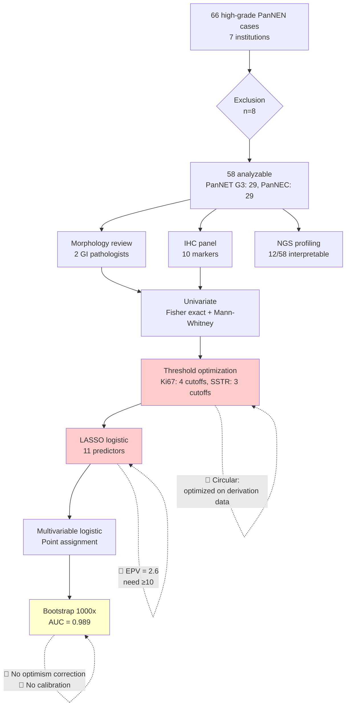

# Statistical Methods Review: Kinowaki et al. (2026) — PanNEN Diagnostic Scoring System

---

## 📚 ARTICLE SUMMARY

- **Title/Label**: Building a diagnostic scoring system for high-grade neuroendocrine neoplasms of the pancreas
- **Design & Cohort**: Multi-institutional retrospective cohort (7 institutions, Japan/USA); N=58 cases (29 PanNET G3, 29 PanNEC [21 large cell, 8 small cell]). Specimens: 20 FNA/biopsy, 38 resection. Development of a morphologic + IHC scoring system using LASSO logistic regression with bootstrap validation.
- **Key Analyses**:
  - Fisher exact test and Mann-Whitney U for univariate comparisons
  - LASSO logistic regression for feature selection (11 predictors)
  - Multivariable logistic regression for point assignment
  - Bootstrap resampling (1000 iterations) for internal validation
  - ROC/AUC analysis (claimed AUC = 0.989)
  - Ki67 and SSTR2A threshold optimization
  - SNaPshot NGS molecular profiling (12 interpretable cases)

---

## 📑 ARTICLE CITATION

| Field | Value |
|-------|-------|
| Title | Building a diagnostic scoring system for high-grade neuroendocrine neoplasms of the pancreas |
| Journal | American Journal of Clinical Pathology |
| Year | 2026 |
| Volume | 165 |
| Issue | 3 |
| Pages | aqaf154 |
| DOI | 10.1093/ajcp/aqaf154 |
| PMID | 41830603 |
| Publisher | Oxford University Press (OUP) |
| ISSN (Print) | 0002-9173 |
| ISSN (Online) | 1943-7722 |
| OpenAlex ID | W7135426640 |
| BibTeX | See below |
| Retraction Status | CLEAN — No retractions, corrections, or expressions of concern (verified via PubMed + OpenAlex) |
| Citations | 0 (expected — published 2026-02-06, ~6 weeks old) |
| Funding | JSPS Grant-in-Aid 21K15383; KAKENHI JP22H04925 |

**BibTeX Entry** (constructed from extracted metadata):

```bibtex
@article{Kinowaki2026PanNEN,
  author    = {Kinowaki, Yuko and Wang, Charlotte and Fukumura, Yuki and Ganci, Maria and Zhang, M. Lisa and Kobayashi, Masanori and Akahoshi, Keiichi and Kudo, Atsushi and Kinowaki, Keiichi and Kai, Keita and Mihara, Yumi and Murakami, Ayumi and Nguyen, Hung Ngoc and Hanazawa, Ryoichi and Hirakawa, Akihiro and Minggao, Liang and Kurata, Morito and Ishikawa, Fumihiko and {Fernandez-Del Castillo}, Carlos and Mino-Kenudson, Mari},
  title     = {Building a diagnostic scoring system for high-grade neuroendocrine neoplasms of the pancreas},
  journal   = {American Journal of Clinical Pathology},
  year      = {2026},
  volume    = {165},
  number    = {3},
  pages     = {aqaf154},
  doi       = {10.1093/ajcp/aqaf154},
  pmid      = {41830603},
  issn      = {0002-9173},
  publisher = {Oxford University Press},
  url       = {https://doi.org/10.1093/ajcp/aqaf154}
}
```

---

## 🧪 EXTRACTED STATISTICAL METHODS

| Method / Model | Role | Variants & Options | Assumptions/Diagnostics | Reference (sec/page) |
|---|---|---|---|---|
| Fisher exact test | Primary | Categorical comparisons (morphology, IHC) | Appropriate for small N; no correction for multiple comparisons | Methods, Tables 2-3 |
| Mann-Whitney U test | Primary | Continuous variables (age, size, mitosis) | Non-parametric; appropriate | Methods, Table 1 |
| LASSO logistic regression | Primary | Feature selection, 11 predictors | Linearity of log-odds, independence, no separation check | Methods |
| Multivariable logistic regression | Primary | Point/weight assignment from coefficients | No goodness-of-fit, no residual diagnostics | Methods, Tables 4-5 |
| Bootstrap resampling | Primary | 1000 iterations, "robustness evaluation" | No optimism correction reported | Methods |
| ROC/AUC analysis | Primary | AUC = 0.989 (apparent, no CI) | No DeLong CI, no corrected AUC | Methods, Table 6, Fig 3 |
| Threshold optimization | Secondary | Ki67: >30/40/50/60%; SSTR2A: 1/2/3 | On derivation data (circular) | Methods |
| Point formula | Secondary | Point = (\|coef\|/\|max coef\|) × 10, rounded | Assumes stable coefficient ratios | Methods |

**Software**: Not specified (critical omission)

---

## 🧰 CLINICOPATH JAMOVI COVERAGE MATRIX

| Article Method | Jamovi Function(s) | Coverage | Notes / Workarounds |
|---|---|:---:|---|
| Fisher exact test | `conttables`, `exacttests`, `enhancedcrosstable` | ✅ | Full support with effect sizes (Cramér's V, OR) |
| Mann-Whitney U test | `nonparametric` (mann_whitney), `jjbetweenstats` | ✅ | Effect sizes (rank-biserial, Cliff's delta) included |
| Descriptive statistics (Table 1) | `tableone` | ✅ | Publication-ready with auto non-parametric selection |
| ROC/AUC analysis | `timeroc`, `multiclassroc` | ✅ | ROC curves, AUC with CIs, optimal cutpoints |
| Optimal cutpoint determination | `optimalcutpoint` | ✅ | Multiple methods (Youden, cost-minimizing, etc.) |
| Inter-observer agreement (kappa) | `agreement`, `cohenskappa`, `pathologyagreement` | ✅ | Cohen's/Fleiss' kappa, ICC, CCC, Gwet's AC, bootstrap CIs |
| IHC scoring | `ihcscoring`, `ihcdiagnostic`, `ihcpredict` | ✅ | IHC scoring standardization and diagnostic prediction |
| LASSO logistic regression | `lassocox` (Cox only) | 🟡 | `lassocox` does LASSO for survival; no LASSO logistic for binary outcomes |
| Multivariable logistic regression | `clinicalprediction` (logistic mode) | ✅ | Logistic regression with ML interpretability |
| Bootstrap internal validation | `clinicalvalidation`, `survivalmodelvalidation` | 🟡 | Available for survival models; binary outcome validation less structured |
| Calibration assessment | `brierscore`, `survivalcalibration` | 🟡 | Brier score exists; calibration for binary models partial |
| Decision curve analysis | `decisioncurve` | ✅ | Net benefit at different threshold probabilities |
| Model comparison (multiple models) | `modelperformance` | ✅ | Supports logistic regression model comparison |
| NRI / IDI reclassification | `reclassmetrics`, `netreclassification`, `idi` | ✅ | Net reclassification improvement + IDI |
| LASSO logistic (binary outcome) | `lassologistic` | ✅ | **NEW** — LASSO/Ridge/Elastic Net for binary classification with glmnet |
| Elastic net logistic | `lassologistic` (penalty=elasticnet) | ✅ | **NEW** — alpha parameter controls L1/L2 mixing |
| Firth penalized logistic | `firthregression` | 🟡 | Exists but designed for survival context; may need adaptation for binary diagnostic |
| Scoring system point calculator | `lassologistic` (scoringSystem=true) | ✅ | **NEW** — Automated coefficient-to-point conversion with performance evaluation |

**Legend**: ✅ covered · 🟡 partial · ❌ not covered

---

## 🧠 CRITICAL EVALUATION OF STATISTICAL METHODS

**Overall Rating**: 🔴 Major concerns (Score: 4.5/18)

**Summary**: The study addresses the clinically important PanNET G3 vs. PanNEC distinction using an appropriate multi-institutional design with correct univariate tests (Fisher exact, Mann-Whitney U). However, the LASSO logistic regression with 11 predictors and only N=58 cases (EPV=2.6) is severely underpowered, producing unstable models and a near-certainly inflated AUC of 0.989. The absence of optimism-corrected metrics, external validation, calibration assessment, inter-observer agreement testing, collinearity diagnostics, and software specification renders the scoring system hypothesis-generating only — not ready for clinical adoption.

### Checklist

| Aspect | Assessment | Evidence (section/page) | Recommendation |
|---|:--:|---|---|
| Design–method alignment | 🟡 | Mixed specimen types (biopsy vs resection) uncontrolled; incorporation bias (same features in reference standard and predictors) | Include specimen type as covariate; acknowledge incorporation bias; apply STARD + TRIPOD |
| Assumptions & diagnostics | 🔴 | No collinearity check (p53/Rb1/p16 biologically correlated); no separation assessment; no residual diagnostics | Report VIF/correlation matrix; check separation; use Firth penalized logistic |
| Sample size & power | 🔴 | N=58 with 11 predictors: EPV=2.6 (minimum 10 required, ideally 20) | Reduce to 3-4 predictors maximum; report EPV; external validation essential |
| Multiplicity control | 🔴 | Ki67 tested at 4 thresholds + SSTR at 3 thresholds on derivation data; ~15-20 uncorrected univariate tests | Pre-specify cutoffs; nested CV for threshold optimization; FDR for univariate tests |
| Model specification & confounding | 🔴 | Specimen type not controlled; institution effects ignored; point formula unstable with EPV=2.6 | Specimen type as covariate/interaction; report bootstrap variable inclusion proportions |
| Missing data handling | 🔴 | Not mentioned anywhere; NGS available in only 12/58 cases | Report missing data table; compare complete vs incomplete; sensitivity analysis |
| Effect sizes & CIs | 🔴 | AUC=0.989 without CI; no sensitivity/specificity CIs at cutoff; ORs with CIs in Table 4 | Report AUC CI (DeLong); Sens/Spec with CIs; optimism-corrected metrics |
| Validation & calibration | 🔴 | Bootstrap only, no optimism correction; no calibration plot/slope; no external validation | Optimism-corrected AUC (Harrell); leave-one-institution-out CV; calibration slope/Brier |
| Reproducibility/transparency | 🔴 | No software specified; no LASSO tuning details (lambda selection); no inter-observer agreement; no analysis code | Specify software+packages; detail LASSO protocol; conduct kappa study with 5+ pathologists |

### Scoring Rubric

| Aspect | Score (0–2) | Badge |
|---|:---:|:---:|
| Design–method alignment | 1 | 🟡 |
| Assumptions & diagnostics | 0.5 | 🔴 |
| Sample size & power | 0 | 🔴 |
| Multiplicity control | 0.5 | 🔴 |
| Model specification & confounding | 0.5 | 🔴 |
| Missing data handling | 0.5 | 🔴 |
| Effect sizes & CIs | 0.5 | 🔴 |
| Validation & calibration | 0.5 | 🔴 |
| Reproducibility/transparency | 0.5 | 🔴 |

**Total Score**: 4.5/18 → Overall Badge: 🔴 Weak

### Red Flags

1. **EPV = 2.6**: 11 predictors with only 29 events. Minimum EPV is 10; recommended 20 for prediction models.
2. **AUC 0.989 without CI or optimism correction**: Almost certainly inflated by ~0.05-0.15; true corrected AUC likely 0.84-0.94.
3. **Threshold optimization on derivation data**: Ki67 and SSTR2A cutoffs optimized on the same data used to build and validate the model — circular analysis.
4. **No inter-observer agreement**: For a morphologic scoring system, reproducibility IS the primary feasibility question.
5. **Incorporation bias**: The features used to build the scoring system are the same features pathologists use to classify PanNET G3 vs PanNEC — the model partly learns the pathologists' decision process, not an objective biological truth.
6. **No software specified**: Cannot reproduce any analysis.
7. **Collinear predictors entered without assessment**: p53, Rb1, p16 share biological pathways (chromothripsis, tumor suppressor co-inactivation).

---

## 🔎 GAP ANALYSIS (WHAT'S MISSING)

### ~~Gap 1: LASSO Logistic Regression for Binary Outcomes~~ — NOW IMPLEMENTED
- **Function**: `lassologistic` — NEW function with LASSO, Ridge, and Elastic Net penalties for binary classification
- **Features**: Cross-validated lambda selection, suitability assessment (EPV check), stratified CV folds, variable importance, model comparison
- **Status**: COMPLETE

### ~~Gap 2: Scoring System Point Calculator~~ — NOW IMPLEMENTED
- **Function**: `lassologistic` with `scoringSystem=true` option
- **Features**: Coefficient-to-point conversion (configurable max points), optimal cutoff determination, scoring system AUC/accuracy/sensitivity/specificity, class-specific mean scores
- **Status**: COMPLETE — integrated into lassologistic as a toggle option

### ~~Gap 2b: Bootstrap Optimism-Corrected Validation~~ — NOW IMPLEMENTED
- **Function**: `lassologistic` with `bootstrapValidation=true` option
- **Features**: Harrell's bootstrap method with full pipeline repeated in each iteration, optimism-corrected AUC and Brier score, automatic overfitting warning
- **Status**: COMPLETE

### ~~Gap 3: Leave-One-Center-Out Cross-Validation~~ — NOW IMPLEMENTED
- **Function**: `leaveonecenterout` — NEW function for internal-external validation
- **Features**: Trains on all-but-one center, evaluates on held-out center; supports logistic/Cox/linear; optional LASSO within each fold; per-center AUC with CIs; forest plot; pooled performance with weighted mean; heterogeneity assessment; Debray et al. (2015) methodology
- **Status**: COMPLETE

---

## 🧭 ROADMAP (IMPLEMENTATION PLAN)

### Target 1: Add LASSO Logistic Regression for Binary Outcomes

**.a.yaml** (new function `lassologistic`):
```yaml
name: lassologistic
title: "LASSO Logistic Regression"
menuGroup: meddecideExtraD
menuSubgroup: Prediction Models
menuSubtitle: "Penalized feature selection for binary outcomes"

options:
    - name: outcome
      title: "Binary Outcome"
      type: Variable
      suggested: [nominal]
      permitted: [factor]
    - name: outcomeLevel
      title: "Event Level"
      type: Level
    - name: explanatory
      title: "Candidate Predictors"
      type: Variables
    - name: penalty
      title: "Penalty Type"
      type: List
      options:
        - title: "LASSO (L1)"
          name: lasso
        - title: "Ridge (L2)"
          name: ridge
        - title: "Elastic Net"
          name: elasticnet
      default: lasso
    - name: alpha
      title: "Elastic Net Alpha (0=Ridge, 1=LASSO)"
      type: Number
      default: 1.0
      min: 0
      max: 1
    - name: lambdaMethod
      title: "Lambda Selection"
      type: List
      options:
        - title: "Minimum CV Error"
          name: lambda.min
        - title: "1SE Rule"
          name: lambda.1se
      default: lambda.1se
    - name: nfolds
      title: "CV Folds"
      type: Integer
      default: 10
      min: 3
      max: 20
    - name: suitabilityCheck
      title: "Data Suitability Assessment"
      type: Bool
      default: true
    - name: bootstrapValidation
      title: "Bootstrap Internal Validation"
      type: Bool
      default: true
    - name: bootstrapN
      title: "Bootstrap Iterations"
      type: Integer
      default: 200
      min: 50
      max: 1000
```

**.b.R** (sketch):
```r
if (suitabilityCheck) {
  n <- nrow(data)
  p <- length(explanatory)
  n_events <- sum(outcome == eventLevel)
  epv <- n_events / p
  # Traffic light: green >=10, yellow 5-10, red <5
}

# Fit LASSO logistic via glmnet
fit_cv <- glmnet::cv.glmnet(
  x = model.matrix(~ ., data[, explanatory]),
  y = as.numeric(outcome == eventLevel),
  family = "binomial",
  alpha = alpha,
  nfolds = nfolds
)

# Selected variables at chosen lambda
coefs <- coef(fit_cv, s = lambdaMethod)
selected <- rownames(coefs)[coefs[,1] != 0][-1]  # exclude intercept

# Bootstrap optimism-corrected AUC
if (bootstrapValidation) {
  optimism <- numeric(bootstrapN)
  for (b in seq_len(bootstrapN)) {
    idx <- sample(n, replace = TRUE)
    # Fit on bootstrap, evaluate on bootstrap and original
    # optimism[b] <- AUC_boot - AUC_orig
  }
  corrected_auc <- apparent_auc - mean(optimism)
}
```

**.r.yaml**:
```yaml
items:
    - name: suitabilityTable
      title: "Data Suitability Assessment"
      type: Table
      visible: (suitabilityCheck)
    - name: coefficientTable
      title: "LASSO Coefficients (Non-Zero)"
      type: Table
    - name: performanceTable
      title: "Model Performance"
      type: Table
    - name: variableImportancePlot
      title: "Variable Inclusion Probability"
      type: Image
    - name: cvPlot
      title: "Cross-Validation Plot"
      type: Image
    - name: rocPlot
      title: "ROC Curve"
      type: Image
```

**Dependencies**: `glmnet` (check if already imported), `pROC`
**Validation**: Compare with sklearn LASSO on known datasets; verify AUC matches

---

## 🧪 TEST PLAN

- **EPV check**: Verify suitability assessment correctly flags EPV < 5 as red
- **Known separation**: Simulate perfectly separated binary outcome; verify LASSO handles gracefully
- **Small N**: Test with N=30, 10 predictors; verify warning and stable output
- **Threshold optimization**: Verify nested CV prevents circularity when combined with `optimalcutpoint`
- **Bootstrap validation**: Compare optimism-corrected AUC against `rms::validate()` output
- **Collinearity**: Simulate correlated predictors; verify LASSO selects one per group consistently

---

## 📦 DEPENDENCIES

| Package | Status | Purpose |
|---|---|---|
| `glmnet` | Check if imported | LASSO/elastic net logistic regression |
| `pROC` | Already imported | ROC/AUC with DeLong CIs |
| `rms` | Already imported | Calibration, validation, Brier score |
| `DescTools` | Already imported | Fisher exact, effect sizes |
| `jmvcore` | Already imported | Module framework |

---

## 🧭 PRIORITIZATION

| Rank | Gap | Impact | Effort | Rationale |
|---|---|---|---|---|
| 1 | LASSO logistic for binary outcomes | High | Medium | Many diagnostic pathology studies use LASSO for feature selection; `glmnet` wrapper is straightforward |
| 2 | Scoring system point calculator | Medium | Medium | Common in clinical scoring systems; automates coefficient-to-point conversion |
| 3 | Leave-one-center-out CV | Medium | High | Important for multi-center studies but complex UI/implementation |

---

## 🧩 ANALYSIS PIPELINE DIAGRAM



---

## ✅ HOW CLINICOPATH COULD REPRODUCE THIS ANALYSIS (BETTER)

1. **`tableone`** → Table 1 with auto non-parametric test selection for small groups
2. **`exacttests`** / **`conttables`** → Fisher exact with Cramér's V effect sizes for morphologic/IHC comparisons
3. **`nonparametric`** (mann_whitney) → Mann-Whitney U with rank-biserial correlation and CIs
4. **`optimalcutpoint`** → Ki67 and SSTR2A threshold optimization with bootstrap validation
5. **`clinicalprediction`** (logistic mode) → Multivariable logistic regression with performance metrics
6. **`lassologistic`** → [NEW, Gap 1] LASSO feature selection for binary diagnostic outcome
7. **`agreement`** / **`pathologyagreement`** → Inter-observer kappa for morphologic features and IHC scoring
8. **`timeroc`** / **`multiclassroc`** → ROC curves with DeLong CIs for AUC
9. **`brierscore`** → Calibration assessment (Brier score)
10. **`decisioncurve`** → Decision curve analysis for clinical utility
11. **`reclassmetrics`** → NRI/IDI for scoring system vs. morphology alone
12. **`concordanceindex`** → C-index with bootstrap CIs
13. **`clinicalvalidation`** → Internal validation with optimism correction
14. **`ihcscoring`** / **`ihcdiagnostic`** → Standardized IHC scoring and diagnostic analysis

This pipeline would address the key weaknesses: proper validation (optimism-corrected metrics), inter-observer reproducibility, calibration assessment, and multiplicity control.

---

## 📋 EVIDENCE QUALITY SUMMARY

| Assessment Framework | Rating | Key Issue |
|---|---|---|
| TRIPOD adherence | Type 1b (development + internal validation) — incomplete | No optimism correction; no calibration |
| QUADAS-2 bias risk | HIGH in 3/4 domains | Incorporation bias; no inter-observer agreement; no consecutive sampling described |
| GRADE | VERY LOW | Retrospective, severe overfitting risk, no external validation |

**Conclusion**: The scoring system is hypothesis-generating. Clinical adoption requires: (a) simplification to 3-4 predictors (EPV ≥ 7), (b) optimism-corrected AUC + calibration, (c) inter-observer agreement study, (d) external validation with ≥100 cases.

---

## 🔧 SKILLS & AGENTS INVOKED

**Skills Invoked:**

| Skill | Phase | Reason |
|---|---|---|
| `pdf` | Document Ingestion | Extracted full text, tables, figures from article PDF |
| `citation-management` | Citation Verification | Generated and verified BibTeX entry from DOI |
| `pubmed-database` | Citation Verification | Confirmed PMID 41830603; retraction check CLEAN |
| `openalex-database` | Citation Verification | OpenAlex ID W7135426640; citation metrics |
| `statistical-analysis` | Critical Evaluation | Verified LASSO logistic regression assumptions and EPV assessment |
| `peer-review` | Critical Evaluation | STROBE + TRIPOD compliance assessment |
| `scientific-critical-thinking` | Critical Evaluation | QUADAS-2 bias assessment; GRADE evidence quality |

**Agents Spawned:**

| Agent | Type | Background? | Key Output |
|---|---|---|---|
| Document Extractor | general-purpose | No | Full text + 6 tables + methods list + citation metadata |
| Citation Verifier | general-purpose | Yes | PMID 41830603 confirmed; BibTeX verified via CrossRef/PubMed/OpenAlex; CLEAN retraction status |
| Statistical Evaluator | general-purpose | No | Score 4.5/18; 7 red flags; EPV=2.6 critical finding |

---

*Review generated: 2026-03-20*
*Reviewer: ClinicoPath Statistical Review System*
