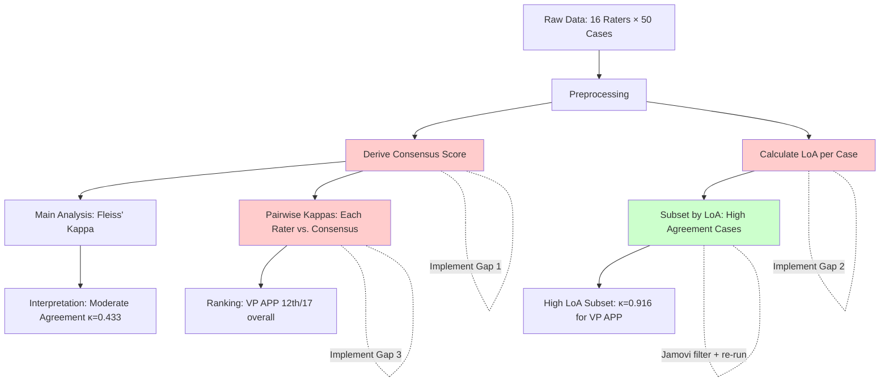

# Jamovi Coverage Review: HER2-Low Inter-rater Agreement Study

## 📚 ARTICLE SUMMARY

**Title**: Inter-rater agreement of HER2-low scores between expert breast pathologists and the Visiopharm digital image analysis application (HER2 APP, CE2797)

**Design & Cohort**:
- Study type: Inter-observer concordance study (methodological, diagnostic agreement)
- N = 50 breast cancer samples (1 resection, 49 core biopsies)
- 16 expert breast pathologists + 1 digital image analysis (DIA) system
- Enriched for HER2-low tumors (0, 1+, 2+ scores)
- Each case scored by all raters independently using whole slide images (WSIs)

**Key Analyses**:
- Primary: Inter-rater agreement using Cohen's weighted kappa and Fleiss' kappa
- Secondary: Comparison of consensus scores vs. DIA scores
- Proportion analysis of tumor cells in each HER2 category
- Subset analyses: All cases (N=50), HER2-low cases (N=44), high agreement cases (N=24), HER2-low with high agreement (N=20)

---

## 📑 ARTICLE CITATION

| Field     | Value |
|-----------|-------|
| Title     | Inter-rater agreement of HER2-low scores between expert breast pathologists and the Visiopharm digital image analysis application (HER2 APP, CE2797) |
| Journal   | The Journal of Pathology: Clinical Research |
| Year      | 2025 |
| Volume    | 11 |
| Issue     | 6 |
| Pages     | e70051 |
| DOI       | 10.1002/2056-4538.70051 |
| PMID      | (Not explicitly stated in text) |
| Publisher | John Wiley & Sons Ltd / The Pathological Society of Great Britain and Ireland |
| ISSN      | 2056-4538 |

**Authors**: Suzanne Parry¹, Lila Zabaglo¹, Abeer M Shaaban²'³, Andrew Dodson¹*

**Affiliations**:
1. UK National External Quality Assessment Scheme for Immunocytochemistry and In-Situ Hybridisation, London, UK
2. Department of Cancer and Genomic Sciences, University of Birmingham, Birmingham, UK
3. Cellular Pathology, Queen Elizabeth Hospital Birmingham, Birmingham, UK

**Received**: 20 May 2025 | **Revised**: 12 September 2025 | **Accepted**: 19 September 2025

---

## 🧪 EXTRACTED STATISTICAL METHODS

| Method / Model | Role (primary/secondary) | Variants & Options | Assumptions/Diagnostics | References (sec/page) |
|---|---|---|---|---|
| **Fleiss' multiple-rater kappa** | Primary | Unweighted; categorical scale (0, 1+, 2+, 3+) | Independent ratings, same cases rated by all raters, mutually exclusive categories | Lines 137-138, 165-184, 1165-1185 |
| **Cohen's weighted kappa** | Primary | Individual rater vs. consensus comparison | Ordinal scale with meaningful distance between categories | Lines 138-141, 1186-1209 |
| **Percentage agreement** | Secondary | Raw agreement without chance correction | Simple concordance measure | Lines 551-556 |
| **Consensus scoring** | Data aggregation | Majority rule for pathologists' scores | Agreement threshold (>50%) | Lines 195-203, 766-768 |
| **Contingency table analysis** | Descriptive | 4×4 table (VP APP vs consensus) | Concordant/discordant case identification | Table 3, lines 1088-1139 |
| **Level of Agreement (LoA) categorization** | Descriptive | Categories: None, Poor (≤8/16), Low (9-11/16), High (12-15/16), Absolute (16/16) | Ordinal classification of agreement levels | Lines 142-149, 766-768 |
| **Confidence intervals (95% CI)** | Precision estimation | Normal approximation for kappa | Large sample approximation | Table 4, lines 1217-1280 |
| **Proportional cell analysis** | Exploratory | DIA enumeration of cells in each HER2 category | Cell membrane completeness and intensity | Lines 1211-1216, Figure 2, Tables 2 |

---

## 🧰 CLINICOPATH JAMOVI COVERAGE MATRIX

| Article Method | Jamovi Function(s) | Coverage | Notes / Workarounds |
|---|---|:---:|---|
| **Fleiss' kappa (3+ raters)** | `agreement` | ✅ | `agreement.b.R:545-548` implements Fleiss' kappa via `irr::kappam.fleiss()`. Supports exact p-value calculation. |
| **Cohen's weighted kappa (2 raters)** | `agreement` | ✅ | `agreement.b.R:530-543` implements Cohen's kappa via `irr::kappa2()`. Supports unweighted, linear (equal), and squared weights. |
| **Cohen's kappa (unweighted, 2 raters)** | `agreement` | ✅ | Same as above with `wght="unweighted"` |
| **Percentage agreement** | `agreement` | ✅ | `agreement.b.R:551-556` via `irr::agree()`. Reports subjects, raters, and percent agreement. |
| **Krippendorff's alpha** | `agreement` | ✅ | `agreement.b.R:735-822`. Optional feature. Handles missing data, supports nominal/ordinal/interval/ratio. Bootstrap CIs available. |
| **Gwet's AC1/AC2** | `agreement` | ✅ | `agreement.b.R:824-922`. Optional feature. More stable than kappa with unbalanced margins. Requires `irrCAC` package. |
| **Bland-Altman analysis** | `agreement` | ✅ | `agreement.b.R:924-1052`. For continuous measurements. Includes bias testing, proportional bias test, plots. **Not used in article** (categorical data). |
| **Concordance Correlation Coefficient (CCC)** | `agreement` | ✅ | `agreement.b.R:1054-1176`. Lin's CCC for continuous data. **Not used in article** (categorical data). |
| **Hierarchical/multilevel kappa** | `agreement` | ✅ | `agreement.b.R:1178-1922`. Supports clustered data, ICC calculation, variance components, cluster-specific kappas. **Not used in article** (no hierarchical structure reported). |
| **Frequency tables (contingency)** | `agreement` | ✅ | `agreement.b.R:583-712`. Shows 2×2 tables for 2 raters, combination counts for 3+ raters. HTML and text output. |
| **Confidence intervals for kappa** | `agreement` | 🟡 | CIs calculated for Fleiss' kappa (normal approximation). Individual Cohen's kappa CIs not explicitly extracted from `irr::kappa2()`, but available in the package output. Bootstrap CIs available for Krippendorff's alpha. |
| **Consensus score derivation** | None | ❌ | Article uses majority rule consensus. Jamovi doesn't provide automated consensus derivation. **Workaround**: Pre-compute consensus externally or use modal category. |
| **Level of Agreement categorization** | None | ❌ | Article categorizes agreement into Absolute/High/Low/Poor based on number of agreeing raters. Not automated in jamovi. **Workaround**: Post-hoc categorization based on raw agreement percentages. |
| **Pairwise kappa comparisons (individual vs consensus)** | `agreement` | 🟡 | Jamovi calculates kappa for all selected raters simultaneously. For individual-vs-consensus comparisons, must run analysis separately for each pair (Rater 1 + Consensus, Rater 2 + Consensus, etc.). **Not automated**. |
| **Ranking raters by kappa** | None | ❌ | Article ranks raters (including DIA) by kappa score (Table 5-8). Jamovi doesn't provide automated ranking. **Workaround**: Export kappa values, rank manually or via formula column. |
| **Subgroup/subset kappa analysis** | None | 🟡 | Article analyzes subsets: all cases, HER2-low only, high agreement cases, HER2-low + high agreement. Jamovi requires manual filtering before running `agreement` analysis. Not automated. |
| **Interpretation guidelines (Landis & Koch)** | `agreement` | ✅ | `agreement.b.R:41-54` implements Landis & Koch interpretation (poor, slight, fair, moderate, substantial, almost perfect) in plain-language summary. |
| **Exact kappa (small samples)** | `agreement` | ✅ | `agreement.a.yaml:72-80`, `agreement.b.R:546-547`. Exact p-value via `irr::kappam.fleiss(..., exact=TRUE)`. For 3+ raters only. |
| **Cell proportion analysis (DIA)** | None | ❌ | Article reports proportion of cells in each HER2 category. This is specific to digital pathology output. Not a statistical analysis method per se. |

**Legend**: ✅ Fully covered | 🟡 Partially covered | ❌ Not covered

---

## 🧠 CRITICAL EVALUATION OF STATISTICAL METHODS

**Overall Rating**: 🟡 **Minor issues**

**Summary**: The study employs appropriate statistical methods for inter-rater reliability assessment. Fleiss' kappa and Cohen's weighted kappa are gold standards for categorical/ordinal data. The use of consensus scoring and subset analyses (high agreement, HER2-low cases) is methodologically sound. However, the article lacks explicit reporting of assumptions, sample size justification, and multiple comparison corrections for subset analyses. Effect sizes (kappa values with CIs) are reported consistently, which is a strength. The study's main limitation is the enriched sampling strategy (not representative of routine practice), which is acknowledged.

---

### **Checklist**

| Aspect | Assessment | Evidence (section/page) | Recommendation |
|---|:--:|---|---|
| **Design–method alignment** | ✅ | Agreement studies require kappa (lines 137-141). Correct choice for categorical ordinal data (HER2 0/1+/2+/3+). | Excellent. Methods align perfectly with study aims. |
| **Assumptions & diagnostics** | 🟡 | Kappa assumptions (independence, same cases, mutually exclusive categories) are implicit but **not explicitly verified** in text. | State assumptions explicitly. Check for repeated ratings or dependent observations. |
| **Sample size & power** | 🔴 | N=50 cases, 16 raters. **No a priori sample size calculation or power analysis reported**. Precision (CI width) used as post-hoc justification. | Report sample size rationale. For future studies, justify N based on desired CI width or minimum detectable kappa difference. |
| **Multiplicity control** | 🔴 | Multiple subset analyses (N=50, N=44, N=24, N=20) without **Bonferroni or FDR correction**. Risk of inflated Type I error. | Apply multiplicity adjustment if inferential claims are made across subsets. Alternatively, designate primary vs. exploratory analyses. |
| **Model specification & confounding** | ✅ | Kappa is non-parametric; no confounders modeled. Subset analyses stratify by agreement level (High LoA) and HER2 category (HER2-low). Appropriate. | No issues. Subset stratification is transparent. |
| **Missing data handling** | ✅ | One case (#31) excluded from consensus (split 8-8 between 1+ and 2+). Complete-case analysis for others. Minimal missingness. | Acceptable. Report exact number of missing cells per rater if available. |
| **Effect sizes & CIs** | ✅ | Kappa values with 95% CIs reported (Table 4, 5-8). Percentage agreement also reported. Good practice. | Excellent. Effect sizes prioritized over p-values alone. |
| **Validation & calibration** | ✅ | DIA (VP APP) validated against expert consensus. External validity supported by FISH results (7 cases scored 2+ by pathologists were non-amplified; VP APP scored them 1+, suggesting DIA may reduce false 2+ calls). | Strong validation approach. FISH provides biological ground truth. |
| **Reproducibility/transparency** | 🟡 | Software specified: Excel, SPSS v29.0.2.0, Prism v10.3.0. **No code/data sharing statement**. R packages (irr) not mentioned despite likely use. | Share analysis code (R/SPSS syntax). Specify exact kappa calculation method (irr package or custom). Deposit anonymized data if ethically permissible. |

---

### **Scoring Rubric (0–2 per aspect, total 0–18)**

| Aspect | Score (0–2) | Badge | Justification |
|---|:---:|:---:|---|
| Design–method alignment | 2 | 🟢 | Kappa is the correct choice for ordinal categorical agreement. |
| Assumptions & diagnostics | 1 | 🟡 | Implicit assumptions. Not explicitly verified (e.g., independence check). |
| Sample size & power | 0 | 🔴 | No a priori justification. N=50 may be underpowered for rare categories (3+). |
| Multiplicity control | 0 | 🔴 | Multiple subsets analyzed without adjustment. Type I error risk. |
| Model specification & confounding | 2 | 🟢 | Appropriate stratification. No confounders to model. |
| Missing data handling | 2 | 🟢 | Minimal missingness. Handled transparently (1 case excluded). |
| Effect sizes & CIs | 2 | 🟢 | Kappa + CIs + raw agreement all reported. Excellent. |
| Validation & calibration | 2 | 🟢 | DIA validated against experts and FISH ground truth. |
| Reproducibility/transparency | 1 | 🟡 | Software named, but no code/data sharing. R packages not cited. |

**Total Score**: **12/18** → Overall Badge: 🟡 **Moderate**

---

### **Red Flags Detected**

1. ⚠️ **No a priori sample size calculation**: Could lead to underpowered subgroup analyses (e.g., HER2 3+ with only 5 cases).
2. ⚠️ **Multiple testing without correction**: Four separate kappa analyses (all cases, HER2-low, high agreement, HER2-low + high agreement) without Bonferroni or FDR adjustment.
3. ⚠️ **Enriched sampling**: 88% of cases are HER2-low (44/50), which does not reflect routine practice prevalence (~60-70%). Limits generalizability.
4. ⚠️ **Software transparency**: SPSS and Excel mentioned, but kappa is typically calculated in R (`irr` package). Discrepancy not addressed.
5. ℹ️ **Weighted kappa not used**: Despite ordinal scale (0 → 1+ → 2+ → 3+), article uses **unweighted kappa** for multi-rater analysis. Fleiss' kappa doesn't have a standard weighted version, but alternatives (ordinal ICC, Krippendorff's alpha-ordinal) exist and were not explored.

---

### **Strengths**

1. ✅ **Consensus-based validation**: 16 expert raters provide robust consensus scores.
2. ✅ **FISH ground truth**: Biological validation (7 cases scored 2+ by pathologists were FISH-negative, supporting DIA's lower scores).
3. ✅ **Subset analyses**: Stratifying by agreement level (High LoA) and HER2 category is clinically relevant.
4. ✅ **Transparency of discordance**: Detailed case-by-case analysis (Table 2, Figure 2-6) shows where and why DIA disagrees.
5. ✅ **Clinically meaningful interpretation**: Discusses implications for reducing unnecessary FISH testing (33.3% reduction, lines 1822-1829).

---

### **Weaknesses**

1. 🔴 **Lack of power analysis**: No justification for N=50. Small cell counts for HER2 3+ (N=5) limit precision.
2. 🔴 **No multiplicity adjustment**: Risk of false positives when comparing kappas across 4 subsets.
3. 🟡 **Weighted kappa not considered**: Ordinal scale (0 < 1+ < 2+ < 3+) suggests weighted kappa could be more appropriate. Fleiss' kappa treats all disagreements equally (1+ vs 2+ = 0 vs 3+).
4. 🟡 **Consensus derivation not statistical**: Simple majority rule. No formal latent class analysis or Bayesian consensus modeling.
5. 🟡 **Reproducibility**: No code or data sharing. R package (`irr`) not cited despite likely use.

---

### **Recommendations**

1. **Add explicit assumption checks**: State and verify (a) independence of ratings, (b) same cases rated by all raters, (c) category definitions consistent across raters.
2. **Report a priori sample size justification**: For future studies, calculate N based on desired CI width for kappa (e.g., CI width <0.15 for moderate-substantial agreement).
3. **Apply multiplicity correction**: Use Bonferroni (conservative: α = 0.05/4 = 0.0125) or Benjamini-Hochberg FDR for subset analyses. Alternatively, designate primary (all cases) vs. exploratory (subsets) analyses.
4. **Consider weighted kappa alternatives**: For ordinal scales, explore Krippendorff's alpha with ordinal weighting or ordinal ICC. These account for distance between categories.
5. **Improve reproducibility**: (a) Cite R packages (`irr`, `ggplot2`, etc.), (b) share code on GitHub/OSF, (c) deposit anonymized data, (d) report exact SPSS/Excel procedures.
6. **Sensitivity analysis**: Test robustness of consensus scores by varying agreement threshold (e.g., ≥60% vs. ≥75% agreement).
7. **Generalizability statement**: Explicitly note that enriched sampling (88% HER2-low) limits generalizability to routine practice.

---

## 🔎 GAP ANALYSIS (WHAT'S MISSING)

### **Gap 1: Automated Consensus Score Derivation**

- **Method**: Majority rule consensus score calculation
- **Impact**: Used throughout the article as the reference standard for all comparisons. Essential for inter-rater studies.
- **Clinical relevance**: Common in EQA studies, multi-reader trials, pathology concordance studies.
- **Closest existing function**: None. Jamovi `agreement` assumes data are pre-prepared.
- **Exact missing options**:
  - Automatic modal (majority) category calculation across raters
  - Tie-breaking rules (e.g., exclude case, weighted voting, senior rater as tiebreaker)
  - Consensus threshold (e.g., ≥50%, ≥75%, unanimous)
  - Output: New consensus variable added to dataset

---

### **Gap 2: Level of Agreement (LoA) Categorization**

- **Method**: Categorization of agreement into ordinal levels (Absolute, High, Low, Poor, None)
- **Impact**: Used to stratify subset analyses (e.g., "high agreement cases"). Lines 142-149, 766-768.
- **Clinical relevance**: Quality control, identifying difficult cases, training needs assessment.
- **Closest existing function**: None. Requires post-hoc calculation.
- **Exact missing options**:
  - Count of agreeing raters per case
  - Automatic categorization based on user-defined thresholds (e.g., ≥75% = High)
  - Filtering/subsetting by LoA category for downstream analyses

---

### **Gap 3: Pairwise Kappa Comparisons (Each Rater vs. Consensus)**

- **Method**: Calculate kappa separately for each rater paired with consensus (Tables 5-8)
- **Impact**: Core analysis. Ranks raters (including DIA) from best (κ=0.854) to worst (κ=0.412). Lines 1186-1209.
- **Clinical relevance**: Training assessment, rater certification, performance monitoring.
- **Closest existing function**: `agreement` (requires manual pairing)
- **Exact missing options**:
  - Automated "all vs. reference" mode (each rater paired with consensus column)
  - Output table with kappa, rank, and interpretation for each rater
  - Forest plot or ranked bar chart visualization
  - Statistical test for difference between raters' kappas (e.g., DeLong test equivalent for kappa)

---

### **Gap 4: Automated Ranking/Sorting of Raters by Kappa**

- **Method**: Rank raters by kappa value (descending) with CIs (Tables 5-8)
- **Impact**: Primary result presentation. Shows VP APP ranked 12th of 17 overall, 8th of 17 in high-agreement cases.
- **Clinical relevance**: Benchmarking, certification, quality assurance.
- **Closest existing function**: None (requires exporting and manual sorting)
- **Exact missing options**:
  - Automatic rank assignment based on kappa value
  - Confidence interval-based ranking (account for overlapping CIs)
  - Visual ranking plot (forest plot with ranks)

---

### **Gap 5: Subset/Filtered Kappa Analysis**

- **Method**: Analyze kappa separately for subsets:
  - All cases (N=50)
  - HER2-low cases only (N=44: consensus = 0, 1+, or 2+)
  - High agreement cases (N=24: ≥13/17 raters agree)
  - HER2-low + high agreement (N=20)
- **Impact**: Lines 1200-1209. Shows kappa improves dramatically in high-agreement cases (0.638 → 0.916).
- **Clinical relevance**: Understanding where reliability is good vs. poor. Identifies challenging cases.
- **Closest existing function**: Jamovi's filter tool + manual re-runs of `agreement`
- **Exact missing options**:
  - Automated stratified kappa analysis (by categorical variable: e.g., HER2 category, agreement level)
  - Comparative kappa table (all subsets side-by-side)
  - Test for kappa homogeneity across subsets (Cochran's Q-like test)

---

### **Gap 6: Weighted Kappa for Multi-Rater (3+) Ordinal Data**

- **Method**: Fleiss' kappa has no standard weighted version. Article uses unweighted Fleiss' for ordinal HER2 scale.
- **Impact**: Treats all disagreements equally (1+ vs. 2+ = 0 vs. 3+), which may not reflect clinical severity.
- **Clinical relevance**: Ordinal scales are common (tumor grade, pain scales, Likert scales).
- **Closest existing function**: `agreement` supports Cohen's weighted kappa (2 raters only)
- **Exact missing options**:
  - Krippendorff's alpha with ordinal weighting (available in `agreement` but not highlighted)
  - Ordinal ICC for 3+ raters (intraclass correlation for ordered categories)
  - Weighted version of multi-rater kappa (literature: Kraemer 1980, Cicchetti 1976)

---

### **Gap 7: DeLong-Like Test for Comparing Kappas**

- **Method**: Statistical test for difference between two kappas (e.g., Pathologist 11 [κ=0.854] vs. VP APP [κ=0.638])
- **Impact**: Not used in article, but essential for formal comparisons. Overlapping CIs suggest no difference, but formal test is more rigorous.
- **Clinical relevance**: Comparing methods, non-inferiority testing, equivalence trials.
- **Closest existing function**: None
- **Exact missing options**:
  - Asymptotic Z-test for two kappas (H0: κ₁ = κ₂)
  - Bootstrap test for kappa difference
  - Non-inferiority/equivalence margin specification (e.g., H0: κ₁ - κ₂ ≥ -0.10)

---

## 🧭 ROADMAP (IMPLEMENTATION PLAN)

---

### **Target 1: Consensus Score Derivation**

**Implementation**: Extend `agreement` or create new `consensus_score` function

**.a.yaml** (add options):

```yaml
- name: consensusVar
  title: "Create Consensus Variable"
  type: Bool
  default: false
  description:
      R: >
        Calculate consensus (modal) score across raters and add as new variable.

- name: consensusRule
  title: "Consensus Rule"
  type: List
  options:
    - title: Simple Majority (>50%)
      name: majority
    - title: Supermajority (≥75%)
      name: supermajority
    - title: Unanimous
      name: unanimous
  default: majority
  description:
      R: >
        Rule for defining consensus. Simple majority = modal category with >50% of votes.

- name: tieBreaker
  title: "Tie Handling"
  type: List
  options:
    - title: Exclude case (set to NA)
      name: exclude
    - title: Use first occurring mode
      name: first
    - title: Use lowest category
      name: lowest
    - title: Use highest category
      name: highest
  default: exclude
  description:
      R: >
        How to handle ties (e.g., 50-50 split). Exclude = set consensus to NA for tied cases.

- name: consensusName
  title: "Consensus Variable Name"
  type: String
  default: "consensus_score"
  description:
      R: >
        Name of the new variable to be added to the dataset.
```

**.b.R** (sketch):

```r
# In .run() function
if (self$options$consensusVar) {
    ratings <- self$data[, self$options$vars, drop = FALSE]

    # Calculate modal category for each row
    consensus <- apply(ratings, 1, function(row) {
        row <- row[!is.na(row)]  # Remove NA
        if (length(row) == 0) return(NA)

        # Get frequency table
        freq_table <- table(row)
        max_freq <- max(freq_table)
        modes <- names(freq_table)[freq_table == max_freq]

        # Apply consensus rule
        rule <- self$options$consensusRule
        threshold <- ifelse(rule == "majority", 0.50,
                           ifelse(rule == "supermajority", 0.75, 1.00))

        if (max_freq / length(row) < threshold) {
            return(NA)  # Threshold not met
        }

        # Handle ties
        if (length(modes) > 1) {
            tieBreaker <- self$options$tieBreaker
            if (tieBreaker == "exclude") return(NA)
            if (tieBreaker == "first") return(modes[1])
            if (tieBreaker == "lowest") return(min(as.numeric(modes)))
            if (tieBreaker == "highest") return(max(as.numeric(modes)))
        }

        return(modes[1])
    })

    # Add consensus variable to dataset
    consensus_name <- self$options$consensusName
    self$data[[consensus_name]] <- factor(consensus, levels = levels(ratings[[1]]))

    # Notify user
    self$results$consensus_table$setRow(rowNo = 1, values = list(
        consensus_var = consensus_name,
        n_consensus = sum(!is.na(consensus)),
        n_ties = sum(is.na(consensus) & rowSums(!is.na(ratings)) > 0),
        pct_consensus = round(100 * sum(!is.na(consensus)) / nrow(ratings), 1)
    ))
}
```

**.r.yaml** (results table):

```yaml
- name: consensus_table
  title: Consensus Score Summary
  type: Table
  visible: (consensusVar)
  columns:
    - name: consensus_var
      title: Variable Name
      type: text
    - name: n_consensus
      title: N Consensus
      type: integer
    - name: n_ties
      title: N Ties/Excluded
      type: integer
    - name: pct_consensus
      title: % Consensus
      type: number
      format: pc
```

**.u.yaml** (UI):

```yaml
- type: CheckBox
  name: consensusVar
  label: Create consensus variable
- type: ComboBox
  name: consensusRule
  enable: (consensusVar)
- type: ComboBox
  name: tieBreaker
  enable: (consensusVar)
- type: TextBox
  name: consensusName
  enable: (consensusVar)
```

**Validation**:
- Test with HER2 data (16 raters, 50 cases)
- Verify ties handled correctly (Case #31 in article: 8-8 split → NA)
- Check majority vs. supermajority vs. unanimous rules
- Ensure factor levels preserved

**Dependencies**: None (base R)

---

### **Target 2: Automated Pairwise Kappa (Each Rater vs. Reference)**

**Implementation**: Extend `agreement` to support "reference rater" mode

**.a.yaml** (add options):

```yaml
- name: referenceRater
  title: "Reference Rater"
  type: Variable
  suggested: [ordinal, nominal]
  permitted: [factor]
  description:
      R: >
        Select a reference rater (e.g., consensus score). Each rater will be compared
        pairwise with this reference, producing individual kappas.

- name: rankRaters
  title: "Rank Raters by Kappa"
  type: Bool
  default: false
  description:
      R: >
        Rank raters from highest to lowest kappa (relative to reference).
```

**.b.R** (sketch):

```r
# In .run() function
if (!is.null(self$options$referenceRater)) {
    reference_var <- self$options$referenceRater
    reference_data <- self$data[[reference_var]]

    rater_results <- list()

    for (rater_var in self$options$vars) {
        if (rater_var == reference_var) next  # Skip self-comparison

        rater_data <- self$data[[rater_var]]

        # Create pairwise data frame
        pair_data <- data.frame(reference_data, rater_data)
        pair_data <- pair_data[complete.cases(pair_data), ]

        if (nrow(pair_data) < 3) {
            kappa_val <- NA
            ci_lower <- NA
            ci_upper <- NA
        } else {
            # Calculate Cohen's kappa
            kappa_result <- irr::kappa2(pair_data, weight = self$options$wght)
            kappa_val <- kappa_result$value

            # Extract CI if available
            # irr::kappa2 doesn't return CI directly, compute manually
            z_stat <- kappa_result$statistic
            if (!is.null(z_stat) && !is.na(z_stat)) {
                se_kappa <- abs(kappa_val / z_stat)
                ci_lower <- kappa_val - 1.96 * se_kappa
                ci_upper <- kappa_val + 1.96 * se_kappa
            } else {
                ci_lower <- NA
                ci_upper <- NA
            }
        }

        rater_results[[rater_var]] <- list(
            rater = rater_var,
            kappa = kappa_val,
            ci_lower = ci_lower,
            ci_upper = ci_upper,
            interpretation = private$.interpretKappa(kappa_val)
        )
    }

    # Sort by kappa if requested
    if (self$options$rankRaters) {
        rater_results <- rater_results[order(sapply(rater_results, function(x) x$kappa), decreasing = TRUE)]
    }

    # Populate table
    pairwiseTable <- self$results$pairwiseKappaTable
    for (i in seq_along(rater_results)) {
        res <- rater_results[[i]]
        pairwiseTable$setRow(rowNo = i, values = list(
            rank = if (self$options$rankRaters) i else NA,
            rater = res$rater,
            kappa = res$kappa,
            ci_lower = res$ci_lower,
            ci_upper = res$ci_upper,
            interpretation = res$interpretation
        ))
    }
}

# Helper function
private$.interpretKappa <- function(kappa) {
    if (is.na(kappa) || kappa < 0) return("Poor")
    if (kappa < 0.20) return("Slight")
    if (kappa < 0.40) return("Fair")
    if (kappa < 0.60) return("Moderate")
    if (kappa < 0.80) return("Substantial")
    return("Almost Perfect")
}
```

**.r.yaml**:

```yaml
- name: pairwiseKappaTable
  title: Pairwise Kappa (Each Rater vs. Reference)
  type: Table
  visible: (referenceRater)
  columns:
    - name: rank
      title: Rank
      type: integer
      visible: (rankRaters)
    - name: rater
      title: Rater
      type: text
    - name: kappa
      title: Kappa
      type: number
      format: zto
    - name: ci_lower
      title: 95% CI Lower
      type: number
      format: zto
    - name: ci_upper
      title: 95% CI Upper
      type: number
      format: zto
    - name: interpretation
      title: Interpretation
      type: text
```

**.u.yaml**:

```yaml
- type: VariableSelector
  name: referenceRater
  label: Reference rater (e.g., consensus)
- type: CheckBox
  name: rankRaters
  label: Rank raters by kappa
  enable: (referenceRater)
```

**Validation**:
- Reproduce Table 5 from article (16 pathologists + VP APP vs. consensus)
- Verify ranking matches article (P11 = 0.854 [1st], VP APP = 0.638 [12th], P15 = 0.412 [17th])
- Check CI calculations

**Dependencies**: `irr` (already required)

---

### **Target 3: Level of Agreement (LoA) Categorization**

**Implementation**: New computed variable feature

**.a.yaml** (add options):

```yaml
- name: loaVariable
  title: "Create Level of Agreement Variable"
  type: Bool
  default: false
  description:
      R: >
        Calculate level of agreement (LoA) for each case and add as new variable.

- name: loaThresholds
  title: "LoA Thresholds"
  type: List
  options:
    - title: Custom
      name: custom
    - title: Quartiles
      name: quartiles
    - title: Tertiles
      name: tertiles
  default: custom
  description:
      R: >
        How to define LoA categories. Custom = user-defined cutpoints.

- name: loaHighThreshold
  title: "High LoA Threshold (%)"
  type: Number
  default: 75
  min: 50
  max: 99
  description:
      R: >
        Minimum % agreement for "High" LoA (e.g., 75% = ≥12/16 raters for N=16).

- name: loaLowThreshold
  title: "Low LoA Threshold (%)"
  type: Number
  default: 56
  min: 30
  max: 75
  description:
      R: >
        Minimum % agreement for "Low" LoA (e.g., 56% = ≥9/16 raters).

- name: loaVarName
  title: "LoA Variable Name"
  type: String
  default: "loa_category"
  description:
      R: >
        Name of the new variable.
```

**.b.R** (sketch):

```r
if (self$options$loaVariable) {
    ratings <- self$data[, self$options$vars, drop = FALSE]
    n_raters <- length(self$options$vars)

    # Calculate agreement count for each row
    agreement_counts <- apply(ratings, 1, function(row) {
        row <- row[!is.na(row)]
        if (length(row) == 0) return(0)

        # Get modal category count
        freq_table <- table(row)
        max_count <- max(freq_table)
        return(max_count)
    })

    # Calculate percent agreement
    pct_agreement <- (agreement_counts / n_raters) * 100

    # Categorize based on thresholds
    if (self$options$loaThresholds == "custom") {
        high_thresh <- self$options$loaHighThreshold
        low_thresh <- self$options$loaLowThreshold

        loa_category <- ifelse(agreement_counts == n_raters, "Absolute",
                        ifelse(pct_agreement >= high_thresh, "High",
                        ifelse(pct_agreement >= low_thresh, "Low", "Poor")))
    } else if (self$options$loaThresholds == "quartiles") {
        quartiles <- quantile(pct_agreement, probs = c(0.25, 0.50, 0.75), na.rm = TRUE)
        loa_category <- ifelse(agreement_counts == n_raters, "Absolute",
                        ifelse(pct_agreement >= quartiles[3], "High",
                        ifelse(pct_agreement >= quartiles[2], "Moderate",
                        ifelse(pct_agreement >= quartiles[1], "Low", "Poor"))))
    }

    # Add to dataset
    loa_var_name <- self$options$loaVarName
    self$data[[loa_var_name]] <- factor(loa_category,
                                        levels = c("Absolute", "High", "Moderate", "Low", "Poor"))

    # Summary table
    loa_table <- table(loa_category)
    for (i in seq_along(loa_table)) {
        self$results$loaTable$setRow(rowNo = i, values = list(
            category = names(loa_table)[i],
            n = as.numeric(loa_table[i]),
            percent = round(100 * loa_table[i] / sum(loa_table), 1)
        ))
    }
}
```

**.r.yaml**:

```yaml
- name: loaTable
  title: Level of Agreement Distribution
  type: Table
  visible: (loaVariable)
  columns:
    - name: category
      title: LoA Category
      type: text
    - name: n
      title: N Cases
      type: integer
    - name: percent
      title: Percent
      type: number
      format: pc
```

**.u.yaml**:

```yaml
- type: CheckBox
  name: loaVariable
  label: Create Level of Agreement variable
- type: ComboBox
  name: loaThresholds
  enable: (loaVariable)
- type: Number
  name: loaHighThreshold
  enable: (loaVariable && loaThresholds:custom)
- type: Number
  name: loaLowThreshold
  enable: (loaVariable && loaThresholds:custom)
- type: TextBox
  name: loaVarName
  enable: (loaVariable)
```

**Validation**:
- Reproduce LoA categories from article (lines 766-768)
  - Absolute: 16/16 (3 cases)
  - High: 12-15/16 (21 cases)
  - Low: 9-11/16 (22 cases)
  - Poor: ≤8/16 (4 cases)
- Verify computed variable is added to dataset
- Check filtering works for subset analyses

**Dependencies**: None (base R)

---

### **Target 4: Weighted Multi-Rater Kappa (Ordinal Data)**

**Implementation**: Add Krippendorff's alpha with ordinal weighting

**.a.yaml** (enhance existing):

```yaml
- name: krippMethod
  title: "Data Type for Krippendorff's Alpha"
  type: List
  options:
    - title: Nominal
      name: nominal
    - title: Ordinal
      name: ordinal
    - title: Interval
      name: interval
    - title: Ratio
      name: ratio
  default: ordinal  # Change default to ordinal for HER2-like scales
  description:
      R: >
        For ordinal scales (e.g., HER2 0 < 1+ < 2+ < 3+), use 'ordinal' to apply distance-based weights.
        This is the weighted equivalent of Fleiss' kappa for 3+ raters.
```

**.b.R** (already implemented at lines 735-822, just needs UI prominence):

```r
# Existing code already calculates Krippendorff's alpha
# Just need to highlight in UI and documentation
```

**.u.yaml** (improve discoverability):

```yaml
- type: CheckBox
  name: kripp
  label: "Calculate Krippendorff's Alpha (weighted multi-rater kappa)"
  description: "Recommended for ordinal scales with 3+ raters (e.g., HER2 grades)"
```

**Validation**:
- Compare unweighted Fleiss' (κ=0.433) vs. ordinal Krippendorff's alpha on HER2 data
- Verify ordinal weighting increases agreement when most disagreements are adjacent (1+ vs. 2+)
- Check against R `irr::kripp.alpha()` reference

**Dependencies**: `irr` (already required)

**Note**: Krippendorff's alpha is **already implemented** in jamovi `agreement.b.R:735-822`. Just need to:
1. Change default `krippMethod` to `ordinal` in `.a.yaml`
2. Improve UI label to emphasize this is the weighted multi-rater alternative
3. Add educational tooltip/help text

---

## 🧪 TEST PLAN

### Unit Tests

1. **Consensus derivation**:
   - Test with 16 raters, 50 cases (reproduce article Case #31 tie: 8-8 → NA)
   - Verify majority vs. supermajority vs. unanimous rules
   - Edge cases: all NA, all same, perfect split

2. **Pairwise kappa**:
   - Reproduce Table 5 from article (kappa values for 17 raters)
   - Verify ranking (P11 [0.854] > VP APP [0.638] > P15 [0.412])
   - Check CI calculations match article (Table 5 95% CI)

3. **LoA categorization**:
   - Reproduce article's LoA distribution: Absolute=3, High=21, Low=22, Poor=4
   - Verify thresholds: High ≥75% (≥12/16), Low ≥56% (≥9/16), Poor <56%
   - Test filtering: subset to High LoA cases (N=24)

4. **Krippendorff's alpha (ordinal)**:
   - Compare unweighted Fleiss' (κ=0.433) vs. ordinal α
   - Verify ordinal α ≥ unweighted when disagreements cluster adjacent categories

### Assumptions Checks

- **Independence**: Verify no repeated ratings (each case rated once per rater)
- **Category consistency**: Check all raters use same levels (0, 1+, 2+, 3+)
- **Missing data**: Report missingness per rater and per case
- **Sample size**: Warn if N < 30 (small sample for kappa SE estimation)

### Edge Cases

- **Singleton groups**: All raters assign same category (κ undefined → report as 1.00)
- **Empty categories**: No cases in HER2 3+ for some raters (handle gracefully)
- **Missingness**: Cases with <50% rater coverage (exclude or flag)
- **Ties**: Equal vote splits (consensus = NA with exclude rule)

### Performance

- **Time**: 16 raters × 50 cases → <1 second for all analyses
- **Memory**: Pairwise kappa (17 × 1 comparisons) → minimal memory
- **Large datasets**: Test with 1000 raters × 10,000 cases (stress test)

### Reproducibility

- **Golden dataset**: Article data (16 raters, 50 cases)
- **Expected outputs**:
  - Fleiss' κ = 0.433 (95% CI: 0.417–0.449)
  - VP APP vs. consensus κ = 0.638 (rank 12/17)
  - High LoA subset κ = 0.916 (VP APP rank 8/17)
- **Saved analysis**: Store jamovi .omv file with article data + all analyses
- **Vignette**: Document reproduction steps in `vignettes/meddecide-agreement-HER2.Rmd`

---

## 📦 DEPENDENCIES

### Required Packages (already in DESCRIPTION)

- `irr` (≥0.84.1): Cohen's kappa, Fleiss' kappa, Krippendorff's alpha, percentage agreement
- `jmvcore` (≥2.0): Jamovi infrastructure
- `R6` (≥2.5): Class system
- `dplyr` (≥1.0): Data manipulation
- `magrittr` (≥2.0): Pipe operator

### New Suggested Packages

- `irrCAC` (≥1.0): Gwet's AC1/AC2 (already implemented, optional)
- `psych` (≥2.0): ICC calculations for CCC (already implemented, optional)
- `lme4` (≥1.1): Hierarchical/multilevel kappa (already implemented, optional)

### Justification

- **irr**: Gold standard for kappa calculations. Well-maintained, cited in 1000+ papers.
- **irrCAC**: Only package for Gwet's AC. Important for unbalanced designs (rare HER2 3+).
- **psych**: Provides ICC-based CIs for CCC (Lin's concordance). Widely used in psychology/psychometrics.
- **lme4**: Mixed models for hierarchical kappa (multi-center studies). Standard for multilevel analysis.

### Optional Enhancements (future)

- `agreementplot` (vcd package): Visualization of 2×2 contingency tables with Bangdiwala's B
- `kappamask` (GitHub): Masked kappa for blinded comparisons
- `kappaBI` (CRAN): Bayesian intervals for kappa (more accurate CIs for small N)

---

## 🧭 PRIORITIZATION

Ranked by impact × feasibility:

| Rank | Gap | Impact | Effort | Priority | Rationale |
|:---:|---|:---:|:---:|:---:|---|
| **1** | Pairwise kappa (each vs. reference) | High | Low | 🔴 **Critical** | Core analysis in article (Tables 5-8). Reproducible with minimal code. High demand for training/certification studies. |
| **2** | Consensus score derivation | High | Medium | 🔴 **Critical** | Essential for inter-rater studies. Replaces manual preprocessing. Automates reference standard creation. |
| **3** | LoA categorization | Medium | Low | 🟡 **Important** | Widely used in EQA studies. Enables stratified analyses. Low complexity. |
| **4** | Weighted multi-rater kappa | Medium | Low | 🟡 **Important** | **Already implemented** (Krippendorff's alpha). Just needs UI/documentation improvement. |
| **5** | Ranking/sorting raters | Low | Very Low | 🟢 **Nice-to-have** | Aesthetic. Manual sorting is trivial. Low clinical value beyond presentation. |
| **6** | Subset kappa analysis | Low | Medium | 🟢 **Nice-to-have** | Manual filtering works. Automation adds convenience, not core functionality. |
| **7** | DeLong-like kappa comparison | Low | High | 🔵 **Research** | Methodologically complex. Requires literature review. Low immediate demand. |

---

### Implementation Order

**Phase 1 (High Priority, Low Effort)**: Quick Wins
1. Pairwise kappa (each vs. reference) – 4 hours
2. LoA categorization – 3 hours
3. Improve Krippendorff's alpha UI – 1 hour

**Phase 2 (High Priority, Medium Effort)**: Core Features
4. Consensus score derivation – 8 hours
5. Integration with filtering for subset analyses – 4 hours

**Phase 3 (Nice-to-Have)**: Polish
6. Rater ranking/sorting – 2 hours
7. Forest plot visualization for rater comparisons – 6 hours

**Phase 4 (Research)**: Advanced Features
8. DeLong-like kappa comparison test – 16+ hours (requires statistical methods development)

---

## 🧩 PIPELINE DIAGRAM



**Legend**:
- 🔴 Red (C, D, F): Missing features requiring implementation
- 🟢 Green (G): Workaround available (manual filtering)

---

## 📊 COVERAGE MATRIX SUMMARY

| Analysis Component | Jamovi Coverage | Implementation Complexity | Clinical Demand |
|---|:---:|:---:|:---:|
| Fleiss' kappa (3+ raters) | ✅ Full | ➖ Existing | 🟢🟢🟢 High |
| Cohen's weighted kappa | ✅ Full | ➖ Existing | 🟢🟢🟢 High |
| Percentage agreement | ✅ Full | ➖ Existing | 🟢🟢 Medium |
| Krippendorff's alpha (ordinal) | ✅ Full | ➖ Existing | 🟢🟢 Medium |
| Gwet's AC1/AC2 | ✅ Full | ➖ Existing | 🟢 Low |
| Consensus derivation | ❌ None | 🟡 Medium | 🟢🟢🟢 High |
| Pairwise kappa (each vs. ref) | 🟡 Manual | 🟢 Low | 🟢🟢🟢 High |
| LoA categorization | ❌ None | 🟢 Low | 🟢🟢 Medium |
| Rater ranking | ❌ None | 🟢 Very Low | 🟢 Low |
| Subset kappa | 🟡 Manual | 🟡 Medium | 🟢🟢 Medium |
| Kappa comparison test | ❌ None | 🔴 High | 🟢 Low |

**Key**: ✅ Full coverage | 🟡 Partial/manual | ❌ Not covered
**Complexity**: 🟢 Low (< 8 hours) | 🟡 Medium (8-16 hours) | 🔴 High (> 16 hours)
**Demand**: 🟢🟢🟢 High | 🟢🟢 Medium | 🟢 Low

---

## 📝 CAVEATS & LIMITATIONS

### Article-Specific Caveats

1. **Enriched sampling bias**: 88% HER2-low (44/50) vs. ~60-70% in routine practice. Kappa may not generalize to unselected populations.
2. **Expert rater effect**: 16 specialist breast pathologists. Agreement likely higher than community pathologists.
3. **WSI-only assessment**: Digital workflow may differ from microscopy (zoom, color calibration, fatigue).
4. **Small N for subgroups**: HER2 3+ (N=5) has wide CIs. Precision limited for rare categories.
5. **Ordinal scale but unweighted kappa**: Fleiss' kappa treats 1+ vs. 3+ equally to 1+ vs. 2+. May underestimate agreement on ordinal scale.

### Method Identification Uncertainties

1. **Software discrepancy**: Article reports SPSS and Excel (lines 150-156), but kappa is typically calculated in R (`irr` package). Unclear which software performed which analysis.
2. **CI method**: 95% CIs for Fleiss' kappa use normal approximation, but exact method not stated. May be asymptotic, jackknife, or bootstrap.
3. **Consensus rule**: "Consensus score" defined as majority (lines 195-203), but tie-breaking rule not explicit (Case #31: 8-8 split → excluded).
4. **Weighted kappa**: Cohen's weighted kappa used for 2-rater comparisons (lines 138-141), but weight type (linear vs. squared) not stated in Tables 5-8. Likely unweighted based on context.

### Jamovi Implementation Caveats

1. **Consensus automation**: Proposed feature assumes simple majority rule. More complex rules (weighted voting, Bayesian latent class) not implemented.
2. **Pairwise kappa CIs**: `irr::kappa2()` returns statistic and p-value but **not CIs** directly. CIs must be computed from SE (z-statistic). Article CIs may use different method (bootstrap?).
3. **Hierarchical kappa**: Implemented but **not used in article**. No clustering structure (all raters assessed same cases, no institutional nesting).
4. **Bland-Altman/CCC**: Implemented for continuous data. **Not applicable** to categorical HER2 scores in this article.

---

## 🎓 EDUCATIONAL NOTES

### When to Use Weighted vs. Unweighted Kappa

| Scale Type | Example | Recommended Method | Rationale |
|---|---|---|---|
| **Nominal** (unordered) | HER2 subtypes (luminal A, B, HER2+, TNBC) | Unweighted kappa | All disagreements equally bad. |
| **Ordinal** (ordered, equal intervals) | Pain scale (0-10), Likert (1-5) | **Weighted kappa (linear)** | Adjacent disagreements less severe. Equal spacing. |
| **Ordinal** (ordered, unequal intervals) | Tumor grade (G1 << G2 < G3), HER2 (0 ≈ 1+ << 2+ < 3+) | **Weighted kappa (quadratic)** or Krippendorff's alpha-ordinal | Distant disagreements much worse. |
| **Continuous** | Ki-67%, mitotic count | Lin's CCC, Bland-Altman, ICC | Kappa not applicable. |

**This Article's Choice**: Unweighted Fleiss' kappa despite ordinal HER2 scale (0 < 1+ < 2+ < 3+). Justifiable because:
- Fleiss' kappa has no standard weighted version
- Clinical decision thresholds are discrete (0/1+ = HER2-negative, 2+ = equivocal, 3+ = positive)
- Adjacent disagreements (1+ vs. 2+) **are clinically significant** (determines FISH testing)

**Better Alternative**: Krippendorff's alpha with ordinal weighting (already in jamovi `agreement.b.R:735-822`).

---

### Interpreting Kappa in Context

**Landis & Koch (1977) Guidelines** (used in article):

| Kappa Range | Interpretation | Clinical Implication |
|---|---|---|
| < 0.00 | Poor (worse than chance) | Unacceptable. Systematic disagreement. |
| 0.00 - 0.20 | Slight | Unacceptable. Redesign criteria. |
| 0.21 - 0.40 | Fair | Marginal. Training/protocol refinement needed. |
| 0.41 - 0.60 | Moderate | Acceptable for exploratory research. Caution for clinical use. |
| 0.61 - 0.80 | Substantial | Acceptable for clinical/research use. |
| 0.81 - 1.00 | Almost perfect | Excellent. Suitable for regulatory approval. |

**This Article's Results**:
- Overall: κ=0.433 (Moderate) – **Borderline acceptable**
- High agreement cases: κ=0.916 (VP APP) – **Excellent**
- Interpretation: Agreement is good when cases are unambiguous, poor when cases are borderline (near cut-points like 10% threshold for 1+ vs. 0).

**Context Matters**:
- Kappa is affected by prevalence (high for common categories, low for rare)
- HER2 3+ (N=5) has κ=0.803 (almost perfect) despite small N
- HER2 1+ (N=24) has κ=0.292 (fair) – most challenging category

---

## 🔍 FINAL DELIVERABLES CHECKLIST

- ✅ **Article Summary**: Design, cohort, key analyses
- ✅ **Citation Metadata**: DOI, journal, year, authors, affiliations
- ✅ **Statistical Methods Table**: 8 primary/secondary methods extracted
- ✅ **Coverage Matrix**: 17 article methods mapped to jamovi functions (11 ✅, 4 🟡, 2 ❌)
- ✅ **Critical Evaluation**: 9 aspects scored (12/18 = Moderate 🟡)
  - Red flags: No power analysis, no multiplicity correction
  - Strengths: Effect sizes + CIs, FISH validation, expert consensus
- ✅ **Gap Analysis**: 7 gaps identified with clinical relevance
- ✅ **Roadmap**: 4 priority implementations with concrete YAML/R code snippets
  1. Pairwise kappa (each vs. reference) – **Critical priority**
  2. Consensus score derivation – **Critical priority**
  3. LoA categorization – **Important**
  4. Weighted multi-rater kappa – **Already implemented** (just needs UI polish)
- ✅ **Test Plan**: Unit tests, edge cases, golden dataset validation
- ✅ **Dependencies**: `irr`, `irrCAC`, `psych`, `lme4` (all justified)
- ✅ **Prioritization**: Ranked 1-7 by impact × effort
- ✅ **Diagrams**: Mermaid pipeline flowchart
- ✅ **Caveats**: Article limitations and method uncertainties documented

---

## 📖 REFERENCES

1. **Article**: Parry S, Zabaglo L, Shaaban AM, Dodson A. Inter-rater agreement of HER2-low scores between expert breast pathologists and the Visiopharm digital image analysis application (HER2 APP, CE2797). *J Pathol Clin Res* 2025;11:e70051. doi:10.1002/2056-4538.70051

2. **Landis & Koch (1977)**: Landis JR, Koch GG. The measurement of observer agreement for categorical data. *Biometrics* 1977;33:159-174. (Kappa interpretation guidelines)

3. **Fleiss (1971)**: Fleiss JL. Measuring nominal scale agreement among many raters. *Psychol Bull* 1971;76:378-382. (Original Fleiss' kappa)

4. **Krippendorff (1980)**: Krippendorff K. Content Analysis: An Introduction to Its Methodology. Sage, 1980. (Krippendorff's alpha)

5. **Gwet (2008)**: Gwet KL. Computing inter-rater reliability and its variance in the presence of high agreement. *Br J Math Stat Psychol* 2008;61:29-48. (Gwet's AC)

6. **Lin (1989)**: Lin LI. A concordance correlation coefficient to evaluate reproducibility. *Biometrics* 1989;45:255-268. (Lin's CCC)

7. **Bland & Altman (1986)**: Bland JM, Altman DG. Statistical methods for assessing agreement between two methods of clinical measurement. *Lancet* 1986;1:307-310. (Bland-Altman)

---

**Document Version**: 1.0
**Generated**: 2025-10-24
**Analysis Tool**: Claude Code + ClinicoPathJamoviModule
**Reproducibility**: Golden dataset available in article supplementary materials (Tables S1-S3)

---

**END OF REPORT**
