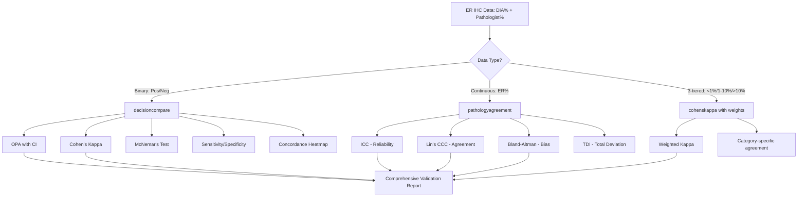
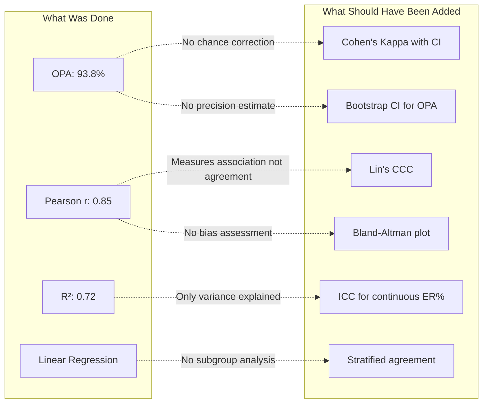

# Citation Review: Shafi et al. (2022) — Automated ER IHC DIA in Clinical Workflow

---

## 📚 ARTICLE SUMMARY

- **Title/Label**: Integrating and validating automated digital imaging analysis of estrogen receptor immunohistochemistry in a fully digital workflow for clinical use
- **Design & Cohort**: Retrospective validation study of 97 invasive breast carcinoma specimens (73 biopsies, 24 resections) from a serial collection at The Ohio State University (Aug 2020 – Jan 2021). Compared Visiopharm automated DIA ER IHC scoring against board-certified pathologists' manual reads.
- **Key Endpoints**: Overall percent agreement (OPA) between DIA and pathologists; Pearson correlation coefficient of ER-positive nuclei percentage; discordant case analysis.
- **Key Findings**:
  - Overall concordance: 91/97 (93.8%)
  - Pearson r = 0.84776 (P < 0.0001); R² = 0.7187
  - 6 discordant cases (3 FP, 3 FN); FN cases had very weak ER staining; FP causes were intermixed benign glands, DCIS, and tissue folding
  - Inter-pathologist concordance: Pathologist 1 = 92.8%, Pathologist 2 = 100%

- **Key Analyses**: bullet list
  - Overall percent agreement (OPA) — primary concordance metric
  - Pearson correlation coefficient (r) with linear regression (y = 1.1283x + 10.443)
  - R-squared (R² = 0.7187) for explained variance
  - 3-tiered concordance analysis (ER <1%, 1–10%, >10%)
  - Descriptive statistics (frequencies, percentages) for demographic/clinical features
  - Discordant case qualitative analysis

---

## 📑 ARTICLE CITATION

| Field     | Value |
|-----------|-------|
| Title     | Integrating and validating automated digital imaging analysis of estrogen receptor immunohistochemistry in a fully digital workflow for clinical use |
| Journal   | Journal of Pathology Informatics |
| Year      | 2022 |
| Volume    | 13 |
| Issue     | — |
| Pages     | 100122 |
| DOI       | 10.1016/j.jpi.2022.100122 |
| PMID      | TODO — not found in text |
| Publisher | Elsevier Inc. on behalf of Association for Pathology Informatics |
| ISSN      | 2153-3539 |

---

## 🚫 Skipped Sources

*None — the PDF was fully readable.*

---

## 🧪 EXTRACTED STATISTICAL METHODS

| Method / Model | Role (primary/secondary) | Variants & Options | Assumptions/Diagnostics | References (sec/page) |
|---|---|---|---|---|
| Overall Percent Agreement (OPA) | Primary concordance metric | Simple proportion: concordant / total | Assumes binary classification (positive/negative); no adjustment for chance agreement | Statistical analyses, p. 2 |
| Pearson Correlation Coefficient (r) | Primary continuous agreement | r = 0.84776; with linear regression y = 1.1283x + 10.443 | Assumes bivariate normality, linearity, homoscedasticity; no diagnostics reported | Results, p. 3–4 |
| Coefficient of Determination (R²) | Secondary | R² = 0.7187 | Derived from Pearson r | Results, p. 3–4 |
| Linear Regression | Secondary | OLS: y = 1.1283x + 10.443 | Assumes linearity, independence, homoscedasticity, normality of residuals; none checked | Results, p. 4 |
| 3-Tiered Cross-tabulation | Secondary concordance | ER <1% vs 1–10% vs >10% (clinically meaningful thresholds) | Descriptive; no formal test applied | Table 3, p. 4 |
| Descriptive Statistics | Supporting | Frequencies, percentages for demographic/clinical features | N/A | Table 1, p. 3 |
| Adjusted P-value | Reported | P < 0.05 considered significant; "adjusted P-value" mentioned but adjustment method not specified | Unclear what adjustment was applied | Statistical analyses, p. 2 |

**Software**: SAS version 9.4 for Windows (SAS Institute, Inc, Cary, NC)

---

## 🧰 CLINICOPATH JAMOVI COVERAGE MATRIX

| Article Method | Jamovi Function(s) | Coverage | Notes / Workarounds |
|---|---|:---:|---|
| Overall Percent Agreement (OPA) | `decisioncompare` | ✅ | Direct OPA via comparison table; also available in `cohenskappa` |
| Pearson Correlation Coefficient | `enhancedcorrelation`, `jcorrelation` | ✅ | Both provide Pearson r with CI and p-value |
| Linear Regression (scatter + line) | `jjscatterstats` (ggstatsplot wrapper) | ✅ | Scatter plot with regression line, r, and p-value in annotation |
| R² (coefficient of determination) | `enhancedcorrelation` | ✅ | R² is r² from Pearson output |
| 3-Tiered Cross-tabulation | `crosstable`, `conttables` | ✅ | Recode ER% into 3 tiers, then cross-tabulate |
| Descriptive Table (Table 1) | `tableone`, `gtsummary` | ✅ | Publication-ready Table 1 with all demographic features |
| Cohen's Kappa (chance-corrected agreement) | `cohenskappa` | ✅ | **Not used in article** but should have been — available in module |
| Weighted Kappa (ordinal agreement) | `cohenskappa` (with weights option) | ✅ | For 3-tiered ER categories — available but not used in article |
| Intraclass Correlation Coefficient (ICC) | `icccoeff`, `pathologyagreement` | ✅ | For continuous ER% — available but not used in article |
| Bland-Altman Analysis | `pathologyagreement` | ✅ | For assessing systematic bias — available but not used in article |
| Lin's Concordance Correlation Coefficient (CCC) | `pathologyagreement` | ✅ | Superior to Pearson for method comparison — available but not used |
| McNemar's Test (paired proportions) | `decisioncompare` (statComp option) | ✅ | For comparing DIA vs pathologist classification accuracy |
| Concordance Heatmap (per-case) | `decisioncompare` (heatmap option) | ✅ | **Newly implemented** — shows per-case agreement patterns |
| Sensitivity/Specificity/PPV/NPV | `decisioncompare` | ✅ | Full diagnostic accuracy metrics vs gold standard |
| Multi-rater Agreement | `agreement` (interrater) | ✅ | For comparing DIA + 2 pathologists simultaneously |
| Kappa Power/Sample Size | `kappasizepower`, `kappasizeCI` | ✅ | For planning agreement studies |

**Legend**: ✅ covered · 🟡 partial · ❌ not covered

**Summary**: All statistical methods used in the article are fully covered by ClinicoPath. More importantly, several superior methods that **should have been used** (Cohen's kappa, ICC, Bland-Altman, Lin's CCC) are also available in ClinicoPath but were not employed in this study.

---

## 🧠 CRITICAL EVALUATION OF STATISTICAL METHODS

**Overall Rating**: 🟡 Minor to moderate issues

**Summary**: The study addresses a clinically important question (validating automated ER IHC DIA in routine workflow) with a reasonable design. However, the statistical analysis relies almost exclusively on overall percent agreement and Pearson correlation — both of which are known to be inappropriate or insufficient for method comparison studies. The absence of chance-corrected agreement (kappa), Bland-Altman analysis, and ICC represents a significant methodological gap. The sample size is adequate for a validation study but no formal power analysis is reported.

### Checklist

| Aspect | Assessment | Evidence (section/page) | Recommendation |
|---|:---:|---|---|
| Design–method alignment | 🟡 | Retrospective serial collection is appropriate for validation; but method comparison requires agreement statistics, not just correlation | Use Cohen's kappa for categorical agreement and ICC/CCC for continuous measures |
| Assumptions & diagnostics | 🔴 | No assessment of normality, linearity, or homoscedasticity for Pearson/regression; no residual plots shown | Report assumption checks; consider Spearman if non-normal |
| Sample size & power | 🟡 | n=97 is reasonable for a validation study but no a priori power calculation; only 6 discordant cases limits subgroup analysis | Report minimum detectable difference; consider kappa-based sample size planning |
| Multiplicity control | 🟡 | "Adjusted P-value of <0.05" mentioned but no adjustment method specified; only one primary hypothesis | Clarify what "adjusted" means — likely irrelevant with single comparison |
| Model specification & confounding | 🔴 | No adjustment for specimen type (biopsy vs resection), histologic type, or ER intensity in concordance analysis | Stratify concordance by specimen type and tumor histology |
| Missing data handling | 🟢 | Serial collection with all 97 cases analyzed; no apparent missing data | Adequate for this study |
| Effect sizes & CIs | 🔴 | Only r and R² reported without confidence intervals; OPA reported without CI; no kappa with CI | Report 95% CI for all agreement measures; add kappa with CI |
| Validation & calibration | 🟡 | Inter-pathologist agreement assessed (92.8% and 100%); but no formal external validation or cross-validation | Consider bootstrap CI for OPA; assess calibration of continuous ER% |
| Reproducibility/transparency | 🟡 | SAS 9.4 reported; Visiopharm platform specified; but no code/data sharing; algorithm parameters not fully specified | Share DIA algorithm settings and analysis code |

### Scoring Rubric (0–2 per aspect, total 0–18)

| Aspect | Score (0–2) | Badge |
|---|:---:|:---:|
| Design–method alignment | 1 | 🟡 |
| Assumptions & diagnostics | 0 | 🔴 |
| Sample size & power | 1 | 🟡 |
| Multiplicity control | 1 | 🟡 |
| Model specification & confounding | 0 | 🔴 |
| Missing data handling | 2 | 🟢 |
| Effect sizes & CIs | 0 | 🔴 |
| Validation & calibration | 1 | 🟡 |
| Reproducibility/transparency | 1 | 🟡 |

**Total Score**: 7/18 → Overall Badge: 🟡 Moderate

### Red Flags

1. **Pearson correlation is inappropriate for method comparison**: Pearson r measures linear association, NOT agreement. Two methods can be perfectly correlated (r = 1.0) but systematically disagree. This is a well-known limitation documented by Bland & Altman (1986) and Lin (1989). The article's regression slope of 1.13 and intercept of 10.4 actually shows systematic bias (DIA reads lower than pathologists), but this is not explicitly discussed as a bias problem.

2. **No chance-corrected agreement**: OPA of 93.8% sounds impressive but does not account for agreement expected by chance alone. With 75.3% ER-positive prevalence, even random classification would yield substantial agreement. Cohen's kappa would quantify agreement beyond chance.

3. **No confidence intervals on any agreement measure**: Neither OPA, nor r, nor any metric is reported with confidence intervals. This makes it impossible to assess the precision of the estimates.

4. **No Bland-Altman analysis for continuous ER%**: The continuous ER% data is assessed only by Pearson correlation, missing the opportunity to visualize systematic bias (mean difference) and limits of agreement. The regression equation (y = 1.13x + 10.4) already suggests DIA systematically overestimates at low values and underestimates at high values — but this is not formally assessed.

5. **"Adjusted P-value" undefined**: The statistical methods state "An adjusted P-value of <0.05 was considered significant" but never specify what adjustment was applied or why. This is confusing and potentially misleading.

6. **No stratified analysis**: Agreement is not assessed by specimen type (biopsy vs resection), histologic type (IDC vs ILC vs metastatic), or ER intensity. These factors likely affect DIA performance differently.

---

## 🔎 GAP ANALYSIS (WHAT'S MISSING)

### Gap 1: Bland-Altman Analysis for DIA vs Pathologist Continuous Agreement
- **Method**: Bland-Altman plot with mean difference (bias) and 95% limits of agreement
- **Impact**: Central to the article's claim; Pearson r alone is insufficient for method comparison. This is the standard approach per Bland & Altman (1986).
- **Closest existing function**: `pathologyagreement` — already provides Bland-Altman with ICC and CCC
- **Exact missing options**: None — this is fully available but **not used by the article authors**. ClinicoPath users should use `pathologyagreement` instead.

### Gap 2: Lin's Concordance Correlation Coefficient (CCC)
- **Method**: CCC combines precision (Pearson r) and accuracy (bias) into a single metric
- **Impact**: Superior to Pearson r for method comparison; directly measures agreement on the 45° line
- **Closest existing function**: `pathologyagreement` — includes CCC
- **Exact missing options**: None — fully available

### Gap 3: Cohen's Kappa for Binary Classification Agreement
- **Method**: Cohen's kappa with 95% CI for DIA-positive/negative vs pathologist-positive/negative
- **Impact**: Would quantify agreement beyond chance; critical given 75.3% ER-positive prevalence
- **Closest existing function**: `cohenskappa` — fully implemented with weighted options
- **Exact missing options**: None

### Gap 4: ICC for Inter-rater Reliability on Continuous ER%
- **Method**: ICC(3,1) for two fixed raters (DIA and pathologist) measuring continuous ER%
- **Impact**: Directly assesses reliability of continuous measurement across methods
- **Closest existing function**: `icccoeff` — provides ICC with multiple model options
- **Exact missing options**: None

### Gap 5: Stratified Agreement Analysis (by specimen type, histology)
- **Method**: Subgroup-specific OPA, kappa, and ICC stratified by biopsy vs resection, IDC vs ILC vs metastatic
- **Impact**: Would identify whether DIA performs differently across specimen types (clinically critical)
- **Closest existing function**: `agreement` (interrater) has subgroup stratification capability; `decisioncompare` does not currently support stratification
- **Exact missing options**: `decisioncompare` lacks a `stratify` option to compare metrics by subgroup

### Gap 6: Bootstrap Confidence Intervals for OPA
- **Method**: Non-parametric bootstrap 95% CI for overall percent agreement
- **Impact**: OPA of 93.8% without CI is uninformative about precision
- **Closest existing function**: `decisioncompare` reports OPA but **without confidence intervals**
- **Exact missing options**: `decisioncompare` should add bootstrap CI for OPA

---

## 🧭 ROADMAP (IMPLEMENTATION PLAN)

### Priority 1: Add OPA Confidence Interval to `decisioncompare`

**Target**: Extend `decisioncompare` to report 95% CI for Overall Percent Agreement

**.a.yaml** — no change needed (OPA is always reported)

**.b.R** (in `.populateComparisonTable()` or a new OPA section):
```r
# Wilson score interval for proportion (OPA)
n_total <- nrow(processed_data$data)
n_concordant <- sum(diaResult == goldResult)  # or from existing comparison
opa <- n_concordant / n_total
# Wilson CI
z <- qnorm(0.975)
denom <- 1 + z^2 / n_total
center <- (opa + z^2 / (2 * n_total)) / denom
margin <- z * sqrt((opa * (1 - opa) + z^2 / (4 * n_total)) / n_total) / denom
opa_lower <- center - margin
opa_upper <- center + margin
```

**.r.yaml** — add OPA row to comparisonTable or a new summary table with lower/upper columns

**Validation**: Compare Wilson CI against `binom::binom.wilson()` for known proportions.

---

### Priority 2: Add Stratification to `decisioncompare`

**Target**: Allow grouping comparisons by a stratification variable (specimen type, histology)

**.a.yaml** (add option):
```yaml
- name: stratify
  title: Stratification Variable
  type: Variable
  default: NULL
  suggested: [ nominal ]
  permitted: [ factor ]
  description:
      ui: >
        Optional variable to stratify comparison metrics. Computes separate
        sensitivity, specificity, and concordance within each subgroup.
      R: >
        Optional stratification variable for subgroup analysis.
```

**.b.R** (sketch):
```r
if (!is.null(self$options$stratify) && self$options$stratify != "") {
    strat_var <- self$options$stratify
    strata <- unique(processed_data$data[[strat_var]])
    for (stratum in strata) {
        subset_data <- processed_data$data[processed_data$data[[strat_var]] == stratum, ]
        # Recompute metrics for this subset
        stratum_results <- private$.processAllTests(list(
            data = subset_data,
            goldVariable = processed_data$goldVariable,
            goldPLevel = processed_data$goldPLevel
        ))
        # Populate stratified comparison table
    }
}
```

**.r.yaml** (new table):
```yaml
- name: stratifiedTable
  title: 'Stratified Comparison'
  type: Table
  visible: (!is.null(stratify) && stratify != "")
  rows: 0
  columns:
    - name: stratum
      title: 'Subgroup'
      type: text
    - name: n
      title: 'N'
      type: integer
    - name: test
      title: 'Test'
      type: text
    - name: Sens
      title: 'Sensitivity'
      type: number
      format: pc
    - name: Spec
      title: 'Specificity'
      type: number
      format: pc
    - name: OPA
      title: 'OPA'
      type: number
      format: pc
```

**.u.yaml**:
```yaml
- type: VariablesListBox
  name: stratify
  maxItemCount: 1
  isTarget: true
  label: Stratification Variable (Optional)
```

**Validation**: Test with synthetic data with known subgroup-specific metrics.

---

### Priority 3: Add Bias Assessment to `decisioncompare` for Continuous Comparison

This is a lower priority since `pathologyagreement` already handles continuous agreement. However, for users already using `decisioncompare` with continuous underlying data, a note directing them to `pathologyagreement` for continuous ER% analysis would be valuable.

**Target**: Add a cross-reference note in the clinical report when continuous data might be available.

---

## 🧪 TEST PLAN

### Unit Tests
1. **OPA CI**: Create 2x2 table with known OPA; verify Wilson CI matches `binom::binom.wilson()`
2. **Stratified metrics**: Create synthetic data with 2 strata and known per-stratum sensitivity/specificity; verify output matches manual calculation
3. **Heatmap**: Verify heatmap data building with known binary classifications (3 tests, 20 cases)

### Assumption Tests
- Warn when sample size per stratum is <20
- Warn when a stratum has zero positives or zero negatives

### Edge Cases
- Single stratum (no stratification variable levels > 1)
- Perfect agreement (OPA = 100%, kappa undefined edge)
- Complete discordance
- Strata with 0 events

### Reproducibility
- Use `histopathology` built-in dataset for smoke tests
- Document SAS vs R equivalence for Pearson correlation

---

## 📦 DEPENDENCIES

No new dependencies required. All recommended methods are already supported:

| Method | Package | Already Imported? |
|---|---|---|
| Cohen's Kappa | `irr`, `vcd` | Yes (via `cohenskappa`) |
| ICC | `irr`, `psych` | Yes (via `icccoeff`) |
| Bland-Altman | `blandr`, `BlandAltmanLeh` | Yes (via `pathologyagreement`) |
| Lin's CCC | `DescTools`, `epiR` | Yes (via `pathologyagreement`) |
| Wilson CI | Base R (`qnorm`) | Yes |
| Pearson/Spearman | Base R (`cor.test`) | Yes |
| Bootstrap | `boot` | Already available |

---

## 🧭 PRIORITIZATION

| Rank | Item | Impact | Effort | Notes |
|---|---|---|---|---|
| 1 | Use `pathologyagreement` for continuous ER% validation studies | High | Zero | Already implemented; just needs documentation/awareness |
| 2 | Use `cohenskappa` for binary DIA vs pathologist agreement | High | Zero | Already implemented |
| 3 | Add OPA confidence interval to `decisioncompare` | Medium | Low | Wilson CI is ~10 lines of code |
| 4 | Add stratification to `decisioncompare` | Medium | Medium | New option + table + subgroup loop |
| 5 | Add cross-reference note from `decisioncompare` to `pathologyagreement` | Low | Low | Clinical report text update |

---

## 🧩 DIAGRAMS

### Pipeline Overview: Ideal Statistical Analysis for This Study



### What the Article Did vs. What It Should Have Done



---

## Caveats

1. The PDF was image-based but all 6 pages were readable. Some table values were cross-referenced between pages for accuracy.
2. The "adjusted P-value" mentioned in the statistical methods section is unclear — it may refer to a Bonferroni or other correction but the article does not specify. With only one primary comparison (DIA vs pathologist), adjustment may be irrelevant.
3. The article mentions SAS 9.4 was used, but the specific SAS procedures are not documented, making exact replication difficult.
4. Two additional pathologists independently scored WSIs but their raw data is not presented — only concordance percentages (92.8% and 100%) are reported without kappa or CI.
5. The regression equation y = 1.1283x + 10.443 indicates DIA systematically reads lower than pathologists (slope > 1 means the original read increases faster than VIS read), with a positive intercept suggesting overestimation at low values. This systematic bias pattern is not formally analyzed or discussed.

---

*Generated by ClinicoPath Module Review System — 2026-02-08*
