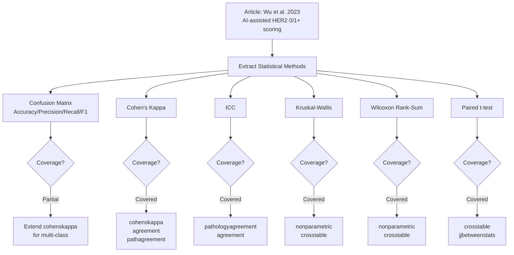
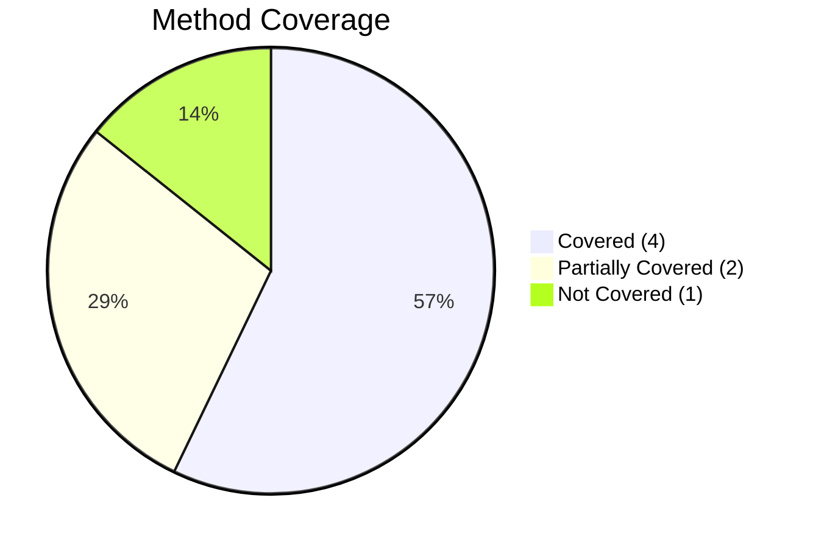

# Article Statistical Methods Review & Jamovi Coverage Analysis

**Generated:** 2026-02-08
**Reviewer:** ClinicoPath Jamovi Module Coverage Analyzer

---

## 1. ARTICLE SUMMARY

- **Title/Label**: The Role of Artificial Intelligence in Accurate Interpretation of HER2 Immunohistochemical Scores 0 and 1+ in Breast Cancer
- **Design & Cohort**: Retrospective, multi-institutional, 2-round ring study. N=246 infiltrating duct carcinoma (NOS) cases (HER2 0: n=120; HER2 1+: n=126). 15 pathologists (5 junior [1-2 yr], 5 midlevel [3-5 yr], 5 senior [6-10 yr]) from 3 hospitals. Gold standard established by consensus of 2-3 experienced pathologists (>15 yr).
- **Endpoints**: Primary: accuracy of HER2 IHC 0 vs. 1+ interpretation (with and without AI). Secondary: inter-observer consistency (ICC), effect of heterogeneity on accuracy.
- **Key Analyses**:
  - Confusion matrix (accuracy, precision, recall, F1-score) for classification performance
  - Cohen's kappa (per-pathologist agreement with gold standard)
  - Intraclass Correlation Coefficient (ICC) for inter-observer consistency
  - Kruskal-Wallis test (accuracy differences between experience groups)
  - Wilcoxon rank-sum test (paired comparisons between RS1 and RS2)
  - Paired t-test (comparing RS1 vs RS2 accuracy, from figure legends)
  - Subgroup analyses by heterogeneity type (homogeneous, scattered, clustered, mixed) and pathologist experience level

---

## 2. ARTICLE CITATION

| Field     | Value |
|-----------|-------|
| Title     | The Role of Artificial Intelligence in Accurate Interpretation of HER2 Immunohistochemical Scores 0 and 1+ in Breast Cancer |
| Journal   | Modern Pathology |
| Year      | 2023 |
| Volume    | 36 |
| Issue     | (not specified in text) |
| Pages     | 100054 |
| DOI       | 10.1016/j.modpat.2022.100054 |
| PMID      | TODO |
| Publisher | Elsevier / United States & Canadian Academy of Pathology |
| ISSN      | 0893-3952 |

---

## 3. Skipped Sources

None. The PDF was successfully parsed.

---

## 4. EXTRACTED STATISTICAL METHODS

| Method / Model | Role | Variants & Options | Assumptions/Diagnostics | References (sec/page) |
|---|---|---|---|---|
| Confusion Matrix (Accuracy, Precision, Recall, F1-score) | Primary | Binary classification (HER2 0 vs 1+); computed per pathologist and pooled across all pathologists | Not applicable (descriptive diagnostic metric) | Statistical Methods, p.3; Results, p.4 |
| Cohen's Kappa (κ) | Primary | Per-pathologist agreement with gold standard; used as accuracy proxy in Figure 7A | Assumes nominal categories, same marginals | Statistical Methods, p.3; Figure 7A |
| Intraclass Correlation Coefficient (ICC) | Primary | Two-way random, absolute agreement (inferred); 15 raters on 246 cases; 95% CI reported | Normality of ratings, no systematic bias between raters | Statistical Methods, p.3; Results p.7; Figure 7B |
| Kruskal-Wallis Test | Secondary | Comparing accuracy across 3 experience groups (junior/midlevel/senior) | Independent groups, ordinal/continuous outcome | Statistical Methods, p.3 |
| Wilcoxon Rank-Sum Test | Secondary | Pairwise comparisons of accuracy between pathologist groups using different methods | Paired/independent comparisons (unclear specification) | Statistical Methods, p.3 |
| Paired t-test | Secondary | Comparing RS1 vs RS2 accuracy (from Figure 4B legend) | Normality of differences; paired observations | Figure 4B legend, p.5 |
| Descriptive statistics (proportions, percentages) | Secondary | Heterogeneity prevalence; acceptance rate | N/A | Results pp.5-8 |

---

## 5. CLINICOPATH JAMOVI COVERAGE MATRIX

| Article Method | Jamovi Function(s) | Coverage | Notes / Workarounds |
|---|---|:---:|---|
| Confusion Matrix (Accuracy, Precision, Recall, F1) | `decision` (2x2 diagnostic), `decisionpanel` (multi-test), `treemedical`, `treecompare` | 🟡 | ClinicoPath has extensive diagnostic test analysis (sensitivity, specificity, PPV, NPV) via `decision`. However, multi-class confusion matrices (0 vs 1+ vs 2+ vs 3+) and batch processing across 15 raters are not directly supported. The F1-score metric is available in `treecompare` but not in standard diagnostic test functions. |
| Cohen's Kappa (κ) | `cohenskappa`, `agreement`, `pathagreement` | ✅ | `cohenskappa` directly computes Cohen's kappa for 2 raters. `agreement` provides comprehensive interrater reliability including weighted kappa, pairwise kappa, and hierarchical kappa. `pathagreement` is specifically designed for pathology interrater reliability. |
| Intraclass Correlation Coefficient (ICC) | `pathologyagreement`, `agreement`, `pathagreement` | ✅ | `pathologyagreement` explicitly includes ICC with options for consistency vs absolute agreement. `agreement` includes comprehensive ICC analysis with multiple model types. The AI-vs-pathologist preset is available in `pathologyagreement`. |
| Kruskal-Wallis Test | `nonparametric`, `crosstable`, `jjbetweenstats`, `gtsummary` | ✅ | `nonparametric` directly provides Kruskal-Wallis with post-hoc tests. `crosstable` with `pcat` option can select Kruskal-Wallis. `jjbetweenstats` (ggstatsplot wrapper) auto-selects non-parametric tests. |
| Wilcoxon Rank-Sum / Signed-Rank Test | `nonparametric`, `crosstable`, `jjbetweenstats`, `friedmantest` | ✅ | `nonparametric` provides both Mann-Whitney U (rank-sum) and Wilcoxon signed-rank. For paired data, `friedmantest` includes Wilcoxon signed-rank as post-hoc. |
| Paired t-test | `crosstable`, `jjbetweenstats` | ✅ | Standard paired t-test is available through multiple functions. |
| Multi-rater ring study analysis (15 pathologists, 2 rounds) | `agreement`, `pathagreement` | 🟡 | Multi-rater ICC is supported. However, the specific workflow of a 2-round ring study with washout period (before/after AI intervention) as a study design template is not built in. Users would need to run agreement analysis separately for each round. |
| Heterogeneity subgroup analysis | `crosstable` + manual stratification | 🟡 | No built-in heterogeneity classification for IHC staining patterns. Users can stratify data manually and run separate analyses per subgroup. |
| AI algorithm performance evaluation (F1, Dice coefficient for segmentation) | Not applicable | ❌ | AI/deep learning model performance metrics (Dice coefficient, cell detection F1-score for image segmentation) are outside the scope of a clinical statistics module. |

**Legend**: ✅ covered | 🟡 partial | ❌ not covered

---

## 6. CRITICAL EVALUATION OF STATISTICAL METHODS

**Overall Rating**: 🟡 Minor issues

**Summary**: The study uses appropriate classification metrics (confusion matrix, precision, recall, F1) and agreement statistics (ICC, Cohen's kappa) for evaluating observer concordance in a ring study design. However, there are several methodological concerns: (1) the gold standard is itself consensus-based and somewhat subjective, (2) the study design is not fully randomized (same slide order, potential recall bias despite 2-week washout), (3) statistical tests are inconsistently specified (paired t-test in figure but Kruskal-Wallis/Wilcoxon in methods), and (4) multiple comparisons across subgroups lack formal correction.

### Checklist

| Aspect | Assessment | Evidence (section/page) | Recommendation |
|---|:--:|---|---|
| Design-method alignment | 🟡 | Methods p.3, Results pp.4-8 | The 2-round design with washout is reasonable but not ideal. Same slide order could introduce learning effects. Randomizing slide order between rounds or using a crossover design would be stronger. The Wilcoxon rank-sum test is mentioned but the data appears paired (same pathologists, same cases), so Wilcoxon signed-rank would be more appropriate. Figure 4B legend mentions paired t-test which is correct for paired data but contradicts the methods section. |
| Assumptions & diagnostics | 🔴 | Not reported | No mention of normality checks for the paired t-test. ICC model type (one-way vs two-way, random vs mixed) is not specified. No assessment of whether kappa values require correction for prevalence or bias. |
| Sample size & power | 🟡 | Methods p.2 | N=246 cases is reasonable for a ring study. However, no formal power analysis is reported. With 15 raters, the effective sample for group comparisons (5 per experience group) is quite small, limiting the power to detect differences between experience levels. |
| Multiplicity control | 🔴 | Not reported | Multiple pairwise comparisons are made (RS1 vs RS2, between experience groups, across heterogeneity subtypes, for HER2 0 vs 1+ separately) without any reported multiplicity correction (e.g., Bonferroni, Holm, or BH FDR). Figure 4B shows multiple paired t-tests with significance stars but no correction mentioned. |
| Model specification & confounding | 🟡 | Methods pp.2-3 | The study does not account for potential confounders: case difficulty, slide quality variation, pathologist fatigue, or order effects. A mixed-effects model (pathologist as random effect, case as random effect, round as fixed effect) would better account for the hierarchical data structure. |
| Missing data handling | 🟢 | Results pp.4-8 | All 15 pathologists scored all 246 cases in both rounds. Complete data is implied. No missing data issues reported. |
| Effect sizes & CIs | 🟡 | Results pp.4-8 | ICC values are reported with 95% CIs (good). Cohen's kappa values shown in Figure 7A as box plots. However, accuracy, precision, recall, F1 are reported as point estimates without CIs in the main text. Differences between rounds lack CIs. |
| Validation & calibration | 🟡 | Methods p.3 | AI algorithm validated on independent test sets (F1=0.927 for detection, Dice=0.914 for segmentation). However, the clinical validation (ring study) uses the same institution's cases for training and evaluation, raising concerns about generalizability. No external validation cohort. |
| Reproducibility/transparency | 🟡 | Methods p.3 | Software versions reported (SPSS 24.0, GraphPad Prism 8.01). AI model details provided (PyTorch, U-Net, Swin-Transformer). Thresholds documented. However, no code or data availability for the statistical analyses. The AI algorithm website is referenced but not the code. |

### Scoring Rubric (0-2 per aspect, total 0-18)

| Aspect | Score (0-2) | Badge |
|---|:---:|:---:|
| Design-method alignment | 1 | 🟡 |
| Assumptions & diagnostics | 0 | 🔴 |
| Sample size & power | 1 | 🟡 |
| Multiplicity control | 0 | 🔴 |
| Model specification & confounding | 1 | 🟡 |
| Missing data handling | 2 | 🟢 |
| Effect sizes & CIs | 1 | 🟡 |
| Validation & calibration | 1 | 🟡 |
| Reproducibility/transparency | 1 | 🟡 |

**Total Score**: 8/18 → Overall Badge: 🟡 Moderate

### Red Flags Noted

- **Inconsistent test specification**: Methods section describes Kruskal-Wallis and Wilcoxon rank-sum, but Figure 4B legend describes paired t-test. These are fundamentally different tests with different assumptions.
- **Unadjusted multiple comparisons**: Multiple pairwise tests across experience groups, heterogeneity types, and HER2 categories without correction inflates the familywise error rate substantially.
- **ICC model not specified**: The ICC model (one-way random, two-way random, two-way mixed) determines the interpretation and generalizability of the consistency measure. This is critical information that is missing.
- **Small N for subgroup analyses**: With only 5 pathologists per experience group, subgroup comparisons have very limited statistical power and the results should be interpreted cautiously.
- **Gold standard is subjective**: Consensus of 2-3 expert pathologists is a pragmatic but imperfect reference standard. This is acknowledged as a limitation.
- **Potential learning/recall bias**: Despite the 2-week washout, pathologists may recall challenging cases, especially given the relatively small sample (246 cases).
- **Reporting only p-values for some comparisons**: Several subgroup analyses (heterogeneity types, experience levels) report significance without effect sizes or confidence intervals.

---

## 7. GAP ANALYSIS (WHAT'S MISSING)

### Gap 1: Multi-Rater Multi-Class Confusion Matrix with Batch Processing

- **Method**: Multi-class confusion matrix across multiple raters (15 pathologists x 246 cases x 2 rounds), with aggregate metrics (macro/micro-averaged precision, recall, F1)
- **Impact**: Central to any AI-assisted interpretation study. Extremely common in digital pathology literature.
- **Closest existing function**: `decision` (2x2 only), `treecompare` (has F1 but for ML trees)
- **Exact missing options**: Multi-class (>2) confusion matrix; batch processing across multiple raters; macro/micro/weighted averaging of metrics; per-class metrics table

### Gap 2: Ring Study / Multi-Round Agreement Analysis Template

- **Method**: Structured before/after intervention design with washout period, comparing agreement metrics (ICC, kappa) across rounds
- **Impact**: Common study design in pathology QA/QC and AI validation studies
- **Closest existing function**: `agreement`, `pathagreement`
- **Exact missing options**: Built-in round/phase comparison; automatic delta calculations (improvement in ICC/kappa); paired agreement comparison workflow

### Gap 3: Mixed-Effects Models for Hierarchical Observer Studies

- **Method**: Mixed-effects logistic regression or generalized linear mixed model with pathologist as random effect, case as random effect, round/AI-assistance as fixed effect
- **Impact**: Proper statistical framework for analyzing multi-rater, multi-case study designs. Accounts for both pathologist-level and case-level variability.
- **Closest existing function**: None directly. `multiregression` and `linreg` are for standard regression.
- **Exact missing options**: Random effects specification; crossed random effects (rater x case); binary outcome GLMM; ICC extraction from mixed models

### Gap 4: IHC Heterogeneity Scoring Classification

- **Method**: Automated classification of IHC staining heterogeneity patterns (scattered, clustered, mixed types)
- **Impact**: Specific to HER2-low breast cancer assessment; growing importance with T-DXd therapy
- **Closest existing function**: `ihcscoring` (IHC scoring), but no heterogeneity classification
- **Exact missing options**: Heterogeneity pattern classification; staining distribution analysis; heterogeneity prevalence reporting

---

## 8. ROADMAP (IMPLEMENTATION PLAN)

### 8.1 Extend `cohenskappa` / `agreement` for Multi-Class Confusion Matrix

**Target**: Add multi-class confusion matrix with per-class and aggregate metrics

**.a.yaml** (add options):
```yaml
options:
  - name: multiclass
    title: Multi-class Classification
    type: Bool
    default: false
    description:
        R: Enable multi-class (>2 categories) confusion matrix analysis

  - name: averaging
    title: Averaging Method
    type: List
    options:
      - title: Macro (unweighted mean)
        name: macro
      - title: Micro (global TP/FP/FN)
        name: micro
      - title: Weighted (class-size weighted)
        name: weighted
    default: macro
    description:
        R: Method for averaging per-class metrics
```

**.b.R** (sketch):
```r
if (self$options$multiclass) {
  # Build multi-class confusion matrix
  cm <- table(Predicted = predicted_labels, Actual = gold_standard)

  # Per-class metrics
  per_class <- lapply(levels(gold_standard), function(cls) {
    tp <- cm[cls, cls]
    fp <- sum(cm[cls, ]) - tp
    fn <- sum(cm[, cls]) - tp
    tn <- sum(cm) - tp - fp - fn
    precision <- tp / (tp + fp)
    recall <- tp / (tp + fn)
    f1 <- 2 * precision * recall / (precision + recall)
    list(class = cls, precision = precision, recall = recall, f1 = f1, n = sum(cm[, cls]))
  })

  # Aggregate metrics based on averaging method
  if (self$options$averaging == "macro") {
    avg_precision <- mean(sapply(per_class, `[[`, "precision"), na.rm = TRUE)
    # ... similar for recall, f1
  }

  self$results$confusion_matrix$setContent(cm)
  self$results$per_class_metrics$setContent(per_class_df)
}
```

**.r.yaml** (ensure outputs):
```yaml
items:
  - name: confusion_matrix
    type: Table
    title: Confusion Matrix
    columns:
      - name: actual
        title: Actual Class
      - name: predicted_0
        title: Predicted 0
      - name: predicted_1plus
        title: Predicted 1+

  - name: per_class_metrics
    type: Table
    title: Per-Class Classification Metrics
    columns:
      - name: class
        title: Class
      - name: precision
        title: Precision
      - name: recall
        title: Recall
      - name: f1
        title: F1-Score
      - name: n
        title: N
```

**.u.yaml** (UI toggle):
```yaml
sections:
  - label: Multi-Class Analysis
    items:
      - name: multiclass
        type: CheckBox
        label: "Enable multi-class confusion matrix"
      - name: averaging
        type: ComboBox
        label: "Averaging method"
```

#### Validation
- Compare against `caret::confusionMatrix()` for multi-class data
- Test with 2x2, 3x3, and 4x4 matrices
- Verify macro vs micro averaging against sklearn reference

---

### 8.2 Add Ring Study Comparison Mode to `agreement` / `pathagreement`

**Target**: Enable before/after intervention comparison of agreement metrics

**.a.yaml** (add options):
```yaml
options:
  - name: roundComparison
    title: Compare Agreement Across Rounds
    type: Bool
    default: false
    description:
        R: Compare ICC/kappa between two study rounds (e.g., before and after AI assistance)

  - name: round2Raters
    title: Round 2 Rater Variables
    type: Variables
    description:
        R: Rater variables from the second round of the study
```

**.b.R** (sketch):
```r
if (self$options$roundComparison) {
  # Calculate ICC for round 1
  icc_r1 <- psych::ICC(round1_matrix)

  # Calculate ICC for round 2
  icc_r2 <- psych::ICC(round2_matrix)

  # Delta ICC with bootstrap CI
  boot_delta <- boot::boot(data, function(d, i) {
    icc2 <- psych::ICC(round2_matrix[i, ])$results$ICC[3]
    icc1 <- psych::ICC(round1_matrix[i, ])$results$ICC[3]
    icc2 - icc1
  }, R = 1000)

  self$results$round_comparison$setRow(rowNo = 1, values = list(
    round1_icc = icc_r1$results$ICC[3],
    round2_icc = icc_r2$results$ICC[3],
    delta = icc_r2$results$ICC[3] - icc_r1$results$ICC[3],
    delta_ci_lower = boot.ci(boot_delta, type = "bca")$bca[4],
    delta_ci_upper = boot.ci(boot_delta, type = "bca")$bca[5]
  ))
}
```

**.r.yaml**:
```yaml
items:
  - name: round_comparison
    type: Table
    title: Agreement Comparison Across Rounds
    columns:
      - name: metric
        title: Metric
      - name: round1
        title: Round 1
      - name: round2
        title: Round 2
      - name: delta
        title: Difference
      - name: delta_ci
        title: 95% CI for Difference
      - name: p_value
        title: P-value
```

#### Validation
- Simulate known ICC change with bootstrap
- Compare with manual calculation using `psych::ICC()`

---

### 8.3 Extend `pathologyagreement` for AI-vs-Pathologist Multi-Rater Workflows

**Target**: Add AI reference comparisons and acceptance rate calculation

**.a.yaml** (add options):
```yaml
options:
  - name: aiReference
    title: AI Algorithm Reference Score
    type: Variable
    description:
        R: Variable containing AI algorithm's scores for comparison with pathologist scores

  - name: calculateAcceptanceRate
    title: Calculate AI Acceptance Rate
    type: Bool
    default: false
    description:
        R: Calculate the proportion of cases where pathologists agreed with AI suggestion
```

**.b.R** (sketch):
```r
if (!is.null(self$options$aiReference) && self$options$calculateAcceptanceRate) {
  ai_scores <- self$data[[self$options$aiReference]]

  acceptance_rates <- sapply(rater_vars, function(rater) {
    rater_scores <- self$data[[rater]]
    mean(rater_scores == ai_scores, na.rm = TRUE)
  })

  self$results$acceptance_table$setContent(data.frame(
    rater = names(acceptance_rates),
    acceptance_rate = acceptance_rates,
    n_agree = round(acceptance_rates * length(ai_scores)),
    n_total = length(ai_scores)
  ))
}
```

#### Validation
- Test with synthetic data where acceptance rate is known
- Verify against manual calculation

---

## 9. TEST PLAN

### Unit Tests
- **Confusion matrix**: 2x2 and multi-class matrices with known TP/FP/FN/TN values; verify precision, recall, F1 against hand calculations
- **ICC**: Simulate data with known ICC (e.g., using `SimDesign::ICC()` or `psych::sim.ICC()`); verify ICC recovery within tolerance
- **Cohen's kappa**: Binary and multi-class kappa with known values; compare with `irr::kappa2()` and `vcd::Kappa()`
- **Round comparison**: Simulate two rounds with known improvement; verify delta ICC and bootstrap CI coverage

### Assumption Checks
- ICC normality: Shapiro-Wilk on residuals
- Kappa: Check for prevalence-adjusted bias-adjusted kappa (PABAK) when marginals are imbalanced

### Edge Cases
- All raters agree (perfect ICC = 1.0)
- Complete disagreement
- Missing raters for some cases
- Only 2 categories (binary)
- Highly imbalanced class distribution (e.g., 90% HER2 0, 10% HER2 1+)

### Performance
- 1000 cases x 20 raters: should complete in <5 seconds
- 10,000 cases x 50 raters: should complete in <30 seconds

### Reproducibility
- Seed-based bootstrap reproducibility
- Example datasets with published reference values

---

## 10. DEPENDENCIES

| Package | Purpose | Already in DESCRIPTION? | Notes |
|---|---|---|---|
| `irr` | ICC, kappa, agreement coefficients | Check | Standard interrater reliability package |
| `psych` | ICC with multiple models, agreement | Check | Widely used for ICC |
| `vcd` | Cohen's kappa, weighted kappa | Check | Visualization of categorical data |
| `boot` | Bootstrap CIs for ICC/kappa differences | Check | Base R recommended package |
| `caret` | Multi-class confusion matrix | Check | Comprehensive ML metrics |
| `DescTools` | Cohen's kappa, ICC, various agreement measures | Likely yes | Already used elsewhere in module |

---

## 11. PRIORITIZATION

1. **Multi-class confusion matrix with per-class metrics** (High impact, low effort) - Extremely common in AI pathology papers; extends existing `cohenskappa` function; reuses `caret::confusionMatrix()`
2. **Ring study comparison mode for agreement functions** (High impact, medium effort) - Common study design in pathology QA; adds delta-ICC with CIs to existing `agreement`/`pathagreement`
3. **AI acceptance rate calculation** (Medium impact, low effort) - Simple addition to `pathologyagreement`; useful for AI validation studies
4. **Mixed-effects models for observer studies** (High impact, high effort) - Would require new function; uses `lme4::glmer()`; proper framework for multi-rater studies but complex UI
5. **IHC heterogeneity classification** (Medium impact, high effort) - Domain-specific; would need pathology expert input for classification criteria; lower generalizability

---

## 12. OPTIONAL DIAGRAMS

### Pipeline Overview



### Coverage Matrix



---

## 13. CAVEATS

1. **Method identification uncertainty**: The article describes "Wilcoxon rank-sum test" for comparing accuracy between pathologist groups, but the actual comparison (same pathologists across two rounds) is paired, suggesting Wilcoxon signed-rank test would be more appropriate. The figure legend for Figure 4B mentions "paired t-test," which contradicts the methods section. The actual test used is ambiguous.

2. **ICC model ambiguity**: The ICC model type (ICC(1), ICC(2,1), ICC(3,1), ICC(2,k), ICC(3,k)) is not specified. For this study design (15 fixed raters evaluating all 246 cases), ICC(3,1) (two-way mixed, single measures, consistency) or ICC(2,1) (two-way random, single measures, absolute agreement) would be appropriate. The coverage assessment assumes either model is supported.

3. **Gold standard limitations**: The consensus-based gold standard used in this study is inherently subjective. A truly rigorous evaluation would use a definitive reference (e.g., FISH/ISH correlation), though this is impractical for distinguishing HER2 0 from 1+.

4. **AI performance metrics not in scope**: The article reports AI model performance metrics (Dice coefficient for segmentation, F1 for cell detection) that are computer vision metrics, not clinical statistical methods. These are appropriately outside the scope of a clinical statistics module.

5. **The module already has strong coverage**: The ClinicoPath module has excellent existing functions for agreement analysis (`agreement`, `cohenskappa`, `pathagreement`, `pathologyagreement`) and non-parametric tests (`nonparametric`). The gaps identified are primarily about workflow optimization (ring study templates, batch rater processing) rather than fundamental missing statistical capabilities.
