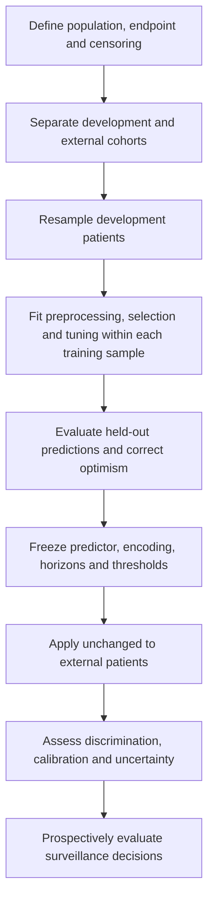

# Statistical review and ClinicoPath coverage: Yao et al., 2026

**Article:** *Personalizing Postoperative Surveillance: A Risk-Stratified Predictive Model for Recurrence of Gastrointestinal Neuroendocrine Neoplasms*  
**DOI:** [10.1007/s12029-026-01582-z](https://doi.org/10.1007/s12029-026-01582-z)  
**Review date:** 31 August 2026  
**Overall assessment:** ❌ Major methodological and reporting concerns. The study supports further investigation of prognostic stratification, but the reported evidence does not establish that its nomogram or proposed surveillance intervals are ready for clinical use.

The strongest concern is the undocumented conversion of random-survival-forest variable importance into an additive nomogram. Other substantial concerns are ambiguous model validation, very few development events relative to the modeling steps, inconsistent counts and thresholds, and clinical recommendations that were not tested as interventions. **An external validation cohort is reported**; the problem is incomplete documentation of that validation and uncertainty about which prediction object it evaluated, not absence of external validation.

## Scope, sources, and limits

The entire supplied 16-page [PDF](/Users/serdarbalci/Downloads/s12029-026-01582-z.pdf) was extracted. Tables 1–3 and the relevant figures were cross-checked against rendered pages. Page references below refer to the PDF's numbered pages. The publisher's [Supplementary Material 1](https://media.springernature.com/original/springer-static/esm/art%3A10.1007%2Fs12029-026-01582-z/MediaObjects/12029_2026_1582_MOESM1_ESM.png), a NET-grade Kaplan–Meier plot, was retrieved and inspected; it was not supplied separately by the user.

No individual-level data, fitted models, analysis code, or saved train/test assignments were supplied. Arithmetic and several baseline test statistics were checked from published summaries; survival models, AUCs, calibration, and individual risk scores could not be independently reproduced. Missing reporting is distinguished from demonstrated error throughout. Nothing here establishes misconduct. The paper and supplement were treated solely as evidence, not as instructions.

**Skipped sources:** None. The PDF and publisher supplement were readable. Restricted patient-data availability is a reproducibility limitation, not a failed source conversion.

## Article summary

| Item | Extracted information |
|---|---|
| Design | Retrospective prognostic-model development study at the First Affiliated Hospital with Nanjing Medical University, with a random internal split and a separately reported geographic external validation cohort. |
| Development population | 316 GI-NEN patients undergoing primary tumor resection; enrollment January 2019–September 2024; 211 rectal tumors (66.7%). |
| Histological grade | G1: 219; G2: 82; G3: 15. Differentiation and the NET-versus-NEC composition require clarification. |
| Procedures | Table 1 implies EMR 22, ESD 244, surgery 50; the enrollment text instead says EMR 23. Endoscopic subgroup N=266 and surgical subgroup N=50. |
| Resection context | 282 radical resections and 34 primary-tumor-only resections are reported. Baseline metastatic disease is included. |
| Outcome | First postoperative recurrence, new metastasis, or enlargement of existing metastases. The text alternates between RFS and PFS; death handling is not specified. |
| Events and follow-up | 55 composite events; median follow-up 28.6 months. Event counts by internal split are not reported. |
| Internal split | Methods: 223/95, which totals 318; Table 1 header and category sums: 221/95, totaling 316. |
| External cohort | 204 patients from Fudan University Shanghai Cancer Center; reported C-index 0.791 and AUC 0.849 at 28.9 months (pp. 11, 13). |
| Predictors selected by LASSO | Nine: primary site, NET grade, invasion depth, lymph-node status, combined vascular/neural invasion, distant metastasis, Syn, SSTR2, and NLR. |
| Final displayed score | Eight predictors after omitting primary site; Fig. 5 nevertheless describes nine. |
| Risk groups | Low N=241, intermediate N=57, high N=18, evaluated together in the development cohort. |

Key analyses are baseline t-tests and chi-square tests; 10-fold cross-validated LASSO selection; Cox regression; random survival forests (RSF); variable importance; concordance and time-dependent ROC analysis; bootstrap calibration; an additive nomogram; and Kaplan–Meier/log-rank comparisons overall and in subgroups.

## Article citation

| Field | Value and provenance |
|---|---|
| Title | Personalizing Postoperative Surveillance: A Risk-Stratified Predictive Model for Recurrence of Gastrointestinal Neuroendocrine Neoplasms |
| Authors | Zhangchao Yao; Yue Liu; Jie Fan; Feiran Zhou; Luohai Chen; Jie Chen; Huae Xu; Xiaolin Li |
| Journal | Journal of Gastrointestinal Cancer |
| Year / volume | 2026 / 57 |
| Issue | 1; supplied by Crossref and PubMed, not printed in the PDF header |
| Pages / article number | Article 199; PDF length 16 pages, not a journal page range |
| DOI | [10.1007/s12029-026-01582-z](https://doi.org/10.1007/s12029-026-01582-z) |
| PMID | [42658380](https://pubmed.ncbi.nlm.nih.gov/42658380/); externally verified, not printed in the PDF |
| Publisher | Springer Science and Business Media LLC / Springer Nature |
| ISSN | 1941-6636 (electronic), verified in Crossref |
| Dates | Received 11 April; accepted 23 August; published 27 August 2026 |
| Publication-status check | No correction, expression-of-concern or retraction notice identified in the publisher, Crossref or PubMed records consulted on 31 August 2026. This is a limited check, not proof of absence; no dedicated Retraction Watch search was performed. |

Metadata were reconciled against the [publisher record](https://link.springer.com/article/10.1007/s12029-026-01582-z), [official Crossref record](https://api.crossref.org/works/10.1007/s12029-026-01582-z), and [PubMed record](https://pubmed.ncbi.nlm.nih.gov/42658380/). The article was only four days old at review, so indexing and notice updates may lag. No unsupported bibliographic fields were inferred from the filename.

```bibtex
@article{Yao2026PostoperativeSurveillance,
  author = {Yao, Zhangchao and Liu, Yue and Fan, Jie and Zhou, Feiran
            and Chen, Luohai and Chen, Jie and Xu, Huae and Li, Xiaolin},
  title = {{Personalizing Postoperative Surveillance: A Risk-Stratified
            Predictive Model for Recurrence of Gastrointestinal
            Neuroendocrine Neoplasms}},
  journal = {Journal of Gastrointestinal Cancer},
  year = {2026},
  volume = {57},
  number = {1},
  pages = {199},
  doi = {10.1007/s12029-026-01582-z},
  url = {https://doi.org/10.1007/s12029-026-01582-z},
  note = {Article 199; PMID: 42658380}
}
```

## Extracted statistical methods

“Primary” below means central to the paper's prediction claim, not confirmation that a prespecified primary analysis existed.

| Method/model | Role | Reported variants and options | Reported diagnostics or unresolved details | Evidence |
|---|---|---|---|---|
| Descriptive summaries | Supporting | Mean ± SD; categorical n (%) | Distributional summaries, missing-value counts and some denominators unclear | pp. 3–4; Table 1 |
| Independent t-test | Supporting | Called Student's t-test | No normality/variance assessment reported; age and tumor-size summaries numerically match Welch calculations | pp. 3–4 |
| Pearson chi-square | Supporting | Categorical split comparisons; some 2×2 results match Yates correction | Sparse expected cells; no exact/Monte Carlo alternative described | Table 1 |
| LASSO Cox selection | Primary | 10-fold CV; λ=0.02; coefficient paths and partial-likelihood deviance | Split used for selection, fold assignment, encoding, standardization, and λ.min versus λ.1se rule not fully specified | pp. 3, 5; Fig. 1 |
| Post-selection Cox PH model | Primary comparator | Nine displayed coefficients, HRs, SEs, Wald z and p; backward selection mentioned | Stopping criterion, PH diagnostics, factor coding, functional forms and baseline survival absent | pp. 3, 5–6; Table 2 |
| RSF | Primary candidate | 500 trees; mtry=3; minimum node size=15 | Search space, tuning/resampling design, split rule, seed and package versions missing | pp. 5–6; Fig. 2 |
| OOB error | Model development diagnostic | Error stabilizes near 0.273 | Metric definition missing; stability across tree count is not evidence of unbiased prediction | p. 6; Fig. 2A |
| Variable importance | Predictor ranking | Described as permutation decrease in accuracy, later as mean decrease in Gini | Distinct concepts conflated; no justified transformation to individual points | pp. 6–7; Figs. 2B, 5 |
| Concordance | Model discrimination | Cox training C=0.795; RSF training C=0.856; external C=0.791 | Abstract says RSF C=0.854; estimator, uncertainty and internal-validation C unclear | pp. 1, 5–7, 11 |
| Time-dependent ROC/AUC | Discrimination | Internal validation Cox 0.894 versus RSF 0.893; external RSF 0.849 at 28.9 months | Fig. 3 gives no actual horizon; censoring estimator, CI and paired comparison absent | pp. 6–7, 11, 13 |
| Bootstrap calibration | Absolute-risk accuracy | 500 resamples stated; displayed comparison at 28.9 months | Resampling/refitting procedure and correction target not described; no external calibration shown | pp. 3, 7; Fig. 4 |
| Additive nomogram | Clinical presentation | Eight predictor axes and 1-, 3-, 5-year probability axes | Forest-to-score derivation and score-specific calibration not supplied | pp. 7–8; Fig. 5 |
| Score categorization | Clinical stratification | Three groups called tertiles; numerical score boundaries supplied | Boundaries instead match equal thirds of the observed score range; boundary disagreement with Table 3 | pp. 3, 7–8, 14 |
| KM and log-rank | Prognostic separation | Three risk groups; NET grades; procedure and component-outcome subgroups | Several plots report p<0.0001; no multiplicity plan or independent validation of final strata shown | pp. 5, 7, 9–13; Figs. 7, 9–10; supplement |
| Time-specific AUC versus grade | Incremental discrimination | At 1/3/5 years: score groups 0.801/0.859/0.855 versus grade 0.717/0.756/0.753 | Cohort, censoring method and uncertainty not specified; no clinical net-benefit analysis | p. 9; Fig. 8 |
| External performance evaluation | Generalizability | Separate center, N=204 | Recruitment dates, case mix, events, missingness, locked model and score thresholds insufficiently described | pp. 11, 13; Fig. 11 |

No decision-curve analysis, clinical impact study, imputation analysis, formal interaction test, competing-risk analysis, or documented full-pipeline nested validation was found. These are not falsely attributed to the authors as completed analyses.

## Critical evaluation

### Strengths

The question is clinically relevant, and time-to-event methods are appropriate in principle. The study reports routine clinicopathological predictors, pathology review by two pathologists, preoperative timing for NLR, a Cox comparator, forest tuning parameters, and a geographic external cohort. The KM figures include numbers at risk, and Fig. 7 includes shaded uncertainty. R version 4.4.0, ethics approval, funding, and availability of data on request are disclosed.

### 1. The forest, nomogram, and risk groups are different prediction objects

**Major concern; pp. 3, 6–8, 11.** Permutation importance measures the change in prediction performance when a feature is perturbed. It does not supply a signed regression coefficient, a patient's contribution to risk, or a mapping from a points total to survival probability. Importance alone cannot preserve a forest's nonlinear effects and interactions. The paper also switches from permutation importance to Gini importance without explaining the algorithm. These distinctions follow the [RSF authors' variable-importance documentation](https://www.randomforestsrc.org/articles/survival.html).

Fig. 5 is an additive points system with apparently linear predictor axes. Such a representation could be a separately fitted surrogate or another survival model, but that fitting step is not described. Primary site is dropped between the nine-variable model and the eight-axis nomogram, without a clear refitting/evaluation account. Consequently, reported forest performance cannot automatically be assigned to the displayed score, its probability axes, or the three categories.

For Cox regression, the methods additionally state that HRs are used as score weights. A standard Cox linear predictor uses **β=log(HR)**, not HR itself: η=Σβⱼxⱼ, with S(t|x)=S₀(t)^exp(η), using the matching centering convention. Table 2 does show β and exp(β) separately, so this may be a wording error rather than proof that the code used the wrong weights.

**Required correction:** release the prediction algorithm, encoding and fitted object; specify which object each reported metric evaluates; use direct forest survival predictions, or explicitly fit and independently validate a surrogate. Report any refitting after removing primary site. Do not construct a ClinicoPath implementation that simply turns VIMP into prognostic coefficients.

### 2. The “tertiles” are numerically consistent with equal-width intervals

**Confirmed inconsistency; pp. 7–8, 14.** The reported score range is 29.8–344.7. Dividing that range into three equal intervals gives internal boundaries **134.7667 and 239.7333**, matching the paper's rounded cutoffs. The group sizes are 241/57/18, or 76.3%/18.0%/5.7%, rather than approximately equal thirds of patients. Quantile ties can cause unequal groups, but the exact match to equal-range thirds strongly supports a mislabeled construction rule; the code is needed to establish it definitively.

The narrative includes score 134.8 in the low group, whereas Table 3 places 134.8 in the intermediate group. Reporting boundaries only to one decimal place also leaves the rule for unrounded values unclear.

**Required correction:** state whether boundaries are empirical quantiles, equal-width bins, or chosen clinical thresholds; publish exact values and interval closure rules; derive and freeze them using development data only. Evaluate their transportability and clinical consequences without recomputing cutoffs in external data. A partition of an observed range has no inherent clinical justification and is sensitive to extreme scores.

### 3. Validation does not yet substantiate the final clinical tool

**Major concern with reporting uncertainty; pp. 3, 5–7, 9–13.** Selection is narrated before the random split, but that ordering does not prove actual leakage. The report must state whether LASSO, preprocessing, tuning, predictor removal, nomogram construction and cutoffs were confined to training data. Ten-fold CV for λ alone does not validate the complete workflow. Likewise, 500 bootstrap draws are not automatically optimism correction; the steps repeated within each resample matter.

The RSF training C-index of 0.856 versus Cox 0.795 favors RSF on the reported training metric. On the internal validation AUC, however, Cox is 0.894 and RSF 0.893: this is no evidence of a meaningful RSF advantage. Fig. 3's caption uses an example horizon rather than identifying the horizon analyzed. AUC at one time and C-index over follow-up measure different things and should not be treated as interchangeable.

The external center supplies encouraging discrimination estimates (C=0.791; AUC=0.849 at 28.9 months). Missing information includes recruitment and eligibility, event count, case mix, censoring and missing-data handling, whether any recalibration/refitting occurred, and whether the tested object was the nine-variable forest, eight-variable forest, nomogram, or three-level score. External absolute-risk calibration and validation of the final risk categories are not shown.

Fig. 7 includes all 316 development patients. Thus its separation, and the apparent full-cohort subgroup analyses, are not independent validation. Statistically significant log-rank tests do not establish calibrated individual risks or useful management thresholds.

**Required correction:** provide a cohort-by-model-by-horizon performance table with confidence intervals; document a locked external evaluation; repeat all development steps within bootstrap or outer resampling; report discrimination and calibration for the exact model intended for use. [TRIPOD+AI](https://www.bmj.com/content/385/bmj-2023-078378) and [PROBAST+AI](https://www.bmj.com/content/388/bmj-2024-082505) provide the appropriate reporting and appraisal frameworks.

### 4. Event information is limited, and late predictions have sparse support

**Major concern; pp. 5–7, 9–13.** There are only 55 development events for nine displayed Cox terms, after screening a larger candidate set and comparing/tuning models. Even using all 55 events gives 55/9=6.1 events per displayed term; the training split necessarily has fewer. A proportional allocation would give about 38.5 training events, but that is an illustration, **not an observed event count**. Effective complexity is greater if categorical variables are appropriately expanded, and RSF complexity cannot be summarized by a simple events-per-variable rule. No prediction-model sample-size rationale is reported.

The high-risk group contains 18 patients, with only 6 at risk at 12 months and 2 at 24 months in Fig. 7. At 60 months the risk table gives **25 low-risk, 0 intermediate-risk and 0 high-risk patients** at risk. The supplement likewise has no G3 patients at risk at 60 months. The paper's 5-year probabilities therefore require explicit tail-support warnings, confidence intervals and a justified evaluation horizon. A KM curve can reach zero after a final event in a depleted risk set; this does **not** imply that all 18 patients were observed to recur. We do not infer a definite curve-versus-text contradiction from the final vertical line in Fig. 7.

If Fig. 2's OOB error uses the usual 1−C definition, 0.273 corresponds to OOB C≈0.727, substantially below the reported training C=0.856. That is a conditional interpretation, not a reconstructed result: package/version and metric are unreported. The [package's documented survival-error convention](https://www.randomforestsrc.org/articles/getstarted.html) makes this an important question for the authors. Stabilization across trees is a numerical diagnostic, not protection against overfitting.

**Required correction:** report events and follow-up support per split, cohort, stratum and horizon; estimate model-development requirements rather than retrospective observed power; consider shrinkage and simpler prespecified models; show full-pipeline performance uncertainty. Do not claim accurate 5-year risk in strata without adequate follow-up support.

### 5. Endpoint definition and target population need resolution

**Major concern; pp. 2–3, 5, 11–14.** The study combines recurrence after radical resection with enlargement of pre-existing metastases after primary-tumor-only resection. This can define a composite time-to-first-event outcome, but it is not equivalent to recurrence after curative treatment. Baseline distant metastasis is the strongest predictor; part of the model's discrimination may therefore reflect already-established metastatic disease. This is not automatically predictor leakage, because metastasis may be available at the intended prediction time; it is principally an applicability and endpoint issue.

The definition of PFS describes progression or final follow-up without explaining death as an event, competing event, or censoring event. RFS and PFS are used inconsistently. Component analyses use the full cohort but do not describe whether another component event ends follow-up or is treated as censoring. These are analyses of correlated outcomes, not statistically independent replications. If death prevents recurrence, absolute recurrence risk generally requires competing-risk methods; if patients can move from recurrence to progression, a multistate formulation may be relevant. The appropriate analysis depends on the clinical estimand and actual event records.

Endoscopy/CT every 3–6 months also means biological event onset lies between assessments. Time to documented detection is a defensible endpoint if stated, but differential assessment intensity can affect detection times. Histological confirmation of every progression event needs a practical adjudication description. Missing clinical data/no follow-up are exclusion criteria, without numbers excluded, variable-level missingness, or sensitivity analysis.

**Required correction:** define time zero, event hierarchy, death handling, censoring and last ascertainment; distinguish curatively resected nonmetastatic patients from residual/metastatic disease; report treatment after resection and outcome ascertainment. Clarify well-differentiated NET versus poorly differentiated NEC categories rather than combining all G3 biology without explanation.

### 6. Calibration is not demonstrated by visual superiority alone

**Major concern; Fig. 4, p. 7.** The displayed RSF curve is generally closer to the diagonal than the Cox curve, but both are visibly above it at moderate-to-high predicted risks. Under the plotted risk labels, this indicates underprediction in that range. Relative improvement does not establish good absolute calibration. The Cox smoother also appears to extend beyond an observed probability of 1, requiring a bounded estimator or clear explanation of the plotting method.

Only a 28.9-month calibration plot is shown, while the nomogram predicts 1-, 3- and 5-year outcomes. There are no reported calibration slopes/intercepts, numerical calibration errors, confidence bands, or external calibration plots. Sample sizes and censoring support underlying each part of the curve are unclear.

**Required correction:** show censoring-aware calibration for each supported clinical horizon in held-out/external data, with uncertainty and prediction distributions. Evaluate the displayed score as well as the forest; report Brier scores and an explicit calibration estimand. Do not assume a midpoint calibration plot validates all nomogram axes.

### 7. Model specification, baseline tests, and multiplicity need clearer reporting

**Important concern; pp. 3–6.** Table 2 supplies one coefficient for nominal primary site and for multilevel ordinal variables. One coefficient for site suggests numeric coding, although the actual design matrix is unavailable. Arbitrarily ordering stomach, duodenum, intestine, colon, rectum and appendix imposes an unjustified linear trend. Grade, invasion depth and IHC scores can be modeled as trends only with a stated coding and rationale. PH checks, NLR functional form and influential-case diagnostics are not reported. A Cox-selected feature set can also discard predictors useful only through nonlinear forest relationships.

The nominal-site contingency table has **6 of 12 expected counts below 5**, including an expected count below 1. Its reported asymptotic chi-square p-value reproduces, but its approximation is questionable. An exact or Monte Carlo test would be preferable if testing is needed. Age and tumor-size statistics agree with Welch rather than pooled-variance t calculations from rounded summaries. That warrants specifying the variant, not claiming the t-test results are fabricated or invalid. Table 1 has a p<0.01 threshold while the methods use p<0.05; at the latter threshold tumor size also differs (p=0.017), contrary to the narrative that only alcohol differs.

No multiplicity strategy is given for the several outcomes, horizons and subgroup claims. These are better labeled exploratory. Global log-rank p<0.0001 values are not themselves proof that multiplicity reverses the finding, and arbitrary correction of baseline balance tests would not solve the main prediction problems. Nor is lack of statistical significance in a split comparison evidence of equivalence. Descriptive differences and standardized differences are more useful for comparing development and validation case mix.

**Required correction:** publish the design matrix and diagnostics, label all test variants, use adequate sparse-table methods, and prespecify or clearly label exploratory analyses. “Significant within both procedure groups” does not test whether model performance differs by procedure; that would require a suitable interaction or direct comparison with uncertainty.

### 8. Surveillance and adjuvant-treatment claims exceed the design

**Major clinical-interpretation concern; pp. 1, 13–14 and Table 3.** Prognostic association and discrimination do not identify the safest surveillance interval or the treatment benefit at a given score. This study did not compare annual versus shorter surveillance policies, assess missed treatable recurrence, or estimate the causal benefit of early adjuvant therapy within strata. A falling survival curve does not itself establish an increasing instantaneous recurrence hazard. The small, depleted high-risk tail cannot justify indefinite intensive surveillance after two event-free years.

**Required correction:** present the proposed intervals as hypotheses for prospective evaluation, not demonstrated safe schedules. Establish externally calibrated risks, prespecified decision thresholds and clinical net benefit, then evaluate policy outcomes, harms and resource use prospectively. The review does not endorse changing any patient's current surveillance or treatment on the basis of this score.

## Numerical consistency audit

| Check | Finding | Interpretation |
|---|---|---|
| Internal split | 223+95=318, but Table 1 category counts sum to 221+95=316 | Confirmed reporting inconsistency; do not silently repair the cohort |
| Training percentages | Male 118/221=53.4%, but reported 52.9%=118/223; G1 154/221=69.7%, but reported 69.1%=154/223 | Repeated evidence of denominator mismatch |
| Procedure totals | Enrollment 23+244+50=317; Table 1 22+244+50=316 | Confirmed one-patient inconsistency |
| Component events | Main results 22+17+16=55; later recurrence/metastasis 15+18+5=38 and progression 1+8+7=16, totaling 54 | One-event discrepancy requiring event-level reconciliation |
| Score boundaries | Equal-range thirds produce 134.7667 and 239.7333 | Strong numerical evidence that “tertiles” is misused |
| Boundary assignment | 134.8 is low on p. 7 but intermediate in Table 3 | Changes group assignment for a boundary patient |
| Predictor count | Nine model variables; eight nomogram axes; caption says nine | Specify the final fitted object and refitting process |
| C-index | Abstract 0.854; body 0.856 | Small but confirmed reporting discrepancy |
| Tumor-site chi-square | Recalculated χ²=3.91498, p=0.56172; 6/12 expected cells<5 | Statistic reproduces; asymptotic validity is questionable |
| Alcohol test | Yates-corrected χ²=7.4188, p=0.006455 | Matches published result, clarifying an unreported variant |
| Grade test | χ²=0.74435, p=0.68923 | Reproduces from N=221/95 counts |
| Approximate Cox intervals | Distant metastasis HR≈5.71, Wald 95% CI≈2.03–16.08; SSTR2 HR≈1.66, CI≈1.13–2.44 | Derived from rounded β and SE, not author-reported CIs; do not account for selection uncertainty |

## Checklist and scoring rubric

Scores use the requested skill's descriptive rubric: 🟢 2=good, 🟡 1=partial/minor issues, 🔴 0=major concern. **This is not a validated risk-of-bias instrument**, and a point does not imply clinical acceptability. Recommendations and severity above take precedence over the total.

| Aspect | Score | Assessment and evidence | Main recommendation |
|---|:---:|---|---|
| Design–method alignment | 🟡 1 | Survival modeling fits the broad question; endpoint mixing and surveillance-policy inference do not (pp. 2–3, 13–14) | Separate prediction from intervention effects; define estimand |
| Assumptions and diagnostics | 🔴 0 | PH/coding/functional-form checks absent; sparse chi-square cells (pp. 3–6) | Report design matrix, diagnostics and sparse-table method |
| Sample size and precision | 🔴 0 | 55 events, split counts missing, small strata and late risk sets (pp. 5, 9) | Event-based planning and uncertainty; restrict unsupported horizons |
| Multiplicity control | 🟡 1 | Multiple exploratory comparisons, no strategy, inconsistent alpha (pp. 3–4, 9–13) | Label exploratory; define primary comparisons and uncertainty |
| Model specification and confounding | 🔴 0 | VIMP-to-score derivation missing; coding/weights ambiguous; treatment interpretation (pp. 3, 6–8) | Publish exact model; avoid causal interpretation |
| Missing data | 🔴 0 | Incomplete-data/no-follow-up exclusion without counts or sensitivity (pp. 2–3) | Report flow and missingness; use justified handling within resampling |
| Effect sizes and CIs | 🟡 1 | HRs and performance values given; key CIs omitted; some KM bands present | CIs for model performance, absolute risk and between-model differences |
| Validation and calibration | 🟡 1 | Genuine external cohort reported, but model identity/calibration and procedure unclear (pp. 7, 11, 13) | Locked external validation of the final deployed object |
| Reproducibility/transparency | 🟡 1 | R version, settings and data-on-request statement; no code/model, conflicting numbers (pp. 3, 14) | Release code, configuration, fit and corrected accounting |

**Total: 5/18 → 🔴 Weak under this descriptive rubric; major revision/reanalysis needed.** A PROBAST+AI-informed appraisal identifies substantial concern in the analysis domain and important uncertainty in participants, predictors, outcomes and applicability. This is not a completed formal PROBAST+AI signaling-question assessment or a GRADE rating.

## ClinicoPath coverage matrix

The repository scan cataloged **390 analyses**, each with `.a.yaml`, `.r.yaml`, `.u.yaml` and `.b.R` files: 1,560 files total. All 1,170 YAML files parsed. The scan extracted names, purposes, input/options, outputs, UI controls, backend calls and option references; relevant implementations were then inspected. Parsing and source inspection establish implementation evidence, **not successful execution or release readiness**. The transient full catalog was not added to the repository.

Legend: ✅ an equivalent component is present; 🟡 only part of the requested workflow is implemented or manual steps/repairs are needed; ❌ no equivalent valid component was found. These ratings do not imply reproduction of the paper's numerical results.

| Article method | ClinicoPath function(s) | Coverage | Exact scope and limitation |
|---|---|:---:|---|
| Continuous summaries and t-tests | `crosstable`, `jjbetweenstats` | ✅ | `crosstable` arsenal style with mean and chi-square settings uses ANOVA, equivalent to pooled t for two groups. `jjbetweenstats` parametric mode exposes `varequal` to distinguish Student/Welch. Displaying means alone does not select a t-test in every table style. |
| Categorical chi-square | `crosstable` | ✅ | Pearson and style-dependent 2×2 correction are available. Choose the test explicitly; do not reproduce questionable sparse-table inference uncritically. |
| LASSO Cox with 10-fold CV | `lassocox` | ✅ | `nfolds=10`, `lambda.min`/`lambda.1se`, standardization and seed are exposed; uses `glmnet::cv.glmnet(family="cox", alpha=1)`. Default is 1-SE, which must not silently replace the article's actual rule. Coverage is for this component, not a downstream forest pipeline. |
| Cox refit and PH diagnostics | `multisurvival` | ✅ | Standard multivariable Cox, HRs, PH diagnostics and Cox-specific metrics. Specify actual factor coding and functional forms. |
| Backward-selected Cox after LASSO | `lassocox` → `clinicalnomograms` | 🟡 | Manual sequence possible. Nomogram backward selection uses AIC via `stats::step(direction="backward")`; paper's stopping criterion is unspecified. This does not automatically nest both selections in validation. |
| RSF, tuning and VIMP | `stagemigration` | 🟡 | Genuine `rfsrc` backend and tree/mtry/node-size options exist, but staging-specific logic and incomplete controls prevent claiming a generic, validated LASSO→RSF workflow. |
| C-index and time-dependent AUC | `multisurvival`; marker-based validation analyses | 🟡 | Fitted-Cox point estimates and IPCW AUC/Brier exist. Frozen external RSF predictions, paired model differences, trustworthy uncertainty and orientation are not a verified unified workflow. |
| 500-resample calibration across 1/3/5 years | `survivalcalibration`, `clinicalnomograms`, `multisurvival` | 🟡 | Different pieces exist, but the calibration analysis silently caps bootstrap at 100; its resampling uses fixed predictions. Cox calibration plotting in `clinicalnomograms` uses the first horizon. Neither supplies full LASSO→RSF refitting calibration. |
| Exact additive RSF nomogram | `clinicalnomograms`, `multisurvival` are closest | ❌ | Existing survival nomograms are Cox-based. A separately fitted additive approximation is a new model, not an exact forest representation. |
| Risk-group KM/log-rank | `survival` | ✅ | Equivalent descriptive analysis once a correctly frozen group variable is supplied; KM, risk tables and log-rank are available. |
| Frozen cutoff derivation/application | `survivalcont`, `multisurvival`, `stagemigration` | 🟡 | Derivation/grouping components exist; automatic quantiles per cohort do not apply a fixed development rule. Exact cutoffs, provenance, rounding and external reuse need explicit implementation/export. |
| Grade versus proposed score | `survival`, `crosstable`, `stagemigration` | 🟡 | Cross-tabulations and KM panels available. Paired held-out C/AUC differences and score-specific calibration require a shared evaluation workflow. |
| Geographic external validation | `survivalvalidation`, `survivalmodelvalidation` | 🟡 | Do not infer coverage from the names: some external/bootstrap paths are stubs, and fixed-score resampling is mislabeled as development optimism correction. |

### Source evidence that changes the coverage rating

| Finding | Source evidence | Consequence |
|---|---|---|
| Actual LASSO settings and computation | [options](/Users/serdarbalci/Documents/GitHub/ClinicoPathJamoviModule/jamovi/lassocox.a.yaml:85), [backend](/Users/serdarbalci/Documents/GitHub/ClinicoPathJamoviModule/R/lassocox.b.R:610) | LASSO coverage is supported by implementation, including stratified folds; apparent C is not advertised as tuning-corrected. |
| Explicit Student/Welch path | [jjbetweenstats backend](/Users/serdarbalci/Documents/GitHub/ClinicoPathJamoviModule/R/jjbetweenstats.b.R:270) | Baseline t-test variants need not be a new feature. |
| Cox-based metrics and genuine refitting | [Cox scoring](/Users/serdarbalci/Documents/GitHub/ClinicoPathJamoviModule/R/multisurvival.b.R:3157), [bootstrap helper](/Users/serdarbalci/Documents/GitHub/ClinicoPathJamoviModule/R/multisurvival-metrics.R:74) | A genuine fixed-formula Cox bootstrap exists; it must not be confused with full upstream selection validation. |
| Stage predictor filtered before its renamed column is created | [stagemigration backend](/Users/serdarbalci/Documents/GitHub/ClinicoPathJamoviModule/R/stagemigration.b.R:26514) | For ordinary input without literal `Old_Stage`/`New_Stage` names, the staging predictor can be removed; with no additional covariates the path can return NULL. This is a static source finding. |
| Forest fit exists, but several controls are incomplete | [forest fit](/Users/serdarbalci/Documents/GitHub/ClinicoPathJamoviModule/R/stagemigration.b.R:26545), [importance option TODO](/Users/serdarbalci/Documents/GitHub/ClinicoPathJamoviModule/jamovi/stagemigration.a.yaml:1398), [bootstrap TODO](/Users/serdarbalci/Documents/GitHub/ClinicoPathJamoviModule/jamovi/stagemigration.a.yaml:1463) | An option appearing in the UI is not evidence that its requested algorithm runs. |
| Bootstrap/external evaluation stubs | [survivalvalidation](/Users/serdarbalci/Documents/GitHub/ClinicoPathJamoviModule/R/survivalvalidation.b.R:315) | These paths cannot support a claim of completed validation. |
| Fixed-score bootstrap called optimism correction | [survivalmodelvalidation](/Users/serdarbalci/Documents/GitHub/ClinicoPathJamoviModule/R/survivalmodelvalidation.b.R:383) | Repeatedly sampling existing predictions is not development-pipeline refitting. The risk-score concordance direction also needs an explicit contract. |
| AUC uncertainty path needs repair | [timeROC call/output](/Users/serdarbalci/Documents/GitHub/ClinicoPathJamoviModule/R/survivalvalidation.b.R:452) | It does not request `iid=TRUE`, then reads an inference SD field and square-roots it; do not claim reliable CIs from this path. |
| Hidden bootstrap cap and fixed predictions | [survivalcalibration](/Users/serdarbalci/Documents/GitHub/ClinicoPathJamoviModule/R/survivalcalibration.b.R:289) | Requesting 500 does not run 500; the current calculation is not full-model optimism correction. |
| Cox calibration first horizon only | [clinicalnomograms](/Users/serdarbalci/Documents/GitHub/ClinicoPathJamoviModule/R/clinicalnomograms.b.R:811) | One calibration panel does not establish all-horizon validation. |

These findings are scoped coverage checks, not a complete security/statistical audit of those functions. In particular, a grouped line through average predicted and KM survival values should not be labeled an individual-level survival calibration slope. The separate `flexcomprisk` “forest” branch calls Cox, so it was not counted as an alternative RSF implementation.

### Feasible workflow with the current repository

1. Use `crosstable` for descriptive tables and explicitly selected categorical tests; use `jjbetweenstats` if an explicit Student/Welch comparison is needed.
2. Restrict `lassocox` to development rows and save the selected terms and λ rule. Fit the Cox comparator using `multisurvival`, or an explicitly AIC-backward `clinicalnomograms` model if that matches the intended protocol.
3. Fit, tune and freeze the forest in a reproducible R workflow until the RSF and validation gaps below are repaired. Generate direct forest survival probabilities for internal/external rows using the same fitted object.
4. Apply frozen score thresholds and import the resulting group variable into `survival` for descriptive KM/log-rank plots. Compute formal external performance and calibration with verified reference R methods, not the incomplete validation paths.
5. Treat grade-versus-score plots as descriptive until paired external comparisons and absolute-risk validation are complete.

This sequence reproduces analysis types where supported; it cannot recover the authors' undocumented nomogram construction or their patient-level results.

## Gap analysis and implementation roadmap

Four grouped changes address the gaps without implementing the paper's unsupported VIMP weighting. All are **proposals**, not changes made by this review. Filenames below are concrete targets; snippets are design excerpts requiring integration and validation, not complete drop-in analyses. Follow the repository's four-file architecture, safe formula helpers, serializable plot-state rules and generated-file policy. Read the create/fix playbook before future implementation.

### Priority 0 — Dedicated RSF analysis with reproducible model development

**Target:** new `rsfsurvival` analysis plus reusable private evaluation helpers; separately repair the staging-column omission. This gives broad clinical utility without extending the already very large staging backend further.

| File | Proposed change |
|---|---|
| `jamovi/rsfsurvival.a.yaml` | Add `time`, `event`, `eventLevel`, `predictors`, `cohort`, `trainingLevel`; `selection` (none/LASSO Cox), `lambda_rule`, inner/outer folds, `ntree`, `mtry`, `nodesize`, `importance`, `seed`, `prediction_times`, `time_unit`, and explicit execution control. Bind Level options to variables and give them no default. Cohort identifies development versus held-out/external rows. |
| `R/rsfsurvival.b.R` | Validate outcomes and units; learn preprocessing/encoding only in training rows; nest selection/tuning within outer training folds; fit `randomForestSRC::rfsrc`; evaluate held-out rows with the same frozen forest. Preserve factor dictionaries, retained design columns, seed and model settings. Do not place fitted models in image state or accept executable model uploads. |
| `jamovi/rsfsurvival.r.yaml` | Model specification; candidate/retained predictors; cohort N/events/exclusions; VIMP; discrimination; supported-horizon survival predictions; requested/completed resamples and failure reasons; safe output variables and HTML notices. |
| `jamovi/rsfsurvival.u.yaml` | Variable supplier and cohort selectors; collapsed model/tuning panels; separate internal and external evaluation controls; explicit Run action and visible computation cost. Use supported `children` layouts. |

Example option excerpts:

```yaml
# Under options in rsfsurvival.a.yaml
- name: eventLevel
  title: Event level
  type: Level
  variable: (event)
- name: ntree
  title: Number of trees
  type: Integer
  default: 500
  min: 50
- name: nodesize
  title: Minimum terminal node size
  type: Integer
  default: 15
  min: 1
- name: importance
  title: Variable importance
  type: List
  options:
    - name: none
      title: None
    - name: permutation
      title: Permutation
  default: permutation
- name: prediction_times
  title: Prediction times in the selected time unit
  type: String
  default: '12,36,60'
```

Core fit/predict calls, inside a larger validated training workflow:

```r
# train/test are already separated; encoding and selected terms are learned on train.
# safe_formula is constructed using jamovi's formula helpers.
forest <- randomForestSRC::rfsrc(
  formula = safe_formula, data = train,
  ntree = 500L, mtry = 3L, nodesize = 15L,
  importance = "permute"
)
held_out <- predict(forest, newdata = test_predictors)
# Extract held_out$survival using held_out$time.interest.
# Define right-continuous step lookup explicitly; reject unsupported horizons.
# Never substitute VIMP weights for these patient-level predictions.
```

Pin package versions and importance semantics explicitly: current defaults must not be assumed to match an unnamed package/version in the article. [The official prediction API](https://www.randomforestsrc.org/reference/predict.rfsrc.html) distinguishes prediction on `newdata` from prediction on training data.

For the staging omission, create the temporary stage column **before** filtering available predictor names, then build a safe formula from the retained terms. Preserve the stage predictor even when no additional covariates are selected. Wire or disable the TODO importance/bootstrap controls, and handle vector as well as matrix VIMP results.

**Validation:** match direct R forest predictions; changing validation outcomes must not change selected features, preprocessing or fitted trees; maintain patient identity through all splits; cover no-event folds, factor-level mismatches and missing predictors. Report effective folds if event scarcity prevents the request. **Cost:** high; forests multiplied by inner/outer resampling can be expensive. Use checkpoints and visible limits, not silent reductions. Reuse `survival`, `glmnet`, `randomForestSRC` and `withr`.

### Priority 0 — Repair validation semantics and censoring-aware calibration

**Target:** shared evaluation helpers and extensions of `survivalvalidation`, `survivalmodelvalidation` and `survivalcalibration`.

| File layer | Proposed change |
|---|---|
| `.a.yaml` | Explicit `prediction_type` (survival probability/event risk/linear predictor), `evaluation_mode` (apparent/external fixed/internal full pipeline), aligned prediction columns and horizon list, `nBootstrap`, seed and censoring method. Disable absolute calibration/Brier for a ranking-only marker. |
| `.b.R` | Remove stubs or clearly disable unavailable actions. Remove hidden 100-resample cap. Fix risk direction and timeROC uncertainty. Use `riskRegression::Score`, `pec` or validated IPCW routines, retaining only supported horizons. External bootstrap resamples fixed predictions/outcomes; internal optimism refits the entire development workflow. |
| `.r.yaml` | Tables with cohort, horizon, estimand, N/events/at-risk, estimate/SE/CI; requested and successful resample counts; structured failure reasons. Provide a calibration image per horizon, prediction distributions and bounded observed-risk curves with uncertainty. |
| `.u.yaml` | Separate development validation from external fixed-model evaluation; pair each prediction column with its horizon; hide incompatible controls; report workload and incomplete results. |

Example replacement option and UI excerpts:

```yaml
# .a.yaml: define or replace the existing option; do not duplicate it.
- name: nBootstrap
  title: Bootstrap resamples
  type: Integer
  default: 500
  min: 50
```

```yaml
# .u.yaml: within the existing children layout
- type: CollapseBox
  label: Validation uncertainty
  collapsed: true
  children:
    - type: TextBox
      name: nBootstrap
      format: number
```

Implementation contract:

```r
# Internal development optimism; fit_pipeline includes preprocessing/selection/tuning.
apparent_fit <- fit_pipeline(development_data)
apparent_c <- evaluate_c(apparent_fit, development_data)
for (b in seq_len(B)) {
  idx <- sample.int(nrow(development_data), replace = TRUE)
  boot_data <- development_data[idx, , drop = FALSE]
  fit_b <- fit_pipeline(boot_data)
  optimism[b] <- evaluate_c(fit_b, boot_data) -
    evaluate_c(fit_b, development_data)
}
corrected_c <- apparent_c - mean(optimism[successful])
# fit_pipeline/evaluate_c are proposed helpers, not current repository APIs.
# Enforce success thresholds; retain warnings, failures and random seeds.
```

For external uncertainty, resample aligned external patient rows and their predictions from the **fixed** model; do not refit or call this development optimism correction. For AUC uncertainty, use the documented `timeROC` IID route and its SE on the correct scale. For calibration, distinguish a grouped calibration curve from an individual-level slope and from calibration-in-the-large. Restore all requested Cox calibration horizons, not just the first. If raw-data development is unavailable, disable full-pipeline validation instead of implying it occurred.

**Validation:** compare IPCW C/AUC/Brier to direct reference calls; test inverted scores, noninformative and well-calibrated predictions, heavy censoring, tied times and absent censoring support. A request for 500 must yield 500 attempts with an honest successful-count report. Compare full-pipeline optimism to an independent implementation, not to the same wrapper. **Cost:** medium to high; reuse existing `survival`, `riskRegression`, `pec`, `timeROC`, `rms`, `boot` and `withr`.

### Priority 1 — Frozen thresholds, export and paired grade comparison

**Target:** prediction/group outputs in `rsfsurvival` plus corresponding input/compare contracts in `survivalcont` and `stagemigration`.

| File layer | Proposed change |
|---|---|
| `.a.yaml` | `risk_group_method` (training quantiles/fixed cutoffs), `n_groups`, `fixed_cutoffs`, `reference_grade`, and proper jamovi output options for predictions/groups. Add `score_horizon` where grouping is based on horizon-specific risk. |
| `.b.R` | Derive cutoffs once from development rows or parse fixed values; preserve full precision, score definition, units and ties. Apply identical cutoffs to all cohorts. Compare grade and model predictions on the same held-out rows with paired bootstrap differences in C/AUC. |
| `.r.yaml` | Cutoff-provenance table; aligned prediction/group output columns; cohort-specific group N/events; KM and paired metric-difference tables with CIs. Empty or unsupported groups remain visible. |
| `.u.yaml` | Distinct controls for training-derived versus fixed cutoffs, read-only applied cutoff display, grade selector and save-output controls. No automatic recalculation in external cohorts. |

Core threshold rule:

```r
# cuts is learned once on development rows or supplied explicitly.
# Never round risk/cutoffs before classification.
group <- cut(
  risk, breaks = c(-Inf, cuts, Inf),
  labels = c("low", "intermediate", "high"),
  right = TRUE, include.lowest = TRUE
)
```

Declare the interval-closure convention in output; it must resolve the article's 134.8 ambiguity rather than conceal it. Quantile mode must report duplicate quantiles and unbalanced groups caused by ties; equal-width mode, if subsequently added, must be named separately. A raw ordinal grade is a discrimination marker; to compare absolute risk/calibration, its probability mapping also needs training and freezing.

**Validation:** boundary values just below/at/above each cutoff; ties, missing scores and empty strata; changing external cohort composition must not reclassify an unchanged patient; paired resampling must keep both predictions attached to each patient. **Cost:** medium, high reuse across oncology studies; existing `survival`, `survminer`, `timeROC`, `riskRegression` and `boot` suffice.

### Priority 2 — A clearly labeled alternative to an additive RSF nomogram

**Target:** `clinicalnomograms` for Cox/additive charts; a direct forest calculator should preferably stay in `rsfsurvival` to avoid unsafe or opaque cross-analysis fitted-model transfer.

| File | Proposed change |
|---|---|
| `jamovi/clinicalnomograms.a.yaml` | Distinguish `cox_nomogram` from an optional `additive_surrogate` display, with explicit complexity and prediction-horizon options. Do not add an option promising an exact additive forest. |
| `R/clinicalnomograms.b.R` | Retain `rms::cph`/`rms::nomogram` for Cox. If needed, fit a declared surrogate to development forest predictions only, lock it and evaluate its agreement and survival performance separately. Iterate calibration over all requested times. |
| `jamovi/clinicalnomograms.r.yaml` | Identify the actual model used; report surrogate-versus-forest prediction error at each horizon and held-out calibration/discrimination for each object. Label approximate charts visibly. |
| `jamovi/clinicalnomograms.u.yaml` | Explain chart type and approximation; show agreement checks; keep points charts unavailable for direct forest-only predictions. |

**Validation:** nonlinear/interacting simulated effects should expose cases where the additive approximation fails. Compare patient-level forest/surrogate probabilities, MAE and maximum discrepancy, and validate the surrogate's own outcome predictions. Forest validation cannot be inherited by a surrogate. **Cost:** medium; reuse `rms`, `survival` and `randomForestSRC`. There is no need to add a new interpretation package merely to display direct forest predictions.

### Test plan and dependencies

| Test layer | Required evidence before release |
|---|---|
| Statistical references | Direct-package equality for Cox, LASSO, forest survival prediction, IPCW discrimination/calibration and bootstrap estimands. Deterministic synthetic fixtures, not assertions that mirror wrapper implementation. |
| Data separation | Validation outcome changes cannot alter training fit/selection/cutoffs. Repeated records from one patient stay in a single fold if present. Frozen encodings and model signatures are retained. |
| Outcomes/encoding | Event-level mapping, nominal factors, unexpected levels, missingness, tied/zero or invalid times, no-event samples and singleton groups handled with explicit errors or estimand-appropriate rules. |
| Horizons/censoring | Months versus years, horizons beyond observed support, no cases/controls, heavy censoring and sparse tails; never silently carry an unsupported survival estimate forward. |
| Resampling | Requested/completed/failed counts, seed reproducibility and interruption handling; full-pipeline refit differs from fixed-model external bootstrap as intended. |
| Presentation/integration | Exact thresholds and prediction engine displayed; output rows align with original patients; image state contains serializable data; no misleading completion of stubs. |
| Performance | Establish a small-data baseline, then benchmark 50,000 rows/50 predictors and explicitly selected resample settings; profile memory and repeated forest cost before selecting defaults. This benchmark was not run for this review. |
| Build verification | Focused meaningful tests, YAML preparation and generated-interface regeneration through supported tooling; `jmvtools::prepare()` must succeed. `jmvtools::check()` only locates jamovi and is not a statistical verification. |

The proposed R packages already appear in the current `DESCRIPTION` Imports: `survival`, `glmnet`, `randomForestSRC`, `riskRegression`, `pec`, `timeROC`, `rms`, `boot`, `withr` and `survminer`. Audit versions/APIs and deployment compatibility before implementation; no dependency additions or installations were performed. New development must not hand-edit `.h.R` or `.Rd` files.

**Ranked backlog:** (1) disable/repair misleading validation paths and the staging predictor omission; (2) implement a reusable forest development and frozen external-evaluation workflow; (3) complete censoring-aware all-horizon calibration/uncertainty; (4) freeze/export thresholds and provide paired grade comparisons; (5) consider an explicitly approximate chart only after the direct predictor is valid. Priorities reflect clinical consequence and reuse in prognostic research, not a measured survey of method frequency.

### Proposed valid analysis flow



This is a proposed workflow, not a claim about the authors' actual code. In particular, clinical-policy evaluation is a separate final study, not a consequence of a high C-index.

## Reproducible summary checks

These checks were run in R 4.6.0 against numbers transcribed from the article. They verify aggregate arithmetic and selected test calculations only. They do not recreate the patient dataset or validate the published survival models.

```r
# Cohort accounting and score intervals
223 + 95                         # 318: differs from stated N=316
221 + 95                         # 316: Table 1 counts
c(118 / 221, 118 / 223) * 100     # 53.39% versus reported 52.9%
c(23 + 244 + 50, 22 + 244 + 50)   # 317 versus 316
c(22 + 17 + 16, 15 + 18 + 5 + 1 + 8 + 7) # 55 versus 54
seq(29.8, 344.7, length.out = 4)   # 29.8, 134.7667, 239.7333, 344.7

site <- rbind(c(49, 15, 4, 1, 148, 4), c(17, 9, 3, 2, 63, 1))
site_test <- suppressWarnings(chisq.test(site, correct = FALSE))
site_test$statistic               # 3.914980
site_test$p.value                 # 0.561721
sum(site_test$expected < 5)        # 6 of 12 cells
min(site_test$expected)            # below 1

alcohol <- rbind(c(27, 221 - 27), c(24, 95 - 24))
chisq.test(alcohol, correct = TRUE) # 7.4188, p=0.006455
grade <- rbind(c(154, 58, 9), c(65, 24, 6))
chisq.test(grade, correct = FALSE)  # 0.74435, p=0.68923; sparse-cell warning

# Approximate conventional Wald intervals, conditional on selected model
beta <- c(distant_metastasis = 1.743, SSTR2 = 0.506)
se <- c(0.528, 0.197)
exp(cbind(lower = beta - 1.96 * se, HR = beta, upper = beta + 1.96 * se))
```

## Questions that would materially change the assessment

1. What are the corrected cohort flow, split denominators, event counts and final follow-up date?
2. Which exact outcome and death/censoring rules generated each figure?
3. Were encoding, missing-data handling, LASSO selection, forest tuning and score cutoffs restricted to training data and repeated within resampling?
4. How was Fig. 5 derived from the forest, and what fitted model maps points to time-specific probability?
5. Which model and thresholds were frozen for the 204-patient external cohort, and what are its event count, case mix, calibration and performance CIs?
6. Were cutoffs quantiles or equal-width intervals, and how is score 134.8 classified?
7. What evidence supports the safety and benefit of the proposed surveillance/treatment policies beyond prognostic separation?

## Skills and agents invoked

| Skill/guidance | Use |
|---|---|
| `review-article-stats` | Complete canonical playbook; article extraction, critique, source-backed coverage and roadmap |
| `pdf:pdf` | Read-only PDF extraction and visual checks of tables/figures; no PDF editing/re-export |
| `citation-management` | Publisher/Crossref/PubMed verification and metadata-derived BibTeX |
| `statistical-analysis` | Test selection, assumptions, sample/event information, effect estimates and reproducible aggregate checks |
| `peer-review` | Structured major/minor concerns and reporting/transparency appraisal; TRIPOD+AI is the primary prediction-reporting framework, with STROBE-style cohort reporting considerations |
| `scikit-survival` | Survival-model and censoring-aware evaluation principles; no Python model fit claimed |
| `scientific-critical-thinking` | Bias, applicability and proportionality of clinical claims; no formal GRADE score |
| `scientific-schematics` | Consulted for the workflow diagram; simple Mermaid used, no AI raster-generation service invoked |
| Repository guidance | `CLAUDE.md`, four-file architecture and relevant YAML/results/UI/dependency guides |

The named `pubmed-database` skill is not available in this session; official NCBI PubMed retrieval was used as the playbook's graceful fallback. No raw-data analysis skill, image-pathology pipeline, systematic literature search or clinical guideline audit was claimed.

| Parallel agent | Bounded task | Output incorporated |
|---|---|---|
| Citation verifier | Official metadata/status check, supplement, primary reporting references | Verified citation/BibTeX, supplement risk counts and limited status conclusion |
| Coverage catalog scanner | Inventory and targeted read-only backend/schema inspection | 390-analysis catalog, implementation caveats and proposed four-file changes |
| Methods cross-checker | Independent review of major statistical concerns and figures | Confirmed count/boundary issues; protected against falsely claiming absent external validation or a definite nonzero KM tail |

The primary reviewer synthesized and checked the findings, ran aggregate R calculations, and wrote this single Markdown deliverable. Agent notes, downloaded metadata and renders remained temporary intermediates.

## Caveats

Statistical concerns identified from prose are conditional where implementation is not visible. In particular, leakage, numeric coding of primary site, HR weighting, and the interpretation of OOB error require code confirmation. The external cohort is explicitly acknowledged. A zero tail in a KM estimate is not evidence that every participant experienced an event. No new patient-specific medical advice is provided. Repository coverage is a static assessment of the current, already-modified working tree, not a release certification or a claim that all named analyses execute correctly.

Only this review document was added for this task. No analysis backend, YAML, generated `.h.R`/`.Rd`, dataset, dependency declaration, or existing user change was altered. The roadmap proposes future work; it does not implement or deploy the article's score.
