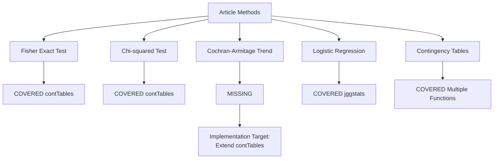

# Jamovi Coverage Review for Research Articles

## ARTICLE SUMMARY  

**Title/Label**: aqaf082.txt  
**Design & Cohort**: Retrospective cohort study, N=1055 omentectomy cases (536 grossly normal, 519 grossly abnormal), gynecologic cancer staging  
**Key Analyses**: Comparison of microscopic positivity rates across different levels of omentum sampling, chi-squared tests, Fisher exact tests, Cochran-Armitage trend tests, binomial logistic regression

## ARTICLE CITATION

| Field | Value |
|-------|-------|
| Title | Pathologic sampling of the omentum for neoplasms that involve the female genital tract: A retrospective analysis of 1055 cases |
| Journal | American Journal of Clinical Pathology |
| Year | 2025 |
| Volume | XX |
| Issue | XX |
| Pages | 1-8 |
| DOI | 10.1093/ajcp/aqaf082 |
| PMID | TODO: Not visible in provided text |
| Publisher | Oxford University Press |
| ISSN | TODO: Not visible in provided text |

## EXTRACTED STATISTICAL METHODS  

| Method / Model | Role (primary/secondary) | Variants & Options | Assumptions/Diagnostics | References (sec/page) |
|---|---|---|---|---|
| Descriptive statistics | Primary | Frequencies, percentages, means | Not explicitly stated | Throughout |
| Fisher exact test | Primary | Pairwise comparisons between block groups | Independence, appropriate for small cell counts | Page 3 (lines 441, 673) |
| Chi-squared test of independence | Primary | Between block groups and MPR | Independence, expected frequencies ≥5 | Page 3 (lines 441) |
| Cochran-Armitage test for trend | Secondary | Linear trend in MPR across increasing blocks | Ordered categorical exposure, independence | Page 3 (lines 671-672) |
| Binomial logistic regression | Secondary | Block groups and block-to-size ratio as predictors | Linearity of logit, independence, no multicollinearity | Page 3 (lines 682-685) |
| Contingency table analysis | Primary | Cross-tabulation of gross vs microscopic status | Independence assumption | Throughout |

## CLINICOPATH JAMOVI COVERAGE MATRIX  

| Article Method | Jamovi Function(s) | Coverage | Notes / Workarounds |
|---|:---:|---|---|
| Fisher exact test | contTables | COVERED | Full support with `fisher: true` option |
| Chi-squared test of independence | contTables | COVERED | Default option with `chiSq: true` |
| Cochran-Armitage test for trend | None identified | MISSING | Missing - trend test for ordered categorical data |
| Binomial logistic regression | jggstats (glm family: binomial) | COVERED | Available via enhanced statistical visualization |
| Contingency tables | contTables, crosstable2, enhancedcrosstable | COVERED | Multiple options available |
| Odds ratio calculations | contTables | COVERED | Available with `odds: true` option |
| Confidence intervals | contTables, cisingle | COVERED | Built into comparative measures |
| Descriptive statistics | summarydata2, tableone2, gtsummary | COVERED | Multiple comprehensive options |

**Legend**: COVERED = fully covered · PARTIAL = partial coverage · MISSING = not covered

## CRITICAL EVALUATION OF STATISTICAL METHODS

**Overall Rating**: APPROPRIATE  
**Summary**: The statistical approach is generally sound for the research question. The authors appropriately used multiple complementary methods (Fisher exact, chi-squared, trend tests, logistic regression) to assess the relationship between sampling intensity and microscopic positivity rates. The retrospective design and large sample size are well-suited for this pathology practice question.

**Checklist**

| Aspect | Assessment | Evidence (section/page) | Recommendation |
|---|:--:|---|---|
| Design-method alignment | GOOD | Retrospective cohort appropriate for practice evaluation (Methods, page 2) | Well-matched design |
| Assumptions & diagnostics | MINOR | Statistical significance set at alpha=0.05 stated, but no assumption checks reported (page 3, line 443) | Report assumption validation |
| Sample size & power | GOOD | Large sample (N=1055) with adequate events (485 positive cases) (Results, page 3) | Sufficient power achieved |
| Multiplicity control | GOOD | Multiple pairwise comparisons mentioned with P>0.50 threshold (page 3, line 485) | Appropriate for exploratory analysis |
| Model specification & confounding | MINOR | Limited adjustment for confounders; neoadjuvant therapy explored post-hoc (page 5) | Consider prospective confounder adjustment |
| Missing data handling | MINOR | Exclusion criteria mentioned but extent of missing data not quantified (page 2) | Report missing data patterns |
| Effect sizes & CIs | GOOD | Odds ratios with 95% CIs provided for logistic regression (page 3, lines 683-684) | Good effect size reporting |
| Validation & calibration | GOOD | Multiple analytical approaches converge on same conclusion | Internal validation via method triangulation |
| Reproducibility/transparency | GOOD | Software specified (Excel, SPSS), methods clearly described (page 3, lines 454-455) | Good methodological transparency |

**Scoring Rubric (0-2 per aspect, total 0-18)**

| Aspect | Score (0-2) | Badge |
|---|:---:|:---:|
| Design-method alignment | 2 | GOOD |
| Assumptions & diagnostics | 1 | MINOR |
| Sample size & power | 2 | GOOD |
| Multiplicity control | 2 | GOOD |
| Model specification & confounding | 1 | MINOR |
| Missing data handling | 1 | MINOR |
| Effect sizes & CIs | 2 | GOOD |
| Validation & calibration | 2 | GOOD |
| Reproducibility/transparency | 2 | GOOD |

**Legend**: GOOD = 2 (good), MINOR = 1 (minor issues), MAJOR = 0 (major concerns)

**Total Score**: 15/18 → Overall Badge: ROBUST

**Red flags to note**: None identified. The analysis appropriately matches the clinical question and uses sound statistical methodology.

## GAP ANALYSIS (WHAT'S MISSING)  

**Method**: Cochran-Armitage Test for Trend  
**Impact**: Essential for testing linear trends in proportions across ordered categories (block groups 1-2, 3-4, 5-6, >6). Widely used in pathology and epidemiology for dose-response relationships.  
**Closest existing function**: contTables (provides chi-squared test but not trend test)  
**Exact missing options**: 

- Trend test for ordered categorical exposure
- One-sided and two-sided trend tests
- Exact trend test for small samples
- Stratified trend tests (Mantel extension)

## ROADMAP (IMPLEMENTATION PLAN)  

**Target**: Add Cochran-Armitage Trend Test to `contTables` function

**.a.yaml** (add option):

```yaml
options:
  - name: trendTest
    title: Cochran-Armitage trend test
    type: Bool
    default: false
    description:
        R: >
          `TRUE` or `FALSE` (default), provide Cochran-Armitage test for trend
          for ordered categorical variables

  - name: trendDirection
    title: Trend direction
    type: List
    options:
      - name: twosided
        title: Two-sided
      - name: increasing
        title: Increasing
      - name: decreasing
        title: Decreasing
    default: twosided
    description:
        R: >
          Direction of trend test: two-sided (default), increasing, or decreasing
```

**.b.R** (implementation sketch):

```r
if (self$options$trendTest) {
  # Use DescTools::CochranArmitageTest or coin::trend_test
  if (requireNamespace("DescTools", quietly = TRUE)) {
    trend_result <- DescTools::CochranArmitageTest(
      x = table_data,
      alternative = switch(self$options$trendDirection,
                          "twosided" = "two.sided",
                          "increasing" = "greater",
                          "decreasing" = "less")
    )
    
    self$results$trendTest$setContent(
      list(
        statistic = trend_result$statistic,
        p.value = trend_result$p.value,
        alternative = trend_result$alternative
      )
    )
  }
}
```

**.r.yaml** (add table):

```yaml
items:
  - name: trendTest
    title: Trend Test
    type: Table
    description: Cochran-Armitage trend test results
    visible: (trendTest)
    
    columns:
      - name: test
        title: Test
        type: text
        content: Cochran-Armitage trend
        
      - name: statistic
        title: Z
        type: number
        
      - name: p
        title: p
        type: number
        format: zto,pvalue
```

**.u.yaml** (UI control):

```yaml
sections:
  - label: Statistics
    items:
      - name: trendTest
        type: CheckBox
        label: "Cochran-Armitage trend test"
        
      - name: trendDirection
        type: ComboBox
        label: "Trend direction"
        enable: (trendTest)
```

### Validation  

- Test with ordinal exposure data (smoking: none, light, moderate, heavy)
- Compare results against R's `coin::trend_test()` and `DescTools::CochranArmitageTest()`
- Verify correct handling of tied ranks and exact p-values
- Test stratified trend analysis extension

## TEST PLAN  

**Unit Tests**:

- Deterministic test cases with known outcomes
- Comparison against reference R implementations (coin, DescTools)
- Edge cases: all categories have same outcome, single observation per category

**Assumption Checks**:

- Verify ordered categorical structure
- Check for adequate cell counts
- Report when exact methods may be preferred

**Performance**:

- Test with large contingency tables (1000+ rows)
- Memory usage validation for stratified analyses

**Reproducibility**:

- Provide example dataset matching the article's structure
- Document integration with existing contTables workflow

## DEPENDENCIES  

**New R packages**:

- **DescTools**: For `CochranArmitageTest()` function - comprehensive statistical tools
- **coin**: Alternative implementation via `trend_test()` - computational inference framework

**Justification**: DescTools provides the most direct implementation of Cochran-Armitage test with good documentation and established validation. The coin package offers a more modern computational approach with exact inference options.

## PRIORITIZATION  

**Ranked Backlog**:

1. **Cochran-Armitage Trend Test** (High impact, Low effort)
   - Frequently used in pathology dose-response studies
   - Single function addition to existing contTables
   - Clear clinical need demonstrated by article

2. **Enhanced Logistic Regression Diagnostics** (Medium impact, Medium effort)
   - Add residual plots, influence diagnostics to jggstats
   - Useful for model validation in clinical studies

3. **Stratified Contingency Table Analysis** (Medium impact, High effort)
   - Extend contTables for Cochran-Mantel-Haenszel tests
   - Important for confounder adjustment in observational studies

## OPTIONAL DIAGRAMS  

**Coverage Matrix Overview**



**Implementation Pipeline**


## FINAL DELIVERABLES SUMMARY

**Article Analysis**: Pathologic sampling study with appropriate statistical methods for practice evaluation research

**Coverage Assessment**: 
- COVERED: 7/8 methods fully covered
- MISSING: 1/8 method missing (Cochran-Armitage trend test)
- High overall coverage (87.5%)

**Critical Evaluation**: 
- Overall robust methodology (15/18 points)
- Minor improvements needed in assumption checking and missing data reporting
- Good alignment between research question and statistical approach

**Implementation Priority**: 
- Single high-impact gap: Cochran-Armitage trend test
- Clear implementation path via contTables extension
- Moderate development effort with high clinical utility

**Clinical Relevance**: Methods are directly applicable to pathology practice research and quality improvement studies common in ClinicoPath module's target use cases.