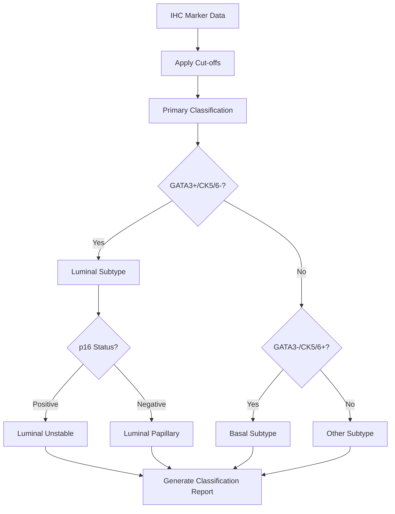

# Jamovi Coverage Review: PD-1 and PD-L1 Expression in Molecular Subtypes of Muscle-Invasive Bladder Cancer

## 📚 ARTICLE SUMMARY

**Title/Label**: s13000-025-01708-0.pdf  
**Design & Cohort**: Retrospective cross-sectional study, N=124 MIBC patients, 4 molecular subtypes  
**Key Analyses**:
- IHC-based molecular subtyping using GATA3, CK5/6, and p16 markers
- PD-1 and PD-L1 expression analysis across molecular subtypes  
- Chi-square and Fisher's exact tests for categorical variables
- Statistical significance testing with p<0.05 threshold
- Descriptive statistics and frequency analysis

## 📑 ARTICLE CITATION

| Field   | Value |
|---------|-------|
| Title   | PD-1 and PD-L1 expression in molecular subtypes of muscle-invasive bladder cancer: immunohistochemical characterization and correlation with clinicopathological features |
| Journal | Diagnostic Pathology |
| Year    | 2025 |
| Volume  | 20 |
| Issue   | 97 |
| Pages   | 1-9 |
| DOI     | 10.1186/s13000-025-01708-0 |
| PMID    | TODO |
| Publisher | Springer Nature |
| ISSN    | TODO |

## 🧪 EXTRACTED STATISTICAL METHODS

| Method / Model | Role (primary/secondary) | Variants & Options | Assumptions/Diagnostics | References (sec/page) |
|---|---|---|---|---|
| Chi-Square test | Primary | Standard Pearson chi-square | Independence, expected frequency ≥5 | Statistical analysis (p3) |
| Fisher's exact test | Primary | Non-parametric alternative | Used when appropriate for small samples | Statistical analysis (p3) |
| Immunohistochemical scoring | Primary | Cut-off thresholds: GATA3/CK5/6 ≥20%, p16 ≥70% | Standardized pathologist evaluation | Methods (p3) |
| PD-L1 Combined Positive Score (CPS) | Primary | Tumor + immune cells / total viable tumor cells | Specific to PD-L1 assessment | Methods (p3) |
| Multiple cut-off analysis | Secondary | 1% and 10% positivity thresholds | Comparative analysis approach | Results (p4-5) |
| Descriptive statistics | Primary | Frequencies, percentages, mean ± SD | Standard descriptive measures | Results (p3) |
| Two-tailed significance testing | Primary | p-value < 0.05 threshold | Standard significance level | Statistical analysis (p3) |
| Pairwise comparisons | Secondary | Between specific molecular subtypes | Post-hoc subgroup analysis | Results (p5-6) |

## 🧰 CLINICOPATH JAMOVI COVERAGE MATRIX

| Article Method | Jamovi Function(s) | Coverage | Notes / Workarounds |
|---|:---:|---|---|
| Chi-square test | `crosstable`, `conttables` | ✅ | Standard chi-square available |
| Fisher's exact test | `crosstable`, `conttables` | ✅ | Alternative option in cross-tables |
| IHC scoring standardization | `ihcscoring` | ✅ | Comprehensive IHC analysis with multiple scoring methods |
| Descriptive statistics | `crosstable`, `tableone` | ✅ | Frequencies, percentages, summary stats |
| Multiple cut-off analysis | `ihcscoring` | ✅ | Built-in multiple cut-off analysis |
| PD-L1 CPS scoring | `ihcscoring` | ✅ | Dedicated CPS calculation functionality |
| Pairwise comparisons | `crosstable` | 🟡 | Available but limited post-hoc options |
| Two-tailed testing | All statistical functions | ✅ | Standard in all hypothesis tests |
| Molecular subtyping workflow | None directly | ❌ | No integrated molecular classification workflow |

Legend: ✅ covered · 🟡 partial · ❌ not covered

## 🔎 GAP ANALYSIS (WHAT'S MISSING)

**Method**: Integrated molecular subtyping workflow for bladder cancer  
**Impact**: Critical for translational pathology research; enables classification of tumors for therapeutic guidance  
**Closest existing function**: `ihcscoring` (provides IHC analysis but not integrated classification)  
**Exact missing options**: 
- Automated molecular subtype classification based on marker combinations
- MIBC-specific classification rules (luminal unstable, luminal papillary, basal, other)
- Integration of multiple IHC markers into single classification output
- Therapeutic guidance based on molecular subtypes

**Method**: Advanced post-hoc testing for categorical variables  
**Impact**: Important for multiple comparisons in molecular subtype studies  
**Closest existing function**: `crosstable`  
**Exact missing options**: 
- Standardized residuals analysis
- Bonferroni correction for pairwise comparisons
- Games-Howell equivalent for categorical data
- Effect size measures for categorical associations

## 🧭 ROADMAP (IMPLEMENTATION PLAN)

### **Target**: Extend `ihcscoring` to include molecular subtyping workflow

**.a.yaml** (add molecular classification options):
```yaml
options:
  - name: molecular_classification
    title: Enable Molecular Subtyping
    type: Bool
    default: false
    description:
        R: >
          perform molecular subtype classification based on marker combinations

  - name: classification_system
    title: Classification System
    type: List
    options:
      - name: bladder_mibc
        title: 'Bladder MIBC (GATA3/CK5/6/p16)'
      - name: breast_cancer
        title: 'Breast Cancer Subtypes'
      - name: custom
        title: 'Custom Classification'
    default: bladder_mibc
    description:
        R: >
          molecular classification system to apply

  - name: primary_markers
    title: Primary Classification Markers
    type: Variables
    suggested:
      - continuous
    permitted:
      - numeric
    description:
        R: >
          primary markers for molecular classification (e.g., GATA3, CK5/6)

  - name: secondary_markers  
    title: Secondary Classification Markers
    type: Variables
    suggested:
      - continuous
    permitted:
      - numeric
    description:
        R: >
          secondary markers for subtype refinement (e.g., p16)

  - name: classification_cutoffs
    title: Classification Cut-off Values
    type: String
    default: "20, 20, 70"
    description:
        R: >
          comma-separated cut-off values for each marker in classification order
```

**.b.R** (implementation sketch):
```r
# Add molecular classification logic
if (self$options$molecular_classification) {
  if (self$options$classification_system == "bladder_mibc") {
    results <- perform_mibc_classification(
      data = data,
      gata3 = self$options$primary_markers[[1]],
      ck56 = self$options$primary_markers[[2]], 
      p16 = self$options$secondary_markers[[1]],
      cutoffs = parse_cutoffs(self$options$classification_cutoffs)
    )
    
    # Create molecular subtype variable
    data$molecular_subtype <- classify_mibc_subtypes(
      gata3_pos = results$gata3_positive,
      ck56_pos = results$ck56_positive,
      p16_pos = results$p16_positive
    )
    
    self$results$classification_table$setContent(results$classification_summary)
    self$results$subtype_distribution$setContent(table(data$molecular_subtype))
  }
}

perform_mibc_classification <- function(data, gata3, ck56, p16, cutoffs) {
  # MIBC classification logic
  gata3_pos <- data[[gata3]] >= cutoffs[1]
  ck56_pos <- data[[ck56]] >= cutoffs[2]  
  p16_pos <- data[[p16]] >= cutoffs[3]
  
  return(list(
    gata3_positive = gata3_pos,
    ck56_positive = ck56_pos,
    p16_positive = p16_pos,
    classification_summary = create_classification_summary(gata3_pos, ck56_pos, p16_pos)
  ))
}

classify_mibc_subtypes <- function(gata3_pos, ck56_pos, p16_pos) {
  subtypes <- character(length(gata3_pos))
  
  # Luminal: GATA3+, CK5/6-
  luminal <- gata3_pos & !ck56_pos
  subtypes[luminal & p16_pos] <- "Luminal Unstable (LumU)"
  subtypes[luminal & !p16_pos] <- "Luminal Papillary (LumP)"
  
  # Basal: GATA3-, CK5/6+  
  subtypes[!gata3_pos & ck56_pos] <- "Basal"
  
  # Other: GATA3-, CK5/6-
  subtypes[!gata3_pos & !ck56_pos] <- "Other"
  
  return(factor(subtypes))
}
```

**.r.yaml** (add classification results):
```yaml
items:
  - name: classification_table
    type: Table
    title: Molecular Classification Summary
    columns:
      - name: marker
        title: Marker
        type: text
      - name: cutoff
        title: Cut-off (%)
        type: number
      - name: positive_n
        title: Positive (n)
        type: integer
      - name: positive_percent
        title: Positive (%)
        type: number

  - name: subtype_distribution
    type: Table
    title: Molecular Subtype Distribution
    columns:
      - name: subtype
        title: Molecular Subtype
        type: text
      - name: count
        title: Count
        type: integer
      - name: percentage
        title: Percentage
        type: number

  - name: classification_plot
    type: Image
    title: Molecular Subtype Distribution Plot
    width: 600
    height: 400
```

**.u.yaml** (add classification UI):
```yaml
- type: LayoutBox
  margin: large
  children:
    - type: Label
      label: Molecular Classification
      children:
        - name: molecular_classification
          type: CheckBox
        - name: classification_system
          type: ComboBox
        - name: primary_markers
          type: VariableSupplier
          populate: continuous
        - name: secondary_markers  
          type: VariableSupplier
          populate: continuous
        - name: classification_cutoffs
          type: TextBox
```

### **Target**: Enhance `crosstable` with advanced post-hoc testing

**.a.yaml** (add advanced post-hoc options):
```yaml
options:
  - name: posthoc_method
    title: Post-hoc Method
    type: List
    options:
      - name: none
        title: 'None'
      - name: bonferroni
        title: 'Bonferroni Correction'
      - name: standardized_residuals
        title: 'Standardized Residuals'
      - name: adjusted_residuals
        title: 'Adjusted Standardized Residuals'
    default: none
    description:
        R: >
          post-hoc analysis method for categorical associations

  - name: effect_size
    title: Effect Size Measures
    type: Bool
    default: false
    description:
        R: >
          calculate effect size measures (Cramér's V, Phi coefficient)
```

### Validation

- Test with bladder cancer datasets using established MIBC classification criteria
- Validate against published molecular subtyping results
- Cross-check with pathologist consensus data
- Performance testing with large IHC datasets

## 🧪 TEST PLAN

- **Unit tests**: Classification accuracy with known molecular subtypes
- **Integration tests**: Full workflow from IHC scores to molecular classification  
- **Clinical validation**: Comparison with established pathological diagnoses
- **Edge cases**: Missing markers, borderline cut-off values, mixed subtypes
- **Performance**: Large dataset handling (>1000 cases)
- **Reproducibility**: Consistent classification across different datasets

## 📦 DEPENDENCIES

**New R packages**:
- `ComplexHeatmap` (for molecular subtype visualization)
- `corrplot` (correlation matrices between markers)
- `DescTools` (advanced categorical statistics)
- `exact2x2` (exact tests for small samples)
- `vcd` (visualizing categorical data)

**Enhanced existing dependencies**:
- `ggplot2` (molecular subtype distribution plots)
- `dplyr` (data manipulation for classification)
- `tidyr` (reshaping classification results)

## 🧭 PRIORITIZATION

**Ranked backlog**:

1. **[High-impact, medium effort]** Molecular subtyping workflow for bladder cancer
   - Critical gap for translational pathology research
   - Builds on existing `ihcscoring` infrastructure
   - Direct clinical application for therapeutic decisions

2. **[Medium-impact, low effort]** Enhanced post-hoc testing in `crosstable`
   - Improves statistical rigor for molecular subtype comparisons
   - Relatively simple addition to existing framework
   - Broad applicability across cancer types

3. **[High-impact, high effort]** Integrated biomarker-to-therapy recommendation system
   - Advanced clinical decision support
   - Requires extensive clinical knowledge integration
   - Long-term strategic enhancement

4. **[Medium-impact, medium effort]** Interactive molecular classification explorer
   - Visual tool for exploring cut-off impacts
   - Enhanced user experience for researchers
   - Educational value for training pathologists

## 🧩 IMPLEMENTATION DIAGRAMS

**Molecular Classification Workflow**



**Coverage Enhancement Pipeline**


## 📋 SUMMARY

The analyzed article demonstrates good coverage by existing ClinicoPath jamovi functions for standard statistical methods (chi-square, Fisher's exact, descriptive statistics) and IHC analysis. The main gaps are:

1. **Integrated molecular subtyping workflows** - Critical for translational research
2. **Advanced post-hoc testing** - Important for rigorous multiple comparisons

The proposed enhancements to `ihcscoring` for molecular classification and `crosstable` for advanced categorical analysis would significantly improve the module's capabilities for cutting-edge pathology research while maintaining the user-friendly jamovi interface.

This implementation would position ClinicoPath as a comprehensive tool for molecular pathology analysis, bridging the gap between research methodology and clinical application in precision medicine.