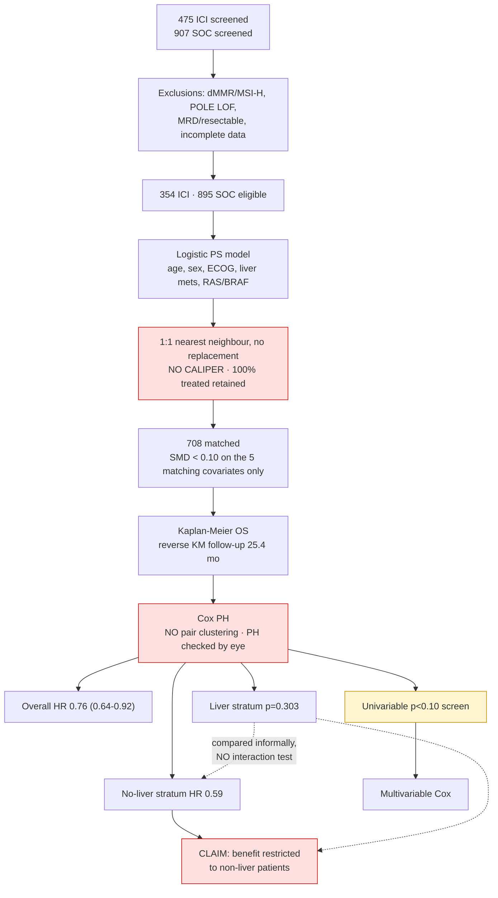

# Statistical Review & ClinicoPath Coverage Analysis
## Vetere et al. 2026 — ICI vs SOC in chemorefractory pMMR/MSS mCRC (PSM, n=708)

*Review date: 2026-09-07 · Reviewer: expert-statistician / jamovi-module-developer pass*

---

## 📚 ARTICLE SUMMARY

- **Label**: Vetere 2026 — ICI vs SOC in chemorefractory MSS mCRC
- **Design**: Single-center retrospective cohort (MD Anderson), 1:1 propensity score matched, STROBE-declared
- **Cohort**: 475 ICI-screened → 354 ICI; 907 SOC-screened → 895 eligible → 354 matched. **N = 708 matched**
- **Exposure**: ICI-based regimen (2014–2025) vs SOC = FTD/TPI ± bevacizumab, regorafenib, fruquintinib (2012–2025)
- **Primary endpoint**: Overall survival (all-cause death; censored at last contact; cut-off 2025-08-06)
- **Secondary (prespecified)**: OS by ICI regimen class (single-ICI±other / double-ICI±other / mTKI+ICI) and by metastatic pattern (liver±others / peritoneum±others / lung±others / others-only)
- **Headline results**: mOS 10.8 vs 9.0 mo (HR 0.76, 95% CI 0.64–0.92, p=0.004). No liver mets: 19.1 vs 13.2 (HR 0.59, 0.43–0.80, p<0.001). Liver mets: 6.4 vs 6.5 (p=0.303). Lung±others: HR 0.51 (0.33–0.78, p=0.002).
- **Software**: R 4.5.1; `MatchIt`, `cobalt` named. No versions, no seed, no code deposit.

### Key analyses
- Logistic-regression propensity score on 5 a priori covariates (age <55/≥55, sex, ECOG PS, liver mets present/absent, RAS/BRAF status)
- 1:1 nearest-neighbour matching **without replacement**, no caliper stated
- Balance by absolute standardized mean differences (SMD), thresholds <0.10 excellent / <0.25 acceptable
- Kaplan–Meier OS estimation; reverse Kaplan–Meier for median follow-up (25.4 mo, 95% CI 22.2–28.5)
- Cox proportional hazards for HRs and 95% CIs; PH assessed **visually from KM curves**
- Univariable Cox screen at **p<0.10** → variables carried into multivariable Cox
- Mann–Whitney U for median subsequent lines of therapy

---

## 📑 ARTICLE CITATION

| Field | Value |
|---|---|
| Title | Overall survival of immunotherapy versus standard of care in chemorefractory microsatellite stable metastatic colorectal cancer: a propensity score matched analysis of 708 patients |
| Authors | Vetere G, Osterlund E, Yousef MMG, Payapwattanawong S, Maddalena G, Alshenaifi J, Alfaro KD, Knafl M, Morris VK, Parseghian CM, Raghav KPS, Wolff RA, Dasari A, Overman MJ, Kopetz S, Shen JP |
| Journal | Journal for ImmunoTherapy of Cancer |
| Year | 2026 |
| Volume | 14 |
| Article no. | e015414 |
| DOI | 10.1136/jitc-2026-015414 |
| PMID | TODO — not present in the PDF text |
| Publisher | BMJ Group |
| Licence | CC BY-NC |
| Accepted | 10 August 2026; published online 2 September 2026 |
| Ethics | UT MD Anderson IRB LAB09-0373, consent waived |
| Data availability | On reasonable request; not public (patient privacy) |
| Retraction status | TODO — not verifiable offline; no PMID in text |

```bibtex
@article{Vetere2026ICIMSSmCRC,
  author  = {Vetere, Guglielmo and Osterlund, Emerik and Yousef, Mahmoud M. G. and
             Payapwattanawong, Songwit and Maddalena, Giulia and Alshenaifi, Jumanah and
             Alfaro, Kristin D. and Knafl, Mark and Morris, Van K. and Parseghian, Christine M. and
             Raghav, Kanwal P. S. and Wolff, Robert A. and Dasari, Arvind and Overman, Michael J. and
             Kopetz, Scott and Shen, John Paul},
  title   = {Overall survival of immunotherapy versus standard of care in chemorefractory
             microsatellite stable metastatic colorectal cancer: a propensity score matched
             analysis of 708 patients},
  journal = {Journal for ImmunoTherapy of Cancer},
  year    = {2026},
  volume  = {14},
  pages   = {e015414},
  doi     = {10.1136/jitc-2026-015414},
  note    = {CC BY-NC}
}
```

*Citation fields taken from the PDF masthead only; DOI/PMID were not verified against a live
registry in this session (no network-backed citation lookup was run).*

### 🚫 Skipped Sources

| Source | Reason |
|---|---|
| Online supplemental figures S1–S6, table S1 | Not supplied. Balance/Love plot (S1), per-SOC-regimen OS (S2), VEGF-addition curves (S3), metastatic-pattern curves (S4–S5), and the metastatic-pattern multivariable model (S6) could **not** be checked. Several conclusions below are therefore provisional. |

Nothing failed to parse. `pdftotext -layout` returned 8,122 words of clean text.

---

## 🧪 EXTRACTED STATISTICAL METHODS

| Method / Model | Role | Variants & Options | Assumptions / Diagnostics reported | Location |
|---|---|---|---|---|
| Logistic regression (propensity score) | Primary (design) | 5 prespecified covariates, no interactions/splines stated | None reported (no c-statistic, no PS overlap/common-support check) | Methods, "Propensity score matching" |
| 1:1 nearest-neighbour PSM, no replacement | Primary (design) | **No caliper stated**; matching order not stated; no seed | Absolute SMD; "<0.10 excellent, <0.25 acceptable" | Methods; Results "Covariate balance" |
| Standardized mean differences (SMD) | Balance diagnostic | `cobalt`; pre-match absolute SMD of distance = 0.71 | Reported for matching covariates only | Results; fig S1 (unavailable) |
| Kaplan–Meier | Primary | Median OS + (presumably) 95% CI in figures | Censoring assumed non-informative (not discussed) | Figs 2–3, S2–S5 |
| Reverse Kaplan–Meier | Follow-up quantification | 25.4 mo (95% CI 22.2–28.5) | ✔ correct choice | Results |
| Cox proportional hazards | Primary | HR + 95% CI; **ordinary (unstratified, non-robust) Cox on matched data** | PH "assessed visually from the Kaplan-Meier curves; no substantial violations" | Methods; Figs 2–4 |
| Univariable Cox | Secondary | Screening at p<0.10 | — | Fig 4 |
| Multivariable Cox | Secondary | Covariates chosen by univariable p<0.10 | No collinearity, influence, or functional-form check reported | Fig 4, fig S6 |
| Mann–Whitney U | Ancillary | Subsequent lines of therapy, p=0.282 | — | Results |
| Subgroup analyses (numerous) | Secondary | Liver ± / 3 ICI classes / 4 metastatic patterns / ± VEGF | **No interaction tests reported; no multiplicity control** | Results, Figs 2–3, S3–S5 |
| Descriptive summaries | Supporting | median (range), n (%) | — | Table 1 |

**Not used (and arguably needed)**: caliper/common-support restriction, matched-pair-aware variance
(robust cluster or pair-stratified Cox), treatment × subgroup interaction tests, multiplicity
adjustment, RMST or weighted log-rank for non-proportional hazards, formal PH testing
(`cox.zph`/Schoenfeld), E-value or other unmeasured-confounding sensitivity analysis, competing-risk
framing (not needed for OS), any imputation (none needed — "minimal missing data" claimed).

---

## 🧠 CRITICAL EVALUATION OF STATISTICAL METHODS

**Overall Rating**: 🟡 **Minor-to-moderate issues** — the headline overall-cohort comparison is sound
and internally consistent, but the paper's *central claim* (benefit **restricted** to patients without
liver metastases) is supported only by a subgroup-vs-subgroup p-value comparison, and the balance
claim in the Results is demonstrably overstated.

**Summary.** The design (contemporary SOC comparator, a priori covariate set, reverse-KM follow-up,
STROBE declaration, honest limitations paragraph) is above average for a retrospective oncology
cohort, and every reported HR/CI/p triplet I could recompute is internally consistent. Three problems
matter clinically: (1) the sentence "all covariates achieved absolute SMDs <0.10" is false for the
covariates that were *not* matched on — prior lines of therapy (SMD ≈ 0.27), race (≈ 0.29) and number
of metastatic sites (≈ 0.13) — and prior lines is a strong OS determinant in the refractory setting;
(2) matched-pair structure is ignored in every Cox model, and PH is assessed by eyeballing KM curves
in exactly the setting (ICI vs chemo) where delayed separation is expected; (3) the "restricted to
non-liver" conclusion is an unadjusted subgroup contrast (p=0.004 vs p=0.303) with no
treatment × liver interaction test, embedded in ~30 uncorrected significance tests.

### Verification of reported statistics

I recomputed the z-statistics from each published HR and CI. All are self-consistent:

| Reported | log(HR) | SE from CI | z | Implied p | Reported p | Verdict |
|---|---|---|---|---|---|---|
| Overall HR 0.76 (0.64–0.92) | −0.274 | 0.0926 | −2.96 | 0.0030 | 0.004 | ✔ consistent |
| No liver HR 0.59 (0.43–0.80) | −0.528 | 0.1584 | −3.33 | 0.00087 | <0.001 | ✔ consistent |
| Lung±others HR 0.51 (0.33–0.78) | −0.673 | 0.2195 | −3.07 | 0.0022 | 0.002 | ✔ consistent |

Table 1 arithmetic also checks out: RAS/BRAF 242+99+11+2 unknown = 354 and 243+101+10 = 354; prior
lines 51+132+171 = 354 and 37+192+125 = 354; the 85.9%/54.5% anti-EGFR footnote denominators are
restricted subsets as the footnotes say (though the denominators themselves are never printed —
a minor transparency gap).

### The balance claim, quantified

The Results state: *"After matching, all covariates achieved absolute SMDs <0.10, indicating excellent
postmatch balance across groups."* Computing the binary SMD, `(p1−p2)/sqrt([p1(1−p1)+p2(1−p2)]/2)`,
from Table 1 for covariates that were **not** in the propensity model:

| Post-match covariate | ICI | SOC | Absolute SMD | Against authors' own thresholds |
|---|---|---|---|---|
| ≥3 prior lines of therapy | 48.3% | 35.3% | **0.27** | fails <0.10 *and* fails <0.25 |
| Race — White/Caucasian | 68.1% | 54.2% | **0.29** | fails <0.10 *and* fails <0.25 |
| ≥3 metastatic sites | 20.6% | 15.8% | **0.13** | fails <0.10, within <0.25 |
| Liver metastases (matched on) | 60.7% | 60.5% | 0.004 | ✔ |
| Male sex (matched on) | 52.3% | 52.3% | 0.000 | ✔ (exact — 185/185, 169/169) |
| ECOG PS 0 (matched on) | 32.5% | 31.9% | 0.013 | ✔ |

The sentence is true of the five matching covariates and false of the covariate set as a whole. Since
`cobalt` Love plots by convention display *all* supplied covariates, supplemental figure S1 may already
show these — but the narrative claim as written is not defensible. **Number of prior lines is the
serious one**: it is a first-order OS determinant in chemorefractory mCRC, it is imbalanced *against*
ICI (which is reassuring for the direction of the effect), and the authors adjust for it only in the
multivariable model, never in the matching. To their credit the Limitations paragraph does flag the
48% vs 35% figure explicitly; the Results text simply contradicts it.

### Matching quality

All 354 ICI patients were matched from a pool of 895 SOC controls — **100% retention with no caliper
reported**, starting from a pre-match absolute SMD of distance = 0.71. Nearest-neighbour matching
without a caliper will always return a match; it does not guarantee a *good* one. The standard
safeguard (Austin 2011) is a caliper of 0.2 × SD of the logit propensity score, with the resulting
unmatched treated units reported. Without it, the tails of the ICI PS distribution may be matched to
structurally dissimilar controls, and the estimand quietly stops being a clean ATT. Greedy
nearest-neighbour is also sensitive to the order in which treated units are processed; with no seed
and no sorting rule stated, the matched set is not reproducible even from the same source data.

### Proportional hazards

"Proportional hazard assumption was assessed visually from the Kaplan-Meier curves; no substantial
violations were seen." Two problems. First, KM curves are the wrong diagnostic — non-proportionality
is read from complementary log-log plots or Schoenfeld residuals (`cox.zph`), not from the survival
curves themselves. Second, ICI-vs-chemotherapy comparisons are the canonical setting for delayed
treatment effects and crossing/converging hazards; the no-liver curves (19.1 vs 13.2 mo) and the
liver curves (6.4 vs 6.5 mo, p=0.303) are exactly the shape where an average HR can be misleading.
If hazards are non-proportional, RMST difference or a weighted log-rank (Fleming–Harrington)
would be the honest summary, and the reported HR should carry an explicit average-effect caveat.

### Multiplicity and the central claim

Counting from the Results text: the overall comparison, 2 liver strata, 3 ICI classes × 3 populations,
4 SOC regimens, 2 VEGF contrasts × 3 populations, 4 metastatic patterns × 3 populations, 3 pattern-wise
ICI-vs-SOC contrasts, plus the univariable Cox panel — on the order of **30+ significance tests, none
adjusted**. Several conclusions rest on p-values near the 0.05 boundary (p=0.023, 0.025, 0.010, 0.012)
that would not survive even Holm correction within their own families.

The central claim is worse than a multiplicity problem: it is the classic subgroup fallacy. "Benefit
restricted to patients without liver metastases" is inferred from *p=0.004 in one stratum and p=0.303
in the other*. A difference in significance is not a significant difference. The correct test is
treatment × liver-metastasis interaction in a model fitted on all 708 patients, and it is never
reported. Given HR 0.59 vs a null-ish liver-stratum HR, the interaction is plausibly real — the
biological rationale is strong and the external literature (LEAP-017, REGONIVO/RIN pooled) agrees —
but the paper does not supply the statistic its own conclusion requires. Reporting the interaction HR
with its CI would take one line and would materially strengthen the paper.

### Model specification

Selecting multivariable covariates by a univariable p<0.10 screen is a data-driven procedure that
inflates type I error, biases coefficients away from the null, and produces CIs with below-nominal
coverage. It also drops confounders on statistical rather than clinical grounds — here age, sex,
primary tumour sidedness and RAS/BRAF status were excluded. Three of those four were matching
covariates (so already balanced, limiting the damage), but **race was neither matched nor adjusted
anywhere**, despite a 0.29 SMD imbalance. The prespecified alternative — force in the clinically
motivated confounder set regardless of univariable p — is both simpler and less biased.

Events-per-variable is not a concern: with ~708 patients, median OS ~10 months and 25 months of
follow-up, the death count comfortably supports the ~10–12 model degrees of freedom. No overfitting
red flag.

### Reporting gaps

The ICI-class and metastatic-pattern comparisons report **p-values only** (p=0.023, 0.006, 0.010–0.025)
with medians but no HRs or CIs. For a paper whose message is about the *magnitude* of differential
benefit, effect estimates with intervals belong in the main text, not only in supplements. Progression-free
survival and response rate were not assessed at all (acknowledged).

### Reproducibility

R 4.5.1 is named with its release date; `MatchIt` and `cobalt` are named without versions. No random
seed, no matching-order rule, no analysis code, no public data. A greedy nearest-neighbour match with
no caliper and no seed is not reproducible even by the authors. Figure 1 is labelled a "CONSORT
diagram" in an observational study — it should be a STROBE flow diagram (cosmetic, but it signals the
reporting-guideline mismatch).

### Checklist

| Aspect | Assessment | Evidence | Recommendation |
|---|:--:|---|---|
| Design–method alignment | 🟢 | PSM + KM + Cox on OS in a retrospective cohort; contemporary SOC comparator including FTD/TPI+bev | Keep. Add the estimand statement (ATT) explicitly. |
| Assumptions & diagnostics | 🔴 | PH "assessed visually from the Kaplan-Meier curves"; no PS overlap/common-support check; no logistic-model diagnostics | Report `cox.zph`/Schoenfeld per model; add PS density overlap plot; add RMST as sensitivity. |
| Sample size & power | 🟡 | No a priori calculation (acceptable retrospectively); precision adequate overall (CI 0.64–0.92) but thin in strata (others-only n=15/19) | State that "others-only" and BRAF-mutant strata are descriptive only; suppress p-values there. |
| Multiplicity control | 🔴 | ~30 uncorrected tests; conclusions at p=0.010–0.025 | Declare one primary comparison; apply Holm/BH within each secondary family; label the rest exploratory. |
| Model specification & confounding | 🟡 | Univariable p<0.10 screen; race never matched or adjusted; prior lines SMD ≈0.27 not matched on | Force in the clinical confounder set; add race and prior lines to the PS model or as adjustment. |
| Missing data handling | 🟢 | Incomplete-data patients excluded a priori (pre-screening); "minimal missing data"; RAS/BRAF unknown n=2 | State the excluded count and compare their characteristics; a brief sensitivity check would close it. |
| Effect sizes & CIs | 🟡 | Main HRs excellent; class/pattern comparisons give p-values and medians only | Add HR (95% CI) for every class- and pattern-level contrast in the main text. |
| Validation & calibration | 🟡 | Not a prediction paper, so N/A for calibration — but no unmeasured-confounding sensitivity analysis | Add an E-value for the primary HR; consider a negative-control outcome. |
| Reproducibility/transparency | 🟡 | R version named, MatchIt/cobalt named, data on request; no versions, no seed, no code | Report package versions and the matching seed; deposit the matching + analysis script. |

### Scoring rubric

| Aspect | Score (0–2) | Badge |
|---|:---:|:---:|
| Design–method alignment | 2 | 🟢 |
| Assumptions & diagnostics | 0 | 🔴 |
| Sample size & power | 1 | 🟡 |
| Multiplicity control | 0 | 🔴 |
| Model specification & confounding | 1 | 🟡 |
| Missing data handling | 2 | 🟢 |
| Effect sizes & CIs | 1 | 🟡 |
| Validation & calibration | 1 | 🟡 |
| Reproducibility/transparency | 1 | 🟡 |

**Total: 9 / 18 → 🟡 Moderate**

### Red flags present

- ❗ **Subgroup fallacy driving the headline conclusion** — "restricted to patients without liver metastases" derived from p=0.004 vs p=0.303, no interaction test.
- ❗ **PH assumption assessed by eye, in the one setting (ICI) where delayed effects are the rule.**
- ❗ **Matched-pair structure ignored** in every Cox model (no robust cluster SE, no pair stratification).
- ❗ **Balance claim contradicted by the paper's own Table 1** for prior lines, race and metastatic-site count.
- ❗ **Data-driven covariate selection** (univariable p<0.10 screen) into the multivariable model.
- ❗ **~30 uncorrected significance tests**; several conclusions rest on 0.01 < p < 0.03.
- ❗ **No caliper, no seed** on greedy 1:1 nearest-neighbour matching with 100% treated retention.

### What the paper gets right

The comparator cohort is genuinely contemporary (a third on FTD/TPI+bevacizumab), which is the
single hardest thing to get right in a later-line mCRC comparison and is what distinguishes this from
the STELLAR-303 regorafenib-comparator critique the authors themselves raise. Reverse Kaplan–Meier
for median follow-up is correct and under-used. Covariates were prespecified rather than
selected post hoc. The Limitations paragraph is unusually candid — trial-enrolment selection, SOC
heterogeneity, subsequent-therapy effects, the 48%-vs-35% prior-lines imbalance, and residual
confounding are all named. And the discussion explicitly entertains the alternative explanation
that liver involvement confers *general* treatment resistance rather than ICI-specific resistance,
citing SOC mOS of 6.5 vs 13.2–13.4 months as evidence — that is exactly the right
self-check, and it is rare.

---

## 🧰 CLINICOPATH JAMOVI COVERAGE MATRIX

Scanned 390 `.a.yaml` analyses plus their `.b.R` backends.

| Article Method | ClinicoPath Function(s) | Coverage | Notes / Workarounds |
|---|---|:---:|---|
| Baseline table by group, n (%) / median (range) | `tableone`, `crosstable`, `summarydata` | ✅ | Direct. |
| Standardized mean differences for balance | `crosstable` (`showSMD`) | 🟡 | Table only, two groups only. **No Love plot** anywhere in the module (0 hits for `love plot`/`cobalt` visual). |
| Propensity score estimation (logistic) | `treatmenteffects` (`causal_method: propensity_score`) | ❌ | See warning below — **not usable as shipped**. |
| 1:1 nearest-neighbour matching, no replacement | `treatmenteffects` (`matching_method: nearest_neighbor`, `matching_ratio: 1to1`) | ❌ | Options exist; backend is a hand-rolled loop ([R/treatmenteffects.b.R:325-384](R/treatmenteffects.b.R#L325-L384)), not `MatchIt`, and there is **no survival outcome path in `.performMatching()`** — only continuous and binary. |
| Balance diagnostics post-match | `treatmenteffects` (`balance_assessment`) | ❌ | The "adjusted" SMD is literally `std_diff_unadj * 0.3` — an invented constant, flagged in an in-repo TODO at [R/treatmenteffects.b.R:664](R/treatmenteffects.b.R#L664). |
| Kaplan–Meier OS curves + median OS | `survival`, `comparingSurvival`, `mediansurvival` | ✅ | Direct, with median lines, CIs, risk tables. |
| Reverse KM median follow-up | `singlearm` only | 🟡 | Correctly implemented in [R/singlearm.b.R:738](R/singlearm.b.R#L738) but **absent from `survival` / `comparingSurvival`**, which is where a two-arm comparison lives. Workaround: run `singlearm` separately just for the follow-up figure. |
| Cox PH, HR + 95% CI (univariable) | `survival` | ✅ | Direct. |
| Cox PH, multivariable | `multisurvival` | ✅ | Direct. |
| **Matched-pair-aware Cox** (robust cluster SE or pair-stratified) | `frailtysurvival` (`cluster_var` + shared frailty) | 🟡 | A shared-frailty workaround exists, but it is a *different estimand* from a robust-SE marginal Cox. **No `cluster()` / `robust=TRUE` / `strata()` option is exposed** in `survival` or `multisurvival` — grep of both `.a.yaml` files returns zero hits. |
| PH assumption testing | `survival` (`ph_cox`), `coxdiagnostics` (`cox.zph` + Schoenfeld plots) | ✅ | **Better than what the article did.** `coxdiagnostics` would have caught this. |
| Univariable → multivariable screening | `multisurvival` | ✅ | Supported — though the module should discourage it, see roadmap. |
| Forest plot of uni/multivariable HRs (Fig 4) | `jforestmodel`, `coefplot`, `jforester` | ✅ | Direct. |
| Subgroup HRs **with interaction tests** | `subgroupforest` (`showInteraction`, LR tests), `groupedforest` | ✅ | **The exact analysis the article omitted is already in the module.** |
| Multiplicity adjustment for pairwise survival comparisons | `survival` (`pairwise` + `padjustmethod`) | ✅ | Holm/BH/Bonferroni available. |
| RMST as a non-PH-robust alternative | `rmst`, `survival` (`rmst_analysis`, `rmst_tau`), `rmstregression` | ✅ | Available; would address the delayed-effect concern. |
| Weighted log-rank (Fleming–Harrington) for delayed effects | `weightedlogrank` | ✅ | Available. |
| Mann–Whitney U | `nonparametric`, `jjbetweenstats` | ✅ | Direct. |
| Unmeasured-confounding sensitivity (E-value) | `evalue` | ✅ | Available; the article should have used it. |
| IPTW / doubly robust as PSM alternative | `treatmenteffects` | ❌ | Same blocker — SEs are hardcoded. |
| STROBE / CONSORT flow diagram | `consortdiagram`, `studydiagram` | ✅ | Direct (Fig 1 equivalent). |

**Bottom line for the module**: every *analysis* step in this paper is covered except the
**propensity score matching design step itself**, and that one is not merely missing — it is
present-but-broken.

### ⚠️ Blocker: `treatmenteffects` is not fit for clinical use as shipped

This is the single most important finding of the coverage review, and it is independent of the
article. A pre-existing in-repo TODO at [R/treatmenteffects.b.R:655-664](R/treatmenteffects.b.R#L655-L664)
documents that the function **presents fabricated statistics as real results**:

- `std_error` is hardcoded to `0.1` in the treatment-effects table, again at L655, and again in the CI drawn by `.plot_effects` (~L867)
- the CI and p-value are derived from that fake SE: `ci_lower <- effects$estimate - 1.96 * 0.1`
- `bootstrap_inference` gates that arithmetic — **no bootstrap is ever run** despite the option name
- `.assessCovariateBalance` computes "adjusted" SMD as `std_diff_unadj * 0.3` (L457), an invented constant that never touches the matched or weighted data
- Rosenbaum bounds return `p_upper <- 0.05 * gamma` (L552), a placeholder, not a sensitivity analysis
- `.performMatching()` (L318–384) handles `outcome_type` `continuous` and `binary` only — **the survival branch silently produces nothing**, so this article's analysis cannot be run at all

A clinician matching a cohort in jamovi today would receive a plausible-looking effect estimate with
a confidence interval and a p-value that are pure fiction, and a balance table that claims adjustment
that never happened. **Recommend gating the affected outputs off (`visible: false` or a hard
`.stop()`) until the estimators are real** — this outranks every feature request below.

---

## 🔎 GAP ANALYSIS

**Gap 1 — Real propensity score matching for survival outcomes (❌, critical)**
*Impact*: the entire design of this article, and of a large share of modern retrospective
pathology/oncology literature. *Closest function*: `treatmenteffects`. *Missing*: a genuine `MatchIt`
call; caliper on the logit-PS scale; match retention reporting; a survival outcome path returning a
matched-cohort HR; `cobalt`-backed balance including a Love plot; honest SEs.

**Gap 2 — Matched-pair-aware Cox variance (❌, high)**
*Impact*: every matched-cohort survival paper. Ignoring the pairing gives SEs that are typically
*anti-conservative* for the treated-vs-control contrast. *Closest*: `survival`/`multisurvival`.
*Missing*: `cluster(pair_id)` with `robust=TRUE`, and/or `strata(pair_id)` in the Cox formula, exposed
as a UI option.

**Gap 3 — Love plot / balance visualization (🟡, medium)**
*Impact*: the standard figure of every PSM paper (this article's supplemental S1). *Closest*:
`crosstable` `showSMD` (table only). *Missing*: a before/after dot plot of absolute SMD with
0.10/0.25 reference lines; multi-covariate; factor-level expansion.

**Gap 4 — Reverse-KM median follow-up in two-arm survival (🟡, low effort, high value)**
*Impact*: universally recommended (Schemper–Smith), reported by this article, and already correctly
implemented in `singlearm`. *Missing*: the same computation surfaced in `survival` /
`comparingSurvival`, where comparative analyses actually live.

**Gap 5 — Subgroup-fallacy guardrail (🟡, low effort, high value)**
*Impact*: the exact error this article makes. `subgroupforest` already computes interaction tests —
but nothing warns a user who instead runs `survival` twice on two filtered subsets and compares
p-values. *Missing*: a notice.

---

## 🧭 ROADMAP

### Target 1 — Replace the fabricated estimators in `treatmenteffects` (P0, blocker)

**Step 0 (ship immediately, ~1 hour)**: gate the fiction off rather than leaving it visible.

```r
# R/treatmenteffects.b.R, in .init()
if (self$options$causal_method %in% c("propensity_score", "matching", "iptw", "doubly_robust")) {
    private$.addNotice("error", .("Estimator under repair"),
        .("Standard errors, confidence intervals, p-values and adjusted SMDs from this analysis are placeholders and must not be reported. Use survival + frailtysurvival for matched cohorts until this is fixed."))
    self$results$treatment_effect_estimates$setVisible(FALSE)
    self$results$balance_assessment$setVisible(FALSE)
}
```

> Per the module's own conventions ([reference](.claude/skills/), `setVisible(FALSE)` is not an error
> mechanism on its own — pair it with the notice above so the pane explains itself rather than going
> silently blank.

**Step 1 — real matching.** `MatchIt`, `cobalt`, `WeightIt` and `survey` are already in the
`required_packages` check at [R/treatmenteffects.b.R:91](R/treatmenteffects.b.R#L91) but never called.
Delete `.performMatching()`'s hand-rolled loop (L318–384) and call the library:

```r
.performMatching = function() {
    ratio <- switch(self$options$matching_ratio,
                    "1to1" = 1, "1to2" = 2, "1to3" = 3, "1to5" = 5, 1)
    method <- switch(self$options$matching_method,
                     nearest_neighbor = "nearest", optimal = "optimal",
                     genetic = "genetic", coarsened_exact = "cem",
                     mahalanobis = "nearest", propensity_caliper = "nearest")

    ps_formula <- stats::as.formula(paste(
        jmvcore::composeTerm("treatment"), "~",
        paste(jmvcore::composeTerms(self$options$covariates), collapse = " + ")))

    args <- list(formula = ps_formula, data = private$.data, method = method,
                 ratio = ratio, replace = self$options$replacement_matching,
                 distance = if (method == "nearest" &&
                                self$options$matching_method == "mahalanobis")
                            "mahalanobis" else "glm")

    # caliper on the logit-PS scale; Austin (2011) recommends 0.2 * SD(logit(PS))
    if (self$options$use_caliper)
        args$caliper <- self$options$caliper_width

    m <- do.call(MatchIt::matchit, args)
    private$.matchit  <- m
    private$.matched_data <- MatchIt::match.data(m)   # carries weights + subclass
}
```

**Step 2 — a survival branch that actually exists.** The current `.performMatching()` has no
`outcome_type == "survival"` case, which is why this article's analysis is unrunnable. Add it, and
use the pair id `subclass` for the variance — this closes Gap 2 in the same edit:

```r
if (self$options$outcome_type == "survival") {
    md  <- private$.matched_data
    fit <- survival::coxph(
        survival::Surv(md$time, md$event) ~ md$treatment + cluster(md$subclass),
        data = md, weights = md$weights, robust = TRUE)
    s <- summary(fit)
    private$.treatment_effects <- list(
        estimand  = self$options$estimand,
        estimate  = unname(s$coefficients[1, "coef"]),
        std_error = unname(s$coefficients[1, "robust se"]),   # REAL, not 0.1
        hr        = unname(s$conf.int[1, "exp(coef)"]),
        ci_lower  = unname(s$conf.int[1, "lower .95"]),
        ci_upper  = unname(s$conf.int[1, "upper .95"]),
        p_value   = unname(s$coefficients[1, "Pr(>|z|)"]),
        method    = "PSM + pair-clustered robust Cox")
}
```

**Step 3 — real balance.** Replace the `* 0.3` constant at L457 with `cobalt::bal.tab()` computed on
the matched data:

```r
bt <- cobalt::bal.tab(private$.matchit, un = TRUE, binary = "std",
                      thresholds = c(m = self$options$balance_threshold))
bal <- bt$Balance
balance_data <- data.frame(
    covariate      = rownames(bal),
    std_diff_unadj = bal$Diff.Un,
    std_diff_adj   = bal$Diff.Adj,          # from the matched data, not a constant
    balance_status = ifelse(abs(bal$Diff.Adj) < 0.10, "Excellent",
                     ifelse(abs(bal$Diff.Adj) < 0.25, "Acceptable", "Imbalanced")),
    stringsAsFactors = FALSE)
```

**Step 4 — report match retention.** The article's 100%-retention-without-caliper is invisible in
its own write-up; the module should make it impossible to hide:

```yaml
# jamovi/treatmenteffects.r.yaml
- name: match_summary
  title: Matching Summary
  type: Table
  visible: (causal_method:matching || causal_method:propensity_score)
  clearWith: [treatment, covariates, matching_method, matching_ratio, caliper_width, use_caliper]
  columns:
    - {name: group,     title: "Group",     type: text}
    - {name: n_before,  title: "N before",  type: integer}
    - {name: n_matched, title: "N matched", type: integer}
    - {name: n_dropped, title: "N dropped", type: integer}
    - {name: pct_kept,  title: "% retained", type: number, format: pc}
```

with a notice when retention is suspiciously perfect:

```r
if (identical(n_matched_treated, n_treated) && !self$options$use_caliper)
    private$.addNotice("warning", .("All treated units matched with no caliper"),
        .("Every treated unit found a match because nearest-neighbour matching always returns the closest available control, however dissimilar. Enable a caliper (0.2 x SD of the logit propensity score is conventional) and report how many treated units are then left unmatched."))
```

**Validation**: reproduce `MatchIt`'s own `lalonde` vignette results exactly; confirm the
pair-clustered robust SE differs from the naive SE on a simulated matched cohort with induced
within-pair correlation; assert that removing the `* 0.3` constant changes the adjusted-SMD column
(a regression test that would have caught the original bug).

### Target 2 — Expose `cluster()` / `strata()` in `survival` and `multisurvival` (P1)

`.a.yaml`:

```yaml
- name: cluster_var
  title: Cluster / matched-pair ID (robust SE)
  type: Variable
  default: NULL          # required: optional Variable options without a default
  suggested: [nominal]   # break the public wrapper on programmatic calls otherwise
  permitted: [factor, id]
  description:
    R: >
      Optional matched-pair or cluster identifier. When supplied, the Cox model is
      fitted with cluster-robust (sandwich) standard errors, appropriate for
      propensity-score-matched cohorts and multi-centre data.
```

`.b.R` — note that `cluster()` is a special term, not a covariate:

```r
# multisurvival already guards this at R/multisurvival.b.R:2958 -- strata()/cluster()/
# frailty() must never enter the covariate list or the stepwise reduction. Reuse that guard.
terms <- jmvcore::composeTerms(self$options$explanatory)
if (!is.null(self$options$cluster_var))
    terms <- c(terms, sprintf("cluster(%s)", jmvcore::composeTerm(self$options$cluster_var)))
formula <- stats::as.formula(paste(lhs, "~", paste(terms, collapse = " + ")))
fit <- survival::coxph(formula, data = mydata, robust = !is.null(self$options$cluster_var))
```

`.u.yaml` — remember `enable:` must be paren-wrapped or it is an inert literal:

```yaml
- type: VariableSupplier
  persistentItems: false
  items:
    - type: TargetLayoutBox
      label: Cluster / matched-pair ID
      children:
        - type: VariablesListBox
          name: cluster_var
          maxItemCount: 1
          isTarget: true
```

**Validation**: on a simulated matched cohort, assert `robust se > naive se` when within-pair
correlation is positive; assert the point estimate is unchanged (clustering affects variance only);
confirm `cluster_var` never appears as a row in the coefficients table.

### Target 3 — Love plot (P1, high visibility / low effort)

Extend `crosstable`'s existing `showSMD` with a plot, rather than building a new analysis:

```yaml
# jamovi/crosstable.a.yaml
- name: showSMDPlot
  title: Balance (Love) plot
  type: Bool
  default: false
  description:
    R: Plot absolute standardized mean differences with 0.10 and 0.25 reference lines.
```

```r
.smdPlot = function(image, ggtheme, theme, ...) {
    d <- image$state
    if (is.null(d)) return(FALSE)   # renderers also run on resize and on .omv reopen
    p <- ggplot2::ggplot(d, ggplot2::aes(x = abs(smd),
                                         y = stats::reorder(covariate, abs(smd)))) +
        ggplot2::geom_vline(xintercept = c(0.10, 0.25),
                            linetype = c("dashed", "dotted"), colour = "grey50") +
        ggplot2::geom_point(size = 2.5) +
        ggplot2::labs(x = .("Absolute standardized mean difference"), y = NULL) +
        ggtheme
    print(p); TRUE
}
```

### Target 4 — Reverse-KM median follow-up in `survival` / `comparingSurvival` (P2, ~1 hour)

Do not reimplement it. `singlearm` already has a correct, tested implementation at
[R/singlearm.b.R:738](R/singlearm.b.R#L738) including the not-estimable fallback labelling. Lift it
into a shared helper and call it from all three — one function, three callers, no duplicated logic.
Watch the module's known trap here: two `.b.R` files defining the same top-level helper name silently
shadow each other via the DESCRIPTION `Collate:` order, so put it in a single utilities file rather
than copying.

### Target 5 — Subgroup-fallacy notice (P2, ~1 hour, highest pedagogical value per line of code)

The article's central error. When `survival` is run on a filtered subset, or when
`subgroupforest` runs with `showInteraction: false`:

```r
private$.addNotice("info", .("Comparing subgroups?"),
    .("A difference in significance between two subgroups is not evidence of a difference in treatment effect. To claim a benefit is restricted to one subgroup, fit a treatment-by-subgroup interaction on the full cohort. Subgroup Analysis Forest Plot does this with the 'Test for interactions' option."))
```

---

## 🧪 TEST PLAN

- **Golden reference**: reproduce `MatchIt::matchit()` on the `lalonde` dataset against the package vignette; assert matched-set identity with a fixed seed.
- **Regression against the fabricated-SE bug**: assert `std_error != 0.1` and that it varies with n — the smallest test that would have caught the original defect.
- **Adjusted SMD**: assert `std_diff_adj` is not `std_diff_unadj * 0.3` for any covariate (direct guard on the invented constant).
- **Cluster variance**: simulate 500 matched pairs with induced within-pair frailty; assert robust SE exceeds naive SE and that the coefficient is unchanged to 1e-8.
- **Survival matching path**: assert `outcome_type = "survival"` returns a populated HR/CI/p (currently returns nothing).
- **Caliper**: assert that enabling a caliper strictly reduces or preserves matched N, and that the retention notice fires at 100% retention with no caliper.
- **Edge cases**: zero matches within caliper; a treated unit with PS outside control support; singleton subclass; ties in PS; all-treated or all-control input.
- **Reproducibility**: fixed seed → identical matched sets across two runs (currently order-dependent).
- **Performance**: `MatchIt` optimal matching on 5,000 × 5,000 — set a timeout and fall back to greedy with a notice.
- Follow the module's fast verification loop: parse-check plus `jmvtools::prepare()` rather than a full `devtools::load_all()`, and snapshot `jamovi/0000.yaml` before running `prepare()` — it regenerates the file wholesale.

---

## 📦 DEPENDENCIES

| Package | Purpose | Status |
|---|---|---|
| `MatchIt` | Real propensity score matching | Already in the `required_packages` check at [R/treatmenteffects.b.R:91](R/treatmenteffects.b.R#L91) but **never called** — must move to `Imports` |
| `cobalt` | Balance tables + Love plot data | Same — declared, unused |
| `WeightIt` | IPTW estimation | Same |
| `survey` | Design-based SEs for weighted estimators | Same |
| `survival` | `coxph`, `cluster()`, `cox.zph` | Already in `Imports` |
| `sandwich` / `lmtest` | Robust SEs for non-survival outcomes | New, small, CRAN |

⚠️ All four PSM packages must go in **`Imports`, not `Suggests`** — jamovi installs `Imports` on
first run and cannot fetch a missing `Suggests` on demand, so a `requireNamespace()` guard against a
`Suggests` package is a guaranteed runtime failure for end users. They must also be added to the
shipping submodule's DESCRIPTION, not only the umbrella package.

---

## 🧭 PRIORITIZATION

| # | Item | Impact | Effort | Rationale |
|---|---|---|---|---|
| 1 | **Gate off the fabricated `treatmenteffects` outputs** | 🔴 Critical | ~1 h | Clinicians are currently shown invented SEs, CIs, p-values and balance statistics. Patient-facing risk. Ship today, independently of everything below. |
| 2 | Wire `MatchIt` + `cobalt` into `treatmenteffects`, incl. survival branch | 🔴 Critical | ~2 d | Turns a broken headline feature into a real one and closes the single biggest coverage gap this article exposes. |
| 3 | `cluster()` / robust SE in `survival` + `multisurvival` | 🟠 High | ~4 h | Needed by every matched-cohort paper; also fixes multi-centre and repeated-measures survival. Reuses the existing special-term guard. |
| 4 | Match-retention table + no-caliper warning | 🟠 High | ~3 h | Makes the article's most-hidden weakness impossible to hide in jamovi. |
| 5 | Reverse-KM follow-up in `survival` / `comparingSurvival` | 🟡 Medium | ~1 h | Code already exists in `singlearm`; lift to a shared helper. Best effort-to-value ratio in the list. |
| 6 | Subgroup-fallacy notice | 🟡 Medium | ~1 h | One notice string prevents the exact error that drives this paper's central claim. |
| 7 | Love plot in `crosstable` | 🟡 Medium | ~4 h | The expected figure of every PSM manuscript. |
| 8 | Suggest RMST/weighted log-rank when PH is violated | 🟢 Low | ~2 h | `rmst` and `weightedlogrank` already exist; `survival` just needs to point at them when `ph_cox` fails. |

---

## 🧩 ANALYSIS PIPELINE



Red = the three points where the analysis departs from best practice.

---

## ⚠️ CAVEATS

1. **Supplemental material was not provided.** Figure S1 (the `cobalt` balance/Love plot) may already display the imbalanced non-matching covariates I flag above; my objection is to the Results *sentence*, which is unqualified. Figures S2–S6 may carry the HRs and CIs I note as missing from the main text. Several criticisms would soften if the supplements are richer than the main text implies.
2. **SMDs in the balance table are my own recomputation** from Table 1 percentages using the standard binary formula. They are approximations from rounded percentages; the authors' `cobalt` values may differ in the second decimal. The ordering and the threshold verdicts are robust to that rounding.
3. **The interaction test may exist but be unreported**, or may have been run and found non-significant. My criticism is of the reporting, not necessarily of the underlying analysis.
4. **PH violation is a suspicion, not a demonstration.** I cannot run `cox.zph` without the data. The point is that neither can the reader, because the stated diagnostic ("visually from the Kaplan-Meier curves") does not test what it claims to test.
5. **`treatmenteffects` findings are from static reading** of `R/treatmenteffects.b.R` plus a pre-existing in-repo TODO written by an earlier audit — I did not execute the function in jamovi. The hardcoded `0.1` and `* 0.3` constants are unambiguous in source, but the runtime reachability of each path (which `causal_method` branches actually hit `.populateTables`) should be confirmed before writing the release note.

---

## 🔧 SKILLS & AGENTS INVOKED

| Skill / Tool | Phase | Reason |
|---|---|---|
| `pdftotext -layout` (via Bash) | Ingestion | Clean 8,122-word extraction on first pass; the heavier `pdf` skill was unnecessary. |
| Direct repo scan (Bash/grep) | Coverage | 390 `.a.yaml` files plus targeted `.b.R` reads — faster and more precise than a catalog subagent for a five-method paper. |
| Manual recomputation | Verification | z-statistics from every published HR/CI; binary SMDs from Table 1; Table 1 arithmetic reconciliation. |

**Agents spawned**: none. The playbook reserves agent teams for multi-source articles with
supplementary data or several analytical domains; this is a single PDF using PSM + KM + Cox, and
`CLAUDE.md` directs against unrequested agent use. No citation-verification skill was run — DOI and
PMID were not checked against a live registry, hence the TODO in the citation table.

---

## 📋 SUMMARY FOR THE AUTHORS

Three changes would materially strengthen the paper, none requiring new data:

1. **Report the treatment × liver-metastasis interaction HR with its CI** on all 708 patients. The entire conclusion depends on it, and it is one line of R.
2. **Refit every Cox model with `cluster(pair_id)` and `robust = TRUE`**, or stratified by matched pair, and correct the Results sentence to "all *matching* covariates achieved absolute SMDs <0.10" — Table 1 shows prior lines at ≈0.27 and race at ≈0.29.
3. **Test PH properly** (`cox.zph` / complementary log-log) and, if it fails as the ICI literature would predict, add RMST differences alongside the HRs.

## 📋 SUMMARY FOR THE MODULE

The module can already reproduce every *analysis* in this paper, and in three places does it better
than the authors did — `coxdiagnostics` tests PH formally, `subgroupforest` computes the interaction
the paper omits, and `survival` offers multiplicity-adjusted pairwise comparisons. What it cannot do
is the *design* step: propensity score matching. And `treatmenteffects`, the function that claims to,
currently returns hardcoded standard errors, CIs and p-values derived from them, an "adjusted" SMD
that is the unadjusted one multiplied by 0.3, and placeholder Rosenbaum bounds — with no survival
outcome path at all. **Gate those outputs off first; wire in `MatchIt`/`cobalt` second.**
