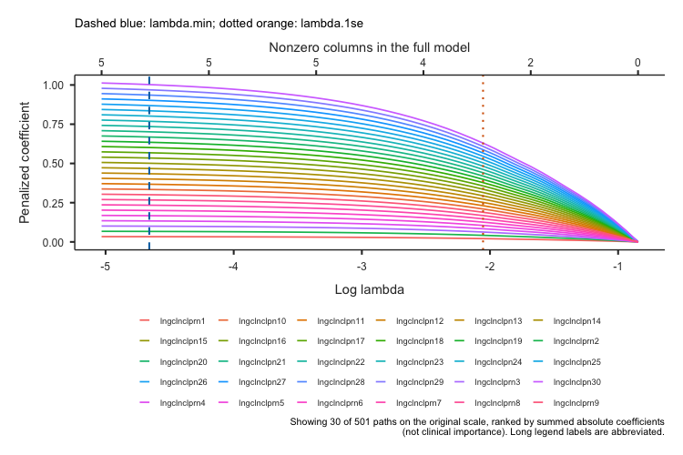
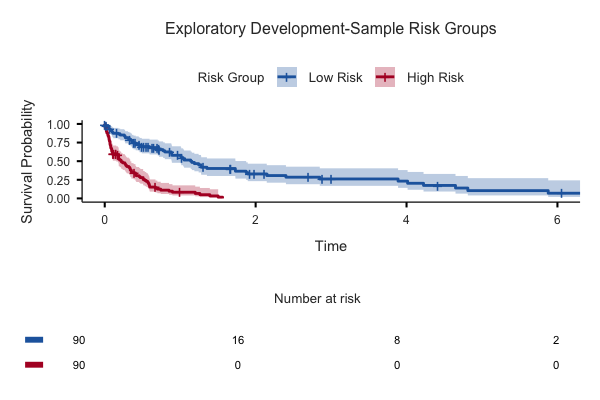

# LASSO Cox audit repairs

Date: 2026-08-31. Analysis version: **0.0.5**. Module: **1.0.8.04**.

The four confirmed defects and the local maintenance issues in the
[full audit](lassocox-full-audit-2026-08-31.md) have been repaired. The focused suite
passes **423 assertions in 86 blocks across eight files**, with **zero failures,
errors, or skipped blocks**. The module-wide rendering-contract checks separately
pass **six assertions in four blocks**. This is a software repair, not a release
certification or clinical validation of the model.

## Repairs and evidence

| Finding | Change | Verification |
|---|---|---|
| Predictor `y` broke optional Cox comparisons | Unpenalized refits use internal response and predictor names; original user names never become formula syntax | Comparisons are numerically unchanged after renaming a predictor to `y`, `.time`, `.status`, or a name containing a backtick |
| A 30-path legend consumed the plot | Six-column compact legend, bounded label length, smaller text and wrapped caption | Actual grid viewport height exceeds 150 px at 750×500; English/Turkish exports inspected |
| Coefficient subtitle clipped; direction labels were unclear | Wrapped subtitle and named lower/higher fitted-hazard labels; explicit scales follow the supplied theme | Rendered effect labels tested, 600×400 exports inspected |
| Constant-removal notices contradicted suitability | Preserve both original constant predictors and columns constant after complete-case filtering | Notices, suitability, encoding and reproducibility agree on a fixture with both kinds of removal |
| Legacy tests exercised obsolete interfaces | Use actual result groups and evaluated Options constructors; load the stored dataset object name; test legitimate empty models | All eight LASSO files pass; raw invalid fixtures are rejected explicitly |
| Imperative visibility and runtime fixed-row creation | Declarative visibility, input readiness guards, fixed rows initialized before fitting | Incomplete input recovery, option visibility, actual framework save/load, and real client options panel checked |
| Notes, plots and scores could become stale | Clear notes and values on reruns/errors; runtime notes use `init = FALSE` | Saved caveats persist; invalid input clears results and score output; corrected input recovers |
| Educational text and Turkish coverage incomplete | Translatable escaped HTML, corrected plot-axis/CV explanations, noun-based sentence-case UI labels | 320 current LASSO messages translated; GNU catalog validation and compiled Turkish runtime checks pass |
| Unused qualitative interpretation helpers | Remove unused C-index/HR cutoff interpreters | Tests require apparent-performance and noncausal interpretation rather than arbitrary clinical categories |
| Package fallbacks untested | Actionable required-dependency guard and disclosed optional survival-plot fallback | Isolated R6 subclasses simulate missing glmnet/survminer without uninstalling packages |
| Duplicate guides described older behavior | Retain compatibility links pointing to one current guide | Input/coding migration and limitations remain in the canonical guide |

Final visual inspection also found overlapping survival risk-table rows at 600×400.
The table now has a larger height allocation and smaller text; the main plot uses
explicit readable font sizes. Both panels must exceed 40 px in the regression test,
and the rendered risk table must contain its title and initial group count. The
risk-table heading is translated, and empty-model notices wrap within the image.

Very few events/censored observations and more candidate columns than events now
produce a prominent **Model stability warnings** panel. Routine preprocessing notes
remain separate. These warnings do not invent a clinical adequacy threshold or
silently replace a valid empty penalized model.

## Numerical checks

The fresh public-API differential run exercised each input/display option and
compared the fit against upstream `glmnet::cv.glmnet` with identical explicit folds:

| Quantity | Absolute difference |
|---|---:|
| Selected lambda | 0 |
| Largest coefficient difference | 0 |
| Largest saved linear-predictor difference | 0 |
| C-index versus independent comparable-pair calculation | 1.9984 × 10⁻¹⁵ |

The apparent C-index in this deterministic fixture was 0.724276467524738. No
improvement in model performance is claimed. See the machine-readable
[reference calculation](lassocox-fixes-2026-08-31/reference.json) and
[option differential results](lassocox-fixes-2026-08-31/differential.json).

## Runtime and test coverage

| Test file | Passing assertions |
|---|---:|
| Arguments | 27 |
| Audit repairs | 98 |
| Basic behavior | 9 |
| Edge cases | 55 |
| Bundled-data integration | 74 |
| Previous release repairs | 23 |
| Safety and provenance | 66 |
| Main LASSO tests | 71 |
| **LASSO total** | **423** |

The integration fixtures are not modified on disk. Some contain nonpositive times
or too few censored observations under the current strict input contract. Tests
assert those failures, then use explicitly constructed in-memory data to exercise
successful fitting; invalid source data are not silently relabeled as valid.

Serialization uses real jmvcore file-backed `.save()` / `.load()` and decoded
protobuf responses, with `RProtoBuf` supplied by the installed jamovi runtime.
Tests verify saved tables, plot state, visibility and caveats, enabled score-output
metadata, exact score values, NA alignment at excluded rows, invalid-data clearing,
and corrected-data recovery. jmvcore intentionally does not persist Output values
inside the saved result state: tests inspect the final response values and rerun
the restored analysis to verify recalculated output.

The real jamovi client options-panel harness reported `placeholder present = false`
and `errors = undefined`. Required/optional dependency tests use local subclasses
of the analysis; they do not modify installed libraries. Generated bindings and
Rd files were refreshed with the official compiler and roxygen using an isolated
LASSO package. The backend, generated header, and all three schemas in that package
match the working-tree files. The temporary package installs and loads successfully.

Environment: R 4.6.0, jmvcore 2.7.38, glmnet 5.0, survival 3.8.9. The installed
survival package emits an environment warning that it was built under R 4.6.1;
this is distinct from a test failure. Hand-written scoped files pass `git diff
--check`. The generated header retains compiler-produced trailing whitespace;
it was not hand-edited to change generator formatting.

The final [verification record](lassocox-fixes-2026-08-31/verification.json) includes
per-file totals and source hashes. English/Turkish plot evidence is retained in
[the evidence directory](lassocox-fixes-2026-08-31/). The 30-path images deliberately
use synthetic long labels and scaled traces to stress layout; they do not represent
an additional 501-variable model fit.

## Documentation and remaining scope

The [current user guide](../vignettes/jsurvival-lassocox-safety-and-reproducibility.md)
and [Turkish localization record](../i18n-plans/lassocox-tr-translation-plan.md)
describe the changes. Existing unrelated work was preserved. No commit, remote
publication, repository-wide regeneration, or package installation into the user's
normal library was performed.

A full module release build/check and manual desktop `.omv` open/edit/save round
trip remain release QA. The checks above validate framework serialization and UI
wiring, not every desktop packaging path. The analysis remains on `SurvivalT`.

Nested/optimism-corrected validation, frozen external prediction, time-specific
calibration and discrimination, decision-curve analysis, and alternative survival
learners remain separate feature work. The existing C-index and risk groups remain
apparent development results; this repair provides no treatment or surveillance
recommendation and does not claim external clinical validation.
