# Visual Diagrams Overview

This document contains all visual diagrams and workflow charts for the ClinicoPath tutorial series. Diagrams are provided in multiple formats:

- **Mermaid.js** - Renderable flowcharts (works in Quarto, GitHub, Obsidian)
- **ASCII Art** - Simple text-based diagrams
- **SVG Descriptions** - For professional graphic design

---

# Tutorial 1: Getting Started

## Diagram 1.1: Installation Workflow

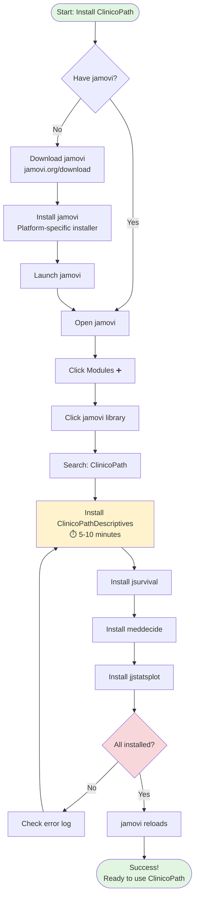

## Diagram 1.2: jamovi Interface Layout

```
┌────────────────────────────────────────────────────────────────┐
│  File  Data  Analyses ▼  Modules ➕                 Help     │
├──────────────┬─────────────────────────────────────────────────┤
│              │                                                 │
│  DATA PANEL  │           RESULTS PANEL                         │
│              │                                                 │
│ PatientID ▼  │  ┌─────────────────────────────────────┐      │
│ Age       📏 │  │  Table One                          │      │
│ Sex       🏷️  │  │  ═══════════════════════════════════│      │
│ Stage     🏷️  │  │                                     │      │
│ Grade     🏷️  │  │  Characteristic        N = 200     │      │
│ Treatment 🏷️  │  │  ──────────────────────────────────│      │
│              │  │  Age, years        55.2 (10.3)      │      │
│ [Filters]    │  │  Sex                                │      │
│              │  │    Female          120 (60%)        │      │
│ [Variables]  │  │    Male             80 (40%)        │      │
│              │  │  Stage                              │      │
│ (Spreadsheet │  │    I                45 (23%)        │      │
│  with data)  │  │    II               78 (39%)        │      │
│              │  │    III              52 (26%)        │      │
│              │  │    IV               25 (13%)        │      │
│              │  │                                     │      │
│              │  └─────────────────────────────────────┘      │
│              │                                                 │
│              │  [Additional results appear below]             │
│              │                                                 │
└──────────────┴─────────────────────────────────────────────────┘
                    👆 Click & Drag variables to options
```

## Diagram 1.3: ClinicoPath Menu Organization

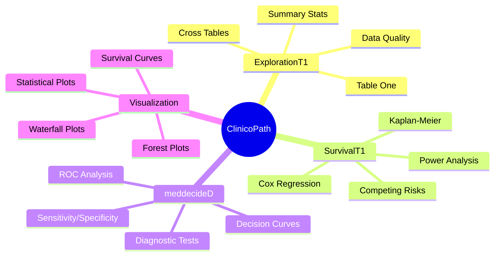

---

# Tutorial 2: Table One for Clinical Trials

## Diagram 2.1: Statistical Test Selection

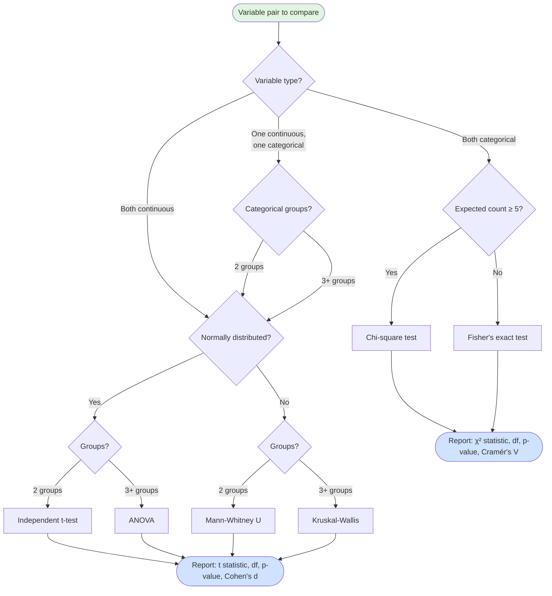

## Diagram 2.2: Effect Size Interpretation

```
EFFECT SIZE INTERPRETATION GUIDE
═══════════════════════════════════════════════════════════

┌─────────────────────────────────────────────────────────┐
│ COHEN'S d (for continuous variables)                    │
├─────────────────────────────────────────────────────────┤
│                                                          │
│  ├─────┼─────┼─────┼─────┼─────┼─────┼─────┼─────┤     │
│  0.0  0.2   0.5   0.8   1.0   1.2   1.5   1.8   2.0    │
│                                                          │
│  Negligible  Small   Medium   Large    Very Large       │
│  ─────────   ────   ───────   ──────   ──────────       │
│  |<---->|   |<->|    |<-->|    |<->|    |<---->|        │
│  No real   Noticeable   Clear    Strong   Huge          │
│  difference  trend    difference  effect  difference    │
│                                                          │
│  Example interpretations:                                │
│  d = 0.15: "negligible difference in age"               │
│  d = 0.35: "small difference in tumor size"             │
│  d = 0.65: "medium difference in biomarker levels"      │
│  d = 1.20: "large difference in survival time"          │
└─────────────────────────────────────────────────────────┘

┌─────────────────────────────────────────────────────────┐
│ CRAMÉR'S V (for categorical variables)                  │
├─────────────────────────────────────────────────────────┤
│                                                          │
│  ├─────┼─────┼─────┼─────┼─────┼─────┤                 │
│  0.0  0.1   0.2   0.3   0.4   0.5   0.6                │
│                                                          │
│  Negligible  Small   Medium    Large                    │
│  ─────────   ────   ───────    ──────                   │
│  |<---->|   |<->|    |<-->|     |<->|                   │
│  No    Weak    Moderate    Strong                       │
│  association  link   relation   association             │
│                                                          │
│  Example interpretations:                                │
│  V = 0.08: "negligible association between sex & stage" │
│  V = 0.18: "small association between grade & ER status"│
│  V = 0.32: "medium association between stage & grade"   │
│  V = 0.48: "large association between treatment & response"│
└─────────────────────────────────────────────────────────┘
```

## Diagram 2.3: Multiple Testing Decision Tree

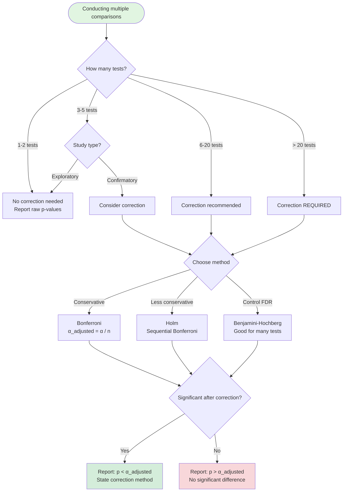

---

# Tutorial 3: Survival Analysis

## Diagram 3.1: Kaplan-Meier Interpretation

```
KAPLAN-MEIER SURVIVAL CURVE ANATOMY
═══════════════════════════════════════════════════════════════

    1.0 ┤
        │ ╭───────╮                  ← Confidence bands
 S   0.8┤ │ ●─────●─────╮            ● = Event (death)
 u      │ │             ╰──●──╮      + = Censored (alive)
 r   0.6┤ │                   ╰─●─╮
 v      │ │                       ╰─●─╮
 i   0.4┤ │                           ╰──●─+
 v      │ │                                ╰──●
 a   0.2┤ │                                   ╰──●
 l      │ │
    0.0 └─┴────────────────────────────────────────→
        0   6    12   18   24   30   36   42   48
                    Time (months)

KEY FEATURES:
┌─────────────────────────────────────────────────────────┐
│ Step-down pattern: Drops at each death event            │
│ Tick marks (+):    Censored patients (alive at last FU) │
│ Shaded band:       95% confidence interval              │
│ Median survival:   Time when curve crosses 50% line     │
│                    (here: ~30 months)                    │
│ At 24 months:      ~60% still alive                     │
└─────────────────────────────────────────────────────────┘
```

## Diagram 3.2: Cox Regression Workflow

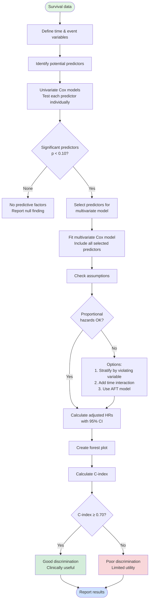

## Diagram 3.3: Hazard Ratio Interpretation

```
HAZARD RATIO (HR) INTERPRETATION
═══════════════════════════════════════════════════════════

┌──────────────────────────────────────────────────────────┐
│  HR < 1: PROTECTIVE (reduces risk of death)              │
│  HR = 1: NO EFFECT                                       │
│  HR > 1: HARMFUL (increases risk of death)               │
└──────────────────────────────────────────────────────────┘

      PROTECTIVE     NO     HARMFUL
         ◄──────     EFFECT     ──────►

    ├────┼────┼────┼────┼────┼────┼────┤
   0.25  0.5  0.75  1.0  1.5  2.0  3.0  4.0

   HR=0.5:        HR=1.0:       HR=2.0:
   50% reduction  No change     100% increase
   in death risk                in death risk

EXAMPLES:

┌─────────────────────────────────────────────────────────┐
│ Targeted vs. Standard Chemotherapy                      │
│ HR = 0.62 (95% CI: 0.42-0.91), p = 0.014               │
│                                                          │
│ Interpretation:                                          │
│ "Targeted therapy reduces death risk by 38% compared   │
│  to standard chemotherapy."                             │
│                                                          │
│ Calculation: (1 - 0.62) × 100% = 38% reduction         │
└─────────────────────────────────────────────────────────┘

┌─────────────────────────────────────────────────────────┐
│ Stage IV vs. Stage I                                    │
│ HR = 6.24 (95% CI: 2.73-14.3), p < 0.001               │
│                                                          │
│ Interpretation:                                          │
│ "Stage IV patients have 6.24 times the death risk of   │
│  Stage I patients (524% increase in risk)."            │
│                                                          │
│ Calculation: (6.24 - 1) × 100% = 524% increase         │
└─────────────────────────────────────────────────────────┘
```

---

# Tutorial 4: ROC Analysis

## Diagram 4.1: ROC Curve Components

```
ROC CURVE ANATOMY
═══════════════════════════════════════════════════════════

    1.0 ┤●                 ← Perfect test (100% Sens & Spec)
        │ ╱●
        │╱  ●              AUC = Area under this curve
 S   0.8┤   ╱●
 e      │  ╱  ●
 n   0.6┤ ╱    ●           Your test
 s      │╱      ●          AUC = 0.87 (Good)
 i   0.4┤        ●
 t      │  ╱╱╱╱╱  ●
 i   0.2┤ ╱       ●
 v      │╱         ●
 i   0.0├──────────●───────→
 t      0.0   0.2  0.4  0.6  0.8  1.0
 y                1 - Specificity
                  (False Positive Rate)

     Diagonal line (---) = Random chance (AUC = 0.50)

┌─────────────────────────────────────────────────────────┐
│ AUC INTERPRETATION                                       │
├─────────────────────────────────────────────────────────┤
│ 0.90 - 1.00  │ Excellent    │ Outstanding test          │
│ 0.80 - 0.90  │ Good         │ Useful in most cases      │
│ 0.70 - 0.80  │ Fair         │ May be useful            │
│ 0.60 - 0.70  │ Poor         │ Limited utility           │
│ 0.50 - 0.60  │ Fail         │ No better than chance     │
└─────────────────────────────────────────────────────────┘
```

## Diagram 4.2: Cutpoint Selection Strategy

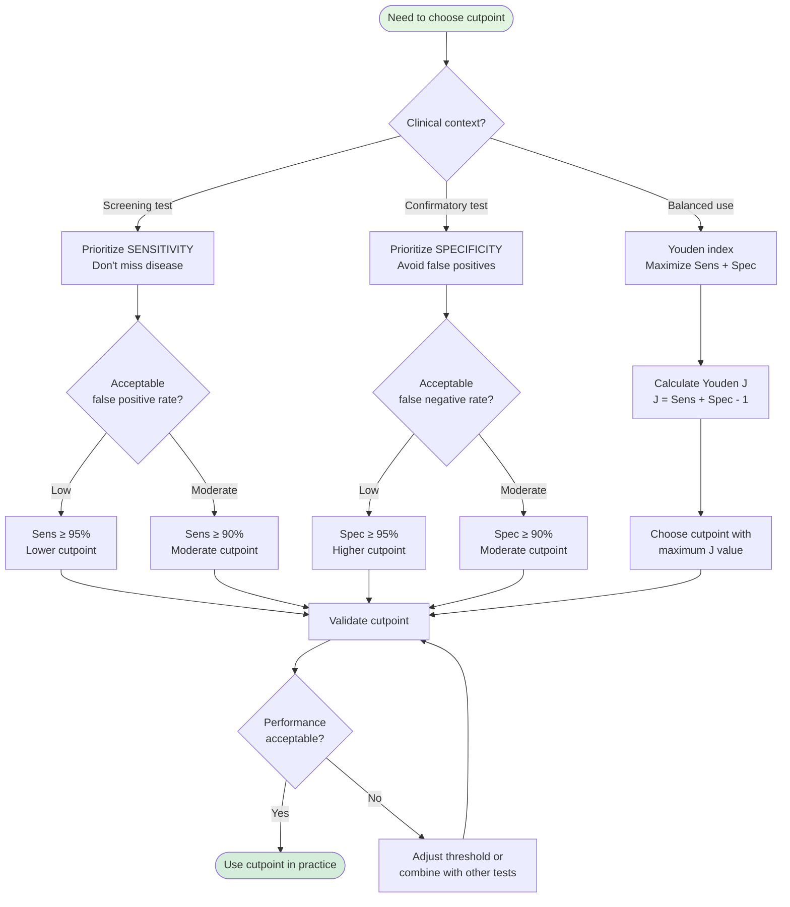

## Diagram 4.3: Sensitivity vs Specificity Trade-off

```
SENSITIVITY-SPECIFICITY TRADE-OFF
═══════════════════════════════════════════════════════════

      100% │ ●                         ← Sensitivity
           │  ╲
           │   ●╲
        80%│    ● ╲
           │     ●  ╲
        60%│      ●   ╲                As cutpoint
           │       ●    ╲              increases:
        40%│        ●     ╲            ↑ Specificity
           │         ●      ╲          ↓ Sensitivity
        20%│          ●       ╲
           │           ●        ●← Specificity
         0%└────────────────────────→
           Low              Cutpoint              High
         cutpoint                               cutpoint

EXAMPLE: HER2 Score

┌────────────────────────────────────────────────────────┐
│ Cutpoint │ Sensitivity │ Specificity │ Use case        │
├──────────┼─────────────┼─────────────┼─────────────────┤
│   40     │    92%      │    65%      │ Screening       │
│   52     │    84%      │    81%      │ Balanced (Youden│
│   60     │    77%      │    89%      │ Confirmatory    │
└────────────────────────────────────────────────────────┘

CHOOSING YOUR CUTPOINT:

Screening (40):
  ✅ Few false negatives (8% missed)
  ⚠️ Many false positives (35% unnecessary FISH)
  → Use when missing HER2+ is costly

Balanced (52):
  ✅ Good balance (84% sens, 81% spec)
  → Use for general diagnostic purposes

Confirmatory (60):
  ✅ Few false positives (11%)
  ⚠️ More false negatives (23% missed)
  → Use before expensive/toxic treatment
```

---

# Tutorial 5: Decision Curve Analysis

## Diagram 5.1: Net Benefit Concept

```
NET BENEFIT FRAMEWORK
═══════════════════════════════════════════════════════════

Net Benefit = Benefits - Weighted Harms

           True Positives      False Positives
NB =      ───────────────  -  ─────────────── × Weight
                 N                    N

where Weight = pt / (1 - pt)

EXAMPLE: Treatment Decision at 15% Threshold

┌──────────────────────────────────────────────────────────┐
│ Using the Model (at 15% threshold):                      │
│   - Treat 75 patients (model predicts risk ≥ 15%)       │
│   - True positives: 42 (would recur, benefit from Rx)   │
│   - False positives: 33 (won't recur, harmed by Rx)     │
│                                                           │
│ NB = 42/100 - 33/100 × (0.15/0.85)                      │
│    = 0.42 - 0.33 × 0.176                                │
│    = 0.42 - 0.058                                        │
│    = 0.362                                               │
│                                                           │
│ Interpretation: Equivalent to correctly treating 36.2%   │
│ of patients with perfect specificity (no false positives)│
└──────────────────────────────────────────────────────────┘
```

## Diagram 5.2: Decision Curve Interpretation

```
DECISION CURVE INTERPRETATION
═══════════════════════════════════════════════════════════

 Net
Benefit
    ↑
0.20│         ●───●───● Model (Best!)
    │       ●/
0.15│     ●/   ●───●── Treat All
    │   ●/    /
0.10│ ●/    ●/
    │/    ●/
0.05│  ●●/
    │●●/───────────── Treat None (Baseline)
0.00├────────────────────────────→
   0%  5%  10% 15% 20% 25% 30%
        Threshold Probability

DECISION RULES:

1. Model ABOVE both lines → Use the model
   (provides net benefit over defaults)

2. Model BETWEEN lines → Model useful for some,
   not others (shared decision-making)

3. Model BELOW both lines → Don't use model
   (treat all or treat none is better)

AT 15% THRESHOLD (vertical line):

● Model NB = 0.158     ← BEST
● Treat All NB = 0.082
● Treat None NB = 0.000 ← WORST

Difference (Model vs Treat All) = 0.076
→ "Model improves net benefit by 7.6 percentage points"
```

## Diagram 5.3: DCA Workflow

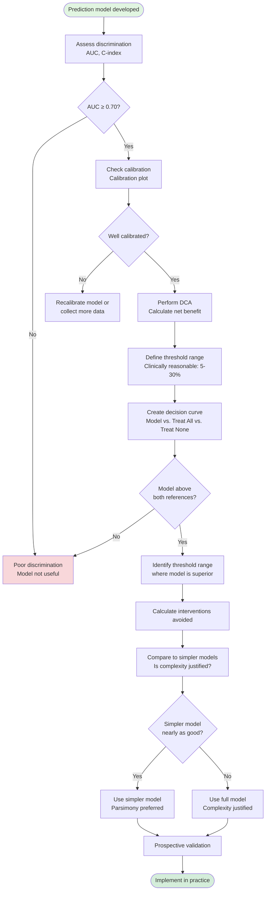

---

# Tutorial 6: Reproducible Research

## Diagram 6.1: Reproducible Research Workflow

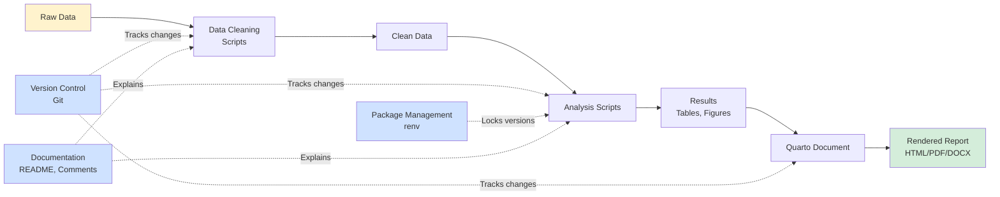

## Diagram 6.2: Project Organization Structure

```
RECOMMENDED PROJECT STRUCTURE
═══════════════════════════════════════════════════════════

my-clinical-trial/
│
├── 📁 data/
│   ├── 📁 raw/                 ← Original data (READ-ONLY)
│   │   ├── clinical_trial.csv
│   │   └── patient_data.xlsx
│   ├── 📁 processed/           ← Cleaned data
│   │   └── analysis_ready.rds
│   └── 📁 external/            ← Reference data
│       └── biomarker_norms.csv
│
├── 📁 scripts/                 ← Analysis code
│   ├── 01-import-data.R        (Numbered for order)
│   ├── 02-clean-data.R
│   ├── 03-table-one.R
│   ├── 04-survival-analysis.R
│   ├── 05-roc-analysis.R
│   └── 99-helper-functions.R  (Utilities)
│
├── 📁 reports/                 ← Quarto documents
│   ├── manuscript.qmd          (Main paper)
│   ├── supplementary.qmd       (Appendix)
│   └── exploratory.qmd         (Ad-hoc analyses)
│
├── 📁 results/                 ← Generated outputs
│   ├── 📁 tables/
│   │   ├── table1_baseline.csv
│   │   └── table2_hazard_ratios.csv
│   ├── 📁 figures/
│   │   ├── figure1_km_curve.pdf
│   │   └── figure2_forest_plot.pdf
│   └── 📁 models/
│       └── cox_model.rds       (Saved model objects)
│
├── 📁 docs/                    ← Documentation
│   ├── protocol.pdf            (Study protocol)
│   ├── sap.pdf                 (Statistical analysis plan)
│   └── data_dictionary.xlsx    (Variable definitions)
│
├── 📄 README.md                ← Project overview
├── 📄 _quarto.yml              ← Quarto configuration
├── 📄 .gitignore               ← Git exclusions
├── 📄 renv.lock                ← Package versions (reproducibility)
└── 📄 my-project.Rproj         ← RStudio project file

BENEFITS:
✅ Clear organization → Easy to navigate
✅ Raw data protected → Never overwrite originals
✅ Numbered scripts → Run in correct order
✅ Separate results → Don't commit to Git
✅ Documentation → Future you will thank you
```

## Diagram 6.3: Git Workflow for Research

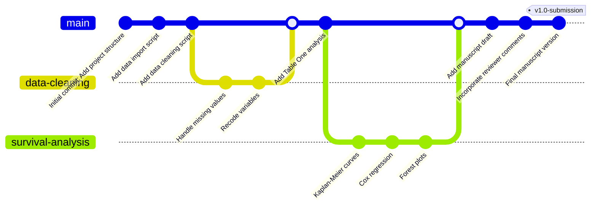

---

# General Workflow Diagrams

## Diagram G.1: Clinical Research Analysis Pipeline

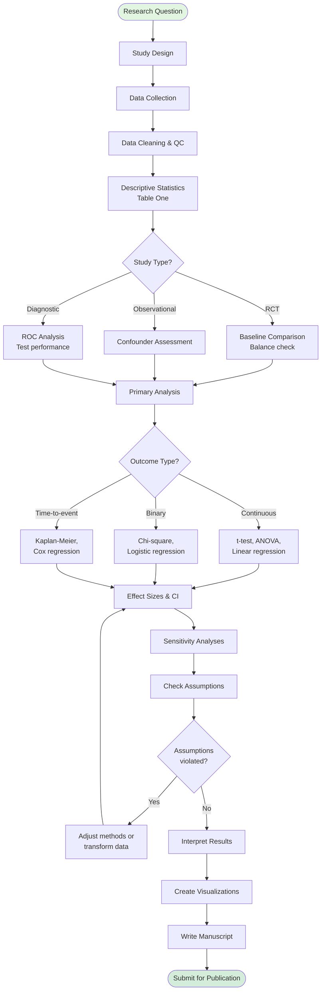

## Diagram G.2: Tutorial Learning Path

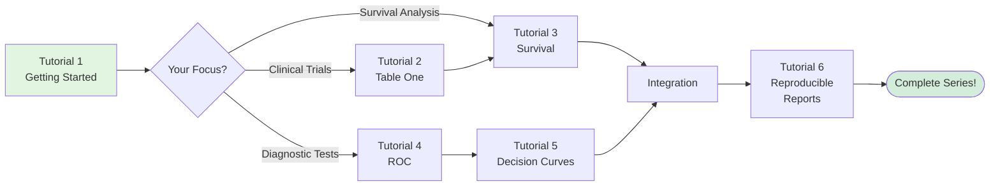

---

# ASCII Art Logo & Branding

## ClinicoPath Logo (ASCII)

```
   ╔═══════════════════════════════════════════════════╗
   ║                                                   ║
   ║   ┌─┐┬  ┬┌┐┌┬┌─┐┌─┐  ┌─┐┌─┐┌┬┐┬ ┬              ║
   ║   │  │  │││││  │ │  ├─┘├─┤ │ ├─┤              ║
   ║   └─┘┴─┘┴┘└┘┴└─┘└─┘  ┴  ┴ ┴ ┴ ┴ ┴              ║
   ║                                                   ║
   ║      Comprehensive Analysis for                  ║
   ║      Clinicopathological Research                ║
   ║                                                   ║
   ║   ╭──╮  ╭──╮  ╭──╮  ╭──╮                        ║
   ║   │📊│  │📈│  │🔬│  │💊│                        ║
   ║   ╰──╯  ╰──╯  ╰──╯  ╰──╯                        ║
   ║   Table Survival  Path  Decision                ║
   ║   One   Analysis  Stats Analysis                ║
   ║                                                   ║
   ╚═══════════════════════════════════════════════════╝
```

---

**Document Author:** ClinicoPath Development Team
**Last Updated:** December 13, 2025
**Version:** 1.0
**License:** CC-BY-4.0

**Note:** All Mermaid diagrams can be rendered in:
- Quarto documents
- GitHub README files
- Obsidian notes
- VS Code with Mermaid extension
- Online at mermaid.live
