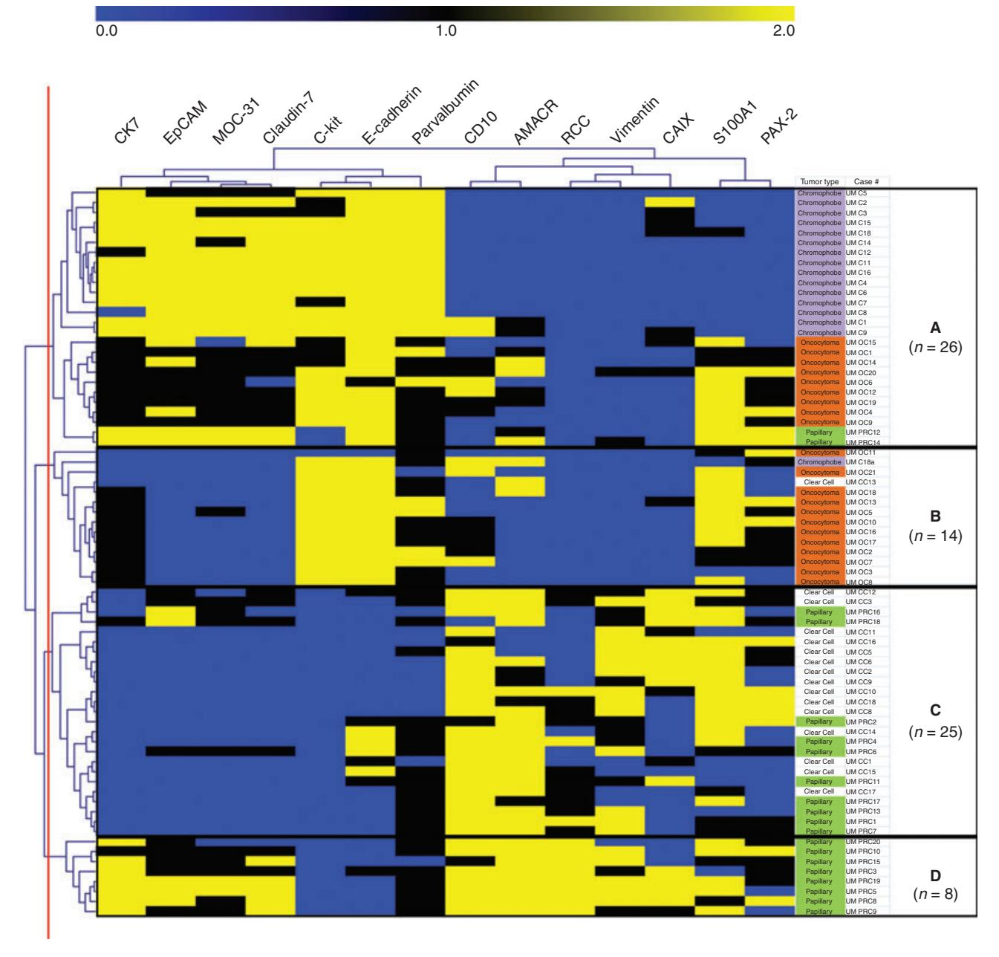
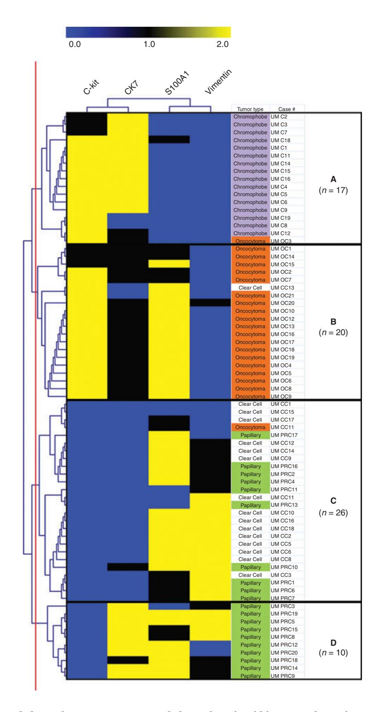
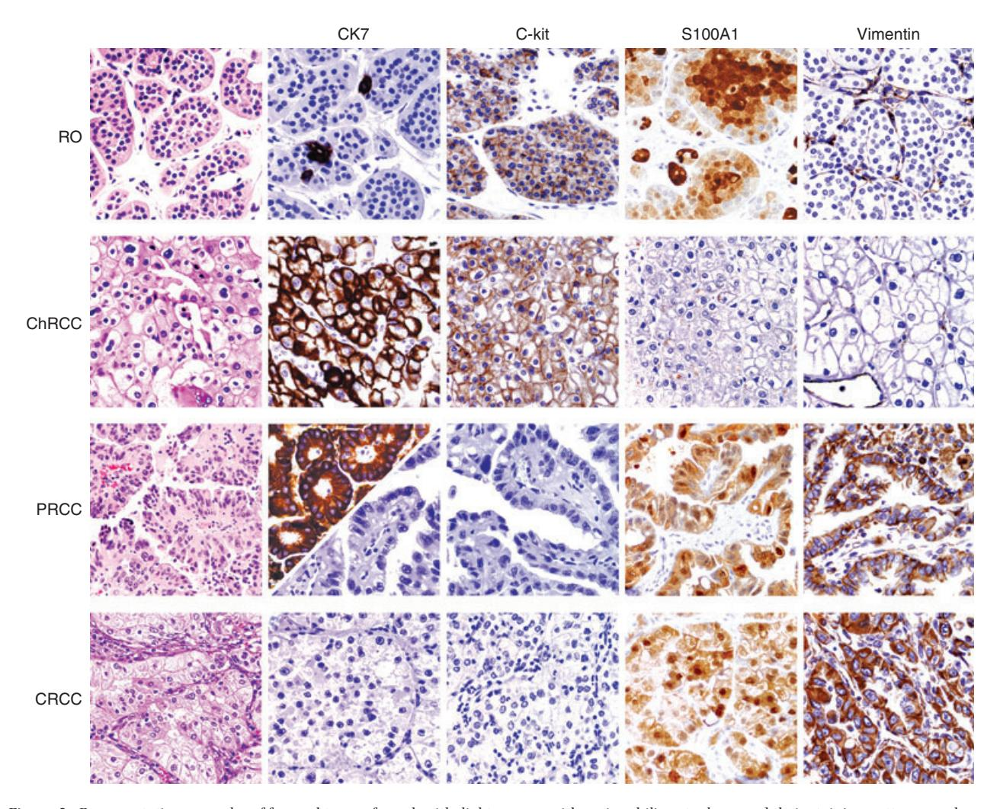

# Cluster analysis of immunohistochemical profiles delineates CK7, vimentin, S100A1 and C-kit (CD117) as an optimal panel in the differential diagnosis of renal oncocytoma from its mimics

Jason C Carvalho, Matthew J Wasco, Lakshmi P Kunju, Dafydd G Thomas & Rajal B Shah1 Department of Pathology, University of Michigan Medical Center, Ann Arbor, MI, and 1 Division of Urologic Pathology, Caris Life Sciences and the Caris Research Institute, Irving, TX, USA

Date of submission 4 February 2010 Accepted for publication 20 April 2010

Carvalho J C, Wasco M J, Kunju L P, Thomas D G & Shah R B (2011) Histopathology 58, 169–179

# Cluster analysis of immunohistochemical profiles delineates CK7, vimentin, S100A1 and C-kit (CD117) as an optimal panel in the differential diagnosis of renal oncocytoma from its mimics

Aims: To develop an immunohistochemical strategy for distinguishing renal oncocytoma (RO) from the eosinophilic variant of chromophobe (ChRCC), and papillary (PRCC) and clear cell (CRCC) renal cell carcinoma containing eosinophilic cytoplasm in core biopsy specimens.

Methods and results: Cluster analysis was performed on immunohistochemical data from 21 RO, 16 ChRCC, 16 CRCC and 20 PRCC patients. A panel of CK7, C-kit, S100A1 and vimentin clustered into four groups. Cluster A (94% ChRCC) expressed C-kit and CK7 and lacked S100A1 and vimentin. Cluster B (95% RO) expressed C-kit, S100A1, focal CK7 (single or small clusters of cells) and lacked vimentin. Cluster C comprised a mixture of PRCC and CRCC with no expression of C-kit or CK7 and variable S100A1 and vimentin. PRCC with strong expression of CK7 clustered into group D. A panel of S100A1 (positive) and focal CK7 expression distinguished RO from ChRCC with 91% sensitivity and 93% specificity. A panel of vimentin (negative) and C-kit (positive) distinguished RO from CRCC with 83% sensitivity and 86% specificity and RO from PRCC with 79% sensitivity and 88% specificity.

Conclusions: Hierarchical cluster analysis is an effective approach to analyse high-volume immunohistochemical data to generate an optimal panel in the differential diagnosis of oncocytoma from its mimics.

Keywords: oncocytoma, renal cell carcinoma, immunohistochemistry, cluster analysis

Abbreviations: AMACR, Alpha-methylacyl-CoA Racemase; CAIX, carbonic anhydrase IX; ChRCC, eosinophilic variant of chromophobe; CRCC, clear cell renal cell carcinoma; DMV, Data Matrix Viewer; EpCAM, epithelial cell adhesion molecule; FISH, fluorescence in situ hybridization; PPV, positive predictive value; PRCC, papillary renal cell carcinoma; RO, renal oncocytoma; TMA, tissue microarray

## Introduction

The spectrum of renal epithelial neoplasms with eosinophilic ⁄ oncocytic cytoplasm includes oncocytoma (RO), eosinophilic variant of chromophobe renal cell

Address for correspondence: R B Shah, MD, Urologic Pathology, Caris Life Sciences and the Caris Research Institute, 6655 North MacArthur Boulevard, Irving, TX 75039, USA. e-mail: rshah@carisls.com

carcinoma (ChRCC) and papillary (PRCC) and clear cell (CRCC) renal cell carcinoma with eosinophilic cytoplasm.1,2 Distinction of these tumours, specifically differentiation of benign oncocytoma from other tumours with malignant potential is critical. Due to increasing utilization of imaging techniques, an increasing number of small indeterminate tumours are being discovered radiologically and biopsied percutaneously.3 As these entities have varying clinical

behaviour and implications, accurate diagnosis is crucial to proper patient management, especially as a subset of tumours can be treated conservatively by minimally invasive techniques.

While architectural and cytological features can be sufficient to differentiate these tumours, there are often overlapping morphological features, variable histological features in different areas of the tumour and ⁄ or the morphological criteria are not sufficient to completely classify the tumour in a limited biopsy specimen.3,4 Immunohistochemical markers have been increasingly utilized to aid in the morphological assessment and differential diagnosis of eosinophilic renal tumours with overlapping features, as other studies including colloidal iron are technically difficult and imprecise.5 Ancillary techniques such as fluorescence in situ hybridization (FISH) have also been studied; however, it is technically intensive, not widely available and less reliable, specifically in the differential diagnosis of renal oncocytoma from its closest mimic, chromophobe renal cell carcinoma, due to lack of specific cytogenetic abnormalities.6 While a number of antibodies have been touted as useful for these tumour types they often show overlapping immunoreactivity patterns, making selection of an optimal panel useful in day-to-day practice a challenge for the surgical pathologist. The antibodies, which have been studied in this differential diagnosis either individually or as a variable panel, include CK7, C-kit (CD117), vimentin, progesterone receptor, E-cadherin, kidneyspecific cadherin, S100A1, MOC31, epithelial cell adhesion molecule (EpCAM), parvalbumin, CD10, caveolin 1, carbonic anhydrase IX (CAIX), Pax-2, AMACR, claudin-7 and claudin-8.7–20 However, none of the proposed markers is highly sensitive or specific to the diagnosis of these entities and therefore a panel approach is usually recommended to resolve the diagnosis.

Hierarchical cluster tree analysis, a powerful mathematical tool most often used for analysing gene expression data, has been shown to be similarly valuable to discover discriminating patterns and trends from high-volume immunohistochemical data.21 The aim of our study was to further characterize the immunohistochemical profiles of oncocytoma and its close mimics in a model that mimics small biopsy sampling. For this objective, we evaluated a series of 73 renal tumours containing eosinophilic cytoplasm in tissue microarrays with a select panel of 14 traditional and novel immunohistochemical markers proposed to be useful in the differential diagnosis of oncocytoma from its mimics to identify an optimal panel of markers that can be applied in day-to-day clinical practice.

# Materials and methods

case selection

After approval from the University of Michigan Institutional Review Board for human subject research, tumours were identified via a snomed search of the pathology database. A total of 73 renal tumours with eosinophilic cytoplasm, comprising 21 oncocytomas, 16 eosinophilic variant of chromophobe RCCs, 16 clear cell RCCs with predominant eosinophilic ⁄ granular cytoplasm and 20 papillary RCCs containing variable eosinophilic or oncocytic cytoplasm were selected, otherwise based randomly on available tumour volume. All cases included were resection specimens (radical or partial nephrectomy) and all haematoxylin and eosin (H&E)-stained sections were reviewed by study pathologists (JC, MW, RBS) and the histological types were determined according to the World Health Organization (WHO) 2004 classification.1 For cases in which the diagnosis could not be determined on the histology alone, several immunohistochemical markers were utilized and the final diagnosis was reached based on a combination of morphologic features on H&E and a panel of immunohistochemical markers.

#### tissue microarray construction and cluster analysis

A tissue microarray (TMA) was constructed from 0.6 mm cores of formalin-fixed, paraffin-embedded neoplastic tissue in triplicate as well as representative normal kidney sections from the same cases for controls. The TMA slides were stained with a select panel of 14 antibodies, using standard immunohistochemical techniques on an automated Ventana Benchmark XT stainer (Ventana, Phoenix, AZ, USA) or a Dako AutoStainer (Dako, Carpinteria, CA, USA). The list of antibodies, their origins, titration with pretreatments, incubation times and expected staining characteristics are listed in Table 1. The expression of each antibody was characterized on a 0–2 scale, where 0 represented 0–<10% of cell staining, 1 represented 10–<50% of cell staining and ⁄ or weak staining intensity and two represented >50% of cell staining and ⁄ or intense immunoreactivity. Intensity data expressed as plain scores (0, 1, 2) were arranged in a text delimited file and broadcasted from the Data Matrix Viewer (DMV) module of the gaggle software suite (http://gaggle.systembiology.net/docs) to the Multi-Experiment viewer of the tm4 software suite (http:// www.tm4.org/mev.html). Unsupervised hierarchical clustering was performed using average linkage analysis with Euclidean distance metric and the data were divided

Table 1. List of antibodies, staining patterns and treatment conditions

| Antibody    | Clone         | Staining pattern            | Company                                    | Dilution  | Pretreatment             |
|-------------|---------------|-----------------------------|--------------------------------------------|-----------|--------------------------|
| CK7         | OV-TL 12 ⁄ 30 | Cytoplasmic                 | Dako, Carpinteria, CA, USA                 | 1 ⁄ 50    | Buffer @ pH 8.0 (30 min) |
| EpCAM       | C10           | Membranous                  | Santa Cruz Biotech, Santa Cruz, CA, USA | 1 ⁄ 400   | Buffer @ pH 6.0 (10 min) |
| MOC-31      | MOC-31        | Cytoplasmic                 | Dako, Carpinteria, CA, USA                 | 1 ⁄ 50    | Buffer @ pH 8.0 (30 min) |
| Claudin 7   | 5D10F3        | Cytoplasmic ⁄ membranous | Zymed ⁄ Invitrogen, Carlsbad, CA, USA   | 1 ⁄ 400   | Buffer @ pH 6.0 (10 min) |
| C-kit       | Polyclonal    | Cytoplasmic ⁄ membranous | Dako, Carpinteria, CA, USA                 | 1 ⁄ 100   | Buffer @ pH 8.0 (30 min) |
| E-cadherin  | ECH-6         | Membranous                  | Ventana, Tucson, AZ, USA                   | Predilute | Buffer @ pH 8.0 (30 min) |
| Parvalbumin | PARV-19       | Cytoplasmic                 | Sigma-Aldrich, St Louis, MO, USA           | 1 ⁄ 100   | Buffer @ pH 6.0 (10 min) |
| CAIX        | Polyclonal    | Membranous                  | Abcam, Cambridge, MA, USA                  | 1 ⁄ 200   | Buffer @ pH 6.0 (10 min) |
| CD10        | 56C6          | Cytoplasmic ⁄ membranous | Ventana, Tucson, AZ, USA                   | Predilute | Buffer @ pH 8.0 (60 min) |
| AMACR       | 13H4          | Cytoplasmic                 | Zeta, Sierra Madre, CA, USA                | 1 ⁄ 40    | Buffer @ pH 8.0 (30 min) |
| RCC         | PN-15         | Membranous                  | Ventana, Tucson, AZ, USA                   | Predilute | Protease 1–12 min        |
| Vimentin    | V9            | Cytoplasmic                 | Dako, Carpinteria, CA, USA                 | 1 ⁄ 400   | Buffer @ pH 8.0 (30 min) |
| S100A1      | Proprietary   | Cytoplasmic or nuclear   | Sigma-Aldrich, St Louis, MO, USA        | 1 ⁄ 50    | Buffer @ pH 6.0 (15 min) |
| PAX-2       | Polyclonal    | Nuclear                     | Zymed ⁄ Invitrogen, Carlsbad, CA, USA   | 1 ⁄ 50    | Buffer @ pH 8.0 (60 min) |

EpCAM, Epithelial cell adhesion molecule; CAIX, carbonic anhydrase IX; CK7, Cytokeratin 7; CD10, Cluster Designation 10; AMACR, Alpha-methylacyl-CoA-Racemase; RCC, Renal Cell Carcinoma Marker; PAX-2, Paired box gene 2.

at the third branch point down in the cluster tree. Given the broad panel of antibodies that were analysed, several markers were found to have overlapping staining patterns or were found to have minimal discriminating properties among the different tumour types. After removal of the antibodies with overlapping staining results, a limited refined panel of markers was included in a final unsupervised cluster analysis. From this cluster plot, the specificity and sensitivity of selected markers was calculated for each tumour type. The positive predictive values of the panel of markers that were included in the analysis were determined for each tumour type.

# Results

immunohistochemical patterns of each tumour type

The results of immunostaining with all 14 antibodies are summarized in Table 2.

#### Chromophobe renal cell carcinoma

All the ChRCC tumours demonstrated mainly intense diffuse reactivity for C-kit, E-cadherin and parvalbumin (16 of 16, 100%). Several other markers that were highly sensitive included EpCAM, MOC-31 and claudin-7, which were positive in 94% (15 of 16) of cases each. Diffuse reactivity with CK7 was present in 81% (13 of 16) of the tumours, with only one tumour (6%) showing focal intense positivity while no expression was seen in two cases (13%). Only one case (6%) expressed S100A1 and Pax-2. In this cohort, lack of immunoreactivity with both Pax-2 and S100A1 was the major discriminating feature of ChRCC from RO, PRCC and CRCC. All these tumours were uniformly non-immunoreactive to RCC and ⁄ or vimentin.

#### Renal oncocytoma

Nearly all RO were positive for C-kit, E-cadherin and parvalbumin (95%, 20 of 21). In addition, S100A1 was expressed diffusely and strongly in 95% (20 of 21)

Table 2. Immunohistochemical profile of renal neoplasms with eosinophilic cytoplasm

| C-kit 100 95 6 Claudin-7 94 38 13 MOC-31 94 6 43 M EpCA 94 57 13 CK7 0* 88 0 ChRCC (n=16) CRCC (n=16) RO (n=21) |  | Percentage of cases staining positive ( | %) |            |             |      |           |     |          |      |        |       |
|--------------------------------------------------------------------------------------------------------------------------------------------------------------------------------------|--|-----------------------------------------|----|------------|-------------|------|-----------|-----|----------|------|--------|-------|
|                                                                                                                                                                                      |  |                                         |    | E-cadherin | Parvalbumin | CD10 | MACR A | RCC | Vimentin | CAIX | S100A1 | PAX-2 |
|                                                                                                                                                                                      |  |                                         |    | 100        | 100         | 19   | 19        | 0   | 0        | 30   | 6      | 6     |
|                                                                                                                                                                                      |  |                                         |    | 95         | 95          | 57   | 29        | 0   | 5        | 14   | 95     | 76    |
|                                                                                                                                                                                      |  |                                         |    | 31         | 44          | 94   | 81        | 44  | 75       | 50   | 81     | 50    |
| 0 55 60 65 55 PRCC (n=20)                                                                                                                                             |  |                                         |    | 35         | 90          | 85   | 100       | 75  | 85       | 38   | 85     | 65    |

ChRCC, Eosinophilic variant of chromophobe renal cell carcinoma; RO, oncocytoma; CRCC, clear cell renal cell carcinoma; PRECC, papillary renal cell carcinoma; EpCAM, epithelial cell adhesion molecule; CAIX, carbonic anhydrase IX. \*Only diffuse CK7 staining was considered positive in the RO tumour group of tumours. No diffuse reactivity for CK7 was identified in RO tumours; however, focal cytoplasmic ⁄ membranous reactivity for CK7 characterized by single cells or small clusters of cells was observed in 95% of RO, making this particular staining pattern highly sensitive for these tumours. Compared to ChRCC, RO expressed EpCAM, MOC-31 and claudin-7 in 33–50% of cases. Surprisingly, Pax-2 was the most sensitive (76%, 16 of 21 cases) for RO among the different tumour types. Similar to ChRCC, RO cases lacked expression for RCC, and except for a single case (5%) all lacked vimentin.

#### Clear cell renal cell carcinoma

Most of the immunohistochemical markers in our panel were insensitive for CRCC tumours. The antibodies with the greatest sensitivities were CD10, Alphamethylacyl-CoA-Racemase (AMACR), S100A1 and vimentin, with sensitivities ranging from 94% to 75%, respectively. Approximately half of CRCC tumours (44–50%) were positive for parvalbumin, RCC, CAIX and Pax-2. A smaller fraction (31%, five of 16) of CRCC expressed E-cadherin and most tumours did not express CK7, EpCAM, MOC-31, claudin-7 and C-kit.

#### Papillary renal cell carcinoma

The most sensitive marker of PRCC in our panel of antibodies was AMACR, which was expressed diffusely and strongly in 100% of tumours. Although parvalbumin expression was seen in 90% (18 of 20) of PRCC tumours, most cases demonstrated weak positivity. Similar to CRCC, approximately 85% of PRCC were positive for CD10, vimentin or S100A1. RCC was the most sensitive marker for PRCC among the four tumour types, with 75% of tumours showing reactivity. Around half to two-thirds of all PRCC expressed CK7, EpCAM, MOC-31, claudin-7 and Pax-2. CAIX and E-cadherin expression was restricted to just over a third of cases. Like CRCC, PRCC tumours did not demonstrate staining with C-kit.

## cluster analysis

An initial unsupervised cluster plot of the extended panel of 14 antibodies clustered into four groups based on staining similarities and is shown in Figure 1. Group A is composed of nearly all the ChRCC (94%, 15 of 16) tumours and almost half the RO (43%, nine of 21) with both tumour types demonstrating expression of EpCAM, MOC-31, claudin-7, parvalbumin, C-kit and E-cadherin, with a greater intensity of C-kit and Ecadherin identified in ChRCC. The two PRCC tumours that segregated into group A were included because of intense staining for CK7, EpCAM, MOC-31, claudin-7,

Figure 1. Initial unsupervised cluster map of expanded immunohistochemical panel for four categories of renal epithelial neoplasms with eosinophilic cytoplasm. Antibodies are arrayed at the top of the map and the four types of tumours are listed along the right side. The red line on the left is the level of the clustering tree that separates the tumours into four groups. Group A illustrates the similar immunohistochemical profiles of both renal oncocytoma (RO) and eosinophilic variant of chromophobe renal cell carcinoma (ChRCC) when using an extended panel of markers. The remaining RO tumours which did not express EpCAM, MOC-31 and claudin-7 are clustered in group B. Group C is composed of a mix of clear cell renal cell carcinoma (CRCC) and papillary renal cell carcinoma (PRCC), which highlights their overlapping immunohistochemical features. Finally, group D is populated entirely by a subset of PRCC which nearly all express intense CK7 compared to PRCC in group C.

E-cadherin and a lack of CD10 and RCC. The remaining RO (57%, 12 of 21) were grouped into group B and differed from the RO in group A because of the lack of reactivity with EpCAM, MOC-31 and claudin-7. A single ChRCC that did not express CK7, EpCAM, MOC-31 and claudin-7, as did the group A ChRCC tumours,

was classified into group B. In addition, the only CRCC which expressed C-kit, a marker that is exclusive to RO and ChRCC in our cluster analysis, was segregated to cluster B. The absence of C-kit and CK7 reactivity and strong expression of CD10 characterized group C, which was comprised of a mix of 60% CRCC and

40% PRCC. Finally, group D was restricted primarily to those PRCC mainly expressing intense CK7.

Several overlapping expression patterns were delineated by the initial unsupervised cluster analysis of the panel of antibodies examined. EpCAM, MOC-31 and claudin-7 clustered together, as all three antibodies had essentially similar percentages of positivity among the four tumour types (see Table 2). Other antibodies that clustered together to a significant but lesser degree included the following pairs: C-kit and E-cadherin, CD10 and AMACR, RCC and vimentin, and S100A1 and Pax-2.

The initial unsupervised cluster plot (Figure 2) along with percentage expression of 14 antibodies for four tumour types was reviewed and antibodies with significant overlap between the four types of renal tumours were removed. An unsupervised cluster analysis with a select and limited panel that included CK7, C-kit, S100A1 and vimentin was performed (see Figure 3). The cluster plot of the select antibody panel separated all the cases into four distinct groups at the second division point of the cluster tree. All ChRCC were segregated into group A, characterized by expression of C-kit and diffuse expression of CK7 along with a lack of both S100A1 and vimentin. One case of RO fell into this cluster due to a lack of expression for S100A1. Group B was populated by 90% (19 of 21) of the RO based on the expression of C-kit and S100A1, with most tumours showing focal CK7 expression and a lack of vimentin. One CRCC tumour that expressed C-kit and clustered into group B in the initial unsupervised analysis also fell into group B. Half of PRCC and 94% (15 of 16) of CRCC tumours comprised group C, along with the only RO case, which lacked C-kit. All tumours in group C lacked C-kit, most of the tumours (81%) expressed S100A1 and vimentin, and only one PRCC expressed CK7 weakly. Finally, group D was restricted to PRCC that predominantly display intense CK7, which is similar to the initial unsupervised cluster, but included three additional PRCC tumours.

### sensitivity, specificity and positive predictive values

The sensitivity and specificity of antibodies that comprise an optimal panel in the differential diagnosis of four categories of renal epithelial tumours with eosinophilic cytoplasm are presented in Table 3.

CK7 expression seen in single cells or clusters of cells pattern in RO was found to be both sensitive and specific (89% and 86%, respectively) in distinguishing RO from ChRCC. Absent S100A1 reactivity in ChRCC was able to exclude RO, which showed weak to strong staining with a greater sensitivity of 94% and specificity of 95%. Used in conjunction, separating RO and ChRCC with both CK7 and S100A1 was found to have a sensitivity and specificity of 91% and 93%, respectively. The ability to differentiate RO from both PRCC and CRCC with positive C-kit and negative vimentin expression demonstrated similar sensitivities and specificities ranging from 79% to 83% and 88% to 86%, respectively. S100A1 was able to distinguish ChRCC from both PRCC and CRCC with sensitivity of 83% and specificity of 93–94%. The lack of S100A1 expression in ChRCC compared to RO, CRCC and PRCC demonstrated the highest specificity at 98% but was the least sensitive, with a sensitivity of only 68%.

Utilizing the panel of select antibodies based on our cluster analysis, the positive predictive value (PPV) for the diagnosis of RO with an immunoprofile of CK7(focal+ ⁄ )), S100A1(+), C-kit(+) and vimentin()) is 86%. For ChRCC, the expression of diffuse CK7(+), S100A1()), C-kit(+) and vimentin()) has a PPV of 81%. The staining pattern of S100A1(+), CK7-kit()), vimentin (+) and CK7()) in CRCC or CK(+ ⁄ )) in papillary has a PPV for CRCC and PRCC of 69% and 70%, respectively. This panel was not able to distinguish between CRCC and PRCC conclusively.

# Discussion

The utility of immunohistochemical markers in the differential diagnosis of oncocytoma from its close mimics, especially the eosinophilic variant of ChRCC, has been a matter of intense investigation with many novel markers proposed, often with variable sensitivity and specificity. The goal of this study was to examine many of the previously studied antibodies and develop a panel of markers based on immunoprofiles that can distinguish oncocytoma from its close mimics in a model similar to small biopsy sampling. Our approach of cluster tree analysis to high-volume immunohistochemical data effectively demonstrates many of the proposed markers have significant overlapping immunohistochemical patterns in the different renal tumour types and hence are of limited utility in day-to-day practice. Initial unsupervised analysis highlighted that most of the markers are not effective in distinguishing the four tumour types, except for CK7, C-kit, vimentin and S100A1, which defined our optimal panel (see Figures 2 and 3). Our results show that using a broad panel as seen in the initial unsupervised analysis incurred overlap between ChRCC and a subset of RO, which was due to focal ⁄ weak expression of EpCAM, MOC-31 and claudin-7 seen in the segregated RO. These markers, along with E-cadherin, parvalbumin, CD10

Figure 2. Unsupervised cluster map of optimal panel of markers that separates renal oncocytoma (RO) from eosinophilic variant of chromophobe renal cell carcinoma (ChRCC) and RO ⁄ ChRCC from both clear cell renal cell carcinoma (CRCC) and papillary renal cell carcinoma (PRCC). Antibodies are arrayed at the top of the map and the various types of tumours are along the right side. The red line on the left is the level of the clustering tree that separates the tumours into four groups. Group A is defined by tumours that do not express S100A1 consisting of almost all ChRCC. Group B is comprised predominantly of RO tumours that express both C-kit and S100A1 with focal CK7. Nearly all the CRCC and half the PRCC tumours are clustered in group C, which is defined by a lack of C-kit and CK7 expression and variable expression of S100A1 and vimentin. The PRCC tumours that strongly express CK7 with variable S100A1 and vimentin fall within group D.

and RCC, which were included in our expanded panel, are within the ranges of previous studies13,14,18,20–26 (see Table 2) but did not add discriminating power to our cluster analysis.

In our expanded panel, it should be pointed out that the staining characteristics of a couple of markers were discovered to be different from those reported previously yet still did not prove to be useful to be included

Figure 3. Representative examples of four subtypes of renal epithelial tumours with eosinophilic cytoplasm and their staining patterns as shown with the select optimal panel of antibodies comprising of CK7, C-kit, S100A1 and vimentin.

in our select panel. Recently, Gupta et al. examined CAIX in renal epithelial neoplasms and found CAIX to be helpful in differentiating between CRCC and ChRCC, as expression of CAIX was present only in CRCC. In our study, CAIX reactivity was identified in up to 30% of ChRCC and only 50% of CRCC. Interestingly, Skapa et al.27 noted recently that the amount and intensity of reactivity of CAIX in CRCC was related to the proportion of cells with granular cytoplasm, which may explain the lower percentage of CRCC that expressed CAIX in our study. In addition, the reactivity of CAIX in ChRCC was primarily weak in nature. In several studies, Pax-2 has been shown to be able to distinguish between RO and ChRCC, with RO immunoreactivity ranging from 87% to 100% compared to ChRCC with 6-9%. 9,13,28 In a recent study by Ozcan et al., 29 it was discovered that Pax-2 expression was present in 83% of ChRCC and 88% of RO. Our

results with Pax-2 in distinguishing RO from ChRCC are more consistent with earlier studies, and we found Pax-2 to have potentially significant utility in this important differential diagnosis. In our study, only a single case of ChRCC (6%) was positive with Pax-2 compared to 76% of RO. The expression of Pax-2 in CRCC is lower in our cohort (50%) compared to a study by Gupta et al.9 (93%) and, hence, in our experience Pax-2 has limited utility in distinguishing CRCC from ChRCC. Expression of Pax-2 in PRCC (65%) is comparable to other published studies. Finally, in our study, AMACR has been shown to be strongly and diffusely positive in nearly all PRCC, while the majority of RO and ChRCC are negative. Overall, our results mirror previous studies, 19,30 which have also shown that 11-15% of RO and 0-16% of ChRCC show expression of AMACR; however, we found that up to 81% of CRCC were strongly positive with AMACR

| Differential diagnoses      | Panel                                        | Sensitivity (%) | Specificity (%) |
|-----------------------------|----------------------------------------------|-----------------|-----------------|
| RO versus ChRCC             | S100A1 (negative)                            | 94              | 95              |
| RO versus ChRCC             | CK7 (negative ⁄ focal)                       | 89              | 86              |
| RO versus ChRCC             | CK7 (negative ⁄ focal) and S100A1 (positive) | 91              | 93              |
| RO versus PRCC              | Vimentin (negative) and C-kit (positive)     | 79              | 88              |
| RO versus CRCC              | Vimentin (negative) and C-kit (positive)     | 83              | 86              |
| ChRCC versus PRCC           | S100A1 (negative)                            | 83              | 94              |
| ChRCC versus CRCC           | S100A1 (negative)                            | 83              | 93              |
| ChRCC versus RO, CRCC, PRCC | S100A1 (negative)                            | 68              | 98              |

Table 3. Sensitivity and specificity of antibodies that comprise an optimal panel in the differential diagnosis of renal epithelial tumours with eosinophilic cytoplasm

ChRCC, Eosinophilic variant of chromophobe renal cell carcinoma; RO, oncocytoma; CRCC, clear cell renal cell carcinoma; PRECC, papillary renal cell carcinoma; EpCAM, epithelial cell adhesion molecule; CAIX, carbonic anhydrase IX.

compared to 16–62%, highlighting that AMACR is not unique to PRCC.31

Reviewing the initial unsupervised cluster analysis identified markers with overlapping staining patterns that were not helpful in differentiating between the four types of oncocytic renal epithelial tumours, and hence a second unsupervised cluster analysis was performed using CK7, C-kit, vimentin and S100A1. In our experience, both S100A1 and ⁄ or Pax-2 are useful in distinguishing RO from ChRCC.

S100A1 is a member of the S100 family of calciumbinding proteins genes, most of which are clustered on chromosome 1q21, that has been found to be expressed in renal cell carcinomas.32 Using reverse transcription– polymerase chain reaction (RT–PCR), the expression of S100A1 mRNA have been found in several studies to be elevated in PRCC and RO and decreased significantly in ChRCC; however, wide variation in the level of expression has been found in CRCC. Both Rocca and Li et al. have demonstrated correlation between the molecular and immunohistochemical expression of S100A1.11,16 In comparing the recent studies examining immunohistochemical expression of S100A1 in renal neoplasms, CRCC has been found to be expressed in 66–73% of cases and 67–94% of PRCC.11,16 The highest level of expression has been identified in RO, with 92–93% of cases demonstrating reactivity with S100A1 compared to 0–6% of ChRCC, which have been found to be negative.11,16,22

We found the lack of S100A1 in ChRCC to be both sensitive and specific compared to RO. Our results are similar to previous studies that found RO to be positive for S100A1 in 92–93% of cases versus 0–6% of ChRCC tumours.11,16,22 Among CRCC and PRCC, our results (81% and 85%, respectively) are comparable with Rocca et al., who studied 41 CRCC and 32 PRCC and found that 73% of CRCC and 94% of PRCC were positive, with S100A1 supporting that the lack of S100A1 in a renal tumour with granular cytoplasm is specific for ChRCC.

Although both Pax-2 and S100A1 are expressed similarly in ChRCC and have similar utility in distinguishing RO from ChRCC, our data show that S100A1 is superior to Pax-2 (95% expression in RO compared to 76% expression in RO by Pax-2). In addition, lack of S100A1 is also superior in discriminating ChRCC from CRCC and PRCC in comparison to Pax-2, and hence justifies the inclusion of S100A1 versus Pax-2 in our select panel.

The second marker in our panel that was helpful in differentiating between RO and ChRCC was CK7. The majority (90%) of RO demonstrated single cells or clusters of cells with CK 7 immunoreactivity (see Figure 3) compared to diffuse CK7 immunoreactivity observed in ChRCC. Two cases demonstrated complete lack of staining and no case demonstrated diffuse CK 7 expression. Therefore, a staining pattern of single cells or clusters of cells with CK7 is a distinct pattern that can aid in the identification of RO. Although many studies have examined the role of CK7 in the differential between RO and CRCC, our results fall within the range of many studies that have found diffuse reactivity for CK7 in 0–10% of RO and 73–100% of ChRCC.7,13,14,17,21–23,28,33,34 Both C-kit and vimentin were found to be helpful in distinguishing RO and ChRCC from CRCC and PRCC. C-kit has been found previously to be positive in RO and ChRCC in 71–100% of cases with up to 5% of CRCC and PRCC demonstrating focal expression.10,15,18,23,28,35 Interestingly, the only case of CRCC that was positive for C-kit in our study showed intense reactivity and had many other immunohistochemical features of a RO, and hence, not surprisingly, segregated with the RO cluster. However, re-review of multiple sections of the tumour confirmed the diagnosis of CRCC. Finally, the last antibody included in our optimal panel of markers was vimentin, which was found to be helpful in distinguishing RO and ChRCC from CRCC and PRCC (positive in most PRCC and CRCC tumours and negative in all but one RO that demonstrated weak focal reactivity). As no single marker has been discovered that is uniquely specific and sensitive in the discriminating renal epithelial tumours with eosinophilic cytoplasm, a panel of antibodies is needed in the differential which in our analysis has found these four markers to have a positive predictive value for RO and ChRCC of 86% and 81%, respectively. In our cohort, and similar to a previous study, unsupervised cluster analysis was not able to differentiate sufficiently between PRCC and CRCC with eosinophilic cytoplasm.14 In addition, the PPVs of our panel of markers were lower for PRCC and CRCC compared to the PPVs for RO and ChRCC.

By utilizing such an approach on a broad panel of 14 traditional and many novel markers, we advocate that a panel of CK7, S100A1, C-kit and vimentin is optimal in the differential diagnosis of oncocytoma from its close mimics.

# Acknowledgements

The authors thank Dr David R Lucas for his critical review of the manuscript and insightful comments and Javed Siddiqui for assistance in construction of tissue microarray.

# References

- 1. Eble J, Sauter G, Epstein JI et al. WHO classification of tumors: pathology and genetics of tumours of the urinary system and male genital organs. Lyon, France: IARC Press, 2004.
- 2. Kunju LP, Wojno K, Wolf JS Jr, Cheng L, Shah RB. Papillary renal cell carcinoma with oncocytic cells and nonoverlapping low grade nuclei: expanding the morphologic spectrum with emphasis on clinicopathologic, immunohistochemical and molecular features. Hum. Pathol. 2008; 39; 96–101.
- 3. Shah RB, Bakshi N, Hafez KS, Wood DP Jr, Kunju LP. Imageguided biopsy in the evaluation of renal mass lesions in contemporary urological practice: indications, adequacy, clinical impact, and limitations of the pathological diagnosis. Hum. Pathol. 2005; 36; 1309–1315.
- 4. Cochand-Priollet B, Molinie V, Bougaran J et al. Renal chromophobe cell carcinoma and oncocytoma. A comparative morpho-

- logic, histochemical, and immunohistochemical study of 124 cases. Arch. Pathol. Lab. Med. 1997; 121; 1081–1086.
- 5. Tickoo SK, Amin MB, Zarbo RJ. Colloidal iron staining in renal epithelial neoplasms, including chromophobe renal cell carcinoma: emphasis on technique and patterns of staining. Am. J. Surg. Pathol. 1998; 22; 419–424.
- 6. Meyer PN, Cao Y, Jacobson K, Krausz T, Flanigan RC, Picken MM. Chromosome 1 analysis in chromophobe renal cell carcinomas with tissue microarray (TMA)-facilitated fluorescence in situ hybridization (FISH) demonstrates loss of 1p ⁄ 1 which is also present in renal oncocytomas. Diagn. Mol. Pathol. 2008; 17; 141–144.
- 7. Adley BP, Papavero V, Sugimura J, Teh BT, Yang XJ. Diagnostic value of cytokeratin 7 and parvalbumin in differentiating chromophobe renal cell carcinoma from renal oncocytoma. Anal. Quant. Cytol. Histol. 2006; 28; 228–236.
- 8. Avery AK, Beckstead J, Renshaw AA, Corless CL. Use of antibodies to RCC and CD10 in the differential diagnosis of renal neoplasms. Am. J. Surg. Pathol. 2000; 24; 203–210.
- 9. Gupta R, Balzer B, Picken M et al. Diagnostic implications of transcription factor Pax 2 protein and transmembrane enzyme complex carbonic anhydrase IX immunoreactivity in adult renal epithelial neoplasms. Am. J. Surg. Pathol. 2009; 33; 241–247.
- 10. Huo L, Sugimura J, Tretiakova MS et al. C-kit expression in renal oncocytomas and chromophobe renal cell carcinomas. Hum. Pathol. 2005; 36; 262–268.
- 11. Li G, Barthelemy A, Feng G et al. S100A1: a powerful marker to differentiate chromophobe renal cell carcinoma from renal oncocytoma. Histopathology 2007; 50; 642–647.
- 12. Martignoni G, Pea M, Chilosi M et al. Parvalbumin is constantly expressed in chromophobe renal carcinoma. Mod. Pathol. 2001; 14; 760–767.
- 13. Mazal PR, Stichenwirth M, Koller A, Blach S, Haitel A, Susani M. Expression of aquaporins and PAX-2 compared to CD10 and cytokeratin 7 in renal neoplasms: a tissue microarray study. Mod. Pathol. 2005; 18; 535–540.
- 14. Pan CC, Chen PC, Ho DM. The diagnostic utility of MOC31, BerEP4, RCC marker and CD10 in the classification of renal cell carcinoma and renal oncocytoma: an immunohistochemical analysis of 328 cases. Histopathology 2004; 45; 452–459.
- 15. Petit A, Castillo M, Santos M, Mellado B, Alcover JB, Mallofre C. KIT expression in chromophobe renal cell carcinoma: comparative immunohistochemical analysis of KIT expression in different renal cell neoplasms. Am. J. Surg. Pathol. 2004; 28; 676–678.
- 16. Rocca PC, Brunelli M, Gobbo S et al. Diagnostic utility of S100A1 expression in renal cell neoplasms: an immunohistochemical and quantitative RT–PCR study. Mod. Pathol. 2007; 20; 722–728.
- 17. Skinnider BF, Folpe AL, Hennigar RA et al. Distribution of cytokeratins and vimentin in adult renal neoplasms and normal renal tissue: potential utility of a cytokeratin antibody panel in the differential diagnosis of renal tumors. Am. J. Surg. Pathol. 2005; 29; 747–754.
- 18. Wang HY, Mills SE. KIT and RCC are useful in distinguishing chromophobe renal cell carcinoma from the granular variant of clear cell renal cell carcinoma. Am. J. Surg. Pathol. 2005; 29; 640–646.
- 19. Molinie V, Balaton A, Rotman S et al. Alpha-methyl CoA racemase expression in renal cell carcinomas. Hum. Pathol. 2006; 37; 69–703.
- 20. Langner C, Ratschek M, Rehak P, Schips L, Zigeuner R. Expression of MUC1 (EMA) and E-cadherin in renal cell carcinoma: a systematic immunohistochemical analysis of 188 cases. Mod. Pathol. 2004; 17; 180–188.

- 21. Allory Y, Bazille C, Vieillefond A et al. Profiling and classification tree applied to renal epithelial tumours. Histopathology 2008; 52; 158–166.
- 22. Kim SS, Choi YD, Jin XM et al. Immunohistochemical stain for cytokeratin 7, S100A1 and claudin 8 is valuable in differential diagnosis of chromophobe renal cell carcinoma from renal oncocytoma. Histopathology 2009; 54; 633–635.
- 23. Liu L, Qian J, Singh H, Meiers I, Zhou X, Bostwick DG. Immunohistochemical analysis of chromophobe renal cell carcinoma, renal oncocytoma, and clear cell carcinoma: an optimal and practical panel for differential diagnosis. Arch. Pathol. Lab. Med. 2007; 131; 1290–1297.
- 24. Li G, Gentil-Perret A, Lambert C, Genin C, Tostain J. S100A1 and KIT gene expressions in common subtypes of renal tumours. Eur. J. Surg. Oncol. 2005; 31; 299–303.
- 25. Went P, Dirnhofer S, Salvisberg T et al. Expression of epithelial cell adhesion molecule (EpCam) in renal epithelial tumors. Am. J. Surg. Pathol. 2005; 29; 83–88.
- 26. Bakshi N, Kunju LP, Giordano T, Shah RB. Expression of renal cell carcinoma antigen (RCC) in renal epithelial and nonrenal tumors: diagnostic Implications. Appl. Immunohistochem. Mol. Morphol. 2007; 15; 310–315.
- 27. Skapa P, Hyrsl L, Zavada J, Soukup J, Zamecnik J. Carbonic anhydrase IX expression in clear cell renal cell carcinomas negatively correlates with the proportion of the granular cell component. J. Clin. Oncol. 2008; 26; 3809–3811.
- 28. Memeo L, Jhang J, Assaad AM et al. Immunohistochemical analysis for cytokeratin 7, KIT, and PAX2: value in the

- differential diagnosis of chromophobe cell carcinoma. Am. J. Clin. Pathol. 2007; 127; 225–229.
- 29. Ozcan A, Zhai J, Hamilton C et al. PAX-2 in the diagnosis of primary renal tumors: immunohistochemical comparison with renal cell carcinoma marker antigen and kidney-specific cadherin. Am. J. Clin. Pathol. 2009; 131; 393–404.
- 30. Tretiakova MS, Sahoo S, Takahashi M et al. Expression of alphamethylacyl-CoA racemase in papillary renal cell carcinoma. Am. J. Surg. Pathol. 2004; 28; 69–76.
- 31. Szponar A, Beothe T, Kovacs G. How useful is alpha-methylacyl-CoA racemase (AMACR) immunohistochemistry in the differential diagnosis of kidney cancers? Histopathology 2010; 56; 263– 265.
- 32. Teratani T, Watanabe T, Kuwahara F et al. Induced transcriptional expression of calcium-binding protein S100A1 and S100A10 genes in human renal cell carcinoma. Cancer Lett. 2002; 175; 71–77.
- 33. Mathers ME, Pollock AM, Marsh C, O'Donnell M. Cytokeratin 7: a useful adjunct in the diagnosis of chromophobe renal cell carcinoma. Histopathology 2002; 40; 563–567.
- 34. Wu SL, Kothari P, Wheeler TM, Reese T, Connelly JH. Cytokeratins 7 and 20 immunoreactivity in chromophobe renal cell carcinomas and renal oncocytomas. Mod. Pathol. 2002; 15; 712–717.
- 35. Pan CC, Chen PC, Chiang H. Overexpression of KIT (CD117) in chromophobe renal cell carcinoma and renal oncocytoma. Am. J. Clin. Pathol. 2004; 121; 878–883.