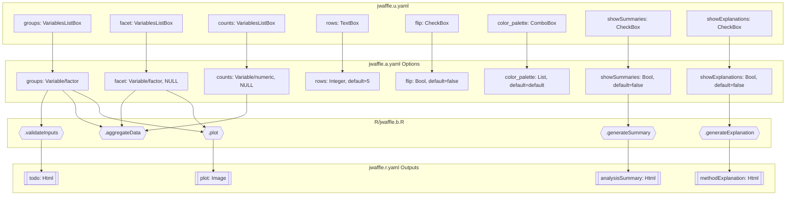
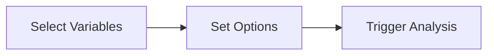
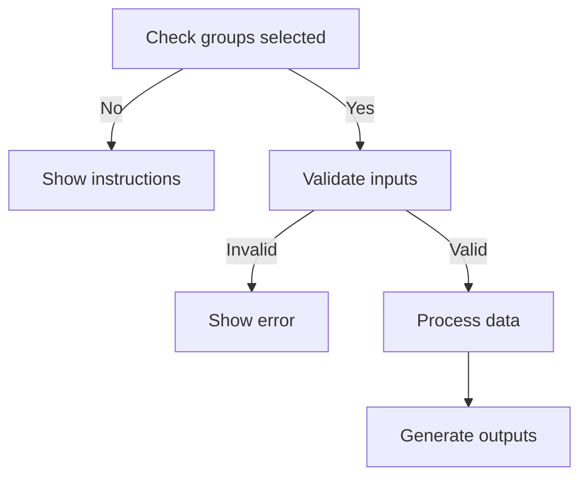
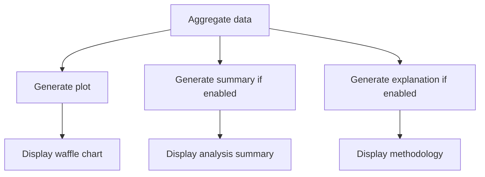

# jwaffle Function Documentation

## 1. Overview

- **Function**: `jwaffle`
- **Files**:
  - `jamovi/jwaffle.u.yaml` — UI
  - `jamovi/jwaffle.a.yaml` — Options
  - `R/jwaffle.b.R` — Backend
  - `jamovi/jwaffle.r.yaml` — Results
- **Summary**: Creates waffle charts to visualize categorical distributions using a grid of colored squares. Each square represents a fixed proportion, making it ideal for showing parts-of-whole relationships in clinical data such as disease subtypes, treatment outcomes, or risk categories. Supports faceting for comparative analysis across subgroups.

## 2. UI Controls → Options Map

| UI Control | Type | Label | Binds to Option | Default | Constraints | Visibility Rules |
|------------|------|-------|-----------------|---------|-------------|------------------|
| groups | VariablesListBox | Groups | groups | - | maxItemCount: 1 | Always visible |
| facet | VariablesListBox | Facet By (Optional) | facet | NULL | maxItemCount: 1 | Always visible |
| counts | VariablesListBox | Counts (Optional) | counts | NULL | maxItemCount: 1 | Always visible |
| rows | TextBox (number) | Number of Rows | rows | 5 | min: 1 | In Chart Options |
| flip | CheckBox | Flip Chart | flip | false | - | In Chart Options |
| color_palette | ComboBox | (no label) | color_palette | default | 7 options | In Chart Options |
| show_legend | CheckBox | (no label) | show_legend | true | - | In Chart Options |
| mytitle | TextBox (string) | Chart Title | mytitle | '' | width: large | In Labels |
| legendtitle | TextBox (string) | Legend Title | legendtitle | '' | width: large | In Labels |
| showSummaries | CheckBox | Analysis Summary | showSummaries | false | - | In Output Options |
| showExplanations | CheckBox | Show Explanations | showExplanations | false | - | In Output Options |

## 3. Options Reference (.a.yaml)

### **groups**
- **Type**: Variable
- **Default**: (required)
- **Suggested**: nominal, ordinal
- **Permitted**: factor
- **Description**: The categorical grouping variable for the waffle squares. Each category is displayed as proportional colored squares.
- **Downstream Effects**: 
  - Validates existence and type in `.validateInputs()`
  - Used for data aggregation in `.aggregateData()`
  - Determines color palette sizing
  - Main aesthetic mapping in plot

### **facet**
- **Type**: Variable
- **Default**: NULL
- **Suggested**: nominal, ordinal
- **Permitted**: factor
- **Description**: Optional variable to split the waffle chart by subgroups for comparison.
- **Downstream Effects**:
  - Adjusts plot width dynamically based on number of facet levels
  - Creates separate waffle charts per level
  - Modifies summary generation logic

### **counts**
- **Type**: Variable
- **Default**: NULL
- **Suggested**: continuous
- **Permitted**: numeric
- **Description**: Optional numeric weight variable. If not provided, counts each row equally.
- **Downstream Effects**:
  - Changes aggregation logic from `n()` to `sum(counts)`
  - Validates for non-negative values

### **rows**
- **Type**: Integer
- **Default**: 5
- **Min**: 1
- **Description**: Number of rows in the waffle chart grid
- **Downstream Effects**: Passed directly to `waffle::geom_waffle(n_rows = ...)`

### **flip**
- **Type**: Bool
- **Default**: false
- **Description**: Whether to flip the orientation of the waffle chart
- **Downstream Effects**: Passed to `waffle::geom_waffle(flip = ...)`

### **color_palette**
- **Type**: List
- **Default**: 'default'
- **Options**: default, colorblind, professional, presentation, journal, pastel, dark
- **Description**: Color scheme for the waffle squares
- **Downstream Effects**: Determines color generation in `.generateColorPalette()`

### **show_legend**
- **Type**: Bool
- **Default**: true
- **Description**: Whether to display the legend
- **Downstream Effects**: Controls `legend.position` in plot theme

### **mytitle**
- **Type**: String
- **Default**: ''
- **Description**: Custom title for the plot
- **Downstream Effects**: Added to plot caption when non-empty

### **legendtitle**
- **Type**: String
- **Default**: ''
- **Description**: Custom title for the legend
- **Downstream Effects**: Overrides default legend name when non-empty

### **showSummaries**
- **Type**: Bool
- **Default**: false
- **Description**: Generate natural language summary of results
- **Downstream Effects**: 
  - Controls visibility of `analysisSummary` output
  - Triggers `.generateSummary()` when true

### **showExplanations**
- **Type**: Bool
- **Default**: false
- **Description**: Show detailed methodology explanations
- **Downstream Effects**:
  - Controls visibility of `methodExplanation` output
  - Triggers `.generateExplanation()` when true

## 4. Backend Usage (.b.R)

### Option Access Points

#### **groups** (`self$options$groups`)
- **Code Locations**: 
  - `.calculateDataHash()` (line 68): Including in data cache key
  - `.calculateOptionsHash()` (line 106): Part of options cache
  - `.validateInputs()` (lines 234-283): Validation and clinical checks
  - `.run()` (lines 479, 523): Main execution flow
  - `.plot()` (line 566): Variable extraction for plotting
- **Logic Summary**: Core grouping variable that drives the entire visualization
- **Result Population**: Affects all outputs through plot generation and summaries

#### **facet** (`self$options$facet`)
- **Code Locations**:
  - `.init()` (lines 46-56): Dynamic plot sizing based on facet levels
  - `.validateInputs()` (lines 253-257): Validation check
  - `.run()` (line 524): Variable extraction
  - `.plot()` (lines 567, 609-627): Faceting implementation
- **Logic Summary**: Optional faceting creates multiple waffle charts
- **Result Population**: Modifies plot structure and summary format

#### **showSummaries** (`self$options$showSummaries`)
- **Code Locations**:
  - `.run()` (lines 522, 531-533): Conditional summary generation
- **Logic Summary**: Gates summary generation and display
- **Result Population**: `self$results$analysisSummary$setContent()`

#### **showExplanations** (`self$options$showExplanations`)
- **Code Locations**:
  - `.run()` (lines 522, 537-539): Conditional explanation generation
- **Logic Summary**: Gates methodology explanation display
- **Result Population**: `self$results$methodExplanation$setContent()`

### Key Functions

```r
# Validation with clinical checks
.validateInputs = function() {
    # Checks existence, type, sample size adequacy
    # Warns for small samples (n<30)
    # Warns for many categories (>10)
}

# Data aggregation
.aggregateData = function(data, groups_var, facet_var, counts_var) {
    # Groups by groups_var (+ facet_var if present)
    # Sums counts_var or counts rows
}

# Summary generation
.generateSummary = function(plotdata, groups_var, facet_var, total_cases) {
    # Creates natural language summary
    # Different logic for faceted vs simple
}
```

## 5. Results Definition (.r.yaml)

### **todo**
- **Type**: Html
- **Title**: To Do
- **Visibility**: Always visible
- **Population**: Instructions when no groups selected, success message after run

### **analysisSummary**
- **Type**: Html
- **Title**: Analysis Summary
- **Visibility**: `(showSummaries)` - only when option is true
- **Population**: `.generateSummary()` creates detailed breakdown with percentages and clinical interpretation

### **plot**
- **Type**: Image
- **Title**: Waffle Chart
- **Size**: 600x500 (default), dynamically adjusted for facets
- **Visibility**: Always when data available
- **RenderFun**: `.plot`
- **Population**: `.plot()` function creates ggplot2 waffle chart

### **methodExplanation**
- **Type**: Html
- **Title**: Methodology
- **Visibility**: `(showExplanations)` - only when option is true
- **Population**: `.generateExplanation()` provides waffle chart methodology and clinical applications

## 6. Data Flow Diagram (UI → Options → Backend → Results)



## 7. Execution Sequence (User Action → Results)

### User Input Flow


### Decision Logic


### Result Processing


**Step-by-step execution flow:**

1. **User selects groups variable** → UI updates `groups` option
2. **Backend validates selection** → Checks variable exists, is categorical, has 2+ levels
3. **Data aggregation** → Groups data by categories (+ facets if selected)
4. **Clinical validation** → Warns if sample size <30 or categories <5 cases
5. **Plot generation** → Creates waffle chart with selected palette and settings
6. **Conditional summaries** → If `showSummaries=true`, generates natural language interpretation
7. **Conditional explanations** → If `showExplanations=true`, shows methodology guide
8. **Display results** → Shows visible outputs per visibility rules

## 8. Change Impact Guide

### **groups** (Required)
- **If changed**: Complete recalculation, new plot, updated summaries
- **Common pitfalls**: Must be categorical, needs 2+ categories
- **Recommended**: Use factors with clear labels

### **facet** (Optional)
- **If changed**: Plot width adjusts, separate charts per level, modified summary
- **Common pitfalls**: Too many levels create cramped display
- **Recommended**: Use for 2-4 subgroups

### **counts** (Optional)
- **If changed**: Switches from row counts to weighted sums
- **Common pitfalls**: Negative values trigger warning
- **Recommended**: Leave empty for patient-level data

### **rows**
- **If changed**: Alters grid layout (default 5 creates 5x20 grid)
- **Common pitfalls**: Too few rows may lose precision
- **Recommended**: 5-10 rows for clarity

### **color_palette**
- **If changed**: Updates square colors immediately
- **Common pitfalls**: Some palettes less distinguishable
- **Recommended**: 'colorblind' for accessibility

### **showSummaries/showExplanations**
- **If changed**: Toggles output sections without recalculation
- **Performance**: Minimal impact, text generation is fast
- **Recommended**: Enable for clinical interpretation

## 9. Example Usage

### Example Dataset Requirements
- **Variables needed**:
  - At least one categorical variable (2+ levels) for `groups`
  - Optional: Second categorical for `facet`
  - Optional: Numeric variable for `counts`

### Example Option Payload
```yaml
groups: "TumorGrade"
facet: "TreatmentArm"
counts: NULL
rows: 5
flip: false
color_palette: "colorblind"
show_legend: true
mytitle: "Tumor Grade Distribution"
legendtitle: "Grade"
showSummaries: true
showExplanations: false
```

### Expected Outputs
- **plot**: 10x10 waffle chart showing tumor grade proportions, faceted by treatment arm
- **analysisSummary**: Natural language summary describing grade distributions within each arm
- **todo**: Success message
- **methodExplanation**: Hidden (showExplanations=false)

## 10. Appendix (Schemas & Snippets)

### Result Schemas

#### todo (Html)
- Simple HTML content for instructions/status
- No structured schema

#### analysisSummary (Html)
- HTML formatted text including:
  - Distribution percentages
  - Dominant categories
  - Clinical interpretation
  - Sample size notes

#### plot (Image)
- ggplot2 object rendered as image
- Dynamic sizing based on facets
- Caption includes sample size info

#### methodExplanation (Html)
- Static HTML content explaining:
  - What waffle charts are
  - Clinical applications
  - Interpretation guidelines
  - Best practices

### Key Code Snippets

**Option validation pattern:**
```r
if (is.null(self$options$groups) || self$options$groups == "") {
    stop("Please specify a grouping variable")
}
if (!self$options$groups %in% names(self$data)) {
    stop(paste("Variable not found:", self$options$groups))
}
```

**Conditional result population:**
```r
if (self$options$showSummaries) {
    summary_content <- private$.generateSummary(...)
    self$results$analysisSummary$setContent(summary_content)
}
```

**Cache management pattern:**
```r
.calculateOptionsHash = function() {
    options_list <- list(
        groups = self$options$groups,
        showSummaries = self$options$showSummaries,
        # ... all options affecting output
    )
    return(paste(options_list, collapse = "_"))
}
```

### Performance Notes
- Uses sophisticated caching system to avoid redundant calculations
- Data and options hashed separately for efficient cache invalidation
- Plot cached and reused when only visibility options change
- Aggregation performed only when needed for summaries