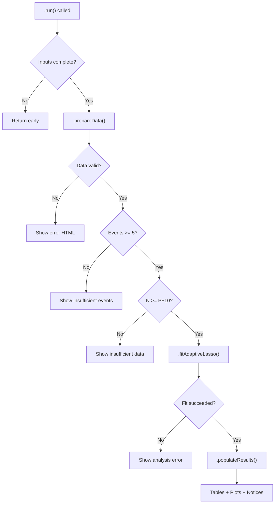

# Adaptive LASSO for Cox Models — Developer Documentation

## 1. Overview

- **Function**: `adaptivelasso`
- **Files**:
  - `jamovi/adaptivelasso.u.yaml` — UI
  - `jamovi/adaptivelasso.a.yaml` — Options (42 total)
  - `R/adaptivelasso.b.R` — Backend (~1810 lines)
  - `jamovi/adaptivelasso.r.yaml` — Results (8 tables, 6 plots, 3 HTML)
- **Summary**: Adaptive LASSO for Cox proportional hazards models with data-driven penalty weights for consistent variable selection (oracle property). Supports 5 weight methods (ridge, univariate Cox, full Cox, correlation, equal), cross-validation with 2 performance measures (deviance, C-index), stability selection, model diagnostics (PH test, influence, GOF), risk stratification, baseline survival estimation, and 6 plot types.

## 1a. Changelog

- **Date**: 2026-03-10
- **Summary**: Complete documentation written from source code analysis
- **Changes**:
  - Options: 42 options documented; no `intercept` option exists; `cv_measure` only supports `deviance` and `C`
  - Backend: All method names verified against actual `.b.R` code
  - Results: 16 output items (3 HTML, 8 tables, 6 images)
  - Diagrams: Complete Mermaid flow diagrams

---

## 2. UI Controls → Options Map

### Variable Supplier

| UI Control | Type | Binds to Option | Defaults & Constraints | Visibility/Enable |
|-----------|------|----------------|----------------------|-------------------|
| `time` | VariablesListBox (max 1) | `time` | — | Always |
| `event` | VariablesListBox (max 1) | `event` | — | Always |
| `predictors` | VariablesListBox | `predictors` | — | Always |
| `strata` | VariablesListBox (max 1) | `strata` | — | Always |
| `event_level` | LevelSelector | `event_level` | Levels from `event` var | Always |

### Model Parameters (collapsed: false)

| UI Control | Type | Binds to Option | Defaults & Constraints | Visibility/Enable |
|-----------|------|----------------|----------------------|-------------------|
| `weight_method` | ComboBox | `weight_method` | Default: `ridge`. Options: ridge/univariate/cox/correlation/equal | Always |
| `alpha` | TextBox (number) | `alpha` | Default: 1.0, Range: 0.0–1.0 | Always |
| `gamma` | TextBox (number) | `gamma` | Default: 1.0, Range: 0.1–5.0 | Always |
| `cv_folds` | TextBox (number) | `cv_folds` | Default: 10, Range: 3–20 | Always |
| `cv_measure` | ComboBox | `cv_measure` | Default: `deviance`. Options: deviance/C | Always |

### Stability Selection (collapsed: true)

| UI Control | Type | Binds to Option | Defaults & Constraints | Visibility/Enable |
|-----------|------|----------------|----------------------|-------------------|
| `stability_selection` | CheckBox | `stability_selection` | Default: false | Always |
| `stability_threshold` | TextBox (number) | `stability_threshold` | Default: 0.6, Range: 0.5–0.95 | Enable: `(stability_selection)` |
| `bootstrap_samples` | TextBox (number) | `bootstrap_samples` | Default: 100, Range: 50–1000 | Enable: `(stability_selection)` |
| `subsampling_ratio` | TextBox (number) | `subsampling_ratio` | Default: 0.8, Range: 0.5–0.95 | Enable: `(stability_selection)` |

### Risk Groups and Predictions (collapsed: true)

| UI Control | Type | Binds to Option | Defaults & Constraints | Visibility/Enable |
|-----------|------|----------------|----------------------|-------------------|
| `risk_groups` | TextBox (number) | `risk_groups` | Default: 3, Range: 2–10 | Always |
| `time_points` | TextBox (string) | `time_points` | Default: "1, 2, 5" | Enable: `(baseline_survival)` |
| `baseline_survival` | CheckBox | `baseline_survival` | Default: true | Always |

### Tables (collapsed: true)

| UI Control | Type | Binds to Option | Default |
|-----------|------|----------------|---------|
| `suitabilityCheck` | CheckBox | `suitabilityCheck` | true |
| `show_coefficients` | CheckBox | `show_coefficients` | true |
| `show_selection_path` | CheckBox | `show_selection_path` | true |
| `show_cv_results` | CheckBox | `show_cv_results` | true |
| `show_diagnostics` | CheckBox | `show_diagnostics` | true |

### Plots (collapsed: true)

| UI Control | Type | Binds to Option | Default | Visibility/Enable |
|-----------|------|----------------|---------|-------------------|
| `plot_selection_path` | CheckBox | `plot_selection_path` | true | Always |
| `plot_cv_curve` | CheckBox | `plot_cv_curve` | true | Always |
| `plot_stability` | CheckBox | `plot_stability` | false | Enable: `(stability_selection)` |
| `plot_survival_curves` | CheckBox | `plot_survival_curves` | false | Always |
| `plot_baseline_hazard` | CheckBox | `plot_baseline_hazard` | false | Enable: `(baseline_survival)` |
| `plot_diagnostics` | CheckBox | `plot_diagnostics` | false | Always |

### Diagnostics (collapsed: true)

| UI Control | Type | Binds to Option | Default |
|-----------|------|----------------|---------|
| `proportional_hazards` | CheckBox | `proportional_hazards` | true |
| `influence_diagnostics` | CheckBox | `influence_diagnostics` | false |
| `goodness_of_fit` | CheckBox | `goodness_of_fit` | true |

### Advanced Options (collapsed: true)

| UI Control | Type | Binds to Option | Defaults & Constraints | Visibility/Enable |
|-----------|------|----------------|----------------------|-------------------|
| `lambda_sequence` | ComboBox | `lambda_sequence` | Default: `auto`. Options: auto/custom/single | Always |
| `lambda_min_ratio` | TextBox (number) | `lambda_min_ratio` | Default: 0.001, Range: 1e-6–0.1 | Always |
| `n_lambda` | TextBox (number) | `n_lambda` | Default: 100, Range: 10–500 | Always |
| `lambda_custom_max` | TextBox (number) | `lambda_custom_max` | Default: 1.0, Range: 1e-6–1000 | Enable: `(lambda_sequence:custom)` |
| `lambda_custom_min` | TextBox (number) | `lambda_custom_min` | Default: 0.001, Range: 1e-8–100 | Enable: `(lambda_sequence:custom)` |
| `lambda_single` | TextBox (number) | `lambda_single` | Default: 0.01, Range: 1e-8–1000 | Enable: `(lambda_sequence:single)` |
| `tie_method` | ComboBox | `tie_method` | Default: `breslow`. Options: breslow/efron | Always |
| `standardize` | CheckBox | `standardize` | Default: true | Always |
| `convergence_threshold` | TextBox (number) | `convergence_threshold` | Default: 1e-7, Range: 1e-10–1e-4 | Always |
| `max_iterations` | TextBox (number) | `max_iterations` | Default: 10000, Range: 1000–100000 | Always |
| `random_seed` | TextBox (number) | `random_seed` | Default: 123, Range: 1–999999 | Always |
| `parallel_computing` | CheckBox | `parallel_computing` | Default: false | Always |
| `n_cores` | TextBox (number) | `n_cores` | Default: 2, Range: 1–8 | Enable: `(parallel_computing)` |

---

## 3. Options Reference (.a.yaml)

### Input Variables (6)

| Name | Type | Default | Description | Downstream Effects |
|------|------|---------|------------|-------------------|
| `data` | Data | — | Data frame | Used in `.prepareData()` |
| `time` | Variable | — | Time to event (numeric) | Used in `.prepareData()` to create `Surv` object |
| `event` | Variable | — | Event indicator (factor/numeric) | Processed by `.encodeEventIndicator()` |
| `event_level` | Level | — | Level treated as event | Used in `.encodeEventIndicator()` for binary encoding |
| `predictors` | Variables | — | Candidate predictors | Used in `.prepareData()` to build `model.matrix` |
| `strata` | Variable | — | Stratification variable | Used in `.prepareData()` and passed to `glmnet::stratifySurv()` |

### Model Specification (4)

| Name | Type | Default | Description | Downstream Effects |
|------|------|---------|------------|-------------------|
| `suitabilityCheck` | Bool | true | EPV/missing data assessment | Gates `.assessSuitability()` call; controls `suitabilityReport` visibility |
| `weight_method` | List | ridge | Weight method: ridge/univariate/cox/correlation/equal | Controls branch in `.calculateAdaptiveWeights()` |
| `alpha` | Number | 1.0 | Elastic net mixing (1=LASSO, 0=ridge) | Passed to `glmnet::cv.glmnet(alpha=...)` |
| `gamma` | Number | 1.0 | Adaptive weight power | Used in `.calculateAdaptiveWeights()`: `weights = 1/(|coef|+1e-8)^gamma` |

### Cross-Validation (8)

| Name | Type | Default | Description | Downstream Effects |
|------|------|---------|------------|-------------------|
| `cv_folds` | Integer | 10 | Number of CV folds | Passed to `cv.glmnet(nfolds=...)` |
| `cv_measure` | List | deviance | CV metric: deviance/C | Passed to `cv.glmnet(type.measure=...)` |
| `lambda_sequence` | List | auto | Lambda mode: auto/custom/single | Controls `.buildLambdaSequence()` return value |
| `lambda_custom_max` | Number | 1.0 | Max lambda (custom mode) | Used in `.buildLambdaSequence()` when mode=custom |
| `lambda_custom_min` | Number | 0.001 | Min lambda (custom mode) | Used in `.buildLambdaSequence()` when mode=custom |
| `lambda_single` | Number | 0.01 | Single lambda value | Used in `.buildLambdaSequence()` when mode=single |
| `lambda_min_ratio` | Number | 0.001 | Lambda min ratio (auto mode) | Passed to `cv.glmnet(lambda.min.ratio=...)` |
| `n_lambda` | Integer | 100 | Number of lambdas | Passed to `cv.glmnet(nlambda=...)` or used in custom sequence generation |

### Stability Selection (4)

| Name | Type | Default | Description | Downstream Effects |
|------|------|---------|------------|-------------------|
| `stability_selection` | Bool | false | Enable stability selection | Gates `.stabilitySelection()` call and `stabilityResults` table |
| `stability_threshold` | Number | 0.6 | Min selection frequency | Used in `.stabilitySelection()` for stable/unstable classification |
| `bootstrap_samples` | Integer | 100 | Number of bootstrap samples | Controls loop count in `.stabilitySelection()` |
| `subsampling_ratio` | Number | 0.8 | Subsample proportion | Controls `n_sub` in `.stabilitySelection()` |

### Diagnostics (3)

| Name | Type | Default | Description | Downstream Effects |
|------|------|---------|------------|-------------------|
| `proportional_hazards` | Bool | true | PH assumption test | Controls `cox.zph()` call in `.calculateDiagnostics()` |
| `influence_diagnostics` | Bool | false | Influence analysis | Controls dfbeta computation in `.calculateDiagnostics()` |
| `goodness_of_fit` | Bool | true | GOF assessment | Controls `performanceMetrics` table visibility |

### Risk & Prediction (3)

| Name | Type | Default | Description | Downstream Effects |
|------|------|---------|------------|-------------------|
| `risk_groups` | Integer | 3 | Number of risk groups | Used in `.assignRiskGroups()` for quantile-based stratification |
| `time_points` | String | "1, 2, 5" | Prediction time points (comma-separated) | Parsed in `.populatePredictions()` |
| `baseline_survival` | Bool | true | Estimate baseline survival | Gates `.populatePredictions()` and `predictions` table |

### Output Toggles (4)

| Name | Type | Default | Description | Downstream Effects |
|------|------|---------|------------|-------------------|
| `show_coefficients` | Bool | true | Show coefficients table | Controls `coefficients` and `riskGroups` table visibility |
| `show_selection_path` | Bool | true | Show regularization path | Controls `selectionPath` table visibility |
| `show_cv_results` | Bool | true | Show CV results | Controls `cvResults` table visibility |
| `show_diagnostics` | Bool | true | Show diagnostics | Controls `modelDiagnostics` table visibility |

### Plot Toggles (6)

| Name | Type | Default | Description | Downstream Effects |
|------|------|---------|------------|-------------------|
| `plot_selection_path` | Bool | true | Coefficient paths plot | Controls `pathPlot` visibility and `.plotSelectionPath()` |
| `plot_cv_curve` | Bool | true | CV curve plot | Controls `cvPlot` visibility and `.plotCVCurve()` |
| `plot_stability` | Bool | false | Stability plot | Controls `stabilityPlot` visibility and `.plotStability()` |
| `plot_survival_curves` | Bool | false | Risk group KM curves | Controls `survivalPlot` visibility and `.plotSurvivalCurves()` |
| `plot_baseline_hazard` | Bool | false | Baseline hazard plot | Controls `baselineHazardPlot` visibility and `.plotBaselineHazard()` |
| `plot_diagnostics` | Bool | false | Diagnostic plots | Controls `diagnosticsPlot` visibility and `.plotDiagnosticsData()` |

### Advanced (7)

| Name | Type | Default | Description | Downstream Effects |
|------|------|---------|------------|-------------------|
| `tie_method` | List | breslow | Tied times: breslow/efron | Passed to `coxph(ties=...)` in `.calculateDiagnostics()` |
| `standardize` | Bool | true | Standardize predictors | Controls `scale()` call in `.prepareData()` |
| `parallel_computing` | Bool | false | Enable parallel CV | Controls `doParallel` setup in `.fitAdaptiveLasso()` |
| `n_cores` | Integer | 2 | CPU cores | Passed to `makePSOCKcluster()` |
| `convergence_threshold` | Number | 1e-7 | Convergence criterion | Passed to `glmnet(thresh=...)` |
| `max_iterations` | Integer | 10000 | Max iterations | Passed to `glmnet(maxit=...)` |
| `random_seed` | Integer | 123 | Random seed | Used in `set.seed()` for CV folds and stability selection |

---

## 4. Backend Usage (.b.R)

### `.init()`
- **Checks**: `self$data`, `self$options$time`, `self$options$event`, `length(self$options$predictors)`
- **If missing**: Shows HTML instructions via `self$results$instructions$setContent()`
- **If present**: Calls `.initResults()` to set table/plot visibility

### `.run()`
Main pipeline:
1. Validate inputs (return if missing)
2. Call `.hideMessage()` to clear instructions
3. `.prepareData()` → validate time/event, build model matrix
4. Check required packages (`glmnet`, `survival`)
5. `.assessSuitability()` if `suitabilityCheck` is TRUE
6. `.fitAdaptiveLasso()` → main model fitting (wrapped in `tryCatch`)
7. `.populateResults()` → fill all tables, set plot states, render notices

### `.prepareData()`
- **Options used**: `time`, `event`, `event_level`, `predictors`, `strata`, `standardize`
- **Logic**: Creates `model.matrix(~ . - 1, data)`, removes constant columns, validates positive times, requires `n >= p + 10`, standardizes if requested
- **Returns**: List with `x` (design matrix), `y` (Surv object), `time`, `event`, `n_obs`, `n_events`, `pred_names`, `strata`
- **Result population**: Shows error HTML via `.showMessage()` on failure

### `.encodeEventIndicator(event_raw)`
- **Options used**: `event_level`
- **Logic**: Handles factor/character (event_level or second level default), numeric (0/1 or event_level), multi-level validation
- **Returns**: `list(ok, values, event_level)` or `list(ok=FALSE, message)`

### `.calculateAdaptiveWeights(cox_data)`
- **Options used**: `weight_method`, `gamma`
- **Logic branches**:
  - `equal`: returns `rep(1, n_vars)`
  - `ridge`: `glmnet(alpha=0)` then `coef(ridge_fit, s=lambda[n/4])`
  - `univariate`: individual `coxph()` per variable (with strata if applicable)
  - `cox`: full `coxph()` if `p < n/3`, fallback to ridge otherwise
  - `correlation`: univariate Cox z-statistics
- **Weight formula**: `1/(|coef|+1e-8)^gamma`, normalized by max weight
- **Returns**: Numeric vector of penalty weights

### `.fitAdaptiveLasso(cox_data)`
- **Options used**: `parallel_computing`, `n_cores`, `alpha`, `cv_folds`, `cv_measure`, `convergence_threshold`, `max_iterations`, `lambda_sequence`, `lambda_min_ratio`, `n_lambda`, `stability_selection`
- **Logic**:
  - Sets up parallel cluster if requested
  - Calls `.calculateAdaptiveWeights()`
  - Validates `cv_measure` (only "deviance" and "C")
  - Calls `.buildLambdaSequence()`
  - If single lambda mode: `glmnet::glmnet()` directly
  - Else: `glmnet::cv.glmnet()` with penalty.factor=weights
  - Extracts `lambda.min`, `lambda.1se`, coefficients
  - Calls `.calculateDiagnostics()`
  - Calls `.stabilitySelection()` if enabled
- **Returns**: List with `cv_fit`, `full_fit`, `lambda_min`, `lambda_1se`, `coef_min`, `coef_1se`, `adaptive_weights`, `diagnostics`, `stability`

### `.calculateDiagnostics(cox_data, coefficients, lambda)`
- **Options used**: `tie_method`, `proportional_hazards`, `influence_diagnostics`
- **Logic**: Refits unpenalized Cox on selected variables, computes concordance/loglik/AIC, optionally runs `cox.zph()` and dfbeta residuals
- **Result population**: Stores results in diagnostics list for later table population

### `.stabilitySelection(cox_data, y_glmnet, adaptive_weights, parallel_enabled)`
- **Options used**: `bootstrap_samples`, `subsampling_ratio`, `random_seed`, `alpha`, `cv_folds`
- **Logic**: Bootstrap subsampling loop, fits `glmnet` + `cv.glmnet` per sample, records selected variables, computes selection frequencies
- **Returns**: `list(selection_frequencies, stable_variables, selection_matrix, n_failed)`

### `.populateResults(adaptive_results, cox_data)`
Orchestrates all output population:
- Calls `.populateCoefficients()` → `self$results$coefficients`
- Calls `.populateSelectionPath()` → `self$results$selectionPath`
- Calls `.populateCVResults()` → `self$results$cvResults`
- Calls `.populateStabilityResults()` → `self$results$stabilityResults`
- Calls `.populateDiagnostics()` → `self$results$modelDiagnostics`
- Calls `.populatePerformance()` → `self$results$performanceMetrics`
- Calls `.populateRiskGroups()` → `self$results$riskGroups`
- Calls `.populatePredictions()` → `self$results$predictions`
- Sets plot states: `.plotSelectionPath()`, `.plotCVCurve()`, `.plotStability()`, etc.
- Generates notices via `.addNotice()` + `.renderNotices()`

### Notice System
- `.addNotice(type, title, content)` — Appends to `.noticeList` (types: ERROR, STRONG_WARNING, WARNING, INFO)
- `.renderNotices()` — Generates styled HTML and sets `self$results$notices$setContent()`
- **Notices generated**: No variables selected, low EPV, PH violation, bootstrap failures, analysis complete summary

---

## 5. Results Definition (.r.yaml)

### HTML Outputs

| ID | Title | Visibility | Description |
|----|-------|-----------|-------------|
| `instructions` | Instructions | `false` (toggled by `.showMessage()`) | HTML welcome/error messages |
| `notices` | Important Information | Always | HTML notices (warnings, info) |
| `suitabilityReport` | Data Suitability Assessment | `(suitabilityCheck)` | EPV calculation, missing data report |

### Tables

| ID | Title | Visibility | Columns | Population Method |
|----|-------|-----------|---------|------------------|
| `coefficients` | Selected Variables and Coefficients | `(show_coefficients)` | variable(text), coefficient(zto), exp_coefficient(zto=HR), std_error(zto), lower_ci(zto), upper_ci(zto), adaptive_weight(zto) | `.populateCoefficients()` |
| `selectionPath` | Regularization Path Summary | `(show_selection_path)` | step(int), lambda(zto), n_selected(int), deviance(zto), cv_error(zto) | `.populateSelectionPath()` |
| `cvResults` | Cross-Validation Results | `(show_cv_results)` | criterion(text), lambda_min(zto), lambda_1se(zto), cv_error_min(zto), cv_error_1se(zto), n_variables_min(int), n_variables_1se(int) | `.populateCVResults()` |
| `stabilityResults` | Stability Selection Results | `(stability_selection)` | variable(text), selection_frequency(pc), stability_score(zto), stable_selection(text), error_bound(zto) | `.populateStabilityResults()` |
| `modelDiagnostics` | Model Diagnostics | `(show_diagnostics)` | diagnostic(text), statistic(zto), p_value(zto), interpretation(text) | `.populateDiagnostics()` |
| `performanceMetrics` | Model Performance | `(goodness_of_fit)` | metric(text), value(zto), confidence_interval(text), description(text) | `.populatePerformance()` |
| `riskGroups` | Risk Group Analysis | `(show_coefficients)` | risk_group(text), n_subjects(int), n_events(int), median_survival(zto), survival_range(text), hazard_ratio(zto) | `.populateRiskGroups()` |
| `predictions` | Survival Predictions | `(baseline_survival && time_points != "")` | time_point(zto), baseline_survival(zto), survival_lower(zto), survival_upper(zto) | `.populatePredictions()` |

### Images (Plots)

| ID | Title | Visibility | renderFun | Size | State Setter |
|----|-------|-----------|-----------|------|-------------|
| `pathPlot` | Coefficient Paths | `(plot_selection_path)` | `.renderPathPlot` | 600x500 | `.plotSelectionPath()` |
| `cvPlot` | Cross-Validation Curve | `(plot_cv_curve)` | `.renderCVPlot` | 500x400 | `.plotCVCurve()` |
| `stabilityPlot` | Stability Selection | `(plot_stability)` | `.renderStabilityPlot` | 500x400 | `.plotStability()` |
| `survivalPlot` | Risk Group Survival Curves | `(plot_survival_curves)` | `.renderSurvivalPlot` | 500x400 | `.plotSurvivalCurves()` |
| `baselineHazardPlot` | Baseline Hazard Function | `(plot_baseline_hazard)` | `.renderBaselineHazardPlot` | 500x400 | `.plotBaselineHazard()` |
| `diagnosticsPlot` | Model Diagnostics | `(plot_diagnostics)` | `.renderDiagnosticsPlot` | 600x500 | `.plotDiagnosticsData()` |

---

## 6. Data Flow Diagram (UI → Options → Backend → Results)

```mermaid
flowchart TD
  subgraph UI[".u.yaml Controls"]
    U_time["time: VariablesListBox"]
    U_event["event: VariablesListBox"]
    U_preds["predictors: VariablesListBox"]
    U_strata["strata: VariablesListBox"]
    U_evlvl["event_level: LevelSelector"]
    U_wm["weight_method: ComboBox"]
    U_alpha["alpha: TextBox"]
    U_gamma["gamma: TextBox"]
    U_cvf["cv_folds: TextBox"]
    U_cvm["cv_measure: ComboBox"]
    U_ss["stability_selection: CheckBox"]
    U_st["stability_threshold: TextBox"]
    U_bs["bootstrap_samples: TextBox"]
    U_rg["risk_groups: TextBox"]
    U_tp["time_points: TextBox"]
    U_bsurv["baseline_survival: CheckBox"]
    U_suit["suitabilityCheck: CheckBox"]
    U_ph["proportional_hazards: CheckBox"]
    U_infl["influence_diagnostics: CheckBox"]
    U_gof["goodness_of_fit: CheckBox"]
    U_ls["lambda_sequence: ComboBox"]
    U_tm["tie_method: ComboBox"]
    U_std["standardize: CheckBox"]
    U_pc["parallel_computing: CheckBox"]
  end

  subgraph B["R/adaptivelasso.b.R"]
    B_prep{{".prepareData()"}}
    B_suit{{".assessSuitability()"}}
    B_fit{{".fitAdaptiveLasso()"}}
    B_wt{{".calculateAdaptiveWeights()"}}
    B_lam{{".buildLambdaSequence()"}}
    B_diag{{".calculateDiagnostics()"}}
    B_stab{{".stabilitySelection()"}}
    B_pop{{".populateResults()"}}
  end

  subgraph RY[".r.yaml Outputs"]
    R_inst[["instructions: Html"]]
    R_notice[["notices: Html"]]
    R_suit[["suitabilityReport: Html"]]
    R_coef[["coefficients: Table"]]
    R_path[["selectionPath: Table"]]
    R_cv[["cvResults: Table"]]
    R_stab[["stabilityResults: Table"]]
    R_diag[["modelDiagnostics: Table"]]
    R_perf[["performanceMetrics: Table"]]
    R_risk[["riskGroups: Table"]]
    R_pred[["predictions: Table"]]
    R_pathP[["pathPlot: Image"]]
    R_cvP[["cvPlot: Image"]]
    R_stabP[["stabilityPlot: Image"]]
    R_survP[["survivalPlot: Image"]]
    R_hazP[["baselineHazardPlot: Image"]]
    R_diagP[["diagnosticsPlot: Image"]]
  end

  U_time --> B_prep
  U_event --> B_prep
  U_preds --> B_prep
  U_strata --> B_prep
  U_evlvl --> B_prep
  U_std --> B_prep
  U_suit --> B_suit
  U_wm --> B_wt
  U_gamma --> B_wt
  U_alpha --> B_fit
  U_cvf --> B_fit
  U_cvm --> B_fit
  U_ls --> B_lam
  U_pc --> B_fit
  U_tm --> B_diag
  U_ph --> B_diag
  U_infl --> B_diag
  U_ss --> B_stab
  U_st --> B_stab
  U_bs --> B_stab

  B_prep --> B_suit
  B_prep --> B_fit
  B_wt --> B_fit
  B_lam --> B_fit
  B_fit --> B_diag
  B_fit --> B_stab
  B_fit --> B_pop

  B_suit --> R_suit
  B_pop --> R_coef
  B_pop --> R_path
  B_pop --> R_cv
  B_pop --> R_stab
  B_pop --> R_diag
  B_pop --> R_perf
  B_pop --> R_risk
  B_pop --> R_pred
  B_pop --> R_notice
  B_pop --> R_pathP
  B_pop --> R_cvP
  B_pop --> R_stabP
  B_pop --> R_survP
  B_pop --> R_hazP
  B_pop --> R_diagP
```



---

## 7. Execution Sequence

### Step-by-step flow

1. **User assigns variables** → UI updates `time`, `event`, `predictors` options
2. **`.init()` runs** → If inputs missing, show HTML instructions; otherwise call `.initResults()` to set visibility
3. **`.run()` executes** → Validate inputs, hide instructions
4. **`.prepareData()`** → Build model.matrix, encode event, validate times (>0), remove constant columns, standardize, create Surv object
5. **Package check** → Verify `glmnet` and `survival` are available
6. **`.assessSuitability()`** → If `suitabilityCheck=TRUE`, compute EPV, check missing data, render HTML report
7. **`.fitAdaptiveLasso()`**:
   a. Setup parallel computing if enabled
   b. `.calculateAdaptiveWeights()` — compute penalty.factor based on `weight_method`
   c. `.buildLambdaSequence()` — generate lambda grid based on `lambda_sequence`
   d. Fit model via `cv.glmnet()` (or `glmnet()` for single lambda)
   e. Extract `lambda.min`, `lambda.1se`, coefficients
   f. `.calculateDiagnostics()` — refit unpenalized Cox, PH test, influence
   g. `.stabilitySelection()` — if enabled, run bootstrap loop
8. **`.populateResults()`**:
   a. Fill 8 tables based on display toggles
   b. Set plot states (data.frames only, protobuf-safe)
   c. Generate notices (EPV warnings, PH violations, completion info)
   d. Call `.renderNotices()` to generate HTML
9. **Render functions called lazily** — `.renderPathPlot()`, `.renderCVPlot()`, etc. read from `image$state`

### Decision Logic



---

## 8. Change Impact Guide

### Key Option Changes

| Option Changed | What Recalculates | Outputs Affected | Performance Impact |
|---------------|-------------------|-----------------|-------------------|
| `weight_method` | Adaptive weights, full model refit | coefficients, all tables, all plots | Moderate (ridge/cox add extra glmnet/coxph fit) |
| `alpha` | CV and full fit | coefficients, CV results, path, all plots | Low |
| `gamma` | Adaptive weights only | coefficients, all dependent tables | Low |
| `cv_folds` | CV only | cvResults, selectionPath | Linear with folds |
| `cv_measure` | CV metric only | cvResults, selectionPath notes | Negligible |
| `stability_selection` | Bootstrap loop | stabilityResults, stabilityPlot | **High** — O(bootstrap_samples * cv_folds) glmnet fits |
| `risk_groups` | Risk stratification | riskGroups, survivalPlot | Low |
| `lambda_sequence` | Lambda grid | cvResults, selectionPath, pathPlot | Varies |
| `parallel_computing` | CV/stability parallelism | None (same results) | Reduces wall time |

### Common Pitfalls

- **`cv_measure: C` with few events**: C-index can be unstable; prefer deviance
- **`weight_method: cox` with p > n/3**: Falls back to ridge silently
- **`alpha: 0`**: Pure ridge — no variable selection occurs (all variables retained)
- **`stability_selection` + large `bootstrap_samples`**: Very slow; use `parallel_computing`
- **`lambda_sequence: single`**: No CV curve available; cvPlot shows "Single lambda mode" message
- **`risk_groups` > unique LP values**: Groups collapse; note added to riskGroups table

### Recommended Defaults

The default configuration is well-chosen for most clinical datasets:
- Ridge weights provide stable initial estimates
- alpha=1 gives pure LASSO selection
- gamma=1 is the standard recommendation from Zou (2006)
- 10-fold CV with deviance is computationally efficient and standard
- Stability selection disabled by default (enable for publication-quality models)

---

## 9. Example Usage

### Dataset Requirements
- Minimum: time variable (positive numeric), event indicator (binary or factor), 2+ predictors
- Recommended: n >= 50, events >= 10, EPV >= 5
- Test data: `data/adaptivelasso_test_data.rda` (n=180, 12 predictors, ~55% events)

### Example Option Payload
```yaml
time: "time"
event: "event"
event_level: ""
predictors: ["age", "tumor_size", "ki67_index", "stage", "grade", "treatment"]
strata: "center"
weight_method: "ridge"
alpha: 1.0
gamma: 1.0
cv_folds: 10
cv_measure: "deviance"
stability_selection: true
stability_threshold: 0.6
bootstrap_samples: 100
show_coefficients: true
show_diagnostics: true
plot_selection_path: true
plot_cv_curve: true
plot_stability: true
```

### Expected Outputs
- **coefficients table**: 3-5 selected variables with HR, SE, CI
- **cvResults table**: lambda.min and lambda.1se with CV error
- **stabilityResults table**: All variables with selection frequencies
- **modelDiagnostics table**: Concordance, AIC, PH test
- **pathPlot**: Coefficient paths converging to zero as lambda increases
- **cvPlot**: U-shaped curve with vertical lines at lambda.min/1se
- **stabilityPlot**: Bar chart with horizontal threshold line

---

## 10. Appendix: Table Column Schemas

### coefficients
| Column | Type | Format | Source |
|--------|------|--------|--------|
| variable | text | — | `cox_data$pred_names[idx]` |
| coefficient | number | zto | `diag$cox_coefs[j]` (from refitted Cox) |
| exp_coefficient | number | zto | `exp(coef_val)` |
| std_error | number | zto | `diag$cox_se[j]` |
| lower_ci | number | zto | `coef - 1.96*SE` |
| upper_ci | number | zto | `coef + 1.96*SE` |
| adaptive_weight | number | zto | `adaptive_results$adaptive_weights[idx]` |

**Note**: "Coefficients/SE/CI from unpenalized Cox refit on selected variables. CIs do not account for the variable selection step and may be optimistically narrow."

### stabilityResults
| Column | Type | Format | Source |
|--------|------|--------|--------|
| variable | text | — | Variable name |
| selection_frequency | number | pc | `colMeans(selection_matrix)` |
| stability_score | number | zto | `freq / threshold` |
| stable_selection | text | — | "Stable" if freq >= threshold |
| error_bound | number | zto | PFER = q^2 / ((2*threshold-1)*p) |

### performanceMetrics
| Column | Type | Format | Source |
|--------|------|--------|--------|
| metric | text | — | Metric name |
| value | number | zto | Metric value |
| confidence_interval | text | — | "[lower, upper]" for C-index |
| description | text | — | Interpretation text |

**Note**: "The C-index evaluates performance on the same data used for variable selection, which may overestimate true out-of-sample performance due to optimism."
