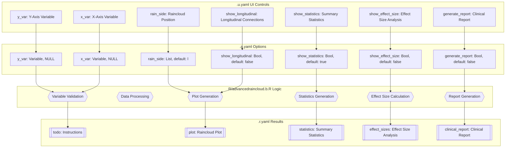
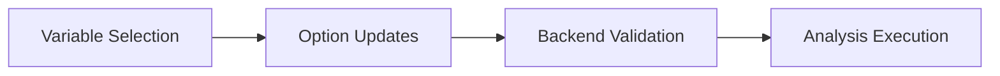
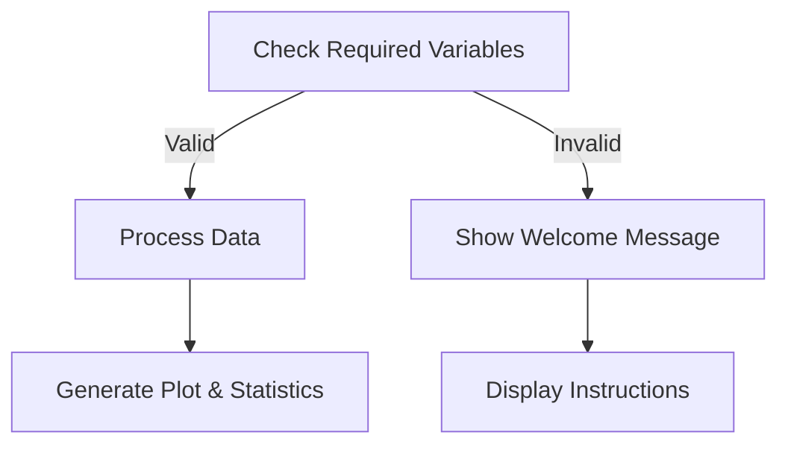
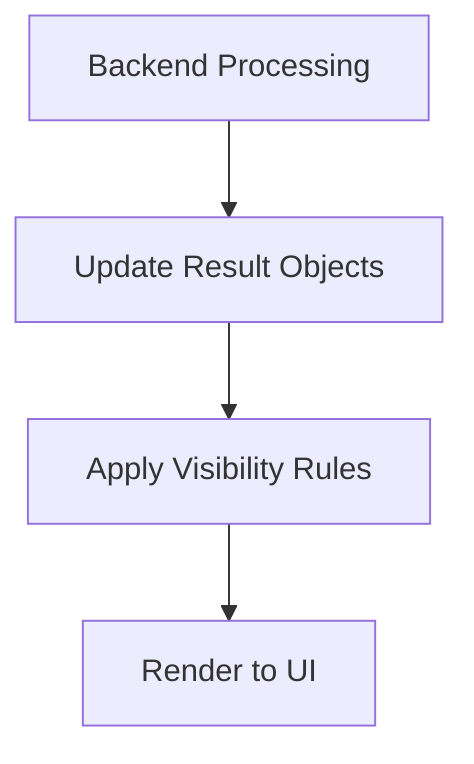

# Advanced Raincloud Plot Documentation

## 1. Overview

- **Function**: `advancedraincloud`
- **Files**:
  - `jamovi/advancedraincloud.u.yaml` — UI
  - `jamovi/advancedraincloud.a.yaml` — Options  
  - `R/advancedraincloud.b.R` — Backend
  - `jamovi/advancedraincloud.r.yaml` — Results

**Summary**: Advanced raincloud plot visualization using the ggrain package for enhanced distribution analysis with longitudinal connections, clinical significance testing, and comprehensive statistical reporting. Designed specifically for clinical research with features including MCID analysis, biomarker visualization, effect size calculations, and publication-ready reporting.

## 2. UI Controls → Options Map

| UI Control | Type | Label | Binds to Option | Default | Constraints | Visibility/Enable |
|------------|------|-------|-----------------|---------|-------------|------------------|
| y_var | VariablesListBox | Y-Axis Variable (Continuous) | y_var | NULL | maxItemCount: 1 | Always visible |
| x_var | VariablesListBox | X-Axis Variable (Groups) | x_var | NULL | maxItemCount: 1 | Always visible |
| fill_var | VariablesListBox | Fill Variable (Optional) | fill_var | NULL | maxItemCount: 1 | Always visible |
| id_var | VariablesListBox | Longitudinal ID (Optional) | id_var | NULL | maxItemCount: 1 | Always visible |
| cov_var | VariablesListBox | Point Color Mapping (Optional) | cov_var | NULL | maxItemCount: 1 | Always visible |
| rain_side | ComboBox | Raincloud Position | rain_side | "l" | l/r/f/f1x1/f2x2 | Always visible |
| likert_mode | CheckBox | Likert Scale Mode | likert_mode | false | - | Always visible |
| show_longitudinal | CheckBox | Show Longitudinal Connections | show_longitudinal | false | - | Always visible |
| clinical_cutoff | TextBox | Clinical Cutoff Value | clinical_cutoff | 0 | number | Collapsed section |
| reference_range_min | TextBox | Reference Range Minimum | reference_range_min | 0 | number | Collapsed section |
| reference_range_max | TextBox | Reference Range Maximum | reference_range_max | 0 | number | Collapsed section |
| show_mcid | CheckBox | Show MCID Band | show_mcid | false | - | Collapsed section |
| mcid_value | TextBox | MCID Value | mcid_value | 0 | number | enabled: show_mcid |
| show_effect_size | CheckBox | Display Effect Size | show_effect_size | false | - | Collapsed section |
| effect_size_type | ComboBox | Effect Size Type | effect_size_type | "cohens_d" | cohens_d/hedges_g/glass_delta | enabled: show_effect_size |
| show_change_scores | CheckBox | Show Change Analysis | show_change_scores | false | - | Collapsed section |
| baseline_group | TextBox | Baseline Group Identifier | baseline_group | "" | string | enabled: show_change_scores |
| responder_threshold | TextBox | Response Threshold (%) | responder_threshold | 20 | number | enabled: show_change_scores |
| show_sample_size | CheckBox | Display Sample Sizes | show_sample_size | true | - | Collapsed section |
| show_missing_info | CheckBox | Show Missing Data Info | show_missing_info | false | - | Collapsed section |
| trial_arms | TextBox | Treatment Arm Labels | trial_arms | "" | string | Collapsed section |
| time_labels | TextBox | Time Point Labels | time_labels | "" | string | Collapsed section |
| population_type | ComboBox | Analysis Population | population_type | "itt" | itt/pp/mitt/at | Collapsed section |
| log_transform | CheckBox | Log Transform Y-axis | log_transform | false | - | Collapsed section |
| outlier_method | ComboBox | Outlier Handling | outlier_method | "none" | none/winsorize/trim/iqr | Collapsed section |
| show_cv_bands | CheckBox | Show CV% Bands | show_cv_bands | false | - | Collapsed section |
| cv_band_1 | TextBox | CV Band 1 Percentage | cv_band_1 | 15 | 1-50 | enabled: show_cv_bands |
| cv_band_2 | TextBox | CV Band 2 Percentage | cv_band_2 | 20 | 1-50 | enabled: show_cv_bands |
| point_size | TextBox | Point Size | point_size | 1.5 | 0.1-5 | Collapsed section |
| point_alpha | TextBox | Point Transparency | point_alpha | 0.7 | 0-1 | Collapsed section |
| violin_alpha | TextBox | Violin Transparency | violin_alpha | 0.7 | 0-1 | Collapsed section |
| boxplot_width | TextBox | Boxplot Width | boxplot_width | 0.1 | 0.1-1 | Collapsed section |
| color_palette | ComboBox | Color Palette | color_palette | "clinical" | clinical/viridis/set1/set2/pastel/dark2 | Collapsed section |
| plot_title | TextBox | Plot Title | plot_title | "Advanced Raincloud Plot" | string | Collapsed section |
| x_label | TextBox | X-Axis Label | x_label | "" | string | Collapsed section |
| y_label | TextBox | Y-Axis Label | y_label | "" | string | Collapsed section |
| jitter_seed | TextBox | Jitter Seed | jitter_seed | 42 | number | Always visible |
| p_value_position | ComboBox | P-value Display Position | p_value_position | "above" | above/legend/table/none | Collapsed section |
| journal_style | ComboBox | Journal Style Format | journal_style | "default" | default/nature/nejm/lancet/jama | Collapsed section |
| generate_report | CheckBox | Generate Clinical Report | generate_report | false | - | Collapsed section |
| include_methods | CheckBox | Include Methods Text | include_methods | false | - | Collapsed section |
| show_statistics | CheckBox | Show Summary Statistics | show_statistics | true | - | Always visible |
| show_comparisons | CheckBox | Show Group Comparisons | show_comparisons | false | - | Always visible |
| show_interpretation | CheckBox | Show Usage Guide | show_interpretation | true | - | Always visible |

## 3. Options Reference (.a.yaml)

### Core Variables
- **y_var** / Variable / NULL — Continuous variable for distribution visualization on Y-axis
- **x_var** / Variable / NULL — Grouping variable for X-axis categories  
- **fill_var** / Variable / NULL — Optional variable for color filling different groups
- **id_var** / Variable / NULL — Optional ID variable for connecting longitudinal observations
- **cov_var** / Variable / NULL — Optional variable for remapping point colors based on covariate values

### Plot Configuration
- **rain_side** / List / "l" — Position of raincloud (left/right/flanking variants)
- **likert_mode** / Bool / false — Enable Y-axis jittering for ordinal data
- **show_longitudinal** / Bool / false — Connect repeated observations using ID variable

### Visual Appearance  
- **point_size** / Number / 1.5 — Size of individual data points (0.1-5)
- **point_alpha** / Number / 0.7 — Transparency level for data points (0-1)
- **violin_alpha** / Number / 0.7 — Transparency level for violin plots (0-1)
- **boxplot_width** / Number / 0.1 — Width of boxplot component (0.1-1)
- **jitter_seed** / Number / 42 — Random seed for consistent point positioning
- **color_palette** / List / "clinical" — Color palette selection

### Clinical Features
- **clinical_cutoff** / Number / 0 — Horizontal line for clinical threshold
- **reference_range_min/max** / Number / 0 — Normal reference range boundaries
- **show_mcid** / Bool / false — Display MCID band
- **mcid_value** / Number / 0 — Size of minimal clinically important difference

### Statistical Analysis
- **show_effect_size** / Bool / false — Show effect size calculations
- **effect_size_type** / List / "cohens_d" — Method for effect size calculation
- **show_change_scores** / Bool / false — Display change from baseline analysis
- **baseline_group** / String / "" — Reference group identifier
- **responder_threshold** / Number / 20 — Percentage change threshold for responder classification

### Biomarker Features
- **log_transform** / Bool / false — Apply log transformation to Y-axis
- **outlier_method** / List / "none" — Method for handling outliers
- **show_cv_bands** / Bool / false — Display coefficient of variation bands
- **cv_band_1/2** / Number / 15/20 — CV percentages for analytical/biological variability

### Clinical Trial Features
- **trial_arms** / String / "" — Custom treatment arm labels
- **time_labels** / String / "" — Custom time point labels  
- **population_type** / List / "itt" — Analysis population type

### Publication Options
- **p_value_position** / List / "above" — P-value display location
- **journal_style** / List / "default" — Journal-specific formatting
- **generate_report** / Bool / false — Generate clinical analysis report
- **include_methods** / Bool / false — Include methods section text

### Output Control
- **show_statistics** / Bool / true — Display summary statistics
- **show_comparisons** / Bool / false — Perform statistical tests between groups
- **show_interpretation** / Bool / true — Display feature guide
- **show_sample_size** / Bool / true — Show sample sizes on plot
- **show_missing_info** / Bool / false — Display missing data information

## 4. Backend Usage (.b.R)

### Variable Validation (.init and .run)
- **y_var, x_var**: Core requirement check in `.run()` — triggers welcome message if NULL/empty
- **point_alpha, violin_alpha, point_size, boxplot_width**: Range validation in `.init()` with custom error messages
- **jitter_seed**: Numeric type validation for consistent plotting

### Data Processing (.run)
- **y_var, x_var**: Data extraction and type conversion (numeric/factor)
- **fill_var, id_var, cov_var**: Optional variable handling with NULL checks
- **log_transform**: Applied to Y-axis data if enabled (`log(y + 0.01)`)
- **outlier_method**: Data filtering using `.handle_outliers()` with winsorize/trim/IQR methods

### Plot Generation (.plot)
- **rain_side**: Controls ggrain positioning with fallback handling for invalid options
- **show_longitudinal + id_var**: Enables longitudinal connections with NA validation
- **likert_mode**: Enables Y-axis jittering in ggrain
- **point_size, point_alpha, violin_alpha, boxplot_width**: Visual parameter mapping
- **jitter_seed**: Consistent random seed application
- **color_palette**: Color scheme application through `.get_color_palette()`

### Clinical Features (.plot)
- **clinical_cutoff**: Horizontal reference line with annotation
- **reference_range_min/max**: Shaded reference area
- **show_mcid + mcid_value**: MCID bands around group means
- **show_sample_size**: Sample size annotations per group
- **show_cv_bands + cv_band_1/2**: Coefficient of variation bands

### Statistical Analysis
- **show_statistics**: Triggers `.generate_statistics()` — populates `self$results$statistics`
- **show_comparisons**: Triggers `.generate_comparisons()` — populates `self$results$comparisons`
- **show_effect_size + effect_size_type**: Triggers `.generate_effect_sizes()` — populates `self$results$effect_sizes`
- **show_change_scores + baseline_group + responder_threshold**: Triggers `.generate_change_analysis()` — populates `self$results$change_analysis`

### Report Generation
- **generate_report + population_type**: Triggers `.generate_clinical_report()` — populates `self$results$clinical_report`
- **include_methods**: Triggers `.generate_methods_text()` — populates `self$results$methods_text`
- **show_interpretation**: Triggers `.generate_interpretation_guide()` — populates `self$results$interpretation`

### Publication Features
- **journal_style**: Applied through `.apply_journal_theme()` with Nature/NEJM/Lancet/JAMA presets
- **p_value_position**: Controls p-value placement through `.add_p_values()`
- **trial_arms, time_labels**: Custom axis labels with validation
- **plot_title, x_label, y_label**: Plot labeling with population type suffix

## 5. Results Definition (.r.yaml)

### Results Outputs

| Output ID | Type | Title | Visibility Condition | Population Entry Point |
|-----------|------|-------|---------------------|------------------------|
| todo | Html | Instructions | `(y_var:null \|\| x_var:null)` | `self$results$todo$setContent()` in `.run()` |
| plot | Image | Advanced Raincloud Plot | Always visible | `.plot()` render function |
| statistics | Html | Summary Statistics | `(show_statistics)` | `self$results$statistics$setContent()` via `.generate_statistics()` |
| comparisons | Html | Group Comparisons | `(show_comparisons)` | `self$results$comparisons$setContent()` via `.generate_comparisons()` |
| interpretation | Html | Feature Guide | `(show_interpretation)` | `self$results$interpretation$setContent()` via `.generate_interpretation_guide()` |
| effect_sizes | Html | Effect Size Analysis | `(show_effect_size)` | `self$results$effect_sizes$setContent()` via `.generate_effect_sizes()` |
| change_analysis | Html | Change Score Analysis | `(show_change_scores)` | `self$results$change_analysis$setContent()` via `.generate_change_analysis()` |
| clinical_report | Html | Clinical Analysis Report | `(generate_report)` | `self$results$clinical_report$setContent()` via `.generate_clinical_report()` |
| methods_text | Html | Methods Section | `(include_methods)` | `self$results$methods_text$setContent()` via `.generate_methods_text()` |

### Clear-With Dependencies
Results are cleared and recalculated when any of the 50 listed options change, ensuring consistency between options and outputs.

### Package References
- **ggplot2**: Core plotting functionality
- **ggrain**: Advanced raincloud plot capabilities with longitudinal connections
- **ClinicoPathJamoviModule**: Parent module framework

## 6. Data Flow Diagram



## 7. Execution Sequence (User Action → Results)

### User Input Flow


### Decision Logic  


### Result Processing


**Step-by-step execution flow:**

1. **Variable Selection** → User selects Y-axis (continuous) and X-axis (grouping) variables
2. **Option Configuration** → User configures plot appearance, statistical options, and clinical features  
3. **Backend Validation** → `.init()` validates numeric parameters, `.run()` checks required variables
4. **Data Preparation** → Complete case analysis, outlier handling, log transformation if requested
5. **Plot Generation** → ggrain-based raincloud plot with fallback to standard geoms if needed
6. **Statistical Analysis** → Summary statistics, group comparisons, effect sizes based on user selections
7. **Clinical Features** → MCID bands, reference ranges, CV bands for biomarker analysis
8. **Report Generation** → Clinical reports and methods text for publication use
9. **Results Display** → Conditional visibility based on option settings

## 8. Change Impact Guide

### Critical Options (High Recalculation Impact)
- **y_var, x_var**: Changing core variables triggers complete recalculation of all results
- **outlier_method**: Changes data processing pipeline and affects all downstream statistics
- **log_transform**: Transforms Y-axis data and impacts all statistical calculations

### Performance-Sensitive Options  
- **show_effect_size**: Triggers O(n²) pairwise comparisons, limited to 10 groups maximum
- **show_change_scores**: Requires longitudinal data structure validation and paired analysis
- **show_cv_bands**: Involves per-group statistical calculations for visualization

### Common Pitfalls
- **Missing ID Structure**: Longitudinal connections require repeated IDs across groups
- **Invalid Baseline Group**: Change analysis needs valid baseline_group specification
- **Reference Range Logic**: min/max values must be properly ordered and non-zero
- **ggrain Compatibility**: Large numbers of groups (>7) may trigger fallback to standard geoms

### Recommended Defaults
- **show_statistics**: `true` — Provides essential descriptive information
- **show_interpretation**: `true` — Guides users through available features
- **jitter_seed**: `42` — Ensures reproducible point positioning
- **point_alpha**: `0.7` — Balances visibility with overlap handling

## 9. Example Usage

### Example Dataset Requirements
- **Minimum**: Continuous Y variable, categorical X variable with 2+ levels
- **Longitudinal**: Additional ID variable with repeated measurements per subject
- **Clinical**: Optional biomarker values, treatment groups, time points

### Example Option Configuration
```yaml
y_var: "biomarker_level"
x_var: "treatment_group"  
id_var: "patient_id"
show_longitudinal: true
show_statistics: true
show_effect_size: true
effect_size_type: "cohens_d"
clinical_cutoff: 100
reference_range_min: 80
reference_range_max: 120
```

### Expected Outputs
- **Welcome Message**: If no variables selected — feature overview and instructions
- **Raincloud Plot**: ggrain visualization with longitudinal connections if ID provided
- **Summary Statistics**: Descriptive statistics by group with sample sizes
- **Effect Size Analysis**: Cohen's d calculations with confidence intervals for all pairwise comparisons
- **Clinical Features**: Reference range shading and clinical cutoff line

## 10. Appendix (Schemas & Snippets)

### Key Code Patterns

**Option Access Pattern**:
```r
# Validation in .init()
private$.validate_numeric_range(self$options$point_alpha, .("Point transparency"), 0, 1)

# Usage in .run() and .plot()  
if (self$options$show_statistics) {
    stats_html <- private$.generate_statistics(analysis_data, y_var, x_var, fill_var)
    self$results$statistics$setContent(stats_html)
}
```

**Result Population Pattern**:
```r
# HTML content setting
self$results$statistics$setContent(html_content)

# Conditional visibility handled by .r.yaml
visible: (show_statistics)
```

**ggrain Integration Pattern**:
```r
# Enhanced raincloud with fallback
rain_params <- list(
    rain.side = self$options$rain_side,
    seed = self$options$jitter_seed,
    point.args = list(size = self$options$point_size, alpha = self$options$point_alpha)
)

tryCatch({
    p <- p + do.call(ggrain::geom_rain, rain_params)
}, error = function(e) {
    # Fallback to standard geoms
})
```

### NA Handling System
The function implements comprehensive missing data management:
- **Complete case analysis** with detailed reporting
- **Longitudinal validation** with ID structure checks  
- **User feedback** about data exclusions and impact on analysis
- **Graceful degradation** when insufficient data remains

This documentation reflects the current implementation with recent enhancements for NA handling, performance optimization, Turkish internationalization support, and comprehensive clinical research features.