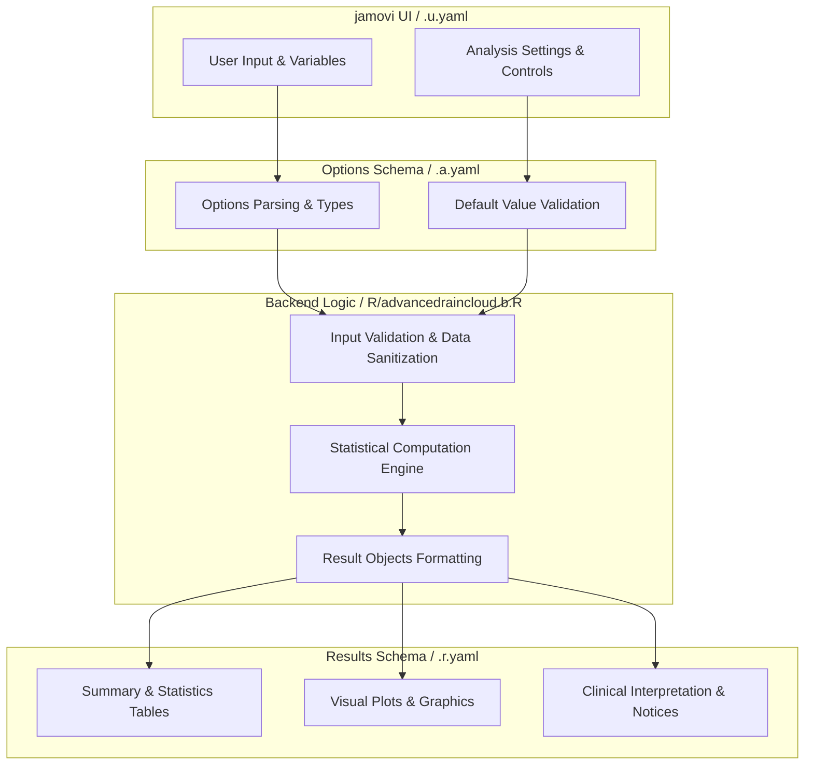
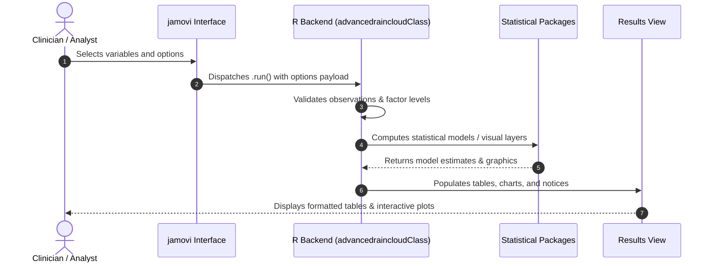

# Advanced Raincloud Plot - Developer Documentation

## 1. Overview

- **Function**: `advancedraincloud`
- **Title**: Advanced Raincloud Plot
- **Module**: `JJStatsPlotT`
- **Files**:
  - `jamovi/advancedraincloud.u.yaml` - User Interface Definition
  - `jamovi/advancedraincloud.a.yaml` - Options & Schema Definition
  - `jamovi/advancedraincloud.r.yaml` - Results Layout & Tables
  - `R/advancedraincloud.b.R` - Backend Implementation
- **Summary**: Creates advanced raincloud plots with longitudinal connections using ggrain package. This module complements the existing Raincloud Plot module by providing advanced  features including longitudinal data connections, Likert scale support, and flexible raincloud positioning. Perfect for repeated measures data, survey analysis, and  complex distribution visualization in clinical research. Uses the ggrain package for enhanced customization and connectivity features.

## 1a. Changelog

- **Date**: 2026-08-29
- **Summary**: Comprehensive documentation suite created & verified against active schemas and backend implementation.

## 2. Options Reference (`.a.yaml`)

| Option | Type | Default | Description |
| :--- | :--- | :--- | :--- |
| `data` | `Data` | `NULL` |  |
| `y_var` | `Variable` | `NULL` | Y-Axis Variable |
| `x_var` | `Variable` | `NULL` | X-Axis Variable (Grouping) |
| `fill_var` | `Variable` | `NULL` | Fill Variable (Optional) |
| `id_var` | `Variable` | `NULL` | Longitudinal ID (Optional) |
| `cov_var` | `Variable` | `NULL` | Point Color Variable (Optional) |
| `rain_side` | `List` | `l` | Raincloud Position |
| `likert_mode` | `Bool` | `FALSE` | Likert scale mode |
| `show_longitudinal` | `Bool` | `FALSE` | Longitudinal connections |
| `point_size` | `Number` | `1.5` | Point Size |
| `point_alpha` | `Number` | `0.7` | Point Transparency |
| `violin_alpha` | `Number` | `0.7` | Violin Transparency |
| `boxplot_width` | `Number` | `0.1` | Boxplot Width |
| `jitter_seed` | `Number` | `42` | Jitter Seed |
| `color_palette` | `List` | `clinical` | Color Palette |
| `plot_title` | `String` | `Advanced Raincloud Plot` | Plot Title |
| `x_label` | `String` | `` | X-Axis Label |
| `y_label` | `String` | `` | Y-Axis Label |
| `show_statistics` | `Bool` | `TRUE` | Summary statistics |
| `show_comparisons` | `Bool` | `FALSE` | Group comparisons |
| `show_interpretation` | `Bool` | `TRUE` | Usage guide |
| `clinical_cutoff` | `Number` | `0` | Clinical Cutoff Value |
| `reference_range_min` | `Number` | `0` | Reference Range Minimum |
| `reference_range_max` | `Number` | `0` | Reference Range Maximum |
| `show_mcid` | `Bool` | `FALSE` | MCID band |
| `mcid_value` | `Number` | `0` | MCID Value |
| `show_effect_size` | `Bool` | `FALSE` | Effect size |
| `effect_size_type` | `List` | `cohens_d` | Effect Size Type |
| `show_change_scores` | `Bool` | `FALSE` | Change analysis |
| `baseline_group` | `String` | `` | Baseline Group Identifier |
| `responder_threshold` | `Number` | `20` | Response Threshold ( percent) |
| `show_sample_size` | `Bool` | `TRUE` | Sample sizes |
| `show_missing_info` | `Bool` | `FALSE` | Missing data info |
| `trial_arms` | `String` | `` | Treatment Arm Labels |
| `time_labels` | `String` | `` | Time Point Labels |
| `population_type` | `List` | `itt` | Analysis Population |
| `log_transform` | `Bool` | `FALSE` | Log transform Y-axis |
| `outlier_method` | `List` | `none` | Outlier Handling |
| `show_cv_bands` | `Bool` | `FALSE` | CV percent bands |
| `cv_band_1` | `Number` | `15` | CV Band 1 Percentage |
| `cv_band_2` | `Number` | `20` | CV Band 2 Percentage |
| `p_value_position` | `List` | `above` | P-value Display Position |
| `journal_style` | `List` | `default` | Journal Style Format |
| `generate_report` | `Bool` | `FALSE` | Clinical report |
| `include_methods` | `Bool` | `FALSE` | Include methods text |

## 3. Results Definition (`.r.yaml`)

| Output ID | Type | Title | Description |
| :--- | :--- | :--- | :--- |
| `todo` | `Html` | `Instructions` |  |
| `analysisNotes` | `Html` | `Analysis Notes` |  |
| `plot` | `Image` | `Advanced Raincloud Plot` |  |
| `statistics` | `Html` | `Summary Statistics` |  |
| `comparisons` | `Html` | `Group Comparisons` |  |
| `interpretation` | `Html` | `Feature Guide` |  |
| `effect_sizes` | `Html` | `Effect Size Analysis` |  |
| `change_analysis` | `Html` | `Change Score Analysis` |  |
| `clinical_report` | `Html` | `Clinical Analysis Report` |  |
| `methods_text` | `Html` | `Methods Section` |  |

## 4. Architecture & Data Flow Diagram

```mermaid
flowchart TD
  subgraph UI[jamovi UI / .u.yaml]
    U1[User Input & Variables]
    U2[Analysis Settings & Controls]
  end

  subgraph Opts[Options Schema / .a.yaml]
    O1[Options Parsing & Types]
    O2[Default Value Validation]
  end

  subgraph Backend[Backend Logic / R/advancedraincloud.b.R]
    B1[Input Validation & Data Sanitization]
    B2[Statistical Computation Engine]
    B3[Result Objects Formatting]
  end

  subgraph Res[Results Schema / .r.yaml]
    R1[Summary & Statistics Tables]
    R2[Visual Plots & Graphics]
    R3[Clinical Interpretation & Notices]
  end

  U1 --> O1
  U2 --> O2
  O1 --> B1
  O2 --> B1
  B1 --> B2
  B2 --> B3
  B3 --> R1
  B3 --> R2
  B3 --> R3
```

## 5. Execution Sequence

```mermaid
sequenceDiagram
  autonumber
  actor User as Clinician / Analyst
  participant UI as jamovi Interface
  participant Backend as R Backend (advancedraincloudClass)
  participant Engine as Statistical Packages
  participant Results as Results View

  User->>UI: Selects variables and options
  UI->>Backend: Dispatches .run() with options payload
  Backend->>Backend: Validates observations & factor levels
  Backend->>Engine: Computes statistical models / visual layers
  Engine-->>Backend: Returns model estimates & graphics
  Backend->>Results: Populates tables, charts, and notices
  Results-->>User: Displays formatted tables & interactive plots
```

## 6. Change Impact & Safety Guidelines

- **Data Filtering**: Ensure observations with missing values are handled gracefully according to analysis options.
- **Formula Conflicts**: Use isolated environment calls or base formula methods when interacting with `ggstatsplot` or formula parsers.
- **Safe Deparsing**: Use `deparse(val)` in syntax generation (`asSource()`) to escape column names with spaces or special symbols.

