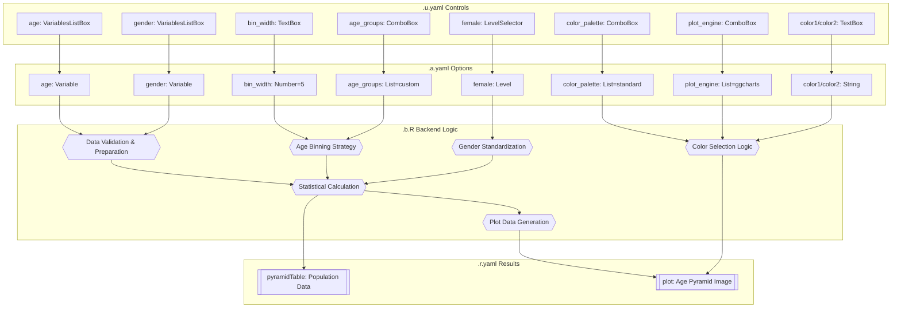
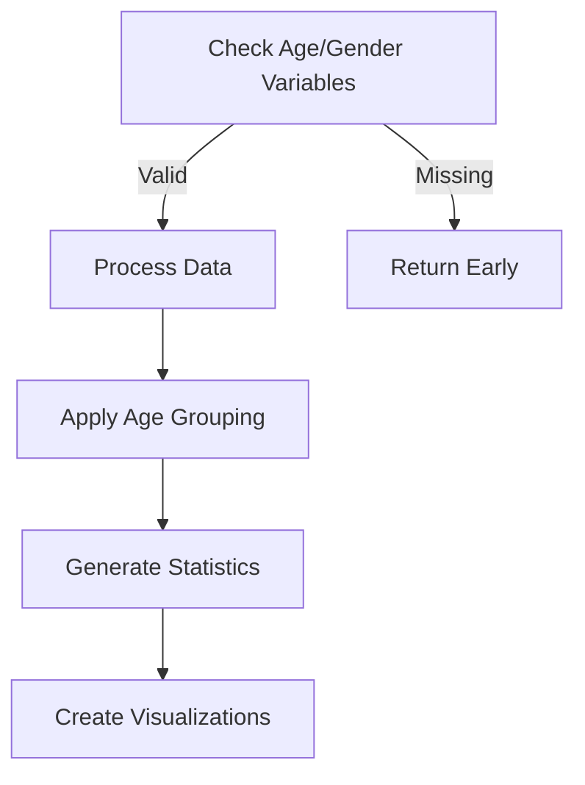
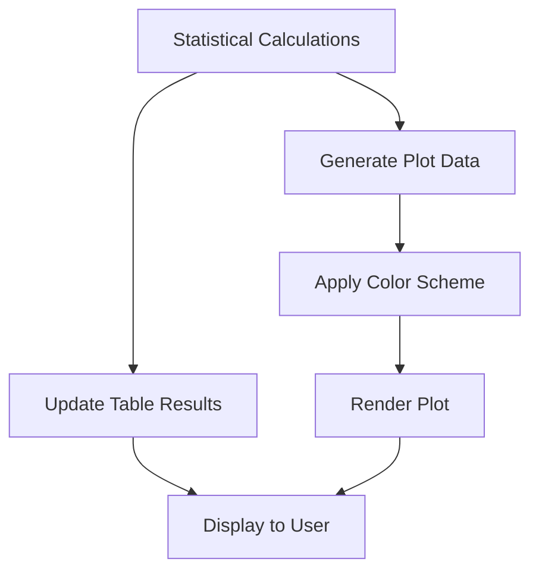
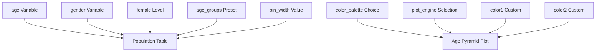

# Age Pyramid Function Documentation

## 1. Overview

- **Function**: `agepyramid`
- **Files**:
  - `jamovi/agepyramid.u.yaml` — UI
  - `jamovi/agepyramid.a.yaml` — Options
  - `R/agepyramid.b.R` — Backend
  - `jamovi/agepyramid.r.yaml` — Results

- **Summary**: Generates age pyramid plots showing the distribution of age by gender using either ggplot2 or ggcharts engines. The function supports clinical age group presets, colorblind-friendly palettes, and produces publication-ready statistical tables with counts and percentages. Designed specifically for demographic analysis in clinical and pathology research.

## 2. UI Controls → Options Map

| UI Control | Type | Label | Binds to Option | Defaults & Constraints | Visibility/Enable Rules |
|------------|------|-------|-----------------|------------------------|-------------------------|
| `age` | VariablesListBox | Age | `age` | maxItemCount: 1, suggested: continuous | Always visible |
| `gender` | VariablesListBox | Gender | `gender` | maxItemCount: 1, suggested: ordinal/nominal | Always visible |
| `female` | LevelSelector | Select Female | `female` | Levels from gender variable | `enable: (gender)` |
| `bin_width` | TextBox | Bin Width (Years) | `bin_width` | number format, default: 5 | `enable: "(age_groups == 'custom')"` |
| `plot_title` | TextBox | Plot Title | `plot_title` | string format, width: large | Always visible |
| `color_palette` | ComboBox | Color Palette | `color_palette` | standard/accessible/custom | Always visible |
| `age_groups` | ComboBox | Age Group Preset | `age_groups` | custom/pediatric/reproductive/geriatric/lifecourse | Always visible |
| `plot_engine` | ComboBox | Plot Engine | `plot_engine` | ggplot2/ggcharts | Always visible |
| `color1` | TextBox | First Color (Female) | `color1` | string format | `enable: "(color_palette == 'custom')"` |
| `color2` | TextBox | Second Color (Male) | `color2` | string format | `enable: "(color_palette == 'custom')"` |

**JavaScript Events**: The UI includes sophisticated event handling for dynamic color configuration and validation through `agepyramid.events.js`.

## 3. Options Reference (.a.yaml)

| Name | Type | Default | Description | Downstream Effects |
|------|------|---------|-------------|--------------------|
| `data` | Data | - | Input data frame | Accessed via `self$data` for all processing |
| `age` | Variable | - | Continuous age variable | Used in `self$options$age` for data selection and binning |
| `gender` | Variable | - | Categorical gender variable | Used in `self$options$gender` for stratification |
| `female` | Level | - | Female level identifier | Used in `self$options$female` for gender standardization |
| `bin_width` | Number | 5 | Age bin width in years | Controls age grouping when `age_groups == "custom"` |
| `plot_title` | String | "Age Pyramid" | Plot title | Used in both plotting engines for display |
| `color1` | String | "#1F77B4" | First color (female) | Used when `color_palette == "custom"` |
| `color2` | String | "#FF7F0E" | Second color (male) | Used when `color_palette == "custom"` |
| `color_palette` | List | "standard" | Color scheme selection | Determines color selection logic in `.plot()` |
| `age_groups` | List | "custom" | Age grouping preset | Controls binning strategy in `.run()` |
| `plot_engine` | List | "ggcharts" | Plotting engine choice | Determines plotting method and color optimization |

**Clinical Age Group Options**:
- `pediatric`: 0, 1, 2, 5, 10, 15, 18+ years
- `reproductive`: 15, 20, 25, 30, 35, 40, 45, 50+ years  
- `geriatric`: 65, 70, 75, 80, 85, 90, 95+ years
- `lifecourse`: 0, 5, 15, 25, 45, 65, 75, 85+ years

**Color Palette Options**:
- `standard`: Traditional gender colors (engine-optimized)
- `accessible`: Colorblind-friendly Okabe-Ito palette
- `custom`: User-defined colors via `color1` and `color2`

## 4. Backend Usage (.b.R)

### `.run()` Function - Data Processing

**Option Access Locations**:

- **Lines 23-24**: `self$options$age` and `self$options$gender` - Prerequisites validation
- **Lines 44-45**: Variable name extraction for data selection
- **Lines 63-67**: `self$options$female` - Gender level standardization with auto-detection fallback
- **Lines 78-103**: `self$options$age_groups` and `self$options$bin_width` - Age binning strategy
- **Lines 162-169**: Table population with performance checkpointing

**Key Logic Branches**:

1. **Age Binning Logic** (Lines 80-103):
   ```r
   if (age_groups_preset == "custom") {
       bin_width <- self$options$bin_width %||% 5
       # Create equal-width bins
   } else {
       # Use preset clinical age groups
       breaks_seq <- switch(age_groups_preset, ...)
   }
   ```

2. **Performance Monitoring** (Lines 35-39):
   ```r
   if (dataset_size > 50000) {
       message(sprintf(.("Processing large dataset (%d rows)..."), dataset_size))
   }
   ```

**Result Population**:
- **Line 122**: `image$setState(plotData)` - Saves processed data for plot rendering
- **Lines 162-169**: `pyramidTable$addRow()` - Populates statistical table with checkpointing

### `.plot()` Function - Visualization

**Option Access Locations**:

- **Lines 188-191**: `self$options$plot_title` and `self$options$plot_engine` - Display configuration
- **Lines 194-212**: `self$options$color_palette`, `self$options$color1`, `self$options$color2` - Color selection logic
- **Lines 221-241**: ggcharts rendering with package availability fallback
- **Lines 243-268**: ggplot2 rendering with professional styling

**Color Selection Logic** (Lines 196-212):
```r
if (color_palette == "standard") {
    # Engine-optimized colors
} else if (color_palette == "accessible") {
    # Colorblind-friendly Okabe-Ito palette
} else {
    # Custom user-defined colors
}
```

## 5. Results Definition (.r.yaml)

### Outputs

| Output ID | Type | Title | Dimensions | Visibility | Schema |
|-----------|------|-------|------------|------------|--------|
| `pyramidTable` | Table | Population Data | Dynamic rows | Always | 5 columns with counts and percentages |
| `plot` | Image | Age Pyramid | 600×450 | Always | Rendered via `.plot()` function |

### Table Schema (`pyramidTable`)

| Column Name | Title | Type | Format | Description |
|-------------|-------|------|--------|-------------|
| `Pop` | Age Group | text | - | Age range intervals (e.g., "(25,35]") |
| `Female` | Female (n) | number | - | Female count in age group |
| `Female_Pct` | Female (%) | number | zto;dp:1 | Percentage of females (1 decimal) |
| `Male` | Male (n) | number | - | Male count in age group |
| `Male_Pct` | Male (%) | number | zto;dp:1 | Percentage of males (1 decimal) |

**Clear-With Dependencies**: Both outputs clear when any option changes, ensuring consistency.

**Population Entry Points**:
- Table populated via `pyramidTable$addRow()` loop (lines 162-169)
- Image populated via `image$setState()` and `.plot()` render function
- Summary statistics row automatically added with totals

## 6. Data Flow Diagram



## 7. Execution Sequence

### User Input Flow


### Decision Logic  


### Result Processing


**Step-by-step execution flow:**

1. **User Variable Selection** → UI updates `age` and `gender` options
2. **Prerequisites Validation** → Check required variables are provided (lines 23-24)
3. **Data Preparation** → Clean data, convert types, validate age conversion (lines 51-60)
4. **Gender Standardization** → Create standardized Female/Male categories (lines 62-75)
5. **Age Binning Strategy** → Apply custom bins or clinical presets (lines 77-103)
6. **Statistical Processing** → Calculate counts and percentages by age group (lines 114-154)
7. **Table Population** → Add rows to `pyramidTable` with performance checkpointing (lines 156-169)
8. **Plot Generation** → Select colors, choose engine, render visualization (lines 172-275)
9. **Result Display** → Show table and plot with clearing dependencies



## 8. Change Impact Guide

### Key Option Changes

**`age_groups` Change**:
- **If changed to preset**: Disables `bin_width` control, uses clinical age ranges
- **Recalculates**: All age binning, table statistics, plot groupings
- **Performance**: Preset groups typically faster than custom binning
- **Common pitfall**: Preset groups may not fit all age ranges in data

**`color_palette` Change**:
- **If "standard"**: Uses engine-optimized gender colors
- **If "accessible"**: Applies colorblind-friendly Okabe-Ito palette
- **If "custom"**: Enables `color1`/`color2` controls
- **Recalculates**: Only plot rendering, no data processing
- **Performance**: Negligible impact

**`plot_engine` Change**:
- **If "ggcharts"**: Uses optimized pyramid styling, may fallback to ggplot2
- **If "ggplot2"**: Manual construction with full customization
- **Recalculates**: Only plot rendering
- **Performance**: ggcharts slightly faster for large datasets
- **Common pitfall**: ggcharts dependency may not be available

**`bin_width` Change** (when `age_groups == "custom"`):
- **Recalculates**: Age binning, all statistics, plot groupings  
- **Performance**: Linear impact with number of bins created
- **Recommended**: 5-10 years for clinical studies, 1-5 years for pediatric
- **Common pitfall**: Too small bins create sparse groups

**`female` Level Change**:
- **Recalculates**: Gender standardization, all statistics
- **Performance**: Negligible impact
- **Common pitfall**: Incorrect level selection inverts gender assignment

## 9. Example Usage

### Example Dataset Requirements

**Variables needed**:
- `age`: Numeric variable (0-120 years typical range)
- `gender`: Factor variable with at least 2 levels

**Example data structure**:
```r
data <- data.frame(
  age = c(25, 30, 45, 67, 82, 34, 56, 78),
  gender = c("Female", "Male", "Female", "Male", "Female", "Male", "Female", "Male")
)
```

### Example Option Configurations

**Basic Clinical Study**:
```yaml
age: "age"
gender: "sex_variable"  
age_groups: "custom"
bin_width: 10
color_palette: "standard"
plot_engine: "ggcharts"
```

**Pediatric Research**:
```yaml
age: "child_age"
gender: "gender"
female: "Female"
age_groups: "pediatric"
color_palette: "accessible"
plot_title: "Pediatric Age Distribution"
```

**Publication-Ready Custom**:
```yaml
age: "patient_age"
gender: "sex"
age_groups: "geriatric"
color_palette: "custom"
color1: "#D55E00"  # Orange
color2: "#0072B2"  # Blue
plot_engine: "ggplot2"
plot_title: "Geriatric Patient Demographics"
```

### Expected Outputs

**Population Table**: Age groups with counts and percentages for each gender, plus totals row
**Age Pyramid Plot**: Horizontal bar chart with females on left (negative) and males on right (positive)
**Performance**: Handles datasets up to 100K rows efficiently with checkpointing system

## 10. Appendix

### Table Column Schema (Full Detail)

```yaml
pyramidTable:
  columns:
    - name: Pop
      title: "Age Group"
      type: text
      description: "Age range intervals in (lower,upper] format"
    - name: Female  
      title: "Female (n)"
      type: number
      description: "Count of females in age group"
    - name: Female_Pct
      title: "Female (%)"  
      type: number
      format: 'zto;dp:1'
      description: "Percentage of total females (1 decimal place)"
    - name: Male
      title: "Male (n)"
      type: number  
      description: "Count of males in age group"
    - name: Male_Pct
      title: "Male (%)"
      type: number
      format: 'zto;dp:1'
      description: "Percentage of total males (1 decimal place)"
```

### Key Code Snippets

**Option Access Pattern**:
```r
# Safe option access with defaults
age_var <- self$options$age
bin_width <- self$options$bin_width %||% 5
color_palette <- self$options$color_palette %||% "standard"
```

**Result Population Pattern**:
```r
# Table population with performance monitoring
pyramidTable <- self$results$pyramidTable
for(i in seq_len(nrow(data))) {
    pyramidTable$addRow(rowKey = i, values = data[i,])
    if (nrow(data) > 20 && i %% 10 == 0) {
        private$.checkpoint(flush = FALSE)
    }
}
```

**Plot State Management**:
```r
# Save processed data for plot rendering
image <- self$results$plot
image$setState(plotData)
```

**Color Selection Logic**:
```r
# Dynamic color assignment based on palette choice
if (color_palette == "standard") {
    colors <- engine_optimized_colors
} else if (color_palette == "accessible") {
    colors <- okabe_ito_palette
} else {
    colors <- c(self$options$color1, self$options$color2)
}
```

### Performance Characteristics

- **Small datasets** (<1K rows): <1 second processing
- **Medium datasets** (1K-10K rows): 1-5 seconds processing
- **Large datasets** (10K-100K rows): 5-30 seconds with checkpointing
- **Very large datasets** (>100K rows): 30+ seconds with progress messaging

### Clinical Research Features

- **Age Group Presets**: Tailored for pediatric, reproductive, geriatric research contexts
- **Accessibility**: Colorblind-friendly palette support for inclusive publications
- **Statistical Output**: Publication-ready tables with counts and percentages
- **Performance Monitoring**: Dataset size detection with user feedback for large studies
- **Gender Flexibility**: Auto-detection of female levels with manual override capability