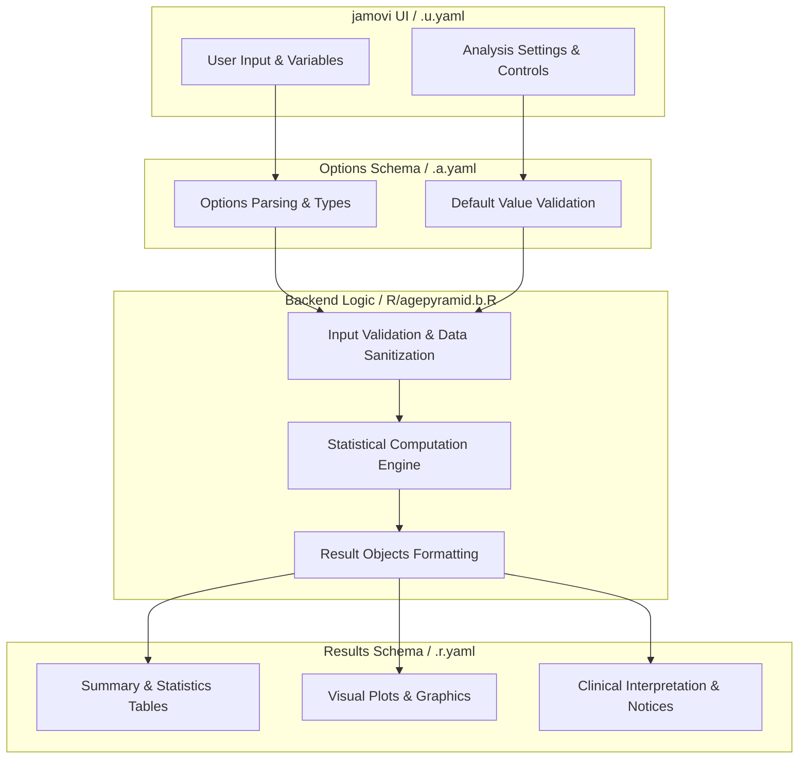
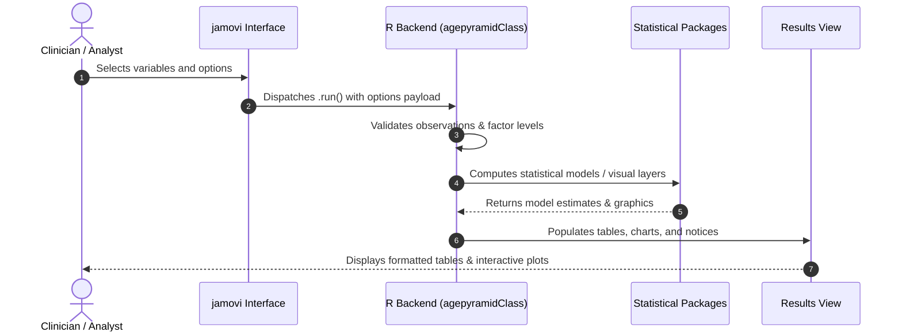

# Age Pyramid - Developer Documentation

## 1. Overview

- **Function**: `agepyramid`
- **Title**: Age Pyramid
- **Module**: `ExplorationT`
- **Files**:
  - `jamovi/agepyramid.u.yaml` - User Interface Definition
  - `jamovi/agepyramid.a.yaml` - Options & Schema Definition
  - `jamovi/agepyramid.r.yaml` - Results Layout & Tables
  - `R/agepyramid.b.R` - Backend Implementation
- **Summary**: Generates an age pyramid from an age variable and a gender variable.

## 1a. Changelog

- **Date**: 2026-08-29
- **Summary**: Comprehensive documentation suite created & verified against active schemas and backend implementation.

## 2. Options Reference (`.a.yaml`)

| Option | Type | Default | Description |
| :--- | :--- | :--- | :--- |
| `data` | `Data` | `NULL` |  |
| `age` | `Variable` | `NULL` | Age |
| `gender` | `Variable` | `NULL` | Gender |
| `female` | `Level` | `NULL` | Female level |
| `male` | `Level` | `NULL` | Male level |
| `age_groups` | `List` | `custom` | Age group preset: `custom` (bin width or custom breaks), `who` (0-4, 5-9, ... 85+), `who_infant` (<1, 1-4, 5-9, ... 85+), `pediatric`, `reproductive`, `geriatric`, `lifecourse` |
| `age_interval` | `List` | `left` | Age band boundaries |
| `bin_width` | `Number` | `5` | Bin width (years) |
| `custom_breaks` | `String` | `` | Custom age breaks |
| `pct_base` | `List` | `within_gender` | Percentage base: within each gender (each column sums to 100%) or of all observations (both columns together sum to 100%); also drives the percent axis of the plots |
| `plot_values` | `List` | `count` | Bar values: counts or percentages (using the percentage base) on both pyramids |
| `plot_title` | `String` | `Age Pyramid` | Plot title |
| `color_palette` | `List` | `standard` | Color palette |
| `female_color` | `String` | `#E91E63` | Female color |
| `male_color` | `String` | `#2196F3` | Male color |
| `originaltheme` | `Bool` | `FALSE` | Original custom theme |
| `enableGGCharts` | `Bool` | `FALSE` | ggcharts pyramid |
| `ggcharts_sort` | `List` | `no` | Bar order |
| `ggcharts_colors` | `List` | `default` | Bar colors |
| `ggcharts_color1` | `String` | `#1F77B4` | First group color |
| `ggcharts_color2` | `String` | `#FF7F0E` | Second group color |
| `ggcharts_title` | `String` | `Age Pyramid (ggcharts)` | ggcharts plot title |
| `ggcharts_xlab` | `String` | `Population` | X-axis label |

## 3. Results Definition (`.r.yaml`)

| Output ID | Type | Title | Description |
| :--- | :--- | :--- | :--- |
| `notices` | `Preformatted` | `Important Information` |  |
| `welcome` | `Html` | `Getting Started` |  |
| `dataInfo` | `Html` | `Data Summary` |  |
| `pyramidTable` | `Table` | `Population Data` |  |
| `plot` | `Image` | `Age Pyramid` |  |
| `plotGGCharts` | `Image` | `Age Pyramid (ggcharts)` |  |

## 4. Architecture & Data Flow Diagram

```mermaid
flowchart TD
  subgraph UI[jamovi UI / .u.yaml]
    U1[User Input & Variables]
    U2[Analysis Settings & Controls]
  end

  subgraph Opts[Options Schema / .a.yaml]
    O1[Options Parsing & Types]
    O2[Default Value Validation]
  end

  subgraph Backend[Backend Logic / R/agepyramid.b.R]
    B1[Input Validation & Data Sanitization]
    B2[Statistical Computation Engine]
    B3[Result Objects Formatting]
  end

  subgraph Res[Results Schema / .r.yaml]
    R1[Summary & Statistics Tables]
    R2[Visual Plots & Graphics]
    R3[Clinical Interpretation & Notices]
  end

  U1 --> O1
  U2 --> O2
  O1 --> B1
  O2 --> B1
  B1 --> B2
  B2 --> B3
  B3 --> R1
  B3 --> R2
  B3 --> R3
```

## 5. Execution Sequence

```mermaid
sequenceDiagram
  autonumber
  actor User as Clinician / Analyst
  participant UI as jamovi Interface
  participant Backend as R Backend (agepyramidClass)
  participant Engine as Statistical Packages
  participant Results as Results View

  User->>UI: Selects variables and options
  UI->>Backend: Dispatches .run() with options payload
  Backend->>Backend: Validates observations & factor levels
  Backend->>Engine: Computes statistical models / visual layers
  Engine-->>Backend: Returns model estimates & graphics
  Backend->>Results: Populates tables, charts, and notices
  Results-->>User: Displays formatted tables & interactive plots
```

## 6. Change Impact & Safety Guidelines

- **Data Filtering**: Ensure observations with missing values are handled gracefully according to analysis options.
- **Formula Conflicts**: Use isolated environment calls or base formula methods when interacting with `ggstatsplot` or formula parsers.
- **Safe Deparsing**: Use `deparse(val)` in syntax generation (`asSource()`) to escape column names with spaces or special symbols.

