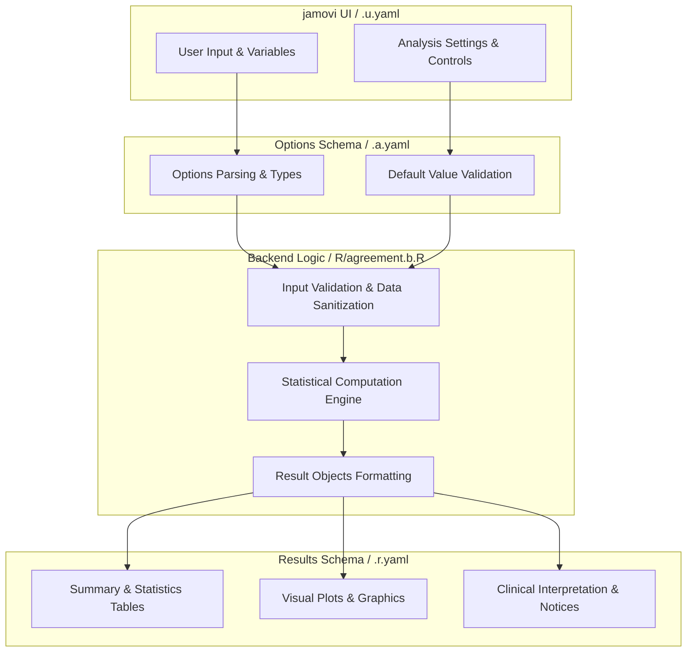
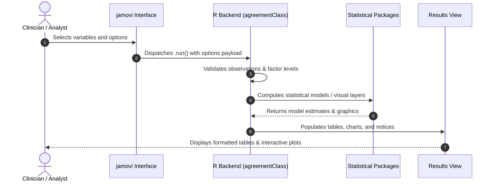

# Interrater Reliability - Developer Documentation

## 1. Overview

- **Function**: `agreement`
- **Title**: Interrater Reliability
- **Module**: `meddecide`
- **Files**:
  - `jamovi/agreement.u.yaml` - User Interface Definition
  - `jamovi/agreement.a.yaml` - Options & Schema Definition
  - `jamovi/agreement.r.yaml` - Results Layout & Tables
  - `R/agreement.b.R` - Backend Implementation
- **Summary**: Agreement between two or more raters who scored the same cases. Cohen's kappa for two raters (unweighted, or linear or quadratic weighted for ordinal grades) with a confidence interval, and Fleiss' or Conger's exact kappa for three or more; optional Krippendorff's alpha, Gwet's AC, PABAK, ICC, Lin's concordance, Bland-Altman limits, marginal homogeneity tests, per-rater and per-subgroup agreement, rater and case clustering, consensus and agreement-level variables, and sample size for an agreement study.

## 1a. Changelog

- **Date**: 2026-09-23
- **Summary**: Hand-synchronised against `jamovi/agreement.a.yaml` and `jamovi/agreement.r.yaml` after the iota rescope - 63 option titles and 7 result titles corrected, `kappaCIMethod` and `loaOutput` added, 3 rows for removed result headings dropped, and the module corrected from `meddecideT` to `meddecide`. Sections 4-6 below were not re-derived. Do NOT regenerate this file with `/document-function`: per CLAUDE.md that command appends a `T` to `menuGroup`, which parks a shipped analysis (that is how the `meddecideT` header got here).

- **Date**: 2026-08-29
- **Summary**: Comprehensive documentation suite created & verified against active schemas and backend implementation.

## 2. Options Reference (`.a.yaml`)

| Option | Type | Default | Description |
| :--- | :--- | :--- | :--- |
| `data` | `Data` | `NULL` |  |
| `vars` | `Variables` | `NULL` | Raters |
| `baConfidenceLevel` | `Number` | `0.95` | Coverage for limits of agreement |
| `confLevel` | `Number` | `0.95` | Confidence level for CIs |
| `kappaCIMethod` | `List` | `wald` | Kappa interval method |
| `proportionalBias` | `Bool` | `FALSE` | Difference-mean trend (exploratory) |
| `showBlandAltmanGuide` | `Bool` | `FALSE` | When to use Bland-Altman analysis |
| `blandAltmanPlot` | `Bool` | `FALSE` | Bland-Altman plot |
| `agreementHeatmap` | `Bool` | `FALSE` | Agreement heatmap (confusion matrix) |
| `heatmapColorScheme` | `List` | `bluered` | Heatmap colour scheme |
| `heatmapShowPercentages` | `Bool` | `TRUE` | Percentages in cells |
| `heatmapShowCounts` | `Bool` | `TRUE` | Counts in cells |
| `heatmapAnnotationSize` | `Number` | `3.5` | Cell annotation size |
| `showAgreementHeatmapGuide` | `Bool` | `FALSE` | When to use agreement heatmap |
| `sft` | `Bool` | `FALSE` | Frequency tables |
| `wght` | `List` | `unweighted` | Weighted kappa (ordinal data only) |
| `exct` | `Bool` | `FALSE` | Exact kappa (3+ raters) |
| `showLevelInfo` | `Bool` | `FALSE` | Level ordering information |
| `kripp` | `Bool` | `FALSE` | Krippendorff's alpha |
| `krippMethod` | `List` | `nominal` | Data Type for Krippendorff's Alpha |
| `bootstrap` | `Bool` | `FALSE` | Bootstrap confidence intervals |
| `showKrippGuide` | `Bool` | `FALSE` | When to use Krippendorff's alpha |
| `gwet` | `Bool` | `FALSE` | Gwet's AC1/AC2 |
| `gwetWeights` | `List` | `unweighted` | Weights for Gwet's AC |
| `showGwetGuide` | `Bool` | `FALSE` | When to use Gwet's AC |
| `pabak` | `Bool` | `FALSE` | PABAK & prevalence/bias indices |
| `showPABAKGuide` | `Bool` | `FALSE` | When to use PABAK |
| `icc` | `Bool` | `FALSE` | ICC (continuous data) |
| `showICCGuide` | `Bool` | `FALSE` | When to use ICC |
| `iccType` | `List` | `icc21` | ICC model |
| `meanPearson` | `Bool` | `FALSE` | Mean Pearson correlation (linear association) |
| `showMeanPearsonGuide` | `Bool` | `FALSE` | When to use mean Pearson correlation |
| `linCCC` | `Bool` | `FALSE` | Lin's concordance correlation coefficient (CCC) |
| `showLinCCCGuide` | `Bool` | `FALSE` | When to use Lin's CCC |
| `tdi` | `Bool` | `FALSE` | Total deviation index (TDI) |
| `tdiCoverage` | `Number` | `90` | Empirical coverage target (percent) |
| `tdiLimit` | `Number` | `10` | Acceptable limit |
| `showTDIGuide` | `Bool` | `FALSE` | When to use TDI |
| `iota` | `Bool` | `FALSE` | Iota coefficient (single variable) |
| `iotaStandardize` | `Bool` | `TRUE` | Standardize quantitative ratings (no effect on a single variable) |
| `showIotaGuide` | `Bool` | `FALSE` | When to use iota coefficient |
| `finn` | `Bool` | `FALSE` | Finn coefficient (variance-based agreement) |
| `finnLevels` | `Integer` | `3` | Number of Rating Categories (Finn) |
| `finnModel` | `List` | `oneway` | Finn model type |
| `showFinnGuide` | `Bool` | `FALSE` | When to use Finn coefficient |
| `lightKappa` | `Bool` | `FALSE` | Light's kappa (3+ raters) |
| `showLightKappaGuide` | `Bool` | `FALSE` | When to use light's kappa |
| `kendallW` | `Bool` | `FALSE` | Kendall's W (concordance for rankings) |
| `showKendallWGuide` | `Bool` | `FALSE` | When to use Kendall's W |
| `robinsonA` | `Bool` | `FALSE` | Robinson's A (ordinal agreement index) |
| `showRobinsonAGuide` | `Bool` | `FALSE` | When to use Robinson's A |
| `meanSpearman` | `Bool` | `FALSE` | Mean Spearman rho (average rank correlation) |
| `showMeanSpearmanGuide` | `Bool` | `FALSE` | When to use mean Spearman rho |
| `raterBias` | `Bool` | `FALSE` | Directional discordance test (ordinal, 2 raters) |
| `showRaterBiasGuide` | `Bool` | `FALSE` | When to use directional discordance test |
| `bhapkar` | `Bool` | `FALSE` | Bhapkar test (marginal homogeneity for 2 raters) |
| `showBhapkarGuide` | `Bool` | `FALSE` | When to use Bhapkar test |
| `stuartMaxwell` | `Bool` | `FALSE` | Stuart-Maxwell test (marginal homogeneity for 2 raters) |
| `showStuartMaxwellGuide` | `Bool` | `FALSE` | When to use Stuart-Maxwell test |
| `maxwellRE` | `Bool` | `FALSE` | Rater variance decomposition (systematic vs random) |
| `showMaxwellREGuide` | `Bool` | `FALSE` | When to use the variance decomposition |
| `interIntraRater` | `Bool` | `FALSE` | Inter/intra-rater reliability (test-retest) |
| `interIntraSeparator` | `String` | `_` | Column name separator (inter/intra) |
| `showInterIntraRaterGuide` | `Bool` | `FALSE` | When to use inter/intra-rater reliability |
| `pairwiseKappa` | `Bool` | `FALSE` | Pairwise kappa (vs reference) |
| `referenceRater` | `Variable` | `NULL` | Reference rater variable |
| `rankRaters` | `Bool` | `FALSE` | Rank raters by performance |
| `showPairwiseKappaGuide` | `Bool` | `FALSE` | When to use pairwise kappa |
| `allPairsKappa` | `Bool` | `FALSE` | All-pairs Cohen's kappa (every rater pair) |
| `allPairsCI` | `Bool` | `TRUE` | Confidence interval for each pair |
| `showAllPairsKappaGuide` | `Bool` | `FALSE` | When to use all-pairs kappa |
| `itemModalCategoryAgreement` | `Bool` | `FALSE` | Per-category item-modal agreement |
| `showItemModalGuide` | `Bool` | `FALSE` | When to use per-category item-modal agreement |
| `hierarchicalKappa` | `Bool` | `FALSE` | Hierarchical/multilevel kappa |
| `clusterVariable` | `Variable` | `NULL` | Cluster/institution variable |
| `iccHierarchical` | `Bool` | `FALSE` | Hierarchical ICC decomposition |
| `clusterSpecificKappa` | `Bool` | `TRUE` | Cluster-specific kappa estimates |
| `varianceDecomposition` | `Bool` | `TRUE` | Variance component decomposition |
| `shrinkageEstimates` | `Bool` | `FALSE` | Shrinkage (empirical bayes) estimates |
| `testClusterHomogeneity` | `Bool` | `TRUE` | Cluster homogeneity test |
| `clusterRankings` | `Bool` | `FALSE` | Cluster performance rankings |
| `showHierarchicalGuide` | `Bool` | `FALSE` | When to use hierarchical kappa |
| `conditionVariable` | `Variable` | `NULL` | Condition/method variable |
| `mixedEffectsComparison` | `Bool` | `FALSE` | Mixed-effects condition comparison |
| `multipleTestCorrection` | `List` | `none` | Multiple testing correction |
| `showMixedEffectsGuide` | `Bool` | `FALSE` | When to use mixed-effects comparison |
| `confusionMatrix` | `Bool` | `FALSE` | Confusion matrix table |
| `confusionNormalize` | `List` | `none` | Normalization |
| `showConfusionMatrixGuide` | `Bool` | `FALSE` | When to use confusion matrix |
| `bootstrapCI` | `Bool` | `FALSE` | Bootstrap confidence intervals |
| `nBoot` | `Integer` | `1000` | Number of Bootstrap Samples |
| `showBootstrapCIGuide` | `Bool` | `FALSE` | When to use bootstrap CIs |
| `multiAnnotatorConcordance` | `Bool` | `FALSE` | Multi-annotator concordance |
| `predictionColumn` | `Integer` | `1` | Prediction column (first rater) |
| `showConcordanceF1Guide` | `Bool` | `FALSE` | When to use multi-annotator concordance |
| `specificAgreement` | `Bool` | `FALSE` | Specific agreement indices (category-focused) |
| `specificPositiveCategory` | `String` | `` | Positive category (binary analysis) |
| `specificAllCategories` | `Bool` | `TRUE` | All-category estimates |
| `specificConfidenceIntervals` | `Bool` | `TRUE` | Confidence intervals |
| `showSpecificAgreementGuide` | `Bool` | `FALSE` | When to use specific agreement indices |
| `showSummary` | `Bool` | `FALSE` | Plain-language summary |
| `showAbout` | `Bool` | `FALSE` | About this analysis |
| `consensusName` | `String` | `consensus_rating` | Consensus variable name |
| `consensusVar` | `Output` | `NULL` | Consensus variable |
| `consensusRule` | `List` | `majority` | Consensus rule |
| `tieBreaker` | `List` | `exclude` | Tie handling |
| `loaVariable` | `Bool` | `FALSE` | Case agreement categorization |
| `detailLevel` | `List` | `detailed` | Detail level |
| `simpleThreshold` | `Number` | `50` | Majority Threshold ( percent) - Simple Mode |
| `loaThresholds` | `List` | `custom` | Categorization method (detailed mode) |
| `loaHighThreshold` | `Number` | `75` | High Threshold ( percent) - Detailed Mode |
| `loaLowThreshold` | `Number` | `56` | Low Threshold ( percent) - Detailed Mode |
| `loaVariableName` | `String` | `agreement_level` | Variable Name for LoA |
| `showLoaTable` | `Bool` | `TRUE` | LoA distribution table |
| `loaOutput` | `Output` | `NULL` | Case agreement categorization column |
| `raterProfiles` | `Bool` | `FALSE` | Rater profile plots (distribution comparison) |
| `raterProfileType` | `List` | `boxplot` | Profile plot type |
| `raterProfileShowPoints` | `Bool` | `FALSE` | Individual data points |
| `showRaterProfileGuide` | `Bool` | `FALSE` | When to use rater profile plots |
| `agreementBySubgroup` | `Bool` | `FALSE` | Agreement by subgroup (stratified analysis) |
| `subgroupVariable` | `Variable` | `NULL` | Subgroup variable |
| `subgroupForestPlot` | `Bool` | `TRUE` | Forest plot |
| `subgroupMinCases` | `Integer` | `10` | Minimum Cases per Subgroup |
| `showSubgroupGuide` | `Bool` | `FALSE` | When to use agreement by subgroup |
| `raterClustering` | `Bool` | `FALSE` | Rater clustering (identify rating pattern groups) |
| `clusterMethod` | `List` | `hierarchical` | Clustering method |
| `clusterDistance` | `List` | `correlation` | Distance metric |
| `clusterLinkage` | `List` | `average` | Linkage method (hierarchical) |
| `nClusters` | `Integer` | `3` | Number of clusters |
| `showDendrogram` | `Bool` | `TRUE` | Dendrogram |
| `showClusterHeatmap` | `Bool` | `TRUE` | Cluster heatmap |
| `showRaterClusterGuide` | `Bool` | `FALSE` | When to use rater clustering |
| `caseClustering` | `Bool` | `FALSE` | Case clustering (identify rating pattern groups) |
| `caseClusterMethod` | `List` | `hierarchical` | Clustering method |
| `caseClusterDistance` | `List` | `correlation` | Distance metric |
| `caseClusterLinkage` | `List` | `average` | Linkage method (hierarchical) |
| `nCaseClusters` | `Integer` | `3` | Number of clusters |
| `showCaseDendrogram` | `Bool` | `TRUE` | Dendrogram |
| `showCaseClusterHeatmap` | `Bool` | `TRUE` | Cluster heatmap |
| `showCaseClusterGuide` | `Bool` | `FALSE` | When to use case clustering |
| `pairedAgreementTest` | `Bool` | `FALSE` | Compare agreement between two conditions |
| `conditionBVars` | `Variables` | `NULL` | Condition B raters |
| `pairedBootN` | `Integer` | `2000` | Bootstrap replications |
| `showPairedAgreementGuide` | `Bool` | `FALSE` | When to use paired agreement comparison |
| `agreementSampleSize` | `Bool` | `FALSE` | Agreement study sample size |
| `ssMetric` | `List` | `kappa` | Agreement metric |
| `ssKappaNull` | `Number` | `0.4` | Null kappa (H0) |
| `ssKappaAlt` | `Number` | `0.7` | Expected kappa (H1) |
| `ssNRaters` | `Integer` | `2` | Number of Raters |
| `ssNCategories` | `Integer` | `4` | Number of Categories |
| `ssAlpha` | `Number` | `0.05` | Significance level |
| `ssPower` | `Number` | `0.8` | Desired power |
| `showSampleSizeGuide` | `Bool` | `FALSE` | When to use sample size calculator |
| `seed` | `Integer` | `42` | Random seed |

## 3. Results Definition (`.r.yaml`)

| Output ID | Type | Title | Description |
| :--- | :--- | :--- | :--- |
| `welcome` | `Html` | `` |  |
| `irrtableHeading` | `Preformatted` | `Interrater Reliability` |  |
| `irrtable` | `Table` | `Interrater Reliability` |  |
| `contingencyTableHeading` | `Preformatted` | `Data Summary` |  |
| `contingencyTable` | `Table` | `Contingency Table (2 Raters)` |  |
| `ratingCombinationsTable` | `Table` | `Rating Combinations (3+ Raters)` |  |
| `contingencyTableExplanation` | `Html` | `About Contingency Table & Rating Combinations` |  |
| `blandAltmanHeading` | `Preformatted` | `Bland-Altman Method Comparison` |  |
| `blandAltman` | `Image` | `Bland-Altman Plot` |  |
| `agreementHeatmapPlot` | `Image` | `Agreement Heatmap (Confusion Matrix)` |  |
| `agreementHeatmapExplanation` | `Html` | `About Agreement Heatmap` |  |
| `blandAltmanExplanation` | `Html` | `About Bland-Altman Analysis` |  |
| `blandAltmanStats` | `Table` | `Bland-Altman Statistics` |  |
| `krippTableHeading` | `Preformatted` | `Krippendorff's Alpha` |  |
| `krippTable` | `Table` | `Krippendorff's Alpha Results` |  |
| `krippExplanation` | `Html` | `About Krippendorff's Alpha` |  |
| `lightKappaTableHeading` | `Preformatted` | `Additional Categorical Agreement Measures` |  |
| `lightKappaTable` | `Table` | `Light's Kappa Results` |  |
| `lightKappaExplanation` | `Html` | `About Light's Kappa` |  |
| `finnTable` | `Table` | `Finn Coefficient Results (Variance-Based Agreement)` |  |
| `finnExplanation` | `Html` | `About Finn Coefficient` |  |
| `kendallWTable` | `Table` | `Kendall's Coefficient of Concordance (W) Results` |  |
| `kendallWExplanation` | `Html` | `About Kendall's W` |  |
| `robinsonATable` | `Table` | `Robinson's A (Ordinal Agreement Index) Results` |  |
| `robinsonAExplanation` | `Html` | `About Robinson's A` |  |
| `meanSpearmanTable` | `Table` | `Mean Spearman Rho (Average Rank Correlation) Results` |  |
| `meanSpearmanExplanation` | `Html` | `About Mean Spearman Rho` |  |
| `raterBiasHeading` | `Preformatted` | `Directional Discordance and Marginal Homogeneity Tests` |  |
| `raterBiasTable` | `Table` | `Directional Discordance Test (ordinal, 2 raters)` |  |
| `raterBiasExplanation` | `Html` | `About Directional Discordance Test` |  |
| `bhapkarTable` | `Table` | `Bhapkar Test for Marginal Homogeneity` |  |
| `bhapkarExplanation` | `Html` | `About Bhapkar Test` |  |
| `stuartMaxwellTable` | `Table` | `Stuart-Maxwell Test for Marginal Homogeneity` |  |
| `stuartMaxwellExplanation` | `Html` | `About Stuart-Maxwell Test` |  |
| `pairwiseKappaTable` | `Table` | `Pairwise Kappa (Each Rater vs Reference)` |  |
| `pairwiseKappaExplanation` | `Html` | `About Pairwise Kappa Analysis` |  |
| `allPairsKappaTable` | `Table` | `All-Pairs Kappa (Every Rater Pair)` |  |
| `allPairsKappaExplanation` | `Html` | `About All-Pairs Kappa Analysis` |  |
| `itemModalAgreementTable` | `Table` | `Agreement by Item Modal Category` |  |
| `itemModalAgreementExplanation` | `Html` | `About Per-Category Item-Modal Agreement` |  |
| `hierarchicalHeading` | `Preformatted` | `Hierarchical / Multilevel Agreement` |  |
| `hierarchicalOverallTable` | `Table` | `Hierarchical Kappa - Overall Agreement` |  |
| `clusterSpecificTable` | `Table` | `Cluster-Specific Kappa Estimates` |  |
| `varianceDecompositionTable` | `Table` | `Variance Component Decomposition` |  |
| `hierarchicalICCTable` | `Table` | `Hierarchical ICC Decomposition` |  |
| `homogeneityTestTable` | `Table` | `Cluster Homogeneity Test Results` |  |
| `hierarchicalExplanation` | `Html` | `About Hierarchical/Multilevel Kappa` |  |
| `advancedHeading` | `Preformatted` | `Advanced Agreement Analyses` |  |
| `mixedEffectsTable` | `Table` | `Mixed-Effects Condition Comparison` |  |
| `mixedEffectsVarianceTable` | `Table` | `Mixed-Effects Variance Components` |  |
| `mixedEffectsExplanation` | `Html` | `About Mixed-Effects Condition Comparison` |  |
| `confusionMatrixTable` | `Table` | `Confusion Matrix` |  |
| `perClassMetricsTable` | `Table` | `Per-Class Classification Metrics` |  |
| `confusionMatrixExplanation` | `Html` | `About Confusion Matrix` |  |
| `bootstrapCITable` | `Table` | `Bootstrap Confidence Intervals for Agreement Metrics` |  |
| `bootstrapCIExplanation` | `Html` | `About Bootstrap Confidence Intervals` |  |
| `concordanceF1Table` | `Table` | `Multi-Annotator Concordance Metrics` |  |
| `concordanceF1PerClassTable` | `Table` | `Per-Class Concordance F1` |  |
| `concordanceF1Explanation` | `Html` | `About Multi-Annotator Concordance` |  |
| `gwetHeading` | `Preformatted` | `Chance-Corrected Agreement Variants` |  |
| `gwetTable` | `Table` | `Gwet's AC1/AC2 Results` |  |
| `gwetExplanation` | `Html` | `About Gwet's AC Coefficient` |  |
| `pabakTable` | `Table` | `PABAK & Prevalence/Bias Indices` |  |
| `pabakExplanation` | `Html` | `About PABAK & Prevalence/Bias Indices` |  |
| `iccHeading` | `Preformatted` | `Continuous Agreement Measures` |  |
| `iccTable` | `Table` | `Intraclass Correlation Coefficient (ICC) Results` |  |
| `iccExplanation` | `Html` | `About Intraclass Correlation Coefficient (ICC)` |  |
| `meanPearsonTable` | `Table` | `Mean Pearson Correlation (Linear Association) Results` |  |
| `meanPearsonExplanation` | `Html` | `About Mean Pearson Correlation` |  |
| `linCCCTable` | `Table` | `Lin's Concordance Correlation Coefficient (CCC)` |  |
| `linCCCExplanation` | `Html` | `About Lin's Concordance Correlation Coefficient` |  |
| `tdiTable` | `Table` | `Empirical Total Deviation Index (TDI)` |  |
| `tdiExplanation` | `Html` | `About Total Deviation Index (TDI)` |  |
| `maxwellREHeading` | `Preformatted` | `Error Decomposition & Reliability` |  |
| `maxwellRETable` | `Table` | `Rater Variance Decomposition - Systematic vs Random Disagreement` |  |
| `maxwellREExplanation` | `Html` | `About the rater variance decomposition` |  |
| `interIntraRaterIntraTable` | `Table` | `Intra-Rater Reliability (Test-Retest Consistency)` |  |
| `interIntraRaterInterTable` | `Table` | `Inter-Rater Reliability (Between Raters)` |  |
| `interIntraRaterExplanation` | `Html` | `About Inter/Intra-Rater Reliability` |  |
| `iotaTable` | `Table` | `Iota Coefficient Results (Single Variable)` |  |
| `iotaExplanation` | `Html` | `About Iota Coefficient` |  |
| `weightedKappaGuide` | `Html` | `Weighted Kappa Interpretation Guide` |  |
| `specificAgreementHeading` | `Preformatted` | `Category-Specific Agreement` |  |
| `specificAgreementTable` | `Table` | `Specific Agreement Indices (Category-Focused Agreement)` |  |
| `specificAgreementExplanation` | `Html` | `About Specific Agreement Indices` |  |
| `levelInfoTable` | `Table` | `Level Ordering Information` |  |
| `summary` | `Html` | `Summary` |  |
| `about` | `Html` | `About This Analysis` |  |
| `clinicalUseCases` | `Html` | `Clinical Use Cases & Method Selection Guide` |  |
| `consensusTable` | `Table` | `Consensus Variable Summary` |  |
| `loaTable` | `Table` | `Level of Agreement Distribution` |  |
| `loaDetailTable` | `Table` | `Case-Level Agreement Details` |  |
| `computedVariablesInfo` | `Html` | `Computed Variables Added to Dataset` |  |
| `consensusVar` | `Output` | `Add Consensus Variable to Data` |  |
| `loaOutput` | `Output` | `Add Case Agreement Categorization to Data` |  |
| `raterProfilePlot` | `Image` | `Rater Profile Plots (Rating Distribution by Rater)` |  |
| `raterProfileExplanation` | `Html` | `About Rater Profile Plots` |  |
| `subgroupAgreementTable` | `Table` | `Agreement by Subgroup (Stratified Analysis)` |  |
| `subgroupForestPlotImage` | `Image` | `Forest Plot of Agreement by Subgroup` |  |
| `subgroupExplanation` | `Html` | `About Agreement by Subgroup` |  |
| `raterClusterHeading` | `Preformatted` | `Rater & Case Clustering` |  |
| `raterClusterTable` | `Table` | `Rater Cluster Assignments` |  |
| `raterDendrogram` | `Image` | `Rater Clustering Dendrogram` |  |
| `raterClusterHeatmap` | `Image` | `Rater Similarity Heatmap with Clusters` |  |
| `raterClusterExplanation` | `Html` | `About Rater Clustering` |  |
| `caseClusterTable` | `Table` | `Case Cluster Assignments` |  |
| `caseDendrogram` | `Image` | `Case Clustering Dendrogram` |  |
| `caseClusterHeatmap` | `Image` | `Case Similarity Heatmap with Clusters` |  |
| `caseClusterExplanation` | `Html` | `About Case Clustering` |  |
| `pairedAgreementHeading` | `Preformatted` | `Paired Agreement & Sample Size` |  |
| `pairedAgreementTable` | `Table` | `Paired Agreement Comparison` |  |
| `pairedAgreementExplanation` | `Html` | `About Paired Agreement Comparison` |  |
| `agreementSampleSizeTable` | `Table` | `Sample Size for Agreement Study` |  |
| `agreementSampleSizeExplanation` | `Html` | `About Agreement Sample Size` |  |

## 4. Architecture & Data Flow Diagram

```mermaid
flowchart TD
  subgraph UI[jamovi UI / .u.yaml]
    U1[User Input & Variables]
    U2[Analysis Settings & Controls]
  end

  subgraph Opts[Options Schema / .a.yaml]
    O1[Options Parsing & Types]
    O2[Default Value Validation]
  end

  subgraph Backend[Backend Logic / R/agreement.b.R]
    B1[Input Validation & Data Sanitization]
    B2[Statistical Computation Engine]
    B3[Result Objects Formatting]
  end

  subgraph Res[Results Schema / .r.yaml]
    R1[Summary & Statistics Tables]
    R2[Visual Plots & Graphics]
    R3[Clinical Interpretation & Notices]
  end

  U1 --> O1
  U2 --> O2
  O1 --> B1
  O2 --> B1
  B1 --> B2
  B2 --> B3
  B3 --> R1
  B3 --> R2
  B3 --> R3
```

## 5. Execution Sequence

```mermaid
sequenceDiagram
  autonumber
  actor User as Clinician / Analyst
  participant UI as jamovi Interface
  participant Backend as R Backend (agreementClass)
  participant Engine as Statistical Packages
  participant Results as Results View

  User->>UI: Selects variables and options
  UI->>Backend: Dispatches .run() with options payload
  Backend->>Backend: Validates observations & factor levels
  Backend->>Engine: Computes statistical models / visual layers
  Engine-->>Backend: Returns model estimates & graphics
  Backend->>Results: Populates tables, charts, and notices
  Results-->>User: Displays formatted tables & interactive plots
```

## 6. Change Impact & Safety Guidelines

- **Data Filtering**: Ensure observations with missing values are handled gracefully according to analysis options.
- **Formula Conflicts**: Use isolated environment calls or base formula methods when interacting with `ggstatsplot` or formula parsers.
- **Safe Deparsing**: Use `deparse(val)` in syntax generation (`asSource()`) to escape column names with spaces or special symbols.

