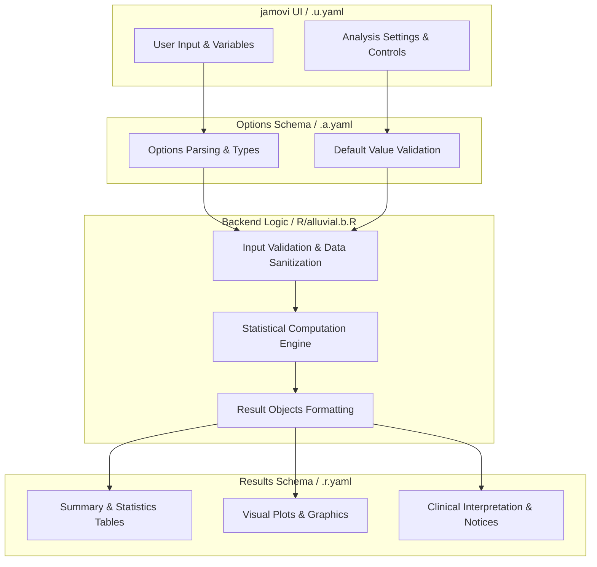
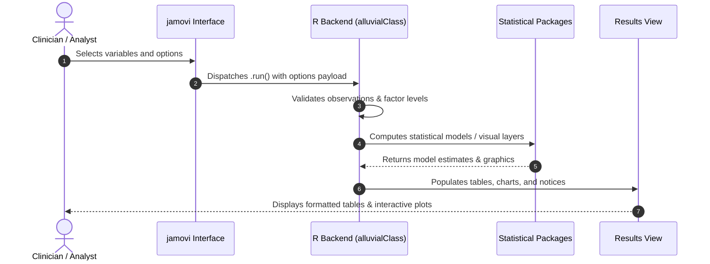

# Alluvial Diagrams - Developer Documentation

## 1. Overview

- **Function**: `alluvial`
- **Title**: Alluvial Diagrams
- **Module**: `ExplorationT`
- **Files**:
  - `jamovi/alluvial.u.yaml` - User Interface Definition
  - `jamovi/alluvial.a.yaml` - Options & Schema Definition
  - `jamovi/alluvial.r.yaml` - Results Layout & Tables
  - `R/alluvial.b.R` - Backend Implementation
- **Summary**: Draws an alluvial diagram: a flow picture of how cases move between the categories of several categorical variables. Ribbon width is the number of cases taking that path; with the GG Alluvial engine and a weight variable it is the total of that weight over those cases, while the Easy Alluvial engine always counts cases. Every axis variable is drawn with its own recorded values as the strata.

## 1a. Changelog

- **Date**: 2026-08-29
- **Summary**: Comprehensive documentation suite created & verified against active schemas and backend implementation.

## 2. Options Reference (`.a.yaml`)

| Option | Type | Default | Description |
| :--- | :--- | :--- | :--- |
| `data` | `Data` | `NULL` |  |
| `vars` | `Variables` | `NULL` | Variables |
| `condensationvar` | `Variable` | `NULL` | Condensation variable |
| `excl` | `Bool` | `FALSE` | Missing-value exclusion (NA) |
| `marg` | `Bool` | `FALSE` | Marginal plots |
| `fill` | `List` | `first_variable` | Fill by |
| `fillGgalluvial` | `Variable` | `NULL` | Fill by (ggalluvial) |
| `orient` | `List` | `vert` | Plot orientation |
| `usetitle` | `Bool` | `FALSE` | Custom title |
| `mytitle` | `String` | `Alluvial Plot` | Title |
| `maxvars` | `Integer` | `8` | Maximum variables |
| `showFlowTable` | `Bool` | `false` | Flow table: one row per path with cases, percent of cases and, when weighted, weight total; commonest first |
| `colorPalette` | `List` | `default` | Color palette |
| `showCounts` | `Bool` | `FALSE` | Counts on nodes |
| `themeStyle` | `List` | `default` | Theme style |
| `enhancedGradients` | `Bool` | `FALSE` | Enhanced edge gradients |
| `plotSubtitle` | `String` | `` | Plot subtitle |
| `weight` | `Variable` | `NULL` | Weight variable |
| `sankeyStyle` | `Bool` | `FALSE` | Sankey styling |
| `curveType` | `List` | `cubic` | Curve type |
| `flowDirection` | `List` | `left_right` | Flow direction |
| `engine` | `List` | `easyalluvial` | Plot engine |
| `labelNodes` | `Bool` | `FALSE` | Node labels |

## 3. Results Definition (`.r.yaml`)

| Output ID | Type | Title | Description |
| :--- | :--- | :--- | :--- |
| `notices` | `Preformatted` | `Important Information` |  |
| `todo` | `Html` | `To Do` |  |
| `plot` | `Image` | `Alluvial Diagrams` |  |
| `flowTable` | `Table` | `Flow Table` | visible when Flow table is on |
| `condensationWarning` | `Html` | `Condensation Plot Information` |  |
| `plot2` | `Image` | ``Condensation Plot ${condensationvar}`` |  |

## 4. Architecture & Data Flow Diagram

## 5. Execution Sequence

## 6. Change Impact & Safety Guidelines

- **Data Filtering**: Ensure observations with missing values are handled gracefully according to analysis options.
- **Formula Conflicts**: Use isolated environment calls or base formula methods when interacting with `ggstatsplot` or formula parsers.
- **Safe Deparsing**: Use `deparse(val)` in syntax generation (`asSource()`) to escape column names with spaces or special symbols.

