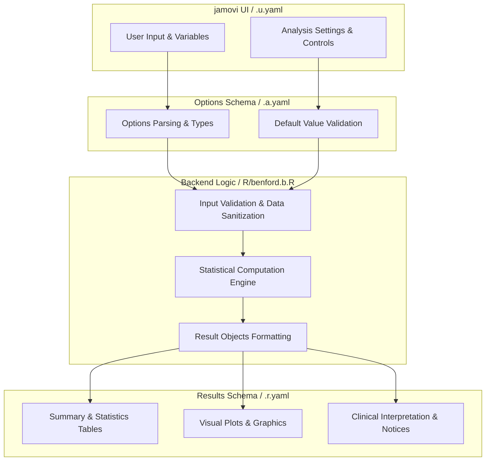
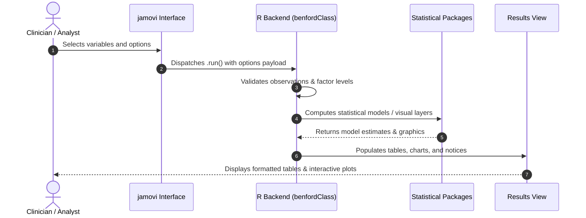

# Benford Analysis - Developer Documentation

## 1. Overview

- **Function**: `benford`
- **Title**: Benford Analysis
- **Module**: `ExplorationT`
- **Files**:
  - `jamovi/benford.u.yaml` - User Interface Definition
  - `jamovi/benford.a.yaml` - Options & Schema Definition
  - `jamovi/benford.r.yaml` - Results Layout & Tables
  - `R/benford.b.R` - Backend Implementation
- **Summary**: Tests whether the leading digits of a numeric variable follow Benford's Law, using the MAD conformity classification, a chi-square goodness-of-fit test and the Mantissa Arc Test. Intended as a screen for systematic recording artefacts such as rounding or preferred values.

## 1a. Changelog

- **Date**: 2026-08-29
- **Summary**: Comprehensive documentation suite created & verified against active schemas and backend implementation.

## 2. Options Reference (`.a.yaml`)

| Option | Type | Default | Description |
| :--- | :--- | :--- | :--- |
| `data` | `Data` | `NULL` |  |
| `var` | `Variable` | `NULL` | Variable |
| `digits` | `Integer` | `2` | Number of digits |

## 3. Results Definition (`.r.yaml`)

| Output ID | Type | Title | Description |
| :--- | :--- | :--- | :--- |
| `welcome` | `Html` | `Getting Started` |  |
| `notices` | `Preformatted` | `Important Information` |  |
| `explanation` | `Html` | `About Benford's Law in Clinical Data` |  |
| `dataWarning` | `Html` | `Data Validation` |  |
| `summary` | `Table` | `Analysis Summary` |  |
| `todo` | `Html` | `Guidelines` |  |
| `text` | `Preformatted` | `Detailed Analysis Results` |  |
| `text2` | `Preformatted` | `Leading-Digit Bin Membership` |  |
| `reportSentence` | `Html` | `Clinical Report` |  |
| `plot` | `Image` | `Digit Distribution Analysis` |  |

## 4. Architecture & Data Flow Diagram

## 5. Execution Sequence

## 6. Change Impact & Safety Guidelines

- **Data Filtering**: Ensure observations with missing values are handled gracefully according to analysis options.
- **Formula Conflicts**: Use isolated environment calls or base formula methods when interacting with `ggstatsplot` or formula parsers.
- **Safe Deparsing**: Use `deparse(val)` in syntax generation (`asSource()`) to escape column names with spaces or special symbols.

