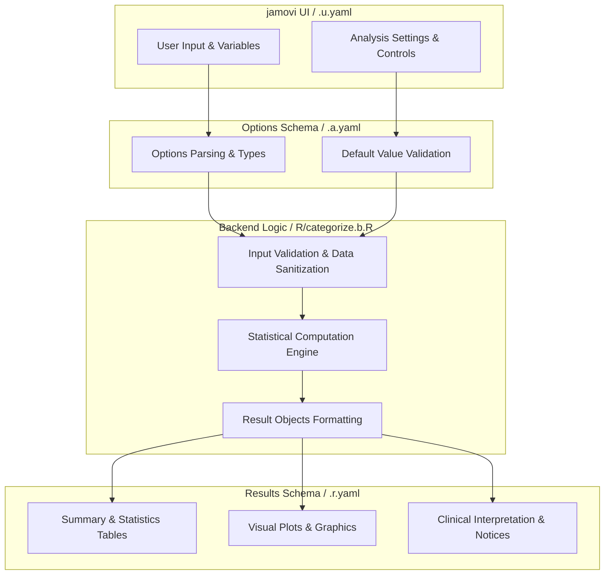
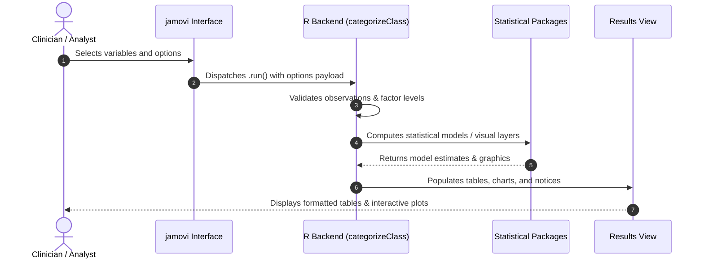

# Categorize Continuous Variables - Developer Documentation

## 1. Overview

- **Function**: `categorize`
- **Title**: Categorize Continuous Variables
- **Module**: `ExplorationT`
- **Files**:
  - `jamovi/categorize.u.yaml` - User Interface Definition
  - `jamovi/categorize.a.yaml` - Options & Schema Definition
  - `jamovi/categorize.r.yaml` - Results Layout & Tables
  - `R/categorize.b.R` - Backend Implementation
- **Summary**: Converts a continuous numeric variable into an ordered set of categories using equal-width intervals, sample quantiles, hand-entered break points, mean +/- SD bands, a median split, or Fisher-Jenks natural breaks. Reports the break points and the resulting category frequencies, draws the distribution with the boundaries marked, and can add the categorised variable straight to the dataset.

## 1a. Changelog

- **Date**: 2026-08-29
- **Summary**: Comprehensive documentation suite created & verified against active schemas and backend implementation.

## 2. Options Reference (`.a.yaml`)

| Option | Type | Default | Description |
| :--- | :--- | :--- | :--- |
| `data` | `Data` | `NULL` |  |
| `var` | `Variable` | `NULL` | Variable to categorize |
| `method` | `List` | `quantile` | Binning method |
| `nbins` | `Integer` | `4` | Number of categories |
| `breaks` | `String` | `` | Custom break points |
| `sdmult` | `Number` | `1` | SD multiplier |
| `labels` | `List` | `auto` | Category labels |
| `customlabels` | `String` | `` | Custom label names |
| `newvarname` | `String` | `` | New variable name |
| `addtodata` | `Output` | `NULL` | Categorized variable |
| `excludeoutofrange` | `Bool` | `FALSE` | Out-of-range value exclusion |
| `includelowest` | `Bool` | `TRUE` | Lowest value in first bin |
| `rightclosed` | `Bool` | `TRUE` | Right-closed intervals |
| `ordered` | `Bool` | `TRUE` | Ordered factor |
| `excl` | `Bool` | `TRUE` | Missing-value exclusion |
| `showcode` | `Bool` | `TRUE` | R code |
| `showplot` | `Bool` | `TRUE` | Distribution plot |

## 3. Results Definition (`.r.yaml`)

| Output ID | Type | Title | Description |
| :--- | :--- | :--- | :--- |
| `todo` | `Html` | `Instructions` |  |
| `notices` | `Html` | `Notes` |  |
| `summaryText` | `Html` | `Variable Summary` |  |
| `freqTable` | `Table` | `Category Frequencies` |  |
| `breakpointsTable` | `Table` | `Break Points` |  |
| `plot` | `Image` | `Distribution Plot` |  |
| `rcode` | `Html` | `R Code` |  |
| `addtodata` | `Output` | `Categorized Variable` |  |

## 4. Architecture & Data Flow Diagram

## 5. Execution Sequence

## 6. Change Impact & Safety Guidelines

- **Data Filtering**: Ensure observations with missing values are handled gracefully according to analysis options.
- **Formula Conflicts**: Use isolated environment calls or base formula methods when interacting with `ggstatsplot` or formula parsers.
- **Safe Deparsing**: Use `deparse(val)` in syntax generation (`asSource()`) to escape column names with spaces or special symbols.

