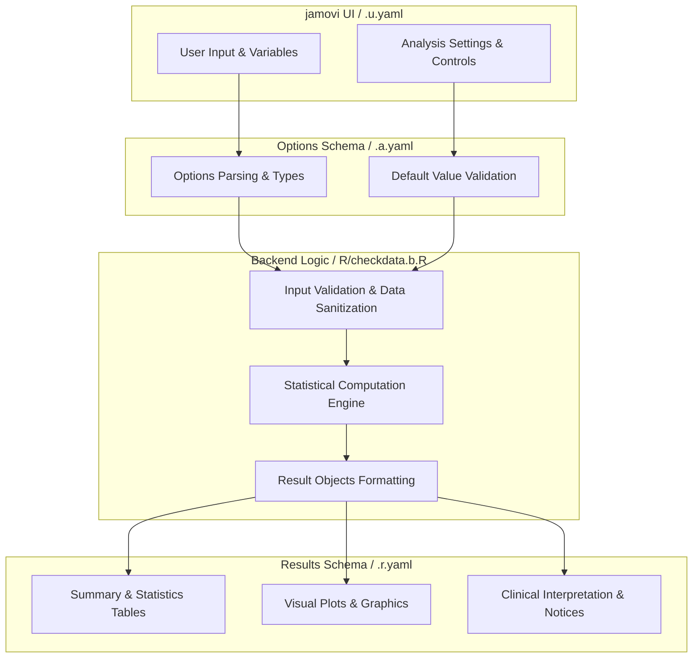
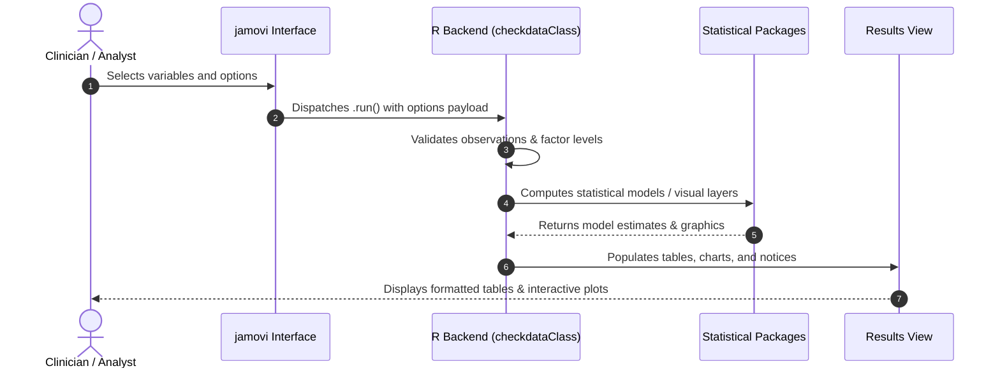

# Single Variable Quality Check - Developer Documentation

## 1. Overview

- **Function**: `checkdata`
- **Title**: Single Variable Quality Check
- **Module**: `ExplorationT`
- **Files**:
  - `jamovi/checkdata.u.yaml` - User Interface Definition
  - `jamovi/checkdata.a.yaml` - Options & Schema Definition
  - `jamovi/checkdata.r.yaml` - Results Layout & Tables
  - `R/checkdata.b.R` - Backend Implementation
- **Summary**: Screens a single variable for data-quality problems before it is used in analysis: completeness and the shape of its missingness, consensus outlier detection (at n = 10 or more a point is flagged only when at least 2 methods agree; below n = 10 single-method flags are shown, labelled informative-only and excluded from the grade; the MAD-based method is unavailable when there are 3 or fewer complete values or the MAD is zero, leaving 2 methods), distribution summaries, duplicate or repeated values, and optional plausibility checks for common clinical measurements. Reports a heuristic letter grade with a transparent component-by-component penalty breakdown. The grade uses rule-of-thumb thresholds and is not an externally validated quality metric; treat it as a screening aid, not a verdict.

## 1a. Changelog

- **Date**: 2026-08-29
- **Summary**: Comprehensive documentation suite created & verified against active schemas and backend implementation.

## 2. Options Reference (`.a.yaml`)

| Option | Type | Default | Description |
| :--- | :--- | :--- | :--- |
| `data` | `Data` | `NULL` |  |
| `var` | `Variable` | `NULL` | Variable to check |
| `showOutliers` | `Bool` | `TRUE` | Outlier analysis |
| `showDistribution` | `Bool` | `FALSE` | Distribution analysis |
| `showDuplicates` | `Bool` | `FALSE` | Duplicate analysis |
| `showPatterns` | `Bool` | `FALSE` | Data patterns |
| `rareCategoryThreshold` | `Number` | `5` | Rare category threshold (%) |
| `clinicalValidation` | `Bool` | `TRUE` | Clinical plausibility checks |
| `outlierTransform` | `List` | `none` | Outlier-detection transformation |
| `mcarTest` | `Bool` | `FALSE` | Explain MCAR testability |
| `cvMinMean` | `Number` | `0.01` | Minimum mean for CV calculation |
| `showSummary` | `Bool` | `FALSE` | Natural-language summary |
| `showAbout` | `Bool` | `FALSE` | About this analysis |
| `showCaveats` | `Bool` | `FALSE` | Caveats & assumptions |

## 3. Results Definition (`.r.yaml`)

| Output ID | Type | Title | Description |
| :--- | :--- | :--- | :--- |
| `notices` | `Html` | `Important Information` |  |
| `todo` | `Html` | `Getting Started` |  |
| `qualityText` | `Preformatted` | `Quality Assessment Summary` |  |
| `missingVals` | `Table` | `Missing Data Analysis` |  |
| `noOutliers` | `Html` | `Outlier Detection (Consensus: >=2 methods)` |  |
| `outliers` | `Table` | `Outlier Detection (Consensus: >=2 methods)` | Shows outliers detected by at least 2 of the methods that ran: Z-score (|z|>3), IQR (1.5x IQR rule), Modified Z-score (MAD-based |z|>3.5, unavailable when there are 3 or fewer complete values or the MAD is zero). Points flagged by only 1 method are not shown, except below n = 10 where single-method flags are shown, labelled informative-only in the table title and excluded from the quality grade. |
| `outlierMethodSummary` | `Table` | `Outlier Detection Method Summary (Heuristic)` | Summary of each outlier detection method. These are heuristic approaches; consider skewness and sample size when interpreting. |
| `distribution` | `Table` | `Distribution Analysis` |  |
| `duplicates` | `Table` | `Duplicate Values` |  |
| `patterns` | `Table` | `Data Patterns` |  |
| `naturalSummary` | `Html` | `Natural-Language Summary` |  |
| `aboutAnalysis` | `Html` | `About This Analysis` |  |
| `caveatsAssumptions` | `Html` | `Caveats & Assumptions` |  |

## 4. Architecture & Data Flow Diagram

## 5. Execution Sequence

## 6. Change Impact & Safety Guidelines

- **Data Filtering**: Ensure observations with missing values are handled gracefully according to analysis options.
- **Formula Conflicts**: Use isolated environment calls or base formula methods when interacting with `ggstatsplot` or formula parsers.
- **Safe Deparsing**: Use `deparse(val)` in syntax generation (`asSource()`) to escape column names with spaces or special symbols.

