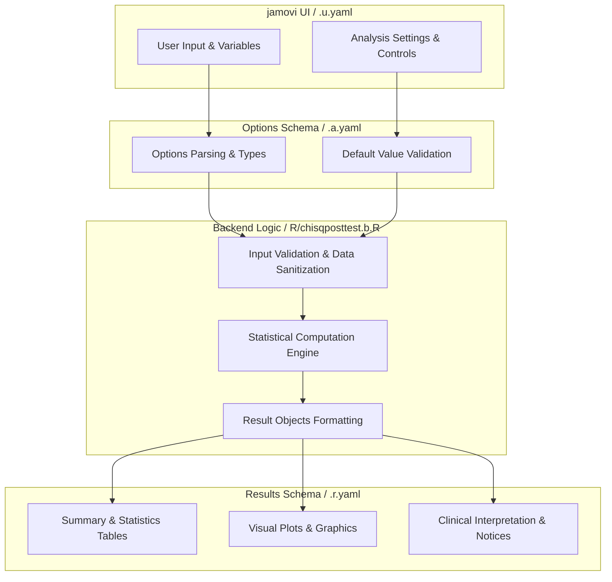
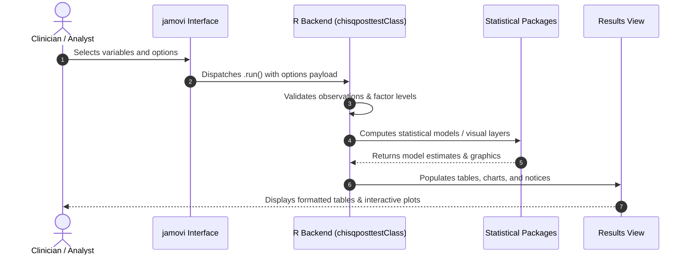

# Chi-Square Post-Hoc Tests - Developer Documentation

## 1. Overview

- **Function**: `chisqposttest`
- **Title**: Chi-Square Post-Hoc Tests
- **Module**: `ExplorationT`
- **Files**:
  - `jamovi/chisqposttest.u.yaml` - User Interface Definition
  - `jamovi/chisqposttest.a.yaml` - Options & Schema Definition
  - `jamovi/chisqposttest.r.yaml` - Results Layout & Tables
  - `R/chisqposttest.b.R` - Backend Implementation
- **Summary**: Performs Chi-Square test and post-hoc pairwise comparisons. Post-hoc pairwise comparisons are ONLY performed when the overall chi-square test is significant (p < α). This enforces proper statistical workflow and prevents data dredging. Selecting 'None' for post-hoc method DISABLES all pairwise testing. If you want unadjusted pairwise comparisons, this feature is not available (by design, as it would encourage inappropriate multiple testing). No automated validation against established packages exists. Use with caution for clinical decision-making.

## 1a. Changelog

- **Date**: 2026-08-29
- **Summary**: Comprehensive documentation suite created & verified against active schemas and backend implementation.

## 2. Options Reference (`.a.yaml`)

| Option | Type | Default | Description |
| :--- | :--- | :--- | :--- |
| `data` | `Data` | `NULL` |  |
| `rows` | `Variable` | `NULL` | Rows |
| `cols` | `Variable` | `NULL` | Columns |
| `counts` | `Variable` | `NULL` | Counts (optional) |
| `posthoc` | `List` | `bonferroni` | Post-hoc method |
| `sig` | `Number` | `0.05` | Significance level |
| `excl` | `Bool` | `TRUE` | Exclude missing values (always applied) |
| `exp` | `Bool` | `FALSE` | Expected values |
| `plot` | `Bool` | `FALSE` | Residual plot |
| `showResiduals` | `Bool` | `FALSE` | Residuals analysis |
| `showEducational` | `Bool` | `FALSE` | Educational panels |
| `showDetailedTables` | `Bool` | `FALSE` | Detailed comparison tables |
| `residualsCriterion` | `List` | `bonferroni` | Residual significance criterion |
| `residualsCutoff` | `Number` | `2` | Residual significance cutoff |
| `phiCI` | `Bool` | `FALSE` | Bootstrap confidence intervals for phi |
| `testSelection` | `List` | `auto` | Statistical test selection |
| `exportResults` | `Bool` | `FALSE` | Detailed results export |
| `showClinicalSummary` | `Bool` | `FALSE` | Clinical summary |
| `copyReadySentences` | `Bool` | `FALSE` | Report sentences |
| `showAssumptionsCheck` | `Bool` | `FALSE` | Assumptions check |
| `showGlossary` | `Bool` | `FALSE` | Statistical glossary |

## 3. Results Definition (`.r.yaml`)

| Output ID | Type | Title | Description |
| :--- | :--- | :--- | :--- |
| `todo` | `Html` | `To Do` |  |
| `notices` | `Preformatted` | `Important Information` |  |
| `chisqTable` | `Table` | `Chi-Square Test Results` |  |
| `assumptionsCheck` | `Html` | `Assumptions Validation` |  |
| `clinicalSummary` | `Html` | `Clinical Summary` |  |
| `educationalOverview` | `Html` | `Analysis Guide` |  |
| `weightedDataInfo` | `Html` | `Weighted Data Information` |  |
| `contingencyTable` | `Html` | `Contingency Table` |  |
| `residualsGuidance` | `Html` | `Residuals Interpretation Guidance` |  |
| `residualsAnalysis` | `Html` | `Adjusted Standardized Residuals` |  |
| `multipleTestingInfo` | `Html` | `Multiple Testing Information` |  |
| `posthocTable` | `Table` | `Pairwise Comparison Results` |  |
| `detailedComparisons` | `Html` | `Detailed Pairwise Comparison Tables` |  |
| `exportTable` | `Table` | `Exported Results` |  |
| `reportSentences` | `Html` | `Report-Ready Sentences` |  |
| `glossaryPanel` | `Html` | `Statistical Glossary` |  |
| `plot` | `Image` | `Adjusted Standardized Residuals` |  |

## 4. Architecture & Data Flow Diagram

## 5. Execution Sequence

## 6. Change Impact & Safety Guidelines

- **Data Filtering**: Ensure observations with missing values are handled gracefully according to analysis options.
- **Formula Conflicts**: Use isolated environment calls or base formula methods when interacting with `ggstatsplot` or formula parsers.
- **Safe Deparsing**: Use `deparse(val)` in syntax generation (`asSource()`) to escape column names with spaces or special symbols.

