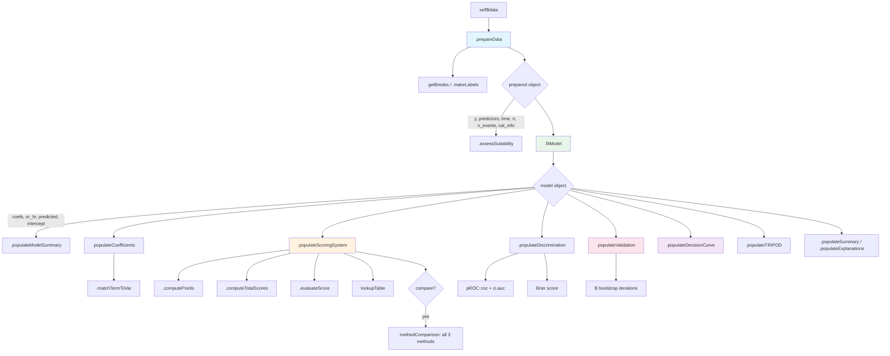
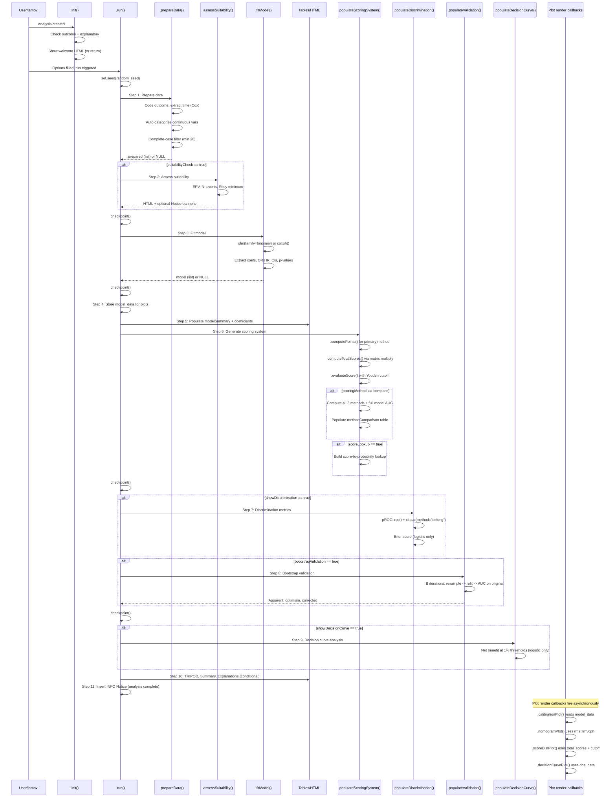

# Clinical Scoring System Generator (`clinicalscore`) -- Developer Documentation

> **Module:** meddecide (menuGroup: `meddecideT`)
> **Submenu:** Prediction Models
> **Version:** 0.0.1
> **Dependencies:** `pROC`, `rms`, `survival`, `ggplot2`, `jmvcore`

---

## 1. Overview

`clinicalscore` builds validated integer-point clinical scoring systems from logistic or Cox regression models. It converts regression coefficients into simple point-based risk scores that clinicians can compute at the bedside without software -- analogous to how the Framingham Risk Score or the Wells Score work in practice.

**Capabilities:**

| Feature | Description |
|---|---|
| Model types | Logistic regression (binary outcome), Cox regression (time-to-event) |
| Scoring methods | Schneeweiss (Mehta 2016), Beta10 (Zhang 2017), Sullivan/D'Agostino (2004) |
| Method comparison | Head-to-head AUC, accuracy, and information-loss table for all 3 + full model |
| Variable categorization | Auto-cut continuous variables at median, tertiles, quartiles, or manual breakpoints |
| Score lookup | Maps each possible total score to observed event rate and risk group |
| Suitability assessment | EPV, sample size, event count, Riley minimum N |
| Discrimination | AUC with DeLong CI, Brier score, clinical interpretation |
| Bootstrap validation | Harrell optimism-corrected AUC/C-index (50--1000 iterations) |
| Calibration plot | Predicted vs observed by risk groups with LOESS smoother |
| Nomogram | `rms::nomogram()` for logistic or Cox models |
| Score distribution plot | Histogram by outcome group with optimal cutoff line |
| Decision curve analysis | Net benefit table and plot (logistic only) |
| TRIPOD checklist | 16-item Type 1b compliance assessment |
| Notices | 8 `jmvcore::Notice` banners for warnings and completion |

**File inventory:**

| File | Path | Purpose |
|---|---|---|
| Analysis definition | `jamovi/clinicalscore.a.yaml` | 22 options, menu placement |
| Results definition | `jamovi/clinicalscore.r.yaml` | 18 output items |
| UI definition | `jamovi/clinicalscore.u.yaml` | 6 UI panels |
| Backend | `R/clinicalscore.b.R` | R6 class, ~937 lines |
| Header (auto) | `R/clinicalscore.h.R` | Generated from YAML |
| Test data script | `data-raw/create_clinicalscore_test_data.R` | Creates 2 datasets |
| Test data | `data/clinicalscore_breast.rda` | 150 rows, 9 cols (logistic) |
| Test data | `data/clinicalscore_lung.rda` | 200 rows, 7 cols (Cox) |
| Tests | `tests/testthat/test-clinicalscore.R` | 12 test blocks |

---

## 2. UI Controls to Options Map

The UI (`.u.yaml`) is organized into 6 collapsible panels plus top-level variable selectors. The table below maps each UI widget to its underlying option name.

| UI Panel | Widget Type | Option Name | a.yaml Type |
|---|---|---|---|
| *(top level)* | VariablesListBox | `outcome` | Variable |
| *(top level)* | LevelSelector | `outcomeLevel` | Level |
| *(top level)* | VariablesListBox | `explanatory` | Variables |
| *(top level)* | VariablesListBox | `elapsedtime` | Variable |
| Model & Scoring | ComboBox | `modelType` | List |
| Model & Scoring | ComboBox | `scoringMethod` | List |
| Model & Scoring | TextBox | `maxPoints` | Integer |
| Variable Categorization | CheckBox | `autoCategorize` | Bool |
| Variable Categorization | ComboBox | `categorizeMethod` | List |
| Variable Categorization | TextBox | `customBreaks` | String |
| Validation | CheckBox | `suitabilityCheck` | Bool |
| Validation | CheckBox | `bootstrapValidation` | Bool |
| Validation | TextBox | `bootstrapN` | Integer |
| Output Options | CheckBox | `scoreLookup` | Bool |
| Output Options | CheckBox | `showNomogram` | Bool |
| Output Options | CheckBox | `showCalibration` | Bool |
| Output Options | TextBox | `calibrationGroups` | Integer |
| Output Options | CheckBox | `showDiscrimination` | Bool |
| Output Options | CheckBox | `showDecisionCurve` | Bool |
| Output Options | CheckBox | `showTRIPOD` | Bool |
| Explanatory Output | CheckBox | `showSummary` | Bool |
| Explanatory Output | CheckBox | `showExplanations` | Bool |
| *(bottom layout)* | TextBox | `random_seed` | Integer |

**Enable conditions (from `.u.yaml`):**

- `outcomeLevel` enabled when `outcome` is set
- `categorizeMethod` enabled when `autoCategorize == true`
- `customBreaks` enabled when `autoCategorize == true && categorizeMethod == 'manual'`
- `bootstrapN` enabled when `bootstrapValidation == true`
- `calibrationGroups` enabled when `showCalibration == true`

---

## 3. Options Reference (22 options)

| # | Name | Type | Default | Constraints | Description |
|---|---|---|---|---|---|
| 1 | `data` | Data | -- | -- | Input data frame |
| 2 | `modelType` | List | `logistic` | logistic, cox | Regression model type |
| 3 | `outcome` | Variable | -- | suggested: nominal/ordinal/continuous; permitted: factor/numeric | Outcome variable (binary or event indicator) |
| 4 | `outcomeLevel` | Level | -- | variable: (outcome) | Event level; defaults to 2nd factor level |
| 5 | `elapsedtime` | Variable | NULL | suggested: continuous; permitted: numeric | Time variable (required for Cox only) |
| 6 | `explanatory` | Variables | -- | suggested: nominal/ordinal/continuous; permitted: factor/numeric | Predictor variables (min 2 required) |
| 7 | `autoCategorize` | Bool | true | -- | Auto-convert continuous predictors to categories |
| 8 | `categorizeMethod` | List | `median` | median, tertiles, quartiles, manual | Method for auto-categorization |
| 9 | `customBreaks` | String | `""` | -- | Comma-separated cutpoints for manual mode (e.g., "3,10,20") |
| 10 | `scoringMethod` | List | `schneeweiss` | schneeweiss, beta10, sullivan, compare | Point-assignment algorithm |
| 11 | `maxPoints` | Integer | 10 | [3, 20] | Maximum points per feature (Beta10/Sullivan scale) |
| 12 | `bootstrapValidation` | Bool | false | -- | Enable Harrell bootstrap optimism correction |
| 13 | `bootstrapN` | Integer | 200 | [50, 1000] | Number of bootstrap iterations |
| 14 | `scoreLookup` | Bool | true | -- | Generate score-to-probability lookup table |
| 15 | `showNomogram` | Bool | true | -- | Generate rms nomogram |
| 16 | `showCalibration` | Bool | true | -- | Show calibration plot (logistic only) |
| 17 | `calibrationGroups` | Integer | 4 | [2, 10] | Number of risk groups for calibration |
| 18 | `showDiscrimination` | Bool | true | -- | Show AUC/C-index and Brier score |
| 19 | `showDecisionCurve` | Bool | false | -- | Decision curve analysis (logistic only) |
| 20 | `showTRIPOD` | Bool | false | -- | TRIPOD Type 1b compliance checklist |
| 21 | `suitabilityCheck` | Bool | true | -- | Run EPV and sample size checks |
| 22 | `showSummary` | Bool | false | -- | Natural-language results summary |
| 23 | `showExplanations` | Bool | false | -- | Static methodology explanations |
| 24 | `random_seed` | Integer | 42 | [1, 999999] | Seed for reproducibility |

---

## 4. Backend Architecture

### 4.1 Private Methods

| Method | Lines (approx) | Called From | Purpose |
|---|---|---|---|
| `.matchTermToVar()` | 22--43 | `.populateCoefficients()`, `.populateScoringSystem()` | Longest-prefix matching of model terms to original variable names (handles `make.names()` mangling, spaces, special chars) |
| `.init()` | 45--69 | jamovi engine | Welcome HTML with step-by-step instructions and method descriptions |
| `.run()` | 72--157 | jamovi engine | Main 11-step execution pipeline with checkpoints |
| `.prepareData()` | 162--243 | `.run()` step 1 | Outcome coding (factor/numeric), time extraction (Cox), auto-categorization, complete-case filtering |
| `.getBreaks()` | 245--261 | `.prepareData()` | Compute cut-points by method (median/tertiles/quartiles/manual) |
| `.makeLabels()` | 263--274 | `.prepareData()` | Generate readable labels for categorized variables |
| `.fitModel()` | 279--315 | `.run()` step 3 | Fit `glm(family=binomial)` or `survival::coxph()`, extract coefficients/OR/HR/CI/p |
| `.computePoints()` | 320--344 | `.populateScoringSystem()` | Core integer-point computation for all 3 methods |
| `.computeTotalScores()` | 346--348 | `.populateScoringSystem()` | Matrix-multiply design matrix by points vector |
| `.evaluateScore()` | 350--386 | `.populateScoringSystem()` | AUC via `pROC::roc()`, Youden-optimal cutoff, sensitivity/specificity/accuracy |
| `.assessSuitability()` | 391--458 | `.run()` step 2 | Traffic-light HTML table (EPV, N, events, Riley minimum) + Notice banners |
| `.populateModelSummary()` | 460--476 | `.run()` step 5 | 8-row summary table |
| `.populateCoefficients()` | 478--494 | `.run()` step 5 | Coefficient table with parsed variable/category names |
| `.populateScoringSystem()` | 496--599 | `.run()` step 6 | Orchestrates scoring, method comparison, lookup table |
| `.populateDiscrimination()` | 601--643 | `.run()` step 7 | AUC with DeLong CI, Brier score, interpretation + Notice warnings |
| `.populateValidation()` | 645--696 | `.run()` step 8 | Harrell bootstrap optimism correction (resample -> refit -> predict original -> compute optimism) |
| `.calibrationPlot()` | 701--738 | render callback | ggplot2 calibration plot with LOESS smoother and perfect-calibration diagonal |
| `.nomogramPlot()` | 740--771 | render callback | `rms::lrm()` or `rms::cph()` + `rms::nomogram()` with `datadist` setup |
| `.scoreDistPlot()` | 773--793 | render callback | ggplot2 histogram of total scores colored by outcome, red dashed cutoff line |
| `.populateDecisionCurve()` | 798--832 | `.run()` step 9 | Net benefit at each threshold (model vs treat-all vs treat-none) |
| `.decisionCurvePlot()` | 834--852 | render callback | ggplot2 decision curve (net benefit vs threshold) |
| `.populateTRIPOD()` | 857--896 | `.run()` step 10 | 16-item TRIPOD Type 1b checklist (development + internal validation) |
| `.populateSummary()` | 898--914 | `.run()` step 10 | Natural-language HTML summary |
| `.populateExplanations()` | 916--935 | `.run()` step 10 | Static HTML explaining all 3 scoring methods |

### 4.2 How Each Option is Consumed

| Option | Backend usage |
|---|---|
| `outcome` | `.prepareData()` -- extracts column, determines event/non-event coding |
| `outcomeLevel` | `.prepareData()` -- sets positive class; if NULL/empty, uses 2nd factor level |
| `elapsedtime` | `.prepareData()` -- required for Cox; converted via `jmvcore::toNumeric()` |
| `explanatory` | `.prepareData()` -- builds predictor data frame; minimum 2 required |
| `modelType` | `.prepareData()` + `.fitModel()` -- switches between `glm()` and `coxph()` |
| `autoCategorize` | `.prepareData()` -- gate for continuous-to-factor conversion |
| `categorizeMethod` | `.getBreaks()` -- selects median/tertiles/quartiles/manual |
| `customBreaks` | `.getBreaks()` -- parsed when `categorizeMethod == "manual"` |
| `scoringMethod` | `.populateScoringSystem()` -- selects primary method; `compare` triggers all three |
| `maxPoints` | `.computePoints()` -- scale factor for Beta10 and Sullivan |
| `bootstrapValidation` | `.run()` gate -- calls `.populateValidation()` |
| `bootstrapN` | `.populateValidation()` -- loop iteration count |
| `scoreLookup` | `.populateScoringSystem()` gate -- builds score-to-probability lookup |
| `showNomogram` | r.yaml visibility -- nomogram plot rendered when true |
| `showCalibration` | r.yaml visibility -- calibration plot rendered when true |
| `calibrationGroups` | `.calibrationPlot()` -- number of quantile-based risk groups |
| `showDiscrimination` | `.run()` gate -- calls `.populateDiscrimination()` |
| `showDecisionCurve` | `.run()` gate -- calls `.populateDecisionCurve()` |
| `showTRIPOD` | `.run()` gate -- calls `.populateTRIPOD()` |
| `suitabilityCheck` | `.run()` gate -- calls `.assessSuitability()` |
| `showSummary` | `.run()` gate -- calls `.populateSummary()` |
| `showExplanations` | `.run()` gate -- calls `.populateExplanations()` |
| `random_seed` | `.run()` -- `set.seed()` at top of execution |

### 4.3 Plot State Management

Plots store state via `private$.model_data`, a named list that accumulates data across the pipeline. Unlike `lassologistic` which uses `image$setState()` per plot, `clinicalscore` shares a single private store.

| Plot | State fields used | Key implementation notes |
|---|---|---|
| `calibrationPlot` | `prepared`, `model` | Reduces `calibrationGroups` if quantile breaks collapse; logistic only |
| `nomogramPlot` | `prepared` | Sets up `rms::datadist()` with `options(datadist="dd")`; uses `on.exit()` cleanup |
| `scoreDistPlot` | `total_scores`, `cutoff`, `prepared` | Populated after `.populateScoringSystem()` stores scores |
| `decisionCurvePlot` | `dca_data` | Populated by `.populateDecisionCurve()` (fine-grained 0.01 step thresholds) |

**Render functions** receive `(image, ggtheme, theme, ...)` and return `TRUE` on success, `FALSE` to skip rendering.

### 4.4 The `.matchTermToVar()` Helper

This method solves a subtle but important problem: R's `model.matrix()` concatenates variable names with factor levels (e.g., `gradeG3`, `er_statusPositive`), and `make.names()` can mangle variable names with spaces or special characters. `.matchTermToVar()` uses longest-prefix matching to decompose a model term back into its original variable name and category suffix.

```
Input:  term = "er_statusPositive", var_list = c("age", "er_status", "grade")
Output: list(var = "er_status", cat = "Positive")
```

---

## 5. Results Definition (18 output items)

| # | Name | Type | Visibility | Columns / Dimensions |
|---|---|---|---|---|
| 1 | `todo` | Html | always | -- (welcome instructions or error messages) |
| 2 | `suitabilityReport` | Html | `suitabilityCheck` | -- (traffic-light HTML table) |
| 3 | `modelSummary` | Table | always | `statistic` (text), `value` (text) |
| 4 | `coefficients` | Table | always | `variable` (text), `category` (text), `coefficient` (zto), `effectSize` (zto), `ci_lower` (zto), `ci_upper` (zto), `p_value` (zto,pvalue) |
| 5 | `scoringTable` | Table | always | `variable` (text), `category` (text), `effectSize` (zto), `points` (integer) |
| 6 | `methodComparison` | Table | `scoringMethod == 'compare'` | `method` (text), `auc` (zto), `accuracy` (zto), `info_loss` (zto), `reference` (text) |
| 7 | `scoringPerformance` | Table | always | `metric` (text), `value` (text) |
| 8 | `lookupTable` | Table | `scoreLookup` | `score` (int), `n_cases` (int), `n_events` (int), `probability` (zto), `risk_group` (text) |
| 9 | `discriminationTable` | Table | `showDiscrimination` | `metric` (text), `estimate` (zto), `ci_lower` (zto), `ci_upper` (zto), `interpretation` (text) |
| 10 | `validationTable` | Table | `bootstrapValidation` | `metric` (text), `apparent` (zto), `optimism` (zto), `corrected` (zto) |
| 11 | `calibrationPlot` | Image | `showCalibration` | 600x500, renderFun: `.calibrationPlot` |
| 12 | `nomogramPlot` | Image | `showNomogram` | 800x600, renderFun: `.nomogramPlot`, refs: rms |
| 13 | `scoreDistPlot` | Image | always | 600x400, renderFun: `.scoreDistPlot` |
| 14 | `decisionCurveTable` | Table | `showDecisionCurve` | `threshold` (zto), `net_benefit_model` (zto), `net_benefit_all` (zto) |
| 15 | `decisionCurvePlot` | Image | `showDecisionCurve` | 600x500, renderFun: `.decisionCurvePlot` |
| 16 | `tripodChecklist` | Html | `showTRIPOD` | -- (16-item checklist with pass/fail icons) |
| 17 | `summaryText` | Html | `showSummary` | -- (natural-language paragraph) |
| 18 | `explanations` | Html | `showExplanations` | -- (static methodology guide) |

### clearWith dependencies

| Output group | clearWith options |
|---|---|
| Core tables (3--4) | `outcome`, `outcomeLevel`, `explanatory`, `modelType`, `elapsedtime` |
| Coefficients (4) | + `autoCategorize`, `categorizeMethod`, `customBreaks` |
| Scoring tables (5, 7, 8) | + `scoringMethod`, `maxPoints` |
| Method comparison (6) | `outcome`, `outcomeLevel`, `explanatory`, `modelType`, `maxPoints` |
| Discrimination (9) | `outcome`, `outcomeLevel`, `explanatory`, `modelType`, `elapsedtime` |
| Validation (10) | + `bootstrapN` |
| Calibration plot (11) | + `calibrationGroups` |
| Score dist plot (13) | + `scoringMethod`, `maxPoints` |
| DCA (14--15) | `outcome`, `outcomeLevel`, `explanatory`, `modelType` |

---

## 6. Data Flow Diagram



### Prepared object structure (returned by `.prepareData()`)

```
list(
  y              = numeric   -- 0/1 binary response (or event indicator)
  predictors     = data.frame -- complete-case predictors (may include auto-categorized factors)
  time           = numeric   -- survival time (NULL for logistic)
  n              = integer   -- complete cases count
  n_events       = integer   -- sum(y == 1)
  n_nonevents    = integer   -- n - n_events
  event_level    = character -- label of positive class
  ref_level      = character -- label of reference class
  model_type     = character -- "logistic" or "cox"
  cat_info       = list      -- named list of {breaks, labels} for each categorized variable
  expl_vars      = character -- original variable names from self$options$explanatory
)
```

### Model object structure (returned by `.fitModel()`)

```
list(
  model          = glm/coxph -- fitted model object
  coefs          = named numeric -- coefficients (no intercept for logistic)
  se             = numeric   -- standard errors
  p_vals         = numeric   -- p-values
  or_hr          = numeric   -- exp(coefs): odds ratios (logistic) or hazard ratios (Cox)
  ci_lower       = numeric   -- exp(coef - 1.96*SE)
  ci_upper       = numeric   -- exp(coef + 1.96*SE)
  predicted      = numeric   -- predicted probabilities (logistic) or risk scores (Cox)
  intercept      = numeric   -- model intercept (NA for Cox)
  var_names      = character -- names(coefs): model term names
)
```

---

## 7. Execution Sequence



---

## 8. Notice Catalog

The backend uses `jmvcore::Notice` objects inserted via `self$results$insert()`. There are 8 distinct notices across the pipeline.

| Name | Type | Trigger | Content |
|---|---|---|---|
| `dataError` | ERROR | `.prepareData()` throws | "Data preparation failed: {message}" |
| `modelError` | ERROR | `.fitModel()` throws | "Model fitting failed: {message}" |
| `epvCritical` | STRONG_WARNING | EPV < 5 | "EPV = X (<5): high overfitting risk. Reduce to N or fewer predictors." |
| `epvMarginal` | WARNING | 5 <= EPV < 10 | "EPV = X (marginal). Enable bootstrap validation." |
| `sampleSizeInsufficient` | STRONG_WARNING | N < Riley minimum | "Sample size N=X is below recommended minimum of Y (Riley et al. 2020)." |
| `poorDiscrimination` | WARNING | AUC < 0.7 | "AUC = X indicates poor discrimination. Consider adding more informative predictors." |
| `overfitRisk` | STRONG_WARNING | AUC > 0.95 and N < 100 | "AUC = X with N=Y: likely overfitted. Enable bootstrap validation." |
| `analysisComplete` | INFO | End of `.run()` | "Scoring system built using {type} regression with {p} predictors (N={n}, {events} events). Method: {method}." |

**Known limitation:** These use `self$results$insert()` with `jmvcore::Notice` objects, which contain function references that may fail protobuf serialization. See `CLAUDE.md` for the migration path to HTML-based notices.

---

## 9. Scoring System Methods

### 9.1 Schneeweiss (Mehta et al., J Clin Epidemiol 2016)

```
min_abs = min(|coefs| where coef != 0)
raw = coefs / min_abs
points = round(raw)
# ensure minimum +/-1 point for non-zero coefficients
```

Default and recommended method. Divides each coefficient by the smallest absolute coefficient, preserving relative importance ratios. Mathematically superior to odds-ratio-based methods.

### 9.2 Beta10 (Zhang et al., Ann Transl Med 2017)

```
max_abs = max(|coefs|)
raw = coefs * max_points / max_abs
points = round(raw)
```

Scales all coefficients relative to the largest, multiplied by `maxPoints`. Simple and widely used, but may lose discrimination when many predictors have similar coefficients.

### 9.3 Sullivan/D'Agostino (Statistics in Medicine 2004)

```
W = max(|coefs|)            # reference variable
raw = (coefs / W) * max_points
points = round(raw)
```

Framingham Heart Study approach. Functionally similar to Beta10 but framed as reference-variable scaling. Originally designed for multi-variable risk functions with pre-categorized predictors.

### 9.4 Compare Mode

When `scoringMethod == "compare"`, all three methods are computed. The `methodComparison` table shows:

| Column | Meaning |
|---|---|
| AUC / C-index | Discrimination of the integer-score classifier |
| Accuracy | At Youden-optimal cutoff |
| Info Loss (%) | `(1 - score_AUC / full_model_AUC) * 100` |

The full continuous model row has `info_loss = 0` by definition. Lower information loss means the integer approximation preserves more discriminative ability.

### 9.5 Score computation for observations

Total score per patient is computed as: `model_matrix %*% points_vector`

Where `model_matrix` is the indicator-coded design matrix (from `model.matrix(~ ., data = predictors)`). This means:
- **Factor variables**: get points when the dummy indicator is 1 (i.e., that level is present)
- **Continuous variables** (if not auto-categorized): treated as-is in the design matrix

### 9.6 Lookup table

Each unique total score is mapped to:
- **N**: number of patients with that score
- **Events**: number of events at that score
- **Predicted Risk**: observed event rate (events / N)
- **Risk Group**: "High risk" if score >= optimal cutoff, else "Low risk"

---

## 10. Change Impact Guide

| Change | Files to modify | Recompile? | Notes |
|---|---|---|---|
| Add new option | `.a.yaml`, `.u.yaml`, `.b.R` | Yes (`jmvtools::prepare()`) | `.h.R` regenerated |
| Add new table | `.r.yaml`, `.b.R` | Yes | Add populate method + clearWith |
| Add new plot | `.r.yaml`, `.b.R` (render + state storage) | Yes | Store data in `private$.model_data` |
| Change scoring formula | `.b.R` only (`.computePoints()`) | No | Backend-only change |
| Change suitability thresholds | `.b.R` only (`.assessSuitability()`) | No | EPV / sample size cutoffs |
| Change clearWith dependencies | `.r.yaml` | Yes | Controls when jamovi re-runs |
| Add new scoring method | `.a.yaml` (scoringMethod options), `.b.R` (`.computePoints()`, `.populateScoringSystem()`) | Yes | |
| Add new categorization method | `.a.yaml` (categorizeMethod options), `.u.yaml`, `.b.R` (`.getBreaks()`) | Yes | |
| Add external validation support | `.a.yaml` (validation data option), `.b.R` (split logic) | Yes | Major feature addition |
| Convert Notices to HTML | `.r.yaml` (add Html item), `.b.R` (replace `insert()`) | Yes | Follow waterfall.b.R pattern |
| Add new model type (e.g., ordinal) | `.a.yaml`, `.b.R` (`.fitModel()` + prediction logic) | Yes | Requires new coefficient extraction |

---

## 11. Example Usage

### 11.1 From R Console (Logistic)

```r
data(clinicalscore_breast, package = "ClinicoPath")

# Build scoring system with default Schneeweiss method
result <- clinicalscore(
    data = clinicalscore_breast,
    outcome = "recurrence",
    outcomeLevel = "Yes",
    explanatory = vars(age, tumor_size_cm, grade, er_status,
                       her2_status, ki67_pct, ln_positive, lvi),
    modelType = "logistic",
    scoringMethod = "schneeweiss",
    autoCategorize = TRUE,
    categorizeMethod = "median"
)

# View scoring card
result$scoringTable$asDF

# View score-to-risk mapping
result$lookupTable$asDF
```

### 11.2 Compare All Methods with Validation

```r
result <- clinicalscore(
    data = clinicalscore_breast,
    outcome = "recurrence",
    outcomeLevel = "Yes",
    explanatory = vars(age, tumor_size_cm, grade, er_status,
                       her2_status, ki67_pct, ln_positive, lvi),
    scoringMethod = "compare",
    bootstrapValidation = TRUE,
    bootstrapN = 200,
    showDiscrimination = TRUE,
    showCalibration = TRUE,
    showTRIPOD = TRUE
)

# Which method has least information loss?
result$methodComparison$asDF

# Is the model overfitted?
result$validationTable$asDF

# TRIPOD compliance
result$tripodChecklist$content
```

### 11.3 Cox Regression (Survival Scoring)

```r
data(clinicalscore_lung, package = "ClinicoPath")

result <- clinicalscore(
    data = clinicalscore_lung,
    modelType = "cox",
    outcome = "event",
    outcomeLevel = "Dead",
    elapsedtime = "survival_months",
    explanatory = vars(age, stage, ecog, smoking, histology),
    scoringMethod = "schneeweiss",
    showNomogram = TRUE,
    showDiscrimination = TRUE
)

result$scoringTable$asDF
result$discriminationTable$asDF
```

### 11.4 Custom Clinical Cutpoints

```r
# Use Ki-67 cutpoints from WHO classification (3%, 10%, 20%)
result <- clinicalscore(
    data = clinicalscore_breast,
    outcome = "recurrence",
    outcomeLevel = "Yes",
    explanatory = vars(ki67_pct, grade, er_status),
    autoCategorize = TRUE,
    categorizeMethod = "manual",
    customBreaks = "3,10,20"
)
```

---

## 12. Appendix

### A. Table Schemas (detailed column types)

#### modelSummary

| Row | statistic | value |
|---|---|---|
| 1 | Model type | "Logistic Regression" |
| 2 | Total observations | "143" |
| 3 | Events | "72 (Yes)" |
| 4 | Non-events | "71 (No)" |
| 5 | Predictors | "8" |
| 6 | Model coefficients | "12" |
| 7 | Effect measure | "Odds Ratio" |
| 8 | EPV | "5.9" |

#### coefficients

| variable | category | coefficient | effectSize | ci_lower | ci_upper | p_value |
|---|---|---|---|---|---|---|
| grade | G2 | 0.812 | 2.253 | 0.891 | 5.697 | 0.087 |
| grade | G3 | 1.523 | 4.586 | 1.654 | 12.718 | 0.003 |
| er_status | Positive | -0.487 | 0.614 | 0.284 | 1.329 | 0.215 |

#### methodComparison (compare mode)

| method | auc | accuracy | info_loss | reference |
|---|---|---|---|---|
| Beta10 | 0.831 | 0.762 | 2.1 | Zhang et al. 2017 |
| Schneeweiss | 0.842 | 0.776 | 0.8 | Mehta et al. 2016 |
| Sullivan/D'Agostino | 0.831 | 0.762 | 2.1 | Sullivan et al. 2004 |
| Full model (continuous) | 0.849 | -- | 0.0 | Reference |

#### validationTable

| metric | apparent | optimism | corrected |
|---|---|---|---|
| AUC | 0.849 | 0.032 | 0.817 |

Note: `corrected = apparent - mean(optimism)`. High optimism (>0.05) triggers a table footnote warning.

#### discriminationTable

| metric | estimate | ci_lower | ci_upper | interpretation |
|---|---|---|---|---|
| AUC | 0.849 | 0.789 | 0.909 | Good |
| Brier Score | 0.172 | -- | -- | Good |

AUC thresholds: >=0.9 Excellent, >=0.8 Good, >=0.7 Acceptable, <0.7 Poor.
Brier thresholds: <0.1 Excellent, <0.2 Good, >=0.2 Poor.

#### lookupTable

| score | n_cases | n_events | probability | risk_group |
|---|---|---|---|---|
| -2 | 8 | 1 | 0.125 | Low risk |
| 0 | 23 | 6 | 0.261 | Low risk |
| 2 | 35 | 14 | 0.400 | Low risk |
| 4 | 42 | 25 | 0.595 | High risk |
| 6 | 28 | 20 | 0.714 | High risk |
| 8 | 7 | 6 | 0.857 | High risk |

### B. Suitability Checks

| Check | Green | Yellow | Red |
|---|---|---|---|
| Events per variable (EPV) | >= 10 | 5-10 | < 5 |
| Sample size (N) | >= 100 | 50-100 | < 50 |
| Event count | >= 50 | 20-50 | < 20 |
| Riley minimum N | N >= minimum | -- | N < minimum |

Riley minimum formula: `max(10 * p / min(prevalence, 1-prevalence), 100)`

### C. Test Dataset Reference

#### `clinicalscore_breast` (150 rows, 9 columns)

Simulates breast cancer recurrence prediction with realistic clinicopathological features.

| Column | Type | Description |
|---|---|---|
| `recurrence` | factor | No / Yes (outcome) |
| `age` | integer | Patient age (~N(58, 12)) |
| `tumor_size_cm` | numeric | Tumor diameter in cm (~N(2.5, 1.5)), ~2% missing |
| `grade` | factor | G1 / G2 / G3 (25/45/30%) |
| `er_status` | factor | Positive / Negative (75/25%) |
| `her2_status` | factor | Negative / Positive (80/20%) |
| `ki67_pct` | numeric | Ki-67 percentage (grade-correlated), ~3% missing |
| `ln_positive` | integer | Positive lymph nodes (Poisson, grade-correlated) |
| `lvi` | factor | Absent / Present (grade-correlated) |

#### `clinicalscore_lung` (200 rows, 7 columns)

Simulates lung cancer survival scoring with stage-correlated endpoints.

| Column | Type | Description |
|---|---|---|
| `survival_months` | numeric | Follow-up time in months (exponential, 0.5--120) |
| `event` | factor | Alive / Dead (event indicator) |
| `age` | integer | Patient age (~N(65, 10)) |
| `stage` | factor | I / II / III / IV (20/25/30/25%) |
| `ecog` | integer | ECOG performance status (0--3) |
| `smoking` | factor | Never / Former / Current (15/45/40%) |
| `histology` | factor | Adeno / Squamous / Large_cell (50/35/15%) |

### D. TRIPOD Checklist Items (16 items)

The TRIPOD checklist evaluates Type 1b compliance (development + internal validation):

1. Title/Abstract -- study design identified
2. Background -- context and rationale
3. Objectives -- prediction model development
4. Source of data -- multi-source, N reported
5. Participants -- events and non-events counted
6. Outcome -- binary classification described
7. Predictors -- variable and term counts
8. Sample size -- EPV adequacy
9. Missing data -- complete case analysis noted
10. Model development -- regression type reported
11. Model specification -- predictor count in final model
12. Discrimination -- AUC/C-index (requires `showDiscrimination`)
13. Calibration -- plot generated (requires `showCalibration`)
14. Internal validation -- bootstrap (requires `bootstrapValidation`)
15. Clinical utility -- DCA (requires `showDecisionCurve`)
16. Interpretation -- scoring system with lookup table

Reference: Collins GS et al. TRIPOD Statement. BMJ 2015;350:g7594

### E. References

- Sullivan LM, Massaro JM, D'Agostino RB Sr (2004). Presentation of multivariate data for clinical use: The Framingham Study risk score functions. *Stat Med*, 23(10):1631-60.
- Mehta HB, Mehta V, Girber CG, et al. (2016). Development and validation of the LASSO-PATTERNED post-operative NSCLC complication risk assessment tool. *J Clin Epidemiol*, 73:42-55.
- Zhang Z, Kattan MW (2017). Drawing nomograms with R: applications to categorical outcome and survival data. *Ann Transl Med*, 5(10):211.
- Collins GS, Reitsma JB, Altman DG, Moons KG (2015). Transparent reporting of a multivariable prediction model for individual prognosis or diagnosis (TRIPOD). *BMJ*, 350:g7594.
- Riley RD, Ensor J, Snell KIE, et al. (2020). Calculating the sample size required for developing a clinical prediction model. *BMJ*, 368:m441.
- Harrell FE Jr (2015). *Regression Modeling Strategies*. Springer.
- Robin X, Turck N, Hainard A, et al. (2011). pROC: an open-source package for R and S+ to analyze and compare ROC curves. *BMC Bioinformatics*, 12:77.
- Harrell FE Jr (2023). rms: Regression Modeling Strategies. R package.
